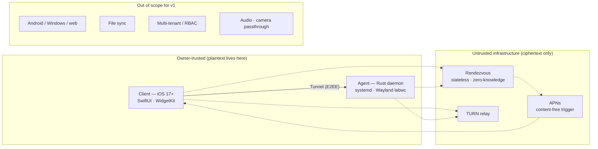

# 01 — Business Requirements Document (BRD)

> Vocabulary is defined in [00-GLOSSARY](00-GLOSSARY.md). Terms in **bold** (Agent, Client, Rendezvous, Tunnel, Channel, Snapshot, Series, Action, Alert Rule) carry exactly the Glossary meaning.

## 0. Document control

| Field | Value |
|---|---|
| Document | 01 — Business Requirements Document |
| Version | 1.0 |
| Date | 2026-07-24 |
| Author | Abo5 |
| Status | Draft |
| Owner role | Requirements Analyst |
| Approver | Owner (product sponsor) |
| Supersedes | — |
| Downstream documents | [02-SRS](02-SRS.md), [09-TEST-PLAN](09-TEST-PLAN.md), [10-ROADMAP](10-ROADMAP.md), [12-RISK-REGISTER](12-RISK-REGISTER.md) |

### Revision history

| Version | Date | Author | Change |
|---|---|---|---|
| 1.0 | 2026-07-24 | Abo5 | Initial issue. Establishes BR-01…BR-26, scope fence for v1, competitive position, cost model. |

---

## 1. Executive summary

A Raspberry Pi is the most widely deployed general-purpose computer in the home and the small lab, and the least well served by remote-access tooling. The existing options force a choice between three unappealing compromises: hand the vendor a plaintext view of the desktop (RealVNC, Raspberry Pi Connect), stand up and maintain an overlay network plus a separate VNC stack and a separate metrics stack (Tailscale + VNC + Prometheus + Grafana), or accept a browser-only administration console with no graphical session and no mobile story (Cockpit). None of them puts a live, trustworthy operational picture of the machine on a phone's Lock Screen.

This product is a single iOS application that pairs once with a Rust **Agent** on the Pi and thereafter provides — from any network, behind CGNAT, with no inbound ports opened — a live remote GUI desktop, an interactive shell, continuous telemetry with historical charts, alerting, and Home Screen / Lock Screen widgets. Every byte between phone and Pi is end-to-end encrypted under keys that exist only on those two endpoints. The **Rendezvous** service that introduces them is stateless and zero-knowledge: it can observe that two endpoints wish to talk and can relay ciphertext, and it can do nothing else.

The commercial thesis is not "cheaper VNC". It is **consolidation plus provable privacy**: one app replaces four tools, and the trust model is verifiable by the person most likely to buy it — a technically strong, security-minded owner who has already rejected the alternatives on exactly these grounds.

v1 targets a single **Owner**, one or more paired iOS devices, and one or more Agents. Multi-tenant, Android, desktop clients, file synchronisation, and any Windows target are explicitly out of scope and are not to be designed for.

---

## 2. Problem statement

### 2.1 The situation

The Owner runs one or more Raspberry Pis performing work that matters to them: a home-automation hub, a print server, a robotics controller, a media or backup node, a build runner, a lab instrument. These machines are headless most of the time but not always — some tasks genuinely require the graphical session. They live behind consumer NAT or carrier-grade NAT with no static address and no ability to forward ports. They fail silently: a full disk, a thermal throttle, a dead USB device, an OOM kill, a service that did not come back after a power cut.

### 2.2 The pain

| # | Pain | Consequence today |
|---|---|---|
| P-1 | No trustworthy remote graphical access | Owner either exposes VNC through a tunnel they must maintain, or accepts a vendor that terminates the session in its own cloud. |
| P-2 | No mobile-native operational view | Owner SSHes from a laptop, or squints at a Grafana page in Mobile Safari that was designed for a 27-inch monitor. |
| P-3 | Failure is discovered late | Nothing tells the Owner the disk hit 98% until something breaks. Home-lab alerting requires standing up a second stack. |
| P-4 | Tool sprawl | Remote desktop, shell, metrics collection, dashboards, and alerting are four to five separate systems with four to five separate trust boundaries and upgrade cycles. |
| P-5 | Network reachability | CGNAT, IPv6-only carriers, hotel Wi-Fi, and captive portals defeat naive solutions. Overlay networks solve this but add a permanent daemon and an account with a third party. |
| P-6 | Trust ambiguity | "End-to-end encrypted" is asserted by vendors and not verifiable by the user. The Owner cannot inspect what the relay sees. |

### 2.3 The gap this product closes

A phone-first, single-binary, single-app system where the **only** trusted components are the Agent process on the Pi and the Client process on the phone; where reachability is solved without an overlay network or an inbound port; and where the operational picture is glanceable on the Lock Screen without opening anything.

---

## 3. Business objectives and success metrics

| ID | Objective | Measurable success metric | Target (12 months post-v1) |
|---|---|---|---|
| OBJ-1 | Replace the four-tool stack with one app | % of surveyed active Owners who report having decommissioned at least two prior tools | ≥ 60% |
| OBJ-2 | Make remote access work everywhere | % of Sessions that establish successfully within 10 s on first attempt, across the field network matrix | ≥ 97% |
| OBJ-3 | Keep relay cost near zero | % of Session-minutes carried on a **Direct path** rather than a **Relayed path** | ≥ 80% |
| OBJ-4 | Deliver usable remote desktop on Pi 5 software encoding | % of remote-desktop Sessions meeting the NFR latency and frame-rate floor on LAN | ≥ 90% |
| OBJ-5 | Make failures visible before they bite | Median time from threshold breach on the Pi to Alert visible on the phone | ≤ 60 s |
| OBJ-6 | Earn trust by construction | Independent third-party review of the pairing and transport design completed with no unresolved high findings | 1 review, 0 open highs |
| OBJ-7 | Ship and sustain solo | Elapsed calendar time from M0 kickoff to App Store availability | ≤ 9 months |
| OBJ-8 | Retention proves the value | Day-30 retention of Owners who completed pairing | ≥ 55% |
| OBJ-9 | Support burden stays bounded | Support contacts per 100 active Owners per month | ≤ 4 |
| OBJ-10 | Accessibility is not an afterthought | Full app walkthrough passes VoiceOver and Dynamic Type audit at XXL | 100% of primary flows |

Metrics are measured from opt-in, privacy-preserving local counters exported by the Owner (see FR-9xx in [02-SRS](02-SRS.md)) and from support/field data. No telemetry about the Owner's machine leaves the Owner's devices without explicit consent.

---

## 4. Stakeholders and personas

### 4.1 Stakeholder map

| Stakeholder | Interest | Influence | Engagement |
|---|---|---|---|
| Owner (end user) | Everything. Sole user, sole buyer. | Decisive | Primary persona research, beta cohort |
| Solo developer / maintainer | Build feasibility, sustainable scope | Decisive | Author of all specs |
| Apple App Review | Compliance with remote-desktop, encryption, and background-execution rules | Blocking | Pre-submission review of guideline fit |
| Rendezvous host (VPS provider) | Uptime, egress cost | Moderate | SLA selection |
| TURN provider | Relay egress cost | Moderate | Contract / self-host decision |
| Raspberry Pi OS ecosystem (labwc, PipeWire, kernel) | API drift affecting capture and input | Moderate, uncontrollable | Version pinning, compatibility matrix |
| Security reviewer | Correctness of the E2EE claim | High at gate | Engaged before M6 exit |
| Open-source contributors (post-v1) | Extensibility | Low in v1 | Deferred |

### 4.2 Personas

#### Persona A — "Faisal", the security-minded infrastructure engineer *(primary)*

| Attribute | Detail |
|---|---|
| Age / role | 34, senior SRE at a payments company |
| Environment | Three Pis at home: a DNS/ad-blocking node, a NAS front-end, a lab Pi 5 with a display attached for GUI work. Fibre at home behind CGNAT. Travels 6–8 weeks a year. |
| Technical level | Reads RFCs for pleasure. Runs his own CA. Has audited two VPN vendors' claims and stopped using both. |
| Goals | Know his machines are healthy without thinking about it. Fix a stuck service from an airport lounge in under two minutes. Never grant a vendor plaintext. |
| Frustrations | "End-to-end encrypted" marketing he cannot verify. Maintaining a Grafana instance for four numbers he actually looks at. Tailscale is excellent but is one more identity provider in his threat model. |
| Buying trigger | Reads the pairing and key-handling design, verifies the fingerprint ceremony is real, sees that Rendezvous is stateless. |
| What kills the sale | Any account requirement. Any cloud-side session key. Any "we may collect diagnostic screenshots". |
| Success looks like | Lock Screen widget shows Pi temp and disk; a red Alert arrives 40 seconds after the disk crosses 95%; he opens the app with Face ID, runs an allow-listed **Action** to clear the journal, and closes it. |

#### Persona B — "Mara", the embedded/robotics developer *(primary)*

| Attribute | Detail |
|---|---|
| Age / role | 29, freelance robotics engineer |
| Environment | Pi 5 on a mobile robot chassis in a workshop she is not always in, plus a Pi 4 bench unit. Workshop has flaky Wi-Fi and a phone hotspot as backup. |
| Technical level | Strong Linux and Rust. Not a network engineer; does not want to be. |
| Goals | Watch the GUI of the robot's operator console while it runs a test she is not physically present for. Drop into a shell the second something looks wrong. Correlate a crash with the CPU temperature curve at that moment. |
| Frustrations | VNC over a hotspot is unusable and drops on network change. Screen recordings are after-the-fact. She loses the metric history exactly when the machine goes offline. |
| Buying trigger | Remote desktop that survives a Wi-Fi→cellular handover, plus telemetry that backfills after an outage rather than showing a hole. |
| What kills the sale | Remote desktop that is a slideshow on a Pi 5, or a dashboard that lies about gaps. |
| Success looks like | Test runs unattended; the Tunnel drops for four minutes; on reconnect the chart fills in the missing samples and she sees the thermal spike that caused the fault. |

#### Persona C — "Tom", the serious home-lab hobbyist *(secondary)*

| Attribute | Detail |
|---|---|
| Age / role | 47, product manager by day, deep home-lab hobby |
| Environment | One Pi 4 running Home Assistant and a Pi 5 running a 3D-print server with a camera. iPhone and iPad. |
| Technical level | Comfortable with the shell, follows instructions precisely, does not want to debug NAT traversal. |
| Goals | Glance at the print job and the Pi's health from the sofa. Restart the print service without finding a laptop. Get told before the SD card fills. |
| Frustrations | Every guide assumes port forwarding. He has read three conflicting tutorials on reverse tunnels. |
| Buying trigger | "Install one line on the Pi, scan a QR code, done." |
| What kills the sale | A setup that takes more than ten minutes or requires router configuration. |
| Success looks like | Home Screen widget, one tap into the dashboard, one tap to restart a service from the **Action** list. |

### 4.3 Anti-persona (explicitly not served in v1)

| Anti-persona | Why excluded |
|---|---|
| IT administrator managing a fleet of 200 Pis for an organisation | Requires multi-tenant, RBAC, SSO, central policy — a different product. Out of scope (see §6). |
| Non-technical family member who was handed a Pi | Cannot complete a fingerprint verification ceremony meaningfully; the trust model degrades to theatre. |
| Android or Windows user | Platform baseline is fixed to iOS 17+ and Raspberry Pi OS. |

---

## 5. Business rules

| ID | Rule | Enforced by |
|---|---|---|
| BRule-1 | Exactly one **Owner** identity exists per **Agent**. There is no user directory, no roles, and no delegation in v1. | Agent pairing state |
| BRule-2 | Trust is established only by an out-of-band **Pairing** ceremony with a verified **Identity fingerprint**. Trust On First Use is prohibited. | Pairing flow |
| BRule-3 | No plaintext of any Channel may exist outside the Agent process and the Client process — including push payloads and relay traffic. | Cryptographic design |
| BRule-4 | The Pi is the system of record for Series, Rollups, configuration, and policy. The Client holds a cache and nothing authoritative. | Data model |
| BRule-5 | The Agent never listens on a public inbound port. Both endpoints connect outbound. | Transport design |
| BRule-6 | Arbitrary command execution is reachable **only** through the `shell` Channel. **Actions** are a closed allow-list defined on the Pi. | Action subsystem |
| BRule-7 | Any destructive **Action** (reboot, shutdown, service stop) requires an explicit second confirmation in the Client. | Client UX |
| BRule-8 | Revoking a paired device takes effect at the Agent and is irreversible without a new Pairing ceremony. | Device management |
| BRule-9 | Observability degrades open: if the Tunnel drops, the Agent keeps recording locally and backfills on reconnect. | Agent recorder |
| BRule-10 | Any capability that can observe the screen, inject input, or open a PTY is individually revocable per paired device. | Capability policy |
| BRule-11 | The Owner can export all of their data (Series, config, audit log) in an open format at any time, without the vendor. | Export subsystem |
| BRule-12 | The product functions with the Rendezvous unavailable if the Client and Agent are on the same LAN. | Discovery design |

---

## 6. Scope

### 6.1 In scope for v1

| Area | Included |
|---|---|
| Pairing & identity | QR-based Pairing, verified fingerprint comparison, multiple paired iOS devices, per-device revocation, key rotation, recovery flow |
| Connectivity | Outbound-only tunnel; WebRTC DataChannel primary; TURN relay fallback; WebSocket-over-Rendezvous last resort; LAN direct path; content-free push wake |
| Telemetry | CPU (per-core, load, frequency), temperature and throttling state, memory and swap, disk usage and I/O, network throughput per interface, uptime, systemd unit states, process top-N, GPU/VideoCore state where exposed, power/undervoltage flags |
| Dashboard | Live **Snapshot**, historical **Series** charts with 1 h / 24 h / 7 d / 30 d ranges, Rollups, drill-down, gap-honest rendering |
| Remote desktop | Live video of the Wayland session, keyboard and pointer injection via `uinput`, resolution/quality controls, single active viewer |
| Remote shell | Interactive PTY over the encrypted Tunnel, ANSI/xterm-256 rendering, scrollback, resize, session persistence within a Session |
| Actions | Allow-listed operations defined on the Agent, confirmation gating, audit logging |
| Alerting | Owner-defined **Alert Rules** with thresholds and dwell time, push delivery, in-app triage, mute/snooze, alert history |
| Widgets | Home Screen (small/medium/large), Lock Screen (circular/rectangular/inline), StandBy; Live Activity for long-running Actions |
| Multi-agent | Multiple Agents paired to one Client; per-Agent dashboards, switching, and aggregate status |
| Diagnostics | Connection diagnostics, path type display, throughput/latency readouts, log export, data export |
| Localization | English (en) and Arabic (ar) with full RTL layout |
| Accessibility | VoiceOver, Dynamic Type, reduced motion, contrast, minimum hit targets |

### 6.2 Out of scope for v1 — decided, not deferred-by-accident

| Excluded | Decision rationale |
|---|---|
| **Multi-tenant / multi-user / RBAC** | Changes the entire identity and policy model. One Owner is a load-bearing simplification. |
| **Android client** | Doubles platform surface; the crypto and transport work would need a second implementation and a second review. |
| **macOS / iPadOS-optimised / web client** | iPhone-first. iPad runs in compatibility mode without a bespoke layout. |
| **File synchronisation / file browser / file transfer UI** | Large surface (conflict handling, large transfers, resumption). The Glossary reserves a `files` Channel for a future version; v1 ships no user-facing file feature. |
| **Windows or generic-x86 Agent** | Screen capture, input injection, and service management are all Linux/Wayland-specific. |
| **X11 session support** | Baseline is Wayland (labwc). Supporting both doubles the capture and input matrix. |
| **Audio streaming (Pi → phone or phone → Pi)** | Adds a codec, a sync problem, and CPU the Pi 5 does not have alongside software video encoding. |
| **Camera/USB device passthrough** | Out of the operational-control thesis. |
| **Cloud account, cloud backup, cross-device sync of settings** | Contradicts P4 ("the Pi is the source of truth") and introduces a server-side identity. |
| **Automated remediation / scripted runbooks / cron-like scheduling** | Actions are manual and allow-listed in v1. Automation is a post-v1 theme. |
| **Log aggregation / full journald search UI** | Diagnostics export only. A log search product is its own scope. |
| **Docker/container management UI** | Reachable via shell and Actions; a dedicated UI is post-v1. |
| **Wake-on-LAN / power control of the Pi itself when off** | The Agent cannot run when the Pi is off; out-of-band power is a hardware product. |
| **Third-party integrations (Home Assistant, MQTT, Prometheus exporters)** | Export exists; integrations are post-v1. |
| **Apple Watch app** | Widget/complication surface is a v1.1 candidate at most. |
| **Self-hostable Rendezvous as a supported, documented product** | The design permits it; supporting and documenting it as a product is post-v1. |

### 6.3 Scope boundary diagram

---

## 7. Assumptions

| ID | Assumption | If false |
|---|---|---|
| ASM-1 | The Owner has physical or console access to the Pi at least once, to install the Agent and complete Pairing. | Pairing cannot be bootstrapped; product is unusable. |
| ASM-2 | The Pi has outbound internet access on standard ports (443/UDP+TCP, STUN/TURN). | Falls back to LAN-only operation. |
| ASM-3 | The Pi is a model 4 or 5 with 2 GB RAM or more, on 64-bit Raspberry Pi OS Bookworm or Trixie. | Performance targets do not hold; unsupported. |
| ASM-4 | The graphical session, when present, is Wayland under labwc (or wayfire) with screencopy or the PipeWire portal available. | Remote desktop unavailable; telemetry and shell still function. |
| ASM-5 | The Owner's iPhone runs iOS 17.0 or later and can receive push notifications. | Alerts and wake-on-push degrade to foreground-only. |
| ASM-6 | The Owner can complete a fingerprint comparison ceremony and understands why it matters. | Trust model degrades; see anti-persona. |
| ASM-7 | Apple will approve a remote-desktop-capable app that controls hardware the user owns, subject to guideline compliance. | See RSK — App Store rejection; contingency in [12-RISK-REGISTER](12-RISK-REGISTER.md). |
| ASM-8 | A single developer can sustain three codebases (Rust Agent, Swift Client, Rendezvous) at v1 scope. | Roadmap slips; scope must be cut at M4. |
| ASM-9 | Relay traffic remains a minority of Session-minutes (see OBJ-3). | Cost model breaks; see §12. |
| ASM-10 | Raspberry Pi 5 has **no hardware H.264 encoder**; all video encoding is software. | (Stated as fact, not hope — all performance targets are derived from it.) |

---

## 8. Constraints

| ID | Constraint | Type | Implication for requirements |
|---|---|---|---|
| CON-1 | **App Store Review Guidelines** — remote-desktop functionality must control hardware the user owns; the app must not download or execute code that changes its features; encryption export compliance declaration required. | Compliance | Actions are an allow-list defined on the Pi, not remotely provisioned app behaviour. Shell is presented as user-owned-device access. |
| CON-2 | **Apple background execution limits** — no arbitrary background daemon; background refresh is opportunistic and budgeted; widget timelines are throttled by the system. | Platform | Widget freshness cannot be guaranteed by polling. Freshness must be push-triggered and every widget must render its own staleness. |
| CON-3 | **Push payloads must be content-free** to preserve E2EE. | Security | Alert content is fetched over the Tunnel after wake; notification text must be generated client-side from cached or fetched data. |
| CON-4 | **Raspberry Pi 5 CPU budget** — no hardware H.264 encoder; 4× Cortex-A76 @ 2.4 GHz shared with the Owner's actual workload. | Technical | Frame-rate/resolution targets must be conservative; encoder must be adaptive and yield to system load; a hard CPU ceiling is an NFR. |
| CON-5 | **Thermal envelope** — sustained encoding raises SoC temperature and can trigger throttling, which the product is simultaneously supposed to report. | Technical | Encoder must degrade before the Pi throttles; throttle state must be surfaced honestly. |
| CON-6 | **No public IP / CGNAT on either or both sides**, IPv6-only carriers, captive portals. | Technical | Mandatory relay fallback path and no reliance on inbound reachability. |
| CON-7 | **No inbound ports** (principle P2). | Architectural | Discovery and wake must be Rendezvous+push mediated. |
| CON-8 | **Rendezvous must remain stateless and zero-knowledge.** | Architectural | No session storage, no key escrow, no message archive. Availability risk is accepted and mitigated, not solved by adding state. |
| CON-9 | **Solo developer**, part-time-to-full-time, three languages/toolchains. | Delivery | Roadmap sequencing must produce a walking skeleton early; scope cuts must be pre-agreed. |
| CON-10 | **Build environment** — Xcode 16 on macOS is required for the Client; the Agent cross-compiles to aarch64. | Delivery | CI needs a macOS runner; TestFlight is the only pre-release distribution channel. |
| CON-11 | **Storage on the Pi is typically SD or modest NVMe** with finite write endurance. | Technical | Retention, Rollup, and write-amplification budgets are hard requirements, not tuning. |
| CON-12 | **Battery and thermal budget on iPhone** — sustained video decode plus network is expensive. | Platform | Explicit battery-drain NFR and automatic session timeouts. |
| CON-13 | **Localization to Arabic requires full RTL**, including charts, terminal, and remote-desktop chrome. | Product | Mirroring rules must be specified per surface; the terminal and video content themselves must not mirror. |
| CON-14 | **Legal/regulatory** — GDPR-style data-minimisation posture; the vendor must be able to state truthfully that it holds no user data. | Compliance | No analytics by default; opt-in only; no crash reports containing screen content. |

---

## 9. Business requirements (BR)

Priority uses MoSCoW: **M** = Must have for v1, **S** = Should have, **C** = Could have, **W** = Won't have in v1 (recorded to fix the boundary).

| ID | Business requirement | Priority | Rationale | Verified by |
|---|---|---|---|---|
| BR-01 | The system MUST let an Owner reach their Pi from any internet-connected network without configuring the router, opening inbound ports, or holding a static address. | M | The single largest adoption barrier (P-5, Tom). Defeats CGNAT by design. | UC-02, NFR reconnect/connect budgets |
| BR-02 | All content between Client and Agent MUST be end-to-end encrypted such that no operator of any intermediary can read or undetectably modify it. | M | The differentiating trust claim; the primary buying trigger for Faisal. | SEC block, third-party review |
| BR-03 | Trust between a Client device and an Agent MUST be established by an out-of-band ceremony with a human-verifiable fingerprint, never by trust-on-first-use. | M | Without verification the E2EE claim is unfalsifiable marketing. | UC-01 |
| BR-04 | Initial setup (install Agent → paired and showing live data) MUST be completable by a competent Linux user in ≤ 10 minutes. | M | Tom's abandonment threshold; drives support cost (OBJ-9). | Usability test |
| BR-05 | The Client MUST present a live operational Snapshot of each Agent: CPU, temperature and throttle state, memory, disk, network, uptime, and key service states. | M | The core daily-value loop. | UC-03 |
| BR-06 | The Client MUST present historical Series charts over at least 1 h, 24 h, 7 d and 30 d, with honest rendering of data gaps. | M | Mara's crash-correlation need; distinguishes from status-only tools. | UC-04 |
| BR-07 | The Agent MUST continue recording telemetry while disconnected and MUST backfill the Client on reconnect. | M | Principle P5. Data holes destroy the diagnostic value exactly when it matters. | UC-14 |
| BR-08 | The Client MUST provide a usable live remote GUI desktop of the Pi's Wayland session with keyboard and pointer input. | M | Category-defining capability; Mara's core job. | UC-05, UC-06 |
| BR-09 | Remote desktop performance targets MUST be set on the basis of software-only encoding on a Pi 5 and MUST degrade gracefully rather than stall. | M | CON-4. Overpromising here is the fastest route to a one-star review. | Performance benchmark suite |
| BR-10 | The Client MUST provide an interactive shell on the Pi over the encrypted Tunnel, without exposing SSH to the network. | M | Faisal's two-minute fix; avoids opening a second attack surface. | UC-07 |
| BR-11 | The Agent MUST expose a closed allow-list of named Actions; arbitrary execution MUST NOT be reachable through the Action mechanism. | M | BRule-6; contains blast radius and satisfies CON-1. | UC-08 |
| BR-12 | Destructive Actions MUST require explicit secondary confirmation in the Client. | M | Prevents a fat-fingered reboot of a live machine. | UC-08 |
| BR-13 | The Owner MUST be able to define Alert Rules over Series and receive push alerts within one minute of a sustained breach. | M | OBJ-5; converts the product from reactive to proactive. | UC-09 |
| BR-14 | Alert delivery MUST NOT place any Owner data in the push payload. | M | BR-02 / CON-3 consistency. | SEC block |
| BR-15 | The Client MUST offer Home Screen and Lock Screen widgets showing key metrics, each displaying the age of the data shown. | M | Tom's sofa glance; Faisal's ambient awareness. Staleness honesty is required by CON-2. | UC-10 |
| BR-16 | One Client MUST support multiple Agents, and one Agent MUST support multiple paired Client devices. | M | Faisal has three Pis; most Owners have a phone and will add another device. | UC-11 |
| BR-17 | The Owner MUST be able to revoke any paired device from any other paired device, or locally on the Pi, with effect at the Agent. | M | Device loss is the most likely real security event. | UC-12 |
| BR-18 | The system MUST provide a defined recovery path for a lost Client device, a lost Agent key, and a rotated key, without a vendor-held escrow. | M | No cloud account means no vendor-mediated reset; the path must exist and be documented. | UC-13 |
| BR-19 | Access to the Client's paired capabilities MUST be gated by device biometrics or passcode. | M | Phone theft otherwise yields full machine control. | SEC block |
| BR-20 | The Owner MUST be able to export all telemetry, configuration, and audit records in an open, documented format. | S | BRule-11; anti-lock-in is part of the trust proposition. | UC-03 / FR-9xx |
| BR-21 | The Client MUST support English and Arabic including full right-to-left layout. | S | Primary market includes RTL users; retrofitting RTL later is expensive. | Localization audit |
| BR-22 | The Client MUST meet an accessibility bar equivalent to WCAG 2.2 AA, including VoiceOver and Dynamic Type. | S | OBJ-10; also reduces App Review friction and widens the market. | Accessibility checklist |
| BR-23 | The Agent MUST NOT consume more than a defined ceiling of Pi CPU and memory while idle, and MUST yield to the Owner's workload. | M | The Pi is doing a job; the monitor must not become the load. | NFR benchmark |
| BR-24 | The Agent MUST bound its own storage growth through retention and Rollups appropriate to SD-card endurance. | M | CON-11; an unbounded time-series database on an SD card is a field failure. | NFR storage test |
| BR-25 | The system MUST surface which network path a Session is using (direct vs relayed) and basic quality figures, for self-diagnosis. | S | Reduces support contacts; Faisal will not trust a black box. | UC-02 / FR-9xx |
| BR-26 | The product MUST operate with no vendor-held user account and no server-side user data of any kind. | M | CON-14 and the core trust claim; also removes an entire class of breach risk. | Design inspection |
| BR-27 | The system WON'T provide file synchronisation, browsing, or transfer in v1. | W | §6.2. Recorded to prevent scope drift into the reserved `files` Channel. | Scope gate |
| BR-28 | The system WON'T support multi-tenant organisations, roles, or delegated access in v1. | W | §6.2. | Scope gate |
| BR-29 | The system WON'T ship an Android, web, or Windows-targeted component in v1. | W | §6.2. | Scope gate |
| BR-30 | The system WON'T stream audio in either direction in v1. | W | §6.2, CON-4. | Scope gate |

Traceability from every BR to FR/UC/TC is maintained in [02-SRS §8](02-SRS.md#8-traceability-matrix).

---

## 10. Competitive analysis

### 10.1 Feature comparison

Legend: ● full · ◐ partial / requires assembly · ○ absent

| Capability | **This product** | Raspberry Pi Connect | Tailscale + VNC (+ Grafana) | RealVNC Connect | Cockpit |
|---|---|---|---|---|---|
| Remote GUI desktop | ● Native iOS, adaptive software encode | ● Browser-based (screen sharing) | ● Via VNC client over overlay | ● Mature, multi-platform | ○ (no graphical session) |
| Interactive shell | ● In-app PTY over E2EE Tunnel | ● Browser terminal | ◐ SSH via separate client | ◐ Add-on | ● Browser terminal |
| Continuous telemetry collection | ● Built-in, persisted on Pi | ○ | ◐ Requires node_exporter + Prometheus | ○ | ◐ Live only, minimal history |
| Historical charts (7 d / 30 d) | ● Built-in with Rollups | ○ | ● Grafana (separate stack) | ○ | ○ |
| Alerting with push to phone | ● Built-in, content-free push | ○ | ◐ Alertmanager + a notifier | ○ | ○ |
| Home/Lock Screen widgets | ● First-class | ○ | ○ | ○ | ○ |
| Native iOS app | ● Purpose-built | ◐ Browser | ◐ Tailscale app + third-party VNC app | ● Viewer app | ◐ Browser |
| Works behind CGNAT with no ports | ● | ● | ● | ● | ○ (needs reachability) |
| End-to-end encrypted, vendor cannot see session | ● By construction, verified fingerprint | ◐ Vendor-operated relay/broker | ● (WireGuard E2EE; control plane is vendor-held) | ◐ Vendor-managed keys/cloud | n/a (self-hosted, but exposure is on you) |
| No vendor account required | ● | ○ (Raspberry Pi ID) | ○ (SSO identity provider) | ○ (RealVNC account) | ● |
| Verified pairing (no TOFU) | ● | ○ | ◐ Device auth via IdP | ○ | ○ |
| Zero server-side user data | ● Stateless Rendezvous | ○ | ○ (device inventory, ACLs) | ○ | ● |
| Allow-listed safe Actions with confirmation | ● | ○ | ○ | ○ | ◐ systemd unit control |
| Multi-Agent from one app | ● | ● | ● | ● | ◐ (dashboard federation) |
| Offline recording + backfill | ● | ○ | ◐ Prometheus scrapes fail; gaps remain | ○ | ○ |
| Cost to Owner | App purchase + own Rendezvous/TURN or bundled | Free | Free tier + self-hosted stack | Free tier / paid | Free |
| Setup effort | Install + scan QR | Install + sign in | Install overlay + VNC server + exporter + Prometheus + Grafana + Alertmanager | Install + sign in | Install |
| Ongoing maintenance | One binary, one app | Vendor-managed | 4–6 components to patch | Vendor-managed | One package |

### 10.2 Honest assessment of each competitor

| Competitor | What it genuinely does better | Where it leaves the Owner |
|---|---|---|
| **Raspberry Pi Connect** | Official, free, zero-friction, first-party support, works in any browser. The default answer for most people. | No telemetry, no history, no alerting, no widgets, no native app, requires a Raspberry Pi ID, session brokered by a vendor-operated service. It is a remote-access tool, not an operations tool. |
| **Tailscale + VNC + Prometheus/Grafana** | Best-in-class networking; genuinely E2EE data plane; unlimited flexibility; you keep your data. | It is five products. The Owner becomes the integrator and the on-call. Mobile experience is poor. Control plane and ACLs live with a vendor and an identity provider. Backfill after outage is not solved. |
| **RealVNC Connect** | Extremely mature, fast, cross-platform, excellent input handling and clipboard, decades of hardening. | Account required; key and session brokerage sit with the vendor; no telemetry/alerting/widget story; licensing complexity for multiple devices. |
| **Cockpit** | Excellent free web admin console; real service, storage, and log management; self-hosted, no vendor. | No graphical desktop; no mobile-native experience; no push alerting; no widgets; you must solve reachability yourself, which is exactly the hard part. |

### 10.3 Why build this anyway

The honest position: **none of the four is a bad product, and three of them are better than this one will be at their single specialty on day one.** Raspberry Pi Connect will be easier to install. RealVNC will render a desktop faster. Grafana will draw a better chart. Cockpit will manage storage more thoroughly.

The gap they all share is that the Owner's actual job — *"is my Pi healthy, and can I fix it right now, from my phone, without trusting anyone"* — is spread across four products, three trust boundaries, and two form factors. The wins available are:

1. **Consolidation with a single trust boundary.** One pairing, one key hierarchy, one thing to audit. Four tools mean four vendors' security postures multiplied together.
2. **A trust claim that is verifiable rather than asserted.** Verified-fingerprint pairing plus a stateless Rendezvous means the E2EE claim can be checked by the buyer. Every competitor either holds an account, brokers the session, or both.
3. **Phone-native operations, not a phone-shaped web page.** Widgets and Lock Screen presence are not a feature bullet; they are a different interaction model. Nothing in the category has them.
4. **Telemetry that survives the outage.** Backfill-on-reconnect is the difference between a monitoring tool and a monitoring tool that works during the incident.
5. **Contained blast radius by default.** Allow-listed Actions with confirmation, plus a separately revocable shell capability, is a safer default than "here is a full desktop, good luck".
6. **The moat is the intersection, not any single axis.** Anyone can build one of these features; the cost of assembling all six under one verifiable trust model is the defensible part.

**Where this product will lose, and we accept it:** raw remote-desktop frame rate on constrained hardware; breadth of platform support; installation simplicity versus a first-party official tool; ecosystem and integrations. Competing on any of those is a losing move and is deliberately not attempted.

---

## 11. Success criteria for v1

### 11.1 Release acceptance (business level)

| ID | Criterion | Threshold |
|---|---|---|
| SC-1 | All Must-have BRs verified against their mapped test cases | 100% pass |
| SC-2 | Pairing ceremony completed by 8 of 8 beta Owners unaided, using written docs only | ≥ 7/8 |
| SC-3 | Median setup time (install → live data) in beta | ≤ 10 min |
| SC-4 | Session establishment success across the network matrix in [09-TEST-PLAN](09-TEST-PLAN.md) | ≥ 97% |
| SC-5 | Remote desktop meets its NFR floor on LAN and on good LTE | 100% of benchmark runs |
| SC-6 | Zero unresolved High or Critical security findings | 0 |
| SC-7 | Agent idle CPU and memory within NFR ceilings over a 7-day soak | 0 breaches |
| SC-8 | Storage growth over a 30-day soak within the NFR budget | within budget |
| SC-9 | Accessibility checklist pass on all primary flows | 100% |
| SC-10 | Arabic RTL audit pass with no clipped or mirrored-in-error surfaces | 0 defects of severity ≥ major |
| SC-11 | App Store submission accepted | Approved |
| SC-12 | Crash-free session rate in beta | ≥ 99.5% |

### 11.2 Leading indicators post-launch

| Indicator | Healthy | Investigate |
|---|---|---|
| Direct-path share of Session-minutes | ≥ 80% | < 65% (relay cost and latency risk) |
| Median Alert latency | ≤ 60 s | > 120 s |
| Widget staleness at open (p50) | ≤ 15 min | > 45 min (CON-2 pressure) |
| Pairing abandonment rate | ≤ 10% | > 20% (onboarding defect) |
| Support contacts / 100 Owners / month | ≤ 4 | > 8 |
| Day-30 retention | ≥ 55% | < 40% |

---

## 12. Cost model (high level)

### 12.1 Build cost — solo developer

Derived from [10-ROADMAP](10-ROADMAP.md) milestone estimates.

| Phase | Engineer-weeks | Notes |
|---|---|---|
| M0 spike / feasibility | 3 | Encoding feasibility on Pi 5 is the pivotal unknown |
| M1 tunnel + pairing | 7 | Highest-risk correctness work |
| M2 telemetry + dashboard | 6 | |
| M3 shell | 3 | |
| M4 remote desktop | 8 | Largest single item; software encoding tuning |
| M5 widgets + alerts | 5 | Push plumbing plus WidgetKit constraints |
| M6 hardening + multi-agent | 6 | Includes security review remediation |
| Contingency @ 20% | 8 | |
| **Total** | **46 engineer-weeks** | ≈ 9 calendar months at a sustainable solo pace |

### 12.2 Fixed and recurring costs

| Item | Cadence | Estimate (USD) | Note |
|---|---|---|---|
| Apple Developer Program | Annual | 99 | Mandatory |
| Rendezvous VPS (small, 2 vCPU) | Monthly | 6–12 | Stateless; horizontally trivial to scale |
| Domain + TLS | Annual | 15 | TLS via ACME |
| TURN relay egress | Monthly, variable | 0.01–0.05 / GB | Dominant variable cost; see §12.3 |
| Push (APNs) | — | 0 | Content-free triggers only |
| Test hardware (Pi 5 8 GB, Pi 4 4 GB, PSU, NVMe, display) | One-off | ~350 | Both models needed for the matrix |
| Second iPhone for multi-device tests | One-off | ~450 (or existing) | Required for UC-11/UC-12 |
| macOS build machine | One-off | 0 (assumed owned) | CON-10 |
| Third-party security review | One-off | 4,000–12,000 | OBJ-6; scope-dependent |
| Code signing / notarisation for Agent packages | — | 0 | Linux packages signed with own key |

### 12.3 Relay cost sensitivity — the number that matters

Relay cost scales with the share of Session-minutes on a **Relayed path** and with remote-desktop bitrate, which dwarfs telemetry.

| Scenario | Relayed share | Avg remote-desktop bitrate | Desktop use / Owner / month | Relay GB / Owner / month | Cost @ $0.02/GB |
|---|---|---|---|---|---|
| Optimistic (OBJ-3 met) | 15% | 1.5 Mbit/s | 2 h | ≈ 0.20 GB | ≈ $0.004 |
| Expected | 30% | 2.0 Mbit/s | 4 h | ≈ 1.08 GB | ≈ $0.022 |
| Pessimistic (CGNAT both ends common) | 60% | 3.0 Mbit/s | 8 h | ≈ 6.48 GB | ≈ $0.13 |
| Heavy user, pessimistic path | 60% | 3.0 Mbit/s | 30 h | ≈ 24.3 GB | ≈ $0.49 |

Telemetry-only traffic is negligible by comparison (order of 1–5 MB per Owner per day even when fully relayed). Conclusion: **relay cost is bounded and manageable at hobby scale, but is entirely driven by remote desktop.** A per-Owner monthly relay budget with graceful degradation (bitrate cap on relayed paths) is therefore a requirement, not an optimisation — see FR-1xx and RSK entries in [12-RISK-REGISTER](12-RISK-REGISTER.md).

### 12.4 Revenue posture (v1)

One-time paid app purchase, no subscription, no account. Rendezvous and TURN are operated by the developer at the modelled cost; the design permits an Owner to point at their own Rendezvous/TURN, which is the pressure valve if relay cost ever inverts the unit economics. Break-even against the modelled fixed costs is reached at low hundreds of unit sales; this is a sustainability model, not a venture model, and the roadmap is sized accordingly.

---

## 13. Open business questions

Tracked here at business level; technical TBDs live in [02-SRS §9](02-SRS.md#9-open-questions--tbd-register).

| ID | Question | Needed by | Owner |
|---|---|---|---|
| BQ-1 | One-time purchase vs. a small optional subscription that funds relay for heavy users? | M5 | Owner/sponsor |
| BQ-2 | Is a bundled developer-operated Rendezvous acceptable to the primary persona, or must self-hosting be documented at v1? | M1 | Owner/sponsor |
| BQ-3 | Scope and budget of the third-party security review (full protocol review vs. implementation audit)? | M6 | Owner/sponsor |
| BQ-4 | Beta cohort size and recruitment channel? | M3 | Owner/sponsor |
| BQ-5 | Is a Pi 4 a supported v1 target for remote desktop, or telemetry+shell only? | M0 exit | Owner + architecture |
