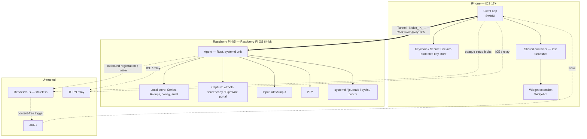
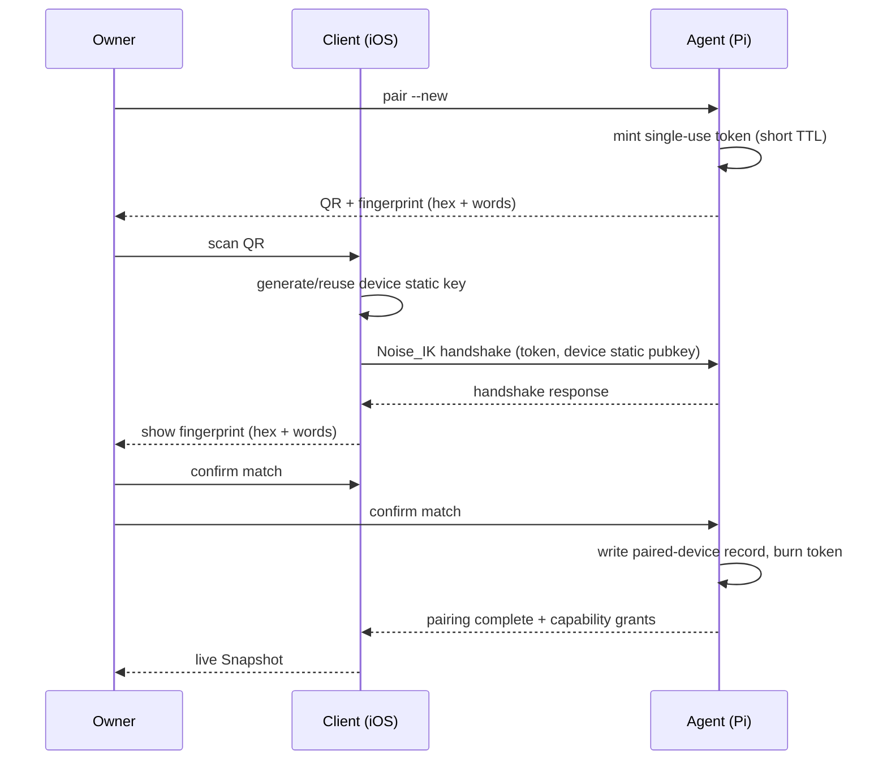
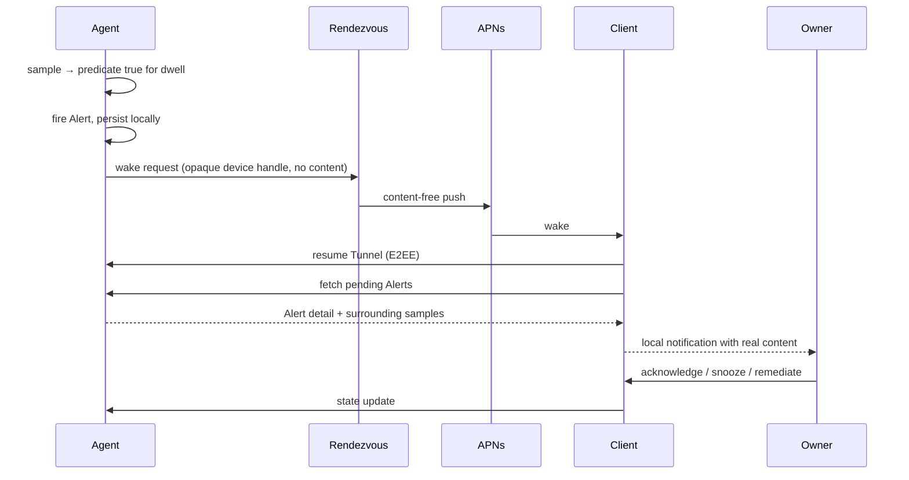

# 02 — Software Requirements Specification (SRS)

> All terms follow [00-GLOSSARY](00-GLOSSARY.md). RFC 2119 keywords (**MUST**, **MUST NOT**, **SHOULD**, **MAY**) are normative.

| Field | Value |
|---|---|
| Document | 02 — Software Requirements Specification |
| Version | 1.0 |
| Date | 2026-07-24 |
| Author | Abo5 |
| Status | Draft |
| Basis | IEEE 830 / ISO-IEC-IEEE 29148 structure |
| Upstream | [01-BRD](01-BRD.md) |
| Downstream | [03-ARCHITECTURE](03-ARCHITECTURE.md), [04-SECURITY-E2EE](04-SECURITY-E2EE.md), [05-PROTOCOL](05-PROTOCOL.md), [06-DATA-MODEL](06-DATA-MODEL.md), [07-UX-SPEC](07-UX-SPEC.md), [08-WIDGETS](08-WIDGETS.md), [09-TEST-PLAN](09-TEST-PLAN.md) |

### Revision history

| Version | Date | Author | Change |
|---|---|---|---|
| 1.0 | 2026-07-24 | Abo5 | Initial issue: UC-01…UC-14 (14), FR-001…FR-912 (130), NFR-001…NFR-055 (55), SEC-001…SEC-036 (36), traceability, open questions. |

---

## 1. Introduction

### 1.1 Purpose

This document specifies the complete functional, non-functional, and security requirements for the system described in [01-BRD](01-BRD.md): an end-to-end encrypted iOS application (**Client**) that remotely monitors and controls one or more Raspberry Pi machines running a Rust daemon (**Agent**), introduced to each other by a stateless, zero-knowledge **Rendezvous** service.

It is the contract between requirements and implementation. Every requirement here is atomic, uniquely numbered, and verifiable by at least one test case in [09-TEST-PLAN](09-TEST-PLAN.md). Architecture, cryptographic construction, wire format, storage schema, and screen design are specified in their own documents and are **referenced, not restated**, here.

### 1.2 Intended audience

| Reader | Read |
|---|---|
| Implementer (Agent, Client, Rendezvous) | §3 use cases, §4 functional, §5 non-functional, §6 security in full |
| Architect | §2, §5, §7 — then [03-ARCHITECTURE](03-ARCHITECTURE.md) |
| Test engineer | §3, §4, §5, §6, §8 — then [09-TEST-PLAN](09-TEST-PLAN.md) |
| Security reviewer | §6 first, then §3 UC-01/UC-12/UC-13, then [04-SECURITY-E2EE](04-SECURITY-E2EE.md) |
| Owner / sponsor | §2, §3, §8 |

### 1.3 Scope

In scope: everything listed in [01-BRD §6.1](01-BRD.md#61-in-scope-for-v1). Out of scope: everything listed in [01-BRD §6.2](01-BRD.md#62-out-of-scope-for-v1--decided-not-deferred-by-accident). The `files` **Channel** named in the Glossary is **reserved in the protocol but unimplemented and unexposed in v1**; no requirement in this document may be satisfied by a file-transfer feature.

### 1.4 References

| Ref | Document |
|---|---|
| R1 | [00-GLOSSARY](00-GLOSSARY.md) |
| R2 | [01-BRD](01-BRD.md) |
| R3 | [03-ARCHITECTURE](03-ARCHITECTURE.md) |
| R4 | [04-SECURITY-E2EE](04-SECURITY-E2EE.md) |
| R5 | [05-PROTOCOL](05-PROTOCOL.md) |
| R6 | [06-DATA-MODEL](06-DATA-MODEL.md) |
| R7 | [07-UX-SPEC](07-UX-SPEC.md) |
| R8 | [08-WIDGETS](08-WIDGETS.md) |
| R9 | [09-TEST-PLAN](09-TEST-PLAN.md) |
| R10 | [11-AGENT-DEPLOYMENT](11-AGENT-DEPLOYMENT.md) |
| R11 | [12-RISK-REGISTER](12-RISK-REGISTER.md) |
| R12 | Noise Protocol Framework, revision 34 — `Noise_IK` pattern |
| R13 | RFC 7748 (X25519), RFC 8439 (ChaCha20-Poly1305), RFC 8656 (TURN), RFC 8445 (ICE), RFC 8831/8832 (WebRTC DataChannel) |
| R14 | RFC 2119 / RFC 8174 — requirement keywords |
| R15 | Apple App Store Review Guidelines; Apple Human Interface Guidelines; WidgetKit and Background Tasks documentation |
| R16 | WCAG 2.2 Level AA (used as the accessibility yardstick for a non-web product) |
| R17 | wlroots `zwlr_screencopy_v1`; XDG Desktop Portal `ScreenCast`; PipeWire; Linux `uinput` |

### 1.5 Requirement attributes

Every functional requirement carries: **ID**, **Statement**, **Priority** (M/S/C per MoSCoW, matching [01-BRD §9](01-BRD.md#9-business-requirements-br)), and **Verification method**:

| Method | Meaning |
|---|---|
| **T** Test | Executed test with a pass/fail assertion, automated where possible |
| **D** Demo | Observed operation of the assembled system against a script |
| **I** Inspection | Review of code, configuration, artefacts, or UI against the statement |
| **A** Analysis | Reasoning over measurements, models, or logs (used for statistical and load claims) |

---

## 2. Overall description

### 2.1 Product perspective

The system is new and self-contained; it replaces no existing component of the Owner's stack by integration, only by substitution. It comprises three deployable units and one platform dependency:

Fixed technical baseline (not open for redesign in this document; owned by [03-ARCHITECTURE](03-ARCHITECTURE.md)):

| Element | Baseline |
|---|---|
| Agent | Rust, single binary, systemd service, Raspberry Pi OS Bookworm/Trixie 64-bit, Wayland session under labwc |
| Client | iOS 17+, Swift 6, SwiftUI, WidgetKit; built with Xcode 16 on macOS |
| Rendezvous | Stateless, zero-knowledge signalling + content-free push trigger; never sees plaintext |
| Cryptography | Noise_IK over X25519 with ChaCha20-Poly1305; Pairing by QR plus verified **Identity fingerprint** (TOFU rejected) |
| Transport | WebRTC DataChannel primary → TURN relay fallback → WebSocket-over-Rendezvous last resort. No inbound ports on the Pi |
| Screen capture | wlroots `zwlr_screencopy_v1` or the PipeWire `ScreenCast` portal |
| Video encoding | **Software only — Raspberry Pi 5 has no hardware H.264 encoder** |
| Input injection | Linux `uinput` |
| Shell | PTY streamed over the encrypted Tunnel; not SSH-over-the-wire |

### 2.2 Product functions (summary)

| Function group | Summary |
|---|---|
| Pairing & identity | One-time QR ceremony with fingerprint verification; multi-device; revocation; rotation; recovery |
| Connectivity | Outbound-only Tunnel establishment, path selection and failover, Channel multiplexing, resumption |
| Telemetry & dashboard | Sampling, persistence, Rollups, retention, live **Snapshot**, historical **Series**, drill-down, backfill |
| Remote desktop | Wayland capture, adaptive software encoding, streaming, pointer/keyboard injection, clipboard |
| Remote shell | PTY allocation, terminal emulation, resize, scrollback, capability gating |
| Actions | Allow-listed catalogue, parameter validation, confirmation, execution, audit |
| Alerting | Rule definition, Agent-side evaluation, dwell/hysteresis, content-free push, triage |
| Widgets | Home/Lock Screen/StandBy rendering, staleness display, refresh strategy, Live Activities |
| Multi-agent & devices | Agent list and switching, paired-device management, per-device capability grants |
| Settings & diagnostics | Biometric gate, path diagnostics, audit view, export, localization, retention control |

### 2.3 User classes and characteristics

| Class | Count in v1 | Characteristics | Privileges |
|---|---|---|---|
| **Owner** | Exactly 1 per Agent | Technically strong, security-minded (see [01-BRD §4.2](01-BRD.md#42-personas)); operates through one or more paired Client devices | All capabilities, subject to per-device grants |
| **Paired Client device** | 1..8 per Agent | An authenticated device instance, not a person | Capabilities granted at Pairing, individually revocable |
| **Local console user** | 0..1 | Someone with physical/console access to the Pi | Can create Pairing invitations, revoke devices, stop the Agent; is by definition already fully privileged on the machine |
| **Rendezvous operator** | 1 | Untrusted by design | May observe metadata (endpoint identifiers, timing, size); cannot read, forge, or replay any Channel content |
| **TURN operator** | 0..1 | Untrusted by design | May observe ciphertext volume and timing |

There is no administrator class, no read-only class, and no delegated user in v1 (BRule-1).

### 2.4 Operating environment

| Component | Environment |
|---|---|
| Agent | Raspberry Pi 4 (≥ 2 GB) or Pi 5 (≥ 4 GB recommended); Raspberry Pi OS Bookworm or Trixie, 64-bit; Linux ≥ 6.1; systemd ≥ 252; Wayland session under labwc (wayfire tolerated); PipeWire ≥ 0.3.65 where the portal path is used; `/dev/uinput` present; ext4 on SD or NVMe |
| Client | iPhone, iOS 17.0+; Face ID / Touch ID / passcode available; APNs reachable; camera for QR scan |
| Widget extension | Same device; WidgetKit timeline budget; shared app group container |
| Rendezvous | Any small Linux VPS or edge runtime; stateless; horizontally scalable; TLS terminated at the service |
| TURN | RFC 8656 server, self-hosted or contracted |
| Networks | Home Wi-Fi, enterprise Wi-Fi with client isolation, cellular (LTE/5G), CGNAT on either or both sides, IPv6-only carriers, captive portals, MTU-constrained links |

### 2.5 Design and implementation constraints

Restated from [01-BRD §8](01-BRD.md#8-constraints) as they bind requirements here.

| ID | Constraint | Requirements affected |
|---|---|---|
| CON-1 | App Store guidelines: remote control of user-owned hardware only; no remotely provisioned app behaviour; encryption export declaration | FR-501, FR-503, SEC-025, NFR-055 |
| CON-2 | iOS background execution and WidgetKit timeline budgets | FR-706, FR-704, NFR-011, NFR-021 |
| CON-3 | Push payloads must be content-free | FR-605, FR-606, SEC-014 |
| CON-4 | Pi 5 has no hardware H.264 encoder; software encoding only | FR-303, FR-304, FR-306, NFR-004…NFR-008, NFR-013 |
| CON-5 | Thermal envelope; sustained encode can induce the throttling the product reports | FR-306, FR-202, NFR-014 |
| CON-6 | CGNAT / no public IP on either side | FR-105…FR-108, NFR-019 |
| CON-7 | No inbound ports on the Pi | FR-101, FR-102, SEC-025 |
| CON-8 | Rendezvous must remain stateless and zero-knowledge | FR-103, SEC-011…SEC-014 |
| CON-9 | Solo developer | Prioritisation across all blocks; see [10-ROADMAP](10-ROADMAP.md) |
| CON-11 | SD-card write endurance | FR-210…FR-212, NFR-025…NFR-027 |
| CON-12 | iPhone battery and thermal budget | NFR-012, FR-410, FR-308 |
| CON-13 | Arabic requires full RTL | NFR-034, NFR-035, FR-908 |

### 2.6 Assumptions and dependencies

Assumptions ASM-1…ASM-10 in [01-BRD §7](01-BRD.md#7-assumptions) apply unchanged. External dependencies whose drift can invalidate requirements:

| Dependency | Requirement exposure | Risk ref |
|---|---|---|
| wlroots screencopy protocol / labwc | FR-302, FR-301 | RSK-08 |
| XDG Desktop Portal + PipeWire | FR-302 | RSK-08 |
| `/dev/uinput` permissions and udev rules | FR-309, FR-310 | RSK-08 |
| WebRTC bindings usable from Swift 6 and from Rust | FR-106, FR-110 | RSK-10 |
| APNs availability and delivery behaviour | FR-605, FR-704 | RSK-03 |
| Rendezvous availability | FR-102, FR-104 | RSK-07 |
| Noise implementation correctness | SEC-001…SEC-010 | RSK-05 |
| Apple review outcome | Whole product | RSK-04 |

---

## 3. Use cases

Convention: each use case names one primary actor, its preconditions, a numbered main flow, alternate flows (A-n, valid variations), exception flows (E-n, failures), and postconditions. "Owner" acts through the Client unless stated.

### UC-01 — First-run Pairing

| Field | Value |
|---|---|
| **Actor** | Owner (physically at the Pi, or on its console) |
| **Goal** | Establish mutual verified trust between one Client device and one Agent |
| **Preconditions** | Agent installed and running as a systemd service; Agent static key generated; Client installed; camera permission grantable; Pi has outbound internet or shares a LAN with the phone |
| **Postconditions (success)** | Agent holds a paired-device record for the Client; Client holds the Agent's static public key, fingerprint, and a display name; a Tunnel can be established without further ceremony |
| **Traces** | BR-03, BR-04; FR-001…FR-013; SEC-001…SEC-006 |

**Main flow**

1. Owner runs the Agent's pairing command on the Pi console (or opens the Agent's local-only pairing screen on the attached display).
2. Agent generates a single-use pairing token with a short expiry and renders a QR code containing: Agent identifier, Agent static public key, Rendezvous endpoint, pairing token, expiry, and protocol version.
3. Agent displays its **Identity fingerprint** in both hex and word-sequence form alongside the QR.
4. Owner opens the Client, chooses "Pair a new Pi", and grants camera access.
5. Client scans the QR and parses it; on parse success it generates (or reuses) this device's static key pair in the platform key store.
6. Client performs a Noise_IK handshake to the Agent, authenticated by the scanned Agent key and the pairing token.
7. Client displays the fingerprint it derived from the key it actually completed a handshake with, in the same hex and word forms.
8. Owner compares the fingerprint on the phone against the one on the Pi and confirms they match by an explicit affirmative action on the Client.
9. Agent requires the equivalent confirmation on its side (console keypress or on-screen confirm) before it writes the paired-device record.
10. Client prompts for a display name for this Agent and for this device; both are stored.
11. Agent writes the paired-device record with default capability grants and invalidates the pairing token.
12. Client establishes a normal Session and renders the first live **Snapshot**.

**Alternate flows**

- **A-1 Camera unavailable or QR unreadable.** Owner selects manual entry; Agent displays the same payload as a short alphanumeric code; Client accepts typed entry; flow resumes at step 6.
- **A-2 LAN pairing.** Client discovers the Agent on the local link and pairs without contacting Rendezvous; flow is otherwise identical (FR-009).
- **A-3 Pairing an additional device.** Owner initiates the invitation from an already-paired device instead of the Pi console; the existing device's Session carries the invitation request; fingerprint verification still occurs against the Agent key (UC-11).
- **A-4 Re-pairing a device that was previously paired.** Agent replaces the existing record for that device key rather than creating a duplicate (FR-013).

**Exception flows**

- **E-1 Fingerprints do not match.** Owner declines at step 8. Client aborts, discards the session, records a local security event, and shows guidance that a mismatch may indicate an active attack. No record is written on either side.
- **E-2 Token expired or already used.** Agent rejects the handshake; Client shows "invitation expired" and offers to restart. No partial state persists.
- **E-3 No confirmation within the ceremony timeout.** Both sides abort and discard state.
- **E-4 Agent already at its paired-device limit.** Agent rejects with a specific reason; Client instructs the Owner to revoke a device first (UC-12).
- **E-5 Protocol version incompatible.** Handshake is refused with a version-mismatch reason; Client tells the Owner which side to update. No downgrade is negotiated (SEC-009).

---

### UC-02 — Unlock and connect

| Field | Value |
|---|---|
| **Actor** | Owner |
| **Goal** | Open the Client and reach a live authenticated Session with a paired Agent from any network |
| **Preconditions** | Pairing complete; Agent running and registered outbound with Rendezvous; phone has network |
| **Postconditions** | An authenticated Tunnel exists; the `control` and `telemetry` Channels are open; path type is known and displayed |
| **Traces** | BR-01, BR-19, BR-25; FR-101…FR-115; SEC-015…SEC-018 |

**Main flow**

1. Owner opens the Client. The app presents a locked state with no Owner data visible.
2. Client requires biometric or passcode authentication before unsealing key material.
3. On success the Client selects the last-used Agent (or the Agent list if several).
4. Client requests connection setup from Rendezvous using an opaque, non-correlatable identifier for the target Agent.
5. Rendezvous signals the Agent over the Agent's existing outbound registration channel.
6. Both endpoints gather ICE candidates and exchange opaque setup blobs through Rendezvous.
7. A WebRTC DataChannel is established on the best available path.
8. Client and Agent complete a Noise_IK handshake over that DataChannel, each authenticating the other's static key against its stored pairing record.
9. Channels `control` and `telemetry` are opened; the Agent sends the current **Snapshot** and any backfill summary.
10. Client renders the dashboard and displays the path type (LAN / direct / relayed) and round-trip time.

**Alternate flows**

- **A-1 LAN direct.** The Agent is discovered on the local link; the Client connects without Rendezvous (FR-115).
- **A-2 Direct path fails.** ICE fails to produce a working candidate pair within the budget; the Tunnel is established over TURN and the UI shows "relayed" (FR-107).
- **A-3 TURN unavailable or blocked.** The Tunnel falls back to a WebSocket through Rendezvous; the UI shows "relayed via Rendezvous" and a reduced-quality notice (FR-108).
- **A-4 Warm resume.** A recent Session's parameters allow an abbreviated re-establishment within the resumption window (FR-110).

**Exception flows**

- **E-1 Agent unreachable.** After the connect budget expires the Client shows last-known Snapshot with its age, an explicit "offline" state, and the time of last contact. It does not fabricate current values.
- **E-2 Agent key does not match the stored pairing record.** The Client aborts, refuses to connect, and surfaces a security warning naming the possibility of key rotation (UC-13) or impersonation. It does not offer "trust anyway" (SEC-002).
- **E-3 Biometric authentication fails or is cancelled.** The app remains locked; no cached Owner data is rendered beyond what the widget policy allows.
- **E-4 Rendezvous unavailable.** LAN discovery is attempted; if that fails the Client reports an infrastructure error distinct from "Pi offline" (FR-109).
- **E-5 This device has been revoked.** The Agent refuses the handshake with a revoked reason; the Client erases its pairing record for that Agent and returns to an unpaired state for it (FR-807).

---

### UC-03 — View the dashboard

| Field | Value |
|---|---|
| **Actor** | Owner |
| **Goal** | See the current health of an Agent at a glance |
| **Preconditions** | UC-02 completed, or a cached Snapshot exists |
| **Postconditions** | Owner has an accurate current or explicitly-aged view of CPU, temperature and throttle state, memory, disk, network, uptime, and watched services |
| **Traces** | BR-05, BR-20; FR-201…FR-215 |

**Main flow**

1. Client subscribes to the `telemetry` Channel at the live sampling rate.
2. Agent streams **Snapshot** deltas.
3. Client renders tiles: CPU (aggregate and per-core), SoC temperature with throttle/undervoltage flags, memory and swap, per-mount disk usage, per-interface network throughput, uptime, and the watched systemd unit states.
4. Each tile shows a sparkline over the last hour drawn from cached **Series** data.
5. Client writes the latest Snapshot to the shared container for widget consumption.
6. Owner pulls to refresh; the Client requests an immediate sample rather than waiting for the next tick.

**Alternate flows**

- **A-1 Cached render.** While the Tunnel is still establishing, the Client renders the cached Snapshot with a prominent age label and a connecting indicator.
- **A-2 Reduced telemetry.** On a relayed path the Client requests a lower snapshot rate to conserve relay bandwidth (FR-114).

**Exception flows**

- **E-1 A metric source is unavailable** (for example no thermal sensor on that model): the tile renders "unavailable", not zero.
- **E-2 Tunnel drops mid-view.** The dashboard freezes the last values, greys them, and starts an age counter; reconnect is automatic (UC-14).

---

### UC-04 — Drill into a metric's history

| Field | Value |
|---|---|
| **Actor** | Owner |
| **Goal** | Understand a metric's behaviour over time and correlate it with an event |
| **Preconditions** | Session established or sufficient local cache; the Agent has recorded history |
| **Postconditions** | Owner has viewed a chart over a chosen range with honest gaps and summary statistics |
| **Traces** | BR-06, BR-07; FR-210…FR-218 |

**Main flow**

1. Owner taps a dashboard tile.
2. Client opens the detail view for that **Series** and requests the 1 h range.
3. Agent serves raw samples for short ranges and **Rollups** for long ranges, marking which resolution was used.
4. Client renders the chart with the resolution and the sample count stated.
5. Owner switches range to 24 h / 7 d / 30 d; the Client requests the appropriate resolution for each.
6. Client displays min, max, mean, p95, and current value for the visible window.
7. Owner scrubs the chart; a value readout follows the touch point with haptic detents.

**Alternate flows**

- **A-1 Pinch to zoom** into a sub-range; the Client requests finer resolution if available for that window.
- **A-2 Compare.** Owner overlays a second Series on the same time axis (for example CPU and temperature).
- **A-3 Export.** Owner exports the visible window as CSV or JSON (FR-905).

**Exception flows**

- **E-1 Gap in data.** The chart breaks the line and shades the gap; the Client never interpolates across a gap and labels the reason if known (Agent down / not yet backfilled).
- **E-2 Requested range predates retention.** The Client renders what exists and states the retention boundary.
- **E-3 Offline.** Only cached ranges render; uncached ranges show as unavailable pending reconnect.

---

### UC-05 — Open the remote desktop

| Field | Value |
|---|---|
| **Actor** | Owner |
| **Goal** | See the Pi's graphical session live on the phone |
| **Preconditions** | Session established; the Agent has a Wayland session with a capture source; the device holds the `screen` capability grant |
| **Postconditions** | The `screen` Channel is streaming; frames are rendering; capture stops when the view closes |
| **Traces** | BR-08, BR-09; FR-301…FR-308, FR-316 |

**Main flow**

1. Owner selects "Remote desktop".
2. Client requests the output list; Agent enumerates available outputs with geometry and refresh.
3. Owner selects an output (auto-selected when only one exists).
4. Client opens the `screen` Channel and negotiates codec, initial resolution, and target frame rate based on measured path quality and the Agent's reported CPU headroom.
5. Agent starts capture, encodes in software, and streams encoded frames.
6. Client decodes and renders, showing an unobtrusive quality/latency indicator.
7. Agent raises the on-Pi capture-active indicator for the duration.
8. Owner closes the view; Client closes the `screen` Channel; Agent stops capture and releases encoder resources within the specified deadline.

**Alternate flows**

- **A-1 Quality override.** Owner selects a preset (Sharp / Balanced / Smooth); the Client re-negotiates resolution, frame-rate ceiling, and bitrate accordingly (FR-305).
- **A-2 Rotation and zoom.** Owner rotates the device or pinches to zoom; the remote resolution is unchanged and only local presentation adapts (FR-313).
- **A-3 Relayed path.** The bitrate ceiling for relayed paths applies and the UI states that quality is limited by the relay (FR-114).
- **A-4 CPU pressure.** The Agent's CPU guard reduces frame rate, then resolution, before the CPU ceiling is breached, and reports the degradation reason to the Client (FR-306).

**Exception flows**

- **E-1 No graphical session.** The Agent reports headless; the Client explains this and offers the shell instead (FR-315).
- **E-2 Capture permission denied by the portal.** The Agent reports the specific failure; the Client links to the remediation section of [11-AGENT-DEPLOYMENT](11-AGENT-DEPLOYMENT.md).
- **E-3 Another device is already viewing.** The Agent refuses or offers takeover per policy; the Client presents the choice and names the other device (FR-307).
- **E-4 Sustained frame starvation.** If the effective frame rate stays below the floor for the specified window, the Client offers to drop resolution or end the session rather than continue unusably.
- **E-5 Thermal throttle on the Pi.** The Agent proactively lowers encode load and reports the reason; the throttle flag is simultaneously visible on the dashboard.

---

### UC-06 — Send input to the remote desktop

| Field | Value |
|---|---|
| **Actor** | Owner |
| **Goal** | Control the Pi's graphical session with pointer and keyboard from the phone |
| **Preconditions** | UC-05 active; the device holds the `input` capability grant; `/dev/uinput` is available to the Agent |
| **Postconditions** | Injected events took effect on the Pi; no events were duplicated, reordered, or left stuck |
| **Traces** | BR-08; FR-309…FR-314; NFR-004 |

**Main flow**

1. Owner taps on the rendered frame.
2. Client maps the touch point to remote coordinates, accounting for scaling, zoom, letterboxing, and interface orientation.
3. Client sends a pointer-move plus click on the `input` Channel, which is prioritised above `screen`.
4. Agent injects the event through `uinput`.
5. The resulting change appears in the next encoded frames.
6. Owner raises the keyboard; typed characters are sent as key events with correct modifier state.
7. Owner uses the modifier/function accessory bar for Ctrl, Alt, Super, Esc, Tab, and function keys.
8. Owner drags with one finger to move the pointer in trackpad mode, or uses two-finger scroll.

**Alternate flows**

- **A-1 Trackpad mode.** Relative pointer motion with acceleration instead of absolute mapping (FR-309).
- **A-2 Right click / middle click** via long-press and a two-finger tap.
- **A-3 Clipboard.** Owner copies text on the Pi and pastes on the phone, or the reverse, when clipboard sync is enabled (FR-314).

**Exception flows**

- **E-1 `uinput` unavailable or permission denied.** The Agent reports input as unsupported; the Client puts the view into view-only mode with an explicit banner and a link to remediation.
- **E-2 Input capability not granted to this device.** The view is read-only and states why.
- **E-3 Stuck modifier after connection loss.** On Channel close or timeout the Agent releases all keys and buttons it holds (FR-310).
- **E-4 Coordinate mismatch after an output geometry change.** The Agent notifies the Client of the new geometry and the Client rebuilds its mapping before sending further events.

---

### UC-07 — Open a remote shell

| Field | Value |
|---|---|
| **Actor** | Owner |
| **Goal** | Run commands interactively on the Pi |
| **Preconditions** | Session established; the device holds the `shell` capability grant |
| **Postconditions** | A PTY existed for the duration and was terminated cleanly with its child processes |
| **Traces** | BR-10; FR-401…FR-411; NFR-003 |

**Main flow**

1. Owner selects "Shell".
2. Client opens the `shell` Channel and requests a PTY with the current terminal size.
3. Agent allocates a PTY running the configured login shell as the configured non-root user and returns a shell-session identifier.
4. Client renders output in a terminal emulator supporting xterm-256color and UTF-8.
5. Owner types; keystrokes travel on the `shell` Channel and echoed output returns.
6. Owner uses the accessory bar for Ctrl, Esc, Tab, arrows, and pipe.
7. Owner rotates the device; the Client sends the new size and the Agent applies it to the PTY.
8. Owner closes the shell; the Agent sends SIGHUP to the session leader and reaps the PTY.

**Alternate flows**

- **A-1 Second concurrent shell** opened up to the configured limit; each has an independent PTY and scrollback.
- **A-2 Brief transport interruption.** The PTY survives; buffered output is delivered on resumption within the resumption window (FR-407).
- **A-3 Copy and paste** of a selection to and from the iOS pasteboard.

**Exception flows**

- **E-1 Shell capability revoked** for this device: the request is refused with a specific reason and the shell entry point is hidden.
- **E-2 PTY limit reached.** The Agent refuses with a limit reason; the Client offers to close an existing shell.
- **E-3 Idle timeout.** After the configured idle period the Agent closes the PTY and the Client states that it closed and why.
- **E-4 Session ends while a foreground process is running.** The process receives SIGHUP; no orphaned PTY or process group remains.

---

### UC-08 — Run an allow-listed Action

| Field | Value |
|---|---|
| **Actor** | Owner |
| **Goal** | Perform a predefined operation on the Pi without opening a shell |
| **Preconditions** | Session established; the device holds the `actions` grant; the Agent has an Action catalogue |
| **Postconditions** | The Action ran exactly once, its outcome is displayed, and an audit record exists |
| **Traces** | BR-11, BR-12; FR-501…FR-510; SEC-021, SEC-022 |

**Main flow**

1. Owner opens the Actions list; the Client renders the catalogue published by the Agent, grouped and labelled, with destructive entries visually distinguished.
2. Owner selects an Action; the Client renders any declared parameters as constrained controls (enumerations, bounded numbers, fixed choices) — never as free text that becomes a command.
3. Client shows a summary of exactly what will run and on which Agent.
4. For a destructive Action the Client requires a second explicit confirmation, and a biometric re-authentication if the Owner enabled that setting.
5. Client sends the invocation on the `control` Channel with a client-generated idempotency key.
6. Agent validates the Action ID against its catalogue and every parameter against its declared domain, rejecting anything outside it.
7. Agent executes the Action, streaming progress and a bounded tail of output.
8. Agent returns the exit status and writes an audit record naming the Action, parameters, invoking device, and outcome.
9. Client shows success or failure with the output tail, and offers to open the shell for follow-up.

**Alternate flows**

- **A-1 Long-running Action.** A Live Activity tracks progress while the app is backgrounded (FR-710).
- **A-2 Reboot.** The Client anticipates disconnection, shows a "rebooting" state, and reconnects automatically when the Agent returns.
- **A-3 Cancel.** Owner cancels a still-running Action; the Agent terminates the child process group and records the cancellation (FR-509).

**Exception flows**

- **E-1 Action fails (non-zero exit).** The failure and output tail are shown; no retry happens automatically.
- **E-2 Action not in the catalogue** (stale client cache): the Agent refuses; the Client refreshes the catalogue.
- **E-3 Duplicate invocation.** A repeated idempotency key within the dedup window is not executed twice; the original result is returned (FR-508).
- **E-4 Tunnel drops mid-execution.** Execution continues on the Agent; the result is retrievable on reconnect from the audit log.
- **E-5 Parameter outside its declared domain.** The Agent refuses and records a rejected invocation.

---

### UC-09 — Receive and triage an Alert

| Field | Value |
|---|---|
| **Actor** | Owner (reactive), Agent (initiator) |
| **Goal** | Learn that a condition has been sustained on the Pi and decide what to do |
| **Preconditions** | At least one **Alert Rule** exists; push permission granted; the Agent can reach Rendezvous |
| **Postconditions** | The Owner saw the Alert with real values, and the Alert is acknowledged, snoozed, muted, or resolved |
| **Traces** | BR-13, BR-14; FR-601…FR-613; SEC-014 |

**Main flow**

1. Agent evaluates its Alert Rules against incoming samples.
2. A rule's predicate holds continuously for its dwell time; the Agent fires an Alert and records it locally.
3. Agent asks Rendezvous to send a content-free push trigger to the Owner's paired devices.
4. APNs delivers a payload containing no Owner data — no metric name, value, host name, or Agent identifier.
5. Client wakes, establishes or resumes a Tunnel, and fetches pending Alerts over the encrypted `control` Channel.
6. Client composes and presents the local notification with the real content and an interruption level matching the Alert's severity.
7. Owner opens the Alert; the Client shows the rule, the breaching value, the dwell period, and a chart of the relevant Series around the firing time.
8. Owner acknowledges, snoozes for a chosen period, mutes the rule, or opens the shell / an Action to remediate.
9. When the metric returns below the clear threshold for the clear dwell, the Agent marks the Alert resolved and updates the Client.

**Alternate flows**

- **A-1 Client cannot connect on wake.** A generic "attention needed on a paired Pi" notification is shown with no Owner data, and the detail is fetched at next connection.
- **A-2 Flapping.** Repeated fire/clear cycles within the suppression window are coalesced into one Alert with an occurrence count (FR-610).
- **A-3 Agent unreachable.** The Client raises a locally-evaluated heartbeat Alert after the configured missed-contact interval (FR-612).
- **A-4 Several rules fire together.** Alerts are grouped by Agent into a single notification thread.

**Exception flows**

- **E-1 Push permission not granted.** The Client states plainly that Alerts will only appear when the app is opened, and shows a banner in the Alerts screen.
- **E-2 Rendezvous unavailable when the Alert fires.** The Agent queues the trigger and retries with backoff; the Alert is delivered in-band at next connection and its true fire time is shown.
- **E-3 Push delivered for an Alert already resolved.** The Client suppresses the stale notification after fetching state.

---

### UC-10 — Add a widget

| Field | Value |
|---|---|
| **Actor** | Owner |
| **Goal** | See key metrics without opening the app |
| **Preconditions** | At least one paired Agent; at least one Snapshot cached |
| **Postconditions** | A widget renders current-or-explicitly-aged values and deep-links into the app |
| **Traces** | BR-15; FR-701…FR-711; NFR-011 |

**Main flow**

1. Owner enters Home Screen edit mode and adds the app's widget in a chosen family.
2. Owner configures the widget: which Agent, and which metrics for the available slots.
3. The widget extension reads the last Snapshot from the shared container and renders it.
4. The widget displays the age of the data it is showing.
5. When the app refreshes a Snapshot — on foreground use, on a background refresh opportunity, or after a push wake — it writes the shared container and requests a timeline reload.
6. Owner taps a widget region and is deep-linked to the corresponding dashboard or Series detail.

**Alternate flows**

- **A-1 Lock Screen widget** in circular, rectangular, or inline family with a reduced metric set.
- **A-2 StandBy** rendering with the night-appropriate presentation.
- **A-3 Multiple widgets** for different Agents configured independently.

**Exception flows**

- **E-1 No cached data yet.** The widget renders a "not connected yet" placeholder rather than zeros.
- **E-2 Data older than the staleness threshold.** The widget renders values de-emphasised with an explicit age, never as if fresh.
- **E-3 All Agents unpaired or app data erased.** The widget renders an unconfigured state.
- **E-4 Owner has enabled Lock Screen redaction.** Values are masked on the Lock Screen while the device is locked (FR-711).

---

### UC-11 — Add a second Agent

| Field | Value |
|---|---|
| **Actor** | Owner |
| **Goal** | Manage more than one Pi from the same Client |
| **Preconditions** | One Agent already paired; a second Pi with the Agent installed |
| **Postconditions** | Both Agents appear in the Agent list with independent Sessions, settings, rules, and widgets |
| **Traces** | BR-16; FR-801…FR-804, FR-012 |

**Main flow**

1. Owner opens the Agent list and chooses "Add a Pi".
2. UC-01 runs for the second Agent, including a fresh fingerprint verification.
3. Client stores an independent pairing record and display name.
4. Agent list shows both with per-Agent status, path type, and any active Alerts.
5. Owner switches between Agents; each has its own dashboard, Series cache, Alert Rules, Actions, and shell.
6. Owner reorders the list and sets a default Agent for cold open.

**Alternate flows**

- **A-1 Concurrent Sessions.** Telemetry Sessions to multiple Agents may run concurrently, subject to the concurrency ceiling; `screen` is limited to one Agent at a time.
- **A-2 Aggregate view.** A summary row shows the worst status across all Agents.

**Exception flows**

- **E-1 Duplicate Agent.** The scanned key matches an already-paired Agent; the Client offers to replace the existing record rather than creating a duplicate entry.
- **E-2 Agent limit reached** on the Client: the Owner is asked to remove one first.

---

### UC-12 — Revoke a paired device

| Field | Value |
|---|---|
| **Actor** | Owner (from a surviving paired device, or the Pi console) |
| **Goal** | Immediately remove a lost, stolen, or retired device's access |
| **Preconditions** | The Agent has at least one paired device record; the Owner can reach the Agent from another paired device or the console |
| **Postconditions** | The revoked device cannot handshake, its live Sessions are terminated, and the revocation is auditable |
| **Traces** | BR-17; FR-805…FR-809; SEC-019, SEC-020 |

**Main flow**

1. Owner opens Settings → Paired devices for an Agent.
2. Client requests the device list from the Agent; the Agent returns name, model, pairing date, last-seen time, granted capabilities, and which entry is the requesting device.
3. Owner selects a device and chooses "Revoke".
4. Client requires confirmation and biometric re-authentication.
5. Agent deletes the paired-device record, terminates any live Session for that device key, writes an audit record, and refuses future handshakes from that key.
6. Client refreshes the list and shows the outcome.

**Alternate flows**

- **A-1 Console revocation.** The Owner revokes from the Pi with a local command; behaviour at the Agent is identical.
- **A-2 Revoke all others.** A single operation revokes every device except the requesting one.
- **A-3 Capability downgrade instead of revocation.** The Owner removes only `screen`, `input`, `shell`, or `actions` from a device (FR-809).

**Exception flows**

- **E-1 Revoking the last remaining device.** The Client warns that re-pairing will require console access to the Pi and requires an extra confirmation.
- **E-2 Revoked device is currently connected.** Its Session is torn down within the specified deadline and it displays an unambiguous "access revoked" state on next launch.
- **E-3 Agent offline at revocation time.** Revocation from another device is impossible; the Client directs the Owner to the console path. The system never presents a queued revocation as if it had taken effect.

---

### UC-13 — Recover from lost or rotated keys

| Field | Value |
|---|---|
| **Actor** | Owner |
| **Goal** | Restore access after a lost phone, a rebuilt Pi, a restored backup, or a deliberate key rotation, without any vendor-held escrow |
| **Preconditions** | Owner has console access to the Pi for the Agent-side cases |
| **Postconditions** | Trust is re-established through a fresh verified ceremony, and no stale trust remains |
| **Traces** | BR-18; FR-810, FR-811, FR-013; SEC-005, SEC-019 |

**Main flow (lost Client device)**

1. Owner uses a surviving paired device, or the Pi console, to revoke the lost device (UC-12).
2. Owner pairs the replacement device via UC-01.
3. The new device receives its own device static key; no key material is transferred from the lost device.
4. Historical **Series** are unaffected because they live on the Pi (principle P4); the new device backfills its cache on first connection.

**Main flow (Agent key rotation)**

1. Owner runs the rotation command on the Pi console; the Agent generates a new static key pair.
2. The Agent marks all existing pairing records as requiring re-verification and stops accepting the old key.
3. Every paired Client that attempts to connect detects a key mismatch, refuses to connect silently, and surfaces an explicit re-verification prompt.
4. Owner re-verifies the new fingerprint out of band (console display) for each device.
5. On confirmation, each Client updates its stored Agent key; capability grants and settings are preserved.

**Alternate flows**

- **A-1 Pi rebuilt from a backup that includes the Agent key store.** Identity is preserved and no re-pairing is needed; the Owner is shown the fingerprint to confirm it is unchanged.
- **A-2 Pi rebuilt without the key store.** The Agent is a new identity; all devices must re-pair, and the Client presents this as a new Agent rather than silently adopting it.
- **A-3 Client restored from an encrypted device backup.** Whether the device key survives depends on the key store class; if it did not survive, the Client detects the missing key and requires re-pairing rather than failing obscurely.

**Exception flows**

- **E-1 All paired devices lost and no console access.** Recovery is impossible by design; this is stated plainly in documentation and in the app before the last device is revoked.
- **E-2 Owner confirms a rotated fingerprint without verifying.** Out of the system's control; the app text explicitly warns that confirming without comparing defeats the protection.
- **E-3 Old key still presented after rotation** (stale Agent process): connection is refused and the Client instructs the Owner to restart the Agent service.

---

### UC-14 — Offline recording, reconnect, and backfill

| Field | Value |
|---|---|
| **Actor** | Agent (autonomous), Owner (observer) |
| **Goal** | Lose no telemetry during a network outage and see the complete picture afterwards |
| **Preconditions** | Agent running; Client previously connected |
| **Postconditions** | The Agent's local history is complete for the outage window and the Client's charts show the outage with no fabricated data |
| **Traces** | BR-07; FR-111, FR-210, FR-214, FR-217; NFR-019, NFR-020 |

**Main flow**

1. The Tunnel drops (Wi-Fi lost, cellular handover, Pi's uplink down, Rendezvous unavailable).
2. The Agent continues sampling and persisting **Series** at its normal cadence, unaffected by connectivity (principle P5).
3. The Client detects the drop, freezes the dashboard, greys the values, and starts an age counter.
4. The Client retries with exponential backoff and jitter, re-attempting ICE and falling back through the transport ladder.
5. On reconnect the Client sends the timestamp of its newest cached sample per Series.
6. The Agent returns the missing range, at raw resolution if within the raw window and at Rollup resolution beyond it, marking which was served.
7. The Client merges the backfill and redraws; the outage appears as a genuine gap only where the Agent itself was down, not merely disconnected.
8. Any Alerts that fired during the outage are delivered in-band with their true fire times.

**Alternate flows**

- **A-1 Wi-Fi → cellular handover.** The Tunnel re-establishes on the new interface; the shell and telemetry subscriptions resume within the resumption window, and the remote desktop restarts its stream.
- **A-2 Long outage exceeding the resumption window.** A full handshake is performed; state is rebuilt from the Agent.
- **A-3 Backfill larger than the transfer budget.** The Client fetches the most recent window first, then older data progressively, keeping the UI responsive.

**Exception flows**

- **E-1 The Pi itself was down.** No samples exist for the window; the gap is real and is labelled as an Agent outage using the boot identifier change, not as a network gap.
- **E-2 The Agent's store hit its retention or space limit during the outage.** The oldest data was evicted per policy; the Client shows the retention boundary honestly.
- **E-3 Clock skew between Agent and Client.** Samples are keyed to Agent time; the Client displays Agent time with the offset noted when it exceeds the tolerance.

---

## 4. Functional requirements

Priority: **M** Must, **S** Should, **C** Could. Verification: **T** Test, **D** Demo, **I** Inspection, **A** Analysis.

### 4.1 FR-0xx — Pairing and identity

| ID | Requirement | Pri | Ver |
|---|---|---|---|
| FR-001 | On first start the Agent MUST generate an X25519 static key pair and persist it with filesystem permissions restricted to the Agent's service user, and MUST NOT transmit the private key anywhere. | M | I,T |
| FR-002 | The Agent MUST be able to produce a Pairing invitation encoded as a QR code containing at minimum: protocol version, Agent identifier, Agent static public key, Rendezvous endpoint, single-use pairing token, and token expiry. | M | T |
| FR-003 | A pairing token MUST be single-use and MUST expire no later than 300 seconds after issue; expired or reused tokens MUST be rejected. | M | T |
| FR-004 | The Client MUST generate a per-device X25519 static key pair on first launch, stored in the platform key store with device-unlock protection and marked non-exportable. | M | I,T |
| FR-005 | Both endpoints MUST display the **Identity fingerprint** of the Agent static key in two forms — a grouped hex string and a word or emoji sequence — and Pairing MUST NOT complete unless the Owner explicitly affirms the match on the Client and on the Agent side; absent affirmation within the ceremony timeout both sides MUST discard all state. | M | T,D |
| FR-006 | The Client MUST NOT offer any means of trusting an Agent key that was not delivered through a completed Pairing ceremony; there MUST be no "trust anyway", "continue insecurely", or equivalent affordance. | M | I |
| FR-007 | On successful Pairing the Agent MUST persist a device record containing: device static public key, Owner-supplied name, device model, pairing timestamp, and the set of granted capabilities. | M | T |
| FR-008 | The Client MUST allow the Owner to assign and later edit a display name for each paired Agent, defaulting to the Agent's reported hostname. | M | T |
| FR-009 | The Client MUST be able to complete Pairing over the local link without contacting Rendezvous when the Agent is reachable on the LAN. | S | T |
| FR-010 | The Agent MUST support at least 8 concurrently paired devices, with the maximum configurable, and MUST refuse further Pairing with a specific reason once the limit is reached. | M | T |
| FR-011 | The Client MUST support at least 16 paired Agents. | S | T |
| FR-012 | When the camera is unavailable or the QR cannot be read, the Client MUST accept the same invitation payload as manually entered text, with error-detecting encoding. | S | T |
| FR-013 | Pairing a device key that already has a record on that Agent MUST replace the existing record rather than create a duplicate, preserving the device name unless the Owner changes it. | M | T |

### 4.2 FR-1xx — Connectivity and tunnel

| ID | Requirement | Pri | Ver |
|---|---|---|---|
| FR-101 | All Sessions MUST be initiated by the Client; the Agent MUST NOT initiate a Tunnel to a Client and MUST NOT listen on any inbound network port for Tunnel establishment. | M | I,T |
| FR-102 | The Agent MUST maintain an outbound-initiated registration with Rendezvous so that it can be signalled, and MUST re-establish it automatically with exponential backoff and jitter after any failure. | M | T |
| FR-103 | Rendezvous MUST only relay opaque, endpoint-encrypted setup blobs and MUST NOT be able to derive Channel plaintext, session keys, or Owner data from anything it handles. | M | I,A |
| FR-104 | Rendezvous MUST deliver a Client's connection request to a registered Agent within 2 seconds at the 95th percentile under nominal load. | M | T,A |
| FR-105 | Both endpoints MUST gather ICE candidates including host, server-reflexive (STUN), and relayed (TURN) candidates, and MUST select the best working pair. | M | T |
| FR-106 | The primary Transport MUST be a WebRTC DataChannel; the Noise_IK handshake and all Channel traffic MUST run inside it. | M | T |
| FR-107 | If no direct candidate pair succeeds within the direct-path budget, the Tunnel MUST be established over a TURN relay without Owner intervention. | M | T |
| FR-108 | If TURN is unavailable or blocked, the Tunnel MUST fall back to a WebSocket transport through Rendezvous, with the same end-to-end encryption and no reduction in cryptographic guarantees. | M | T |
| FR-109 | The Client MUST display the current path class (LAN, direct, TURN-relayed, Rendezvous-relayed) and MUST distinguish "Pi offline" from "signalling infrastructure unavailable" in all user-facing states. | S | T,D |
| FR-110 | A Tunnel MUST survive an underlying Transport change (Wi-Fi ↔ cellular, address family change) by re-establishing Transport and resuming Channels within the resumption window without requiring a new Pairing or Owner action. | M | T |
| FR-111 | The Client MUST reconnect automatically after any Tunnel loss using exponential backoff with jitter, bounded by a maximum interval, and MUST reconnect immediately on a foreground or network-availability event. | M | T |
| FR-112 | The Tunnel MUST multiplex the Channels `control`, `telemetry`, `shell`, `screen`, and `input`; the `files` Channel identifier MUST be reserved and MUST NOT be openable in v1. | M | I,T |
| FR-113 | Channel scheduling MUST prioritise, in descending order: `input`, `control`, `shell`, `screen`, `telemetry`; and MUST apply per-Channel backpressure so that a saturated `screen` Channel cannot starve `input` or `shell`. | M | T,A |
| FR-114 | On a relayed path the Agent MUST apply a configurable outbound bitrate ceiling to the `screen` Channel and the Client MUST state that quality is limited by the relay. | M | T |
| FR-115 | The Client SHOULD discover Agents on the local link via mDNS and prefer a LAN path when available, without contacting Rendezvous. | S | T |

### 4.3 FR-2xx — Telemetry and dashboard

| ID | Requirement | Pri | Ver |
|---|---|---|---|
| FR-201 | The Agent MUST sample CPU utilisation in aggregate and per core, load averages, and current CPU frequency. | M | T |
| FR-202 | The Agent MUST sample SoC temperature and MUST report the Raspberry Pi throttling and undervoltage flags, distinguishing currently-active from since-boot occurrences. | M | T |
| FR-203 | The Agent MUST sample total, used, available, cached memory, and swap usage. | M | T |
| FR-204 | The Agent MUST sample per-mount filesystem capacity, used bytes, and inode usage for all non-virtual mounts, and per-device I/O read/write throughput and utilisation. | M | T |
| FR-205 | The Agent MUST sample per-interface received and transmitted bytes, packets, and errors, and MUST derive throughput rates. | M | T |
| FR-206 | The Agent MUST report static and slow-changing facts: model, serial-derived identifier, OS release, kernel version, Agent version, boot identifier, uptime, and current time with timezone. | M | T |
| FR-207 | The Agent MUST report the active/failed/inactive state of a configurable watch-list of systemd units and MUST allow the Owner to edit that list from the Client. | M | T |
| FR-208 | The Agent MUST report the top N processes by CPU and by memory, with N configurable and defaulting to 5. | S | T |
| FR-209 | Sampling intervals MUST be configurable per metric class, with defaults of 2 s for the live subscription rate and 30 s for the persisted rate, and MUST NOT be settable below 1 s. | M | T |
| FR-210 | The Agent MUST persist every sampled **Series** to local storage independently of connectivity, and persistence MUST NOT be affected by whether any Client is connected. | M | T |
| FR-211 | The Agent MUST maintain **Rollups** at 1-minute, 5-minute, and 1-hour resolutions containing at least min, max, mean, and sample count. | M | T |
| FR-212 | Retention MUST be configurable per resolution with defaults of 24 h raw, 7 d at 1-minute, 30 d at 5-minute, and 400 d at 1-hour, and the Agent MUST enforce it by eviction. | M | T |
| FR-213 | While subscribed, the Agent MUST stream **Snapshot** updates on the `telemetry` Channel at the negotiated rate, using deltas rather than full snapshots where the encoding permits. | M | T |
| FR-214 | On reconnect the Client MUST request, and the Agent MUST serve, the samples missing from the Client's cache, at raw resolution within the raw retention window and at the finest available Rollup beyond it, labelling which resolution was served. | M | T |
| FR-215 | The Client MUST render a dashboard of the current Snapshot with a tile per metric group, each showing the current value, a one-hour sparkline, and a state colour derived from thresholds. | M | T,D |
| FR-216 | The Client MUST provide chart ranges of 1 h, 24 h, 7 d, and 30 d with pan and pinch-zoom, requesting finer resolution when the visible window supports it. | M | T |
| FR-217 | The Client MUST NOT interpolate a chart line across a data gap; gaps MUST be visually broken and, where the cause is known, labelled as Agent-down or not-yet-backfilled. | M | T,I |
| FR-218 | The Series detail view MUST display min, max, mean, p95, and current value for the visible window, and MUST support scrubbing with a value readout. | M | T |

### 4.4 FR-3xx — Remote desktop

| ID | Requirement | Pri | Ver |
|---|---|---|---|
| FR-301 | The Agent MUST enumerate available Wayland outputs with their geometry, scale, and refresh rate, and MUST report when no graphical session exists. | M | T |
| FR-302 | The Agent MUST capture the selected output using wlroots screencopy where available and the XDG Desktop Portal ScreenCast path otherwise, and MUST report which mechanism is in use. | M | T,I |
| FR-303 | The Agent MUST encode captured frames in software using a low-latency configuration and MUST NOT assume any hardware video encoder is present. | M | I,T |
| FR-304 | The Agent MUST adapt bitrate, frame rate, and encoded resolution continuously in response to measured path throughput, loss, round-trip time, and its own CPU headroom. | M | T,A |
| FR-305 | The Client MUST offer at least three quality presets (Sharp, Balanced, Smooth) that set the resolution ceiling, frame-rate target, and bitrate ceiling, and MUST allow an explicit resolution selection. | M | T |
| FR-306 | The Agent MUST enforce a CPU ceiling for the capture-and-encode pipeline (NFR-013) by reducing frame rate first and then encoded resolution, MUST NOT exceed the ceiling in steady state, and MUST report the reason for any degradation to the Client. | M | T,A |
| FR-307 | The Agent MUST permit at most one active `screen` Channel at a time; a second request MUST be refused or offered as a takeover, naming the currently-viewing device. | M | T |
| FR-308 | The Agent MUST stop capture and release encoder and capture resources within 2 seconds of the `screen` Channel closing, and MUST consume no measurable capture or encode CPU while no viewer is attached. | M | T |
| FR-309 | The Agent MUST inject pointer motion (absolute and relative), button press and release for at least left, right, and middle, and scroll events via `uinput`. | M | T |
| FR-310 | The Agent MUST inject key press and release events including modifier keys, function keys, and navigation keys, and MUST release all held keys and buttons when the `input` Channel closes or times out. | M | T |
| FR-311 | The Client MUST provide an on-screen accessory bar exposing Ctrl, Alt, Shift, Super, Esc, Tab, and function keys, with sticky-modifier behaviour. | M | T |
| FR-312 | The Client MUST support two-finger scrolling, long-press for right click, and a switchable absolute/trackpad pointer mode. | M | T |
| FR-313 | The Client MUST support local pinch-zoom and pan of the remote image without changing the remote resolution, and MUST maintain correct coordinate mapping under zoom, pan, rotation, and letterboxing. | M | T |
| FR-314 | Bidirectional plain-text clipboard synchronisation MUST be available, MUST default to off, and MUST be individually toggleable per direction. | S | T |
| FR-315 | When no graphical session is present the Client MUST state this explicitly and offer the shell as the alternative, rather than showing an empty or failed video view. | M | T |
| FR-316 | While capture is active the Agent MUST raise a visible indicator on the Pi's own display and MUST write an audit record at capture start and stop. | M | T,I |

### 4.5 FR-4xx — Remote shell

| ID | Requirement | Pri | Ver |
|---|---|---|---|
| FR-401 | The Agent MUST allocate a PTY running the configured login shell as a configured non-root user, with the user, shell, and working directory settable in Agent configuration. | M | T |
| FR-402 | The Client's terminal MUST support xterm-256color semantics, UTF-8 including combining marks, and the control sequences required by common full-screen tools (editors, pagers, `top`). | M | T |
| FR-403 | Terminal resize MUST propagate to the PTY within 250 ms, and the Agent MUST deliver SIGWINCH to the foreground process group. | M | T |
| FR-404 | The Client MUST retain at least 5 000 lines of scrollback per shell session and MUST support search within it. | S | T |
| FR-405 | The Client MUST provide a keyboard accessory bar with Ctrl, Esc, Tab, arrow keys, and the pipe character, with sticky Ctrl behaviour. | M | T |
| FR-406 | The Client MUST support selecting and copying terminal text to the iOS pasteboard and pasting into the PTY, including multi-line paste with a bracketed-paste guard. | M | T |
| FR-407 | A PTY MUST survive a Transport interruption within the resumption window, with output buffered by the Agent up to a bounded size and delivered on resumption. | M | T |
| FR-408 | The Agent MUST support at least 3 concurrent PTYs per Session, with the limit configurable, and MUST refuse further requests with a specific reason. | S | T |
| FR-409 | Shell access MUST be an individually grantable and revocable capability per paired device, and MUST be enforced at the Agent, not only hidden in the Client. | M | T |
| FR-410 | The Agent MUST close a PTY after a configurable idle period (default 30 minutes) and the Client MUST state that the session closed and why. | S | T |
| FR-411 | The shell feature MUST NOT require an SSH daemon, MUST NOT open any network listener, and MUST NOT depend on SSH key material. | M | I,T |

### 4.6 FR-5xx — Actions and control

| ID | Requirement | Pri | Ver |
|---|---|---|---|
| FR-501 | The Agent MUST read its **Action** catalogue from a local configuration file owned by root, and each entry MUST declare an identifier, label, description, command, destructive flag, timeout, and parameter definitions. | M | I,T |
| FR-502 | The Agent MUST publish the catalogue metadata — but never the underlying command line — to authorised Clients, and the Client MUST render it grouped with destructive entries visually distinguished. | M | T |
| FR-503 | The Agent MUST NOT accept creation, modification, or deletion of Action definitions over the Tunnel by any Channel; the catalogue is changeable only on the Pi. | M | I,T |
| FR-504 | Action parameters MUST be constrained to declared enumerations, bounded numeric ranges, or fixed boolean choices; free-form strings that reach a shell MUST NOT be permitted, and the Agent MUST reject any value outside its declared domain. | M | I,T |
| FR-505 | Invoking an Action marked destructive MUST require an explicit secondary confirmation in the Client, and MUST additionally require biometric re-authentication when the Owner has enabled that setting. | M | T,D |
| FR-506 | The Agent MUST stream execution progress and return the exit status plus a bounded tail of combined output (default 8 KiB) to the invoking Client. | M | T |
| FR-507 | The Agent MUST write an audit record for every Action invocation, containing timestamp, Action identifier, parameter values, invoking device identifier, outcome, and exit status — including for rejected invocations. | M | T,I |
| FR-508 | The Agent MUST honour a client-supplied idempotency key and MUST NOT execute the same key twice within the deduplication window, returning the original result instead. | M | T |
| FR-509 | Each Action MUST be subject to its declared timeout, MUST be cancellable by the invoking Client, and cancellation MUST terminate the whole child process group. | M | T |
| FR-510 | The Agent MUST ship a default catalogue containing at least: reboot, shutdown, restart a watched service, stop a watched service, vacuum the journal, sync filesystems, and check for package updates — with reboot, shutdown, and stop marked destructive. | S | T,I |

### 4.7 FR-6xx — Alerting and notifications

| ID | Requirement | Pri | Ver |
|---|---|---|---|
| FR-601 | The Client MUST allow the Owner to create, edit, enable, disable, and delete an **Alert Rule** consisting of a Series, a comparator, a threshold, a dwell time, a clear threshold, and a severity. | M | T |
| FR-602 | Alert Rules MUST be stored on and evaluated by the Agent, and MUST continue to be evaluated when no Client is connected. | M | T |
| FR-603 | An Alert MUST fire only after its predicate has held continuously for the configured dwell time, with a minimum settable dwell of 30 seconds. | M | T |
| FR-604 | An Alert MUST clear only after the metric has satisfied the clear threshold for the configured clear dwell, and the clear threshold MUST be settable independently of the fire threshold to provide hysteresis. | M | T |
| FR-605 | On firing, the Agent MUST request a push trigger whose payload contains no metric name, value, threshold, host name, Agent identifier, or any other Owner-derived data. | M | I,T |
| FR-606 | On receiving a push trigger the Client MUST establish or resume a Tunnel, fetch pending Alerts over the encrypted Channel, and compose the user-visible notification locally. | M | T |
| FR-607 | The Client MUST present an Alert list showing firing, acknowledged, and resolved Alerts, retaining at least 90 days of Alert history served by the Agent. | M | T |
| FR-608 | The Client MUST allow acknowledging an Alert, snoozing it for a chosen period, and muting its rule, with state stored on the Agent and consistent across paired devices. | M | T |
| FR-609 | Alert severity MUST map to notification interruption level, with the critical level used only for a rule the Owner has explicitly marked critical. | S | T |
| FR-610 | The Agent MUST suppress flapping by coalescing repeated fire/clear cycles of the same rule within a configurable window into a single Alert with an occurrence count. | M | T |
| FR-611 | The Client SHOULD support composite rules combining two conditions with a logical AND over the same dwell window. | C | T |
| FR-612 | The Client MUST raise a locally-evaluated reachability Alert when an Agent has not been contactable for a configurable interval (default 15 minutes), clearly distinguished from Agent-generated Alerts. | M | T |
| FR-613 | The Client MUST offer default rule templates for high temperature, sustained high CPU, low disk space, low memory, a failed systemd unit, and undervoltage detection. | S | T |

### 4.8 FR-7xx — Widgets and Live Activities

| ID | Requirement | Pri | Ver |
|---|---|---|---|
| FR-701 | The Client MUST provide Home Screen widgets in small, medium, and large families. | M | T |
| FR-702 | The Client MUST provide Lock Screen widgets in circular, rectangular, and inline families. | M | T |
| FR-703 | The Client SHOULD provide a StandBy presentation appropriate to low-light, always-on display. | S | T |
| FR-704 | Every widget MUST display the age of the data it renders, and MUST visually de-emphasise values older than the staleness threshold (default 15 minutes). | M | T,I |
| FR-705 | Widgets MUST be configurable for which Agent they show and which metrics occupy their available slots. | M | T |
| FR-706 | The Client MUST request a widget timeline reload whenever it obtains a fresher Snapshot — on foreground use, on a background refresh opportunity, or after a push wake — and MUST NOT rely on timeline polling alone for freshness. | M | T,A |
| FR-707 | The widget extension MUST render from the last Snapshot written to the shared app-group container and MUST NOT hold key material capable of establishing a Tunnel. | M | I,T |
| FR-708 | Tapping a widget region MUST deep-link to the corresponding Agent dashboard or Series detail view. | M | T |
| FR-709 | Widgets MUST render explicit placeholder, unconfigured, stale, and no-data states, and MUST NOT display zero or a last-known value as if it were current. | M | T,I |
| FR-710 | The Client MUST provide a Live Activity for a long-running Action and SHOULD provide one for an active remote-desktop Session, showing elapsed time and status. | S | T |
| FR-711 | The Client MUST offer a setting to redact widget values on the Lock Screen while the device is locked. | S | T |

### 4.9 FR-8xx — Multi-agent and device management

| ID | Requirement | Pri | Ver |
|---|---|---|---|
| FR-801 | The Client MUST present a list of paired Agents with per-Agent connection state, path class, worst-severity active Alert, and last-contact time. | M | T |
| FR-802 | The Client MUST allow switching the active Agent context, preserving each Agent's independent dashboard state, Series cache, and settings. | M | T |
| FR-803 | Pairing an additional Agent MUST NOT disturb existing pairings, cached history, Alert Rules, or widget configurations. | M | T |
| FR-804 | Alert Rules, watched units, Action catalogues, retention settings, and capability grants MUST be per-Agent and MUST NOT be shared or synchronised between Agents. | M | T |
| FR-805 | The Client MUST display the Agent's paired-device list with name, model, pairing date, last-seen time, granted capabilities, and an indicator of which entry is the requesting device. | M | T |
| FR-806 | The Client MUST allow revoking any paired device, including a bulk "revoke all except this device" operation, subject to confirmation and biometric re-authentication. | M | T |
| FR-807 | Revocation MUST take effect at the Agent immediately: the record is deleted, any live Session for that device key is terminated within 5 seconds, and subsequent handshakes from that key are refused. | M | T |
| FR-808 | The Owner MUST be able to rename a paired device from the Client and from the Pi console. | S | T |
| FR-809 | Capabilities `screen`, `input`, `shell`, and `actions` MUST be individually grantable and revocable per paired device, enforced at the Agent, and MUST take effect on live Sessions without requiring reconnection. | M | T |
| FR-810 | The Agent MUST support rotating its static key from the console; after rotation it MUST refuse the old key, mark every pairing record as requiring re-verification, and preserve capability grants and settings across the re-verification. | M | T |
| FR-811 | The Agent MUST support a console-initiated recovery that issues a fresh Pairing invitation even when no Client is reachable, and MUST document that loss of all devices together with loss of console access is unrecoverable by design. | M | T,I |

### 4.10 FR-9xx — Settings, diagnostics, and export

| ID | Requirement | Pri | Ver |
|---|---|---|---|
| FR-901 | The Client MUST gate access to paired-Agent data and all capabilities behind device biometric or passcode authentication, with a configurable re-authentication interval (default: every foreground after 5 minutes backgrounded). | M | T |
| FR-902 | The Client MUST provide a diagnostics screen showing, per Agent: connection state, path class, selected ICE candidate types, round-trip time, throughput, packet loss, Session duration, and reconnect count. | S | T |
| FR-903 | The Client MUST provide an on-demand connectivity self-test that reports which stage failed (Rendezvous reachability, signalling, ICE, handshake, Channel open) in Owner-comprehensible language. | S | T |
| FR-904 | The Client MUST display the Agent's audit log — pairings, revocations, capability changes, Action invocations, capture start/stop, shell sessions — filterable by type and time. | M | T |
| FR-905 | The Client MUST export a selected Series and range as CSV and JSON with documented schemas, via the iOS share sheet. | S | T |
| FR-906 | The Client MUST export an Agent's configuration — Alert Rules, watched units, retention settings, thresholds — in a documented, human-readable format, and MUST be able to re-apply an exported configuration to an Agent. | C | T |
| FR-907 | The Client MUST produce a diagnostics bundle for support that contains no screen content, no shell content, no clipboard content, and no private key material, and MUST show the Owner what it contains before sharing. | S | T,I |
| FR-908 | The Client MUST support English and Arabic, following the system language by default with an in-app override, and MUST render a fully mirrored right-to-left layout in Arabic. | S | T,I |
| FR-909 | The Client MUST allow configuring the Agent's sampling intervals, retention per resolution, watched unit list, and top-N process count, subject to the Agent's own validation. | S | T |
| FR-910 | The Client MUST display the Agent version, OS release, and whether a newer Agent version is available, without automatically installing anything. | S | T |
| FR-911 | Any analytics or diagnostic reporting to the developer MUST be opt-in, MUST default to off, and MUST NOT include metric values, host names, screen content, or shell content. | M | I,T |
| FR-912 | The Client MUST provide an "erase local data" operation that removes cached Series, Snapshots, and pairing records from the device, with a clear statement that it does not revoke the device at the Agent. | M | T |

---

## 5. Non-functional requirements

All figures are requirements, not aspirations. Reference hardware for Agent-side figures: **Raspberry Pi 5, 8 GB, active cooler, NVMe or A2-class SD, Raspberry Pi OS Trixie 64-bit, labwc**, with a nominal background workload of ≤ 10% CPU. Client-side figures: **iPhone 13 or newer, iOS 17+**. Pi 4 targets are stated where they differ.

### 5.1 Latency and responsiveness

| ID | Requirement | Target | Ver |
|---|---|---|---|
| NFR-001 | Dashboard cold open — app launch (unlocked) to first rendered live Snapshot on a LAN or direct path. | ≤ 2.5 s p50, ≤ 5.0 s p95 | T,A |
| NFR-002 | Warm open with a valid cached Snapshot — launch to rendered cached data with age label. | ≤ 800 ms p95 | T |
| NFR-003 | Remote shell keystroke echo — key press to echoed character rendered. | LAN ≤ 60 ms p95; direct WAN ≤ 150 ms p95; relayed ≤ 250 ms p95 | T,A |
| NFR-004 | Remote desktop input-to-photon — touch to the resulting change visible on the phone, at 1280×720. | LAN ≤ 120 ms p50 and ≤ 180 ms p95; good LTE direct ≤ 200 ms p50 and ≤ 320 ms p95; relayed ≤ 450 ms p95 | T,A |
| NFR-005 | Remote desktop stream start — request to first decoded frame. | ≤ 1.5 s p50, ≤ 3.0 s p95 | T |
| NFR-006 | Telemetry freshness — Agent sample timestamp to rendered value on a live subscription. | ≤ 1.0 s p95 direct, ≤ 2.0 s p95 relayed | T |
| NFR-007 | Chart range switch — user selects a new range to rendered chart from cache. | ≤ 300 ms p95 | T |
| NFR-008 | Alert end-to-end — threshold breach satisfied (dwell elapsed) to notification presented on an awake, network-connected phone. | ≤ 60 s p50, ≤ 120 s p95 | T,A |
| NFR-009 | Action invocation acknowledgement — tap to Agent-confirmed start. | ≤ 500 ms p95 direct | T |
| NFR-010 | Session establishment — connect request to usable `telemetry` Channel. | LAN ≤ 1.5 s p95; direct WAN ≤ 5 s p95; relayed ≤ 8 s p95 | T,A |
| NFR-011 | Widget freshness at open — age of the rendered Snapshot when the Owner looks at the Home Screen, given normal daily app use. | ≤ 15 min p50, ≤ 60 min p90 | A |
| NFR-012 | Reconnect after a network interface change (Wi-Fi ↔ cellular) — loss detected to Channels resumed. | ≤ 5 s p50, ≤ 12 s p95 | T |

### 5.2 Throughput, frame rate, and media quality

| ID | Requirement | Target | Ver |
|---|---|---|---|
| NFR-013 | Remote desktop on **Pi 5**, software encoding, typical desktop content (text, windows, modest motion). | ≥ 25 fps sustained at 1280×720; ≥ 15 fps sustained at 1920×1080; measured over a 10-minute run | T,A |
| NFR-014 | Remote desktop on **Pi 4**, software encoding. | ≥ 15 fps sustained at 1280×720; 1920×1080 is best-effort and MUST NOT be offered as a preset | T,A |
| NFR-015 | Remote desktop bitrate envelope. | 0.8–3.0 Mbit/s at 720p on a direct path; ≤ 1.5 Mbit/s ceiling on a relayed path | T |
| NFR-016 | Encoder latency contribution — capture-to-encoded-frame on the Agent. | ≤ 35 ms p95 at 720p on Pi 5 | T |
| NFR-017 | Frame-rate stability — proportion of inter-frame intervals exceeding twice the target interval during a steady 10-minute session on a stable path. | ≤ 2% | A |
| NFR-018 | Telemetry bandwidth on a live subscription at default rates. | ≤ 12 kbit/s mean, ≤ 40 kbit/s peak | T |
| NFR-019 | Shell throughput — sustained output (for example `cat` of a large file) without dropping bytes or blocking `input`. | ≥ 2 MiB/s on a direct path | T |
| NFR-020 | Backfill transfer — 24 hours of missing raw samples for the default metric set. | ≤ 20 s on a direct path, ≤ 3 MiB transferred | T,A |

### 5.3 Resource consumption

| ID | Requirement | Target | Ver |
|---|---|---|---|
| NFR-021 | Agent CPU while idle (sampling and persisting, no Client connected). | ≤ 2% of one core mean, ≤ 8% peak, on Pi 5 | T,A |
| NFR-022 | Agent CPU with a live telemetry subscription and no media. | ≤ 5% of one core mean | T |
| NFR-023 | Agent CPU during remote desktop at 720p target. | ≤ 150% of a 400% total (i.e. ≤ 1.5 cores) mean, hard ceiling 200%, on Pi 5 | T,A |
| NFR-024 | Agent resident memory. | ≤ 60 MiB idle; ≤ 220 MiB with an active `screen` Channel and 2 PTYs | T |
| NFR-025 | Agent MUST NOT be the cause of the Pi entering a throttled state; the encode pipeline MUST degrade before SoC temperature reaches the throttle threshold minus 3 °C. | 0 Agent-induced throttle events in a 30-minute stress run | T,A |
| NFR-026 | Agent storage growth for the default metric set and retention. | ≤ 30 MiB/day written; ≤ 500 MiB steady-state total after 30 days | T,A |
| NFR-027 | Agent write amplification to the storage device. | ≤ 60 MiB/day mean, with batched, aligned writes | A |
| NFR-028 | Agent binary and installed footprint. | ≤ 25 MiB binary, ≤ 60 MiB installed excluding data | I |
| NFR-029 | Client battery — active remote desktop at 720p. | ≤ 6% of battery per hour on the reference device | T,A |
| NFR-030 | Client battery — background, widget-only operation with push wakes. | ≤ 1.5% of battery per day | A |
| NFR-031 | Client storage — cached Series and Snapshots per Agent. | ≤ 50 MiB per Agent, hard cap 200 MiB total with LRU eviction | T |
| NFR-032 | Rendezvous resource cost per concurrent registered Agent. | ≤ 32 KiB memory and ≤ 200 bit/s mean, permitting ≥ 5 000 Agents on one small VPS | A |

### 5.4 Reliability, availability, and recoverability

| ID | Requirement | Target | Ver |
|---|---|---|---|
| NFR-033 | Agent uptime — the Agent MUST run continuously for 30 days without restart, memory growth beyond 10% of its initial steady state, or file-descriptor growth. | 30-day soak clean | T,A |
| NFR-034 | Agent MUST restart automatically on crash via systemd and MUST resume sampling within 10 seconds, losing at most one sampling interval. | ≤ 10 s | T |
| NFR-035 | Telemetry durability — no sample acknowledged as persisted may be lost on unclean power-off; at most the current unflushed batch (≤ 30 s) may be lost. | ≤ 30 s of data | T |
| NFR-036 | Session establishment success rate across the network matrix in [09-TEST-PLAN](09-TEST-PLAN.md). | ≥ 97% within 10 s | A |
| NFR-037 | Client crash-free session rate. | ≥ 99.5% | A |
| NFR-038 | The system MUST remain fully functional for LAN-connected Clients while Rendezvous is unavailable, and MUST recover automatically within 60 s of its return. | Verified by outage injection | T |

### 5.5 Usability, accessibility, and localization

| ID | Requirement | Target | Ver |
|---|---|---|---|
| NFR-039 | Setup time — Agent installed to first live Snapshot, by a competent Linux user following the written guide only. | ≤ 10 min median, ≤ 15 min p90 | T,D |
| NFR-040 | All primary flows (pair, connect, dashboard, chart, shell, action, alert triage, widget add, revoke) MUST be fully operable with VoiceOver, with meaningful labels, values, hints, and traits on every interactive element, and MUST support VoiceOver rotor navigation of chart data as a data table alternative. | 100% of primary flows | T,I |
| NFR-041 | The Client MUST support Dynamic Type from xSmall to AX5 without clipping, truncation of essential information, or overlapping elements, and MUST support the Bold Text setting. | 0 defects at AX5 | T,I |
| NFR-042 | Colour contrast MUST meet WCAG 2.2 AA (≥ 4.5:1 for body text, ≥ 3:1 for large text and meaningful graphics), and status MUST NEVER be conveyed by colour alone — an icon, label, or shape MUST accompany every state colour. | 100% conformance | I,T |
| NFR-043 | The Client MUST honour Reduce Motion, Reduce Transparency, and Increase Contrast, and MUST provide a haptic-free mode. | Verified per setting | T |
| NFR-044 | Interactive targets MUST be at least 44×44 points, including terminal accessory keys and chart scrub handles. | 100% | I |
| NFR-045 | The Client MUST be fully localized in English and Arabic, with no untranslated user-visible string, correct pluralisation, locale-appropriate numerals and date formats, and full RTL mirroring of layout, navigation, icons with direction, and chart axes — while terminal content and remote-desktop video MUST NOT be mirrored. | 0 untranslated strings; 0 major RTL defects | T,I |
| NFR-046 | Error messages MUST state what happened, why, and what the Owner can do, and MUST NOT expose raw error codes as the primary message or blame the Owner. | Copy review of all error states | I |

### 5.6 Maintainability, portability, and compliance

| ID | Requirement | Target | Ver |
|---|---|---|---|
| NFR-047 | The Agent MUST be a single self-contained binary plus a systemd unit and a configuration directory, installable and upgradable without a language runtime or container. | 1 binary, 0 runtime dependencies beyond libc | I |
| NFR-048 | The Agent MUST support Raspberry Pi OS Bookworm and Trixie, 64-bit, on Pi 4 and Pi 5, from one binary artefact per architecture. | 4 OS/model combinations from 1 artefact | I,T |
| NFR-049 | Protocol messages MUST carry an explicit version, and a version mismatch MUST produce a clear, actionable error rather than a silent failure or a downgrade. | 100% of mismatch cases | T |
| NFR-050 | Agent and Client MUST interoperate across at least one minor version skew in each direction, degrading unavailable features gracefully with an explicit notice. | ±1 minor version | T |
| NFR-051 | The Agent MUST emit structured logs to journald at configurable levels, and logs MUST NOT contain key material, screen content, shell content, or clipboard content. | 0 sensitive strings in a 24 h capture | I,T |
| NFR-052 | Automated test coverage MUST reach ≥ 80% of lines for protocol framing, crypto session handling, sampling, retention, and alert evaluation in both codebases. | ≥ 80% | A |
| NFR-053 | The build MUST be reproducible for the Agent from a pinned toolchain and dependency lockfile, and every release artefact MUST be signed and accompanied by a checksum. | Byte-identical rebuild | I,T |
| NFR-054 | Third-party dependencies MUST be enumerated with licences, and no dependency licence may conflict with MIT distribution. | 0 conflicting licences | I |
| NFR-055 | The Client MUST declare its use of encryption for export compliance and MUST NOT include any mechanism that downloads or executes code changing app behaviour after review. | Declaration filed; 0 dynamic-behaviour mechanisms | I |

---

## 6. Security requirements

These are *requirements*. The construction that satisfies them — key hierarchy, handshake transcript, framing, nonce management, threat model — is specified in [04-SECURITY-E2EE](04-SECURITY-E2EE.md) and [05-PROTOCOL](05-PROTOCOL.md) and is not restated here.

### 6.1 Identity, keys, and pairing

| ID | Requirement | Pri | Ver |
|---|---|---|---|
| SEC-001 | Private key material MUST be generated on the endpoint that uses it and MUST NEVER be transmitted, backed up to any service, escrowed, or derived from an Owner-chosen secret. | M | I,T |
| SEC-002 | The Client MUST authenticate the Agent's static public key against the value stored at Pairing on every handshake, and MUST refuse the Session on mismatch with no override path. | M | T |
| SEC-003 | The Agent MUST authenticate the Client device's static public key against a stored pairing record on every handshake and MUST refuse unknown or revoked keys. | M | T |
| SEC-004 | Client device private keys MUST be stored in the platform key store with a protection class that requires device unlock, MUST be marked non-migratory, and MUST NOT be included in unencrypted device backups. | M | I,T |
| SEC-005 | Trust On First Use MUST NOT be implemented in any form; the **Identity fingerprint** MUST be displayed in two independent encodings and confirmed by explicit Owner action before any pairing record is written. | M | I,T |
| SEC-006 | Pairing tokens MUST be single-use, time-limited (≤ 300 s), generated from a cryptographically secure random source with ≥ 128 bits of entropy, and invalidated on first successful use or on Agent restart. | M | I,T |
| SEC-007 | Agent private key material MUST be stored with filesystem mode restricted to its service user, MUST NOT be world- or group-readable, and the Agent MUST refuse to start if the permissions are wider than required. | M | T |

### 6.2 Session cryptography

| ID | Requirement | Pri | Ver |
|---|---|---|---|
| SEC-008 | All Channel content MUST be encrypted and authenticated end-to-end between the Agent and Client processes using the Noise_IK pattern over X25519 with ChaCha20-Poly1305; no intermediary may hold a key that decrypts it. | M | I,T |
| SEC-009 | Protocol version and cipher selection MUST NOT be negotiable downward; an endpoint MUST refuse any peer offering parameters weaker than its configured minimum, and MUST NOT fall back to an unauthenticated or unencrypted mode under any error condition. | M | T |
| SEC-010 | Every Session MUST use fresh ephemeral keys providing forward secrecy, and ephemeral private keys MUST be zeroised immediately after the handshake completes. | M | I,T |
| SEC-011 | Transport messages MUST be replay-protected by a strictly increasing nonce with a bounded receive window; a replayed, reordered-beyond-window, or duplicated frame MUST be discarded and counted. | M | T |
| SEC-012 | Sessions MUST rekey after the lesser of 15 minutes, 2^20 messages, or 1 GiB per direction, providing post-compromise security; rekeying MUST NOT interrupt an active `screen`, `shell`, or `input` Channel. | M | T,A |
| SEC-013 | Any authentication-tag failure MUST cause the frame to be discarded and, on repeated failures beyond a threshold, the Session to be torn down and recorded in the audit log. | M | T |
| SEC-014 | The fallback WebSocket-over-Rendezvous Transport MUST carry exactly the same Noise-encrypted payloads with no reduction in guarantees, and MUST NOT enable any plaintext or server-assisted mode. | M | I,T |

### 6.3 Infrastructure trust boundaries

| ID | Requirement | Pri | Ver |
|---|---|---|---|
| SEC-015 | Rendezvous MUST NOT persist any message content, session key, Channel byte, or Owner-identifying data at rest; its storage MUST be limited to ephemeral in-memory routing state bounded by a short TTL. | M | I,A |
| SEC-016 | Rendezvous MUST NOT be able to impersonate either endpoint; a compromised or malicious Rendezvous MUST at worst deny service, and MUST NOT be able to read, forge, or replay any Channel content. | M | A,I |
| SEC-017 | Push notification payloads MUST contain no Owner-derived data whatsoever — no metric names, values, thresholds, host names, Agent identifiers, or counts — and MUST be indistinguishable in content across different Alert types. | M | I,T |
| SEC-018 | Identifiers presented to Rendezvous MUST NOT be long-term correlatable across Sessions to the same Agent by a passive observer of the service, beyond what is unavoidable for routing to a registered endpoint. | S | A |
| SEC-019 | TURN credentials MUST be short-lived and scoped, and relayed traffic MUST remain fully end-to-end encrypted such that the relay operator learns only ciphertext volume and timing. | M | I,T |
| SEC-020 | The Agent MUST NOT open any inbound listening socket reachable from a non-loopback interface for Tunnel establishment; any local administrative socket MUST be a filesystem socket with restricted ownership. | M | T,I |

### 6.4 Authorisation, revocation, and audit

| ID | Requirement | Pri | Ver |
|---|---|---|---|
| SEC-021 | Every capability (`screen`, `input`, `shell`, `actions`) MUST be authorised at the Agent on every use against the invoking device's grant set; the Client hiding a control MUST NOT be the enforcement point. | M | T |
| SEC-022 | Revocation MUST propagate to the Agent's authorisation decisions immediately, MUST terminate the revoked device's live Sessions within 5 seconds, and MUST NOT depend on the revoked device cooperating. | M | T |
| SEC-023 | The Agent MUST maintain an append-only audit log covering: pairing, revocation, capability changes, Action invocations (including rejected ones), shell session open/close, screen capture start/stop, key rotation, authentication failures, and Agent start/stop. | M | T,I |
| SEC-024 | Audit records MUST be readable by the Owner from the Client and from the Pi, MUST be tamper-evident, and MUST NOT be deletable through the Tunnel by any Channel. | M | T,I |
| SEC-025 | Arbitrary command execution MUST be reachable only through the `shell` Channel; the Action mechanism MUST NOT accept a command, script, path, or shell metacharacter from the Client under any parameter. | M | I,T |
| SEC-026 | Destructive Actions MUST require an explicit secondary confirmation and, when enabled by the Owner, a fresh biometric authentication no older than 60 seconds. | M | T |
| SEC-027 | The Agent MUST run as a dedicated non-root service user with the minimum privileges required, using systemd hardening directives, and MUST elevate only through explicitly declared, narrowly-scoped mechanisms for the specific Actions that require it. | M | I |
| SEC-028 | Access to `/dev/uinput` MUST be granted narrowly (device ownership or a targeted udev rule) rather than by adding the Agent to a broadly privileged group or running it as root. | M | I |

### 6.5 Client-side protection

| ID | Requirement | Pri | Ver |
|---|---|---|---|
| SEC-029 | Access to paired-Agent data and all capabilities MUST require biometric or passcode authentication, re-verified after a configurable background interval, and key material MUST remain sealed until then. | M | T |
| SEC-030 | The Client MUST obscure its content in the app switcher snapshot, and MUST hide remote-desktop and shell content when the app resigns active state. | M | T |
| SEC-031 | Remote-desktop and shell content MUST NOT be written to disk, screenshots taken by the app, crash reports, or analytics; only explicitly Owner-initiated exports may persist any content, and those MUST exclude screen and shell data (FR-907). | M | I,T |
| SEC-032 | Clipboard synchronisation MUST default to off, MUST be per-direction, MUST NOT run while the app is backgrounded, and the Client MUST NOT read the iOS pasteboard without an Owner-initiated paste action. | M | I,T |
| SEC-033 | Cached Series, Snapshots, and configuration on the Client MUST be stored with file protection requiring first unlock at minimum, and MUST be erasable by FR-912. | M | I,T |
| SEC-034 | The Client MUST detect an obviously compromised device posture (jailbreak indicators) and MUST warn the Owner clearly; it MUST NOT silently refuse to run, and MUST NOT treat detection as a security control it depends on. | S | T,I |
| SEC-035 | The Client MUST NOT log, transmit, or display private key material, session keys, or pairing tokens anywhere, including debug builds shipped externally. | M | I |
| SEC-036 | All Owner-facing security state — path class, capability grants, last handshake time, Agent fingerprint — MUST be inspectable in the app so the Owner can verify the trust claims rather than take them on faith. | S | T,D |

---

## 7. External interface requirements

### 7.1 User interfaces

Screen-by-screen definition, navigation graph, empty/loading/error states, and component behaviour are specified in [07-UX-SPEC](07-UX-SPEC.md); widget families, timeline strategy, and data path in [08-WIDGETS](08-WIDGETS.md). This document constrains those specifications as follows:

| ID | Interface requirement |
|---|---|
| UI-1 | Every data-bearing surface MUST show the age or freshness of what it displays when that data is not live. |
| UI-2 | Connection state MUST be represented by a single consistent vocabulary across app, widgets, and notifications: *connecting, live (LAN), live (direct), live (relayed), offline, revoked, needs re-verification*. |
| UI-3 | Destructive affordances MUST be visually distinct, MUST require a second step, and MUST NOT be reachable by a single gesture. |
| UI-4 | The remote desktop and terminal surfaces MUST provide an always-available exit affordance that is not obscured by injected content. |
| UI-5 | All surfaces MUST satisfy NFR-040 through NFR-046. |

### 7.2 Hardware interfaces

| ID | Interface | Requirement |
|---|---|---|
| HW-1 | Raspberry Pi SoC thermal and throttle registers (`vcgencmd`/sysfs) | The Agent MUST read temperature and throttle/undervoltage flags, and MUST tolerate their absence on unsupported models by reporting the metric as unavailable. |
| HW-2 | Block devices (SD, USB, NVMe) | The Agent MUST read capacity and I/O statistics without requiring privileged block access. |
| HW-3 | Network interfaces | The Agent MUST enumerate interfaces and read counters, including interfaces that appear and disappear during runtime. |
| HW-4 | Display outputs | The Agent MUST enumerate Wayland outputs and detect hot-plug geometry changes, notifying active `screen` viewers. |
| HW-5 | `/dev/uinput` | The Agent MUST create a virtual keyboard and pointer device, and MUST remove them when no `input` Channel is active. |
| HW-6 | iPhone camera | The Client MUST use the camera solely for QR scanning during Pairing and MUST NOT retain any captured image. |
| HW-7 | Secure Enclave-backed key store | The Client MUST use hardware-backed protection for device key material where the platform provides it. |

### 7.3 Software interfaces

| ID | Interface | Requirement |
|---|---|---|
| SW-1 | **systemd** | The Agent MUST ship a unit with restart-on-failure, hardening directives, and a documented dependency ordering; it MUST support `systemctl` lifecycle operations and MUST report readiness. |
| SW-2 | **journald** | The Agent MUST log structured records to the journal at configurable levels, subject to NFR-051. |
| SW-3 | **systemd D-Bus / unit state** | The Agent MUST query watched unit states and MUST start, stop, or restart units only through declared Actions. |
| SW-4 | **PipeWire / XDG Desktop Portal** | The Agent MUST support the portal ScreenCast path including a persistent capture permission where the portal offers one, and MUST report clearly when the portal denies or revokes access. |
| SW-5 | **wlroots screencopy** | The Agent MUST use the screencopy protocol where the compositor exposes it, and MUST detect its absence at runtime rather than failing at build time. |
| SW-6 | **Linux uinput** | The Agent MUST use `uinput` for all input injection, subject to SEC-028. |
| SW-7 | **procfs / sysfs** | The Agent MUST source telemetry from kernel interfaces without polling more frequently than the configured sampling interval. |
| SW-8 | **APNs** | The Client MUST register for remote notifications and hand its token to Rendezvous in a form that carries no Owner data; Rendezvous MUST send only content-free triggers (SEC-017). |
| SW-9 | **WidgetKit** | The widget extension MUST read only from the shared app-group container and MUST comply with FR-707. |
| SW-10 | **iOS Keychain / Secure Enclave** | Subject to SEC-004. |
| SW-11 | **STUN / TURN (RFC 5389, RFC 8656)** | Both endpoints MUST support STUN discovery and TURN allocation with short-lived credentials. |
| SW-12 | **Package repositories / installer** | Agent installation and upgrade MUST be scripted and idempotent; see [11-AGENT-DEPLOYMENT](11-AGENT-DEPLOYMENT.md). |

### 7.4 Communications interfaces

| ID | Interface | Requirement |
|---|---|---|
| CM-1 | Agent ↔ Rendezvous | Outbound-initiated, TLS-protected, long-lived; carries only opaque blobs and routing metadata; MUST re-establish automatically (FR-102). |
| CM-2 | Client ↔ Rendezvous | Outbound HTTPS/WebSocket; carries only opaque setup blobs and the Client's push registration handle. |
| CM-3 | Client ↔ Agent (primary) | WebRTC DataChannel, reliable-ordered for `control`/`shell`/`telemetry`, and partially-reliable/unordered permitted for `screen`; all payloads Noise-encrypted. |
| CM-4 | Client ↔ Agent (fallback) | TURN-relayed DataChannel, then WebSocket through Rendezvous; identical payload encryption (SEC-014). |
| CM-5 | Client ↔ Agent (LAN) | Direct link-local connection discovered by mDNS; Rendezvous not involved (FR-115). |
| CM-6 | Rendezvous → APNs | Content-free trigger only (SEC-017). |
| CM-7 | All transports | MUST tolerate MTU as low as 1 280 bytes, MUST work over IPv4 and IPv6 including IPv6-only carriers, and MUST NOT require any inbound firewall rule at the Pi. |

---

## 8. Traceability matrix

### 8.1 BR → FR → UC → TC

| BR | Business requirement (abbrev.) | Functional requirements | Use cases | Test cases |
|---|---|---|---|---|
| BR-01 | Reach the Pi from anywhere, no port forwarding | FR-101…FR-111, FR-115 | UC-02, UC-14 | TC-101…TC-115, TC-1201…TC-1216 |
| BR-02 | End-to-end encryption, no intermediary plaintext | FR-103, FR-106, FR-108, FR-112 | UC-02, UC-09 | TC-1101…TC-1112, TC-1119 |
| BR-03 | Verified-fingerprint pairing, no TOFU | FR-002…FR-006, FR-012 | UC-01 | TC-001…TC-012, TC-1101, TC-1102 |
| BR-04 | Setup ≤ 10 minutes | FR-002, FR-005, FR-008, FR-009, FR-012 | UC-01 | TC-013, TC-1301, TC-1302 |
| BR-05 | Live operational Snapshot | FR-201…FR-209, FR-213, FR-215 | UC-03 | TC-201…TC-210 |
| BR-06 | Historical charts, honest gaps | FR-210…FR-212, FR-216…FR-218 | UC-04 | TC-211…TC-218 |
| BR-07 | Record while offline, backfill on reconnect | FR-111, FR-210, FR-214, FR-217 | UC-14 | TC-116…TC-120, TC-214, TC-1020 |
| BR-08 | Usable remote GUI with input | FR-301…FR-316 | UC-05, UC-06 | TC-301…TC-316 |
| BR-09 | Realistic software-encoding targets, graceful degradation | FR-303, FR-304, FR-306, FR-314 | UC-05 | TC-1001…TC-1010 |
| BR-10 | Interactive shell without exposing SSH | FR-401…FR-411 | UC-07 | TC-401…TC-412 |
| BR-11 | Allow-listed Actions only | FR-501…FR-504, FR-510 | UC-08 | TC-501…TC-506, TC-1116 |
| BR-12 | Destructive Actions need confirmation | FR-505, FR-509 | UC-08 | TC-505, TC-507, TC-1117 |
| BR-13 | Alert Rules with ≤ 60 s delivery | FR-601…FR-604, FR-607…FR-613 | UC-09 | TC-601…TC-612, TC-1011 |
| BR-14 | No Owner data in push payloads | FR-605, FR-606 | UC-09 | TC-605, TC-606, TC-1113 |
| BR-15 | Home/Lock Screen widgets with data age | FR-701…FR-711 | UC-10 | TC-701…TC-710, TC-1012 |
| BR-16 | Multiple Agents, multiple devices | FR-010, FR-011, FR-801…FR-804 | UC-11 | TC-801…TC-805 |
| BR-17 | Revoke any paired device | FR-805…FR-809 | UC-12 | TC-806…TC-810, TC-1114, TC-1115 |
| BR-18 | Recovery from lost/rotated keys | FR-013, FR-810, FR-811 | UC-13 | TC-014…TC-018, TC-1118 |
| BR-19 | Biometric gate on the Client | FR-901 | UC-02 | TC-901, TC-1120 |
| BR-20 | Export all data in open formats | FR-904…FR-907 | UC-03, UC-04 | TC-904…TC-907 |
| BR-21 | English + Arabic with RTL | FR-908 | all | TC-1309…TC-1312 |
| BR-22 | WCAG 2.2 AA-equivalent accessibility | FR-215, FR-216, FR-311, FR-405 | all | TC-1301…TC-1308 |
| BR-23 | Agent CPU/RAM ceilings | FR-209, FR-306, FR-308 | UC-03, UC-05 | TC-1013…TC-1018 |
| BR-24 | Bounded storage growth | FR-211, FR-212 | UC-04 | TC-1019, TC-1021, TC-1022 |
| BR-25 | Surface path type and quality | FR-109, FR-902, FR-903 | UC-02 | TC-109, TC-902, TC-903 |
| BR-26 | No vendor account, no server-side user data | FR-103, FR-911 | UC-02, UC-09 | TC-1119, TC-1121, TC-911 |
| BR-27 | No file features in v1 | FR-112 (reserved, unopenable) | — | TC-112 |
| BR-28 | No multi-tenant / RBAC | FR-007, FR-809 (single-Owner model) | UC-12 | TC-809 |
| BR-29 | No Android / web / Windows component | — (scope gate) | — | Release gate, [09-TEST-PLAN §9](09-TEST-PLAN.md) |
| BR-30 | No audio streaming | — (scope gate) | — | Release gate |

### 8.2 NFR → verification

| NFR block | Test cases |
|---|---|
| NFR-001…NFR-012 (latency) | TC-1001…TC-1012 |
| NFR-013…NFR-020 (throughput / frame rate) | TC-1001…TC-1010, TC-1020 |
| NFR-021…NFR-032 (resources) | TC-1013…TC-1019, TC-1022, TC-1023 |
| NFR-033…NFR-038 (reliability) | TC-1021, TC-1024, TC-116…TC-120, TC-1216 |
| NFR-039…NFR-046 (usability / accessibility) | TC-1301…TC-1308 |
| NFR-047…NFR-055 (maintainability / compliance) | TC-908…TC-912, release gate inspections |

### 8.3 SEC → verification

| SEC block | Test cases |
|---|---|
| SEC-001…SEC-007 (identity, keys, pairing) | TC-1101…TC-1105, TC-1118 |
| SEC-008…SEC-014 (session cryptography) | TC-1106…TC-1112 |
| SEC-015…SEC-020 (infrastructure trust) | TC-1113, TC-1119, TC-1122, TC-1123 |
| SEC-021…SEC-028 (authorisation, revocation, audit) | TC-1114…TC-1117, TC-904, TC-809 |
| SEC-029…SEC-036 (client-side protection) | TC-1120, TC-1121, TC-1124, TC-901, TC-907 |

### 8.4 Coverage rule

No functional, non-functional, or security requirement may exist without at least one mapped test case, and no test case may exist without at least one mapped requirement. [09-TEST-PLAN §10](09-TEST-PLAN.md) holds the reverse index and is the authority on coverage completeness at the release gate.

---

## 9. Open questions / TBD register

The only permitted location for undecided items. Each has an owner and a decision deadline expressed as a milestone from [10-ROADMAP](10-ROADMAP.md).

| ID | Question | Impacts | Owner | Decide by |
|---|---|---|---|---|
| OQ-01 | Video codec choice for software encoding: H.264 (broad hardware decode on iOS) versus VP8/VP9 (licence-clean, worse decode power) versus AV1 (out of reach for Pi encode). Affects NFR-013…NFR-017 and battery NFR-029. | FR-303, NFR-013 | Architecture | M0 exit |
| OQ-02 | Is Pi 4 a supported remote-desktop target at v1, or telemetry-and-shell only? NFR-014 is written as a target but may become an exclusion. | NFR-014, BR-09 | Architecture + Owner | M0 exit |
| OQ-03 | Does the `screen` Channel run over a partially-reliable DataChannel, or reliable-ordered with application-level frame dropping? | CM-3, FR-113 | Architecture | M1 exit |
| OQ-04 | Rendezvous registration mechanism: long-lived WebSocket versus long-poll versus a hybrid with push-to-Agent. Determines NFR-032 and the Agent's idle power cost. | FR-102, NFR-032 | Architecture | M1 exit |
| OQ-05 | Exact rekeying trigger set and whether rekey is time-based only or also volume-based on a per-Channel basis. | SEC-012 | Security design | M1 exit |
| OQ-06 | Whether pairing invitations from an already-paired device (UC-01 A-3) require the Owner to verify the *new device's* fingerprint at the Agent as well as the Agent's at the new device. | FR-005, UC-01, UC-11 | Security design | M1 exit |
| OQ-07 | Local time-series storage engine and file format on the Pi, given SD write-endurance limits (NFR-026, NFR-027). | FR-210…FR-212 | Architecture + data model | M2 exit |
| OQ-08 | Snapshot delta encoding versus full snapshots at the default rate; affects NFR-018. | FR-213 | Protocol | M2 exit |
| OQ-09 | Whether clipboard sync is in v1 at all, given SEC-032 complexity and App Review sensitivity around pasteboard access. | FR-314 | Owner | M4 exit |
| OQ-10 | Takeover policy when a second device requests `screen`: hard refusal, prompt-the-incumbent, or configurable per Agent. | FR-307 | UX + Owner | M4 exit |
| OQ-11 | Whether the reachability Alert (FR-612) can be made reliable within iOS background limits, or must be presented as best-effort. | FR-612, CON-2 | Client | M5 exit |
| OQ-12 | Whether Live Activities are worth their complexity for remote-desktop sessions, or only for long-running Actions. | FR-710 | Owner | M5 exit |
| OQ-13 | Scope of the third-party security review: protocol design only, or design plus implementation audit. | OBJ-6, SEC block | Owner | M6 entry |
| OQ-14 | Whether self-hosting Rendezvous is documented and supported at v1, which changes the trust story materially for the primary persona. | BQ-2, SEC-015 | Owner | M6 entry |
| OQ-15 | Retention defaults (FR-212) need validation against real 30-day storage measurements on an A2 SD card before they are frozen. | FR-212, NFR-026 | Architecture | M2 exit |
| OQ-16 | Whether the Agent should expose a minimal read-only local HTTP endpoint on loopback for on-Pi debugging, and whether that conflicts with SEC-020's spirit. | SEC-020 | Architecture | M6 entry |
