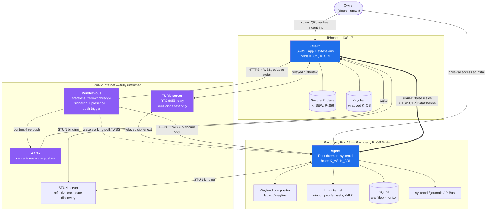
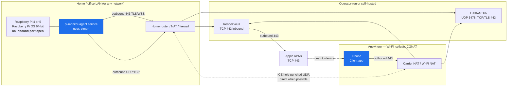
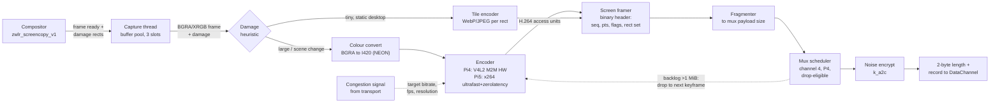
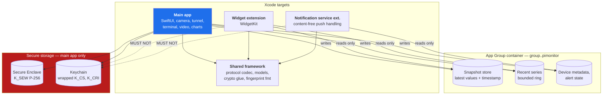
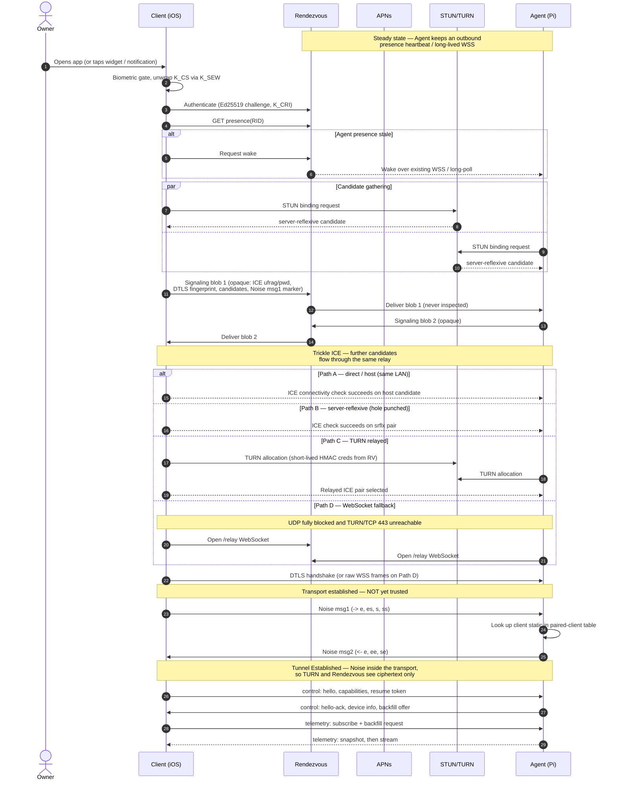
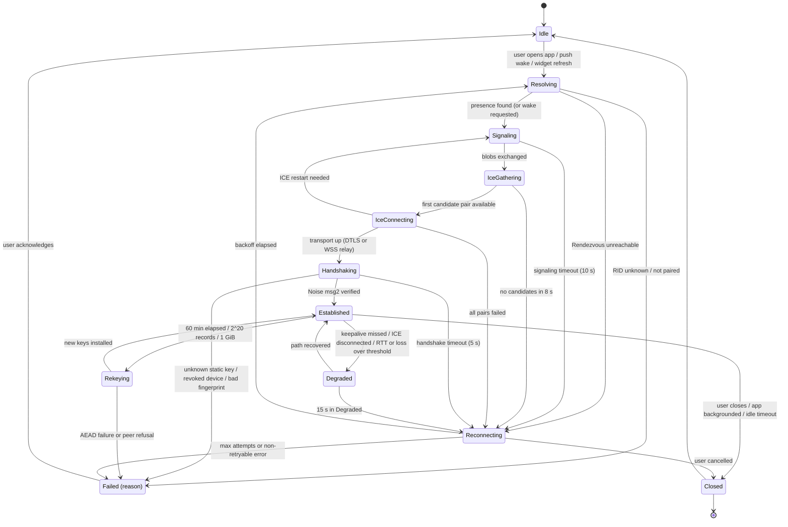
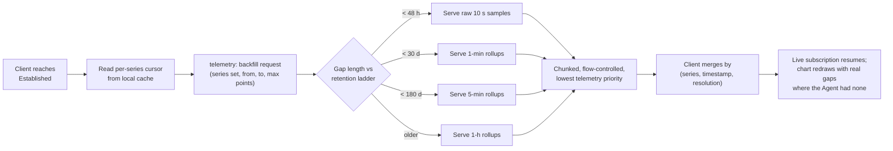
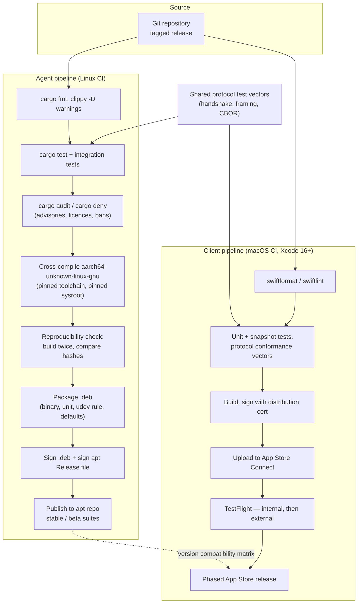

# 03 — Architecture

**Status:** Baseline architecture for v1. Binding on implementation.
**Audience:** Implementers of all three tiers, plus reviewers of [04-SECURITY-E2EE](04-SECURITY-E2EE.md).
**Prerequisite:** [00-GLOSSARY](00-GLOSSARY.md). Every term below is used with exactly the meaning defined there.

---

## 1. Purpose & scope

This document defines the **structure** of the system: what components exist, where they run, how they talk, what threads and queues they use, how a Tunnel is established and re-established, and what the thing is expected to cost in CPU, memory, bandwidth and battery.

It is deliberately *not* the security document and *not* the wire specification. Where a decision has cryptographic or protocol consequences, this document states the structural fact and links out.

### 1.1 What this document does NOT cover

| Topic | Owner document |
|---|---|
| Threat model, key hierarchy, pairing ceremony, fingerprint UX, key storage | [04-SECURITY-E2EE](04-SECURITY-E2EE.md) |
| Frame layout, message catalogue, error codes, Rendezvous API schemas, flow-control mechanics | [05-PROTOCOL](05-PROTOCOL.md) |
| SQLite schema, metric catalogue, retention arithmetic, client cache, App Group contract details | [06-DATA-MODEL](06-DATA-MODEL.md) |
| Screen-by-screen UI, navigation, accessibility | [07-UX-SPEC](07-UX-SPEC.md) |
| WidgetKit families and timeline policy | [08-WIDGETS](08-WIDGETS.md) |
| Installation, systemd hardening, udev rules, uninstall, Pi hardening checklist | [11-AGENT-DEPLOYMENT](11-AGENT-DEPLOYMENT.md) |
| Risk register entries and mitigation ownership | [12-RISK-REGISTER](12-RISK-REGISTER.md) |
| The reasoning behind each irreversible choice | [docs/adr/](adr/) |

### 1.2 Residual-risk numbering

Residual risks raised *by the architecture* are numbered `RR-A01…`. Security-domain residual risks are numbered independently in [04-SECURITY-E2EE](04-SECURITY-E2EE.md). The two sets are disjoint by prefix.

### 1.3 Estimate discipline

Every performance number in this document that was not measured on real hardware is labelled **estimate — validate with benchmark**. None of the numbers here have been measured; this is a specification-only repository. They are engineering estimates derived from published silicon characteristics and comparable systems, and they exist so that implementation can be judged against a falsifiable target rather than against a vibe.

---

## 2. System context

### 2.1 External systems and what they can see

| External system | Interaction | Trust level | Data it can observe |
|---|---|---|---|
| **Rendezvous** | Client and Agent both connect outbound over HTTPS/WSS. Exchanges opaque signaling blobs, tracks presence, triggers pushes. | **Untrusted by design.** Assumed hostile. | Rendezvous id, Ed25519 rendezvous identity public keys, source IPs, connection timing, blob sizes, APNs device token. **Never** plaintext, never Noise static keys, never anything that lets it impersonate an endpoint. |
| **TURN server** | Used only when ICE finds no direct path. Relays SCTP-over-DTLS datagrams. | **Untrusted.** | Packet sizes, timing, both endpoints' IPs, total volume. Contents are DTLS-encrypted *and* Noise-encrypted underneath — see [04-SECURITY-E2EE](04-SECURITY-E2EE.md). |
| **STUN server** | Reflexive candidate discovery. Can be the same host as TURN. | **Untrusted.** | Client/Agent public IP:port mappings. |
| **APNs** | Rendezvous → APNs → Client. Payloads are content-free wake signals. | **Untrusted.** | Device token, delivery timing, that *some* event occurred. Never the alert body, never the metric that fired. |
| **Wayland compositor (labwc/wayfire)** | Agent binds `zwlr_screencopy_v1` (or the portal path) to capture frames. | **Trusted** — same trust domain as the Agent; it is on the Pi. | Everything on screen, by definition. |
| **Linux kernel** | `uinput` for injection; `/proc`, `/sys`, `netlink` for telemetry; V4L2 M2M for Pi 4 hardware encode. | **Trusted.** | Everything. |
| **systemd / journald / D-Bus** | Unit status telemetry, log tailing, portal negotiation. | **Trusted.** | Unit states, logs the Agent is permitted to read. |
| **apt repository** | Agent package delivery. | **Semi-trusted**, gated by signature verification. | Which Pi downloaded which version and when. |
| **App Store / TestFlight** | Client delivery. | **Semi-trusted.** A compromised update channel is in the adversary catalogue in [04-SECURITY-E2EE](04-SECURITY-E2EE.md). | Install/update telemetry. |

---

## 3. Component inventory

### 3.1 Agent (Raspberry Pi, Rust, single process)

| Component | Responsibility | Consumes | Provides | Failure mode |
|---|---|---|---|---|
| **Supervisor** | Owns process lifecycle. Starts/stops subsystems, handles `SIGTERM`/`SIGHUP`, pets the systemd watchdog, enforces the "telemetry keeps running even if everything else fails" rule. | Config, systemd notify socket | Subsystem lifecycle, health state | If it panics the process exits and systemd restarts it. Deliberately the only component allowed to abort. |
| **Config & key store** | Loads `/etc/pi-monitor/agent.conf`, loads/creates `K_AS` and `K_ARI` under `/var/lib/pi-monitor/keys/` (0700). Validates on `SIGHUP`. | Filesystem | Typed config, key handles | Missing/corrupt key ⇒ refuse to start (never silently regenerate — that would break pairing trust). |
| **Rendezvous client** | Maintains outbound presence heartbeat, holds the signaling WebSocket, authenticates with `K_ARI`, fetches short-lived TURN credentials, requests push triggers. | Network, `K_ARI` | Signaling blob in/out, presence, TURN creds | Backs off and retries. Agent remains fully functional locally while disconnected. |
| **ICE / transport manager** | Gathers host/reflexive/relay candidates, runs full ICE, establishes the DataChannel, detects path failure, drives the WebSocket-over-Rendezvous fallback. | Signaling blobs, STUN/TURN | A duplex byte pipe | Path loss ⇒ `Degraded` ⇒ ICE restart ⇒ `Reconnecting`. |
| **Noise session layer** | `Noise_IK_25519_ChaChaPoly_BLAKE2s` responder. Owns handshake, transport keys, nonce counters, rekey and re-handshake scheduling, replay cache. | Byte pipe, `K_AS`, paired-client table | Authenticated, encrypted record stream | Any AEAD failure is fatal to the Tunnel — no error recovery, tear down and reconnect. |
| **Mux & scheduler** | Splits/reassembles mux frames across the six channels, enforces per-channel credit windows, applies strict-priority scheduling with the ≥25% non-`screen` reservation. | Record stream | Per-channel duplex streams | Window exhaustion stalls a channel; `control` stall for >10 s ⇒ Tunnel failed. |
| **Screen capture** | Binds `zwlr_screencopy_v1` against the compositor (portal/PipeWire fallback), receives frames plus damage rectangles, manages the buffer pool. | Wayland socket, DMA-BUF / shm | Raw frames + damage rects | Compositor gone ⇒ `screen` channel reports unavailable; rest of the Agent unaffected. |
| **Encoder** | Colour-converts and encodes. Pi 4: V4L2 M2M hardware H.264. Pi 5: software x264 `ultrafast`+`zerolatency`. Also runs the damage-rect still-image mode. Owns the adaptive bitrate loop. | Raw frames, congestion signals | H.264 access units / tile images | Encoder init failure ⇒ fall back to damage-rect mode ⇒ if that fails, `screen` unavailable. |
| **Input injector** | Creates and owns the `uinput` virtual keyboard and absolute-axis pointer. Translates normalised coordinates to device space. Rate-limits. | `input` channel events | Kernel input events | `/dev/uinput` not writable ⇒ `input` channel refused at open with a specific error code. |
| **PTY manager** | Spawns a login shell on a PTY per `shell` session, streams bytes, handles resize, signals, exit status, and session teardown. | `shell` channel | PTY byte stream | Child death ⇒ exit message ⇒ channel closed. Never leaks orphan processes. |
| **Telemetry sampler** | Reads every metric in the catalogue at its declared interval from `/proc`, `/sys`, `vcgencmd`, netlink, D-Bus, journald, Docker. | Kernel + system interfaces | Sample stream | A failing source degrades to "unknown" for that series; never blocks the sampler loop. |
| **Storage & rollup engine** | Batched SQLite writes, rollup computation, retention pruning, backfill queries. | Sample stream | Durable history, query results | Disk full ⇒ prune aggressively, then drop raw samples, then alert. Never crashes the Agent. |
| **Alert evaluator** | Evaluates Alert Rules over Series with dwell times, raises/clears Alerts, asks Rendezvous to trigger a content-free push. | Samples, rules | Alerts | Evaluation error is logged and the rule is quarantined, not retried in a hot loop. |
| **Action executor** | Executes only allow-listed Actions. Never accepts arbitrary command strings. | `control` channel | Action results | Unknown action ⇒ rejected with an error code. All executions are audited. |
| **Audit logger** | Append-only record of pairings, revocations, actions, shell sessions, screen sessions, config changes, key operations. | All components | Audit trail in SQLite | Write failure escalates to the supervisor; audit loss is a security event. |

> **Residual risk RR-A01:** The Agent is a single process. A memory-safety-independent logic bug that panics outside a caught boundary takes down telemetry collection as well as remote access. Mitigation is structural — the supervisor runs sampling and storage on tasks that never touch attacker-controlled parsing — but the process boundary is not a security boundary within the Agent.

### 3.2 Client (iOS, Swift 6, SwiftUI)

| Component | Responsibility | Consumes | Provides | Failure mode |
|---|---|---|---|---|
| **App shell** | Navigation, scene lifecycle, foreground/background transitions, biometric gate, app-switcher snapshot masking. | UIKit/SwiftUI lifecycle | Screen routing | Backgrounding tears the Tunnel down deterministically rather than leaving it half-alive. |
| **Pairing module** | Camera QR scan, parses the pairing payload, drives the pairing ceremony, renders the fingerprint for two-sided verification. | Camera, Rendezvous | A stored Agent identity | Any mismatch or timeout aborts the ceremony and destroys partial state. |
| **Keychain / Enclave service** | Creates `K_SEW` in the Secure Enclave (P-256, biometry-gated), wraps/unwraps `K_CS` (X25519) with it, stores the wrapped blob and `K_CRI` in the Keychain. | Secure Enclave, Keychain | Unwrapped `K_CS` handle for the duration of a session | Biometric failure ⇒ no session. Enclave key loss (device restore) ⇒ re-pair required. |
| **Tunnel manager** | Owns the Tunnel state machine, ICE/DataChannel setup, Noise initiator role, rekey scheduling, backoff, network-path observation. | Rendezvous, STUN/TURN, `K_CS` | Authenticated channel streams | Terminal failure surfaces a specific reason to the UI, never a generic spinner. |
| **Channel clients** | One typed client per channel: control, input, shell, telemetry, screen, files. Owns each channel's state machine and flow-control accounting. | Mux streams | Typed events to the UI layer | Per-channel failure is isolated; losing `screen` does not lose `telemetry`. |
| **Terminal view** | SwiftTerm-backed renderer, feeds PTY bytes, emits keystrokes, reports resize. | `shell` channel | Terminal UI | Renderer errors degrade to a read-only buffer rather than dropping the session. |
| **Video decode & render** | VideoToolbox hardware H.264 decode into `CVPixelBuffer`, presented via `AVSampleBufferDisplayLayer` (Metal path for the damage-rect tile mode). Owns the jitter/latency policy. | `screen` channel | Live video | Decode error ⇒ request keyframe; repeated failure ⇒ fall back to tile mode. |
| **Charts module** | Swift Charts rendering of Series and Rollups, with downsampling for scroll performance. | Telemetry cache | Graphs | Missing ranges render as gaps, never as interpolated fiction. |
| **Local cache store** | On-device store of snapshots, recent series, alerts and device metadata; the source for cold-start UI and for widgets. | Telemetry channel | Cached reads, App Group writes | Corruption ⇒ discard and refetch; never blocks the UI. |
| **Widget extension** | Renders Home/Lock Screen widgets from the App Group container only. Never opens a Tunnel. | App Group container | Widget timelines | Stale data is rendered *with its age*, never silently as current. |
| **Notification service extension** | Receives content-free pushes, decides whether the body can be enriched, applies privacy policy. | APNs payload, App Group | Notification content | On any doubt it presents the generic body. |
| **Background task scheduler** | Registers BGAppRefresh/BGProcessing tasks to opportunistically refresh the snapshot for widgets. | iOS scheduler | Periodic refresh attempts | iOS may never run it; the design must be correct when it does not. |
| **Shared framework** | Protocol codec, crypto glue, models, fingerprint formatting — shared by app, widget and NSE. | — | Types and codecs | Compile-time shared; no runtime failure mode. |

### 3.3 Rendezvous (deliberately minimal)

| Component | Responsibility | Consumes | Provides | Failure mode |
|---|---|---|---|---|
| **Auth verifier** | Verifies Ed25519 challenge-response against `K_ARI` / `K_CRI`. Stores only public-key hashes. | Request | Authenticated identity | Rejects; no state to corrupt. |
| **Presence registry** | In-memory map: rendezvous id → last-seen, with a 90 s TTL. | Agent heartbeats | Presence answers | Loss on restart is acceptable; endpoints re-register within one heartbeat. |
| **Signaling relay** | Short-lived opaque blob mailbox and WebSocket pass-through. 60 s TTL. Never inspects contents. | Blobs | Blob delivery | Loss ⇒ endpoints retry the whole connection attempt. |
| **Push trigger** | Sends content-free APNs pushes. Holds device tokens because APNs requires it. | Alert/wake triggers | Push delivery | Failure ⇒ Client discovers the alert on next connect. |
| **TURN credential minter** | Issues short-lived HMAC credentials for the TURN service. | Auth | Time-boxed creds | Failure ⇒ no relay path ⇒ WebSocket fallback. |
| **Relay fallback** | Last-resort WebSocket byte pipe between the two endpoints. Still carries Noise ciphertext. | Bytes | Bytes | Degraded bandwidth; see §7. |

Rendezvous holds **no** database beyond ephemeral TTL state and the APNs token table. This is what makes it replaceable and self-hostable — see [ADR-0008](adr/ADR-0008-rendezvous-hosting.md).

---

## 4. Deployment topology

### 4.1 Every connection, with direction

| # | From | To | Protocol / port | Direction | Purpose | Can it be inbound to the Pi? |
|---|---|---|---|---|---|---|
| 1 | Agent | Rendezvous | TLS 443 (HTTPS + WSS) | **Outbound only** | Presence, signaling, TURN creds, push triggers | No |
| 2 | Agent | STUN | UDP 3478 (and 443 fallback) | Outbound only | Reflexive candidate | No |
| 3 | Agent | TURN | UDP 3478 / TCP 443 / TLS 443 | Outbound only | Relay allocation | No |
| 4 | Client | Rendezvous | TLS 443 | Outbound only | Signaling, presence lookup | — |
| 5 | Client | STUN/TURN | UDP 3478 / TCP 443 | Outbound only | Candidates, relay | — |
| 6 | Client ↔ Agent | — | UDP, ICE-negotiated ephemeral ports | **Bidirectional after hole punch** | The Tunnel's direct path | Only on a mapping the Agent itself created outbound |
| 7 | Rendezvous | APNs | TLS 443 | Outbound from Rendezvous | Content-free push | No |
| 8 | Agent | apt repo | TLS 443 | Outbound only | Updates | No |
| 9 | Agent | NTP | UDP 123 | Outbound only | Clock — required for handshake freshness checks | No |

**Proof of P2 ("no inbound ports").** Every row above is either outbound-initiated from the Pi or is a UDP flow on a NAT mapping the Pi created by sending first. The Agent binds no listening socket reachable from outside the host. The only sockets it binds are ICE UDP sockets, which it uses to send outbound before any peer traffic arrives, and (optionally) a Unix domain socket for local CLI control. A default-deny inbound firewall on the Pi does not break anything — see the hardening checklist in [11-AGENT-DEPLOYMENT](11-AGENT-DEPLOYMENT.md).

> **Residual risk RR-A02:** Row 9 is load-bearing and easy to miss. The Raspberry Pi has no battery-backed RTC by default. Handshake freshness checks (±120 s skew, see [04-SECURITY-E2EE](04-SECURITY-E2EE.md)) are meaningless before the first NTP sync after boot. The Agent MUST either refuse handshakes until time is synchronised or fall back to a monotonically increasing persisted counter. Choosing "refuse" makes the Pi unreachable after a power cut with no internet-time source; choosing "counter" weakens replay defence. The design takes the counter path with a persisted floor, and says so plainly rather than pretending the clock is trustworthy.

---

## 5. Agent process & thread model

One process. One `tokio` multi-threaded runtime sized to `min(4, num_cpus)` worker threads, plus a bounded blocking pool, plus a small number of dedicated OS threads for work that must not sit on the async executor.

### 5.1 Task groups

| Task group | Count | Runtime | Blocking? | Priority | Why this placement |
|---|---|---|---|---|---|
| Supervisor | 1 | async task | No | Highest | Must stay responsive to signals and the watchdog even under load. |
| Watchdog pet | 1 | async task, 15 s tick | No | Highest | Independent of subsystem health so a hung subsystem is *detected*, not masked. Pets only if the health probe passes. |
| Rendezvous client | 1 | async task | No | High | Pure I/O. |
| ICE / transport | 1 per Tunnel | async task + str0m/webrtc-rs timers | No | High | Sans-I/O state machine driven by a select loop; latency-sensitive but never CPU-heavy. |
| Noise session | 1 per Tunnel | async task | No | High | ChaCha20-Poly1305 at 2 Mbps is <2% of one A76 core (estimate — validate with benchmark); no need to leave the executor. |
| Mux scheduler | 1 per Tunnel | async task | No | High | Must run on every wakeup; keeping it async keeps latency low. |
| Screen capture | 1 | **dedicated OS thread** | Yes (Wayland event loop + buffer waits) | Real-time-ish | The Wayland client event loop and DMA-BUF fences are blocking and would stall executor workers. Isolating it also lets the thread be given a raised scheduling priority. |
| Colour conversion | 1 | **dedicated OS thread** (NEON) | Yes (pure CPU) | High | A 1080p BGRA→I420 conversion is a hundreds-of-MB/s memory-bandwidth job. Running it on an executor worker would starve every other async task for tens of milliseconds. |
| Video encode | 1 | **dedicated OS thread** | Yes | High | x264 at 720p30 consumes 1.2–1.8 A76 cores (estimate). It MUST NOT run on a tokio worker. On Pi 4 the V4L2 M2M path is also blocking on `poll()`/`dqbuf`. |
| Input injection | 1 | async task, `write()` to uinput | Negligible | High | `uinput` writes are sub-microsecond; latency matters more than throughput. |
| PTY I/O | 1 read + 1 write per shell session | async task on non-blocking fd | No | Medium | PTY fds are pollable; no thread needed. |
| Telemetry sampler | 1 | async task, timer-driven | Mostly no | Medium | `/proc` and `/sys` reads are fast; `vcgencmd` and Docker socket calls are dispatched to the blocking pool. |
| Slow metric probes | N (bounded 4) | **blocking pool** | Yes | Low | `vcgencmd`, `apt` update counts, `docker ps`, journald scans can take hundreds of ms and MUST NOT block the sampler tick. |
| SQLite writer | 1 | **dedicated OS thread** | Yes | Low | `rusqlite` is synchronous and an `fsync` on an SD card can take 10–200 ms (estimate). A single owning thread also gives serialised write access without lock contention and makes 30-second batching trivial. |
| SQLite readers | bounded pool of 2 | blocking pool | Yes | Low | Backfill queries can scan millions of rows; bounded so they cannot monopolise the pool. |
| Rollup & retention | 1 | reuses the writer thread | Yes | Lowest | Runs inside the same serialised write context, so it can never race the writer. |
| Alert evaluator | 1 | async task | No | Medium | Cheap arithmetic over in-memory recent samples. |
| Action executor | 1 per action, bounded 2 | blocking pool | Yes | Medium | Spawning processes and waiting on systemd D-Bus calls is blocking. |
| Audit logger | 1 | async task feeding the writer thread | No | Medium | Never allowed to drop; if the queue fills, the producing operation fails rather than proceeding unaudited. |

### 5.2 Screen data path

### 5.3 Bounded queues and overflow policy

Every inter-task queue in the Agent is bounded. Unbounded queues are forbidden — they convert a transient slowdown into an out-of-memory kill.

| Queue | Capacity | Overflow policy |
|---|---|---|
| Capture → colour convert | 2 frames | Drop the **oldest**; increment `screen.frames_dropped_capture`. Skipping a frame is always better than adding latency. |
| Colour convert → encode | 2 frames | Drop oldest. |
| Encode → framer | 8 access units | Drop all queued non-keyframes, then request an immediate keyframe. |
| Framer → mux (`screen`) | 1 MiB | Discard everything up to the next keyframe boundary and request a keyframe. `screen` is explicitly lossy. |
| PTY read → mux (`shell`) | 256 KiB | Stop reading the PTY fd. The kernel PTY buffer fills and the child process blocks on write. This is correct backpressure — never drop shell bytes. |
| Mux → uinput (`input`) | 512 events | Drop oldest **pointer-motion** events only. Key press/release and button events are **never** dropped — dropping a key-up leaves a stuck modifier. |
| Sampler → SQLite writer | 4096 samples | Drop oldest and increment `agent.samples_dropped`. Alert evaluation reads the in-memory ring, so alerting survives storage backpressure. |
| SQLite write batch | 30 s or 4096 rows | Whichever comes first triggers a flush. |
| Audit → writer | 256 entries | **Never dropped.** If full, the audited operation is refused with an internal error. |
| Control egress | 256 frames | Never dropped. Full for >10 s ⇒ Tunnel declared `Degraded`, then `Failed`. |

### 5.4 Backpressure philosophy

| Channel | Under pressure the system... | Rationale |
|---|---|---|
| `control` | ...fails the Tunnel rather than dropping | Correctness depends on it; a lost action result is worse than a reconnect. |
| `input` | ...coalesces motion, preserves discrete events | A stuck modifier key is a user-visible bug; a skipped mouse-move is invisible. |
| `shell` | ...blocks the producing process | Terminal output must be lossless or the session is unusable. |
| `telemetry` | ...drops oldest raw samples, keeps alert evaluation | History has a gap; safety does not. |
| `screen` | ...drops to the next keyframe, reduces bitrate/fps/resolution | Video is inherently disposable. |
| `files` | ...yields to everything else | Bulk transfer has no latency requirement. |

---

## 6. iOS app module breakdown

### 6.1 The App Group boundary rule

The widget and the notification service extension **never** hold key material and **never** open a Tunnel. They read a plaintext-at-rest cache in the App Group container. This is a deliberate trade: it makes widgets possible under iOS background-execution limits (see [ADR-0009](adr/ADR-0009-widget-data-path.md)) at the cost of storing telemetry unencrypted-by-the-app inside the container.

> **Residual risk RR-A03:** App Group container contents are protected only by iOS file-level data protection and the app sandbox, not by the Enclave-gated key hierarchy. On a jailbroken or forensically imaged device, cached telemetry (CPU load, temperatures, uptime, alert history, hostname) is readable without biometric authentication. Screen frames, PTY contents and shell history are **never** written there. The container is created with `NSFileProtectionCompleteUntilFirstUserAuthentication` — the strictest class that still permits widget reads after a reboot-then-unlock. `CompleteUnlessOpen`/`Complete` would break widget refresh. This trade-off is restated in [04-SECURITY-E2EE](04-SECURITY-E2EE.md) and [06-DATA-MODEL](06-DATA-MODEL.md).

### 6.2 Swift 6 strict-concurrency model

Swift 6 enforces data-race safety at compile time. The app is structured so that the compiler, not code review, guarantees the isolation.

| Layer | Isolation | Rationale |
|---|---|---|
| All SwiftUI views and view models | `@MainActor` | UI must be main-thread; making it explicit removes every `DispatchQueue.main.async` hop. |
| Tunnel manager | A dedicated `actor` | Serialises state-machine transitions. All Tunnel state mutation happens in one isolation domain, so "reconnect while rekeying" cannot interleave badly. |
| Noise session | A dedicated `actor` owned by the Tunnel actor | Nonce counters are the single most dangerous piece of mutable state in the app. Actor isolation makes nonce reuse structurally impossible without an explicit escape hatch. |
| Each channel client | Its own `actor` | Independent flow-control windows; a slow `screen` consumer cannot block `control`. |
| Video decode pipeline | Non-isolated, on a dedicated `DispatchQueue`, communicating via `AsyncStream` | VideoToolbox callbacks arrive on its own queue; forcing them onto an actor would add latency to every frame. |
| Protocol codec, models, crypto glue | `Sendable` value types, no shared mutable state | Pure functions are trivially concurrency-safe and unit-testable. |
| Keychain/Enclave service | `actor` | Serialises biometric prompts; two simultaneous prompts is an iOS bug generator. |
| Cache store / App Group writer | `actor` with a serial file coordinator | Cross-process file access to the App Group needs coordination; the widget process may read concurrently. |

The unwrapped `K_CS` is held only inside the Noise session actor, for the lifetime of the Tunnel, and is zeroed on teardown. It is never passed across an isolation boundary as a value.

---

## 7. Connectivity establishment

### 7.1 Full sequence

Two properties are worth stating explicitly because they are the whole point of the design:

1. **Rendezvous never sees a key it can use.** It relays opaque blobs. The DTLS fingerprint it can see authenticates only the transport, and the transport is not trusted — the Noise layer inside it is. See [04-SECURITY-E2EE](04-SECURITY-E2EE.md) for the formal argument.
2. **The Noise handshake happens after the transport is up, inside it.** That is what keeps a TURN-relayed session as end-to-end encrypted as a direct one.

### 7.2 Path characteristics

| Path | Added RTT vs direct | Practical throughput ceiling | Cost to operator | E2EE intact? | Expected share of sessions |
|---|---|---|---|---|---|
| **A — host / LAN** | 0 (1–3 ms absolute) | Link speed; 100+ Mbps | None | Yes | 5–10% |
| **B — server-reflexive (hole punched)** | 0 added (peer-to-peer path RTT, typically 15–60 ms) | Link speed, 10–50 Mbps typical | STUN only, negligible | Yes | 75–85% |
| **C — TURN relayed (UDP 3478)** | +10–60 ms (one extra hop, geography-dependent) | Bounded by relay provisioning; plan 5 Mbps/session | Bandwidth — the dominant operating cost | Yes — relay sees ciphertext only | 8–15% |
| **C′ — TURN over TCP/TLS 443** | +20–100 ms, plus head-of-line blocking under loss | 2–5 Mbps practical | Same as C | Yes | 2–5% (subset of C) |
| **D — WebSocket over Rendezvous** | +30–120 ms | 1–3 Mbps, TCP HOL-blocked | Bandwidth on the Rendezvous host | Yes | 1–3% |

All figures are **industry-typical estimates — validate with benchmark and with real deployment telemetry.** They are not measured for this system.

### 7.3 Honest notes on NAT traversal success

- Published measurements of ICE-based systems generally land in the **85–92%** range for "direct or reflexive path succeeded" between two arbitrary internet endpoints, with the remainder needing a relay. This design should expect the same, not better.
- **Carrier-grade NAT on mobile networks is the dominant failure driver.** Many mobile carriers deploy symmetric or endpoint-dependent-mapping CGNAT, which defeats classic hole punching. Since the Client is *by definition* often on cellular, this system will hit the relay path more often than a desktop-to-desktop product would. Budget for the upper end of the TURN share.
- **IPv6 materially improves the numbers.** When both endpoints have working IPv6 (increasingly common on both home broadband and mobile carriers), there is usually no NAT to traverse at all, only firewall state, and direct success approaches 95%+. The implementation MUST gather and prefer IPv6 candidates.
- The Pi is usually behind a *cone-ish* home NAT, which is the easy side. The hard side is the phone.

> **Residual risk RR-A04:** TURN bandwidth is the only cost in this architecture that scales linearly with usage, and screen streaming is the heaviest consumer. A single 1.5 Mbps relayed desktop session for one hour is ~675 MB of relay egress. If the project ever offers a hosted Rendezvous/TURN, this is the line item that decides viability. Self-hosting ([ADR-0008](adr/ADR-0008-rendezvous-hosting.md)) moves the cost to the user, which is honest but raises the setup barrier.

---

## 8. NAT traversal strategy

### 8.1 NAT combination outcomes

| Client-side NAT | Agent-side NAT | Outcome | Path |
|---|---|---|---|
| Same LAN as Agent | — | Direct host candidate | A |
| Full-cone / endpoint-independent | Endpoint-independent | Hole punch succeeds | B |
| Address-restricted | Endpoint-independent | Hole punch succeeds | B |
| Port-restricted | Endpoint-independent | Hole punch succeeds (simultaneous send) | B |
| Port-restricted | Port-restricted | Usually succeeds with trickle ICE and retransmits | B |
| **Symmetric / CGNAT** | Endpoint-independent | **Fails** — the Client's mapping differs per destination | C |
| Endpoint-independent | **Symmetric / CGNAT** | **Fails** | C |
| Symmetric | Symmetric | Fails | C |
| UDP blocked entirely (corporate/hotel) | any | Fails | C′ (TURN over TLS 443) |
| UDP blocked **and** non-443 TCP blocked **and** deep inspection rejects TURN | any | Fails | D |
| Both endpoints have public IPv6 | Both IPv6 | Direct, no NAT | B (as "direct v6") |

### 8.2 Mitigations, in priority order

| Mitigation | Effect | Cost |
|---|---|---|
| **Gather and prefer IPv6 candidates** | Largest single win; removes NAT from the equation where available | None |
| **Full ICE on both sides** (not ICE-lite) | Both endpoints actively probe; required because neither has a public address | Slightly more signaling |
| **Trickle ICE** | Candidates are exchanged as discovered rather than in one batch; cuts connection setup latency by roughly 200–600 ms (estimate) | More signaling round trips |
| **Aggressive nomination with a warm-up probe** | Selects a working pair sooner | Occasional brief use of a worse pair before upgrading |
| **TURN over UDP 3478 first, TCP 443 second, TLS 443 third** | Covers restrictive networks and DPI middleboxes | Latency and cost increase down the list |
| **Keep the Agent's Rendezvous WSS alive** | The wake path always exists even when P2P fails | One idle TCP connection and periodic keepalive |
| **WebSocket relay fallback** | Guarantees *some* connectivity anywhere HTTPS works | Worst latency and throughput; operator bandwidth |
| **ICE restart on path change** rather than full teardown | Survives Wi-Fi → cellular without a new Noise handshake where possible | Some complexity in the transport manager |

Note that ICE restart preserves the *transport*; the Noise session survives a transport swap only if the mux/session layer is genuinely decoupled from the transport, which is why the Tunnel is defined in [00-GLOSSARY](00-GLOSSARY.md) as surviving transport changes. If DTLS must be renegotiated, the Noise session is re-established too — a full handshake costs one extra round trip, which at relayed RTT is 60–200 ms (estimate).

---

## 9. Tunnel state machine

### 9.1 Transition table

| From | Event | To | Side effects |
|---|---|---|---|
| `Idle` | User opens app / push wake / widget deep-link | `Resolving` | Biometric gate; unwrap `K_CS`; authenticate to Rendezvous with `K_CRI`. |
| `Resolving` | Presence fresh (<90 s) | `Signaling` | Skip wake request. |
| `Resolving` | Presence stale | `Signaling` | Request wake; wait up to 8 s for the Agent to appear. |
| `Resolving` | Device not paired / revoked | `Failed` | Show the un-pair state; do not retry. |
| `Signaling` | Blob 2 received | `IceGathering` | Begin candidate gathering; fetch TURN creds in parallel. |
| `IceGathering` | Candidate pair formed | `IceConnecting` | Start connectivity checks; trickle further candidates. |
| `IceConnecting` | Selected pair nominated | `Handshaking` | DTLS handshake completes; start the 5 s Noise timer. |
| `Handshaking` | `msg2` verified | `Established` | Zero handshake state; install `k_c2a`/`k_a2c`; start rekey timers; open `control`; reset backoff to base. |
| `Handshaking` | Static key not in paired table | `Failed` | Audit the rejection on the Agent; show "this device is not paired" on the Client. |
| `Established` | Rekey trigger | `Rekeying` | Symmetric `Rekey()` (FS only) or full re-handshake (PCS) per [04-SECURITY-E2EE](04-SECURITY-E2EE.md). |
| `Established` | Keepalive missed ×2 | `Degraded` | Pause `screen`; keep `control` and `telemetry`; show a subtle degraded indicator. |
| `Degraded` | Path recovers | `Established` | Resume `screen` with a forced keyframe. |
| `Degraded` | 15 s elapsed | `Reconnecting` | Tear down transport, preserve resume token and telemetry cursor. |
| `Established` | App backgrounded | `Closed` | Deterministic teardown; zero `K_CS`; flush cache to App Group. |
| `Reconnecting` | Backoff elapsed | `Resolving` | Attempt N+1. |
| `Reconnecting` | Non-retryable error | `Failed` | Surface the specific reason. |
| any | Fatal AEAD failure / nonce exhaustion | `Failed` | **Never** attempt recovery in place. Tear down, zero keys, reconnect from `Idle`. |

---

## 10. Reconnection & backoff

**Policy:** exponential backoff, base **0.5 s**, multiplier **×1.8**, jitter **±20%**, cap **60 s**. Attempt sequence (before jitter): 0.5, 0.9, 1.6, 2.9, 5.2, 9.5, 17.0, 30.6, 55.1, 60, 60, …

The backoff counter resets to base on reaching `Established`, and **also** resets on any of the event-driven triggers below — a network path change is new information, and waiting out a 60 s backoff when the phone just joined Wi-Fi is user-hostile.

| Trigger | Detection | Action | Resets backoff? |
|---|---|---|---|
| App foregrounded | Scene phase | Immediate connect attempt | Yes |
| Network path change | `NWPathMonitor` (Wi-Fi ↔ cellular, interface up/down) | Immediate ICE restart, or immediate reconnect if no Tunnel | Yes |
| APNs wake (alert or Rendezvous nudge) | Push received | Immediate attempt if the app is foregrounded; otherwise the NSE updates the cache only | Yes |
| Keepalive timeout | 2 missed 15 s heartbeats | `Established` → `Degraded` | No |
| ICE disconnected | Transport callback | `Degraded`; attempt ICE restart before full reconnect | No |
| ICE failed | Transport callback | `Reconnecting` | No |
| Rekey / re-handshake failure | Noise layer | `Failed`, then one immediate clean reconnect | No |
| Rendezvous 5xx / unreachable | HTTP status or timeout | `Reconnecting` with backoff | No |
| Explicit unpair / revocation received | `control` message | `Failed`, permanent — no retry | N/A |

### 10.1 The mobile battery trade-off, stated honestly

An always-connected Tunnel from a phone is expensive. Keeping a DataChannel alive requires keepalives frequently enough to hold NAT bindings open — typically every 15–30 s for UDP mappings, which many NATs expire after 30–120 s. On cellular, each keepalive can pull the radio out of idle, and radio wake-ups dominate the energy cost far more than the bytes do.

This design therefore **does not maintain a persistent Tunnel from the Client.** The Tunnel exists only while the app is in the foreground (or briefly during an explicit background task). Between sessions:

| Need | Mechanism | Latency | Battery cost |
|---|---|---|---|
| Alerting | Rendezvous → content-free APNs push | Seconds | Effectively zero (Apple's push connection is shared system-wide) |
| Widget freshness | App Group cache written at last foreground + opportunistic `BGAppRefresh` | Minutes to hours, **displayed with its age** | Low, and scheduled by iOS |
| Live view | Foreground Tunnel | ~1–3 s to connect (estimate) | High, but user-initiated and visible |

The Agent, by contrast, *does* hold a persistent outbound connection to Rendezvous. It is mains-powered; this is the asymmetry that makes the whole design work.

> **Residual risk RR-A05:** Because there is no background Tunnel, the widget can be stale for hours, and iOS gives no guarantee that `BGAppRefresh` ever runs. The UX contract in [07-UX-SPEC](07-UX-SPEC.md) and [08-WIDGETS](08-WIDGETS.md) MUST render the data's age prominently. A widget that shows an eight-hour-old temperature as if it were current is worse than a widget that shows nothing.

---

## 11. Offline behaviour and backfill

Principle **P5** from the [README](../README.md): *degrade, never fail closed on observability.* The Agent's telemetry, alerting and storage are independent of whether any Client is connected.

### 11.1 Agent with no Client connected

| Function | Behaviour when offline |
|---|---|
| Telemetry sampling | Continues at full rate. This is the normal state — most of the time no Client is connected. |
| Storage & rollups | Continue. Retention pruning continues. |
| Alert evaluation | Continues. Fired Alerts are stored locally **and** a push trigger is attempted. |
| Push trigger when Rendezvous is unreachable | Alert is queued locally with its timestamp and retried with backoff; on reconnect the Client sees it in the alert history even if the push was never delivered. |
| Screen capture / encoder | **Stopped entirely.** No Client, no capture. This is both a privacy property and a CPU saving. |
| PTY sessions | Terminated when the Tunnel drops (with a configurable grace period for reconnection — see [11-AGENT-DEPLOYMENT](11-AGENT-DEPLOYMENT.md)). |
| Audit logging | Continues. |

### 11.2 Client with no Tunnel

| Surface | Behaviour |
|---|---|
| Dashboard | Renders the local cache, clearly labelled with "as of *T*". Never extrapolates. |
| Charts | Render cached ranges; missing ranges are drawn as **gaps**, not interpolated. |
| Alerts | Show locally-known alerts plus any that arrived via push. |
| Screen / Shell | Disabled with a specific reason ("Pi not reachable", "no network", "not paired"), never a generic spinner. |
| Actions | Disabled. Actions are never queued for later delivery — a `reboot` that fires 40 minutes later when connectivity returns is a hazard, not a feature. |

### 11.3 Backfill on reconnect

The Client keeps a per-series cursor: the timestamp of the newest sample it holds. On reaching `Established` it requests the gap. The Agent answers from the appropriate resolution tier — raw if the gap is within the raw retention window, otherwise the coarsest rollup that covers it — and streams it on the `telemetry` channel at low priority so it never competes with live data or `screen`.

Wire-level message names, field types and chunking rules are specified in [05-PROTOCOL](05-PROTOCOL.md); resolution tiers and their sizes are in [06-DATA-MODEL](06-DATA-MODEL.md).

A key honesty point: **if the Pi was powered off, the gap is real and permanent.** Backfill recovers data the Agent recorded while the *Client* was away. It cannot recover data that was never sampled. The Client MUST distinguish "Agent was down" (visible as a gap plus a boot event in the audit log) from "Client was away" (fillable) in the UI.

---

## 12. Technology selection

| Area | Chosen | Alternatives considered | Why rejected | ADR |
|---|---|---|---|---|
| **Transport** | WebRTC DataChannel (SCTP/DTLS/ICE), WebSocket-over-Rendezvous fallback | Raw WireGuard; QUIC direct; plain WebSocket relay only; Tailscale/ZeroTier embed | WireGuard needs kernel/TUN privileges on iOS via a Network Extension and does not solve NAT traversal by itself; QUIC has no standard NAT-traversal story and no iOS peer-to-peer stack; relay-only forfeits direct paths and costs bandwidth on every session | [ADR-0001](adr/ADR-0001-transport.md) |
| **Handshake / E2EE** | `Noise_IK_25519_ChaChaPoly_BLAKE2s` inside the transport | TLS 1.3 mutual auth; libsignal double ratchet; raw NaCl box | TLS pulls in PKI, certificate lifetime management, and a much larger attack surface for a two-party pinned-key case; the double ratchet solves asynchronous messaging problems this system does not have | [ADR-0002](adr/ADR-0002-crypto-handshake.md) |
| **iOS key storage** | Enclave P-256 `K_SEW` wraps X25519 `K_CS`; Keychain holds the wrapped blob | Claim Enclave residency for the Noise key; use P-256 for Noise; software-only Keychain storage | The Enclave does not support Curve25519, so Enclave residency for `K_CS` is impossible; switching Noise to P-256 loses the audited X25519 ecosystem and misaligns with the Rust side | [ADR-0003](adr/ADR-0003-ios-key-storage.md) |
| **Screen codec** | H.264 (V4L2 M2M on Pi 4, x264 software on Pi 5) + damage-rect still mode | VNC/RFB; VP8/VP9; AV1; MJPEG; H.265 | RFB is chatty and has poor motion handling; VP9/AV1 software encode is far too slow on a Pi; H.265 has no Pi encoder either and worse iOS decode ubiquity; MJPEG wastes bandwidth | [ADR-0004](adr/ADR-0004-screen-streaming.md) |
| **Capture API** | wlroots `zwlr_screencopy_v1`, PipeWire + `xdg-desktop-portal` fallback | X11 `XShmGetImage`; `kmsgrab`/DRM; `wlr-export-dmabuf` | X11 is not the Pi OS default session any more; DRM capture bypasses the compositor and breaks with rotation/scaling; export-dmabuf is less widely implemented | [ADR-0004](adr/ADR-0004-screen-streaming.md) |
| **Input injection** | Linux `uinput` virtual keyboard + absolute pointer | `zwp_virtual_keyboard_v1` / `zwlr_virtual_pointer_v1`; `ydotool`; `wtype` | Wayland virtual-input protocols are compositor-dependent and inconsistently implemented; shelling out to a tool adds a process per event and a supply-chain dependency | — (covered in [ADR-0004](adr/ADR-0004-screen-streaming.md) context and [11-AGENT-DEPLOYMENT](11-AGENT-DEPLOYMENT.md)) |
| **Shell** | Agent-spawned PTY streamed over channel 2 | Proxy real OpenSSH over the Tunnel; `websocketd`-style bridge | Proxying SSH means two authentication systems, two key hierarchies, and a second crypto layer with no added security given the Tunnel is already mutually authenticated | [ADR-0006](adr/ADR-0006-shell-transport.md) |
| **Serialization** | Deterministic CBOR with integer keys; raw binary headers for bulk payloads | MessagePack; Protobuf; JSON; bincode | Protobuf needs a schema toolchain on both sides and has weak canonical-form guarantees; MessagePack lacks CBOR's deterministic-encoding spec and tag ecosystem; JSON is too large and too lenient for a security-sensitive parser | [ADR-0007](adr/ADR-0007-serialization.md) |
| **Agent language** | Rust | Go; Python; C++ | Go's GC pauses and larger runtime are a poor fit for a sub-100 MiB memory ceiling with real-time capture; Python cannot software-encode video or hold the CPU budget; C++ forfeits memory safety in a network-facing daemon | [ADR-0005](adr/ADR-0005-agent-language.md) |
| **Agent storage** | SQLite (WAL) with rollups | Flat append-only WAL files; embedded TSDB; RRDtool; Postgres | Flat files require reimplementing indexing and crash recovery; embedded TSDBs are heavy or immature on aarch64; RRDtool's fixed-size design forfeits event data; Postgres is absurd on a Pi | [ADR-0010](adr/ADR-0010-agent-storage-engine.md) |
| **iOS terminal renderer** | SwiftTerm | Custom `CoreText` renderer; `xterm.js` in `WKWebView` | Writing a correct VT emulator is a multi-month project with a long tail of escape-sequence bugs; a WebView adds memory, latency and an unnecessary JS bridge | [ADR-0006](adr/ADR-0006-shell-transport.md) |
| **iOS video decode** | VideoToolbox → `AVSampleBufferDisplayLayer` | `AVPlayer` with HLS; software decode; `VTDecompression` → Metal texture | HLS is designed for segmented VOD and adds seconds of latency; software decode wastes battery; the Metal path is retained only for the damage-rect tile mode | [ADR-0004](adr/ADR-0004-screen-streaming.md) |
| **iOS charts** | Swift Charts | Charts (DGCharts); custom Canvas rendering | Third-party charting adds a dependency for something first-party now does well; custom rendering is only justified if Swift Charts fails the scroll-performance target | — |
| **Rendezvous hosting** | Self-hostable by default, optional managed instance, both zero-knowledge | Mandatory managed service; fully serverless/edge-only | A mandatory managed service contradicts principle P4 (the Pi is the source of truth) and creates a business dependency for a privacy product | [ADR-0008](adr/ADR-0008-rendezvous-hosting.md) |
| **Widget data path** | App Group cache written by the main app; no Tunnel from the widget | Widget opens its own Tunnel; server-pushed widget updates; `URLSession` background fetch to Rendezvous | A widget cannot hold biometric-gated keys or complete an ICE negotiation within its execution budget; server-pushed content would require Rendezvous to hold plaintext, violating P1 | [ADR-0009](adr/ADR-0009-widget-data-path.md) |

### 12.1 WebRTC implementation choice

Both suggested crates are viable and the trade-off is real:

| Option | Model | Pros | Cons |
|---|---|---|---|
| **`str0m`** (recommended) | Sans-I/O — the library is a pure state machine, the application owns all sockets and timers | Deterministic, testable without a network, no hidden threads, small footprint, integrates cleanly with the tokio task model in §5 | Younger; SCTP/DataChannel support has less production mileage than libwebrtc |
| **`webrtc-rs`** | Batteries-included, owns its own tasks and sockets | More complete feature surface, closer to libwebrtc semantics | Larger, spawns its own tasks, harder to bound resources, heavier dependency tree |

> **Residual risk RR-A06:** On the **iOS** side there is no comparably lightweight option. The realistic choices are Google's `libwebrtc` (a large C++/Objective-C binary framework, tens of MB before stripping, awkward under Swift 6 strict concurrency) or writing an ICE/DTLS/SCTP stack in Swift (weeks of work plus a novel security-relevant DTLS integration). This is the single largest unquantified engineering risk in the architecture. A viable de-risking step is to make the WebSocket-over-Rendezvous fallback (Path D) fully functional *first*, ship a working product on it, and add WebRTC as a performance upgrade — at the cost of relaying every session initially. This is flagged for [12-RISK-REGISTER](12-RISK-REGISTER.md).

---

## 13. Capacity & performance model

All numbers in this section are **estimates — validate with benchmark**.

### 13.1 Per-channel bandwidth

| Channel | Idle | Typical active | Peak | Notes |
|---|---|---|---|---|
| `control` (0) | ~3 B/s (15 s heartbeat, ~40 B) | ~100 B/s | ~8 KB/s | Bursts only during action execution and alert delivery |
| `input` (1) | 0 | 1.5 KB/s (≈120 events/s × ~12 B) | 6 KB/s | Motion coalesced to the frame rate |
| `shell` (2) | 0 | 0.5–3 KB/s (interactive typing + output) | 500 KB/s, flow-controlled | A `cat` of a large file is the worst case; the credit window is what saves the session |
| `telemetry` (3) | ~30 B/s (60 s snapshot) | 600–900 B/s (≈40 series at 1 Hz, deterministic CBOR with delta encoding) | 200 KB/s during backfill | Backfill is explicitly lowest-priority within the channel |
| `screen` (4) | 20–150 kbps (damage-rect mode, static desktop) | **1.5 Mbps** (720p20–30 default profile) | 6 Mbps (1080p30 ceiling, Pi 4 HW only) | The dominant consumer by two orders of magnitude |
| `files` (5) | 0 | 0 | Whatever remains | Always yields |
| **Session total** | **~35 B/s** | **~1.6–2.0 Mbps** | **~6.5 Mbps** | Design the adaptive loop against a 2 Mbps assumption |

Protocol overhead on top: 2 B record length + 16 B Poly1305 tag + 6 B mux header per frame. At a 1200 B effective payload (a conservative SCTP-over-DTLS-over-IPv6 path MTU assumption) this is roughly **2%** — negligible against video, meaningful against a 40 B heartbeat, which is why heartbeats are coalesced with other pending frames when possible.

### 13.2 Agent CPU per encoding profile

Costs are expressed in **cores** (1.00 = one core fully saturated). The three components are separated because the capture and colour-conversion costs are routinely forgotten in this kind of estimate and are *not* small on a Pi.

| Profile | Board | Capture (screencopy copy) | Colour convert BGRA→I420 (NEON) | Encode | **Total** | Verdict |
|---|---|---|---|---|---|---|
| 720p @ 20 fps | Pi 4, V4L2 HW | 0.06 | 0.20 | 0.04–0.08 | **0.30–0.34** | Comfortable |
| 720p @ 30 fps | Pi 4, V4L2 HW | 0.09 | 0.30 | 0.05–0.12 | **0.44–0.51** | Comfortable — **recommended Pi 4 default** |
| 1080p @ 30 fps | Pi 4, V4L2 HW | 0.20 | 0.65 | 0.10–0.18 | **0.95–1.03** | Viable but leaves little headroom |
| 720p @ 30 fps | Pi 4, software x264 | 0.09 | 0.30 | 2.5–3.5 | **2.9–3.9** | **Not viable** — use the HW encoder |
| 720p @ 20 fps | Pi 5, software x264 | 0.04 | 0.12 | 0.8–1.2 | **0.96–1.36** | **Recommended Pi 5 default** |
| 720p @ 30 fps | Pi 5, software x264 | 0.06 | 0.18 | 1.2–1.8 | **1.44–2.04** | Viable on a 4-core Pi 5, ~36–51% of the machine |
| 1080p @ 30 fps | Pi 5, software x264 | 0.13 | 0.40 | 2.5–3.5 | **3.03–4.03** | **Not recommended** — 75–100% of the whole board |
| Damage-rect still mode | Either | 0.02–0.06 | n/a (encode from BGRA) | 0.05–0.25 | **0.07–0.31** | Excellent for a mostly-static desktop |

Supporting arithmetic for the capture and conversion rows: a 1920×1080 XRGB8888 frame is 8.29 MB; at 30 fps that is **249 MB/s** read plus write for a naive copy, against an effective memory bandwidth of roughly 4–5 GB/s on Pi 4 and 10–12 GB/s on Pi 5. A 1280×720 frame is 3.69 MB, or 111 MB/s at 30 fps.

**Consequences that must be designed for, not discovered later:**

1. **The Pi 5's removal of the hardware H.264 encoder is the single most consequential hardware fact in this system.** A Pi 5 gives a *better* experience than a Pi 4 at almost everything except the one thing this product does most visibly. Full-resolution 1080p remote desktop on a Pi 5 is not a shippable default.
2. Damage-region tracking is not an optimisation, it is **load-bearing**. A typical desktop is static most of the time; the difference between "encode every frame" and "encode when something changed" is the difference between 1.5 cores and 0.1 cores.
3. Zero-copy paths matter. If `zwlr_screencopy_v1` can deliver a DMA-BUF that the colour converter reads directly, the capture row drops substantially. Whether this works depends on the compositor and the buffer format actually negotiated.

> **Residual risk RR-A07:** `zwlr_screencopy_v1` is on a deprecation path in newer wlroots releases in favour of `ext-image-copy-capture-v1`. Raspberry Pi OS Trixie ships labwc on a newer wlroots than Bookworm's wayfire. The capture layer MUST be written against an internal capture trait with at least two backends and MUST probe for available protocols at runtime rather than assuming one. Pinning to `zwlr_screencopy_v1` alone will break on a future OS upgrade.

### 13.3 Memory

| Component | Idle | Telemetry-only session | 720p screen session |
|---|---|---|---|
| Rust runtime + tokio + allocator arenas | 12 MiB | 12 MiB | 14 MiB |
| SQLite page cache + WAL | 10 MiB | 10 MiB | 10 MiB |
| Telemetry in-memory ring (alert evaluation) | 3 MiB | 3 MiB | 3 MiB |
| Rendezvous client + TLS | 3 MiB | 3 MiB | 3 MiB |
| Transport (ICE/DTLS/SCTP) + Noise session | — | 6 MiB | 6 MiB |
| Mux buffers + flow-control windows | — | 4 MiB | 8 MiB |
| Capture buffer pool (3 × 720p BGRA) | — | — | 11 MiB |
| Colour-conversion scratch (2 × I420 720p) | — | — | 3 MiB |
| Encoder state (x264 ultrafast, small ref set) | — | — | 40–70 MiB |
| Encoded-frame queue | — | — | 4 MiB |
| PTY buffers (per session) | — | 1 MiB | 1 MiB |
| **Total RSS estimate** | **~28 MiB** | **~39 MiB** | **~103–133 MiB** |
| **Target ceiling (alarm threshold)** | **60 MiB** | **90 MiB** | **220 MiB** |
| **systemd `MemoryHigh` / `MemoryMax`** | \- | \- | **256 MiB / 400 MiB** |

The gap between estimate and ceiling is deliberate headroom for allocator fragmentation, a second concurrent shell session, and 1080p operation on Pi 4. `MemoryMax` is set high enough that hitting it means a genuine leak, not normal peak use. Exact directive values are in [11-AGENT-DEPLOYMENT](11-AGENT-DEPLOYMENT.md).

### 13.4 Disk I/O and SD-card load

With ~40 series at a 10 s raw interval and a ~26–32 B per-sample on-disk cost:

- 40 series × 8 640 samples/day × ~30 B ≈ **10.4 MB/day** of logical raw data.
- WAL mode roughly doubles physical writes (WAL write + checkpoint into the main database), and 4 KiB page granularity with 30 s batching adds partial-page overhead: assume a **~2.2× amplification** → **≈ 23 MB/day**, or **~8.4 GB/year**.
- Rollups, the audit log and journald add an estimated 3–8 MB/day.
- Against a 32 GB A1-class card with typical wear-levelling, ~10 GB/year of writes is roughly 0.3 full-card writes per year — well inside endurance. The real SD-card risk is not raw volume, it is **unbatched small synchronous writes**, which is exactly what the 30 s batching in §5.1 exists to prevent.

Full arithmetic, the retention ladder, and the endurance sanity check are in [06-DATA-MODEL](06-DATA-MODEL.md).

### 13.5 iOS side

| Aspect | Estimate | Notes |
|---|---|---|
| H.264 720p30 hardware decode | 40–90 mW | VideoToolbox; small relative to everything else |
| Display at typical indoor brightness | 400–900 mW | Usually the largest single consumer |
| Cellular radio at ~2 Mbps sustained | 500–1200 mW | Highly network- and signal-dependent |
| Wi-Fi at ~2 Mbps sustained | 200–500 mW | |
| **Total drain, 720p30 remote desktop session** | **~380–650 mAh/hour** | On a ~3 300 mAh phone this is roughly **12–20% per hour** |
| Telemetry-only foreground session | ~120–250 mAh/hour | Radio mostly idle between 1 Hz updates |
| Background (no Tunnel) | ≈ 0 | By design — see §10.1 |

Thermal note: sustained cellular streaming plus video decode plus a bright display will warm the phone but should not throttle a modern iPhone at 720p. 1080p sessions over cellular for tens of minutes may. The adaptive loop MUST accept a Client-side "reduce quality" signal, not only a network-congestion signal.

---

## 14. Observability of the system itself

The product's job is observing a Pi. It must also be able to observe *itself*, without becoming a data-leakage vector.

### 14.1 Agent self-metrics

These are ordinary Series in the same store as everything else (see [06-DATA-MODEL](06-DATA-MODEL.md)), so they get history, charts and alerting for free.

| Series | Unit | Purpose |
|---|---|---|
| `agent.uptime_s` | seconds | Detect restart loops |
| `agent.rss_bytes` | bytes | Leak detection against §13.3 |
| `agent.cpu_pct` | percent of one core | Encoder cost visibility |
| `agent.restart_count_24h` | count | Crash-loop alarm |
| `agent.tunnel_state` | enum | Current state from §9 |
| `agent.tunnel_sessions_24h` | count | Usage |
| `agent.transport_path` | enum (host/srflx/relay/ws) | How often TURN is actually needed |
| `agent.handshake_failures_24h` | count | **Security-relevant** — a spike means someone is probing |
| `agent.rekey_count` | count | Confirms the rekey policy is running |
| `agent.rtt_ms` | ms | Path quality |
| `agent.screen_fps_actual` / `agent.screen_bitrate_bps` | fps / bps | Adaptive-loop behaviour |
| `agent.frames_dropped_capture` / `_encode` / `_congestion` | count | Which stage is the bottleneck |
| `agent.samples_dropped` | count | Storage backpressure |
| `agent.db_size_bytes` / `agent.db_write_ms_p95` | bytes / ms | SD-card health proxy |
| `agent.rendezvous_reconnects_1h` | count | Rendezvous or network instability |

### 14.2 Logging levels and redaction

| Level | Contents |
|---|---|
| `error` | Unrecoverable subsystem failures, refused handshakes, audit-write failures |
| `warn` | Degraded paths, dropped frames above threshold, retention pressure, quarantined alert rules |
| `info` | Lifecycle, pairing, revocation, session start/stop with path type, action execution |
| `debug` | State transitions, ICE candidate types (**not addresses** by default), flow-control windows, frame counts |
| `trace` | Frame headers only. **Never enabled in production builds by default.** |

**Redaction rules (mandatory, testable):**

| Never logged | Rationale |
|---|---|
| Any private key, transport key, `K_PT`, or recovery key, at any level | Obvious |
| Any Noise plaintext | Defeats E2EE |
| PTY bytes in either direction | Shell content includes passwords typed by the user |
| Screen pixels, encoded frames, or damage-rect contents | Screen content is the most sensitive data in the system |
| Full file paths from the `files` channel at `info` or below | Path names leak content |
| Public IP addresses at `info` or below | Location proxy |

Full public keys are logged only as truncated fingerprints. A test in [09-TEST-PLAN](09-TEST-PLAN.md) should assert that a session's logs contain none of a set of canary values injected into every channel.

### 14.3 Debug bundle

A user-triggered, explicitly-consented export containing: config with secrets removed, recent logs at `info`, agent self-metrics, connectivity path history, OS/kernel/compositor versions, and the storage size breakdown. It contains **no** key material, **no** telemetry values from user-defined series unless opted in, and **no** screen or shell data. The bundle is written locally on the Pi; the user chooses whether to send it anywhere. The Client can request one over `control` and save it to Files.

### 14.4 Rendezvous metrics (privacy-preserving by construction)

Rendezvous may record **counts only**, never identifiers:

| Metric | Allowed |
|---|---|
| Requests/second per endpoint, error rates, latency histograms | Yes |
| Concurrent presence registrations (a bare integer) | Yes |
| Signaling blobs relayed, bytes relayed (aggregate) | Yes |
| Push triggers sent, delivery failures (aggregate) | Yes |
| Rendezvous ids, public keys, IPs in metrics or logs | **No** |
| Correlation of a Client identity to an Agent identity beyond the TTL needed to relay | **No** |
| Blob contents, ever | **No** |

If an operator needs abuse control, they get a salted hash of the source IP with a rotating daily salt and ≤24 h retention — enough to rate-limit, not enough to build a history. See [04-SECURITY-E2EE](04-SECURITY-E2EE.md) for why this is a security requirement and not a courtesy.

### 14.5 Client diagnostics

In-app connection inspector showing: current state from §9, selected candidate pair type, RTT, current screen profile and measured bitrate, per-channel byte counters, last handshake time, next rekey time, and the Agent's fingerprint. Crash reporting, if enabled at all, MUST be opt-in and MUST NOT include any Tunnel payload. Symbolicated crash reports are permitted; memory dumps are not, because process memory can contain `K_CS` and plaintext.

---

## 15. Build & release pipeline

### 15.1 Agent build

| Aspect | Decision | Notes |
|---|---|---|
| Target triple | `aarch64-unknown-linux-gnu` | See the static-linking discussion below |
| Minimum OS | Raspberry Pi OS Bookworm (glibc 2.36) | Build against the oldest supported glibc so newer systems remain compatible |
| Toolchain | Pinned Rust version in the repo; no `nightly` | Reproducibility |
| Dependency policy | `cargo deny` gates advisories, duplicate versions and licences; lockfile committed | A network daemon's dependency tree is attack surface |
| Reproducible builds | Build twice in a clean container, compare hashes; publish the expected hash with the release | Lets a user verify the binary matches the source |
| Packaging | `.deb`, plus a checksummed tarball for the manual path | Details in [11-AGENT-DEPLOYMENT](11-AGENT-DEPLOYMENT.md) |
| Distribution | Signed apt repository, `stable` and `beta` suites | Signature verification is what makes the update channel trustworthy |
| Version compatibility | Agent and Client negotiate a protocol version; the compatibility window is defined in [05-PROTOCOL](05-PROTOCOL.md) | An old Agent must keep working with a new Client for at least two protocol versions |

**On "single static binary" — the baseline overstates what is achievable.** The claim is worth interrogating:

| Dependency | Statically linkable? | Consequence |
|---|---|---|
| Rust crates, `snow`, `rusqlite` (bundled SQLite) | Yes | Fine |
| `libx264` | Yes, vendored and statically linked | Fine, but note the licence implications of GPL-licensed x264 for a proprietary client — an LGPL/BSD encoder or a separate-process design may be required |
| V4L2 M2M (Pi 4 hardware encode) | Yes — it is `ioctl` against `/dev/video*`, no library needed | Fine |
| Wayland client protocol | Yes, protocol is wire-level; `libwayland` can be statically linked or reimplemented | Fine |
| **PipeWire + `xdg-desktop-portal`** | **No** — requires D-Bus and `dlopen` of SPA plugins | Breaks a fully-static musl build |
| glibc NSS (hostname resolution for Rendezvous) | Not safely — static glibc + NSS is a known trap | Use a pure-Rust DNS resolver to avoid it |

**Recommendation:** build a `gnu`-target binary that statically links every Rust dependency and the encoder, dynamically links glibc, and treats the PipeWire/portal capture backend as an **optional, dynamically-probed feature**. Describe the artifact as "a single self-contained binary with no runtime package dependencies beyond the base system", which is true, rather than "a static binary", which is not.

> **Residual risk RR-A08:** If x264 is used, its GPL licensing propagates to anything it is linked into. A single-binary Agent that statically links x264 must itself be GPL-licensed, which conflicts with the repository's stated MIT licence. The options are: (a) license the Agent under GPL, (b) use an alternative encoder with a permissive licence, (c) load x264 in a separate process over a local IPC boundary, or (d) rely on the Pi 4 hardware encoder and ship damage-rect mode as the only Pi 5 default. This is a legal blocker, not a technical one, and it must be resolved before the first public release. Flagged for [12-RISK-REGISTER](12-RISK-REGISTER.md).

### 15.2 Client build

| Aspect | Decision |
|---|---|
| Toolchain | Xcode 16+, Swift 6 language mode with strict concurrency enabled repository-wide (no per-target opt-outs) |
| Targets | Main app, widget extension, notification service extension, shared framework — see §6 |
| Entitlements | App Group, camera (QR), push notifications, Keychain access group. **No** background-modes entitlement that the design does not actually use |
| Signing | Distribution certificate in CI, never on a developer machine; provisioning profiles under version control |
| Testing | Protocol conformance vectors shared with the Agent (§15 diagram), snapshot tests for the fingerprint-verification UI, and a fully mocked Tunnel for UI tests |
| Distribution | TestFlight internal → TestFlight external → phased App Store release (7-day ramp) |

**App Store review risks for this category, stated plainly:**

| Risk | Likelihood | Mitigation |
|---|---|---|
| Remote-desktop and remote-shell apps get extra scrutiny under the guidelines covering remote control and code execution | Medium–high | Documentation for review explaining that the app controls only the *user's own* device, paired physically, with no third-party access and no downloaded executable code |
| An interactive shell may be read as "executing code not embedded in the binary" | Medium | The shell runs entirely on the *Pi*, not on iOS; no code is downloaded to or run on the device. Make this explicit in review notes |
| Encryption export compliance | Certain | Standard: declare use of exempt-category cryptography; annual self-classification report as required |
| Camera use for QR only | Low | Purpose string must be specific |
| Rejection for a bundled binary framework (libwebrtc) | Low–medium | Ensure the framework is built for the right architectures and passes bitcode/symbol requirements |

### 15.3 Release artifacts

| Artifact | Produced by | Signature | Verified by |
|---|---|---|---|
| `pi-monitor-agent_<version>_arm64.deb` | Agent CI | Project GPG key, detached and embedded | `apt` on the Pi |
| apt `Release` / `InRelease` | Agent CI | Project GPG key | `apt` |
| `SHA256SUMS` + reproducible-build hash | Agent CI | Project GPG key | Users who rebuild from source |
| Tarball (manual install path) | Agent CI | Project GPG key | Install script |
| iOS `.ipa` | Client CI | Apple distribution certificate | Apple / device |
| Protocol conformance vector set | Shared | Committed to the repository | Both tiers' test suites |
| Source tag | Git | Signed tag | Anyone |

---

## 16. Open architecture questions

| # | Question | Blocking? | Owner document / next step |
|---|---|---|---|
| Q1 | Which iOS WebRTC stack — bundled `libwebrtc` or a Swift ICE/DTLS/SCTP implementation? (see RR-A06) | **Yes** — largest engineering unknown | Spike before implementation starts; record as an amendment to [ADR-0001](adr/ADR-0001-transport.md) |
| Q2 | x264 licence resolution (see RR-A08) | **Yes** — legal blocker for release | [ADR-0004](adr/ADR-0004-screen-streaming.md) and [12-RISK-REGISTER](12-RISK-REGISTER.md) |
| Q3 | Does `zwlr_screencopy_v1` deliver a zero-copy DMA-BUF on labwc for the formats we need, or is a CPU copy unavoidable? | No, but it moves the §13.2 numbers materially | Benchmark on both Bookworm/wayfire and Trixie/labwc |
| Q4 | Migration plan to `ext-image-copy-capture-v1` (see RR-A07) | No, but inevitable | Capture-backend trait with runtime probing |
| Q5 | Should the Agent support more than one concurrent Client session in v1? | No — glossary says single Owner | Revisit when multi-user is scoped |
| Q6 | Is a persistent low-rate background Tunnel ever justified for a plugged-in phone? | No | Would need a measured battery study first |
| Q7 | Clock-trust policy on a Pi with no RTC and no internet after boot (see RR-A02) | Partially — affects handshake freshness | Final call belongs to [04-SECURITY-E2EE](04-SECURITY-E2EE.md) |
| Q8 | Where does the adaptive-bitrate control loop live — Agent-only, or Client-informed? | No | Specified in [05-PROTOCOL](05-PROTOCOL.md); §13.5 argues the Client must be able to request a downgrade |

---

## 17. Cross-references

| Document | Relationship to this one |
|---|---|
| [00-GLOSSARY](00-GLOSSARY.md) | Defines every term used here |
| [01-BRD](01-BRD.md) / [02-SRS](02-SRS.md) | The requirements this architecture must satisfy |
| [04-SECURITY-E2EE](04-SECURITY-E2EE.md) | The trust model this structure implements |
| [05-PROTOCOL](05-PROTOCOL.md) | The wire contract between the components in §3 |
| [06-DATA-MODEL](06-DATA-MODEL.md) | What the storage engine in §3.1 actually stores |
| [07-UX-SPEC](07-UX-SPEC.md) | How §11's offline states are presented |
| [08-WIDGETS](08-WIDGETS.md) | Consumer of the App Group boundary in §6.1 |
| [09-TEST-PLAN](09-TEST-PLAN.md) | Where §13's estimates become measured numbers |
| [10-ROADMAP](10-ROADMAP.md) | Sequencing, including the Path-D-first de-risking option in RR-A06 |
| [11-AGENT-DEPLOYMENT](11-AGENT-DEPLOYMENT.md) | How §4's topology is actually installed |
| [12-RISK-REGISTER](12-RISK-REGISTER.md) | Home for RR-A04, RR-A06, RR-A08 |
| [ADRs](adr/) | The reasoning behind §12 |
