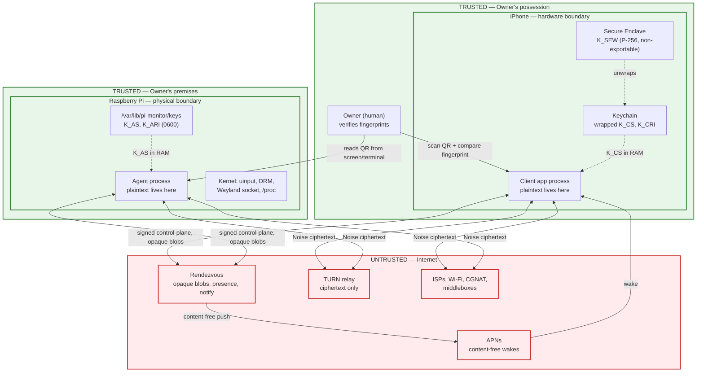
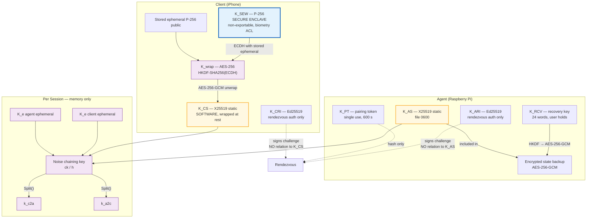
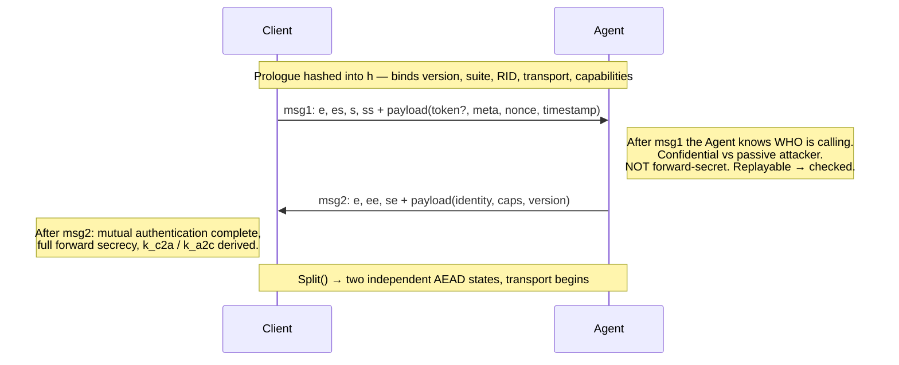
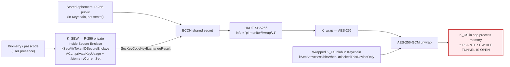
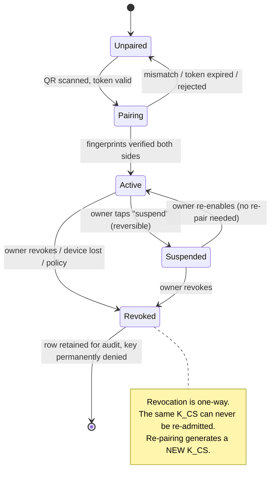
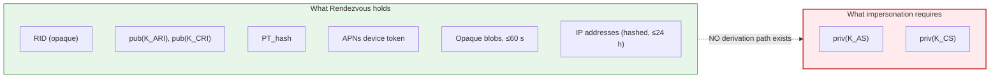

# 04 — Security & End-to-End Encryption Design

**Status:** Normative. This document is the authority for every security claim made
anywhere in this repository. Where another document appears to promise a stronger
property than this one, **this document wins**.

Read [00-GLOSSARY](00-GLOSSARY.md) first. The wire encoding of everything described
here is specified in [05-PROTOCOL](05-PROTOCOL.md); the components referenced are
defined in [03-ARCHITECTURE](03-ARCHITECTURE.md); on-Pi storage of the artefacts
described here is in [06-DATA-MODEL](06-DATA-MODEL.md); the operating-system-level
protection of the Agent's key files is in [11-AGENT-DEPLOYMENT](11-AGENT-DEPLOYMENT.md).

---

## 1. Scope and philosophy

### 1.1 What this document covers

| In scope | Out of scope (and where it lives) |
|---|---|
| Security objectives and their requirement IDs (`SEC-nnn`) | Functional requirements — SRS (`02-SRS.md`) |
| Threat model (STRIDE), trust boundaries, adversary catalogue | Delivery/schedule risk — Risk Register (`12-RISK-REGISTER.md`) |
| Key hierarchy, derivation, lifetime, storage | Byte-level encoding — [05-PROTOCOL](05-PROTOCOL.md) |
| Pairing ceremony and fingerprint verification contract | Pairing *screen layouts* — UX Spec (`07-UX-SPEC.md`) |
| Noise handshake analysis, transport crypto, rekeying | Transport/NAT mechanics — [03-ARCHITECTURE](03-ARCHITECTURE.md) |
| Replay / reflection / downgrade defences | Test procedures — Test Plan (`09-TEST-PLAN.md`) |
| Revocation, recovery, audit logging | OS hardening of the Pi — [11-AGENT-DEPLOYMENT](11-AGENT-DEPLOYMENT.md) |
| Honest statement of residual risk | Legal/compliance posture |

### 1.2 Design philosophy

1. **The intermediaries are assumed hostile from day one.** Rendezvous, TURN, APNs and
   every network operator are modelled as adversaries who may log everything, replay
   anything, and actively tamper. The design is only interesting if it survives that.
2. **No cryptographic property is claimed unless it is achieved by construction.** We do
   not claim post-compromise security from a symmetric ratchet, and we do not claim the
   Noise static key lives in the Secure Enclave (it cannot — see §9.2).
3. **Explicit trust, never TOFU.** A device becomes trusted only after a two-sided,
   out-of-band fingerprint comparison performed by a human.
4. **Fail closed on confidentiality, fail open on observability.** If we cannot
   authenticate, we do not connect. If we cannot connect, the Agent keeps recording
   locally (README principle P5).
5. **Every residual risk is written down.** A risk that is named and accepted is
   engineering; a risk that is hidden behind marketing language is negligence. Residual
   risks in this document are tagged `RR-nn` and collected in §21.

---

## 2. Security objectives

| ID | Objective | Property | Adversary it defeats |
|---|---|---|---|
| SEC-001 | Only the paired Client and its Agent can read session plaintext | Confidentiality | Passive network, Rendezvous, TURN, APNs, ISP |
| SEC-002 | Neither endpoint can be impersonated by any intermediary | Mutual authentication | Active MITM, malicious Rendezvous |
| SEC-003 | Compromise of a static key MUST NOT decrypt previously recorded sessions | Forward secrecy | Retrospective key seizure, coercion |
| SEC-004 | After an attacker loses access, subsequent sessions become secure again | Post-compromise security | Transient device compromise |
| SEC-005 | No recorded message can be usefully replayed or reflected | Replay/reflection resistance | Active network, Rendezvous |
| SEC-006 | The negotiated cipher suite and version cannot be silently downgraded | Downgrade resistance | Active MITM |
| SEC-007 | Undetected modification of any byte in transit MUST be impossible | Integrity | Active network, TURN |
| SEC-008 | Push notification payloads MUST contain no user-derived content | Metadata minimisation | APNs, Apple, Rendezvous operator |
| SEC-009 | Rendezvous MUST NOT hold any secret whose disclosure enables impersonation | Zero-knowledge signalling | Malicious/compromised Rendezvous operator |
| SEC-010 | A stolen, locked iPhone MUST NOT yield the Client static key | Key-at-rest protection | Device theft |
| SEC-011 | A stolen Pi SD card MUST yield the Agent key only if the card was unencrypted, and this MUST be disclosed to the user | Honest key-at-rest posture | Physical Pi access |
| SEC-012 | A revoked Client device MUST be unable to establish a new Session | Revocation | Lost/stolen device, ex-household member |
| SEC-013 | Every privileged Action and every Session MUST be recorded in a tamper-evident local log | Accountability | Insider, post-incident forensics |
| SEC-014 | The Client MUST require user presence (biometry/passcode) before unlocking the Noise static key | Local access control | Shoulder-surfer, opportunistic access to an unlocked phone |
| SEC-015 | The protocol MUST be versioned such that a future cipher-suite change is a clean, negotiated transition | Cryptographic agility | Future cryptanalysis |
| SEC-016 | Screen frames and PTY bytes MUST NOT be written to persistent storage on either endpoint by default | Data minimisation | Forensic recovery, backup extraction |
| SEC-017 | The Agent MUST NOT open any inbound listening socket reachable from outside the host | Attack-surface elimination | Internet-wide scanning, pre-auth RCE |
| SEC-018 | Key material MUST NOT appear in logs, crash reports, diagnostics, or analytics | Leak prevention | Telemetry pipelines, support workflows |

---

## 3. Trust boundaries



### 3.1 Boundary inventory

| # | Boundary | Crosses | What is asserted at the crossing | Enforcement |
|---|---|---|---|---|
| B1 | Secure Enclave ↔ app process | Unwrapped `K_CS` bytes | User presence proven (biometry/passcode) | Enclave ACL `.biometryCurrentSet` + `.privateKeyUsage` |
| B2 | App process ↔ iOS Keychain | Wrapped `K_CS` blob | Device unlocked, this device only | `kSecAttrAccessibleWhenUnlockedThisDeviceOnly` |
| B3 | App process ↔ App Group container | Telemetry snapshot for widgets | No key material, no PTY, no frames | Content policy §16.3, Data Protection class |
| B4 | Client ↔ Internet | Noise records | Peer is the paired Agent | Noise_IK mutual auth |
| B5 | Client/Agent ↔ Rendezvous | Signed control-plane, opaque blobs | Possession of `K_CRI` / `K_ARI` only | Ed25519 challenge-response |
| B6 | Client/Agent ↔ TURN | Ciphertext | Nothing — TURN is a dumb pipe | Short-lived HMAC credentials |
| B7 | Rendezvous ↔ APNs | Content-free wake | Nothing about the user | Payload policy §15 |
| B8 | Agent process ↔ kernel | uinput writes, screencopy reads, /proc reads | Agent is authorised to drive this seat | Unix DAC + systemd sandbox |
| B9 | Agent process ↔ PTY child | Shell bytes | Session is authenticated and audited | §18, [ADR-0006](adr/ADR-0006-shell-transport.md) |
| B10 | Agent ↔ SD card | `K_AS` at rest | File DAC only, unless FDE enabled | §9.3 — weakest boundary in the system |

> **Residual risk RR-01:** B10 is the weakest boundary in the entire design. On a stock
> Raspberry Pi OS install with no full-disk encryption, anyone who physically removes the
> SD card obtains `K_AS` and can thereafter impersonate the Agent to every paired Client
> indefinitely, because Clients authenticate the Agent solely by that static key. We do
> not hide this. Mitigations and their costs are in §9.3.

---

## 4. Adversary catalogue

Each adversary is modelled with explicit capabilities, and the design's answer is stated
without hedging. "Not defeated" appears where it is true.

| ID | Adversary | Capabilities assumed | Outcome | Residual |
|---|---|---|---|---|
| A1 | **Passive network observer** (ISP, Wi-Fi operator, nation-state tap) | Records all traffic indefinitely; can later obtain static keys | Cannot read any session, past or present. Forward secrecy (SEC-003) means yesterday's recordings stay unreadable after a key seizure | Traffic volume, timing, endpoint IPs, session start/stop are all visible → `RR-02` |
| A2 | **Active MITM** (rogue AP, BGP hijack, compromised ISP) | Intercepts, drops, modifies, injects, replays; can impersonate Rendezvous and TURN | Cannot complete a Noise_IK handshake without `K_AS` (to respond) or a *paired* `K_CS` (to initiate). Tampering is detected by Poly1305 and terminates the tunnel | Can force denial of service indefinitely → `RR-03` |
| A3 | **Malicious Rendezvous operator** | Full control of the signalling service; sees every blob, IP, presence event, APNs token; can forge blobs, drop, reorder, delay, replay | Cannot read or forge session traffic (§14). Can deny service, and can learn a rich metadata graph | Metadata; denial of service; can *suppress* alerts by refusing to push → `RR-04`, `RR-05` |
| A4 | **Malicious TURN operator** | Sees and can modify every relayed byte; unlimited retention | Sees only Noise-inside-DTLS ciphertext. Modification is detected and fatal. This is precisely why Noise is *inside* the DataChannel rather than relying on DTLS | Volume/timing metadata, IPs of both peers → `RR-02` |
| A5 | **Stolen unlocked iPhone** (grabbed while in use, or coerced unlock) | Full access to the running app and the Keychain of an unlocked device | **Not defeated for the session in progress.** The biometric gate (SEC-014) is re-armed on backgrounding and after a configurable idle timeout, and privileged Actions re-prompt. An attacker with an unlocked phone and the user's face/finger has the Pi | `RR-06` — mitigations are UX-level only |
| A6 | **Stolen locked iPhone** | Device in possession, locked, powered on or off; forensic extraction tooling; long timeline | `K_CS` is wrapped by an Enclave key requiring biometry-or-passcode and is `ThisDeviceOnly`. With a strong passcode (6+ digits, better alphanumeric) and a current iOS version, extraction is not currently practical | Depends entirely on iOS platform security; a future Enclave/BootROM exploit changes this → `RR-07` |
| A7 | **Physical access to the Pi** | Removes SD card, images it offline; or attaches keyboard/monitor; or has root | Obtains `K_AS` unless FDE is used → full impersonation of the Agent to all Clients. With root on a running Pi, the attacker simply *is* the Agent | `RR-01` — the dominant unmitigated physical risk |
| A8 | **Malicious LAN peer** (compromised IoT device, guest on the Wi-Fi) | ARP/DNS spoofing, port scanning, mDNS poisoning, local traffic capture | SEC-017: the Agent has no inbound listening socket, so there is nothing on the LAN to attack. LAN ICE candidates are still authenticated by Noise; spoofing them only causes a failed handshake | Can observe that the Pi talks to a Rendezvous host → `RR-02` |
| A9 | **Compromised app-store update channel** | Ships a backdoored Client build signed by a valid developer identity | **Not defeated.** A malicious Client build has legitimate access to `K_CS` and all plaintext. This is a supply-chain trust assumption we inherit from the platform | `RR-08` — mitigations are process-level (reproducible builds, signed releases, transparency) |
| A10 | **Compromised Agent update channel** (apt repo) | Ships a backdoored `.deb` | Mitigated by repository signing and pinned `signed-by` keyring, and by reproducible builds. Not eliminated — a stolen signing key defeats it | `RR-09` |
| A11 | **Apple / APNs** | Sees every push, every device token, timing | Sees content-free wakes only (SEC-008). Learns that *something* happened and when | `RR-10` — alert *timing* is visible to Apple even though content is not |
| A12 | **Curious household member** | Physical proximity to an unlocked phone or the Pi's screen; can see the QR during pairing | A QR photographed during the pairing window yields a *single-use*, 10-minute pairing token. If used before the owner, the attacker pairs their own device — but the owner's fingerprint comparison then fails on the owner's own attempt, and the Agent shows an unexpected paired device | Pairing window is the exposure → §7.6, `RR-11` |

> **Residual risk RR-02 (metadata):** This design protects *content*, not *the fact of
> communication*. Any observer positioned at Rendezvous, at TURN, or on either access
> network learns: that a particular iPhone talks to a particular Pi, when, for how long,
> how much data flowed in each direction, and (from volume patterns) plausibly whether the
> user was watching the screen, typing in a shell, or merely polling telemetry. We do not
> pad traffic and we do not defend against traffic analysis. Padding to a constant rate
> would cost 1.5–3 Mbps continuously and is not justified for this product.

---

## 5. STRIDE threat model

STRIDE is applied per boundary from §3.1. "Mitigation" states the concrete mechanism;
"Residual" states what is left.

### 5.1 Spoofing

| # | Threat | Boundary | Mitigation | Residual |
|---|---|---|---|---|
| S1 | Attacker impersonates the Agent to the Client | B4 | Noise_IK: the Client encrypts to the known `K_AS` from the QR; only the holder of `K_AS` can complete `es`/`ss` | Holder of a stolen `K_AS` succeeds (`RR-01`) |
| S2 | Attacker impersonates a paired Client to the Agent | B4 | Agent checks the initiator static against `paired_client` and rejects unknown or revoked keys | Holder of a stolen, unlocked phone succeeds (`RR-06`) |
| S3 | Rendezvous impersonates either peer | B5 | Rendezvous never holds `K_AS` or any `K_CS`; the Ed25519 rendezvous identities are cryptographically unrelated (§14) | None for content; can deny service |
| S4 | Attacker registers a rendezvous id belonging to someone else | B5 | Rendezvous id ownership is bound to `K_ARI` at first registration; re-registration requires a signature from the same key | Loss of `K_ARI` requires a rendezvous-id rotation |
| S5 | Malicious app impersonates the Client app to read the App Group | B3 | App Group entitlement is enforced by the OS and bound to the team identifier | Jailbreak defeats this (`RR-12`) |
| S6 | Attacker forges a push to trigger a bogus alert | B7 | The push is content-free; the Client fetches the actual alert over the authenticated Tunnel and renders nothing without it | Forged pushes cause battery drain / spurious wakes only |

### 5.2 Tampering

| # | Threat | Boundary | Mitigation | Residual |
|---|---|---|---|---|
| T1 | Modify session bytes in flight | B4, B6 | ChaCha20-Poly1305 AEAD; any failure is fatal and terminates the tunnel (no "skip and continue") | Detected DoS |
| T2 | Reorder or drop records | B4 | Strictly increasing per-direction nonce counters; a gap or regression is fatal | Drop-based DoS |
| T3 | Tamper with signalling blobs | B5 | Blobs are Noise handshake messages; tampering causes handshake failure, not compromise | DoS |
| T4 | Tamper with ICE candidates to force TURN relaying | B5 | Not prevented — but relaying is still fully E2EE, so the attacker gains only metadata and latency | `RR-13` |
| T5 | Modify Agent binary or config on the Pi | B8, B10 | Package signature at install; file DAC; systemd sandbox | Root on the Pi defeats all of it (`RR-01`) |
| T6 | Modify the widget snapshot in the App Group | B3 | OS sandbox; content is non-authoritative and re-fetched on app open | Jailbreak (`RR-12`) |
| T7 | Inject input events into the Pi from a local process | B8 | `/dev/uinput` restricted to the Agent's group by udev; not world-writable | Any local user in that group can inject (`RR-14`) |

### 5.3 Repudiation

| # | Threat | Mitigation | Residual |
|---|---|---|---|
| R1 | Owner denies having run a destructive Action | Append-only, hash-chained `audit_log` on the Pi records actor client id, action, arguments digest, outcome (§18) | Root on the Pi can rewrite history (`RR-15`) |
| R2 | Owner denies a shell session occurred | Session open/close, duration, and byte counts are audited (never the bytes themselves) | Same as R1 |
| R3 | A revoked device denies it was revoked | Revocation events are audited with timestamp and initiating device | Same as R1 |

### 5.4 Information disclosure

| # | Threat | Mitigation | Residual |
|---|---|---|---|
| I1 | Screen contents leak to a relay | Noise inside the DataChannel; TURN sees ciphertext | Frame *sizes* leak activity (`RR-02`) |
| I2 | Alert text leaks via push | Content-free pushes; body fetched over the Tunnel (§15) | Push *timing* leaks (`RR-10`) |
| I3 | Telemetry leaks to the cloud | Nothing is uploaded anywhere; the Pi is the source of truth (README P4) | Widget snapshot lives in the App Group (§16.3) |
| I4 | Key material leaks via logs or crash reports | SEC-018: key types are excluded from all logging and from crash symbolication payloads; a redaction test is part of the release checklist (§20) | Core dumps on the Pi — disable them (§9.3) |
| I5 | App-switcher snapshot exposes the screen or terminal | Privacy overlay applied on `willResignActive` (§17.2) | Screen recording by another process on a jailbroken device (`RR-12`) |
| I6 | Screenshots / screen recording of the remote desktop | Not preventable on iOS for the app's own content; detection only (§17.4) | `RR-16` |
| I7 | Clipboard leaks pasted secrets | Clipboard bridging is opt-in and off by default; universal clipboard is not used (§17.3) | User may still paste manually |
| I8 | Backup extraction yields `K_CS` | `ThisDeviceOnly` accessibility excludes the key from iCloud Keychain and from encrypted-backup portability | Unencrypted local backups still exclude it; verify in test |
| I9 | Rendezvous correlates users | Rendezvous ids are opaque 128-bit values, rotatable, with no account, email, or username attached | IP correlation remains (`RR-02`) |

### 5.5 Denial of service

| # | Threat | Mitigation | Residual |
|---|---|---|---|
| D1 | Rendezvous refuses to signal | Client falls back to a user-configured alternate Rendezvous; Agent keeps recording locally (P5) | Total outage of the only configured Rendezvous blocks new sessions (`RR-05`) |
| D2 | Handshake flood against the Agent | The Agent only processes handshakes arriving via an authenticated Rendezvous session or an established ICE path; per-source rate limits; unknown initiator statics are rejected after one cheap DH | CPU cost of one X25519 op per attempt (`RR-17`) |
| D3 | Resource exhaustion via oversized frames | Hard maximum frame and message sizes, enforced before allocation ([05-PROTOCOL](05-PROTOCOL.md) §3) | None |
| D4 | Screen channel starves control | Priority scheduler with a reserved share for non-screen channels; screen frames are drop-eligible | Degraded video under contention (by design) |
| D5 | Disk exhaustion by telemetry | Bounded retention ladder and a hard database size cap with oldest-first eviction ([06-DATA-MODEL](06-DATA-MODEL.md)) | None |
| D6 | Battery drain on the phone via forged pushes | Push rate limiting at Rendezvous per rendezvous id | Bounded drain (`RR-18`) |

### 5.6 Elevation of privilege

| # | Threat | Mitigation | Residual |
|---|---|---|---|
| E1 | Remote code execution in the Agent | Rust memory safety for all parsing; every length is bounds-checked before allocation; the only `unsafe` FFI surfaces are the x264 encoder, V4L2, Wayland and uinput, which are fuzzed separately | `unsafe` FFI remains the highest-risk code (`RR-19`) |
| E2 | Shell channel gives root | The PTY runs as the configured non-root shell user. **`sudo` inside that shell is a full privilege escalation path by design** — this is a remote root shell in practice and is documented as such ([ADR-0006](adr/ADR-0006-shell-transport.md)) | `RR-20` |
| E3 | Action allow-list bypass | Actions are a closed enumeration with typed arguments; no shell interpolation; arbitrary commands are only reachable via the `shell` channel | `RR-20` |
| E4 | Local user escalates via the Agent | Agent runs as an unprivileged user with an empty `CapabilityBoundingSet`; state directory is 0750, keys 0700/0600 | A member of the uinput group can inject input (`RR-14`) |
| E5 | Malicious input events from a compromised Client | The Client is a trusted endpoint by definition after pairing; input injection is its purpose | Revocation is the only control (`RR-06`) |

---

## 6. Key hierarchy

### 6.1 Inventory

| Symbol | Name | Algorithm / size | Generated by | Generated when | Lifetime | Rotatable | Storage | Compromise impact |
|---|---|---|---|---|---|---|---|---|
| `K_AS` | Agent static | X25519, 32 B private | Agent | First run | Until re-provisioned | Yes, with re-verification by every Client | Pi disk, 0600, `/var/lib/pi-monitor/keys` | **Total.** Full Agent impersonation to all Clients; decrypts *future* sessions only (FS holds for past) |
| `K_CS` | Client device static (one per iOS device) | X25519, 32 B private | Client | At pairing | Until device unpaired/revoked | Yes, via re-pairing | iOS Keychain, AES-GCM-wrapped (§9.2) | Impersonation of that one device until revoked |
| `K_SEW` | Secure Enclave wrapping key | **NIST P-256**, non-exportable | Secure Enclave | At pairing | Device lifetime; destroyed on biometric-set change | Implicitly, on re-enrolment | Secure Enclave only | Cannot be extracted; loss makes `K_CS` unrecoverable (by design) |
| `K_wrap` | Derived wrapping key | AES-256 via HKDF-SHA256 | Client | Per unwrap | Ephemeral (memory) | n/a | Never stored | Exposes `K_CS` if captured in memory |
| `K_ARI` | Agent Rendezvous Identity | Ed25519 | Agent | First run | Until rendezvous id rotation | Yes | Pi disk, 0600 | Presence spoofing / DoS only. **Cannot impersonate the Noise endpoint** |
| `K_CRI` | Client Rendezvous Identity (per device) | Ed25519 | Client | At pairing | Until revocation | Yes | iOS Keychain | Signalling-layer nuisance only |
| `K_PT` | Pairing token | 256-bit random | Agent | Per pairing attempt | 600 s, single use | n/a | QR + hash-only at Rendezvous and on the Pi | Allows one pairing attempt within the window (`RR-11`) |
| `K_e` | Ephemeral DH keys | X25519, per handshake | Both | Per handshake | One handshake | n/a | Memory only, zeroised | Breaks FS for that one session |
| `k_c2a`, `k_a2c` | Transport keys | ChaCha20-Poly1305, 32 B each | Derived by `Split()` | Per handshake | Until rekey or re-handshake | Automatic | Memory only, zeroised | Decrypts traffic until the next rekey |
| `K_RCV` | Recovery key | 256-bit, displayed as 24 BIP-39 words | Agent | At first run, shown once | User-controlled | Yes, regenerates the backup wrapping | **User's possession only** — never stored on the Pi in plaintext | Decrypts an Agent state backup, including `K_AS` |
| `RID` | Rendezvous id | 128-bit opaque | Agent | First run | Until rotated | Yes | QR + Rendezvous + Client | Enables presence tracking and DoS targeting |

### 6.2 Derivation graph



> **Read the diagram carefully.** Only `K_SEW` is inside the Secure Enclave. `K_CS` — the
> key that actually authenticates the Client in the Noise handshake — is a software key
> that is *protected by* the Enclave at rest. See §9.2 and
> [ADR-0003](adr/ADR-0003-ios-key-storage.md).

### 6.3 Key separation rules

| Rule | Statement |
|---|---|
| KS-1 | No key is ever used for two purposes. Rendezvous authentication uses Ed25519 identities that are independently generated and share no seed with the Noise statics. |
| KS-2 | The Noise static keys are never used to sign anything. They are DH keys only. This avoids the XEdDSA/cross-protocol pitfalls entirely. |
| KS-3 | All HKDF invocations use a distinct, versioned `info` string containing the protocol name, version, and purpose. |
| KS-4 | Ephemeral private keys are zeroised immediately after the handshake completes; transport keys are zeroised on tunnel close and on rekey. |
| KS-5 | No key material is ever transmitted to Rendezvous, TURN, APNs, or any analytics endpoint, in any form, including hashed. |

---

## 7. The pairing ceremony

Pairing is the **only** moment at which trust is created. Everything else in this
document depends on it being done correctly, so it is specified in unusual detail.

### 7.1 Preconditions

| Precondition | Rationale |
|---|---|
| The Agent is installed, running, and has generated `K_AS`, `K_ARI`, `RID` | There is something to pair with |
| The Agent's clock is NTP-synchronised | Token expiry and handshake timestamps require it — see `RR-21` |
| The owner is physically present at the Pi (screen, or SSH/serial for Lite installs) | The QR is the out-of-band channel; if the attacker can read the QR, pairing is compromised |
| The iPhone has biometry or a passcode enrolled | `K_SEW` requires an ACL that a passcode-less device cannot satisfy |

### 7.2 Ceremony sequence

```mermaid
sequenceDiagram
    autonumber
    actor O as Owner
    participant A as Agent (Pi)
    participant R as Rendezvous (untrusted)
    participant C as Client (iPhone)
    participant SE as Secure Enclave

    Note over A: Owner runs the pairing command<br/>or taps "Pair" in the Pi UI
    A->>A: Generate K_PT (256-bit), TTL 600 s, single use
    A->>A: Compute PT_hash = BLAKE2s(domain ‖ K_PT)
    A->>R: Register pairing intent (RID, PT_hash), signed with K_ARI
    R-->>A: Accepted, expires_at
    A->>O: Render QR: { version, RID, pub(K_AS), K_PT, rendezvous host, agent name }
    Note over A,O: Desktop: window on the Pi's display.<br/>Lite: Unicode half-block QR in the terminal + word code.

    O->>C: Scan QR with the Client app
    C->>C: Parse; reject if version unknown or fields malformed
    C->>SE: Create K_SEW (P-256, .privateKeyUsage + .biometryCurrentSet)
    SE-->>C: Public key handle (private key never leaves the Enclave)
    C->>C: Generate K_CS (X25519) and K_CRI (Ed25519) in software
    C->>SE: ECDH(K_SEW, fresh ephemeral P-256) → HKDF → K_wrap
    C->>C: Wrap K_CS, K_CRI with AES-256-GCM under K_wrap; store in Keychain
    C->>C: Zeroise plaintext K_CS copy used for wrapping

    C->>R: Claim pairing (RID, PT_hash, pub(K_CRI)), signed with K_CRI
    R->>R: Verify PT_hash matches a live intent; mark CLAIMED (single use)
    R-->>C: Signalling channel opened
    C->>R: Noise_IK msg1 as opaque blob<br/>payload: pub(K_CRI), device name, iOS version, K_PT, timestamp, nonce
    R->>A: Deliver blob (Rendezvous cannot read it)
    A->>A: Decrypt msg1 using K_AS; verify K_PT matches, unconsumed, unexpired
    A->>A: Verify timestamp skew ≤ ±120 s; insert ephemeral into replay cache
    A->>R: Noise_IK msg2 as opaque blob<br/>payload: agent name, model, capabilities, protocol version
    R->>C: Deliver blob
    C->>C: Handshake complete → k_c2a, k_a2c

    Note over C,A: FINGERPRINT VERIFICATION — MANDATORY, TWO-SIDED
    A->>O: Display FP(K_AS) and FP(K_CS): 8×4 Base32 groups + 6 words/emoji
    C->>O: Display the same two fingerprints, computed independently
    O->>C: Compare BOTH. Tap "They match" (or "They do NOT match")
    alt Owner confirms match
        C->>A: PAIR_CONFIRM over the established tunnel
        A->>A: Consume K_PT; insert paired_client row; write audit record
        A->>C: PAIR_ACCEPTED (agent identity, capabilities, series catalogue)
        C->>C: Mark pairing complete; persist agent record
    else Owner reports mismatch
        C->>A: PAIR_REJECT (reason: fingerprint mismatch)
        A->>A: Consume and burn K_PT; write a HIGH-SEVERITY audit record
        A->>O: On-Pi warning: possible interception attempt
        C->>C: Delete K_CS, K_CRI, K_SEW; show the mismatch warning screen
    end
```

### 7.3 What the QR contains

Fields only — the encoding is in [05-PROTOCOL](05-PROTOCOL.md).

| Field | Type | Purpose | Secret? |
|---|---|---|---|
| `v` | integer | QR payload version | No |
| `rid` | 128-bit opaque | Which Agent to signal for | No (but linkable — treat as private) |
| `apk` | 32-byte X25519 public | The Agent identity the Client will pin | No |
| `pt` | 256-bit random | Single-use pairing authorisation | **Yes** |
| `rz` | hostname | Which Rendezvous to use | No |
| `name` | short UTF-8 string | Human label shown during pairing | No |
| `fp6` | 6 words | Pre-committed short fingerprint, so the Client can warn *before* connecting if the scanned key mismatches a re-pair | No |

### 7.4 Fingerprint construction

| Property | Value |
|---|---|
| Input | `BLAKE2s-256( "pi-monitor/fp/v1" ‖ role_byte ‖ raw 32-byte public key )` |
| Hex/Base32 form | First 160 bits, RFC 4648 Base32 without padding, uppercase, rendered as 8 groups of 4 characters |
| Word form | First 66 bits mapped to 6 words from a 2048-word list (11 bits per word), disjoint from BIP-39 to avoid confusion with `K_RCV` |
| Emoji form | Same 66 bits mapped to 6 emoji from a curated 2048-glyph set chosen for cross-platform visual distinctness |
| Security level | 66 bits for the word/emoji form — an attacker must do ~2⁶⁵ work to find a colliding key. Adequate for a human-compared value; the full 160-bit form is available on the details screen |

> **Residual risk RR-22:** The 6-word form provides 66 bits, not 160. This is a deliberate
> usability trade-off. A resourced attacker capable of ~2⁶⁵ offline X25519 key generations
> could construct a key whose *short* fingerprint matches while the full one does not. The
> UX contract (§7.5) therefore requires the full Base32 form to be available in one tap,
> and the security-conscious user is told to compare it.

### 7.5 Fingerprint verification UX contract

This is a **normative contract on the UX Spec** (`07-UX-SPEC.md`). The implementation of
the screens is that document's business; these rules are not negotiable.

| # | Rule |
|---|---|
| FV-1 | Both fingerprints — the Agent's and the Client's — MUST be displayed simultaneously on both the Pi and the phone. One-sided verification is not verification. |
| FV-2 | The confirmation control MUST NOT be the default, pre-selected, or visually dominant action. The affirmative and negative actions MUST have equal visual weight. |
| FV-3 | The affirmative control MUST NOT be enabled until the fingerprint has been on screen for at least 2 seconds, to defeat reflexive tapping. |
| FV-4 | The copy MUST ask a comparison question ("Do these match what the Pi is showing?"), never a permission question ("Allow this device?"). |
| FV-5 | There MUST be no "skip", "remind me later", "trust automatically", or "verify next time" affordance anywhere in the flow. TOFU is rejected by the glossary and by this document. |
| FV-6 | Selecting "they do not match" MUST destroy all key material generated during the attempt, burn the pairing token, and surface a warning that names interception as the likely cause. |
| FV-7 | The full 160-bit Base32 fingerprint MUST be reachable in exactly one tap from the comparison screen. |
| FV-8 | The fingerprint MUST be re-displayable at any later time from device settings on both endpoints, so the owner can re-verify after a suspected incident. |
| FV-9 | If the Agent's static key ever differs from the pinned value, the Client MUST refuse to connect and MUST present a distinct "identity changed" screen — never a generic connection error, and never an "accept new key" button that connects in the same tap. Re-pairing MUST require the full ceremony. |
| FV-10 | Accessibility: fingerprints MUST be readable by VoiceOver with per-character spelling for the Base32 form, and the word form MUST be the primary comparison method for users who cannot compare emoji. |

### 7.6 Pairing-window exposure

| Exposure | Window | Control |
|---|---|---|
| QR visible on the Pi's screen | Until consumed or 600 s | Owner is present; the QR window closes on completion |
| QR in a terminal scrollback over SSH | Persists in the SSH client's buffer | Documented warning; the pairing command clears the screen on exit |
| Token replayed by an attacker who photographed the QR | ≤ 600 s, exactly once | Single-use consumption; and the *owner's* subsequent attempt fails visibly, which is the detection signal |
| Rendezvous learns `PT_hash` | Until TTL | It is a hash; Rendezvous cannot derive `K_PT`, and possession of the hash does not authorise pairing (the Agent checks the preimage) |

> **Residual risk RR-11:** An attacker who photographs the QR within its 600-second window
> and completes pairing *before* the owner obtains a working paired device. The owner
> detects this because their own pairing attempt fails and because the Pi lists an
> unexpected paired device — but detection is after the fact. Reducing the TTL below
> ~120 s trades this against real usability failures on slow first-run flows. We choose
> 600 s and rely on the owner's physical presence.

---

## 8. Noise_IK handshake analysis

Pattern: `Noise_IK_25519_ChaChaPoly_BLAKE2s`. Client = initiator, Agent = responder.
The Client always knows `K_AS` before initiating, which is exactly the precondition `IK`
is designed for. See [ADR-0002](adr/ADR-0002-crypto-handshake.md) for why not XX, TLS 1.3,
or a double ratchet.

### 8.1 Prologue

The prologue is hashed into `h` before any message and therefore binds the entire
handshake to the context. Any disagreement produces a decryption failure, not a
negotiated fallback — this is the whole of our downgrade protection (SEC-006).

| Prologue field | Purpose |
|---|---|
| Protocol label and version (major.minor) | Prevents cross-version confusion |
| Cipher-suite identifier | Prevents suite substitution |
| `RID` | Binds the handshake to the intended Agent identity slot |
| Transport kind (`webrtc-dc`, `ws-relay`) | Prevents a transport-confusion attack across the two paths |
| Client capability set digest | Prevents feature-downgrade by an intermediary |
| Agent capability set digest (from the QR / pinned record) | Same, in the other direction |

### 8.2 Message 1 — `-> e, es, s, ss`

| Token | Operation | What it achieves |
|---|---|---|
| `e` | Client sends a fresh ephemeral public key in cleartext | Contributes to forward secrecy |
| `es` | DH(client ephemeral, agent static) | Only the true Agent can derive this. Everything after is unreadable to anyone else |
| `s` | Client's static public key, **encrypted** under the key derived so far | Client identity is hidden from passive observers |
| `ss` | DH(client static, agent static) | Binds the Client's long-term identity into the chaining key |

**Payload of message 1:** pairing token (pairing only), Client device metadata, a 32-byte
random nonce, and a Unix timestamp.

**What message 1 does NOT provide — stated plainly:**

| Non-property | Consequence | Mitigation |
|---|---|---|
| Not forward-secret | An attacker who later obtains `K_AS` *and* recorded message 1 can decrypt message 1's payload (not the session — the session keys mix in `ee` and `se`) | The payload contains no long-term secret. The pairing token is single-use and short-lived, so retrospective disclosure is worthless |
| Not replay-protected by the pattern itself | An attacker can resend a recorded message 1 verbatim | Timestamp skew ≤ ±120 s, plus a 5-minute bounded cache of seen client-ephemeral public keys. A replay is rejected without a state change |
| Vulnerable to key-compromise impersonation of the responder | An attacker holding `K_AS` can forge a message 1 that appears to come from any Client whose static public key they know | Accepted: an attacker with `K_AS` has already fully compromised the Agent (`RR-01`) |
| Not a proof of liveness | The Agent commits ephemeral state before hearing from a live peer | Bounded handshake state table with an LRU cap and per-source rate limits (D2) |

### 8.3 Message 2 — `<- e, ee, se`

| Token | Operation | What it achieves |
|---|---|---|
| `e` | Agent's fresh ephemeral | Second contribution to forward secrecy |
| `ee` | DH(both ephemerals) | **Forward secrecy is complete from this point.** Compromise of both static keys later does not decrypt this session |
| `se` | DH(client static, agent ephemeral) | Completes mutual authentication: the Client is now proven to hold `K_CS` |

**Payload of message 2:** Agent identity, model, firmware/OS version, protocol version,
capability set, and the current series catalogue version. Fully forward-secret and
mutually authenticated.

### 8.4 Property timeline



| After | Confidentiality | Client authenticated to Agent | Agent authenticated to Client | Forward secrecy |
|---|---|---|---|---|
| msg1 | vs passive only | Yes (via `s`,`ss`) — but replayable | No | No |
| msg2 | Full | Yes | Yes | Yes |
| Transport | Full | Yes | Yes | Yes |

### 8.5 Handshake failure policy

| Failure | Agent response | Client response | Audited? |
|---|---|---|---|
| Unknown initiator static | Silent drop after one DH; no distinguishing error | Timeout → generic failure | Yes, counted only |
| Revoked initiator static | `1105 REVOKED` **after** msg2 completes, so the Client can show a precise message | Show "this device was removed" | Yes, with client id |
| Bad pairing token | `1103 PAIRING_TOKEN_INVALID` | Show "pairing code expired — generate a new one" | Yes, high severity if repeated |
| Timestamp skew | `1104 CLOCK_SKEW` including the Agent's view of time | Offer "check the Pi's clock" guidance | Yes |
| Replayed ephemeral | Silent drop | Timeout | Yes, high severity |
| Prologue mismatch | AEAD failure → silent drop | Timeout | Yes, counted |

Note the deliberate asymmetry: an *unknown* key gets silence (no oracle for enumerating
paired devices), while a *known but revoked* key gets a clear error (the owner deserves a
comprehensible message on their own device).

---

## 9. Key storage

### 9.1 Summary

| Endpoint | Key | At-rest protection | Unlock condition | Survives OS reinstall? |
|---|---|---|---|---|
| iOS | `K_SEW` | Secure Enclave, non-exportable | Biometry or device passcode | No (by design) |
| iOS | `K_CS`, `K_CRI` | AES-256-GCM under `K_wrap`, blob in Keychain | Device unlocked **and** Enclave ACL satisfied | No |
| Pi | `K_AS`, `K_ARI` | Filesystem DAC only (0600) unless FDE | Filesystem readable | Yes — this is `RR-01` |
| Pi | Backup blob | AES-256-GCM under HKDF(`K_RCV`) | User supplies the 24 words | Yes, deliberately |

### 9.2 iOS — the Secure Enclave / Curve25519 mismatch

**The constraint, stated without spin:** Apple's Secure Enclave supports NIST P-256 only.
It does not support Curve25519. CryptoKit's `Curve25519` types are software
implementations. Therefore the X25519 key that authenticates the Client in Noise —
`K_CS` — **cannot be Secure-Enclave-resident.** Any product claiming otherwise is either
using P-256 for its handshake or is wrong.

Our construction:



| Property | Achieved? | Note |
|---|---|---|
| `K_CS` unreadable on a powered-off, locked, stolen phone | Yes | Requires the Enclave ACL to be satisfied; `WhenUnlocked` class keeps the blob inaccessible before first unlock |
| `K_CS` excluded from iCloud Keychain and from backup portability | Yes | `ThisDeviceOnly` accessibility. Each device therefore has its own `K_CS`, which is what we want for per-device revocation |
| `K_CS` invalidated if the user's biometric set changes (finger/face added) | Yes | `.biometryCurrentSet` destroys `K_SEW` on enrolment change; recovery is a re-pair. This is a deliberate strictness choice with a real usability cost |
| `K_CS` protected from a compromised app process | **No** | It is in RAM in plaintext for the duration of a tunnel |
| `K_CS` protected from a jailbroken device | **No** | The Enclave protects `K_SEW`, but an attacker with code execution as the app can simply ask the Enclave to unwrap |

> **Residual risk RR-23:** `K_CS` exists in the Client process's address space in plaintext
> for the entire lifetime of an open Tunnel, and the Enclave will unwrap it on demand for
> any code running as the app. The Enclave protects the key **at rest**, not **in use**.
> We reduce exposure by unwrapping lazily, holding the key only for the duration of a
> handshake, zeroising after `Split()`, and never persisting it unwrapped — but on a
> compromised device this buys minutes, not security.

> **Residual risk RR-24:** Choosing X25519 for the handshake is what creates RR-23. A
> `Noise_IK_P256_...` variant would allow a genuinely Enclave-resident static key, at the
> cost of abandoning the well-trodden X25519 path in `snow` and accepting NIST-curve
> implementation hazards. [ADR-0003](adr/ADR-0003-ios-key-storage.md) documents this
> honestly and names it as the single most likely decision to be revisited.

### 9.3 Raspberry Pi — key at rest

| Control | Effect | Cost |
|---|---|---|
| `/var/lib/pi-monitor/keys` mode 0700, files 0600, owned by the Agent's service user | Blocks other local unprivileged users | None |
| Keys written via create-temp → `fsync` → `rename`, never in place | No torn key files after power loss | None |
| Core dumps disabled for the service; `MemoryDenyWriteExecute`, `ProtectKernelLogs` | Reduces key-in-dump exposure | None |
| Keys never in the config file, never in environment variables, never in journald | Blocks the common accidental-leak paths | None |
| **LUKS full-disk encryption** | The only real defence against SD-card theft | Requires a passphrase at boot → breaks unattended headless restart. A Pi has no TPM, so there is no unattended-unlock story. This is why it is *recommended but not default* |
| Optional: keys on a removable USB token mounted at boot | Separates keys from the OS image | Same unattended-boot problem, plus a new failure mode |

**What actually happens if the SD card is stolen:** the thief obtains `K_AS`, `K_ARI`,
`RID`, the full telemetry database, the audit log, and the list of paired client public
keys. They can then impersonate the Agent to every paired Client, indefinitely, and the
Clients will *not* detect it, because the fingerprint they pinned is still correct. They
cannot decrypt previously recorded sessions (forward secrecy holds). They cannot
impersonate the Client to anything.

**Recovery from this is §13.2: rotate `K_AS` and re-pair every device.**

> **Residual risk RR-01 (restated, because it matters most):** Agent static key theft via
> physical access is the single highest-impact unmitigated risk in the product. It is
> mitigated only by physical security of the Pi and optionally by LUKS at the cost of
> unattended boot. The Test Plan MUST include a check that this is disclosed in the
> onboarding flow, not buried here.

---

## 10. Transport encryption

| Aspect | Specification |
|---|---|
| AEAD | ChaCha20-Poly1305, 32-byte key, 12-byte nonce, 16-byte tag |
| Keys | `k_c2a`, `k_a2c` from `Split()` — independent, never shared across directions |
| Nonce | 4 zero bytes ‖ 64-bit big-endian counter, starting at 0, incremented by exactly 1 per record, per direction, per key |
| AD | Empty. The 2-byte outer length prefix is *not* authenticated — a length forgery causes a decryption failure on the next record, which is fatal. See [05-PROTOCOL](05-PROTOCOL.md) §3.2 |
| Max record | 65535 bytes ciphertext (Noise limit); 65519 bytes plaintext |
| Ordering | Guaranteed by the reliable-ordered DataChannel or the WebSocket. A nonce gap or regression is fatal, never tolerated |
| Nonce reuse | Structurally impossible within a key: the counter is monotonic and a key is never reinstalled |
| Counter exhaustion | At 2⁶⁴−1 the tunnel is terminated with `1201 NONCE_EXHAUSTED`. Unreachable in practice — at 65535-byte records this is ~10²⁴ bytes |
| Failure handling | Any AEAD authentication failure terminates the Tunnel immediately. There is no retry, no resync, no "skip the bad record" |

### 10.1 Why Noise inside DTLS

The WebRTC DataChannel already provides DTLS. We run Noise *inside* it anyway.

| Reason | Detail |
|---|---|
| TURN and any future relay must never see plaintext | DTLS terminates at the WebRTC peer. If a relay ever terminates DTLS (an SFU, a corporate middlebox, a future architecture change), Noise still holds |
| Identity must outlive the transport | A Tunnel survives Wi-Fi→cellular transitions and transport swaps (WebRTC → WebSocket fallback). DTLS identity is per-connection; Noise identity is per-Session |
| The WebSocket fallback has no DTLS at all | Only Noise makes that path equivalent in security to the primary path |
| We control the cipher suite and the rekey policy | We do not depend on the DTLS stack's negotiation or its certificate handling |

**Cost, honestly:** double encryption. Per record: DTLS adds ~13–29 bytes of header/tag,
Noise adds 2 + 16 bytes, and the payload is encrypted twice. The *bandwidth* cost is
~1.2%. The *CPU* cost of the second AEAD pass is negligible and frequently overstated:
ChaCha20-Poly1305 on a Cortex-A76 runs at roughly 1–2 GB/s per core, so 3 Mbps
(≈ 375 KB/s) costs on the order of **0.02–0.03% of one core** (estimate — validate with
benchmark). The 2–5% figure sometimes quoted for "adding encryption" belongs to the whole
SCTP/DTLS/ICE stack, not to the extra Noise layer. Noise-inside-DTLS is close to free.
See [ADR-0001](adr/ADR-0001-transport.md).

### 10.2 Rekeying — and what it does and does not buy

Two distinct mechanisms. **They provide different properties and conflating them is the
most common security-marketing error in this space.**

| Mechanism | Trigger | Cost | Provides | Does **NOT** provide |
|---|---|---|---|---|
| **Symmetric rekey** (Noise `Rekey()`: `k' = AEAD(k, 2⁶⁴−1, empty, zeros)`) | First of: 2²⁰ records, 1 GiB, or 15 minutes — per direction | Negligible; one AEAD call, no round trip | Forward secrecy *within* the session: an attacker who captures the current key cannot decrypt records from before the last rekey | **Post-compromise security.** The new key is derived from the old one. An attacker who has `k` derives every future `k'` forever |
| **Full re-handshake** (fresh `Noise_IK` with new ephemerals) | Every 60 minutes; on transport change; on demand after a suspected incident | ~1 RTT + 4 X25519 operations | **Post-compromise security (SEC-004).** New ephemerals mean an attacker who lost access cannot follow the session forward | Nothing beyond it — this is the strong mechanism |

| Rekey rule | Value |
|---|---|
| Rekey nonce handling | On rekey, the direction's counter resets to 0 with the new key. A `REKEY` control frame marks the exact boundary record |
| Re-handshake overlap | The new handshake runs over the existing tunnel; the old transport keys are zeroised only after the first record under the new keys is successfully received |
| Failure to re-handshake | Tunnel terminates at 75 minutes. We do not run indefinitely on stale keys |
| Rekey during screen streaming | Must not drop a frame; the encoder is not reset, only the AEAD state |

> **Statement of record:** Post-compromise security in this product comes from the hourly
> full re-handshake, **not** from `Rekey()`. Any documentation, marketing copy, or App
> Store description claiming otherwise is incorrect and MUST be corrected.

---

## 11. Replay, reflection, and downgrade

| Attack | Vector | Defence | Residual |
|---|---|---|---|
| **Handshake replay** | Resend a recorded message 1 | Timestamp skew ≤ ±120 s; 32-byte client nonce; bounded 5-minute cache of seen client ephemeral public keys, capped at 4096 entries with LRU eviction | Requires a correct Agent clock → `RR-21` |
| **Transport record replay** | Resend a record within a session | Monotonic nonce; a repeated nonce fails AEAD or is out of order → fatal | None |
| **Cross-session replay** | Replay records from session A into session B | Different `Split()` keys per session; decryption fails | None |
| **Reflection** | Echo the Client's message 1 back at the Client | The Client is never a responder; it has no `IK` responder state machine at all. Role is fixed at compile time and bound in the prologue | None |
| **Cross-transport confusion** | Take a handshake from the WebSocket path and inject it into the WebRTC path | Transport kind is in the prologue → `h` differs → AEAD failure | None |
| **Cross-agent confusion** | Present Agent A's handshake to Agent B | `RID` and `K_AS` are in the prologue and in `es`/`ss` | None |
| **Version downgrade** | Strip the v2 offer so both sides fall back to v1 | The version is in the prologue, so a mismatch is an AEAD failure, not a negotiation. Both sides also record the *minimum* version they support and refuse below it | An attacker can force *failure*, never a silent downgrade |
| **Cipher-suite downgrade** | Advertise only a weak suite | Only one suite exists in v1. When a second is added, both the offered set and the selection are covered by the prologue digest | Same as above |
| **Capability downgrade** | Strip "screen supported" to force a weaker mode | Capability digests are in the prologue | None |
| **Pairing-token replay** | Reuse a captured token | Single-use consumption at the Agent (authoritative) and at Rendezvous (advisory); 600 s TTL | `RR-11` |
| **Rendezvous blob replay** | Rendezvous re-delivers an old blob | Idempotent handshake state; a replayed blob hits the ephemeral cache | DoS only |

> **Residual risk RR-21 (clock):** A Raspberry Pi has no battery-backed real-time clock.
> Between boot and NTP synchronisation, the system clock is wrong — often by years on a
> fresh image. Timestamp-based replay rejection is therefore unavailable during that
> window. **Mitigation:** the Agent persists a monotonic "highest timestamp ever accepted"
> counter in SQLite and refuses handshakes carrying a timestamp below it; and it refuses
> *pairing* (not ordinary reconnection) entirely until `systemd-timesyncd` reports
> synchronisation. Ordinary reconnection is still allowed pre-sync, falling back to the
> ephemeral-cache check alone, because failing closed there would make a Pi unreachable
> after a power cut in exactly the situation the owner needs it.

---

## 12. Device revocation

### 12.1 Model

Revocation is **Agent-authoritative**. The Pi is the source of truth (README P4); there is
no cloud revocation list, and Rendezvous is not consulted for authorisation.



### 12.2 Propagation

| Step | Timing | Mechanism |
|---|---|---|
| Owner revokes device D from device E (or from the Pi's local UI) | t=0 | `control` channel message, or local command |
| Agent marks `paired_client.revoked_at`, writes an audit record | t=0 | Local, atomic, durable before acknowledging |
| Agent terminates any live Session belonging to D | t < 1 s | Tunnel closed with `1105 REVOKED` |
| Agent instructs Rendezvous to drop D's signalling registration | t < 2 s | Signed with `K_ARI`; **advisory only** — an untrusted Rendezvous may ignore it, which does not matter |
| D attempts to reconnect | any time | Handshake completes to msg2, then the Agent returns `1105 REVOKED` and closes. D shows "removed by owner" and wipes its local cache and keys |
| D is offline and never reconnects | — | It simply never gets in again. There is no window of continued access, because authorisation is checked on every handshake, not cached |

| Property | Guaranteed? |
|---|---|
| Revocation takes effect for *new* sessions | Immediately and unconditionally |
| Revocation kills an *in-flight* session | Yes, within ~1 s if the Agent is running |
| Revocation works while the Pi is offline | **No.** The Pi is the enforcement point. If the Pi is off, nothing can connect anyway, so the practical exposure is nil |
| Rendezvous can block a revoked device | Irrelevant by design — it is not trusted to |
| A revoked device can still read data it already cached | Yes. Local wipe is best-effort and depends on the device cooperating (`RR-25`) |

> **Residual risk RR-25:** Revocation prevents future access; it cannot un-see what was
> already displayed or delete what a hostile holder already extracted from the phone. The
> local cache wipe on receiving `1105 REVOKED` is a courtesy performed by an app that, in
> the threat scenario, may be under the attacker's control. Users MUST be told that
> revocation is not remote wipe, and pointed at Find My for that.

---

## 13. Recovery scenarios

### 13.1 Lost or destroyed phone

| Situation | Recovery path | Trust consequence |
|---|---|---|
| Owner has a **second paired device** | Revoke the lost device from the second device; pair the replacement normally | Clean. `K_AS` unchanged; no re-verification needed on other devices |
| Owner has **physical access to the Pi**, no second device | Run the local pairing command on the Pi; revoke the old client id from the Pi's local UI/CLI | Clean |
| Owner has **neither** | **No remote recovery exists.** There is no account, no password reset, no cloud escrow — by design. Physical access to the Pi is required | Total lockout until physical access is regained. This is the deliberate cost of having no trusted third party |
| Owner has the **recovery key `K_RCV`** | `K_RCV` decrypts an Agent *state backup*; it does not grant network access to a running Agent | Not a remote-access recovery path — do not present it as one |

**Product requirement:** the onboarding flow MUST strongly recommend pairing a second
device (a partner's phone, an iPad, an old phone kept at home) and MUST explain that
losing the only paired device means physical access to the Pi is the only way back in.

### 13.2 Reflashed, replaced, or compromised Pi

| Situation | What happens | Required user action |
|---|---|---|
| Pi reflashed, keys lost | New `K_AS`. Every Client's pinned fingerprint no longer matches | Clients MUST refuse to connect and show the **"identity changed"** screen (FV-9). Full re-pairing of every device |
| Pi restored from an encrypted backup with `K_RCV` | `K_AS`, paired clients, telemetry and audit log are restored | Nothing. Fingerprints still match. This is the reason the backup exists |
| SD card stolen, then the Pi is recovered | The thief holds a valid `K_AS` | **Rotate `K_AS` immediately** and re-pair every device. There is no way to invalidate a leaked static key other than replacing it |
| Owner suspects Pi compromise | Rotate `K_AS`, rotate `RID`, rotate `K_ARI`, re-pair all devices, review the audit log, reinstall the OS | Assume all telemetry history and any shell session content is disclosed |

### 13.3 Key rotation ceremony (`K_AS`)

| Step | Action |
|---|---|
| 1 | Agent generates `K_AS'` and retains `K_AS` in a "retiring" slot |
| 2 | Agent accepts handshakes to **either** key for a bounded window (default 7 days, configurable, minimum 1 hour) |
| 3 | On each successful session under `K_AS`, the Client is notified of the pending rotation over the `control` channel and prompted to re-verify the *new* fingerprint out of band |
| 4 | Re-verification is a full FV-1..FV-10 comparison. No silent adoption. Ever |
| 5 | After the window, `K_AS` is securely deleted and any device that did not re-verify must re-pair from a fresh QR |

> **Residual risk RR-26:** During the rotation window the Agent accepts two static keys.
> If the rotation was triggered *because* `K_AS` leaked, the leaked key remains valid for
> the window. The rotation UI MUST offer "compromised — revoke old key immediately"
> (window = 0), which forces every device to re-pair but closes the hole at once.

---

## 14. Why Rendezvous cannot impersonate either party

This is the core zero-knowledge claim (SEC-009). It reduces to four facts:

| # | Fact | Consequence |
|---|---|---|
| 1 | **Rendezvous never receives `K_AS` or any `K_CS` private key**, and never receives a value from which either can be derived. It handles Noise handshake messages as opaque blobs and transport records as opaque bytes | It cannot compute `es`, `ss`, `ee`, or `se`, so it cannot produce a message the peer will accept |
| 2 | **The Client learns `K_AS`'s public key from the QR code**, out of band, over a physical channel Rendezvous does not touch | Substituting a different Agent public key is impossible — Rendezvous never had an opportunity to supply it |
| 3 | **Rendezvous authentication uses `K_ARI` / `K_CRI` (Ed25519), which are independently generated and share no key material with the Noise statics** (rule KS-1) | Stealing the entire Rendezvous database, or the operator simply reading it, yields signalling-layer identities only. A holder of `K_ARI` can register presence and receive blobs — and then fail the Noise handshake, because they cannot decrypt `es` |
| 4 | **Every byte of session content is authenticated by Poly1305 under keys Rendezvous cannot derive** | Injection, modification, or splicing is detected and fatal |



**What a malicious Rendezvous *can* do:** refuse to relay (denial of service); drop or
delay pushes (alert suppression — `RR-04`); record who talks to whom, when, and how much
(`RR-02`); and register a *different* device against a rendezvous id, which produces a
failed handshake and an audit entry, not a compromise.

> **Residual risk RR-04:** A malicious or merely broken Rendezvous can silently suppress
> alert pushes. The Client mitigates this by tracking the Agent's last-seen timestamp and
> raising a *local* "no contact from your Pi in N minutes" notification that does not
> depend on the Agent or Rendezvous being cooperative. Alert delivery is best-effort and
> MUST NOT be presented to users as guaranteed.

---

## 15. Push-notification privacy

| Rule | Detail |
|---|---|
| PN-1 | The APNs payload MUST contain **no user-derived content**: no metric names, no values, no hostnames, no alert text, no thresholds, no device names |
| PN-2 | The payload carries only: a random 128-bit wake id, a coarse category enum (`alert`, `agent-online`, `session-request`, `maintenance`), `mutable-content`, and a generic localised placeholder title |
| PN-3 | On receipt, the **Notification Service Extension** opens a short-lived Tunnel to the Agent, fetches the actual alert over the `control` channel, and rewrites the notification body locally before display |
| PN-4 | If the Tunnel cannot be established within the NSE's budget (~30 s, ~24 MB memory), the placeholder is shown: *"Your Raspberry Pi needs attention — open the app."* Never a fabricated body |
| PN-5 | The category enum is deliberately coarse. It leaks to Apple only *that a category of event occurred*, not which metric or what value |
| PN-6 | The APNs device token is held by Rendezvous because it must be. It is stored keyed by `RID` with no other identifier, and is deleted when presence expires for more than 30 days |
| PN-7 | Push rate is limited per `RID` at Rendezvous to bound both battery drain and timing-side-channel resolution |

**Why not just send the alert text?** Because APNs payloads are readable by Apple and by
whoever operates the push path. Sending "CPU temperature 84 °C on kitchen-pi" would put
user telemetry in a third party's logs — a direct violation of SEC-001 and the README's
principle P1, which explicitly names push payloads.

> **Residual risk RR-10:** Even with a content-free payload, Apple and the Rendezvous
> operator observe *when* pushes occur and their coarse category. A pattern of `alert`
> pushes at 03:00 daily reveals something. The category enum could be dropped to a single
> opaque value at the cost of the app not knowing whether to attempt an expensive fetch;
> we keep four categories and accept the leak.

> **Residual risk RR-27:** The NSE approach depends on the fallback WebSocket transport
> fitting inside the extension's memory budget. A full WebRTC stack will not. This is a
> concrete architectural dependency of the widget/alert freshness story — see
> [ADR-0009](adr/ADR-0009-widget-data-path.md).

---

## 16. Privacy of telemetry and screen content

### 16.1 Screen content

| Rule | Detail |
|---|---|
| SC-1 | Encoded frames are held in bounded memory buffers and never written to disk on the Pi. No frame cache, no "last frame" file, no thumbnail on disk |
| SC-2 | The Client MUST NOT persist decoded frames. The video layer's buffers are released on session end |
| SC-3 | No thumbnail of the remote desktop appears in any widget, notification, or app-switcher snapshot (§17.2) |
| SC-4 | The Agent MUST show a visible, persistent local indicator while the screen is being captured, and it MUST NOT be suppressible from the Client |
| SC-5 | Screen capture MUST be capability-gated in the Agent configuration; a user who wants telemetry-only can disable the `screen` channel entirely, and the capability is then absent from the handshake payload |

### 16.2 Telemetry

| Rule | Detail |
|---|---|
| TM-1 | Telemetry never leaves the Pi except over an authenticated Tunnel to a paired Client. There is no upload, no analytics endpoint, no crash-reporter attachment |
| TM-2 | Process-level series (top-N by CPU/RSS) include command names, which can be sensitive. This series is **opt-in**, off by default, and labelled as such in the UI |
| TM-3 | Journald error-rate sampling counts events; it does **not** ship log lines by default. Log *content* is only retrievable through an explicit, audited `control` request |
| TM-4 | The series catalogue is itself information (it reveals what software runs on the Pi). It is transmitted only after the handshake completes |

### 16.3 Widget snapshot in the App Group

| Rule | Detail |
|---|---|
| WG-1 | The App Group container MAY hold: numeric metric values, timestamps, alert severity counts, the agent's display name, and a short sparkline series |
| WG-2 | The App Group container MUST NOT hold: any key material, PTY bytes, screen frames, log lines, process names, or the rendezvous id |
| WG-3 | Files in the container use Data Protection class `NSFileProtectionCompleteUntilFirstUserAuthentication` — required because widgets must render before the user unlocks. This is a deliberate, documented weakening relative to the Keychain items |
| WG-4 | Lock Screen widgets render numbers visible without unlocking. The user MUST be able to choose a redacted mode per widget |

> **Residual risk RR-28:** WG-3 means the widget snapshot is readable after first unlock
> even while the device is locked, unlike `K_CS`. Anyone with a forensic image of a
> device that has been unlocked once since boot can read the last telemetry snapshot.
> This is inherent to WidgetKit and is the price of having widgets at all.

---

## 17. Client-side local protections

| # | Control | Requirement | Honest limitation |
|---|---|---|---|
| 17.1 | **Biometric gate** | Face ID / Touch ID (falling back to passcode) required to unwrap `K_CS`; re-required after app backgrounding beyond a configurable idle timeout (default 5 min) and before every destructive Action | Defeated by a coerced unlock or a shoulder-surfed passcode (`RR-06`) |
| 17.2 | **App-switcher snapshot masking** | A privacy overlay is installed on `willResignActive` and removed on `didBecomeActive`, covering the remote desktop, the terminal, and the fingerprint screen | The overlay must be applied on `willResignActive`, not `didEnterBackground` — the snapshot is taken between the two. Getting this wrong silently leaks the last frame |
| 17.3 | **Clipboard** | Bidirectional clipboard bridging is **off by default** and opt-in per session. When enabled, pasteboard items are marked local-only (`.localOnly` / expiring) so Universal Clipboard does not sync them to other devices | A user who manually copies from the terminal still puts data on the system pasteboard, where any app can read it after the iOS paste prompt |
| 17.4 | **Screenshots and screen recording** | iOS cannot prevent screenshots of an app's own content. The app detects `UIScreen.isCaptured` and screenshot notifications, writes an audit entry, and optionally blanks the remote-desktop view while recording is active | Detection only. Determined capture (a second camera pointed at the screen) is out of scope |
| 17.5 | **Jailbreak posture** | The app performs *lightweight* integrity indicators and records the result in the audit log. It does **not** refuse to run | We state plainly: jailbreak detection is an arms race we will lose. It is a telemetry signal for the owner, not a security control. Refusing to run would punish legitimate power users while stopping no serious attacker |
| 17.6 | **Pasteboard/keyboard** | Custom keyboards are not permitted in the shell input field (`allowsCustomKeyboards`-equivalent behaviour); secure-entry semantics are used where a password may be typed | The user may still use a third-party keyboard elsewhere in the app |
| 17.7 | **Background state** | On backgrounding, transport keys and `K_CS` are zeroised and the Tunnel is closed after a short grace period (default 30 s) to survive brief app switches | A grace period is a window; 30 s is a UX/security trade-off |
| 17.8 | **Debug surfaces** | No debug menu, no verbose logging, and no protocol tracing in App Store builds. Diagnostics are opt-in, redacted, and shown to the user before sharing | — |
| 17.9 | **Third-party SDKs** | Zero analytics, advertising, or attribution SDKs. Dependencies limited to SwiftTerm and audited crypto/serialisation code; every dependency is pinned by checksum | Supply-chain risk remains (`RR-08`) |

---

## 18. Audit logging

### 18.1 Requirements

| ID | Requirement |
|---|---|
| AU-1 | The Agent MUST maintain an append-only `audit_log` in SQLite; schema in [06-DATA-MODEL](06-DATA-MODEL.md) |
| AU-2 | Each record MUST carry a hash chained over the previous record (`h_n = BLAKE2s(h_{n-1} ‖ record)`) so that deletion or modification of any earlier record is detectable |
| AU-3 | The chain head MUST be transmitted to the Client on every session start; the Client stores the last known head and MUST warn the owner if the chain head is inconsistent with its record (evidence of tampering or of a database rollback) |
| AU-4 | Audit records MUST NOT contain payload content: no PTY bytes, no screen data, no metric values beyond what identifies the event, no key material |
| AU-5 | Audit log retention: minimum 90 days or 50 000 records, whichever is larger; eviction is oldest-first and itself audited |
| AU-6 | The audit log MUST be readable from the Client and exportable |

### 18.2 Events

| Category | Events | Severity |
|---|---|---|
| Pairing | attempt, success, fingerprint mismatch, token expired, token reused | Info / **High** on mismatch or reuse |
| Session | handshake success, handshake failure with reason, session open/close with duration and byte counts per channel, transport path used | Info |
| Authorisation | unknown static key presented, revoked key presented, rate limit hit | **High** |
| Actions | every invocation: actor client id, action name, argument digest, result, duration | Info / **High** for `reboot`, `shutdown`, `service.stop`, `update` |
| Shell | session opened, user, TTY, duration, bytes in/out, exit code, signals sent. **Never the bytes** | Info; **High** if opened as root |
| Screen | capture started/stopped, profile, peak bitrate | Info |
| Input | injection enabled/disabled. Individual events are **not** logged (volume, and it would be a keylogger) | Info |
| Key management | key generation, rotation start/complete, revocation, backup created, recovery-key regenerated | **High** |
| Configuration | any change to security-relevant settings, with old and new values | **High** |
| Integrity | jailbreak indicator reported by Client, screen-recording detected, chain-head mismatch, `PRAGMA integrity_check` failure | **High** |

> **Residual risk RR-15:** The audit log lives on the machine it audits. An attacker with
> root on the Pi can truncate it and recompute the chain from a forged genesis. The
> Client-side chain-head pinning (AU-3) turns this from undetectable into detectable-on-
> next-connection, which is the best available property without a trusted third party —
> and we have deliberately chosen not to have one. Off-box log shipping is deferred to a
> future version and would reintroduce a trust dependency.

---

## 19. Cryptographic agility and versioning

| Aspect | Policy |
|---|---|
| Suite identifier | A single opaque integer names the complete construction (`1` = `Noise_IK_25519_ChaChaPoly_BLAKE2s` + Ed25519 rendezvous identities + BLAKE2s fingerprints). No à-la-carte negotiation of primitives — mix-and-match agility is a well-documented source of protocol failures |
| Negotiation | The Client offers a set of suite ids it supports over the signalling layer *before* the handshake; the Agent picks one; the **full offered set and the selection** are hashed into the Noise prologue. An intermediary that alters either causes an AEAD failure, not a downgrade |
| Minimum version | Both sides persist a "minimum acceptable suite id" that only ever increases. Once a suite is retired locally, it can never be re-enabled remotely |
| Adding a suite | New suite id, both sides updated, an overlap window during which both are accepted, then the old minimum is raised. The overlap length is a configuration value with a documented default of 180 days |
| Post-quantum | Not in v1. The migration path is a new suite id using a hybrid X25519+ML-KEM construction in the Noise `psk`/hybrid style. **We explicitly acknowledge harvest-now-decrypt-later**: traffic recorded today is decryptable by a future CRQC. For a home-monitoring product we judge that acceptable; users with a different threat model should know it (`RR-29`) |
| Hash/fingerprint agility | The fingerprint domain string contains `/v1`. A change of fingerprint construction forces re-verification, which is correct — the user's memorised comparison must not silently change meaning |
| Deprecation signalling | The Agent surfaces "your Client is using a suite scheduled for removal on <date>" over the `control` channel, and the Client shows it as a non-dismissable banner in the final 30 days |

---

## 20. What we explicitly do NOT protect against

Stated bluntly, because a security document that only lists wins is a marketing document.

| # | Not protected | Why not | What the user should do instead |
|---|---|---|---|
| N1 | **A compromised iPhone** — malware with code execution as the app, or a jailbroken device | The app must hold plaintext to function; the Enclave will unwrap for whoever runs as the app | Keep iOS updated; do not jailbreak the device you monitor from |
| N2 | **A compromised Raspberry Pi** — an attacker with root already *is* the Agent | Every capability we expose is by definition available to root locally | Harden per [11-AGENT-DEPLOYMENT](11-AGENT-DEPLOYMENT.md); assume total loss if root is compromised |
| N3 | **Physical theft of an unencrypted SD card** | No TPM on a Pi, and FDE breaks unattended boot | Enable LUKS if the Pi is in a low-physical-trust location, and accept manual boot |
| N4 | **Traffic analysis and metadata** | We do not pad or cover-traffic; the cost is continuous bandwidth | Use a VPN or Tor for the underlying transport if metadata matters to you |
| N5 | **Denial of service** | Any network adversary or a hostile Rendezvous can prevent connection | Configure an alternate Rendezvous; rely on the Pi's local recording (P5) |
| N6 | **Malicious app or `.deb` updates** (supply chain) | We inherit platform trust in Apple's signing and our own release keys | Verify release signatures; use reproducible builds when published |
| N7 | **Coercion** ("unlock this phone") | No plausible-deniability or duress mode in v1 | Out of scope; do not use this product where that is your threat model |
| N8 | **Malicious hardware on the Pi** (USB implant, modified firmware, evil-maid) | Below our trust boundary | Physical security |
| N9 | **Store-and-decrypt-later by a future quantum computer** | v1 has no PQ hybrid | See §19; assume today's recorded traffic is not eternally confidential |
| N10 | **The owner's own bad choices** — a 4-digit passcode, no biometry, a shared household phone, the Pi in a public space | We can advise, not enforce | Follow the onboarding guidance |
| N11 | **Data exfiltration by the legitimate user of a paired device** | A paired device is trusted by definition; that is what pairing means | Revoke devices you no longer control |
| N12 | **Guaranteed alert delivery** | Push is best-effort and depends on APNs and Rendezvous | Do not use this as a life-safety alerting system. This MUST appear in the app and the store listing |
| N13 | **Multi-user access control** | v1 is single-owner (glossary). Every paired device has full authority | Do not pair a device you do not fully control |

---

## 21. Residual risk register

| ID | Summary | Severity | Likelihood | Owner | Accepted? |
|---|---|---|---|---|---|
| RR-01 | SD-card theft yields `K_AS` → permanent Agent impersonation | **High** | Low | Product | Yes, with disclosure + optional LUKS |
| RR-02 | Metadata (who/when/how much) visible to Rendezvous, TURN, ISPs | Medium | Certain | Product | Yes |
| RR-03 | Active network adversary can deny service indefinitely | Low | Medium | Product | Yes |
| RR-04 | Hostile Rendezvous can suppress alert pushes | Medium | Low | Product | Yes, with local staleness alerts |
| RR-05 | Single configured Rendezvous is an availability single point of failure | Medium | Medium | Product | Yes, alternate configurable |
| RR-06 | Stolen unlocked phone = full access | **High** | Low | Product | Yes, UX mitigations only |
| RR-07 | Future iOS/Enclave exploit weakens `K_CS` at rest | Medium | Low | Platform | Yes |
| RR-08 | Backdoored Client build via the app-store channel | **High** | Very low | Engineering | Yes |
| RR-09 | Stolen apt signing key | **High** | Very low | Engineering | Yes |
| RR-10 | Push timing and coarse category visible to Apple | Low | Certain | Product | Yes |
| RR-11 | QR photographed during the 600 s pairing window | Medium | Low | Product | Yes, detectable after the fact |
| RR-12 | Jailbroken device defeats App Group and overlay protections | Medium | Low | Platform | Yes |
| RR-13 | Attacker can force TURN relaying (metadata + latency, not content) | Low | Medium | Product | Yes |
| RR-14 | Local user in the uinput group can inject input | Low | Low | Engineering | Yes |
| RR-15 | Root on the Pi can rewrite the audit log | Medium | Low | Engineering | Yes, chain-head pinning detects |
| RR-16 | Screenshots of remote desktop cannot be prevented | Low | Certain | Platform | Yes |
| RR-17 | Handshake flood costs the Agent one X25519 op per attempt | Low | Low | Engineering | Yes, rate limited |
| RR-18 | Forged pushes drain battery | Low | Low | Engineering | Yes, rate limited |
| RR-19 | `unsafe` FFI to x264/V4L2/Wayland/uinput is the top memory-safety risk | Medium | Medium | Engineering | Yes, with mandatory fuzzing |
| RR-20 | The shell channel is a remote root path via `sudo` | **High** | Certain (by design) | Product | Yes, audited + disableable |
| RR-21 | No RTC on the Pi weakens timestamp replay checks before NTP sync | Medium | Medium | Engineering | Yes, with monotonic-counter mitigation |
| RR-22 | 6-word fingerprint is 66 bits, not 160 | Low | Very low | Product | Yes, full form one tap away |
| RR-23 | `K_CS` is plaintext in app memory during a session | Medium | Certain | Platform | Yes |
| RR-24 | X25519 choice forecloses a genuinely Enclave-resident static key | Medium | Certain | Architecture | Yes, revisit per ADR-0003 |
| RR-25 | Revocation is not remote wipe | Medium | Low | Product | Yes, disclosed |
| RR-26 | Dual-key acceptance window during `K_AS` rotation | Low | Low | Engineering | Yes, zero-window option exists |
| RR-27 | NSE memory budget constrains the alert-fetch transport | Medium | Certain | Architecture | Yes, drives the WebSocket fallback |
| RR-28 | Widget snapshot readable after first unlock | Low | Certain | Platform | Yes |
| RR-29 | No post-quantum protection; harvest-now-decrypt-later applies | Medium | Uncertain | Architecture | Yes, migration path defined |

---

## 22. Pre-release security review checklist

Run in full before **every** release of either tier. A "no" on any MUST item blocks the
release. This checklist is the source for the security section of `09-TEST-PLAN.md`.

### 22.1 Cryptographic implementation

| # | Check | Type |
|---|---|---|
| C1 | Handshake interoperates against an independent Noise implementation using the same pattern and suite | MUST |
| C2 | Known-answer tests pass for the full handshake, including the prologue, against fixed vectors | MUST |
| C3 | Nonce counters verified monotonic under fuzzing; a forced regression terminates the tunnel | MUST |
| C4 | Rekey boundary verified: the record after `REKEY` decrypts only under the new key | MUST |
| C5 | Full re-handshake occurs within 60 ± 5 minutes in a soak test; tunnel terminates at 75 minutes if it fails | MUST |
| C6 | All ephemeral and transport key buffers verified zeroised (memory inspection under test) | MUST |
| C7 | No key material appears in any log, crash report, diagnostic bundle, or `strings` of a core dump | MUST |
| C8 | Replay cache proven to reject a byte-identical message 1 and to expire correctly | MUST |
| C9 | Prologue mismatch on version, suite, RID, transport kind, or capabilities produces failure, never fallback | MUST |
| C10 | RNG sourced from the OS CSPRNG on both platforms; no userspace PRNG in any key path | MUST |

### 22.2 Pairing and identity

| # | Check | Type |
|---|---|---|
| P1 | Fingerprint comparison screen satisfies FV-1 … FV-10 | MUST |
| P2 | No "skip verification", "trust automatically", or "accept new key" affordance exists anywhere in the build (verified by string and code search) | MUST |
| P3 | Pairing token is single-use: a second use is rejected and audited | MUST |
| P4 | Token expiry enforced at exactly 600 s against a clock-skewed client | MUST |
| P5 | Changed `K_AS` produces the distinct "identity changed" screen, not a generic error | MUST |
| P6 | Fingerprints computed independently on both endpoints match for the same key across 1000 random keys | MUST |

### 22.3 Key storage

| # | Check | Type |
|---|---|---|
| K1 | `K_CS` blob absent from an iTunes/Finder encrypted backup and from iCloud Keychain (verified empirically, not by reading documentation) | MUST |
| K2 | Enclave ACL enforced: unwrap fails with biometry cancelled and with the device locked | MUST |
| K3 | Changing the enrolled biometric set invalidates `K_SEW` and forces re-pairing | MUST |
| K4 | Pi key files are 0600, directory 0700, owned by the service user; verified post-install and post-upgrade | MUST |
| K5 | Key files survive an abrupt power cut without truncation (fsync+rename verified with a power-loss harness) | MUST |
| K6 | Core dumps disabled for the Agent service | MUST |

### 22.4 Protocol and parsing

| # | Check | Type |
|---|---|---|
| R1 | Fuzz the frame parser, CBOR decoder, and handshake parser for ≥ 24 CPU-hours with no crash, hang, or unbounded allocation | MUST |
| R2 | Oversized length fields rejected before allocation | MUST |
| R3 | Unknown channel ids, frame types, and CBOR keys handled per the compatibility rules without error | MUST |
| R4 | Screen channel cannot starve `control` under a synthetic saturation test | MUST |
| R5 | All AEAD failures terminate the tunnel; verified there is no code path that continues | MUST |

### 22.5 Platform and privacy

| # | Check | Type |
|---|---|---|
| L1 | App-switcher snapshot shows the privacy overlay for the desktop, terminal, and fingerprint screens (visual test on device) | MUST |
| L2 | App Group container inspected: contains no key material, PTY bytes, frames, or process names | MUST |
| L3 | Push payload inspected on the wire: no user-derived content (SEC-008) | MUST |
| L4 | No third-party analytics/advertising SDK present; dependency manifest reviewed and checksums pinned | MUST |
| L5 | Agent verified to open **no** inbound listening socket (`ss`-equivalent check on a live Pi with a firewall in default-deny) | MUST |
| L6 | systemd sandbox directives verified applied at runtime, and every relaxation is justified in [11-AGENT-DEPLOYMENT](11-AGENT-DEPLOYMENT.md) | MUST |
| L7 | Uninstall/purge verified to destroy key material, with the flash-remanence caveat disclosed | MUST |

### 22.6 Process

| # | Check | Type |
|---|---|---|
| X1 | Dependency vulnerability scan clean (`cargo audit`-class and Swift equivalents); every exception justified and time-boxed | MUST |
| X2 | This document reviewed and RR-nn table updated for the release | MUST |
| X3 | Any change to a handshake, key, storage, or pairing behaviour has an ADR or an ADR amendment | MUST |
| X4 | Threat model re-reviewed if any new channel, capability, or third-party service was added | MUST |
| X5 | Release notes state plainly any change that weakens a previously documented property | MUST |
| X6 | Independent review of the crypto and pairing code by someone who did not write it | SHOULD |
| X7 | External penetration test before the first public release and annually thereafter | SHOULD |

---

## 23. Open security questions

| # | Question | Blocking? | Current lean |
|---|---|---|---|
| Q1 | Move to `Noise_IK_P256_...` so the static key can be genuinely Enclave-resident? | No — v2 candidate | Revisit after v1 ships; see [ADR-0003](adr/ADR-0003-ios-key-storage.md) |
| Q2 | Can we bind the Noise prologue to a DTLS keying-material exporter (RFC 5705) through `str0m`/`webrtc-rs`? | No | Would strengthen cross-transport binding; not currently exposed by either stack — treat as unavailable in v1 |
| Q3 | Should the shell channel be disabled by default, given RR-20? | Yes, before beta | Lean: enabled but with a first-use consent screen that names it as remote root |
| Q4 | Off-box audit-log anchoring without reintroducing a trusted third party? | No | Possible: publish periodic chain heads to a second paired device |
| Q5 | Duress/decoy mode for N7? | No | Out of scope for v1 |
| Q6 | Hybrid PQ suite timing | No | Track ML-KEM adoption in Noise; plan for the v2 suite id |
