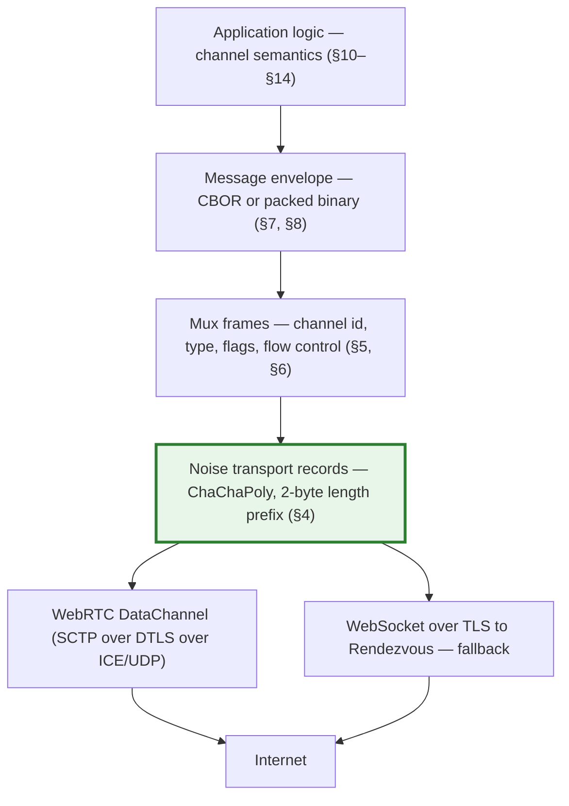
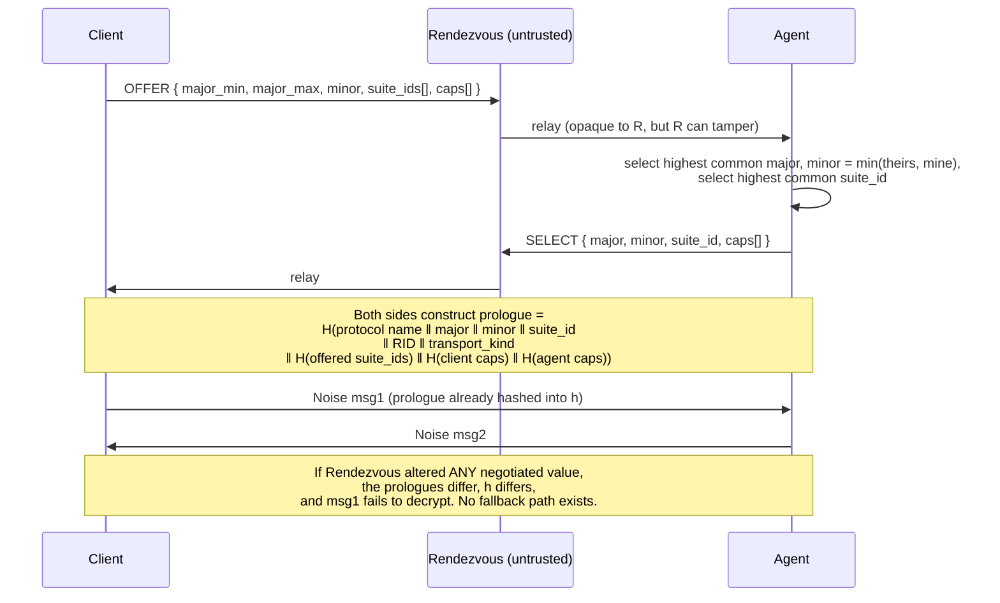
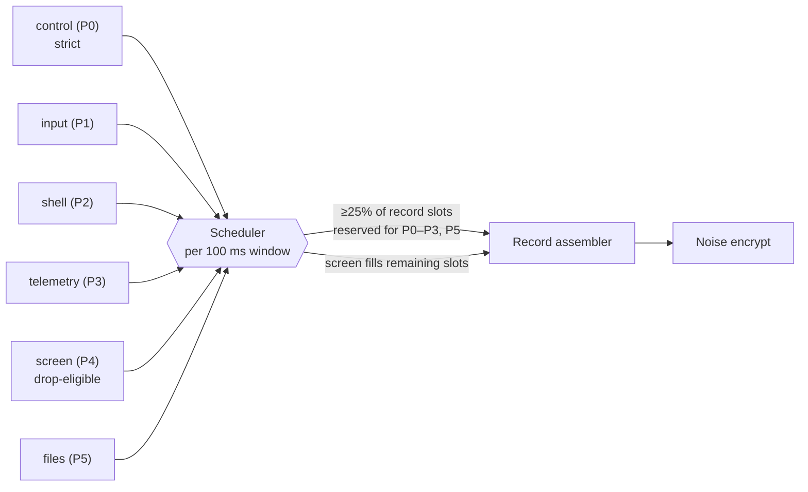
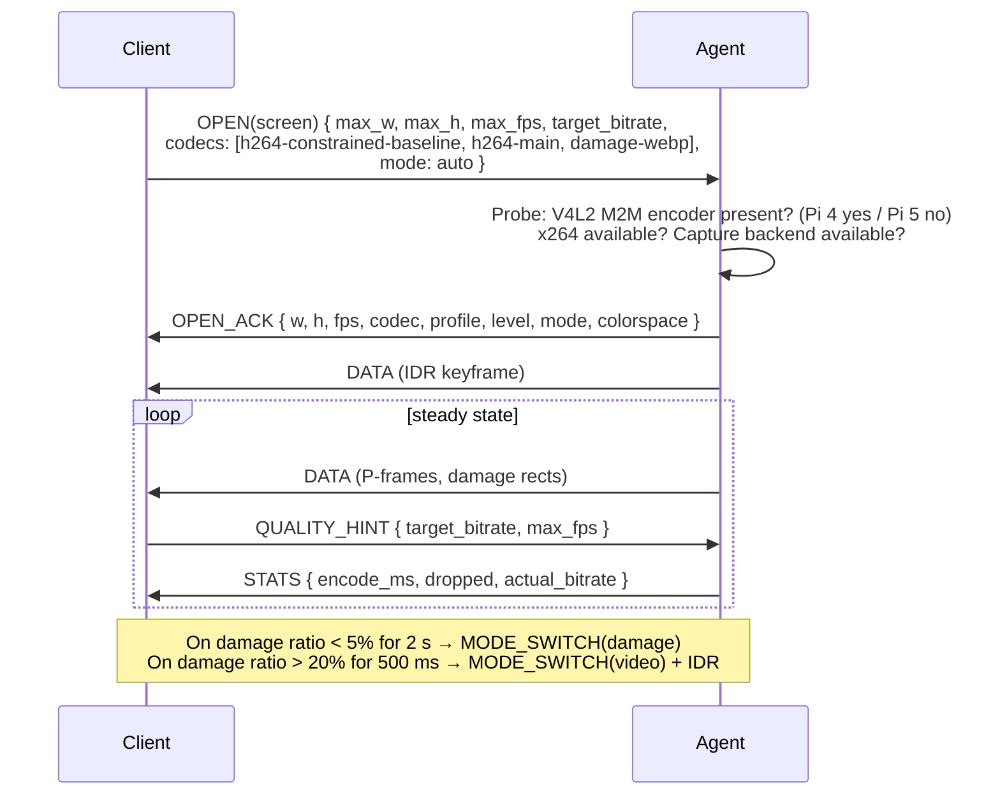
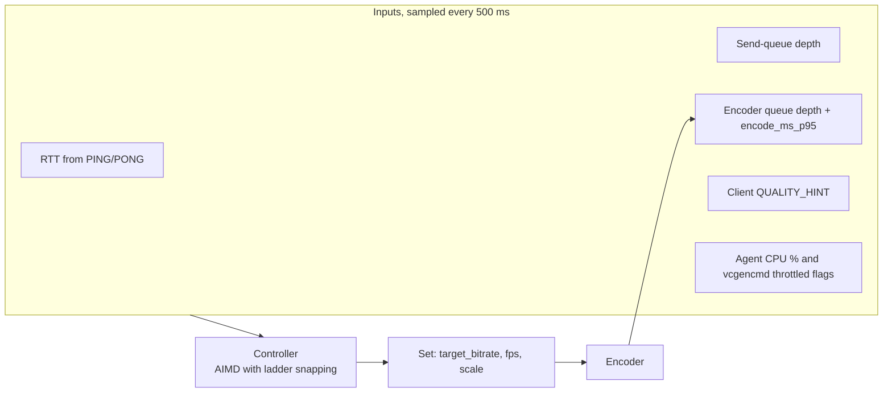
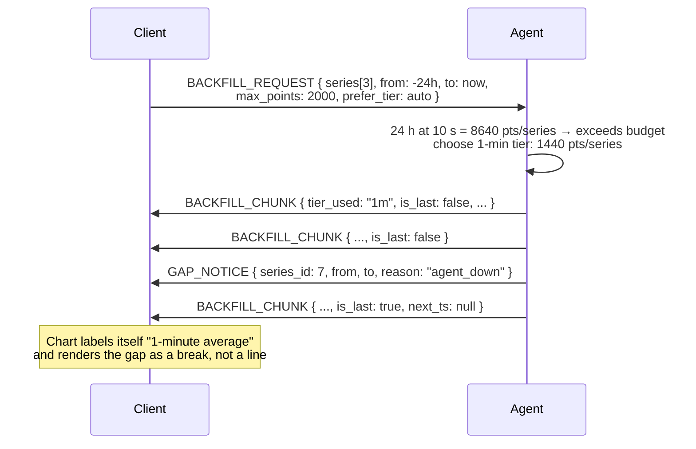
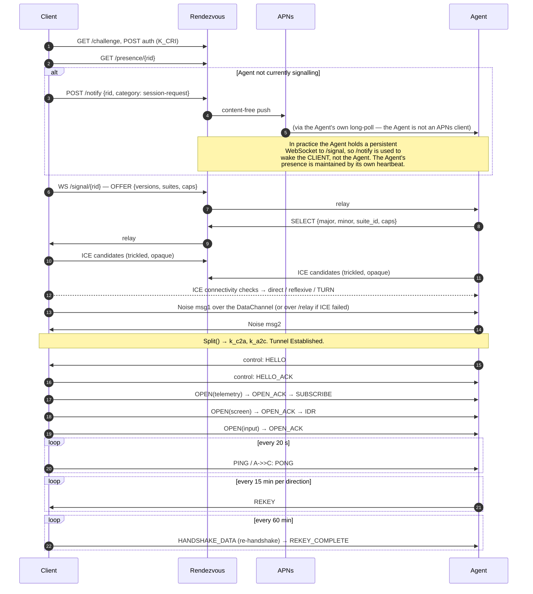

# 05 — Wire Protocol Specification

**Status:** Normative. This document defines every byte that crosses the boundary between
Client and Agent, and every request that either makes to Rendezvous.

Prerequisites: [00-GLOSSARY](00-GLOSSARY.md), [04-SECURITY-E2EE](04-SECURITY-E2EE.md).
The cryptographic construction is owned by 04; this document specifies only how the
resulting records are framed, multiplexed and interpreted. Where the two documents
disagree about a security property, **04 wins**.

---

## 1. Conventions

| Convention | Value |
|---|---|
| Byte order | Big-endian ("network order") for every fixed-layout binary field, without exception |
| Integer types | `u8`, `u16`, `u32`, `u64`, `i8`, `i16`, `i32`, `i64` — width in bits, two's complement for signed |
| Fixed-layout headers | Packed, no implicit padding, no alignment requirements |
| Structured payloads | CBOR (RFC 8949), deterministically encoded — see §7 |
| Time | Unix milliseconds UTC in a `u64` unless stated otherwise. Monotonic deltas use `u32` milliseconds |
| Identifiers | `u32` unless stated otherwise; 0 is reserved as "none/unset" |
| Strings | UTF-8, no NUL terminator, length-delimited by CBOR or by an explicit `u16` length |
| Reserved fields | MUST be sent as zero and MUST be ignored on receipt |
| RFC 2119 | MUST / MUST NOT / SHOULD / MAY as in the glossary |
| Protocol name | `pi-monitor` |

### 1.1 Layer stack

The Noise layer is transport-agnostic and identical on both paths. A Tunnel that migrates
from a DataChannel to a WebSocket does **not** re-handshake merely because the transport
changed — it re-handshakes because §4.6 requires it on transport change, and the prologue
binds the transport kind (see [04-SECURITY-E2EE](04-SECURITY-E2EE.md) §8.1).

---

## 2. Version negotiation

### 2.1 Version identifiers

| Identifier | Type | Meaning |
|---|---|---|
| `protocol_major` | `u8` | Incompatible wire change. Peers with different majors MUST NOT interoperate |
| `protocol_minor` | `u8` | Backward-compatible additions (new messages, new optional fields, new channels) |
| `suite_id` | `u16` | Names the complete cryptographic construction. `1` = `Noise_IK_25519_ChaChaPoly_BLAKE2s` + Ed25519 rendezvous identities + BLAKE2s-256 fingerprints |
| `capability_set` | set of `u16` | Optional features the endpoint implements (§2.3) |

v1 of this specification is `protocol_major = 1`, `protocol_minor = 0`, `suite_id = 1`.

### 2.2 Negotiation sequence

Negotiation happens **before** the Noise handshake, over the signalling layer, and is then
**bound into the Noise prologue** so it cannot be tampered with. This is the only
downgrade defence and it is deliberately not a runtime negotiation of primitives.

| Rule | Statement |
|---|---|
| VN-1 | The Agent selects; the Client offers. There is no counter-offer round. |
| VN-2 | If no common `major` exists, the Agent returns `1002 VERSION_UNSUPPORTED` over signalling and the Client shows an upgrade prompt naming which side is older. |
| VN-3 | If no common `suite_id` exists, `1003 SUITE_UNSUPPORTED`. |
| VN-4 | Both endpoints persist `min_acceptable_suite_id`, which only ever increases. A retired suite can never be re-enabled by a remote peer. |
| VN-5 | An intermediary that strips a suite id or a capability from the offer causes handshake failure, never a successful weaker session, because the **digest of the full offered set** is in the prologue. |
| VN-6 | `minor` mismatch is never an error. The lower minor governs; unknown messages are handled per §16. |

### 2.3 Capability identifiers

| Id | Capability | Advertised by | Effect if absent |
|---|---|---|---|
| 0x0001 | `screen.h264` | Both | No H.264 screen streaming |
| 0x0002 | `screen.damage_rect` | Both | No still-image damage mode |
| 0x0003 | `screen.hw_encode` | Agent | Software encoding only (always true on Pi 5) |
| 0x0010 | `input.keyboard` | Agent | Keyboard injection unavailable |
| 0x0011 | `input.pointer` | Agent | Pointer injection unavailable |
| 0x0012 | `input.scroll_hires` | Both | Fall back to discrete wheel detents |
| 0x0020 | `shell.pty` | Agent | Remote shell unavailable |
| 0x0021 | `shell.multi_session` | Agent | One PTY at a time |
| 0x0030 | `telemetry.backfill` | Agent | Client cannot request history |
| 0x0031 | `telemetry.rollups` | Agent | Raw samples only |
| 0x0040 | `files.transfer` | Agent | `files` channel unavailable |
| 0x0050 | `control.actions` | Agent | Actions unavailable |
| 0x0060 | `compression.zstd` | Both | `COMPRESSED` flag MUST NOT be set |
| 0x0070 | `transport.migrate` | Both | Transport change forces a new Session |

A capability advertised by only one side is unusable. Capability ids are permanently
assigned; they are never reused with a different meaning.

---

## 3. Outer framing

### 3.1 Frame on the wire

Every byte on either transport belongs to exactly one **transport record**:

| Offset | Field | Type | Value |
|---|---|---|---|
| 0 | `record_len` | `u16` | Length in bytes of `ciphertext`. Range 17 … 65535 |
| 2 | `ciphertext` | bytes | Noise transport message: AEAD ciphertext ‖ 16-byte Poly1305 tag |

| Limit | Value | Rationale |
|---|---|---|
| Max ciphertext | 65535 B | Hard limit of the Noise specification's 16-bit length field |
| Max plaintext per record | 65519 B | 65535 − 16-byte tag |
| Min ciphertext | 17 B | One byte of plaintext + tag. Zero-length records are illegal |
| Max mux payload per frame | 65505 B | 65519 − 6-byte header − 8-byte reserve for a second header |
| Max reassembled message | 4 MiB default; negotiable 64 KiB … 16 MiB via `SETTINGS` | Bounds peak allocation; 4 MiB comfortably holds a 1080p H.264 keyframe |

> The `record_len` prefix is **not** covered by the AEAD. A tampered length causes a
> framing desynchronisation that surfaces as a decryption failure on the next record,
> which is fatal. There is no scenario in which a forged length yields anything but a
> terminated tunnel. This matches every other length-prefixed AEAD framing in wide use.

### 3.2 Handshake framing

During the handshake the same 2-byte length prefix is used, but the payload is a raw
Noise handshake message rather than a transport message:

| Message | Direction | Size (X25519, ChaChaPoly) |
|---|---|---|
| msg1 (`e, es, s, ss` + payload) | Client → Agent | 32 (e) + 48 (encrypted s) + 16 (payload tag) + payload |
| msg2 (`e, ee, se` + payload) | Agent → Client | 32 (e) + 16 (payload tag) + payload |

| Limit | Value |
|---|---|
| Max handshake payload | 4096 B, enforced before allocation |
| Handshake timeout | 15 s from msg1 sent to `Split()` complete |
| Max in-flight handshakes per Agent | 16, LRU-evicted; excess rejected with `1109 HANDSHAKE_BUSY` |

### 3.3 Fragmentation and reassembly

Messages larger than one mux frame are split across frames on the **same channel**, each
carrying the `MORE` flag except the last.

| Rule | Statement |
|---|---|
| FR-1 | Fragments of a message MUST be contiguous on that channel. A frame for the same channel that is not the expected continuation is a protocol violation (`1204 FRAGMENT_INTERLEAVE`). |
| FR-2 | Fragments of *different* channels MAY interleave freely. This is the whole point of the mux. |
| FR-3 | The receiver MUST enforce the max-message limit *cumulatively during* reassembly, aborting as soon as it is exceeded (`1205 MESSAGE_TOO_LARGE`) — never after buffering the whole thing. |
| FR-4 | A channel with a partially reassembled message that is then closed MUST discard the partial buffer. |
| FR-5 | A reassembly buffer that receives no continuation within 30 s is discarded and the channel is reset (`1206 REASSEMBLY_TIMEOUT`). |

---

## 4. Noise transport records

### 4.1 Record construction

| Step | Operation |
|---|---|
| 1 | Collect one or more complete or partial mux frames into a plaintext buffer, ≤ 65519 B |
| 2 | `ciphertext = ChaCha20-Poly1305-Encrypt(k_dir, nonce(n_dir), AD = empty, plaintext)` |
| 3 | `n_dir += 1` |
| 4 | Emit `u16 len(ciphertext)` ‖ `ciphertext` |

### 4.2 Nonce

| Field | Value |
|---|---|
| Nonce width | 96 bits |
| Layout | 4 bytes of zero ‖ 64-bit big-endian counter |
| Initial value | 0, immediately after `Split()` or after a `REKEY` |
| Increment | Exactly 1 per record, per direction |
| Independence | `k_c2a` and `k_a2c` have completely independent counters |
| Exhaustion | Tunnel terminated with `1201 NONCE_EXHAUSTED` |

### 4.3 Record batching

Multiple small mux frames SHOULD be packed into a single record to amortise the 18-byte
per-record overhead (2 length + 16 tag).

| Rule | Statement |
|---|---|
| RB-1 | A record MUST contain a whole number of mux frames, or a whole number of frames followed by nothing. Frame headers are never split across records. |
| RB-2 | The sender SHOULD wait at most 2 ms to coalesce frames. Latency-critical channels (`control`, `input`) MUST NOT be delayed by coalescing — a frame on those channels flushes the record immediately. |
| RB-3 | A record carrying only `screen` data MAY be delayed up to 8 ms for coalescing. |

**Overhead arithmetic.** Per record: 2 (length) + 16 (tag) = 18 B of Noise overhead, plus
SCTP/DTLS overhead of roughly 13–29 B on the DataChannel path. At a 1200-byte effective
payload (a conservative MTU-safe size) that is ~2.6–3.9% expansion; at 65 519 B it is
0.03%. This is why RB-1/RB-3 exist: screen traffic should ride large records.

**Head-of-line blocking — the counter-pressure on large records.** v1 runs every channel
over a **single reliable, ordered** DataChannel ([ADR-0001](adr/ADR-0001-transport.md)),
so a lost record delays every channel behind it, not just its own. A 65 519-byte record on
a 24 Mbps uplink occupies ~22 ms of wire time and therefore bounds the worst-case
head-of-line delay for a `control` or `input` frame stuck behind it.

| Effective record cap | HOL delay at 24 Mbps | Overhead at 1200 B payload | Verdict |
|---|---|---|---|
| 65 519 B | ~22 ms | 0.03% | Acceptable ceiling; use for `files` and backfill |
| 16 KiB | ~5.5 ms | 0.11% | Good default for `screen` on constrained paths |
| 4 KiB | ~1.4 ms | 0.44% | Use when RTT is low and input latency dominates |

Senders SHOULD therefore adapt the record cap to the measured path via the
`max_frame_payload` setting (§5.5) rather than always filling records to the maximum:
large records when `files` or backfill dominates, ≤ 16 KiB while `input` is active. This
adaptation is the mitigation for choosing one ordered stream over per-channel SCTP
streams, and it is why partial reliability was deferred rather than adopted — see §17 Q1.

### 4.4 Decryption failure

Any AEAD authentication failure is **immediately fatal**. The implementation MUST close
the Tunnel, zeroise keys, and report `1202 AEAD_FAILURE` to the local application layer
only. There is no retry, no resynchronisation, and no "skip the bad record" path — the
absence of such a path is a release-checklist item ([04-SECURITY-E2EE](04-SECURITY-E2EE.md) §22.4 R5).

### 4.5 REKEY

| Aspect | Specification |
|---|---|
| Trigger | First of: 2²⁰ records, 1 GiB, or 15 minutes — evaluated **per direction** |
| Frame | `REKEY` mux frame on channel `control`, carrying the record counter at which the new key takes effect |
| Semantics | The `REKEY` frame itself is encrypted under the old key. The **next** record in that direction uses `k' = Rekey(k)` and counter 0 |
| Direction | Unilateral. Each direction rekeys on its own schedule; there is no acknowledgement |
| Property | Forward secrecy within the session only. **Not** post-compromise security — see [04-SECURITY-E2EE](04-SECURITY-E2EE.md) §10.2 |

### 4.6 Re-handshake

| Aspect | Specification |
|---|---|
| Trigger | Every 60 minutes; on transport change; on explicit `control` request; on `SETTINGS` change to `suite_id` |
| Mechanism | A fresh `Noise_IK` handshake carried as `HANDSHAKE_DATA` frames on channel `control` inside the existing Tunnel |
| Cutover | The initiator sends `REKEY_COMPLETE`; the first record under the new keys resets both counters to 0. Old keys are zeroised only after a successful decrypt under the new keys |
| Channel state | Preserved across re-handshake. Channels do not close; flow-control windows do not reset |
| Failure | If a re-handshake does not complete within 15 minutes of its trigger, the Tunnel terminates with `1107 REKEY_TIMEOUT` (hard deadline: 75 minutes since the last successful handshake) |

---

## 5. Mux frame format

### 5.1 Header

| Offset | Field | Type | Description |
|---|---|---|---|
| 0 | `channel` | `u8` | Channel id, §5.2 |
| 1 | `frame_type` | `u8` | §5.3 |
| 2 | `flags` | `u8` | §5.4 |
| 3 | `reserved` | `u8` | MUST be 0, MUST be ignored |
| 4 | `payload_len` | `u16` | Length of the payload immediately following, 0 … 65505 |

Total header: **6 bytes**.

### 5.2 Channel ids

| Id | Name | Reliability | Ordering | Priority class | Initial window | Drop-eligible |
|---|---|---|---|---|---|---|
| 0 | `control` | Reliable | Ordered | **P0 — strict** | 64 KiB | Never |
| 1 | `input` | Reliable | Ordered | P1 | 32 KiB | Never |
| 2 | `shell` | Reliable | Ordered | P2 | 256 KiB | Never |
| 3 | `telemetry` | Reliable | Ordered | P3 | 256 KiB | Streams only |
| 4 | `screen` | Reliable frames, droppable at source | Ordered | P4 | 1 MiB | **Yes** |
| 5 | `files` | Reliable | Ordered | P5 — lowest | 1 MiB | Never |
| 6–127 | reserved | — | — | — | — | — |
| 128–255 | experimental / vendor | — | — | — | — | — |

> The glossary lists the six channels in a different order. That is a list, not an id
> assignment. **These ids are canonical.**

Channel 0 is implicitly open for the lifetime of the Tunnel and MUST NOT be opened or
closed explicitly. Channels 1–5 are opened on demand.

### 5.3 Frame types

| Value | Name | Channels | Payload | Purpose |
|---|---|---|---|---|
| 0x00 | `DATA` | any | channel-specific | Application data |
| 0x01 | `OPEN` | 1–5 | CBOR open-parameters | Request to open a channel |
| 0x02 | `OPEN_ACK` | 1–5 | CBOR accepted-parameters | Channel is open |
| 0x03 | `CLOSE` | 1–5 | CBOR `{reason_code, reason}` | Graceful close; with `FIN` flag = half-close |
| 0x04 | `RESET` | 1–5 | `u16` error code | Abrupt close, discard buffers |
| 0x05 | `WINDOW_UPDATE` | 0–5 | `u32` credit increment | Flow control, §6 |
| 0x06 | `PING` | 0 | `u64` opaque token | Keepalive / RTT probe |
| 0x07 | `PONG` | 0 | `u64` echoed token | Keepalive response |
| 0x08 | `ERROR` | 0–5 | CBOR error object, §9 | Non-fatal or fatal error report |
| 0x09 | `SETTINGS` | 0 | CBOR settings map, §5.5 | Connection parameters |
| 0x0A | `SETTINGS_ACK` | 0 | empty | Settings applied |
| 0x0B | `REKEY` | 0 | `u64` effective counter | Symmetric rekey marker, §4.5 |
| 0x0C | `HANDSHAKE_DATA` | 0 | raw Noise handshake bytes | In-band re-handshake, §4.6 |
| 0x0D | `REKEY_COMPLETE` | 0 | empty | Re-handshake cutover marker |
| 0x0E | `GOAWAY` | 0 | CBOR `{code, reason, last_ok}` | Orderly shutdown announcement |
| 0x0F–0x7F | reserved | — | — | Unknown values → `1203 UNKNOWN_FRAME_TYPE` |
| 0x80–0xFF | experimental | — | — | Unknown values silently ignored |

### 5.4 Flags

| Bit | Name | Meaning |
|---|---|---|
| 0x01 | `MORE` | This frame is a non-final fragment of a larger message |
| 0x02 | `FIN` | No further `DATA` will be sent on this channel in this direction |
| 0x04 | `URGENT` | Bypass the priority queue for this frame; valid on `control` and `input` only. Abuse on other channels is `1207 INVALID_FLAG` |
| 0x08 | `COMPRESSED` | Payload is zstd-compressed (requires capability 0x0060) |
| 0x10 | `END_OF_BATCH` | Last frame of a logical batch; consumers may flush |
| 0x20–0x80 | reserved | MUST be 0 |

### 5.5 SETTINGS

Sent by either side at any time; the peer applies them and replies `SETTINGS_ACK`.
Settings are a CBOR map with integer keys.

| Key | Name | Type | Default | Range | Meaning |
|---|---|---|---|---|---|
| 1 | `max_message_size` | `u32` | 4 MiB | 64 KiB … 16 MiB | Max reassembled message the sender will accept |
| 2 | `initial_window` | `u32` | per §5.2 | 16 KiB … 8 MiB | Default per-channel window for newly opened channels |
| 3 | `connection_window` | `u32` | 4 MiB | 256 KiB … 32 MiB | Aggregate window across all channels |
| 4 | `keepalive_interval_ms` | `u32` | 20000 | 5000 … 120000 | How often the peer should expect a `PING` |
| 5 | `idle_timeout_ms` | `u32` | 90000 | 15000 … 600000 | Close if nothing received for this long |
| 6 | `max_concurrent_shell` | `u8` | 1 | 1 … 4 | PTY sessions |
| 7 | `compression` | `u8` | 0 | 0/1 | Enable zstd for eligible payloads |
| 8 | `max_frame_payload` | `u16` | 65505 | 1024 … 65505 | Sender-side cap, for MTU-sensitive paths |

Unknown setting keys MUST be ignored, not rejected (§16).

---

## 6. Flow control, backpressure and priority

### 6.1 Credit model

Credit-based, per channel plus a connection-level aggregate. This is deliberately
HTTP/2-shaped because the semantics are well understood and the failure modes are known.

| Rule | Statement |
|---|---|
| FC-1 | A sender MUST NOT send more `DATA` payload bytes on a channel than the channel's remaining credit, nor more than the connection's remaining credit. |
| FC-2 | Only `DATA` payload bytes consume credit. Control frames (`OPEN`, `WINDOW_UPDATE`, `PING`, `SETTINGS`, `ERROR`, `CLOSE`, `RESET`) are never flow-controlled — this guarantees the connection can always be managed and torn down even when every window is exhausted. |
| FC-3 | The receiver emits `WINDOW_UPDATE` when consumed bytes reach 50% of the window, not on every read, to bound update chatter. |
| FC-4 | A `WINDOW_UPDATE` that would overflow `u32` is a protocol violation (`1208 WINDOW_OVERFLOW`). |
| FC-5 | A zero-credit stall lasting longer than `idle_timeout_ms` closes the channel with `1209 FLOW_STALL`, not the Tunnel. |

### 6.2 Priority scheduler

| Rule | Statement |
|---|---|
| PR-1 | `control` is strictly highest priority. A pending `control` frame is emitted before anything else, always. |
| PR-2 | Within each 100 ms scheduling window, **at least 25% of record slots MUST be available to non-`screen` channels**. This is the mechanical guarantee that screen traffic cannot starve control (SEC requirement; test R4 in [04-SECURITY-E2EE](04-SECURITY-E2EE.md) §22.4). |
| PR-3 | `input` frames are emitted ahead of `shell`, `telemetry`, `screen` and `files` regardless of queue depth, because pointer latency is the dominant perceived-quality factor in remote desktop use. |
| PR-4 | Below `control`/`input`, remaining capacity is allocated by weighted round-robin with weights `shell:4, telemetry:2, screen:16, files:1`. |
| PR-5 | `files` MUST yield entirely whenever any other channel has queued data. Bulk transfer is always the loser. |

### 6.3 Backpressure

| Layer | Signal | Response |
|---|---|---|
| Transport buffer full (SCTP send buffer / WebSocket backlog) | Writer blocks or reports "would block" | Scheduler stops producing records; per-channel queues build |
| `screen` queue exceeds 2 frames | Internal | **Drop queued non-keyframes**; request the encoder to emit a keyframe at the next opportunity; lower the target bitrate (§11.5) |
| `telemetry` stream queue exceeds 200 samples | Internal | Coalesce: replace queued per-sample messages with one batched message; drop to the next rollup tier if still behind |
| `shell` queue exceeds 256 KiB | Internal | Stop reading from the PTY master. The PTY's own buffer then fills and the child process blocks on write — correct Unix behaviour, and the reason `shell` must be reliable |
| `files` queue non-empty and any other channel queued | Internal | Suspend file reads |
| `control` queue exceeds 64 frames | Internal | **Fatal.** Indicates a peer that is not consuming; `GOAWAY` then close |
| `input` queue exceeds 64 events | Internal | Drop coalescible motion events (keep the newest absolute position); **never** drop button or key events (§12.4) |

> **Residual risk RR-P1:** Dropping `screen` frames under backpressure means the remote
> desktop can visibly stutter while a large file transfer or a burst of shell output is in
> flight, even though `files` is lowest priority — because the transport's own send buffer
> is shared. Correct behaviour is preserved; smoothness is not guaranteed.

---

## 7. Serialization

### 7.1 Decision

**CBOR (RFC 8949), deterministically encoded, with unsigned-integer map keys**, for all
structured control-plane payloads. High-rate opaque payloads — H.264 access units, PTY
bytes, telemetry sample batches, file chunks — use **fixed-layout packed binary headers**
and are not CBOR-wrapped. Full reasoning in [ADR-0007](adr/ADR-0007-serialization.md).

### 7.2 Why CBOR — and what it costs

| Criterion | CBOR | MessagePack | Protobuf | JSON |
|---|---|---|---|---|
| Standardisation | **IETF STD 94** | De-facto spec, no SDO | Vendor spec | IETF STD 90 |
| Self-describing (debuggable without a schema) | Yes | Yes | **No** | Yes |
| Deterministic/canonical encoding defined by the spec | **Yes (§4.2)** | No | No (canonical form is not guaranteed) | No |
| Binary blobs without base64 | Yes | Yes | Yes | **No** |
| Schema evolution | Good (unknown keys) | Good | **Best** | Good |
| Build-time codegen required | No | No | **Yes, in two toolchains** | No |
| Size, 40-field telemetry snapshot (estimate) | ~420 B | ~410 B | **~260 B** | ~1100 B |
| Rust libraries | `ciborium`, `minicbor` (both maintained) | `rmp-serde` | `prost` | `serde_json` |
| Swift libraries | `SwiftCBOR` / hand-rolled — **no first-party Apple API** | Third-party | `swift-protobuf` | **`Codable`, first-party** |
| Builds toward signed objects | **Yes — COSE/CWT** | No | No | JOSE |

**The honest costs of this choice:** CBOR has no first-party Swift support, so the Client
carries a third-party or hand-written codec on a security-relevant path; and Protobuf is
genuinely ~38% smaller for numeric-heavy control messages. We accept both because (a) the
size argument evaporates for the traffic that actually matters — telemetry batches and
video use packed binary, not CBOR, and beat all four formats; (b) an IETF standard with a
specified deterministic encoding matters more than 160 bytes on a message sent a few times
per minute; and (c) avoiding `protoc` in the Xcode build removes a whole class of build
friction and a second source of truth.

### 7.3 Deterministic encoding rules

| # | Rule |
|---|---|
| DE-1 | Definite-length encoding only. Indefinite-length arrays, maps, strings and byte strings MUST be rejected |
| DE-2 | Integers encoded in the shortest form that represents the value |
| DE-3 | Map keys are unsigned integers, sorted ascending by numeric value |
| DE-4 | Duplicate map keys MUST be rejected (`1210 CBOR_DUPLICATE_KEY`) |
| DE-5 | Floats: only IEEE-754 binary64 (`0xFB`) is emitted; a value exactly representable as an integer MUST be sent as an integer instead |
| DE-6 | No CBOR tags except tag 2 / tag 3 (bignum) which are **not used in v1** and MUST be rejected |
| DE-7 | Nesting depth limited to 8; exceeding it is `1211 CBOR_TOO_DEEP` |
| DE-8 | Total decoded element count limited to 4096 per message |
| DE-9 | Text strings MUST be valid UTF-8; invalid sequences are rejected, never replaced |

Determinism is required today only so that message digests are stable (capability digests
in the prologue, argument digests in the audit log). It is required tomorrow if we ever
adopt COSE-signed objects.

### 7.4 Message envelope

Every `DATA` frame on `control`, `telemetry` (non-batch), `shell` (non-byte), `screen`
(non-frame) and `files` (non-chunk) carries one CBOR envelope map:

| Key | Field | Type | Required | Meaning |
|---|---|---|---|---|
| 1 | `type` | `u16` | Yes | Message type, unique within the channel |
| 2 | `id` | `u32` | Requests only | Request correlation id, monotonically increasing per sender per channel; 0 = notification, no reply expected |
| 3 | `reply_to` | `u32` | Responses only | Echoes the request's `id` |
| 4 | `status` | `u16` | Responses only | 0 = OK, otherwise an error code from §9 |
| 5 | `body` | map | Type-dependent | The payload |
| 6 | `ts` | `u64` | Optional | Sender's Unix milliseconds; advisory only, never used for security decisions |

| Rule | Statement |
|---|---|
| EN-1 | A request MUST receive a response or an `ERROR` within 30 s, or the requester treats it as `9001 TIMEOUT`. |
| EN-2 | `id` wraps at 2³²; a wrapped id colliding with an outstanding request is a protocol violation. |
| EN-3 | Responses MAY arrive out of order. Requesters MUST correlate by `reply_to`, never by arrival order. |
| EN-4 | Notifications (`id = 0`) are fire-and-forget and MUST NOT be acknowledged. |

---

## 8. Message catalogue

Direction: **C→A** = Client to Agent, **A→C** = Agent to Client, **↔** = either.
"R" in the kind column = request expecting a response; "N" = notification; "S" = streamed.

### 8.1 Channel 0 — `control`

| Type | Name | Dir | Kind | Body fields | Semantics |
|---|---|---|---|---|---|
| 0x0001 | `HELLO` | A→C | N | `agent_id`, `name`, `model`, `os_version`, `agent_version`, `proto_minor`, `caps[]`, `boot_time`, `series_catalog_version`, `audit_chain_head` | Sent immediately after `Split()`. Establishes everything the Client needs to render its first screen |
| 0x0002 | `HELLO_ACK` | C→A | N | `client_id`, `device_name`, `os_version`, `app_version`, `caps[]`, `last_audit_chain_head` | Client's counterpart; mismatched chain head triggers a tamper warning |
| 0x0003 | `PAIR_CONFIRM` | C→A | R | `fingerprint_agent`, `fingerprint_client` | Only valid during a pairing session. Both fingerprints echoed so the Agent can verify the Client compared the right values |
| 0x0004 | `PAIR_ACCEPTED` | A→C | R | `client_id`, `paired_at`, `caps[]` | Pairing complete and persisted |
| 0x0005 | `PAIR_REJECT` | ↔ | N | `reason_code` | Fingerprint mismatch, expired token, user cancelled |
| 0x0010 | `ACTION_LIST` | C→A | R | — | Request the allow-list |
| 0x0011 | `ACTION_LIST_RESULT` | A→C | R | `actions[]` of `{name, title, kind, arg_schema, requires_confirmation, requires_biometric, destructive, enabled, rate_limit}` | The closed set of permitted operations |
| 0x0012 | `ACTION_INVOKE` | C→A | R | `name`, `args` (map), `idempotency_key` | Run an allow-listed Action. Never a shell command |
| 0x0013 | `ACTION_RESULT` | A→C | R | `state`, `exit_code`, `stdout_excerpt` (≤ 4 KiB), `duration_ms` | Result. Long-running actions send `ACTION_PROGRESS` first |
| 0x0014 | `ACTION_PROGRESS` | A→C | N | `invocation_id`, `percent`, `message` | For actions like `update` that take minutes |
| 0x0020 | `ALERT_RAISED` | A→C | N | `alert_id`, `rule_id`, `series`, `value`, `threshold`, `severity`, `fired_at` | Fired alert. Delivered over the Tunnel; the push that woke the app carried none of this |
| 0x0021 | `ALERT_CLEARED` | A→C | N | `alert_id`, `cleared_at`, `peak_value` | Condition resolved |
| 0x0022 | `ALERT_ACK` | C→A | R | `alert_id`, `snooze_seconds` | Acknowledge / snooze |
| 0x0023 | `ALERT_RULE_LIST` / `_RESULT` | ↔ | R | rule definitions | CRUD over rules; `_UPSERT` and `_DELETE` follow the same pattern |
| 0x0030 | `AGENT_STATE` | A→C | N | `uptime`, `load`, `throttled_flags`, `active_sessions`, `db_size_bytes`, `capture_state`, `degraded_reasons[]` | Agent self-health, sent every 60 s and on change |
| 0x0031 | `AUDIT_QUERY` / `_RESULT` | ↔ | R | filter + page; records | Read the audit log |
| 0x0040 | `SETTINGS_GET` / `_SET` / `_RESULT` | ↔ | R | key/value | Agent runtime settings ([11-AGENT-DEPLOYMENT](11-AGENT-DEPLOYMENT.md) §7) |
| 0x0050 | `DEVICE_LIST` / `_RESULT` | ↔ | R | paired devices | Enumerate paired Clients |
| 0x0051 | `DEVICE_REVOKE` | C→A | R | `client_id`, `reason` | Revocation ([04-SECURITY-E2EE](04-SECURITY-E2EE.md) §12) |
| 0x0052 | `KEY_ROTATION_NOTICE` | A→C | N | `new_fingerprint`, `window_ends_at` | Agent static key rotation in progress; Client MUST prompt for out-of-band re-verification |
| 0x0060 | `TIME_SYNC` | ↔ | R | `t_send`, `t_recv`, `t_reply` | RTT and clock-offset estimation for chart alignment. **Advisory only** — never used for replay decisions |
| 0x00F0 | `GOAWAY_NOTICE` | ↔ | N | `code`, `reason`, `restart_expected_ms` | Orderly shutdown (agent restarting for an upgrade, app terminating) |

### 8.2 Channel 1 — `input`

Payloads on this channel are **packed binary**, not CBOR, because the event rate reaches
~200 events/second during dragging and the per-event CBOR overhead would be ~4× the data.

`OPEN` body (CBOR): `{output_id, width_px, height_px, scale}` — identifies which output
is being controlled.

**Event batch payload:**

| Offset | Field | Type | Meaning |
|---|---|---|---|
| 0 | `batch_ts` | `u64` | Client's Unix ms at batch creation |
| 8 | `count` | `u16` | Number of events, 1 … 256 |
| 10 | `reserved` | `u16` | 0 |
| 12 | events | array | `count` × 12-byte event records |

**Event record (12 bytes):**

| Offset | Field | Type | Meaning |
|---|---|---|---|
| 0 | `dt_ms` | `u16` | Milliseconds after `batch_ts` |
| 2 | `ev_type` | `u8` | §8.2.1 |
| 3 | `flags` | `u8` | bit 0 = `SYNC_AFTER` (emit an EV_SYN), bit 1 = `AUTOREPEAT` |
| 4 | `code` | `u16` | HID usage or button/axis id |
| 6 | `reserved` | `u16` | 0 |
| 8 | `value` | `i32` | Type-dependent |

#### 8.2.1 Event types

| Value | Name | `code` | `value` | Semantics |
|---|---|---|---|---|
| 0x01 | `KEY_DOWN` | **USB HID usage id** | 0 | Key pressed |
| 0x02 | `KEY_UP` | USB HID usage id | 0 | Key released |
| 0x03 | `POINTER_ABS` | 0 = X, 1 = Y | normalised, §8.2.2 | Absolute pointer position |
| 0x04 | `POINTER_REL` | 0 = X, 1 = Y | device units | Relative motion (trackpad mode) |
| 0x05 | `BUTTON_DOWN` | 1 = left, 2 = right, 3 = middle, 4 = back, 5 = forward | 0 | Pointer button |
| 0x06 | `BUTTON_UP` | as above | 0 | |
| 0x07 | `SCROLL` | 0 = vertical, 1 = horizontal | detents ×120 (hi-res) | Positive = up/right |
| 0x08 | `TOUCH_DOWN` / 0x09 `TOUCH_UP` / 0x0A `TOUCH_MOVE` | slot id | packed X,Y | Multi-touch passthrough (capability-gated, v2) |
| 0x10 | `MODIFIER_SET` | bitmask | 0 | Explicit modifier resynchronisation, §12.3 |
| 0x11 | `RESET` | 0 | 0 | Release all keys and buttons — sent on focus loss, §12.4 |
| 0x20 | `TEXT` | UTF-8 length | index into a following CBOR string | Bulk text insertion (paste), §12.5 |

#### 8.2.2 Coordinate normalisation

| Rule | Statement |
|---|---|
| CN-1 | Absolute pointer coordinates are transmitted as unsigned 16-bit fixed-point in the range 0 … 65535 spanning the **full logical extent of the target output**, independent of pixel resolution. |
| CN-2 | The Agent configures its `uinput` absolute axes `ABS_X` / `ABS_Y` with exactly this 0 … 65535 range, so no scaling arithmetic is needed at injection time and no rounding error accumulates. |
| CN-3 | The Client is responsible for mapping its own view geometry (including letterboxing, pinch-zoom and pan) into this space. The Agent never learns the Client's viewport. |
| CN-4 | A resolution change on the Pi invalidates nothing — the normalised space is unchanged. The Agent notifies via `SCREEN_FORMAT_CHANGED`; the Client re-lays-out its view. |
| CN-5 | Multi-output setups address outputs by `output_id` from `OPEN`. v1 supports controlling one output at a time. |
| CN-6 | Relative mode (`POINTER_REL`) exists for trackpad-style interaction where absolute mapping is unnatural; the Agent applies no acceleration, leaving pointer feel entirely to the Client. |

### 8.3 Channel 2 — `shell`

`OPEN` body (CBOR): `{cols, rows, term (e.g. "xterm-256color"), env_allow[] , user (optional), cwd (optional)}`.
`OPEN_ACK` body: `{session_id, pid, user, shell_path}`.

| Type / frame | Dir | Payload | Semantics |
|---|---|---|---|
| `DATA` (no envelope) | ↔ | Raw PTY bytes | The overwhelmingly common case. **No CBOR, no framing beyond the mux header** — bytes in, bytes out. Sub-frame boundaries carry no meaning |
| 0x0001 `RESIZE` | C→A | `{cols, rows, px_width, px_height}` | Triggers `TIOCSWINSZ` and a `SIGWINCH` to the foreground process group. Pixel dimensions are optional and used by full-screen graphics-capable programs |
| 0x0002 `SIGNAL` | C→A | `{signal}` — one of INT, QUIT, TERM, HUP, KILL, TSTP, CONT | Delivered to the **foreground process group** of the PTY, not the shell's PID. This distinction matters: `Ctrl-C` must interrupt the running command, not the shell |
| 0x0003 `EXIT` | A→C | `{exit_code, signal, exited_at}` | The child terminated. `exit_code` is meaningful only when `signal` is absent |
| 0x0004 `FLOW` | ↔ | `{suspend: bool}` | Application-level XON/XOFF equivalent, independent of terminal flow control |
| 0x0005 `SET_ENV` | C→A | `{key, value}` | Only for keys in the Agent's configured allow-list; others rejected with `5003 ENV_NOT_ALLOWED` |

| Rule | Statement |
|---|---|
| SH-1 | The PTY runs as the Agent's configured shell user, **never root by default**. `sudo` inside the session is nonetheless a privilege-escalation path by design — see [04-SECURITY-E2EE](04-SECURITY-E2EE.md) RR-20 and [ADR-0006](adr/ADR-0006-shell-transport.md) |
| SH-2 | Channel close with `FIN` sends `SIGHUP` to the session leader after a 5 s grace period, then `SIGKILL` after a further 5 s |
| SH-3 | The Agent MUST NOT log, buffer to disk, or include PTY bytes in any diagnostic bundle |
| SH-4 | On Tunnel loss, the PTY is **terminated**, not detached. v1 has no `screen`/`tmux`-style persistence; adding it would create an unaudited long-lived process and is deferred |
| SH-5 | `EXIT` is always sent before `CLOSE`, so the Client can render the exit status |
| SH-6 | Output is read from the PTY master in ≤ 64 KiB chunks and flushed at most every 8 ms, to bound per-keystroke latency while still coalescing bulk output |

### 8.4 Channel 3 — `telemetry`

| Type | Name | Dir | Kind | Body | Semantics |
|---|---|---|---|---|---|
| 0x0001 | `CATALOG_GET` | C→A | R | `{known_version}` | Fetch the series catalogue |
| 0x0002 | `CATALOG` | A→C | R | `{version, series[]}` where each is `{series_id, name, unit, kind, interval_ms, retention_class, enabled, label_map?}` | Numeric `series_id` is used on the wire thereafter; names never repeat on the hot path |
| 0x0003 | `SNAPSHOT_GET` | C→A | R | `{series_ids[]}` or empty for all | Latest value of each series |
| 0x0004 | `SNAPSHOT` | A→C | R | packed binary, §8.4.1 | What widgets render |
| 0x0005 | `SUBSCRIBE` | C→A | R | `{series_ids[], interval_ms, mode}` where mode ∈ {`push`, `on_change`, `rollup`} | Start streaming |
| 0x0006 | `UNSUBSCRIBE` | C→A | R | `{subscription_id}` | Stop |
| 0x0007 | `SAMPLES` | A→C | S | packed binary batch, §8.4.1 | Streamed samples |
| 0x0008 | `BACKFILL_REQUEST` | C→A | R | `{series_ids[], from_ts, to_ts, max_points, prefer_tier}` | History |
| 0x0009 | `BACKFILL_CHUNK` | A→C | S | packed binary + `{tier_used, is_last, next_ts}` | Paged history |
| 0x000A | `SERIES_ENABLE` | C→A | R | `{series_id, enabled}` | Turn a series on/off at the source |
| 0x000B | `GAP_NOTICE` | A→C | N | `{series_id, from_ts, to_ts, reason}` | Declares a known hole (agent was down, series disabled). Prevents charts inventing continuity |

#### 8.4.1 Packed sample batch

Telemetry is the highest-cardinality structured traffic in the system, so it does not use
CBOR.

| Offset | Field | Type | Meaning |
|---|---|---|---|
| 0 | `base_ts` | `u64` | Unix ms of the first sample |
| 8 | `series_count` | `u16` | Number of series blocks |
| 10 | `flags` | `u8` | bit 0 = values are `f32`, else `f64`; bit 1 = delta-encoded timestamps |
| 11 | `reserved` | `u8` | 0 |
| 12 | blocks | — | `series_count` blocks |

**Series block:**

| Field | Type | Meaning |
|---|---|---|
| `series_id` | `u16` | From the catalogue |
| `point_count` | `u16` | Points in this block |
| `dt_ms` | `u32` × count | Offsets from `base_ts` (or deltas if flag set) |
| `value` | `f32`/`f64` × count | Values; NaN encodes "no sample" |

**Size comparison for a 40-series snapshot (estimate):** packed `f32` ≈ 12 + 40 × (4 + 4 + 4) ≈ **492 B**;
the same data as a CBOR map with names ≈ 1.4 KB; with numeric keys ≈ 420 B. For a 1-hour
backfill of 40 series at 10 s (14 400 points), packed is ≈ **1.1 MB** and CBOR would be
≈ 3.4 MB. That ratio is why this channel is binary.

| Rule | Statement |
|---|---|
| TE-1 | The Agent MUST NOT push samples faster than the series' actual sample interval. `interval_ms` in `SUBSCRIBE` is a *floor*, and the Agent may serve coarser data if it is behind |
| TE-2 | `BACKFILL_REQUEST` with more points than `max_points` is served from the coarsest tier that satisfies the budget; the tier actually used is always reported so charts can label their resolution |
| TE-3 | Backfill chunks are ≤ 256 KiB each and are flow-controlled like everything else; a chart scrub MUST NOT stall the `control` channel |
| TE-4 | Sample values are always the Agent's *stored* values. The Agent never interpolates. Interpolation, if any, is the Client's presentation choice |
| TE-5 | `GAP_NOTICE` is mandatory whenever a requested range contains a known hole. Silently returning a shorter series is a protocol violation |

### 8.5 Channel 4 — `screen`

`OPEN` body (CBOR): `{output_id, max_width, max_height, max_fps, target_bitrate, codecs[], mode}` where
`mode` ∈ {`auto`, `video`, `damage`}.
`OPEN_ACK` body: `{output_id, width, height, fps, codec, profile, level, mode, colorspace}`.

| Type | Name | Dir | Kind | Body | Semantics |
|---|---|---|---|---|---|
| `DATA` | frame | A→C | S | packed binary, §11.2 | Encoded frame or damage-rect update |
| 0x0001 | `KEYFRAME_REQUEST` | C→A | N | `{reason}` | Client lost sync, seeked, or resumed from background |
| 0x0002 | `QUALITY_HINT` | C→A | N | `{target_bitrate, max_fps, scale_hint, pause}` | Client-side ABR input, §11.5 |
| 0x0003 | `FORMAT_CHANGED` | A→C | N | `{width, height, fps, scale, rotation}` | Output resolution or rotation changed on the Pi |
| 0x0004 | `STATS` | A→C | N | `{encode_ms_p50, encode_ms_p95, capture_ms, queue_depth, dropped_frames, actual_bitrate, cpu_percent}` | Encoder telemetry, once per second |
| 0x0005 | `MODE_SWITCH` | A→C | N | `{new_mode, reason}` | Hybrid switch between video and damage-rect modes, §11.4 |
| 0x0006 | `CURSOR` | A→C | N | `{x, y, visible, shape_id, hotspot_x, hotspot_y}` | Cursor position and shape, sent separately so the Client can render it at display refresh rate without re-encoding |
| 0x0007 | `CURSOR_SHAPE` | A→C | N | `{shape_id, width, height, image}` | New cursor bitmap; cached by `shape_id` |

### 8.6 Channel 5 — `files`

| Type | Name | Dir | Body | Semantics |
|---|---|---|---|---|
| 0x0001 | `LIST` / 0x0002 `LIST_RESULT` | ↔ | `{path, offset, limit}` / entries | Directory listing, chroot-ed to configured roots |
| 0x0003 | `STAT` / 0x0004 `STAT_RESULT` | ↔ | `{path}` / metadata | |
| 0x0005 | `GET` | C→A | `{path, offset, length}` | Start a download |
| 0x0006 | `CHUNK` | ↔ | 16-byte header (`transfer_id u32`, `offset u64`, `flags u8`, `reserved u8`, `len u16`) + raw bytes | Bulk data |
| 0x0007 | `PUT` | C→A | `{path, size, mode, overwrite}` | Start an upload |
| 0x0008 | `TRANSFER_DONE` | ↔ | `{transfer_id, bytes, blake2s_digest, status}` | Integrity check over the whole transfer |
| 0x0009 | `CANCEL` | ↔ | `{transfer_id}` | |

| Rule | Statement |
|---|---|
| FI-1 | Paths are resolved against a configured allow-list of roots; `..` traversal, symlink escape and absolute paths outside the roots are rejected with `7002 PATH_DENIED` |
| FI-2 | Every transfer carries a BLAKE2s-256 digest verified end to end. The AEAD already guarantees integrity in transit; this catches storage and truncation errors |
| FI-3 | `files` is the lowest priority channel and MUST yield to all others (PR-5) |
| FI-4 | v1 supports resume via `offset`; there is no delta/rsync algorithm |

---

## 9. Error model

### 9.1 Error object

CBOR map carried in an `ERROR` frame or as an envelope `status`.

| Key | Field | Type | Meaning |
|---|---|---|---|
| 1 | `code` | `u16` | From §9.2 |
| 2 | `retryable` | bool | Whether an immediate retry can succeed |
| 3 | `reason` | text | Human-readable, ≤ 200 bytes, **MUST NOT contain secrets, paths outside allowed roots, or key material** |
| 4 | `channel` | `u8` | Channel the error pertains to; 0 if connection-scoped |
| 5 | `retry_after_ms` | `u32` | Optional backoff hint |
| 6 | `detail` | map | Optional structured detail, ≤ 256 B |

### 9.2 Error codes

**1000–1099 — framing and version**

| Code | Name | Fatal | Meaning |
|---|---|---|---|
| 1000 | `MALFORMED_FRAME` | Yes | Header or length invalid |
| 1001 | `RECORD_TOO_LARGE` | Yes | Exceeds 65535 |
| 1002 | `VERSION_UNSUPPORTED` | Yes | No common `protocol_major` |
| 1003 | `SUITE_UNSUPPORTED` | Yes | No common `suite_id` |
| 1004 | `PROLOGUE_MISMATCH` | Yes | Surfaced locally only; on the wire this manifests as a decryption failure |
| 1005 | `SETTINGS_INVALID` | No | Value out of range |

**1100–1199 — handshake and authorisation**

| Code | Name | Fatal | Meaning |
|---|---|---|---|
| 1100 | `HANDSHAKE_FAILED` | Yes | Generic; deliberately non-specific |
| 1101 | `UNKNOWN_STATIC_KEY` | Yes | **Never sent on the wire** — the Agent drops silently to avoid a paired-device oracle. Recorded locally |
| 1102 | `NOT_PAIRED` | Yes | No pairing session in progress and no known key |
| 1103 | `PAIRING_TOKEN_INVALID` | Yes | Expired, already consumed, or wrong |
| 1104 | `CLOCK_SKEW` | Yes | Timestamp outside ±120 s; the error detail carries the Agent's view of time |
| 1105 | `REVOKED` | Yes | This device was revoked by the owner. Sent **after** msg2 so the Client can display a precise message |
| 1106 | `REPLAY_DETECTED` | Yes | Ephemeral seen before; dropped silently on the wire |
| 1107 | `REKEY_TIMEOUT` | Yes | Re-handshake did not complete in time |
| 1108 | `PAIRING_DISABLED` | Yes | Agent is not in pairing mode |
| 1109 | `HANDSHAKE_BUSY` | No | Too many concurrent handshakes; retry with backoff |

**1200–1299 — transport, mux and flow control**

| Code | Name | Fatal | Meaning |
|---|---|---|---|
| 1200 | `TUNNEL_CLOSED` | Yes | Peer went away |
| 1201 | `NONCE_EXHAUSTED` | Yes | Counter limit reached |
| 1202 | `AEAD_FAILURE` | Yes | Authentication failed |
| 1203 | `UNKNOWN_FRAME_TYPE` | Yes | Reserved frame type in 0x0F–0x7F |
| 1204 | `FRAGMENT_INTERLEAVE` | Channel | Fragments interleaved on one channel |
| 1205 | `MESSAGE_TOO_LARGE` | Channel | Exceeds `max_message_size` |
| 1206 | `REASSEMBLY_TIMEOUT` | Channel | No continuation within 30 s |
| 1207 | `INVALID_FLAG` | Channel | `URGENT` on a disallowed channel, reserved bits set |
| 1208 | `WINDOW_OVERFLOW` | Yes | `WINDOW_UPDATE` would overflow `u32` |
| 1209 | `FLOW_STALL` | Channel | Zero credit beyond the idle timeout |
| 1210 | `CBOR_DUPLICATE_KEY` | Channel | Determinism rule DE-4 |
| 1211 | `CBOR_TOO_DEEP` | Channel | Determinism rule DE-7 |
| 1212 | `CHANNEL_ALREADY_OPEN` | Channel | Duplicate `OPEN` |
| 1213 | `CHANNEL_NOT_OPEN` | Channel | `DATA` before `OPEN_ACK` |
| 1214 | `CHANNEL_NOT_SUPPORTED` | Channel | Capability not advertised |

**2000–2099 — control and actions**

| Code | Name | Meaning |
|---|---|---|
| 2000 | `ACTION_UNKNOWN` | Not in the allow-list |
| 2001 | `ACTION_DISABLED` | Present but disabled in config |
| 2002 | `ACTION_ARGS_INVALID` | Failed the declared argument schema |
| 2003 | `ACTION_RATE_LIMITED` | Exceeds the per-action rate limit |
| 2004 | `ACTION_FAILED` | Ran and failed; see `exit_code` |
| 2005 | `CONFIRMATION_REQUIRED` | Destructive action attempted without the confirmation token |
| 2006 | `ALERT_RULE_INVALID` | Bad predicate, unknown series, or dwell out of range |
| 2007 | `SETTING_READONLY` | Setting is compile-time or file-only |
| 2008 | `NOT_AUTHORISED` | The paired device lacks authority (reserved for multi-user, v2) |

**3000–3099 — screen**

| Code | Name | Meaning |
|---|---|---|
| 3000 | `NO_DISPLAY` | No Wayland session available (headless without a compositor) |
| 3001 | `CAPTURE_UNAVAILABLE` | Neither `zwlr_screencopy` nor the PipeWire portal is usable |
| 3002 | `CAPTURE_DENIED` | The portal dialog was denied, or capture is disabled in config |
| 3003 | `ENCODER_UNAVAILABLE` | No usable encoder (HW absent and SW disabled) |
| 3004 | `ENCODER_STALLED` | Encoder failed to produce output; the subsystem is being restarted |
| 3005 | `CODEC_UNSUPPORTED` | No codec in common |
| 3006 | `RESOLUTION_UNSUPPORTED` | Requested geometry exceeds the encoder's limits |
| 3007 | `OUTPUT_NOT_FOUND` | Unknown `output_id` |
| 3008 | `THERMAL_THROTTLED` | Streaming reduced or suspended because the Pi is throttling |

**4000–4099 — input**

| Code | Name | Meaning |
|---|---|---|
| 4000 | `INPUT_DISABLED` | Injection disabled in config |
| 4001 | `UINPUT_UNAVAILABLE` | `/dev/uinput` missing or not permitted |
| 4002 | `EVENT_INVALID` | Unknown event type or out-of-range code |
| 4003 | `INPUT_RATE_LIMITED` | Event rate exceeded the configured ceiling |
| 4004 | `KEYMAP_UNMAPPED` | HID usage has no evdev equivalent |

**5000–5099 — shell**

| Code | Name | Meaning |
|---|---|---|
| 5000 | `SHELL_DISABLED` | Disabled in config |
| 5001 | `PTY_ALLOC_FAILED` | Kernel refused a PTY |
| 5002 | `USER_NOT_ALLOWED` | Requested user not in the allow-list |
| 5003 | `ENV_NOT_ALLOWED` | Environment key not permitted |
| 5004 | `SESSION_LIMIT` | `max_concurrent_shell` reached |
| 5005 | `SIGNAL_NOT_ALLOWED` | Signal outside the permitted set |

**6000–6099 — telemetry**

| Code | Name | Meaning |
|---|---|---|
| 6000 | `SERIES_UNKNOWN` | No such `series_id` |
| 6001 | `SERIES_DISABLED` | Known but not being sampled |
| 6002 | `RANGE_TOO_LARGE` | Backfill would exceed the point budget at every tier |
| 6003 | `CATALOG_STALE` | Client's catalogue version is obsolete; re-fetch |
| 6004 | `SUBSCRIPTION_LIMIT` | Too many concurrent subscriptions |
| 6005 | `STORAGE_ERROR` | Database read failed |

**7000–7099 — files**

| Code | Name | Meaning |
|---|---|---|
| 7000 | `FILES_DISABLED` | Channel disabled |
| 7001 | `NOT_FOUND` | No such path |
| 7002 | `PATH_DENIED` | Outside the allowed roots, or traversal attempted |
| 7003 | `PERMISSION_DENIED` | OS-level permission failure |
| 7004 | `NO_SPACE` | Destination full |
| 7005 | `DIGEST_MISMATCH` | End-to-end digest failed |
| 7006 | `TRANSFER_UNKNOWN` | Unknown `transfer_id` |

**9000–9099 — generic**

| Code | Name | Meaning |
|---|---|---|
| 9000 | `INTERNAL` | Unexpected internal failure; details are logged locally, never sent |
| 9001 | `TIMEOUT` | Request exceeded 30 s |
| 9002 | `UNAVAILABLE` | Subsystem temporarily down; `retry_after_ms` set |
| 9003 | `NOT_IMPLEMENTED` | Valid but unimplemented in this build |
| 9004 | `SHUTTING_DOWN` | `GOAWAY` in progress |

### 9.3 Error handling rules

| Rule | Statement |
|---|---|
| ER-1 | "Fatal" errors terminate the Tunnel. "Channel" errors reset only that channel. Everything else is reported to the application and the session continues |
| ER-2 | The Agent MUST NOT return errors that distinguish "no such paired device" from "wrong key" — silence is the answer for both (1101) |
| ER-3 | `reason` strings are for humans and MUST be safe to display. They are never parsed by the peer |
| ER-4 | An implementation receiving an unknown error code in a known range MUST treat it as the range's generic code |
| ER-5 | Errors are counted and rate-limited: no more than 20 `ERROR` frames per channel per minute, to prevent an error storm from becoming the DoS |

---

## 10. Keepalive and timeouts

| Parameter | Default | Range | Notes |
|---|---|---|---|
| `keepalive_interval_ms` | 20 000 | 5 000 … 120 000 | `PING` on `control` when nothing else has been sent |
| `pong_timeout_ms` | 10 000 | 2 000 … 30 000 | No `PONG` → transport considered dead |
| `idle_timeout_ms` | 90 000 | 15 000 … 600 000 | Nothing received at all → close |
| Missed pings before failure | 2 | 1 … 5 | |
| Foreground interval (Client) | 20 s | — | Normal operation |
| Background grace (Client) | 30 s | — | Tunnel held briefly across an app switch, then closed and keys zeroised ([04-SECURITY-E2EE](04-SECURITY-E2EE.md) §17.7) |
| Agent-idle interval | 60 s | — | When no Client is connected, the Agent only maintains Rendezvous presence, not a Tunnel |

| Rule | Statement |
|---|---|
| KA-1 | `PING` carries a `u64` token echoed verbatim in `PONG`; the round trip is the authoritative RTT used by the screen ABR loop (§11.5) |
| KA-2 | Keepalives are not flow-controlled and MUST be sent even when every window is exhausted |
| KA-3 | On mobile, the Client SHOULD extend `keepalive_interval_ms` to 60 s when only `telemetry` is active, to reduce radio wake-ups. This is a battery/detection-latency trade-off: detection of a dead tunnel degrades from ~30 s to ~90 s |
| KA-4 | `GOAWAY` MUST be sent before a planned close whenever possible, with `restart_expected_ms` so the Client can choose between showing "reconnecting" and "offline" |

---

## 11. Screen channel semantics

### 11.1 Codec negotiation

| Codec id | Description | Availability |
|---|---|---|
| `h264-constrained-baseline` | Baseline, no B-frames, level ≤ 4.2 | **Mandatory to implement on both sides.** The universal fallback |
| `h264-main` | Main profile, CABAC, still no B-frames | Optional; ~10–15% bitrate saving at equal quality, slightly higher decode cost |
| `damage-webp` | Lossy WebP tiles over changed regions | Optional; the low-motion mode |
| `damage-png` | Lossless PNG tiles | Optional; for text-critical work at high bandwidth cost |

**B-frames are prohibited in all profiles.** They require reordering, which adds at least
one frame of latency (33 ms at 30 fps) for a bitrate saving we do not need.

### 11.2 Frame payload format

| Offset | Field | Type | Meaning |
|---|---|---|---|
| 0 | `frame_seq` | `u32` | Monotonic, per screen channel |
| 4 | `capture_ts` | `u32` | Milliseconds since channel open, at capture |
| 8 | `flags` | `u8` | bit0 `KEYFRAME`, bit1 `DAMAGE_ONLY`, bit2 `LAST_IN_FRAME`, bit3 `DISCARDABLE`, bit4 `CURSOR_INLINE` |
| 9 | `codec` | `u8` | Codec id in effect |
| 10 | `rect_count` | `u8` | Number of damage rectangles, 0 … 64 |
| 11 | `reserved` | `u8` | 0 |
| 12 | `payload_len` | `u32` | Bytes of encoded data following the rect table |
| 16 | rects | 8 B × `rect_count` | `x u16`, `y u16`, `w u16`, `h u16` in output pixels |
| … | payload | bytes | H.264 Annex-B access unit, or concatenated tile images |

### 11.3 Keyframe and damage semantics

| Rule | Statement |
|---|---|
| SC-1 | The first frame after `OPEN_ACK`, after `MODE_SWITCH` to video, and after `FORMAT_CHANGED` MUST be an IDR keyframe |
| SC-2 | Periodic IDR interval: default 5 s, maximum 10 s. Long GOPs save bandwidth but lengthen recovery after loss and after a Client resumes from background |
| SC-3 | `KEYFRAME_REQUEST` MUST be honoured within 100 ms or the next frame, whichever is sooner. It is rate-limited to 2 per second; excess is silently coalesced |
| SC-4 | The damage rectangle list describes the region that **changed since the previous transmitted frame** — not since the previous captured frame. Frames dropped for backpressure must have their damage merged into the next transmitted frame's rect list, or the client will render a torn image |
| SC-5 | Frames with `DISCARDABLE` (non-reference P-frames) MAY be dropped by the sender's scheduler under backpressure with no further action. Reference frames MUST NOT be dropped without forcing a subsequent IDR |
| SC-6 | Rect merging: if `rect_count` would exceed 64, rectangles are merged into their bounding boxes until the count fits. The bound exists so the header stays small and merging cost stays predictable |
| SC-7 | In video mode the damage rects are **advisory metadata** — the H.264 stream is self-contained. They let the Client skip compositing untouched regions |
| SC-8 | In damage mode there is no inter-frame prediction; each tile is independently decodable, so any frame is effectively a keyframe |

### 11.4 Hybrid mode switching

| From | To | Condition | Hysteresis | Action |
|---|---|---|---|---|
| video | damage | Changed pixels < 5% of the frame for 2 consecutive seconds | 2 s | `MODE_SWITCH(damage)`; encoder released after a further 5 s to free CPU |
| damage | video | Changed pixels > 20% in any 500 ms window, or ≥ 8 damage frames/s | 500 ms | `MODE_SWITCH(video)` then an immediate IDR |
| any | paused | `QUALITY_HINT{pause}` (Client backgrounded or view not visible) | immediate | Capture and encoding stop entirely. This is the single largest CPU and battery saving available |

**Why this matters numerically:** an idle desktop with a blinking cursor produces a
handful of small dirty rects per second. In video mode that still costs the full encoder
pipeline (capture + colour convert + encode ≈ 1.0–1.4 cores on a Pi 5 at 720p20 — estimate).
In damage mode it costs ~20–150 kbps and a few percent of one core. Given that a monitoring
app spends most of its time showing a static screen, the hybrid mode is not an
optimisation, it is the difference between a viable and a non-viable product on a Pi 5.

### 11.5 Adaptive bitrate control loop

Because the screen payload rides our own channel rather than a WebRTC media track, we get
**no** built-in bandwidth estimation (no GCC, no transport-cc). We must implement the loop
ourselves. This is a real, acknowledged cost of the design — see
[ADR-0004](adr/ADR-0004-screen-streaming.md).

| Signal | Threshold | Response |
|---|---|---|
| Send-queue depth > 250 ms of data at current bitrate | — | **Multiplicative decrease ×0.7**, drop discardable frames |
| RTT rises > 1.5× the 30 s minimum | sustained 1 s | Decrease ×0.85 (queue building somewhere on the path) |
| Encoder `encode_ms_p95` > 80% of the frame interval | sustained 2 s | Reduce fps one ladder step before reducing resolution — motion smoothness degrades more gracefully than sharpness |
| Agent CPU > 85% or `throttled` bit 0x4 set | immediate | Step down one full ladder rung and emit `THERMAL_THROTTLED` if throttling |
| All signals healthy | 5 s | **Additive increase**: +10% bitrate, then snap to the next ladder rung after 15 s of stability |
| Client `QUALITY_HINT` lower than the current target | immediate | Obey immediately — the Client knows about cellular data limits and Low Power Mode; the Agent does not |

**Quality ladder** (estimates — validate with benchmark; see
[03-ARCHITECTURE](03-ARCHITECTURE.md) for the CPU model):

| Rung | Resolution | fps | Bitrate | Pi 5 software cost | Pi 4 HW cost | Use |
|---|---|---|---|---|---|---|
| 0 | 1920×1080 | 30 | 6 Mbps | 3.0–4.0 cores — **not shippable** | ~0.3 core | Pi 4 only, LAN |
| 1 | 1600×900 | 30 | 4 Mbps | 2.0–2.8 cores | ~0.25 core | Pi 4, or Pi 5 on mains with a fan |
| 2 | 1280×720 | 30 | 2.5 Mbps | 1.5–2.2 cores | ~0.2 core | Good direct path |
| 3 | **1280×720** | **20** | **1.5 Mbps** | **1.0–1.4 cores** | ~0.15 core | **Default** |
| 4 | 1024×576 | 20 | 900 kbps | 0.7–1.0 core | ~0.1 core | Constrained / TURN |
| 5 | 854×480 | 15 | 500 kbps | 0.4–0.6 core | ~0.08 core | Cellular |
| 6 | 640×360 | 10 | 250 kbps | 0.2–0.3 core | ~0.05 core | Emergency |
| D | native | on-change | 20–150 kbps | ~0.05–0.1 core | same | Damage mode |

| Rule | Statement |
|---|---|
| ABR-1 | Resolution changes require an IDR and a `FORMAT_CHANGED`, so they are rate-limited to one per 5 s. Bitrate and fps changes are free and may happen every control tick |
| ABR-2 | The controller MUST NOT oscillate: after a decrease, increases are suppressed for 5 s |
| ABR-3 | On a TURN-relayed path the controller starts at rung 4, not rung 3, because relayed paths have both higher RTT and a bandwidth cost borne by the relay operator |
| ABR-4 | On a metered cellular path the Client MUST send a `QUALITY_HINT` capping at rung 5 unless the user overrides |

---

## 12. Input channel semantics (detail)

### 12.1 Keyboard mapping strategy

The Client sends **USB HID usage ids**, not Linux evdev keycodes.

| Rationale | Detail |
|---|---|
| iOS natively speaks HID | `UIKey.keyCode` is a `UIKeyboardHIDUsage`. Sending it directly means no lossy translation on the phone |
| The Agent owns the Linux mapping | HID usage → evdev keycode is a fixed, well-defined table the Agent applies once. Keeping it on the Agent means a mapping fix ships in a `.deb`, not an App Store review cycle |
| Layout stays on the Pi | The Agent injects **keycodes**, and the Pi's own XKB layout turns them into characters. A user with a German layout on the Pi gets German behaviour without the Client knowing anything about layouts |

> **Consequence, stated honestly:** because layout resolution happens on the Pi, a user
> typing on a US iPhone keyboard against a German Pi layout will get mismatched
> punctuation. The mitigation is `TEXT` events (§12.5) for anything the user types as
> *text* rather than as *keys*, and a settings toggle to inform the Client of the Pi's
> layout so it can warn.

### 12.2 Injection model

| Aspect | Specification |
|---|---|
| Device | A single `uinput` virtual device exposing a keyboard, an absolute pointer (`ABS_X`/`ABS_Y`, range 0…65535), buttons, and hi-res wheel axes |
| Why uinput and not Wayland virtual-input | Compositor-agnostic: works under labwc, wayfire, GNOME, and even X11, with no protocol negotiation and no compositor permission dialog. Costs: it is a system-wide device, so it needs group permissions ([11-AGENT-DEPLOYMENT](11-AGENT-DEPLOYMENT.md) §4) and any local user in that group can also inject ([04-SECURITY-E2EE](04-SECURITY-E2EE.md) RR-14) |
| Sync | An `EV_SYN`/`SYN_REPORT` is emitted after each logical event group, controlled by the `SYNC_AFTER` flag so a batch of related events is applied atomically |
| Ordering | Events are injected strictly in the order received. `dt_ms` is used for pacing only, never for reordering |

### 12.3 Modifier state

| Rule | Statement |
|---|---|
| MD-1 | Modifiers are tracked as explicit down/up events, not as a per-event bitmask, so the Pi's own modifier state stays authoritative |
| MD-2 | The Client sends `MODIFIER_SET` on every focus gain to resynchronise, because iOS may not deliver a key-up if the app loses focus mid-chord |
| MD-3 | The Agent maintains a shadow of every key it has pressed and not released |

### 12.4 Stuck-key prevention

This is the classic remote-input failure: a key-down arrives, the tunnel drops, and the Pi
is left with a key held forever.

| Trigger | Action |
|---|---|
| `RESET` event received | Release every key and button the Agent believes is down, in reverse press order, then `EV_SYN` |
| Channel `CLOSE` or `RESET` frame | Same |
| Tunnel loss (any cause) | Same, unconditionally, within 100 ms |
| No input event for 30 s while keys are held | Same, plus an audit entry — this catches a half-open connection |
| Client backgrounded | Client sends `RESET` **before** it stops sending |

Motion events (`POINTER_ABS`, `POINTER_REL`) are coalescible under backpressure: keep the
newest. Button, key, and scroll events are **never** coalesced or dropped — losing a
key-up is exactly the failure mode above.

### 12.5 Text insertion

| Rule | Statement |
|---|---|
| TX-1 | `TEXT` carries a UTF-8 string for bulk insertion (paste, dictation, autocomplete) |
| TX-2 | The Agent converts it to a keycode sequence using the Pi's active layout where possible, and falls back to the compositor-independent Unicode path (`KEY_LEFTCTRL+KEY_LEFTSHIFT+KEY_U` sequence) for characters with no keycode. This fallback is **not universally supported** by all applications — a documented limitation |
| TX-3 | Text is injected at ≤ 200 characters/second so applications with input debouncing keep up |
| TX-4 | Clipboard bridging is a distinct, opt-in feature on `control`, not this message ([04-SECURITY-E2EE](04-SECURITY-E2EE.md) §17.3) |

---

## 13. Telemetry channel semantics (detail)

### 13.1 Subscribe modes

| Mode | Behaviour | Typical bandwidth (40 series) | Use |
|---|---|---|---|
| `push` | Every sample at the series' native interval | ~600 B/s at 10 s intervals; ~6 KB/s at 1 s | Live dashboard, foreground |
| `on_change` | Only when a value changes by more than a per-series epsilon | ~50–200 B/s typical | Background, battery-conscious |
| `rollup` | One rolled-up point per bucket at the requested tier | ~40 B per bucket | Long charts |

### 13.2 Backfill

| Rule | Statement |
|---|---|
| BF-1 | Tier selection: the coarsest tier whose point count fits `max_points`, so the Client always gets a full-range chart rather than a truncated fine-grained one |
| BF-2 | `prefer_tier` may force a tier; if the result exceeds `max_points` the request fails with `6002 RANGE_TOO_LARGE` rather than silently truncating |
| BF-3 | Chunks are ≤ 256 KiB and are individually decodable |
| BF-4 | Backfill and live subscription may run concurrently. The Client is responsible for stitching at the boundary; the Agent guarantees no duplicate timestamps within a tier |
| BF-5 | **Reconnection backfill** is the important case: on reconnect the Client requests `from = last_sample_ts` and the Agent serves everything recorded while offline. This is the mechanism behind README principle P5 |

---

## 14. Rendezvous API

Rendezvous is untrusted ([04-SECURITY-E2EE](04-SECURITY-E2EE.md) §14). This API is
deliberately minimal, and every field is either opaque or already public.

Base: `https://<rendezvous-host>/v1`. TLS 1.3 required. HTTP/2 preferred.

### 14.1 Authentication

| Aspect | Specification |
|---|---|
| Mechanism | Ed25519 challenge-response using `K_ARI` (Agent) or `K_CRI` (Client) |
| Flow | `GET /v1/challenge` returns a 32-byte random nonce with a 60 s TTL; the client signs `domain_string ‖ nonce ‖ method ‖ path` and presents the signature and public key in an `Authorization` header |
| Session | A successful challenge yields a bearer token valid for 15 minutes, scoped to one `RID` |
| Key separation | These Ed25519 keys are **unrelated** to the Noise statics. Compromising Rendezvous yields no ability to impersonate a Noise endpoint |
| No accounts | No email, no password, no username, no recovery flow. Identity is possession of a key |

### 14.2 Endpoints

| Method | Path | Caller | Purpose | Request | Response | Rate limit |
|---|---|---|---|---|---|---|
| GET | `/challenge` | Both | Get an auth nonce | — | nonce, expiry | 60/min/IP |
| POST | `/presence` | Agent | Heartbeat: "I am reachable" | `RID`, transport hints, `apns_topic_hint` | TTL, server time | 1 per 30 s per `RID` |
| DELETE | `/presence` | Agent | Go offline cleanly | `RID` | — | 10/min |
| GET | `/presence/{rid}` | Client | Is the Agent online? | — | online bool, last-seen bucket (60 s granularity) | 30/min |
| POST | `/pair/intent` | Agent | Register a pairing window | `RID`, `PT_hash`, expiry ≤ 600 s | — | 5/hour per `RID` |
| POST | `/pair/claim` | Client | Claim a pairing window | `RID`, `PT_hash`, `pub(K_CRI)` | signalling ticket | **5/hour per `RID`, 20/hour per IP** |
| WS | `/signal/{rid}` | Both | Opaque blob exchange | frames of ≤ 8 KiB opaque bytes | same | 100 frames/min |
| POST | `/notify` | Agent | Trigger a content-free push | `RID`, category enum (0–3), collapse id | delivery accepted | 20/hour per `RID`, burst 5 |
| POST | `/push/register` | Client | Register an APNs device token | `RID`, device token, environment | — | 10/day |
| DELETE | `/push/register` | Client | Unregister | `RID`, token | — | 10/day |
| GET | `/turn` | Both | Short-lived TURN credentials | — | urls, username (`expiry:rid_hash`), HMAC credential, TTL 600 s | 20/hour |
| WS | `/relay/{rid}` | Both | **Last-resort byte relay** — carries Noise records verbatim | opaque | opaque | 2 Mbps/session, 10 sessions/hour |
| GET | `/health` | Anyone | Liveness | — | version, time | 60/min/IP |

### 14.3 What Rendezvous stores, and for how long

| Item | Retention | Justification | Could we avoid it? |
|---|---|---|---|
| `RID` → presence record (last seen, transport hints) | 90 s TTL, refreshed | Required to tell a Client whether to bother connecting | No |
| `RID` → `pub(K_ARI)` | Until the `RID` is rotated | Prevents `RID` hijacking | No |
| `PT_hash` + expiry | ≤ 600 s | Rate-limits pairing claims | Yes in principle — the Agent is authoritative — but then Rendezvous cannot rate-limit pairing at all |
| Signalling blobs | ≤ 60 s, deleted on delivery | Store-and-forward for asynchronous peers | No |
| APNs device token → `RID` | Until unregistered or 30 days after presence expires | **Unavoidable** — whoever calls APNs must hold the token | No. This is the single most privacy-relevant item Rendezvous holds |
| Source IP | Hashed with a daily-rotating salt, ≤ 24 h | Abuse and DoS control only | Partially — could be dropped at the cost of losing abuse defences |
| Blob contents | **Never** | — | — |
| Message counts, sizes, timings | Aggregate counters only, no per-`RID` retention | Operational metrics | — |
| Any plaintext, any Noise key, any metric value | **Never** | — | — |

| Rule | Statement |
|---|---|
| RZ-1 | Rendezvous MUST NOT log blob bytes at any log level, including debug builds |
| RZ-2 | Rendezvous MUST be able to run with an entirely in-memory store; persistence is an optional deployment convenience, not a requirement |
| RZ-3 | A Rendezvous restart loses all state. Both endpoints MUST treat this as a normal, recoverable event (re-register presence, retry signalling) |
| RZ-4 | The `/relay` endpoint MUST NOT be usable without a valid presence registration on both sides, to prevent it becoming an open proxy |
| RZ-5 | Rendezvous MUST NOT expose any endpoint that enumerates `RID`s or device tokens |

> **Residual risk RR-P2:** `/relay` makes Rendezvous a bandwidth-bearing service. An abuser
> could use it as a generic tunnel between two hosts they control. The 2 Mbps cap, the
> presence requirement, and the per-`RID` session limit bound the abuse but do not
> eliminate it. See [ADR-0008](adr/ADR-0008-rendezvous-hosting.md).

---

## 15. Complete connection walkthrough

---

## 16. Forward and backward compatibility

### 16.1 Rules

| # | Rule | Applies to |
|---|---|---|
| CP-1 | **Unknown CBOR map keys MUST be ignored**, never rejected. This is the primary extension mechanism | All structured payloads |
| CP-2 | **Unknown message types within a known channel MUST be ignored** if `id = 0` (notification), or answered with `9003 NOT_IMPLEMENTED` if they are requests | All channels |
| CP-3 | **Unknown channel ids in 6–127 MUST be refused** with `1214 CHANNEL_NOT_SUPPORTED`; ids 128–255 MUST be silently refused without an error | Mux |
| CP-4 | **Unknown frame types 0x0F–0x7F are fatal** (`1203`); 0x80–0xFF are silently ignored. The split exists so that experimental extensions cannot break a conforming peer, while core protocol confusion fails loudly | Mux |
| CP-5 | **Unknown `SETTINGS` keys MUST be ignored**, and `SETTINGS_ACK` still sent | Mux |
| CP-6 | **Unknown capability ids MUST be ignored** in the peer's advertisement | Negotiation |
| CP-7 | **Reserved fields MUST be sent as zero and ignored on receipt.** An implementation MUST NOT validate that they are zero, or a future use of the field becomes a breaking change | Binary headers |
| CP-8 | **A new field MUST NOT change the meaning of an existing field.** If semantics change, the message type changes | All |
| CP-9 | **Enumerations MUST have a defined behaviour for unknown values**, documented per enum. The default is "treat as the closest conservative value" | All |
| CP-10 | **Binary header layouts are frozen within a `protocol_major`.** New fields go in the trailing reserved space or in a new message type — never by re-interpreting an existing offset | Binary payloads |

### 16.2 What forces a major-version bump

| Change | Major bump? |
|---|---|
| New message type, new channel, new setting, new capability | No |
| New optional field in an existing CBOR message | No |
| New error code in an existing range | No |
| Changing the meaning or type of an existing CBOR key | **Yes** |
| Changing a binary header layout | **Yes** |
| Changing the framing, nonce scheme, or record structure | **Yes** |
| Changing the Noise pattern or cipher suite | No — that is a `suite_id`, not a major |
| Making a previously optional field required | **Yes** |
| Removing a message type | **Yes** |
| Changing a channel's id or its reliability/ordering guarantee | **Yes** |

### 16.3 Support window

| Policy | Value |
|---|---|
| The Agent supports the current `protocol_major` and the previous one | Minimum 12 months of overlap |
| The Client supports the current `protocol_major` and the previous one | Same |
| A retired `suite_id` gets a 180-day overlap and a 30-day in-app warning banner before removal | See [04-SECURITY-E2EE](04-SECURITY-E2EE.md) §19 |
| Version skew is surfaced to the user with an explicit statement of **which side is older** | Never a generic "connection failed" |

---

## 17. Open protocol questions

| # | Question | Blocking? | Current lean |
|---|---|---|---|
| Q1 | Should `screen` use SCTP partial reliability (`maxRetransmits: 0`) instead of application-level dropping? | No | Application-level dropping is more portable and works identically on the WebSocket fallback; revisit if latency measurements disappoint |
| Q2 | Is 64 damage rectangles per frame the right bound? | No | Instrument in beta; the cost is bounded either way |
| Q3 | Should telemetry batches use Gorilla-style delta-of-delta + XOR compression on the wire, as well as at rest? | No | Would cut backfill bandwidth ~8–12×; deferred until backfill volume is measured |
| Q4 | Add `screen` audio? | No | Out of scope for v1; would need a seventh channel and a whole latency/sync design |
| Q5 | Should `/relay` support multiple concurrent sessions per `RID` for multi-device use? | No | v1 is single-owner; one active relayed session is sufficient |
| Q6 | Does either `str0m` or `webrtc-rs` expose an RFC 5705 keying-material exporter we could bind into the prologue? | No | Assume unavailable in v1; see [04-SECURITY-E2EE](04-SECURITY-E2EE.md) Q2 |
