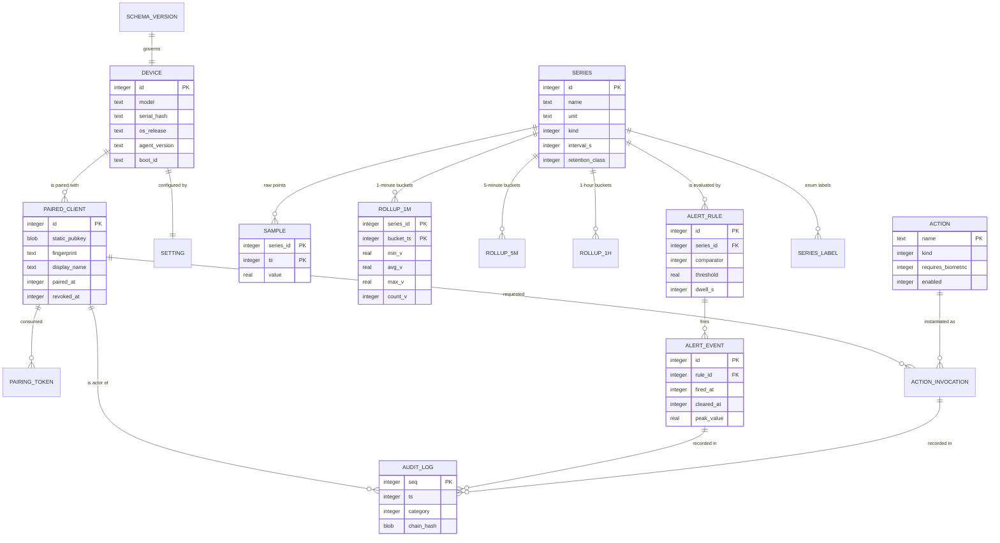
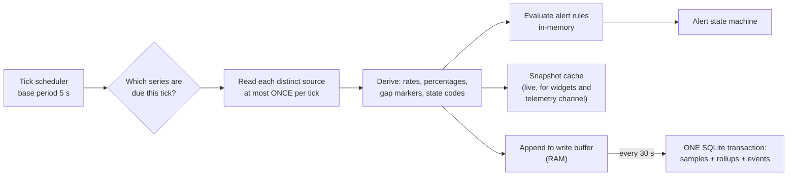
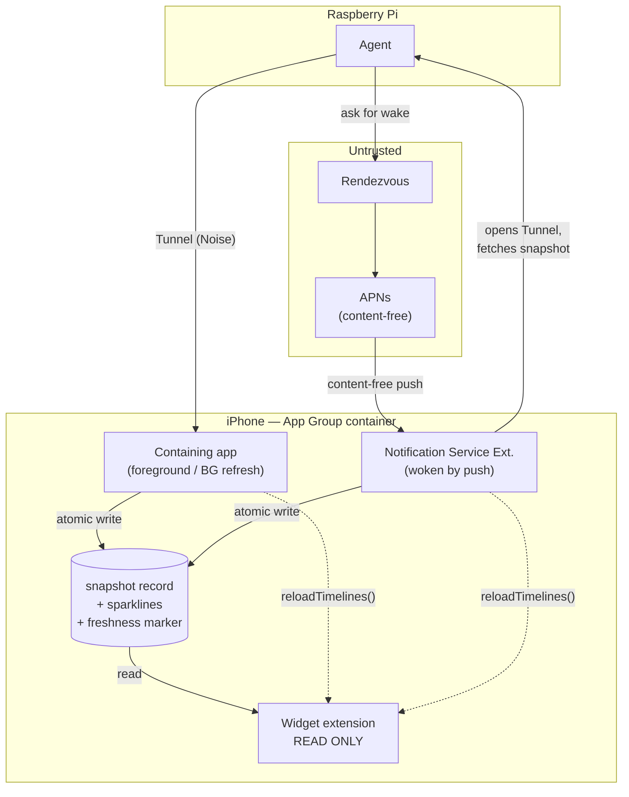
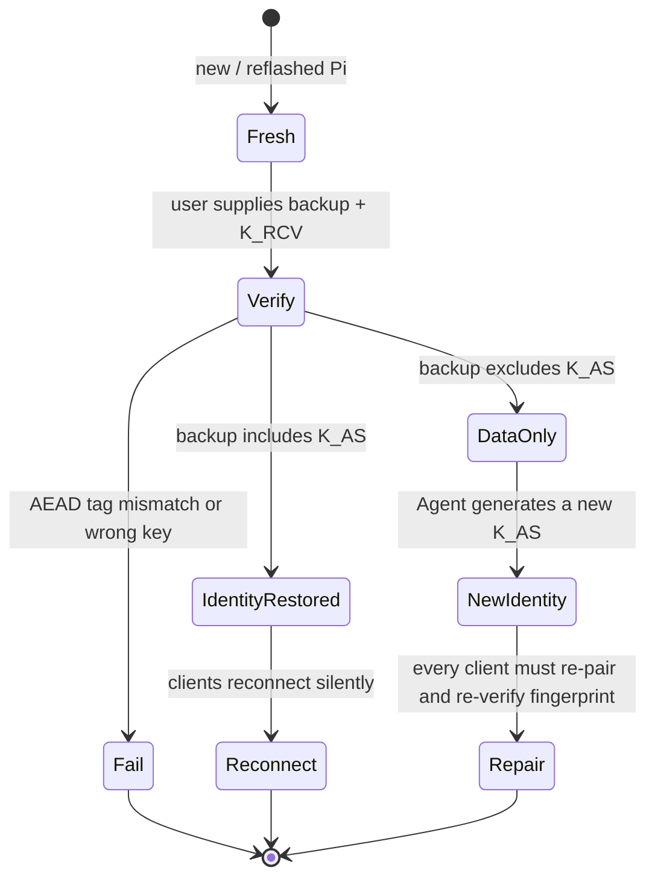

# 06 — Data Model

Agent-side persistent schema, the telemetry sampling plan, retention and downsampling
arithmetic, SD-card wear analysis, the Client-side cache, and the App Group contract
that feeds widgets.

Read [00-GLOSSARY](00-GLOSSARY.md) first. This document assumes the transport and
message semantics defined in [05-PROTOCOL](05-PROTOCOL.md), the component split in
[03-ARCHITECTURE](03-ARCHITECTURE.md), the key names and storage rules in
[04-SECURITY-E2EE](04-SECURITY-E2EE.md), and the filesystem layout in
[11-AGENT-DEPLOYMENT](11-AGENT-DEPLOYMENT.md).

Residual risks in this document are numbered `RR-Dnn` to keep the namespace distinct
from the sibling documents.

---

## 1. Purpose, scope and design principles

### 1.1 Scope

| In scope | Out of scope |
|---|---|
| Agent SQLite schema (all tables, columns, indexes) | Wire message shapes — see [05-PROTOCOL](05-PROTOCOL.md) |
| Metric catalogue and sampling sources | Alert *evaluation* algorithm — see [03-ARCHITECTURE](03-ARCHITECTURE.md) |
| Retention, downsampling, storage arithmetic | Key material formats and wrapping — see [04-SECURITY-E2EE](04-SECURITY-E2EE.md) |
| SD-card wear model | Widget layout and families — see [08-WIDGETS](08-WIDGETS.md) |
| Client cache and App Group contract | Chart rendering — see [07-UX-SPEC](07-UX-SPEC.md) |
| Export and backup formats | Package layout — see [11-AGENT-DEPLOYMENT](11-AGENT-DEPLOYMENT.md) |

### 1.2 Principles

| # | Principle | Consequence in this document |
|---|---|---|
| D1 | **The Pi is the source of truth** (README P4). | No telemetry is stored server-side. The Client holds only a *cache* that can be discarded and refetched. |
| D2 | **Bounded growth by construction.** | Every table has either a fixed row count, a retention window, or a hard row cap. There is no unbounded table. The steady-state database size MUST be computable before the first sample is taken — §6.3 does that computation. |
| D3 | **Write volume is a first-class budget.** | The Pi's root filesystem is usually a consumer SD card. §7 shows the dominant write cost is *flush frequency × hot-page count*, not data volume, and the design is tuned against that. |
| D4 | **Crash safety is graded, not absolute.** | Configuration, pairing state, alert rules and the audit log are durable. Recent raw samples are explicitly allowed to be lost on power cut. §7.4 states exactly how much. |
| D5 | **Degrade, never fail closed on observability** (README P5). | Sampling and rollup continue when no Tunnel exists. Backfill is a read of the same tables, not a separate queue. |
| D6 | **Plaintext at rest is minimised.** | Screen frames and PTY bytes are never persisted. Telemetry is stored in the clear on the Pi and is protected by filesystem permissions and, optionally, full-disk encryption — see §10 and `RR-D09`. |
| D7 | **Schema is versioned and forward-migrating only.** | One migration table, monotonic version, no downgrade path. Rollback of the Agent binary across a schema break requires a restore — see [11-AGENT-DEPLOYMENT](11-AGENT-DEPLOYMENT.md). |

### 1.3 Engine

SQLite, single file at `/var/lib/pi-monitor/agent.db`, accessed by a single writer
thread. Rationale, and the rejection of flat WAL files and an embedded TSDB, is
[ADR-0010](adr/ADR-0010-agent-storage-engine.md).

| Pragma / setting | Value | Reason |
|---|---|---|
| `journal_mode` | WAL | Concurrent readers during writes; sequential append is the SD-friendliest write pattern available. |
| `synchronous` | NORMAL | Removes one fsync per transaction. Cost is stated in §7.4. |
| `page_size` | 4096 | Matches ext4 block size and the FTL's smallest sane unit. Larger pages inflate the per-flush write cost linearly (§7.2). |
| `auto_vacuum` | INCREMENTAL | Lets retention pruning reclaim space without a full `VACUUM` rewrite (§6.5). |
| `foreign_keys` | ON | Retention and revocation cascades are enforced by the engine, not by application care. |
| `busy_timeout` | 5000 ms | Single writer; this only covers the backup/export reader. |
| `temp_store` | MEMORY | Rollup aggregation must not create temp files on the SD card. |
| Write batching | one transaction every 30 s | Canonical. This is the single most important wear parameter — §7.2. |

---

## 2. Entity–relationship overview

Three clusters are visible and they have very different lifecycles:

| Cluster | Tables | Row count | Write rate | Durability requirement |
|---|---|---|---|---|
| **Identity & policy** | `device`, `paired_client`, `pairing_token`, `action`, `alert_rule`, `setting`, `schema_version` | 10¹–10² | Rare (user action) | Absolute. Loss = re-pairing. |
| **Time series** | `series`, `series_label`, `sample`, `rollup_*` | 10⁵–10⁶ | Continuous, dominant | Graded. Losing the last 30 s is acceptable. |
| **Evidence** | `audit_log`, `alert_event`, `action_invocation` | 10³–10⁵ | Event-driven | High. Tamper-evident (§3.12). |

---

## 3. Agent SQLite schema

Conventions used in every column table below:

- `INTEGER` timestamps are **Unix seconds, UTC**, unless the column name ends `_ms`.
- `REAL` is IEEE-754 double. Sample values are stored as `REAL` even for counters —
  §3.6 explains why, and what it costs.
- `BLOB` public keys are raw 32-byte X25519 or Ed25519 values, never PEM.
- "NN" = NOT NULL. "U" = UNIQUE. "PK" = primary key. "FK→" = foreign key.

### 3.1 `device`

Identity and provenance of this Pi. Exactly one row, `id = 1`, enforced by a CHECK.

| Column | Type | Constraints | Purpose |
|---|---|---|---|
| `id` | INTEGER | PK, CHECK = 1 | Singleton guard. |
| `device_uuid` | BLOB(16) | NN, U | Stable random identity generated at first run. Not derived from hardware, so it survives a board swap during restore and does not leak the serial. |
| `model` | TEXT | NN | From `/proc/device-tree/model`, e.g. the Pi 4 / Pi 5 model string. Drives capability gating (§4.6). |
| `soc` | TEXT | NN | `BCM2711` or `BCM2712`. Selects the encoder path — see [ADR-0004](adr/ADR-0004-screen-streaming.md). |
| `serial_hash` | TEXT | NN | BLAKE2s-128 hex of the CPU serial from `/proc/cpuinfo`. Hashed so that an exported diagnostic bundle cannot be correlated back to a purchase record. |
| `os_release` | TEXT | NN | `VERSION_CODENAME` from `/etc/os-release` (`bookworm` / `trixie`). |
| `kernel` | TEXT | NN | `uname -r` equivalent. Recorded because uinput and screencopy behaviour is kernel-dependent. |
| `arch` | TEXT | NN | Always `aarch64` for the supported baseline; recorded to fail loudly on 32-bit installs. |
| `agent_version` | TEXT | NN | Semantic version of the running Agent. Updated on every start. |
| `agent_build` | TEXT | NN | Build hash. Used in the audit log and in crash reports. |
| `boot_id` | TEXT | NN | `/proc/sys/kernel/random/boot_id`. Changes on every boot; used to detect reboots without relying on the clock, and to mark counter series discontinuities (§4.5). |
| `timezone` | TEXT | NN | IANA name. Storage is UTC; this is for rendering and for rollup bucket alignment on the Client. |
| `installed_at` | INTEGER | NN | First-run timestamp. |
| `last_start_at` | INTEGER | NN | Updated on each start. |

- **Rows:** 1. **Growth:** none. **Indexes:** none needed beyond the PK.

### 3.2 `paired_client`

One row per iOS device that completed the pairing ceremony in
[04-SECURITY-E2EE](04-SECURITY-E2EE.md) §pairing. This is the Agent's entire
authorisation list; a `K_CS` not present and unrevoked here cannot complete a
Noise_IK handshake.

| Column | Type | Constraints | Purpose |
|---|---|---|---|
| `id` | INTEGER | PK | Local surrogate key, referenced by audit rows. |
| `client_uuid` | BLOB(16) | NN, U | Client-generated stable id, survives app reinstall only if the Keychain item survives. |
| `static_pubkey` | BLOB(32) | NN, U | The Client device static public key `K_CS`. The handshake authorisation check is a constant-time lookup on this column. |
| `fingerprint` | TEXT | NN | Cached display encoding (8×4 Base32 groups) of `static_pubkey`. Derived, stored for cheap rendering and for the revocation UI. |
| `rendezvous_pubkey` | BLOB(32) | NN | The Client Rendezvous Identity `K_CRI` (Ed25519). Stored so the Agent can recognise which paired device is behind a signalling attempt *before* the Noise handshake, for rate-limiting only. It is **not** an authentication credential for the Tunnel. |
| `display_name` | TEXT | NN | User-supplied or device-supplied name, e.g. "Owner's iPhone". Attacker-controlled string — MUST be length-capped at 64 and rendered as inert text. |
| `platform` | TEXT | NN | `ios`. Reserved for future clients. |
| `os_version` | TEXT | NULL | iOS version at last connect. Diagnostics only. |
| `app_version` | TEXT | NULL | Client build at last connect. Drives protocol-version compatibility warnings. |
| `paired_at` | INTEGER | NN | Ceremony completion time. |
| `paired_via` | INTEGER | NN | Enum: 0 = QR on attached display, 1 = QR rendered to console/framebuffer, 2 = headless out-of-band string. Recorded because the assurance level differs — see [04-SECURITY-E2EE](04-SECURITY-E2EE.md). |
| `fingerprint_confirmed_at` | INTEGER | NN | Time the *two-sided* fingerprint confirmation completed. A row with this NULL is not usable; it exists only mid-ceremony. |
| `last_seen_at` | INTEGER | NULL | Last successful handshake. Updated at most once per 60 s to avoid a write per reconnect storm. |
| `last_seen_transport` | INTEGER | NULL | Enum: direct / STUN-reflexive / TURN / Rendezvous relay. Diagnostics for the connectivity funnel in [03-ARCHITECTURE](03-ARCHITECTURE.md). |
| `session_count` | INTEGER | NN, default 0 | Lifetime successful sessions. |
| `revoked_at` | INTEGER | NULL | Non-NULL means the row is a tombstone. Rows are **never deleted** — see below. |
| `revoked_reason` | INTEGER | NULL | Enum: 0 user-initiated on Pi, 1 user-initiated from another Client, 2 lost-device recovery, 3 policy (too many failures), 4 superseded by re-pair. |
| `push_route_hint` | TEXT | NULL | Opaque, Rendezvous-scoped routing token used to ask Rendezvous to send a content-free push to this device. **It is not the APNs device token** — the Agent never sees that. See [05-PROTOCOL](05-PROTOCOL.md) `/notify`. |
| `capabilities` | BLOB | NULL | Deterministic-CBOR capability set last negotiated. Cached to detect downgrade attempts across sessions. |

**Tombstone rule.** Revoked clients MUST be retained, not deleted. Deleting the row
would let an attacker who re-obtains the old `K_CS` re-pair silently and would erase the
audit trail linking historical actions to a device. Tombstones are pruned only when the
user explicitly wipes device history.

| Index | Columns | Justification |
|---|---|---|
| PK | `id` | Referenced by four child tables. |
| `ux_client_static` | `static_pubkey` (unique) | The hot path: every handshake does exactly one lookup here. Unique constraint prevents two rows claiming one identity. |
| `ix_client_active` | `revoked_at` where NULL | Partial index; the "active devices" list is rendered on every dashboard load. |

- **Rows:** 1–10 realistically (one owner, a few devices). **Growth:** negligible.

### 3.3 `pairing_token`

Short-lived, single-use tokens minted when the user starts a pairing ceremony.

| Column | Type | Constraints | Purpose |
|---|---|---|---|
| `id` | INTEGER | PK | |
| `token_hash` | BLOB(32) | NN, U | BLAKE2s-256 of the 256-bit token `K_PT`, with domain separation. **The token itself is never written to disk.** A stolen database therefore cannot complete a pending pairing. |
| `created_at` | INTEGER | NN | |
| `expires_at` | INTEGER | NN | `created_at + 600` (10-minute TTL, canonical). |
| `consumed_at` | INTEGER | NULL | Set inside the same transaction that inserts the `paired_client` row. Single-use is enforced by a partial unique index, not by application logic. |
| `consumed_by_client` | INTEGER | NULL, FK→`paired_client.id` | Forensic link. |
| `attempts` | INTEGER | NN, default 0 | Failed claim attempts. At 5, the token is force-expired and an audit row is written. |
| `display_context` | INTEGER | NN | Enum matching `paired_client.paired_via`; recorded at mint time so the assurance level cannot be upgraded later. |

| Index | Columns | Justification |
|---|---|---|
| `ux_token_hash` | `token_hash` (unique) | Constant-time-ish single lookup on claim; uniqueness prevents collision-based confusion. |
| `ix_token_live` | `expires_at` where `consumed_at IS NULL` | Drives the 60-second expiry sweep without a full scan. |

- **Rows:** ≤ 10 at any time; swept to zero. **Growth:** none (expired rows deleted after 24 h, retained that long only for the audit trail).

> **Residual risk RR-D01:** the token hash is a *hash of a 256-bit random value*, so it is
> not brute-forceable, but the row does reveal that a pairing is pending and when it
> expires. An attacker with read access to the database therefore knows when to attempt a
> race. This is subsumed by the far larger consequence of database read access
> (`K_AS` exposure) covered in [04-SECURITY-E2EE](04-SECURITY-E2EE.md).

### 3.4 `series`

The metric catalogue as data. Adding a metric in a future Agent version inserts a row;
it does not migrate the schema.

| Column | Type | Constraints | Purpose |
|---|---|---|---|
| `id` | INTEGER | PK | Small integer, used as the foreign key in every sample row. Deliberately narrow: it is repeated ~10⁶ times, so a 2-byte-encodable id saves real space (§6.3). Ids 1–999 are reserved for built-in series and are **stable across versions** so that Client caches and exports remain comparable. |
| `name` | TEXT | NN, U | Dotted lowercase, e.g. `cpu.temp_c`. This is the identifier used on the `telemetry` channel and in exports. |
| `display_name` | TEXT | NN | Human label for charts. |
| `unit` | TEXT | NN | `celsius`, `percent`, `bytes`, `bytes_per_second`, `hertz`, `volts`, `count`, `seconds`, `dbm`, `ratio`, `state`. |
| `kind` | INTEGER | NN | 0 = gauge, 1 = counter (monotonic, stored as a derived rate — §4.5), 2 = state (enum, §4.4), 3 = bitmask. |
| `value_type` | INTEGER | NN | 0 = float, 1 = integer, 2 = small-int enum. Affects rendering and the aggregation function chosen for rollups (§6.2). |
| `interval_s` | INTEGER | NN | Default sample interval. MUST be a multiple of the sampler tick (§5.2). |
| `retention_class` | INTEGER | NN | 0 = full ladder, 1 = rollup-only (no raw retained), 2 = ephemeral (never persisted, live-stream only), 3 = event (persisted only on change). |
| `aggregation` | INTEGER | NN | How the rollup collapses the bucket: 0 = avg/min/max, 1 = last (for states), 2 = max (for saturation metrics like PSI), 3 = sum (for counters already converted to rates: sum of rate×dt). |
| `cardinality_key` | TEXT | NULL | For per-instance series (per network interface, per systemd unit, per container), the instance discriminator. NULL for singleton series. See §4.7 for the cardinality budget. |
| `source` | TEXT | NN | Free-text provenance, e.g. `/proc/stat`. Shown in the UI so the user can audit what is being read. |
| `enabled` | INTEGER | NN, default 1 | User- or capability-gated. Disabled series stop sampling but keep history. |
| `available` | INTEGER | NN, default 1 | Set to 0 by the capability probe at start-up when the source does not exist on this hardware (§4.6). Distinguishes "user turned it off" from "your Pi cannot do this". |
| `min_expected` / `max_expected` | REAL | NULL | Chart axis hints and a sanity filter — values outside a generous multiple are recorded but flagged. |
| `first_sample_at` / `last_sample_at` | INTEGER | NULL | Maintained lazily (once per flush) so the Client can request a sensible default chart window without scanning `sample`. |

| Index | Columns | Justification |
|---|---|---|
| `ux_series_name` | `name` (unique) | Name→id resolution on subscribe. |
| `ix_series_enabled` | `enabled, available` | The sampler builds its tick plan from this once per start, not per tick. |

- **Rows:** ~55 built-in + user/instance-driven (§4.7), realistic ceiling ~250. **Growth:** bounded by the cardinality cap.

### 3.5 `series_label`

Label mapping for `kind = 2` (state) and `kind = 3` (bitmask) series. Keeps the sample
table purely numeric.

| Column | Type | Constraints | Purpose |
|---|---|---|---|
| `series_id` | INTEGER | PK part, FK→`series.id` | |
| `code` | INTEGER | PK part | The small integer written into `sample.value`. |
| `label` | TEXT | NN | e.g. `active`, `failed`, `activating`. |
| `severity` | INTEGER | NN | 0 = ok, 1 = info, 2 = warn, 3 = critical. Lets the UI colour a state chart without hard-coded knowledge of each series. |

- **Rows:** ~150. **Growth:** none. **Index:** PK `(series_id, code)` is sufficient.

### 3.6 `sample` — raw time series

The hot table. Everything about its shape is a write-amplification decision.

| Column | Type | Constraints | Purpose |
|---|---|---|---|
| `series_id` | INTEGER | PK part, NN, FK→`series.id` | |
| `ts` | INTEGER | PK part, NN | Unix seconds, aligned to the series interval (§5.2). Alignment is what makes buckets computable by integer division instead of by scan. |
| `value` | REAL | NN | The sample. For counters this is the **derived rate**, not the raw counter (§4.5). For states this is the small integer code from `series_label`. |
| `flags` | INTEGER | NN, default 0 | Bit 0: value was interpolated/carried forward across a missed tick. Bit 1: first sample after a `boot_id` change (counter discontinuity). Bit 2: source read failed and this is a gap marker. Gap markers are stored so the Client can render a *break* rather than a straight line between distant points. |

**Primary key choice.** The table is declared `WITHOUT ROWID` with primary key
`(series_id, ts)`. The alternatives:

| Layout | Bytes/row on disk (est.) | Insert page churn per 30 s flush | Range-scan cost for one series over one window | Verdict |
|---|---|---|---|---|
| Rowid table + secondary index on `(series_id, ts)` | ~26 (table) + ~22 (index) ≈ 48 | 1–2 table pages (append) + ~40 index pages (scatter) ≈ 42 | Index seek then **random** row fetches by rowid — one page fault per sample in the worst case | Rejected: stores the key twice and still scatters. |
| `WITHOUT ROWID`, PK `(series_id, ts)` | ~26–32 total | ~40 leaf pages + ~15 interior ≈ 55 | Single **sequential** leaf scan; ~146 samples per page | **Chosen.** |
| `WITHOUT ROWID`, PK `(ts, series_id)` | ~26–32 | 1–2 leaf pages (pure append) — best possible | Reading one series over 24 h touches every page in the window (~2 400 pages) | Rejected: optimises the write path we can already batch, and destroys the read path that the charts depend on. |

The chosen layout stores rows *inside* the primary-key B-tree, so there is no duplicated
key and no rowid indirection — roughly **40–45 % less disk** than a rowid table with an
equivalent index, and a clustered layout in which one series' history over a time window
is physically contiguous. That is exactly the access pattern of every chart request and
of backfill.

The cost is paid on insert: a 30-second flush writes into ~40 different points in the
B-tree (one per active series), dirtying ~40 leaf pages plus the interior pages on the
paths to them. Because WAL writes whole 4 KiB pages, that is 220 KiB of WAL per flush
regardless of how few bytes actually changed. §7.2 turns this into a bytes-per-day figure
and shows that it — not the sample rate — is the dominant wear term.

> **Residual risk RR-D02:** the `(series_id, ts)` layout means write cost scales with the
> *number of active series*, not the amount of data. A user who enables 250 series
> (per-container, per-unit, per-interface) increases SD write volume ~6× while increasing
> stored bytes only ~6×-in-space but with no way to batch it away. The cardinality cap in
> §4.7 exists for this reason, and the Agent MUST warn when crossing 120 active series.

| Index | Columns | Justification |
|---|---|---|
| PK (clustered) | `series_id, ts` | Serves every read: chart window, backfill range, rollup source scan, retention prune range. No secondary index is needed or wanted — a second index would roughly double the write cost. |

- **Rows at steady state:** ~691 000 (§6.3). **Growth:** flat after 48 h.

### 3.7 `rollup_1m`, `rollup_5m`, `rollup_1h`

Three structurally identical tables. Separate tables rather than one table with a
`resolution` column, because (a) each has a different retention sweep and (b) a shared
table would put three different bucket densities in one B-tree, tripling the hot-page
count for no benefit.

| Column | Type | Constraints | Purpose |
|---|---|---|---|
| `series_id` | INTEGER | PK part, FK→`series.id` | |
| `bucket_ts` | INTEGER | PK part | Start of the bucket, aligned to 60 / 300 / 3600 s. |
| `min_v` | REAL | NN | |
| `avg_v` | REAL | NN | Mean over the samples actually present, not over the nominal bucket width. |
| `max_v` | REAL | NN | |
| `count_v` | INTEGER | NN | Number of contributing samples. Non-full buckets are how the Client knows the Agent was down; `count_v` well below the expected value renders as a partial bar. |
| `last_v` | REAL | NN | Value of the final sample. This is the correct aggregate for state and bitmask series, and is what widgets display for "current" when only rollups survive. |
| `flags` | INTEGER | NN, default 0 | OR of the contributing samples' flags; a bucket containing any gap marker is itself flagged. |

All three tables are `WITHOUT ROWID` with PK `(series_id, bucket_ts)`, for the same
reasons as §3.6.

| Table | Retention | Rows at steady state (40 series) | Justification of the tier |
|---|---|---|---|
| `rollup_1m` | 30 d | 40 × 43 200 = **1 728 000** | The "last month" view; 1-minute resolution is what makes a 24-hour chart look continuous at iPhone chart widths (~390 pt ≈ one point per 3.7 min at 24 h). |
| `rollup_5m` | 180 d | 40 × 51 840 = **2 073 600** | The "last six months" view. Note this table holds *more rows* than the 1-minute table — a counter-intuitive result driven entirely by the retention ratio (180 d / 30 d = 6 vs resolution ratio 1/5). §6.3 acts on this. |
| `rollup_1h` | 730 d | 40 × 17 520 = **700 800** | Long-term trend and year-over-year. Cheap. |

| Index | Columns | Justification |
|---|---|---|
| PK (clustered) | `series_id, bucket_ts` | Same single-access-pattern argument as `sample`. |

### 3.8 `alert_rule`

| Column | Type | Constraints | Purpose |
|---|---|---|---|
| `id` | INTEGER | PK | |
| `series_id` | INTEGER | NN, FK→`series.id` ON DELETE CASCADE | Target metric. |
| `name` | TEXT | NN | User-facing rule name; used as the push notification's *locally rendered* title (the push itself is content-free — see [04-SECURITY-E2EE](04-SECURITY-E2EE.md)). |
| `comparator` | INTEGER | NN | 0 `>`, 1 `>=`, 2 `<`, 3 `<=`, 4 `==`, 5 `!=`, 6 `changed`, 7 `absent` (no sample for dwell seconds). |
| `threshold` | REAL | NULL | NULL for `changed` / `absent`. |
| `threshold_secondary` | REAL | NULL | Hysteresis clear-threshold. If NULL, the clear threshold is `threshold` adjusted by 5 % toward the safe side. Explicit hysteresis is the difference between one alert and forty. |
| `dwell_s` | INTEGER | NN, default 60 | The predicate must hold continuously for this long before firing. |
| `clear_dwell_s` | INTEGER | NN, default 120 | And must be false this long before clearing. Asymmetric by default — slow to clear. |
| `severity` | INTEGER | NN | 1 info, 2 warn, 3 critical. Drives the interruption level of the local notification. |
| `cooldown_s` | INTEGER | NN, default 900 | Minimum interval between successive fires of the *same* rule. |
| `enabled` | INTEGER | NN, default 1 | |
| `notify_push` | INTEGER | NN, default 1 | Whether to ask Rendezvous to send a content-free wake push. |
| `notify_inapp` | INTEGER | NN, default 1 | |
| `quiet_hours_start` / `quiet_hours_end` | INTEGER | NULL | Local minutes-since-midnight. Critical severity ignores quiet hours. |
| `created_by_client` | INTEGER | NULL, FK→`paired_client.id` | |
| `created_at` / `updated_at` | INTEGER | NN | |

- **Rows:** 0–100. **Growth:** user-driven. **Index:** `ix_rule_active` on `(enabled, series_id)` — the evaluator loads the active rule set once per tick and must not scan disabled rules.

### 3.9 `alert_event`

| Column | Type | Constraints | Purpose |
|---|---|---|---|
| `id` | INTEGER | PK | |
| `rule_id` | INTEGER | NN, FK→`alert_rule.id` ON DELETE CASCADE | |
| `series_id` | INTEGER | NN | Denormalised so history survives a rule edit that repoints the rule. |
| `state` | INTEGER | NN | 0 pending (dwell not met), 1 firing, 2 cleared, 3 suppressed-by-cooldown, 4 suppressed-by-quiet-hours. |
| `fired_at` | INTEGER | NN | |
| `cleared_at` | INTEGER | NULL | |
| `trigger_value` | REAL | NN | Value at the moment the dwell completed. |
| `peak_value` | REAL | NN | Most extreme value in the direction of the comparator during the episode. |
| `threshold_at_fire` | REAL | NULL | Snapshot of the rule's threshold, so history is interpretable after the rule is edited. |
| `notify_requested_at` | INTEGER | NULL | When the Agent asked Rendezvous to push. |
| `notify_result` | INTEGER | NULL | 0 delivered-to-Rendezvous, 1 Rendezvous rejected, 2 no route (unpaired/revoked), 3 offline — queued, 4 abandoned after retries. The Agent can never learn whether APNs actually delivered; the enum stops at "handed off". |
| `acked_at` | INTEGER | NULL | Set when a Client acknowledges on the `control` channel. |
| `acked_by_client` | INTEGER | NULL, FK→`paired_client.id` | |

- **Rows:** capped at **20 000**, oldest-first eviction, plus a 365-day window. **Growth:** event-driven; a flapping rule is the worst case, which is exactly what `cooldown_s` and the row cap bound.

| Index | Columns | Justification |
|---|---|---|
| `ix_event_time` | `fired_at DESC` | The alert history list is the second-most-common read after charts. |
| `ix_event_open` | `rule_id` where `cleared_at IS NULL` | Partial index; the evaluator asks "is this rule currently firing?" every tick. |

### 3.10 `action` — the allow-list

Per the glossary, Actions are *named, allow-listed* operations. Arbitrary execution is
only available on the `shell` channel. This table is the allow-list; it is authoritative
and there is no code path that runs an action absent from it.

| Column | Type | Constraints | Purpose |
|---|---|---|---|
| `name` | TEXT | PK | e.g. `system.reboot`, `service.restart`, `screen.blank`. |
| `kind` | INTEGER | NN | 0 system-power, 1 systemd-unit, 2 display, 3 network, 4 agent-self, 5 package. Used for grouping and for coarse policy. |
| `description` | TEXT | NN | Shown in the confirmation sheet. |
| `arg_schema_id` | TEXT | NULL | Names a built-in argument validator (e.g. `unit_name`). **No free-form arguments.** An action with a NULL schema takes no arguments. Validators are compiled into the Agent, not stored, so a database write cannot widen an action's input space. |
| `arg_allowlist` | TEXT | NULL | For `service.restart`, the explicit set of unit names the user has permitted. Empty or NULL = the action is unusable even if enabled. |
| `requires_confirmation` | INTEGER | NN, default 1 | Client MUST show a confirm sheet. |
| `requires_biometric` | INTEGER | NN, default 0 | Client MUST re-authenticate with Face ID / Touch ID. Enforced client-side for UX and *also* by the Agent requiring a fresh-authentication assertion in the request — see [05-PROTOCOL](05-PROTOCOL.md) `control` channel. |
| `enabled` | INTEGER | NN, default varies | Destructive actions (`system.reboot`, `system.shutdown`) default to **disabled** and must be turned on from the Pi, not from the Client. |
| `max_per_hour` | INTEGER | NN, default 6 | Rate cap enforced by the Agent. |
| `min_interval_s` | INTEGER | NN, default 10 | Debounce. |
| `last_invoked_at` | INTEGER | NULL | |

- **Rows:** ~15 built-in. **Growth:** none.

> **Residual risk RR-D03:** an attacker with write access to the Agent database can set
> `enabled = 1` and clear `requires_biometric` on `system.reboot`. Database write access
> implies `K_AS` read access, so this is not an escalation — but it does mean the
> allow-list is a *policy* store, not a *security boundary against local root*. The
> security boundary is the filesystem permission model in
> [11-AGENT-DEPLOYMENT](11-AGENT-DEPLOYMENT.md).

### 3.11 `action_invocation`

| Column | Type | Constraints | Purpose |
|---|---|---|---|
| `id` | INTEGER | PK | |
| `action_name` | TEXT | NN, FK→`action.name` | |
| `client_id` | INTEGER | NULL, FK→`paired_client.id` | NULL = invoked locally on the Pi. |
| `requested_at` | INTEGER | NN | |
| `args_digest` | BLOB(32) | NULL | BLAKE2s of the validated arguments. The arguments themselves are stored only if they are already non-sensitive (a unit name); otherwise only the digest, so the audit trail proves *which* invocation without retaining content. |
| `args_text` | TEXT | NULL | Populated only for `arg_schema_id` values marked non-sensitive. |
| `outcome` | INTEGER | NN | 0 accepted, 1 rejected-not-allowlisted, 2 rejected-rate-limited, 3 rejected-no-biometric, 4 failed-execution, 5 succeeded. |
| `exit_code` | INTEGER | NULL | |
| `duration_ms` | INTEGER | NULL | |
| `detail` | TEXT | NULL | Capped at 512 B. |

- **Rows:** capped at 10 000 + 365 days. **Index:** `ix_invocation_time` on `requested_at DESC`.

### 3.12 `audit_log`

Append-only, hash-chained, tamper-**evident** (not tamper-proof).

| Column | Type | Constraints | Purpose |
|---|---|---|---|
| `seq` | INTEGER | PK, monotonic | Chain position. A gap in `seq` is itself evidence. |
| `ts` | INTEGER | NN | Wall clock. |
| `mono_ms` | INTEGER | NN | Monotonic milliseconds since boot, paired with `device.boot_id`. Recorded because the Pi has **no battery-backed RTC** — before NTP sync, `ts` is untrustworthy, and the monotonic pair is what preserves ordering. This matters for the handshake replay window in [04-SECURITY-E2EE](04-SECURITY-E2EE.md). |
| `boot_id` | TEXT | NN | |
| `category` | INTEGER | NN | 0 pairing, 1 session, 2 action, 3 alert, 4 config, 5 security, 6 lifecycle, 7 storage. |
| `event` | TEXT | NN | Stable symbolic name, e.g. `pairing.completed`, `handshake.rejected.unknown_static`. |
| `outcome` | INTEGER | NN | 0 success, 1 failure, 2 denied. |
| `actor_client_id` | INTEGER | NULL, FK→`paired_client.id` | NULL = local/system actor. |
| `actor_fingerprint` | TEXT | NULL | Denormalised: survives even if the client row is later wiped. |
| `transport` | INTEGER | NULL | Which path the session used. |
| `peer_addr_hash` | BLOB(16) | NULL | BLAKE2s-128 of the observed peer IP, salted with a per-install secret. Lets the user see "same network as before / different network" without the database becoming a location history. |
| `detail` | TEXT | NULL | Capped 512 B, no secrets, no PTY content, no screen content. |
| `prev_hash` | BLOB(32) | NN | Hash of the previous row's `chain_hash`. |
| `chain_hash` | BLOB(32) | NN | BLAKE2s-256 over `(prev_hash ‖ canonical encoding of this row)`. |

**What the chain does and does not do.** It makes *silent selective deletion or edit* of
history detectable, because recomputing the chain from any anchor fails. It does **not**
prevent an attacker with write access from truncating the log and rebuilding a consistent
chain from a chosen point, because the chain is keyed by nothing — it is a plain hash.
Making that infeasible would require either an off-device anchor or a MAC under a key the
local root cannot read; neither is available on a Pi where the attacker is root.

Mitigation actually adopted: the Agent periodically sends the current `chain_hash` and
`seq` to paired Clients on the `control` channel, and the Client persists them. A
truncation is then detectable by *the Client*, which holds an anchor the Pi-side attacker
cannot reach.

> **Residual risk RR-D04:** an attacker with root on the Pi who compromises it *before*
> any Client has anchored a chain hash can rewrite the entire audit log undetectably.
> Anchoring only protects history after the first anchor exchange.

| Index | Columns | Justification |
|---|---|---|
| PK | `seq` | Chain verification is a sequential scan; nothing else is needed for it. |
| `ix_audit_time` | `ts DESC` | User-facing log view. |
| `ix_audit_security` | `ts DESC` where `category = 5` | Partial index for the security-events-only filter, which is the one the user actually opens. |

- **Rows:** capped at **50 000** rows or 365 days, whichever binds first. Eviction is from the head, and an eviction event is itself logged with the evicted range, so the chain remains verifiable from the new anchor.

### 3.13 `setting`

| Column | Type | Constraints | Purpose |
|---|---|---|---|
| `key` | TEXT | PK | Dotted, e.g. `screen.default_profile`. |
| `value` | TEXT | NN | Canonical text encoding; typed by `value_type`. |
| `value_type` | INTEGER | NN | 0 bool, 1 int, 2 float, 3 string, 4 enum, 5 duration-seconds, 6 bytes. |
| `default_value` | TEXT | NN | Enables "reset to default" and a diff view of everything the user has changed. |
| `scope` | INTEGER | NN | 0 agent-global, 1 per-client (with `client_id`), 2 read-only-derived (populated by the Agent, not user-writable). |
| `client_id` | INTEGER | NULL, FK→`paired_client.id` | For scope 1. |
| `min_value` / `max_value` | TEXT | NULL | Validation bounds, enforced on write. |
| `requires_restart` | INTEGER | NN, default 0 | Surfaced in the UI. |
| `updated_at` | INTEGER | NN | |
| `updated_by_client` | INTEGER | NULL | |

Settings that also exist in `/etc/pi-monitor/agent.conf` are **overridden by the file** —
the file is the floor, the database is user preference within it. This ordering exists so
that a compromised Client cannot widen a bound the operator set on the Pi. The precedence
and the full key list are in [11-AGENT-DEPLOYMENT](11-AGENT-DEPLOYMENT.md).

- **Rows:** ~80. **Index:** PK plus `ux_setting_scoped` on `(key, client_id)` unique.

### 3.14 `schema_version`

| Column | Type | Constraints | Purpose |
|---|---|---|---|
| `version` | INTEGER | PK | Monotonic. One row per applied migration — the table is a *history*, not a single value, so a support bundle shows the upgrade path. |
| `applied_at` | INTEGER | NN | |
| `agent_version` | TEXT | NN | Which build applied it. |
| `direction` | INTEGER | NN | Always 0 (forward). Reserved. |
| `duration_ms` | INTEGER | NN | Migrations that take longer than 5 s must be reported in release notes. |
| `checksum` | BLOB(32) | NN | Hash of the migration script text, to detect a tampered or mismatched migration set. |

Migration policy: forward-only, each migration idempotent and wrapped in one
transaction, and the Agent refuses to start if `max(version)` exceeds the version it
knows (a downgrade). See [11-AGENT-DEPLOYMENT](11-AGENT-DEPLOYMENT.md) for the rollback
consequence.

---

## 4. Sampling plan — the metric catalogue

### 4.1 Reading the catalogue

| Column | Meaning |
|---|---|
| **Interval** | Default `series.interval_s`. |
| **Card.** | Cardinality: `1` = singleton; `N` = one series per instance, count in §4.7. |
| **Cost** | Sampling cost class: **T** trivial (< 50 µs), **L** low (< 500 µs), **M** medium (< 5 ms), **H** high (> 5 ms or spawns a process). See §5. |
| **Def.** | ● enabled by default, ○ opt-in. |

All figures are **estimates — validate with benchmark** on both Pi 4 and Pi 5.

### 4.2 Numeric series

| Series name | Description | Source | Unit | Kind | Interval | Card. | Cost | Def. |
|---|---|---|---|---|---|---|---|---|
| `cpu.temp_c` | SoC temperature | `/sys/class/thermal/thermal_zone0/temp` (millidegrees ÷ 1000) | celsius | gauge | 10 s | 1 | T | ● |
| `cpu.util_pct` | Aggregate CPU busy | `/proc/stat` line `cpu`, delta of non-idle jiffies | percent | counter→rate | 10 s | 1 | L | ● |
| `cpu.util_user_pct` | User time | `/proc/stat` | percent | counter→rate | 10 s | 1 | L | ● |
| `cpu.util_system_pct` | Kernel time | `/proc/stat` | percent | counter→rate | 10 s | 1 | L | ● |
| `cpu.util_iowait_pct` | I/O wait | `/proc/stat` | percent | counter→rate | 10 s | 1 | L | ● |
| `cpu.util_irq_pct` | Hard+soft IRQ | `/proc/stat` | percent | counter→rate | 10 s | 1 | L | ○ |
| `cpu.core_util_pct` | Per-core busy | `/proc/stat` lines `cpu0..cpu3` | percent | counter→rate | 10 s | 4 | L | ○ |
| `cpu.freq_mhz` | Current ARM clock | `/sys/devices/system/cpu/cpu0/cpufreq/scaling_cur_freq` | hertz | gauge | 10 s | 1 | T | ● |
| `cpu.freq_max_mhz` | Governor ceiling | `.../cpufreq/scaling_max_freq` | hertz | gauge | 60 s | 1 | T | ○ |
| `cpu.volts_core` | Core voltage | mailbox `measure_volts core` (see §4.3) | volts | gauge | 30 s | 1 | M | ○ |
| `load.1m` / `load.5m` / `load.15m` | Load averages | `/proc/loadavg` fields 1–3 | count | gauge | 10 s | 3 | T | ● |
| `sys.procs_running` | Runnable processes | `/proc/loadavg` field 4 numerator | count | gauge | 10 s | 1 | T | ● |
| `sys.procs_total` | Total processes | `/proc/loadavg` field 4 denominator | count | gauge | 10 s | 1 | T | ○ |
| `mem.total_bytes` | Installed RAM | `/proc/meminfo` `MemTotal` | bytes | gauge | 3600 s | 1 | T | ● |
| `mem.available_bytes` | Reclaimable + free | `/proc/meminfo` `MemAvailable` | bytes | gauge | 10 s | 1 | T | ● |
| `mem.used_pct` | Derived: 1 − available/total | `/proc/meminfo` | percent | gauge | 10 s | 1 | T | ● |
| `mem.cached_bytes` | Page cache | `/proc/meminfo` `Cached` + `SReclaimable` | bytes | gauge | 30 s | 1 | T | ○ |
| `mem.swap_used_bytes` | Swap in use | `/proc/meminfo` `SwapTotal − SwapFree` | bytes | gauge | 30 s | 1 | T | ● |
| `mem.swap_io_bps` | Swap thrash | `/proc/vmstat` `pswpin`/`pswpout` delta | bytes_per_second | counter→rate | 30 s | 1 | L | ○ |
| `psi.cpu_some_avg10` | CPU pressure | `/proc/pressure/cpu` | ratio | gauge | 10 s | 1 | T | ● |
| `psi.mem_some_avg10` | Memory pressure | `/proc/pressure/memory` | ratio | gauge | 10 s | 1 | T | ● |
| `psi.mem_full_avg10` | Memory stall | `/proc/pressure/memory` | ratio | gauge | 10 s | 1 | T | ○ |
| `psi.io_some_avg10` | I/O pressure | `/proc/pressure/io` | ratio | gauge | 10 s | 1 | T | ● |
| `psi.io_full_avg10` | I/O stall — the single best "SD card is dying" signal | `/proc/pressure/io` | ratio | gauge | 10 s | 1 | T | ● |
| `disk.used_pct` | Filesystem usage | `statvfs` on each mount | percent | gauge | 60 s | N | L | ● |
| `disk.free_bytes` | Free space | `statvfs` | bytes | gauge | 60 s | N | L | ● |
| `disk.inodes_free_pct` | Inode exhaustion | `statvfs` | percent | gauge | 300 s | N | L | ○ |
| `disk.read_bps` / `disk.write_bps` | Block throughput | `/proc/diskstats` sectors × 512, delta | bytes_per_second | counter→rate | 10 s | N | L | ● |
| `disk.io_util_pct` | Time device was busy | `/proc/diskstats` field 10 (ms doing I/O) delta ÷ interval | percent | counter→rate | 10 s | N | L | ● |
| `disk.await_ms` | Mean request latency | `/proc/diskstats` fields 7+11 ÷ completions | seconds | counter→rate | 30 s | N | L | ○ |
| `net.rx_bps` / `net.tx_bps` | Interface throughput | `/sys/class/net/*/statistics/{rx,tx}_bytes` (preferred; single-value files, no parsing) or `/proc/net/dev` | bytes_per_second | counter→rate | 10 s | N | L | ● |
| `net.rx_errs_rate` / `net.tx_errs_rate` | Interface errors | `/sys/class/net/*/statistics/{rx,tx}_errors` | count | counter→rate | 30 s | N | L | ● |
| `net.rx_drop_rate` / `net.tx_drop_rate` | Dropped frames | `.../statistics/*_dropped` | count | counter→rate | 30 s | N | L | ○ |
| `net.wifi_rssi_dbm` | Wi-Fi signal | `/proc/net/wireless`, or nl80211 for accuracy | dbm | gauge | 30 s | N | L | ● |
| `net.wifi_link_mbps` | Negotiated rate | nl80211 station info | count | gauge | 60 s | N | M | ○ |
| `gpu.freq_mhz` | Core/V3D clock | mailbox `measure_clock core` / `v3d` | hertz | gauge | 30 s | 1 | M | ○ |
| `sys.uptime_s` | Uptime | `/proc/uptime` | seconds | gauge | 60 s | 1 | T | ● |
| `sys.sessions_count` | Logged-in sessions | logind D-Bus `ListSessions` (preferred over `utmp`) | count | gauge | 60 s | 1 | M | ○ |
| `systemd.units_failed` | Failed unit count | systemd D-Bus `NFailedUnits` property — a single property read, far cheaper than listing units | count | gauge | 30 s | 1 | M | ● |
| `journal.errors_per_min` | Rate of priority ≤ 3 messages | `sd-journal` follow with a persisted cursor, counted incrementally | count | counter→rate | 60 s | 1 | L | ● |
| `journal.warns_per_min` | Priority 4 | same | count | counter→rate | 60 s | 1 | L | ○ |
| `docker.containers_running` | Running containers | Docker socket `GET /containers/json` | count | gauge | 30 s | 1 | M | ○ |
| `docker.containers_unhealthy` | Failing healthchecks | same | count | gauge | 30 s | 1 | M | ○ |
| `docker.cpu_pct` / `docker.mem_bytes` | Per-container usage | cgroup v2 files under `/sys/fs/cgroup/` (**not** the Docker stats API, which is ~100× more expensive) | percent / bytes | gauge | 30 s | N | L | ○ |
| `apt.updates_pending` | Upgradable packages | `python3-apt` cache or cached `apt-check` output | count | gauge | 21600 s | 1 | H | ● |
| `apt.security_updates_pending` | Security subset | same | count | gauge | 21600 s | 1 | H | ● |
| `storage.media_life_used_pct` | Wear indicator | eMMC `/sys/class/mmc_host/.../life_time`; NVMe `percentage_used` via NVMe log page | percent | gauge | 3600 s | 1 | M | ○ |
| `nvme.temp_c` | NVMe temperature | hwmon or NVMe SMART log | celsius | gauge | 60 s | 1 | M | ○ |
| `power.volts_in` | Input rail (Pi 5 PMIC) | `vcgencmd pmic_read_adc` / mailbox | volts | gauge | 30 s | 1 | M | ○ |
| `power.amps_in` | Input current (Pi 5 PMIC) | same | count | gauge | 30 s | 1 | M | ○ |
| `agent.cpu_pct` | Agent's own CPU | `/proc/self/stat` | percent | counter→rate | 30 s | 1 | T | ● |
| `agent.rss_bytes` | Agent's own RSS | `/proc/self/statm` | bytes | gauge | 30 s | 1 | T | ● |
| `agent.db_bytes` | Database size | `stat` on the db + WAL | bytes | gauge | 300 s | 1 | T | ● |
| `agent.screen_bitrate_bps` | Encoder output rate | internal counter | bytes_per_second | gauge | 5 s | 1 | T | ● (ephemeral) |
| `agent.screen_fps` | Delivered frame rate | internal counter | count | gauge | 5 s | 1 | T | ● (ephemeral) |
| `agent.rtt_ms` | Tunnel round trip | `control` keepalive | seconds | gauge | 10 s | 1 | T | ● (ephemeral) |

`agent.screen_*` and `agent.rtt_ms` have `retention_class = 2` (ephemeral): they are
streamed live and never written to disk. They exist as series so the Client can chart
them with the same machinery.

### 4.3 State and bitmask series

Non-numeric series are stored as small integers in `sample.value`; the label mapping
lives in `series_label` (§3.5), never in the sample row.

| Series name | Kind | Source | Encoding | Interval | Def. |
|---|---|---|---|---|---|
| `cpu.throttled_flags` | bitmask | `vcgencmd get_throttled` / mailbox tag `GET_THROTTLED` | Raw 32-bit word, stored as REAL (exactly representable) | 10 s | ● |
| `systemd.unit_state` | state | systemd D-Bus `ActiveState` per watched unit | 0 inactive, 1 activating, 2 active, 3 deactivating, 4 failed, 5 not-found | 30 s | ● (per watched unit) |
| `docker.container_state` | state | Docker socket / cgroup | 0 created, 1 running, 2 paused, 3 restarting, 4 exited, 5 dead, 6 unhealthy | 30 s | ○ |
| `sys.time_sync_state` | state | `timedatectl` D-Bus properties `NTPSynchronized` | 0 unsynchronised, 1 synchronised, 2 no NTP configured | 60 s | ● |
| `apt.reboot_required` | state | existence of `/var/run/reboot-required` | 0 no, 1 yes | 3600 s | ● |
| `net.link_state` | state | `/sys/class/net/*/operstate` | 0 down, 1 up, 2 dormant, 3 unknown | 30 s | ● |
| `agent.tunnel_state` | state | internal state machine ([03-ARCHITECTURE](03-ARCHITECTURE.md) §tunnel) | mirrors the canonical state names | on change | ● (event class) |
| `sys.boot_state` | state | derived from `boot_id` change | 0 steady, 1 first sample after boot | on change | ● (event class) |

**`vcgencmd get_throttled` bit decoding.** This is the single most valuable Pi-specific
metric — it is how under-voltage and thermal capping become visible instead of appearing
as mysterious slowness.

| Bit | Mask | Meaning | Persistence | Typical cause |
|---|---|---|---|---|
| 0 | `0x1` | Under-voltage detected **now** | live | Inadequate PSU or cable; Pi 5 needs a 5 V/5 A supply for full peripheral power |
| 1 | `0x2` | ARM frequency capped **now** | live | Thermal or voltage protection engaged |
| 2 | `0x4` | Currently throttled | live | Hard throttle in effect; performance is degraded right now |
| 3 | `0x8` | Soft temperature limit active **now** | live | SoC above the soft limit (~60 °C on Pi 4 by default); clock reduced pre-emptively |
| 16 | `0x10000` | Under-voltage has occurred **since boot** | sticky | The one users miss — clears only on reboot |
| 17 | `0x20000` | ARM frequency capping has occurred since boot | sticky | |
| 18 | `0x40000` | Throttling has occurred since boot | sticky | |
| 19 | `0x80000` | Soft temperature limit has occurred since boot | sticky | |

The Agent MUST expose the live bits (0–3) as an instantaneous state and the sticky bits
(16–19) as a separate boolean set that resets on `boot_id` change. Alerting on the sticky
bits without that reset produces a permanently-firing alert, which is the most common
mistake with this metric.

**Obtaining it without forking.** `vcgencmd` is a *process spawn* — 5–15 ms of fork/exec
per call (estimate — validate with benchmark), which at a 10-second interval is by far the
most expensive item in the whole sampler. The Agent SHOULD issue the equivalent VideoCore
mailbox property request directly on `/dev/vcio` (`ioctl`, ~50 µs) and fall back to
spawning `vcgencmd` only if the device node is unavailable. Either path requires
membership in the **`video`** group — see [11-AGENT-DEPLOYMENT](11-AGENT-DEPLOYMENT.md).

> **Residual risk RR-D05:** the mailbox interface is firmware-versioned and undocumented
> as a stable ABI. A firmware update can change tag behaviour. The Agent MUST verify the
> mailbox result against a `vcgencmd` invocation once at start-up and permanently fall
> back to spawning if they disagree.

### 4.4 Top-N process series

| Series | Description | Source | Interval | Notes |
|---|---|---|---|---|
| `proc.top_cpu` | Top 5 processes by CPU delta | scan of `/proc/*/stat` | 30 s | Stored as an **event-class** row: a single CBOR blob in a dedicated table, not as 5 series. Turning process names into series names would make cardinality unbounded and would leak command lines into the series catalogue. |
| `proc.top_rss` | Top 5 by resident memory | `/proc/*/statm` | 30 s | Same treatment. |

These are the only telemetry items whose *content* is potentially sensitive (command
lines can contain arguments). They are **opt-in**, truncated to the executable basename by
default, and classified `Confidential` in §10.

### 4.5 Counters, rates, and discontinuities

Counter sources (`/proc/stat`, `/proc/diskstats`, `/sys/class/net/*/statistics`) are
monotonic and wrap. The Agent stores the **derived rate**, not the raw counter:

| Concern | Handling |
|---|---|
| Rate derivation | `(c₂ − c₁) / (t₂ − t₁)`, computed in the sampler from the in-memory previous reading. |
| Counter wrap | 64-bit counters on aarch64 do not realistically wrap. 32-bit `/proc/net/dev` values on a saturated gigabit link wrap in ~34 s; the Agent MUST prefer the `/sys/class/net/*/statistics/*` files, which are 64-bit, and MUST treat any decrease as a reset. |
| Reset / reboot | A decrease, or a `boot_id` change, emits a **gap marker** (`flags` bit 1/2) instead of a spurious negative or enormous rate. |
| First sample | No rate is emitted for the first reading after start; the series simply begins one interval later. |
| Missed tick | If the sampler is late by more than 1.5× the interval, the rate is still correct (it divides by actual elapsed time) but `flags` bit 0 is set so charts can indicate reduced confidence. |

Storing rates rather than counters costs the ability to recompute a different aggregation
window later, and makes the data non-reconstructible if a sample is lost. It buys a fixed
`REAL` column, trivial rollups, and charts that need no client-side differentiation. For a
single-device monitor this is the right trade; a fleet TSDB would choose otherwise.

### 4.6 Hardware and platform availability

The capability probe runs at every start and sets `series.available`.

| Source | Pi 4 (BCM2711) | Pi 5 (BCM2712) | Notes |
|---|---|---|---|
| `/sys/class/thermal/thermal_zone0` | ✅ | ✅ | Pi 5 exposes additional zones; zone 0 remains the SoC. |
| `vcgencmd get_throttled` | ✅ | ✅ | Requires `video` group. |
| `vcgencmd measure_volts core` | ✅ | ⚠️ | Reports differently on Pi 5's PMIC-based rails; validate per firmware. |
| `vcgencmd pmic_read_adc` | ❌ | ✅ | Pi 5 only — input voltage/current telemetry. |
| `/sys/class/power_supply` | ❌ (usually absent) | ⚠️ | Present only with a supported PSU/UPS HAT. |
| `/proc/pressure/*` | ✅ | ✅ | Requires `CONFIG_PSI` — enabled in Raspberry Pi OS kernels; probe rather than assume. |
| Hardware H.264 encoder (V4L2 M2M) | ✅ | ❌ | **Pi 5 removed the hardware H.264 encoder.** Affects `agent.screen_*` cost, not availability — see [ADR-0004](adr/ADR-0004-screen-streaming.md). |
| NVMe SMART | ⚠️ (USB adapter, often no SMART passthrough) | ✅ (PCIe HAT) | |
| eMMC `life_time` | ⚠️ CM4 only | ⚠️ CM5 only | Absent on SD-card installs — **there is no wear indicator for an SD card**, which is precisely why §7 reasons from a write budget instead. |
| Wi-Fi via nl80211 | ✅ | ✅ | Absent on Ethernet-only installs. |

### 4.7 Cardinality budget

| Dimension | Instances (typical) | Instances (cap) | Series per instance | Total series |
|---|---|---|---|---|
| Singletons | — | — | — | ~40 |
| Block devices | 1–2 | 4 | 4 | 4–16 |
| Network interfaces | 1–2 | 6 | 5 | 5–30 |
| Mounted filesystems | 1–2 | 8 | 3 | 3–24 |
| Watched systemd units | 3 | 32 | 1 | 3–32 |
| Docker containers | 0 | 32 | 3 | 0–96 |
| **Total active series** | **~40 default** | **250 hard cap** | | |

The Agent MUST refuse to create series beyond 250 and MUST warn at 120. §7.2 shows why:
active series count is the direct multiplier on SD-card write volume.

---

## 5. Sampling cost model

### 5.1 Per-source cost

All figures are estimates on a Pi 4 at 1.8 GHz — **validate with benchmark**. Pi 5 should
be roughly 2–2.5× faster.

| Source | Operation | Syscalls | CPU per read | Frequency | CPU per hour |
|---|---|---|---|---|---|
| `/sys/class/thermal/.../temp` | open+read+close, ~6 B | 3 | ~8 µs | 360/h | 3 ms |
| `/proc/stat` (4 cores) | open+read+close, ~1.5 KB, parse 5 lines | 3 | ~25 µs | 360/h | 9 ms |
| `/proc/loadavg` | ~40 B | 3 | ~7 µs | 360/h | 3 ms |
| `/proc/meminfo` | ~1.4 KB, parse 6 keys | 3 | ~30 µs | 360/h | 11 ms |
| `/proc/pressure/*` ×3 | ~120 B each | 9 | ~20 µs total | 360/h | 7 ms |
| `/sys/class/net/*/statistics/*` ×10 files | single-value files | 30 | ~60 µs | 360/h | 22 ms |
| `/proc/diskstats` | ~1 KB | 3 | ~20 µs | 360/h | 7 ms |
| `statvfs` ×2 | syscall, no parsing | 2 | ~15 µs | 60/h | 1 ms |
| `/dev/vcio` mailbox (throttled) | one `ioctl` | 1 | ~50 µs | 360/h | 18 ms |
| **`vcgencmd` fork/exec (fallback)** | **fork+exec+wait+parse** | **~200** | **~8 ms** | 360/h | **2 880 ms** |
| systemd D-Bus `NFailedUnits` | one property `Get` | ~6 | ~1.5 ms | 120/h | 180 ms |
| systemd D-Bus per-unit `ActiveState` ×3 | 3 property reads, batched | ~10 | ~3 ms | 120/h | 360 ms |
| `sd-journal` incremental follow | cursor advance, event-driven | — | ~0.3 ms/min amortised | — | 18 ms |
| Docker `GET /containers/json` | unix socket HTTP | ~15 | ~12 ms | 120/h | 1 440 ms |
| cgroup v2 per-container files | plain file reads | ~6/container | ~40 µs | 120/h | 5 ms |
| `apt` upgradable count | apt cache open + resolve | thousands | **~1.5–4 s** | 4/day | ~10 s/day |
| `/proc/*/stat` scan (top-N, ~150 procs) | 150 × open+read+close | ~450 | ~4 ms | 120/h | 480 ms |

### 5.2 Consolidated tick

The sampler MUST run **one consolidated tick**, not one timer per series.

| Property | Value | Reason |
|---|---|---|
| Base tick | 5 s | Greatest common divisor of the fastest useful interval (5 s) and everything above it. Every `interval_s` MUST be a multiple. |
| Source deduplication | mandatory | `/proc/stat` feeds five series; it is read once. Naïve per-series timers would read it five times and, worse, compute five inconsistent rate denominators. |
| Timestamp | one clock read per tick, applied to all series in it | Makes samples in a tick exactly aligned, which is what lets bucket assignment be integer division. |
| Slow sources | separate low-priority worker | `apt`, Docker and top-N run off the critical path; a slow `apt` scan must never delay `cpu.temp_c`. |
| Late tick handling | skip, do not catch up | Emitting two ticks back-to-back would produce a bogus zero-elapsed rate. |
| Estimated total | **< 1 ms CPU per 10 s tick** with the mailbox path; ~9 ms with the `vcgencmd` fallback | ≈ 0.01 % of one core, or 0.09 % with the fallback. Sampling is not the Agent's cost centre; screen encoding is. |

---

## 6. Retention, downsampling, and storage arithmetic

### 6.1 The ladder

| Tier | Resolution | Retention | Buckets / series / day | Rows / series retained | Bytes / row (est.) | Bytes / series retained |
|---|---|---|---|---|---|---|
| `sample` (raw) | 10 s | **48 h** | 8 640 | 17 280 | 26–32 | 449–553 KB |
| `rollup_1m` | 60 s | **30 d** | 1 440 | 43 200 | 48–56 | 2.07–2.42 MB |
| `rollup_5m` | 300 s | **180 d** | 288 | 51 840 | 48–56 | 2.49–2.90 MB |
| `rollup_1h` | 3600 s | **730 d** | 24 | 17 520 | 48–56 | 0.84–0.98 MB |
| | | | | **129 840** | | **5.85–6.85 MB** |

### 6.2 Aggregation rules

| `series.aggregation` | Applies to | 1 m from raw | 5 m from 1 m | 1 h from 5 m |
|---|---|---|---|---|
| 0 avg/min/max | gauges (temperature, memory, load) | min, mean, max, count, last | min of mins, count-weighted mean of means, max of maxes | same |
| 1 last | states, bitmasks | last value in bucket; min/max carry the same value | last of lasts | same |
| 2 max | PSI, saturation | max dominates; mean retained but the UI shows max | max of maxes | same |
| 3 sum-of-rate | counters already stored as rates | count-weighted mean (equivalent to total ÷ elapsed) | same | same |

Rollups are computed from the **next finer tier**, not from raw, at every level above
1 minute. Recomputing 1 h directly from raw would require raw to be retained for an hour
past every hourly boundary, and would read 360× more pages. The count-weighted mean makes
the cascade exact for means; min/max are exact at every level; **percentiles are not
computable from this ladder and are deliberately not offered.**

> **Residual risk RR-D06:** because rollups cascade, a bug or a gap at the 1-minute tier
> propagates permanently into 5-minute and 1-hour history, and raw data to recompute from
> is gone after 48 h. The rollup job MUST therefore write `count_v` faithfully and MUST
> be idempotent for the last two buckets, so a restart re-derives rather than duplicates.

### 6.3 Steady-state size — worked

Assumptions: **40 active series**, all at 10 s raw, ladder as above, midpoint row costs
(29 B raw, 52 B rollup).

**Raw tier**

- Samples per series per day = 86 400 ÷ 10 = **8 640**
- Total per day = 40 × 8 640 = **345 600 samples/day**
- Bytes per day = 345 600 × 29 B = 10 022 400 B ≈ **9.6 MiB/day**
- Retained 48 h → **691 200 rows ≈ 19.1 MiB**

**1-minute tier**

- Buckets/series/day = 1 440 → total 40 × 1 440 = **57 600 rows/day**
- Bytes/day = 57 600 × 52 = 2 995 200 B ≈ **2.9 MiB/day**
- Retained 30 d → **1 728 000 rows ≈ 85.7 MiB**

**5-minute tier**

- Buckets/series/day = 288 → total **11 520 rows/day** ≈ **0.57 MiB/day**
- Retained 180 d → **2 073 600 rows ≈ 102.8 MiB**

**1-hour tier**

- Buckets/series/day = 24 → total **960 rows/day** ≈ **0.05 MiB/day**
- Retained 730 d → **700 800 rows ≈ 34.8 MiB**

**Totals**

| Component | Rows | Size |
|---|---|---|
| `sample` | 691 200 | 19.1 MiB |
| `rollup_1m` | 1 728 000 | 85.7 MiB |
| `rollup_5m` | 2 073 600 | 102.8 MiB |
| `rollup_1h` | 700 800 | 34.8 MiB |
| Time-series subtotal | 5 193 600 | **242.4 MiB** |
| B-tree slack / free pages (~12 %) | — | 29.1 MiB |
| `audit_log` (50 000 × ~220 B) | 50 000 | 10.5 MiB |
| `alert_event` (20 000 × ~120 B) | 20 000 | 2.3 MiB |
| `action_invocation` (10 000 × ~140 B) | 10 000 | 1.3 MiB |
| Metadata tables | ~400 | < 0.2 MiB |
| WAL (steady, between checkpoints) | — | ~4 MiB |
| **Steady-state total** | | **≈ 290 MiB** |

Two conclusions worth stating plainly:

1. **The 5-minute tier is the largest**, not the raw tier. Retention ratio beats
   resolution ratio. If disk becomes a problem, shortening `rollup_5m` from 180 d to 90 d
   saves 51 MiB — more than deleting all raw data (19 MiB).
2. **290 MiB is not a problem on any supported install.** The default budget cap is
   **512 MiB**; on crossing it, the Agent sheds tiers in the order raw → 1 m → 5 m,
   logging each shed to `audit_log`, and surfaces a warning on the `control` channel.

### 6.4 High-frequency sampling

If the user enables 1-second raw sampling (`interval_s = 1`):

| Metric | 10 s default | 1 s | Change |
|---|---|---|---|
| Raw samples/day | 345 600 | 3 456 000 | ×10 |
| Raw bytes/day | 9.6 MiB | 96 MiB | ×10 |
| Raw retained (48 h) | 19.1 MiB | 191 MiB | ×10 |
| Total DB steady state | 290 MiB | 462 MiB | ×1.6 |
| Rollup tiers | unchanged | unchanged | ×1 |
| Sampler CPU | ~0.01 % core | ~0.1 % core | ×10 |
| **SD-card WAL writes/day** | **618.8 MiB** | **663.8 MiB** | **×1.07** |

The last row is the important one and is explained in §7.2: raising the sample rate costs
*space* and *CPU* proportionally, but costs almost no additional *writes*, because WAL
writes whole pages and the set of hot pages barely changes. High-frequency sampling is
therefore permitted, but it is capped at 1 s, applies only to series the user explicitly
opts in, and automatically shortens raw retention to 12 h (bringing raw back to 48 MiB).

### 6.5 Job schedule and space reclamation

| Job | Period | Work | Est. duration | Write cost |
|---|---|---|---|---|
| Sample flush | 30 s | One transaction: buffered samples + open rollup updates | < 10 ms | 220 KiB WAL (§7.2) |
| 1-minute rollup | **300 s** | Writes the 5 completed 1-minute buckets per series in one pass | < 30 ms | 180 KiB WAL |
| 5-minute rollup | 900 s | From `rollup_1m` | < 20 ms | small |
| 1-hour rollup | 3600 s | From `rollup_5m` | < 20 ms | small |
| Raw prune | 3600 s | Delete `ts <` now − 48 h, in ≤ 50 000-row chunks | < 200 ms | ~10 MiB WAL/day total |
| Rollup prune | 86400 s | Per-tier window delete | < 500 ms | small |
| Row-cap eviction | 3600 s | `audit_log`, `alert_event`, `action_invocation` | < 50 ms | small |
| `incremental_vacuum` | after each prune | Reclaim ≤ 256 pages (1 MiB) per run | < 50 ms | ≤ 1 MiB |
| Integrity check | weekly, idle only | `PRAGMA quick_check` | 1–5 s | none |
| Chain verify | daily | Recompute `audit_log` hash chain from anchor | < 500 ms | none |

**The 1-minute rollup runs every 5 minutes, not every minute.** Writing one bucket per
series per minute would dirty ~45 pages 1 440 times a day (≈ 253 MiB of WAL); writing
five buckets at once dirties the same ~45 pages 288 times a day (≈ 51 MiB). Same
data, **5× less physical writing**, at the cost of the 1-minute chart trailing live by up
to 5 minutes — which is invisible, because the live path uses the in-memory snapshot and
the raw tier, not the rollups.

**Never run full `VACUUM` automatically.** A full vacuum of a 290 MiB database rewrites
290 MiB — roughly half a day's entire write budget in one burst — and needs ~2× free
space. `auto_vacuum = INCREMENTAL` plus bounded `incremental_vacuum` after each prune
keeps the file from growing without that burst. Full `VACUUM` is offered only as an
explicit user-initiated maintenance action, gated behind a confirmation that states the
write cost.

---

## 7. SD-card wear analysis

### 7.1 Why this section exists

The Pi's usual failure mode in an always-on monitoring role is storage. There is no wear
indicator for an SD card (§4.6), so the only defence is to reason from a write budget and
design to it.

### 7.2 The dominant term: pages, not bytes

WAL journalling appends **whole 4 KiB pages**. A transaction that modifies 8 bytes on a
page still appends 4 096 bytes. Therefore:

> **WAL bytes/day ≈ flushes/day × dirty pages/flush × page size**

Dirty pages per flush, for 40 active series with the clustered `(series_id, ts)` layout:

| Contribution | Pages | Reasoning |
|---|---|---|
| `sample` leaf pages | ~40 | One hot leaf per series (the right edge of that series' key range). A 4 KiB leaf holds ≈ 4 096 ÷ 28 ≈ **146 samples**, so a series' hot page turns over every ~24 minutes at 10 s sampling. |
| `sample` interior pages | ~10–15 | Fan-out for a 6-byte key is ≈ 340, so 691 200 rows ≈ 4 734 leaves need ~15 interior pages + root; most are on the paths to the hot leaves and are dirtied by the split bookkeeping. |
| WAL/DB header pages | 1–2 | |
| **Total** | **≈ 55** | |

| Scenario | Flushes/day | Dirty pages | WAL bytes/day |
|---|---|---|---|
| **Default: 30 s flush, 40 series** | 2 880 | 55 | 2 880 × 55 × 4 096 = **618.8 MiB** |
| 60 s flush, 40 series | 1 440 | 55 | **309.4 MiB** |
| 300 s flush (tmpfs staging), 40 series | 288 | 60 | **67.5 MiB** |
| 30 s flush, 120 series | 2 880 | ~145 | **1.59 GiB** |
| 30 s flush, 250 series (cap) | 2 880 | ~290 | **3.19 GiB** |
| 30 s flush, 40 series, 1 s sampling | 2 880 | ~59 | **663.8 MiB** |

This is the justification for the cardinality cap in §4.7 and for the 5-minute rollup
schedule in §6.5. It is also why increasing the *sample rate* is cheap and increasing the
*series count* is expensive — the opposite of most people's intuition.

### 7.3 Layer-by-layer amplification

| Layer | Input | Multiplier | Output | Notes |
|---|---|---|---|---|
| Logical row data | ~14 MiB/day | — | 14 MiB/day | Samples + rollups + events, actual bytes changed. |
| SQLite WAL (page granularity) | 14 MiB/day | **×44** | 618.8 MiB/day | §7.2. The whole story is here. |
| Rollup + prune jobs | — | +65 MiB/day | 683.8 MiB/day | §6.5. |
| WAL checkpoint → main DB | 683.8 MiB/day | ×0.05 | +36 MiB/day → 719.8 MiB/day | Checkpoint coalesces: a page dirtied 25 times in the WAL is copied back **once**. Autocheckpoint at 1 000 pages ≈ every 9 min ≈ 155/day × ~55 unique pages. |
| ext4 metadata + journal | 719.8 MiB/day | ×1.10 | 791.7 MiB/day | `data=ordered`; WAL is append-then-reuse, so extent churn is modest. `noatime` mandatory — without it every read updates an inode. |
| SD FTL, sequential WAL append | 752 MiB/day (WAL share) | ×1.2 | 902 MiB/day | Append patterns suit a coarse-erase-block FTL well. |
| SD FTL, random 4 KiB checkpoint writes | 40 MiB/day (checkpoint share) | ×8 | 317 MiB/day | Cheap cards with 4 MiB erase blocks and no meaningful buffering amplify small random writes badly. |
| **Total NAND written** | | | **≈ 1 219 MiB/day ≈ 1.19 GiB/day** | |

**Per year: ≈ 425 GiB ≈ 0.47 TB (decimal).**

### 7.4 Is that survivable?

| Medium | Capacity | Endurance assumption | Full-drive writes/year at 0.47 TB/yr | Expected life from telemetry writes alone |
|---|---|---|---|---|
| Cheap 32 GB class-10 SD | 32 GB | ~500 P/E, imperfect wear levelling → assume effective 5 TBW | 14.6 | **~11 years** |
| Decent 32 GB A1 SD | 32 GB | ~1 000 P/E, decent FTL → ~15 TBW | 14.6 | **~32 years** |
| 64 GB A2 SD | 64 GB | ~30 TBW | 7.3 | **~64 years** |
| USB-SSD / NVMe (Pi 5 HAT) | 256 GB+ | 100–150 TBW | 1.8 | **> 200 years** |

**The honest conclusion is that this workload does not wear out an SD card.** At
~0.47 TB/year, even a pessimistic 5 TBW card survives a decade. The real killers of Pi SD
cards are, in order: counterfeit/low-grade cards, **power loss during a write**, and the
rest of the system (journald, `apt`, swap, browser caches) — not a well-batched telemetry
database.

That reframes the mitigations: they are worth doing, but the *highest-value* protection is
crash safety and honest capacity, not write reduction.

| Mitigation | Effect on writes | Cost | Default |
|---|---|---|---|
| WAL mode | Replaces rollback-journal double-write with a single append | Needs a checkpoint policy | ✅ on |
| `synchronous = NORMAL` | Removes ~2 880 fsyncs/day | **See below** | ✅ on |
| 30 s batched transactions | ~120× fewer flushes than per-sample commits | ≤ 30 s of raw data at risk | ✅ on |
| 5-minute rollup batching | −202 MiB/day | 1-minute charts trail by ≤ 5 min | ✅ on |
| `noatime` mount option | Eliminates an inode write per file read | None | ✅ required |
| `commit=600` mount option | ext4 journal flush every 10 min instead of 5 s | Up to 10 min of *filesystem metadata* at risk on power loss | ○ documented, off |
| tmpfs staging for raw (flush every 5 min) | 618.8 → 67.5 MiB/day (**−89 %**) | Up to 5 min of raw samples lost on power cut | ○ opt-in |
| Move DB to USB-SSD/NVMe | Removes SD from the equation entirely | Hardware cost | ○ **recommended** for Pi 5 + NVMe HAT |
| Disable raw retention (`retention_class = 1`) | −19 MiB space; writes largely unchanged | No sub-minute history | ○ opt-in |
| Cardinality cap 250 / warn 120 | Bounds the dominant term | Fewer per-container series | ✅ enforced |

**The cost of `synchronous = NORMAL`, stated plainly.** In WAL mode with
`synchronous = NORMAL`, SQLite does not fsync the WAL on every commit; it fsyncs at
checkpoints. A **power loss** (not a process crash — a process crash is fully safe here)
can therefore lose the most recent committed transactions, up to the last checkpoint. In
practice that is ≤ 30 s of samples, occasionally more. The database itself is **not
corrupted** — WAL framing plus per-frame checksums mean recovery discards torn frames
cleanly. The trade is: lose ≤ 30 s of telemetry on power cut, in exchange for eliminating
2 880 fsyncs/day.

Two consequences follow, and both are honoured:

1. Anything that must **never** be lost — completion of a pairing ceremony, a revocation,
   a schema migration, an audit row for a security event — is committed with
   `synchronous = FULL` for that transaction specifically. Durability is applied per
   transaction, not per database.
2. The user is told, in the storage settings screen, that the last half-minute of history
   may be lost on a power cut, and offered `synchronous = FULL` globally at a stated cost
   of roughly 2 880 extra fsyncs/day.

> **Residual risk RR-D07:** `synchronous = NORMAL` combined with an SD card that lies
> about flush completion (common in cheap cards) can, in rare power-loss cases, corrupt
> the database beyond WAL recovery. The Agent mitigates by keeping the last known-good
> configuration and pairing state in a small, separately-fsynced file (see §12) so that a
> corrupted `agent.db` never costs the user their pairing. A corrupted database is
> detected by `PRAGMA quick_check` at start-up and results in the time-series tables being
> rebuilt empty, with an audit entry — never in a refusal to start.

---

## 8. Client-side cache model

### 8.1 What the Client persists

The Client cache is **disposable**. Everything in it can be refetched from the Agent, and
the app MUST function (showing an explicit "no cached data" state) if it is deleted.

| Item | Purpose | Size cap | Lifetime |
|---|---|---|---|
| Paired-agent record | Agent name, `K_AS` fingerprint, `RID`, capability set, last-seen | ~2 KB per agent | Until unpaired |
| Latest snapshot | Every enabled series' current value + timestamp | ~4 KB | Overwritten each refresh |
| Chart windows | Downsampled points for the windows the user has actually viewed (1 h, 6 h, 24 h, 7 d, 30 d) | 384 points per series per window (≈ 3 KB) | LRU, 7 days |
| Alert history mirror | Last 500 alert events | ~60 KB | 90 days |
| Audit anchor | Last `(seq, chain_hash)` received from the Agent (§3.12) | 48 B | Permanent — this one is **not** disposable and is stored with the pairing record |
| Action catalogue | Names, confirmation/biometric flags | ~2 KB | Refreshed on connect |
| Terminal scrollback | **Not persisted.** In-memory only, cleared on backgrounding | — | — |
| Screen frames | **Never persisted.** | — | — |

**Total cache budget: 8 MiB**, enforced by LRU eviction of chart windows first.

### 8.2 Store choice

No ADR covers this, so the decision is recorded here.

| Option | Verdict |
|---|---|
| **SQLite, single file in the App Group container, accessed through a thin repository layer** | **Chosen.** Schema parity with the Agent means the same series/rollup shapes round-trip without translation; size caps are enforceable with a single delete; the file lives directly in the App Group container where the widget extension can open it read-only; and there is no object-graph machinery in the path of a chart redraw. |
| Core Data | Rejected. The object graph, faulting and migration machinery buy nothing for append-mostly numeric series, and `NSPersistentContainer` in an App Group with a widget extension reading concurrently is a well-known source of lock contention and store-corruption reports. |
| Flat files (one per series/window) | Rejected for the main cache. Enforcing a global size cap across hundreds of small files means directory scans, and atomic multi-item updates need a hand-rolled journal. Retained only for the widget snapshot (§9), where there is exactly one small record and atomicity is a single atomic replace. |
| SwiftData | Rejected for v1: it raises the deployment floor above the iOS 17.0 baseline for the features that would justify it, and inherits Core Data's concurrency profile. |

### 8.3 Invalidation

| Trigger | Action |
|---|---|
| Agent reports a different `boot_id` | Counter-derived series marked discontinuous; charts render a break. Cache retained. |
| Agent reports a `K_AS` fingerprint mismatch | **Hard stop.** No cache use, no connection; the re-verification flow in [04-SECURITY-E2EE](04-SECURITY-E2EE.md) is required. |
| Agent reports a higher `series` catalogue version | Series metadata refetched; samples retained (ids are stable, §3.4). |
| Client is revoked | Entire cache and all key material destroyed on the next `control` message or push. |
| Protocol version incompatible | Cache retained read-only; UI shows "update required". |
| Cache > 8 MiB | LRU evict chart windows, then alert history. Snapshot and pairing record are never evicted. |

### 8.4 Encryption at rest

| Item | Data Protection class | Reason |
|---|---|---|
| Cache database | `NSFileProtectionCompleteUntilFirstUserAuthentication` | Widgets and the notification service extension must read it after a device reboot before the user has unlocked *again*; `Complete` would make widgets blank after every reboot. This is a deliberate, stated downgrade. |
| Widget snapshot file (§9) | `NSFileProtectionCompleteUntilFirstUserAuthentication` | Same reason. |
| Audit anchor + pairing record | `NSFileProtectionComplete` | Not needed by extensions; gets the strongest class. |
| `K_CS`, `K_CRI` (Keychain) | `kSecAttrAccessibleWhenUnlockedThisDeviceOnly` + Secure-Enclave-wrapped per [04-SECURITY-E2EE](04-SECURITY-E2EE.md) | Never leaves the device, never in a backup. |

> **Residual risk RR-D08:** telemetry values and alert history in the widget-readable
> store are protected only `UntilFirstUserAuthentication`. On a device that has been
> unlocked at least once since boot, an attacker with a filesystem-level exploit can read
> CPU temperature, uptime, alert history and the Pi's display name. This is metadata about
> a Raspberry Pi, not credentials or session content, and no key material shares this
> class. Screen frames, PTY bytes and key material are never in it.

---

## 9. App Group shared container contract

### 9.1 The constraint being designed around

A WidgetKit extension gets a small execution budget, runs only when the system decides,
and **cannot be relied upon to perform network I/O** — a widget timeline provider that
opens a WebRTC connection and runs a Noise handshake will exceed its budget and be
terminated. Therefore the widget is a **pure reader**. Everything it displays was written
earlier by the containing app or by the notification service extension.

The full rationale, including why the widget does not fetch and why the push is
content-free, is [ADR-0009](adr/ADR-0009-widget-data-path.md); the widget families and
layouts are [08-WIDGETS](08-WIDGETS.md).

### 9.2 The contract

App Group identifier is fixed at build time. All items live at the container root, are
written by **atomic replace** (write to a temporary file, then replace), and are read with
no locking. There is exactly one writer at a time in practice; if the app and the NSE race,
last-writer-wins on a whole record is acceptable because every record is a complete
snapshot, never a delta.

| Item | Producer | Consumer | Format | Max size | Update trigger | Staleness policy |
|---|---|---|---|---|---|---|
| **Snapshot record** | App (foreground, BG refresh), NSE (on push) | Widget, app cold start | Deterministic CBOR, one map | **16 KiB** | Every Tunnel snapshot; at most once per 60 s | Displayed with a relative age ("4 min ago"). > 15 min → dimmed with an age label. > 60 min → "stale" treatment. Never shown as current without an age. |
| **Sparkline series** | App only | Widget | Deterministic CBOR: per series, 48 `Float32` points + base timestamp + interval | **8 KiB** total, ≤ 6 series | On foreground refresh, and on BG refresh if > 15 min old | Rendered greyed if the trailing point is > 30 min old. |
| **Agent identity record** | App (on pair / on rename) | Widget, NSE | Deterministic CBOR: display name, model, `K_AS` fingerprint (display form), `RID`, colour token | **2 KiB** | Pairing, rename, revocation | Never stale; absence means "not paired" and the widget renders the configuration prompt. |
| **Freshness marker** | App, NSE | Widget, app | Deterministic CBOR: last successful refresh timestamp, last attempt timestamp, last failure code (from the [05-PROTOCOL](05-PROTOCOL.md) error table), consecutive failure count, transport used | **512 B** | Every refresh attempt, success **or** failure | This is what lets a widget distinguish "the Pi is fine and idle" from "we haven't been able to reach the Pi". Distinguishing those two is the single most important widget correctness requirement. |
| **Alert badge record** | NSE, App | Widget | Deterministic CBOR: count of unacknowledged alerts, highest severity, most recent rule name, fired-at | **1 KiB** | On alert push, on ack | Cleared when the app marks alerts acknowledged. |
| **Widget config** | Widget (via intent), App | App | Property list | 4 KiB | User edits the widget | — |

Hard rules:

1. **No key material, ever**, in the App Group container. `K_CS` and `K_CRI` stay in the
   Keychain with `ThisDeviceOnly` accessibility. A widget never authenticates anything.
2. **No PTY content and no screen frames**, at any size, for any reason.
3. Every record is **self-describing and versioned** with a leading integer version field;
   a widget reading a record from a newer app version it does not understand renders the
   "update the app" state rather than misrendering.
4. Every record carries its own **produced-at timestamp**; the widget never uses file
   modification time, which is not reliable across atomic replacement.
5. Total container footprint is capped at **256 KiB**. It is a display cache, not a store.

### 9.3 Refresh budget reality

| Path | Typical frequency | Reliability |
|---|---|---|
| App in foreground | Continuous (live Tunnel) | Certain |
| `BGAppRefreshTask` | System-decided; commonly a handful of times per day, less if the app is used rarely | **Unreliable — MUST NOT be the only path** |
| Content-free push → NSE | Within seconds of an Agent-side event | Reliable for *events*, not for periodic refresh |
| Widget timeline reload | System-throttled, budgeted per widget per day | Reliable enough for rendering, not for fetching |

The consequence is stated honestly in [08-WIDGETS](08-WIDGETS.md): **a widget showing
telemetry that is minutes old is the expected steady state, not a bug.** The design
therefore makes age a first-class part of every widget's visual language rather than
pretending to be live. Alerts are the exception — those arrive by push and are timely.

> **Residual risk RR-D09:** if the user force-quits the app and the system deprioritises
> background refresh, widgets can go hours without an update. The freshness marker makes
> this visible but cannot fix it. Alert delivery is unaffected, because it rides the push
> path.

---

## 10. Data classification

| Category | Example | Sensitivity | Stored where | Leaves the Pi? | To whom | Encrypted by | Retention |
|---|---|---|---|---|---|---|---|
| **Key material — Agent static** | `K_AS` private | **Critical** | `/var/lib/pi-monitor/keys/`, 0600, dir 0700 | **Never** | — | Filesystem permissions only (see below) | Life of install |
| **Key material — Client static** | `K_CS` private | **Critical** | iOS Keychain, wrapped by `K_SEW` | Never | — | Secure Enclave-derived AES-256-GCM + Keychain | Until unpair |
| **Key material — Rendezvous identity** | `K_ARI`, `K_CRI` | High | Pi keys dir / Keychain | Public halves only | Rendezvous | Filesystem / Keychain | Life of install |
| **Pairing token** | `K_PT` | **Critical**, 10 min | Hash only, in `pairing_token` | Yes, in the QR and to Rendezvous | Whoever sees the QR | — (single-use, short TTL) | 10 min |
| **Recovery key** | `K_RCV` | **Critical** | **Not stored by the Agent.** Shown once, held by the user | No | — | User's custody | User's choice |
| **Screen frames** | Desktop pixels | **Confidential** | **Never persisted, either side** | Yes, live only | Client only | Noise inside DTLS | 0 — memory only |
| **PTY bytes** | Shell I/O, possibly typed passwords | **Confidential** | **Never persisted, either side.** Not in journald, not in `audit_log` | Yes, live only | Client only | Noise inside DTLS | 0 — memory only |
| **Telemetry values** | `cpu.temp_c` | Internal | `sample`, `rollup_*` — **plaintext on the Pi** | Yes | Client only | Noise in transit; nothing at rest | Per ladder (§6.1) |
| **Process names (top-N)** | `postgres`, `python3` | **Confidential** | Event table, opt-in, basename only | Yes | Client only | Noise in transit | 48 h |
| **Hostname, model, OS version** | `raspberrypi`, `Pi 5 8GB` | Internal | `device` | Yes | Client; **and Rendezvous learns nothing of it** | Noise in transit | Life of install |
| **CPU serial** | Hardware serial | Internal | **Hashed only** (`serial_hash`) | Hash only | Client | — | Life of install |
| **Peer IP addresses** | Client's public IP | **Confidential** (location-revealing) | `audit_log.peer_addr_hash`, **salted hash only** | No | — | — | 365 d |
| **IP addresses at Rendezvous** | Both endpoints' IPs | **Confidential** | Rendezvous, **hashed**, ≤ 24 h | n/a | Rendezvous operator | — | ≤ 24 h |
| **APNs device token** | Push routing token | **Confidential** | **Rendezvous only** — the Agent holds an opaque `push_route_hint`, never the token | n/a | Rendezvous, Apple | TLS | Until unpair |
| **Push payload** | Wake signal | Public by design | — | Yes | Apple, Rendezvous | **Content-free — there is nothing to protect** | Transient |
| **Alert rules & thresholds** | "temp > 75 °C" | Internal | `alert_rule` | Yes | Client | Noise in transit | Until deleted |
| **Alert history** | Fired events | Internal | `alert_event`, mirrored on Client | Yes | Client | Noise in transit | 365 d / 20 000 |
| **Audit log** | `pairing.completed` | **Confidential** | `audit_log` | On request | Client | Noise in transit | 365 d / 50 000 |
| **Action allow-list** | `service.restart` + unit names | Internal | `action` | Yes | Client | Noise in transit | Life of install |
| **Agent config** | Ports, profiles | Internal | `/etc/pi-monitor/agent.conf` | Partially | Client | — | Life of install |

**What the Rendezvous can see, in total:** that a `RID` is present or absent; the size and
timing of opaque signalling blobs; two Ed25519 public keys; an APNs token; and IP
addresses. It sees **no** telemetry, no hostname, no fingerprint, no plaintext, and no
alert content. [04-SECURITY-E2EE](04-SECURITY-E2EE.md) proves why it also cannot
impersonate either endpoint.

> **Residual risk RR-D10:** telemetry is stored **unencrypted at rest** on the Pi. Anyone
> with root on the Pi, or physical possession of the SD card, reads two years of CPU,
> memory, network and uptime history — a detailed occupancy and usage profile of the
> household — plus `K_AS`. Encrypting the database would require a key that an unattended
> headless daemon can retrieve at boot without a human, which on a Pi means storing the
> key next to the ciphertext. We therefore do **not** claim encryption at rest; the honest
> mitigations are full-disk encryption with a manual unlock (documented, not default), and
> physical security. This is the same threat class as SD-card theft in
> [04-SECURITY-E2EE](04-SECURITY-E2EE.md).

---

## 11. Export formats

Exports are produced by the Agent on request over the `files` channel, or locally by a
CLI subcommand. Both produce identical bytes.

### 11.1 CSV — one file per series

| Field | Type | Notes |
|---|---|---|
| `timestamp` | RFC 3339 UTC, second precision | Not epoch seconds: exports are opened in spreadsheets. |
| `series` | string | The dotted name. |
| `value` | decimal | Up to 6 significant digits; states export as the integer code. |
| `label` | string | Resolved label for state/bitmask series; empty for numeric. |
| `unit` | string | Repeated per row for self-description. |
| `aggregation` | string | `raw`, `min`, `avg`, `max`, `last` — identifies which tier the row came from. |
| `count` | integer | Samples behind the row; `1` for raw. Lets the reader spot partial buckets. |
| `flags` | integer | Gap/interpolation bits from §3.6. |

A header row is always emitted; the field order above is stable and is part of the
compatibility contract in [05-PROTOCOL](05-PROTOCOL.md).

### 11.2 JSON Lines — one object per line

| Field | Type | Notes |
|---|---|---|
| `t` | integer | Unix seconds. |
| `s` | string | Series name. |
| `v` | number | Value. |
| `a` | string | Aggregation tier. |
| `n` | integer | Count. |
| `f` | integer | Flags. |
| `u` | string | Unit — emitted only on the first line for each series, to keep the file small. |

The first line of every export is a **manifest object**: export format version, Agent
version, `device_uuid`, `serial_hash`, timezone, time range, series catalogue with ids,
label mappings, and the ladder tiers included. Without it, an export of state series is
uninterpretable.

### 11.3 What exports never contain

Key material, `pairing_token` rows, PTY content, screen frames, raw peer IP addresses, or
`push_route_hint`. An export is safe to attach to a forum post *except* for the audit log
and the top-N process series, which are excluded unless explicitly requested and are
flagged in the UI when they are.

### 11.4 Prometheus scrape — optional, off by default

A read-only text-exposition endpoint on **localhost only** is offered for users who
already run Prometheus/Grafana.

| Property | Value |
|---|---|
| Bind | `127.0.0.1` only, never `0.0.0.0` |
| Default | **Disabled** |
| Auth | None (loopback only) — enabling it on a shared host is the user's decision, and the setting text says so |
| Content | Current snapshot only; **no history**, since Prometheus does its own storage |
| Excluded | Audit log, process names, alert history, anything from §10 above "Internal" |

It is off by default because it is the only feature in the product that opens a listening
socket, which sits in direct tension with README principle **P2 (no inbound ports)**. The
principle is about *internet-reachable* ports and a loopback socket does not violate it —
but it is close enough that it must be an explicit, informed opt-in rather than a default.

---

## 12. Backup and restore of Agent state

### 12.1 Contents

| Component | In backup? | Form |
|---|---|---|
| `device` row | ✅ | Plaintext within the encrypted envelope |
| `paired_client` rows (incl. revocation tombstones) | ✅ | As stored |
| `alert_rule`, `action`, `setting` | ✅ | As stored |
| `audit_log` | ✅ | Full, with chain intact so it stays verifiable across restore |
| `alert_event`, `action_invocation` | ✅ | As stored |
| `series`, `series_label` | ✅ | Needed to interpret samples |
| `rollup_1h`, `rollup_5m` | ✅ | The long-horizon history is the point of a backup |
| `rollup_1m` | ⚙️ optional | Default off — it is the second-largest tier and is regenerable only going forward |
| `sample` (raw) | ❌ | Never. 48 h of raw is not worth the size, and it is the highest-volume, lowest-value data. |
| **`K_AS` private** | ⚙️ **only if the user opts in**, always **re-wrapped** under `K_RCV` | See §12.2 |
| `K_ARI` private | ⚙️ same treatment as `K_AS` | |
| `pairing_token` rows | ❌ **MUST NOT** | Restoring a live pairing token would resurrect a claimable pairing window. |
| Ephemerals, transport keys | ❌ | They only ever exist in memory. |
| Config file `/etc/pi-monitor/agent.conf` | ✅ | See [11-AGENT-DEPLOYMENT](11-AGENT-DEPLOYMENT.md) |

### 12.2 Encryption of the backup

The entire backup is a single encrypted envelope. Key derivation:

`K_RCV` (256-bit, shown to the user once as 24 BIP-39 words) → HKDF-SHA256 with a
per-backup random salt and a backup-specific domain separator → an AES-256-GCM content key.

| Property | Value |
|---|---|
| Envelope | Header (format version, salt, timestamp, Agent version, whether keys are included) + AEAD ciphertext. The header is authenticated as associated data. |
| Integrity | AEAD tag over the whole payload; truncation and tampering are detected. |
| Key inclusion | A backup that contains `K_AS` is a **full identity backup** and MUST be labelled as such in the file name and in the header, and the UI MUST state that possessing this file plus `K_RCV` is equivalent to possessing the Pi. |
| Key exclusion (default) | A backup without `K_AS` is a **data backup**: restoring it preserves history, rules and the audit log, but the restored Agent has a **new identity** and all clients must re-pair. |
| `K_RCV` storage | **Never on the Pi and never on the phone.** Shown once, at generation, with a confirmation step. If it is lost, the backup is unrecoverable, and the UI says exactly that. |

### 12.3 Restore semantics

| Scenario | `K_AS` | What the Client experiences |
|---|---|---|
| Restore onto the **same** Pi after a reinstall, identity backup | Preserved | Nothing. Sessions resume; the fingerprint is unchanged. |
| Restore onto a **new** Pi, identity backup | Preserved (moved) | Nothing — which is precisely the point, and precisely the risk. The identity is portable, so anyone with the backup file **and** `K_RCV` can stand up an Agent that every paired Client accepts as genuine. This is stated in the UI at backup time, not buried. |
| Restore onto any Pi, **data-only** backup | New | **Fingerprint mismatch.** The Client MUST refuse to connect and MUST require the full pairing ceremony with fresh two-sided fingerprint verification. It MUST NOT offer "trust the new key" as a one-tap action — that would reintroduce TOFU, which the glossary and [04-SECURITY-E2EE](04-SECURITY-E2EE.md) explicitly reject. |
| Reflashed Pi, **no** backup | New | As above, plus all history is gone. |

> **Residual risk RR-D11:** an identity-inclusive backup converts the Agent's identity from
> "something you have (a specific Pi)" into "a file". A backup file plus `K_RCV` is a
> complete impersonation capability against every paired Client, and the Client cannot
> detect it — the fingerprint matches, because it *is* the same key. This is an unavoidable
> consequence of wanting hardware-failure recovery without re-pairing. Mitigations: the
> option is off by default; the file is labelled; the UI states the equivalence in plain
> language; and the Agent writes an audit row (which travels in the backup) recording that
> an identity export occurred, so a later Client-side audit review can see it.

> **Residual risk RR-D12:** restore does not and cannot detect that the *original* Pi is
> still running. Two Agents with the same `K_AS` and `RID` will both try to register
> presence at Rendezvous, and the Client will connect to whichever wins. The Agent MUST
> detect a presence conflict (Rendezvous reports an existing registration for `RID` from a
> different `K_ARI`) and surface it loudly on the `control` channel, but it cannot resolve
> it automatically. `K_ARI` is deliberately *not* included in identity backups by default
> for this reason — a restored Agent gets a fresh Rendezvous identity, which makes the
> conflict detectable.

### 12.4 Backup mechanics

| Property | Value |
|---|---|
| Method | SQLite online backup API against a read snapshot — never a file copy of a live database, which can capture a torn WAL state. |
| Consistency | Single snapshot; `audit_log` chain verified before writing the envelope, and the verification result recorded in the header. |
| Size (default, no raw, no 1 m) | ≈ 55 MiB before compression, ≈ 12–18 MiB compressed (estimate — validate with benchmark). |
| Frequency | Manual, or scheduled weekly. Written to a user-chosen path; **never** uploaded anywhere by the Agent. |
| Retention | Agent keeps at most 3 local backups and deletes the oldest, to bound SD usage. |
| Transfer | Over the `files` channel to the Client, or copied off the Pi by the user. Already encrypted, so the transfer is doubly protected. |

---

## 13. Open questions

| # | Question | Impact if wrong | Proposed resolution | Owner |
|---|---|---|---|---|
| Q-D01 | Are the row-cost estimates (29 B raw, 52 B rollup) accurate for `WITHOUT ROWID` tables with these key widths? | Steady-state size estimate off by up to ±30 % (still well within the 512 MiB budget) | Build a 5 M-row fixture and measure `page_count` directly. | Agent impl. |
| Q-D02 | Is the ~55-dirty-pages-per-flush model right, given SQLite's page cache and freelist behaviour? | The entire §7 wear model scales from this number | Instrument WAL growth over 24 h on a real Pi at 40 and at 120 series. | Agent impl. |
| Q-D03 | Does the VideoCore mailbox path for `GET_THROTTLED` behave identically on Pi 4 and Pi 5 across current firmware? | Falls back to forking `vcgencmd`: +2.9 s CPU/hour, still acceptable | Cross-check against `vcgencmd` at start-up (already specified in §4.3). | Agent impl. |
| Q-D04 | Should `rollup_5m` retention drop from 180 d to 90 d by default? | Saves 51 MiB, the single largest available saving; costs half the medium-term history | Decide after observing which chart windows users actually open. | Product |
| Q-D05 | Is 384 points per chart window the right client cache granularity for the widest iPhone chart? | Over- or under-fetching on every chart open | Measure against the Swift Charts render path in [07-UX-SPEC](07-UX-SPEC.md). | iOS impl. |
| Q-D06 | Can the notification service extension reliably complete a full Noise handshake and snapshot fetch within its execution budget? | If not, alert-triggered widget refresh becomes unreliable and the freshness marker carries more weight | Prototype early; this is the load-bearing assumption of [ADR-0009](adr/ADR-0009-widget-data-path.md). | iOS impl. |
| Q-D07 | Should raw retention shorten automatically when the DB budget is approached, or should the user be asked? | Silent data loss vs. a database that stops growing without consent | Lean automatic with an audit row and a `control` notification; revisit after field data. | Product |
