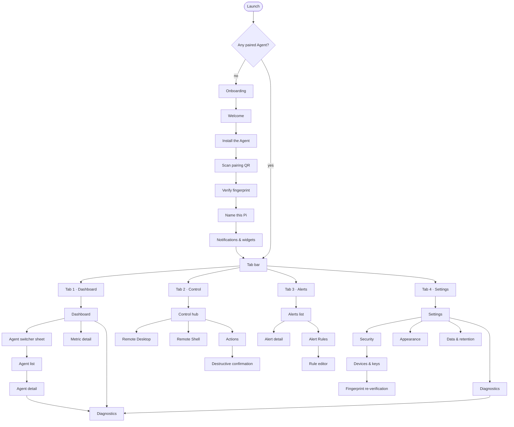
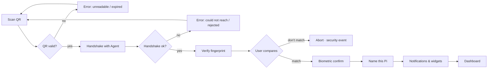

# 07 — UX Specification

Screen-by-screen definition of the Client (iOS 17+, iPhone, SwiftUI): information architecture, navigation, layout, every state, every interaction, and the exact user-facing copy.

**Read first:** [00-GLOSSARY](00-GLOSSARY.md), then [13-DESIGN-SYSTEM](13-DESIGN-SYSTEM.md). This document composes the components specified there and never redefines a colour, size or duration — it references tokens by name.

**Related:** [01-BRD](01-BRD.md) (goals this UX serves), [02-SRS](02-SRS.md) (`FR-`/`NFR-`/`UC-` this document realises), [03-ARCHITECTURE](03-ARCHITECTURE.md), [04-SECURITY-E2EE](04-SECURITY-E2EE.md) (pairing ceremony, fingerprints, revocation — §4, §12, §13 below), [05-PROTOCOL](05-PROTOCOL.md) (Channels and error codes surfaced in §16 and §19), [06-DATA-MODEL](06-DATA-MODEL.md) (Series, Rollup, retention — §7, §8), [08-WIDGETS](08-WIDGETS.md) (the widget surfaces these screens configure), [09-TEST-PLAN](09-TEST-PLAN.md), [10-ROADMAP](10-ROADMAP.md), [11-AGENT-DEPLOYMENT](11-AGENT-DEPLOYMENT.md), [12-RISK-REGISTER](12-RISK-REGISTER.md).

---

## 1. Information architecture

### 1.1 Shape of the app

Four tabs. The Dashboard is the hero and the launch destination; everything else is either a way to *act* on the Pi, a way to *be told* about it, or a way to *configure* the relationship.



### 1.2 Tabs

| # | Tab | SF Symbol | Contains | Badge |
|---|---|---|---|---|
| 1 | **Dashboard** | `gauge.with.dots.needle.bottom.50percent` | Live telemetry for the current Agent; the Agent switcher; metric detail | none |
| 2 | **Control** | `bolt.square` | Remote Desktop, Remote Shell, Actions | Shows a `accent.base` dot while a Remote Shell session is live in the background |
| 3 | **Alerts** | `bell` | Alert list, Alert detail, Alert Rules | Count of unacknowledged Alerts; `status.critical` tint if any are critical |
| 4 | **Settings** | `gearshape` | Security, Appearance, Data, Diagnostics, Devices & keys | `status.warning` dot when a key needs verification or rotation |

**Why not a tab per Agent.** The product assumes one Owner and "possibly several" Agents, and in practice a user is thinking about *one* Pi at a time. Agents are a **context selector**, not a navigation axis: the current Agent is chosen once from the switcher and every tab follows it. This keeps the tab bar semantic rather than inventory-shaped and means the same muscle memory works with one Pi or five.

### 1.3 The current-Agent rule

- The **current Agent** is app-global state, persisted across launches.
- Its name is the Dashboard's navigation title, and a compact AgentChip (24pt, name + StatusPill dot) sits in the navigation bar of **every** screen in tabs 1–3, tappable to open the switcher.
- Switching the Agent tears down the previous Tunnel (unless a Remote Shell session is pinned — see §10.6), cross-fades content over `motion.base`, and re-enters loading states honestly, because the Client genuinely holds no data for the new Agent yet.
- With exactly one paired Agent, the AgentChip is still shown (it carries status) but tapping it opens the Agent list rather than a switcher sheet.

### 1.4 Deep links and URL scheme

Scheme: `pimon://`. Universal Links are not used (there is no web property, and per README P4 there is no cloud account to resolve them against).

| URL | Destination | Notes |
|---|---|---|
| `pimon://dashboard` | Dashboard, current Agent | |
| `pimon://agent/<agentID>` | Dashboard, switching to `<agentID>` | Fails to the Agent list with an error toast if unknown |
| `pimon://agent/<agentID>/metric/<seriesKey>` | Metric detail | e.g. `.../metric/cpu.temp_c` |
| `pimon://agent/<agentID>/metric/<seriesKey>?range=6h` | Metric detail at a range | `range` ∈ `15m,1h,6h,24h,7d,30d` |
| `pimon://agent/<agentID>/shell` | Remote Shell | Requires biometric re-auth (§17.3) |
| `pimon://agent/<agentID>/desktop` | Remote Desktop | Requires biometric re-auth |
| `pimon://agent/<agentID>/actions` | Actions | |
| `pimon://alerts` | Alerts list | |
| `pimon://alert/<alertID>` | Alert detail | The target of every Alert push notification |
| `pimon://alert/<alertID>/ack` | Alerts list, having acknowledged | Used by the notification action; requires the app to be unlocked |
| `pimon://rules` | Alert Rules list | |
| `pimon://rule/<ruleID>` | Rule editor | |
| `pimon://diagnostics` | Diagnostics for the current Agent | Target of the ConnectionBanner tap and of widget taps in error states |
| `pimon://settings/security` | Settings → Security | |
| `pimon://settings/devices` | Devices & keys | Target of the "key changed" security notification |
| `pimon://pair` | Onboarding → Scan pairing QR | Also the target of a scanned QR opened from the Camera app |
| `pimon://widget/configure` | Settings → Widgets | |

**Rules.** (1) Every deep link resolves against locally held state only — no network round-trip is required to decide where to go. (2) A deep link into `shell`, `desktop` or any destructive Action always lands on the screen but never *performs* anything; the biometric gate and any confirmation still apply. (3) An unresolvable link lands on the nearest valid ancestor with an inline ErrorState rather than a dead end. (4) Links are never used to carry secrets; `<agentID>` is a local identifier, not a key.

---

## 2. Screen inventory

| # | Screen | Tab | Presentation | Purpose | Requires Tunnel |
|---|---|---|---|---|---|
| 3 | Onboarding — Welcome | — | Full screen | Set expectations | no |
| 3 | Onboarding — Install the Agent | — | Full screen | Get the daemon onto the Pi | no |
| 4 | Onboarding — Scan pairing QR | — | Full screen | Exchange connection blob + Agent static key | no |
| 4 | Onboarding — Verify fingerprint | — | Full screen | The trust decision | handshake only |
| 4 | Onboarding — Name this Pi | — | Full screen | Give the Agent a human name | no |
| 4 | Onboarding — Notifications & widgets | — | Full screen | Permissions, honestly framed | no |
| 5 | Agent list | 1 | Push | Inventory and health of all paired Agents | no (cached) |
| 5 | Agent switcher | 1–3 | Sheet, `.medium` | Change the current Agent fast | no |
| 6 | Agent detail | 1 | Push | One Agent's identity, host facts, and management | no |
| **7** | **Dashboard** | **1** | **Root** | **The hero screen: is my Pi alright, right now?** | live |
| 8 | Metric detail | 1 | Push | One Series, with history, thresholds and stats | no (history is cached) |
| 9 | Control hub | 2 | Root | Choose Remote Desktop / Remote Shell / Actions | no |
| 10 | Remote Desktop | 2 | Full-screen cover | See and drive the Pi's graphical session | live |
| 11 | Remote Shell | 2 | Full screen (push) | Interactive PTY | live |
| 12 | Actions | 2 | Push | Run allow-listed operations | live |
| 13 | Alerts list | 3 | Root | What has fired, what is still firing | no (cached) |
| 14 | Alert detail | 3 | Push | Why it fired, the data behind it, what to do | no |
| 15 | Alert Rules | 3 | Push | Manage rules | live to save |
| 15 | Rule editor | 3 | Push | Create/edit one rule | live to save |
| 16 | Settings | 4 | Root | Everything configurable | no |
| 17 | Devices & keys | 4 | Push | Paired devices, revoke, rotate | live to change |
| 18 | Diagnostics | any | Push | Connection inspector | live |

---

## 3. Onboarding — Welcome and Install

### 3.1 Purpose and entry points

**Purpose:** establish what this app is, what it will not do, and get the Agent running on the Pi. **Entry:** first launch with zero paired Agents; or Settings → Devices & keys → `Pair another Pi`.

### 3.2 Welcome

```
┌───────────────────────────────────┐
│                                   │
│                                   │
│           ▛▀▀▀▀▀▀▀▜               │  36pt server.rack glyph,
│           ▌ ▪ ▪ ▪ ▐               │  accent.base
│           ▙▄▄▄▄▄▄▄▟               │
│                                   │
│   Your Pi, from anywhere          │  type.display, text.primary
│                                   │
│   This app talks to a small       │  type.callout, text.secondary
│   program on your Raspberry Pi.   │  max 3 lines, 300pt wide
│   Only your phone and your Pi     │
│   hold the keys.                  │
│                                   │
│   ─────────────────────────────   │  border.hairline
│                                   │
│   🔒  Nothing we run can read     │  three rows,
│       your traffic.               │  16pt glyph + type.subhead
│   ⚡  No ports open on your Pi.    │
│   📍  History lives on the Pi,    │
│       not in an account.          │
│                                   │
│                                   │
│   [ Set up my Pi ]                │  primary, 50pt
│   I already have the Agent running │  tertiary
└───────────────────────────────────┘
```

**Layout:** centred column, 16pt margins, glyph optically centred at 28% height. The three claim rows restate README principles P1, P2 and P4 in the user's own terms — they are not marketing, they are the mental model the rest of the app depends on.

**States:** default only. No network is touched on this screen.

**Exit points:** `Set up my Pi` → §3.3. `I already have the Agent running` → §4.1 (skip install).

### 3.3 Install the Agent

**Purpose:** get the user from "I have a Pi" to "the Agent is running and showing a pairing QR", with no guesswork.

```
┌───────────────────────────────────┐
│ ‹ Back            Install    (1/2)│  nav bar + type.micro step counter
│                                   │
│ Run this on your Pi               │  type.title1
│                                   │
│ Open a terminal on the Pi, or SSH │  type.callout, text.secondary
│ into it, and paste this line.     │
│                                   │
│ ╭───────────────────────────────╮ │  surface.sunken, radius.s
│ │ curl -fsSL https://…/get.sh \ │ │  type.mono.body 14pt,
│ │   | sudo sh                   │ │  horizontal scroll, no wrap
│ ╰───────────────────────────────╯ │
│              [ Copy ]  [ Share ]  │  two tertiary buttons
│                                   │
│ ─────────────────────────────────  │
│                                   │
│ What this does                    │  type.micro eyebrow
│ Installs a single binary and a    │  type.subhead, text.secondary
│ systemd service. It opens no      │
│ inbound ports. Details are in     │
│ the deployment guide.             │
│ [ Read the deployment guide ]     │  tertiary → 11-AGENT-DEPLOYMENT
│                                   │
│ ─────────────────────────────────  │
│                                   │
│ When it finishes, the Pi will     │  type.callout
│ print a QR code.                  │
│                                   │
│ [ I see the QR code ]             │  primary
└───────────────────────────────────┘
```

**Components:** code block (`surface.sunken`, `radius.s`, `type.mono.body`, horizontal scroll, never wraps or truncates), two tertiary ActionButtons, an explanatory group, a primary ActionButton.

**States:**

| State | Rendering |
|---|---|
| default | As above |
| copied | The `Copy` button label becomes `Copied` for 1.6 s with a `.selection` haptic; a toast is not used (too heavy for a copy) |
| offline (no internet on the phone) | The install line is still shown and copyable — it is a static string. A `status.info` inline note appears: `You'll need internet on the Pi, not on this phone.` |

**Exit:** `I see the QR code` → §4.1. Back → §3.2.

---

## 4. Onboarding — Pairing

This is the ceremony that establishes trust ([04-SECURITY-E2EE](04-SECURITY-E2EE.md); README P3). It is the only place in the product where a wrong tap has permanent security consequences, so it is deliberately the slowest flow in the app.



### 4.1 Scan pairing QR

**Purpose:** ingest the Agent's connection blob and static public key out of band.

```
┌───────────────────────────────────┐
│ ‹ Back            Pair       (2/2)│
│                                   │
│   ┌───────────────────────────┐   │
│   │                           │   │  live camera, radius.l,
│   │      ╔═══════════╗        │   │  aspect 1:1, inset 16pt
│   │      ║  ▄▄ ▄  ▄▄ ║        │   │
│   │      ║  █▄▀▄▀▄█  ║        │   │  reticle: 4 corner marks,
│   │      ║  ▀▀ ▀  ▀▀ ║        │   │  2pt accent.base, 28pt arms
│   │      ╚═══════════╝        │   │
│   │                           │   │
│   └───────────────────────────┘   │
│                                   │
│   Point the camera at the QR      │  type.callout, centred
│   code on your Pi's screen.       │
│                                   │
│   ─────────────────────────────   │
│   [ Enter the code by hand ]      │  tertiary
└───────────────────────────────────┘
```

**Interactions:** the reticle corners animate inward once on detection (`motion.fast`), a `.selection` haptic fires, and the camera freezes on the decoded frame while the handshake runs. Torch toggle appears in the nav bar in low light.

**States:**

| State | Rendering |
|---|---|
| default | Live camera + reticle |
| camera permission denied | Camera area replaced by an EmptyState: `Camera access is off` + body + a `Open Settings` primary button. The manual-entry route remains. |
| detected, handshaking | Frozen frame at 60% opacity, a centred ConnectionBanner-style 2pt rail showing the four handshake milestones, `type.callout` under it: `Reaching your Pi…` |
| QR unreadable | Inline ErrorState above the tertiary button; camera stays live |
| QR expired | Inline ErrorState with copy from §20; camera stays live |
| handshake failed | Full ErrorState replacing the camera, with the protocol code chip and a `Scan again` primary |
| manual entry | Sheet with a `type.mono.body` field accepting the same payload in grouped base32, 8 groups of 5, auto-advancing |

**Exit:** success → §4.2. Manual entry → same. Back → §3.3.

### 4.2 Verify the fingerprint

**Purpose:** the trust decision. Uses `FingerprintVerificationView` ([13-DESIGN-SYSTEM](13-DESIGN-SYSTEM.md) §7.12) verbatim.

**The explanation copy — this is the exact wording,** written for someone who has never heard the word "fingerprint" used this way:

> **Check that this is really your Pi**
>
> Below is a short code made from your Pi's own identity key. Your Pi is showing the same code on its screen right now.
>
> If the two codes match, nothing is sitting in the middle of this connection, and this phone and this Pi can talk privately from now on.
>
> If they don't match, stop. Someone or something else answered instead of your Pi. Tap "They don't match" and we'll cancel the setup.
>
> You only have to do this once.

**Layout:** the hex block first (20pt SF Mono, grouped in 4s, on `surface.sunken`), then the six-word sequence (20pt `type.title3`), then the explanation, then the two buttons. The word sequence exists because reading six words aloud to someone at the Pi is far more reliable than reading 32 hex characters, and the screen states this: *"Easier to compare out loud: **anchor · velvet · piston · marina · cobalt · thistle**"*.

**States:**

| State | Rendering |
|---|---|
| default | As above |
| loading | Skeleton at the exact hex/word geometry. **No partial fingerprint is ever shown.** |
| error | ErrorState; pairing aborts; no trust record written |
| confirming | `They match` enters loading; biometric prompt appears (`Face ID` / `Touch ID` / passcode). **The trust record is written only after the biometric succeeds.** |
| biometric unavailable | Falls back to the device passcode; if that is also unset, an inline `status.warning` note explains that a device passcode is required to store keys, with a Settings link. Pairing cannot complete without it. |
| rejected | Full-screen `status.critical` explainer (copy in §20), a single `Start over` button, and a written record in Diagnostics ([04-SECURITY-E2EE](04-SECURITY-E2EE.md)) |

**Exit:** match + biometric → §4.3. Mismatch → abort.

### 4.3 Name this Pi

```
┌───────────────────────────────────┐
│                     Name          │
│                                   │
│ ● VERIFIED · direct · 28ms        │  StatusPill, large
│                                   │
│ What should we call it?           │  type.title1
│                                   │
│ ╭───────────────────────────────╮ │  text field, radius.s,
│ │ pi5-livingroom              ⌫ │ │  border.strong, type.body,
│ ╰───────────────────────────────╯ │  prefilled with the hostname
│ Its hostname is pi5-livingroom.   │  type.footnote, text.tertiary
│                                   │
│ ─────────────────────────────────  │
│ Raspberry Pi 5 · 8 GB             │  type.micro eyebrow rows,
│ Raspberry Pi OS Trixie (64-bit)   │  facts read from the Agent
│ Agent 1.0.0 · up 3 minutes        │
│ ─────────────────────────────────  │
│                                   │
│ [ Continue ]                      │  primary
└───────────────────────────────────┘
```

The host facts are shown here for one reason: they are the user's second confirmation that they paired with the machine they meant to. **States:** default; empty name (Continue disabled, with the reason `A name helps when you have more than one Pi.`); duplicate name (inline `status.warning`, allowed but flagged).

### 4.4 Notifications & widgets

Two permission asks, each explained in terms of what breaks without it. Never a bare system prompt.

```
┌───────────────────────────────────┐
│                     Almost done   │
│ Get told when something's wrong   │  type.title1
│                                   │
│ ╭───────────────────────────────╮ │  card, surface.raised
│ │ 🔔 Alerts                     │ │
│ │ Your Pi decides when to warn  │ │
│ │ you. The notification travels │ │
│ │ empty — the text is put       │ │
│ │ together on this phone.       │ │
│ │              [ Turn on ]      │ │  secondary
│ ╰───────────────────────────────╯ │
│                                   │
│ ╭───────────────────────────────╮ │
│ │ 🧩 Widgets                    │ │
│ │ Put temperature and load on   │ │
│ │ your Home or Lock Screen.     │ │
│ │ They update a few times an    │ │
│ │ hour and always show how old  │ │
│ │ the numbers are.              │ │
│ │              [ How to add ]   │ │  tertiary
│ ╰───────────────────────────────╯ │
│                                   │
│ [ Done ]                          │  primary
│ Skip for now                      │  tertiary
└───────────────────────────────────┘
```

The notification copy states the E2EE property plainly ("the notification travels empty") because it is both true (README P1) and the single most reassuring fact about push in this product. The widget copy pre-empts the staleness contract in [08-WIDGETS](08-WIDGETS.md) so a user is never surprised by a five-minute-old number.

**Exit:** → Dashboard, which enters its first-run state (§21).

---

## 5. Agent list and Agent switcher

### 5.1 Agent list

**Purpose:** inventory and comparative health. **Entry:** Dashboard nav bar AgentChip → `See all`; Settings → Devices & keys.

```
┌───────────────────────────────────┐
│ ‹ Dashboard      Pis        + ⋯   │
│                                   │
│ ╭───────────────────────────────╮ │
│ │ ● ONLINE · direct · 34ms  🔒 ›│ │  AgentCard
│ │ pi5-livingroom                │ │
│ │ CPU 12%  SOC 54°C  MEM 38%    │ │
│ ╰───────────────────────────────╯ │
│ ╭───────────────────────────────╮ │
│ │ ● RELAYED · 128ms         🔒 ›│ │
│ │ pi4-garage                    │ │
│ │ CPU 3%   SOC 41°C  MEM 22%    │ │
│ ╰───────────────────────────────╯ │
│ ╭───────────────────────────────╮ │
│ │ ● OFFLINE · last seen 09:12 ›│ │
│ │ pi4-shed                      │ │
│ │ CPU 8%·2h  SOC 39°C·2h        │ │  dimmed, age-stamped
│ ╰───────────────────────────────╯ │
└───────────────────────────────────┘
```

**Layout:** 16pt margins, 12pt between cards, cards sorted by *severity then name* — critical, warning, unknown, offline, relayed, ok. A Pi with a problem is always at the top; the sort does not shuffle on every RTT change (severity buckets only).

**States:** loading (3 skeleton AgentCards) · default · empty (`EmptyState`: no Agents paired, with a `Pair a Pi` primary) · partial (some Agents cached-only) · error (per-card, never whole-list) · offline (all cards in their offline state, plus a single `status.offline` inline banner at the top: `Your phone is offline. Showing last known values.`).

**Interactions:** tap a card → make current + go to Dashboard. Long-press → context menu (`Make current`, `Rename`, `Diagnostics`, `Unpair` destructive). Swipe trailing → `Unpair` (destructive; §17.2 confirmation). Pull to refresh → attempts a Tunnel to every Agent in parallel with a 6 s budget.

### 5.2 Agent switcher

A `.medium`-detent sheet from the AgentChip. Same AgentCards at `compact` density (72pt), the current one `selected`, plus a footer row `See all Pis ›`. Tapping switches and dismisses. This exists so switching costs one tap from any screen in tabs 1–3.

---

## 6. Agent detail

**Purpose:** identity and management of one Agent — the facts that do not change minute to minute. **Entry:** Agent list disclosure; Dashboard `⋯` → `About this Pi`.

Sections: **Identity** (name, hostname, Agent version, OS, model, RAM, serial-derived ID) · **Trust** (fingerprint summary with a `Re-verify` row, pairing date, last key rotation, a `Rotate keys` row) · **Connection** (current path, RTT, transport, `Diagnostics ›`) · **Storage** (retention settings summary → §16.4) · **Danger zone** (`Unpair this Pi`, destructive).

Every row that reaches the Agent shows an inline `status.offline` chip instead of a value when the Tunnel is down, never a spinner that never resolves.

---

## 7. Dashboard — the hero screen

### 7.1 Purpose

Answer, in under half a second and without a tap: **is my Pi alright, and can I reach it right now?** Everything else on the screen is secondary to those two questions.

**Entry points:** app launch; tab 1; `pimon://dashboard`; widget tap; Agent switcher.

### 7.2 Layout

```
┌─────────────────────────────────────────┐
│  pi5-livingroom ⌄                    ⋯  │ ← nav: AgentChip (title) + menu
│  ⚡ DIRECT · 34ms · 🔒 verified       ● │ ← ConnectionBanner, 20pt
├─────────────────────────────────────────┤
│  15m │ 1h │ 6h │ 24h │ 7d │ 30d          │ ← time-range chips, one row,
│  1-minute averages                       │   + resolution note
│                                          │
│  ╭─────────────────╮ ╭─────────────────╮ │
│  │ CPU          ⌃  │ │ SOC TEMP     🌡 │ │ ← StatTile ×2, 172.5×120
│  │                 │ │                 │ │
│  │ 12.4 %          │ │ 54.2 °C         │ │
│  │ ▁▂▃▂▁▂▄▃▂▁▂▃    │ │ ▂▂▃▃▄▄▅▄▄▃▃▂    │ │
│  ╰─────────────────╯ ╰─────────────────╯ │
│  ╭─────────────────╮ ╭─────────────────╮ │
│  │ MEMORY       ▤  │ │ DISK  /      ▥  │ │
│  │ 38 %            │ │      ╭────╮     │ │ ← GaugeRing variant
│  │ 3.0 / 8.0 GB    │ │      │38 %│     │ │
│  │ ▃▃▃▄▃▃▃▃▄▄▃▃    │ │      ╰────╯     │ │
│  ╰─────────────────╯ ╰─────────────────╯ │
│  ╭─────────────────────────────────────╮ │
│  │ NETWORK                         ⇅   │ │ ← wide tile, 2-col span
│  │ ↓ 1.2 MB/s        ↑ 84 KB/s         │ │
│  │ ▁▂▅▃▂▁▁▂▃▂▁▂▄▃▂▁▂▃▄▃▂▁▂▃▁▂▃▄▂▁      │ │ ← mirrored sparkline
│  ╰─────────────────────────────────────╯ │
│                                          │
│  QUICK ACTIONS                           │ ← type.micro eyebrow
│  ╭──────╮ ╭──────╮ ╭──────╮ ╭──────╮     │
│  │ 🖥   │ │ ⌨    │ │ ↻    │ │ ⚡   │     │ ← 4 × 72pt buttons
│  │Desktop│ │Shell │ │Restart│ │Actions│    │
│  ╰──────╯ ╰──────╯ ╰──────╯ ╰──────╯     │
│                                          │
│  ACTIVE ALERTS  (2)                      │
│  ┃▲ CRITICAL  SOC temp above 80 °C   2m │ │ ← AlertRow ×≤3
│  ┃▲ WARNING   Disk / above 85 %     14m │ │
│  See all alerts ›                        │
│                                          │
│  ╭─────────────────────────────────────╮ │
│  │ SOC TEMPERATURE            ⌄6h  ⋯   │ │ ← MetricChart, 240pt
│  │ 54.2 °C  now                        │ │
│  │ …plot with 80/85 °C thresholds…     │ │
│  ╰─────────────────────────────────────╯ │
└─────────────────────────────────────────┘
```

**Composition rationale.** The vertical order is *connection → the four numbers that matter → what I can do → what is wrong → why*. A user who is worried reads the top two rows and stops. A user who is investigating scrolls. The one chart on the Dashboard is temperature, because it is the metric with a hard hardware threshold and the one most likely to explain everything else; every other metric gets a chart in its own detail screen. There is deliberately **no** all-metrics chart wall here — that is what Metric detail is for, and a wall of six charts is unreadable at a glance.

The time-range chip row scopes **every tile, sparkline and chart below it** (one filter row, above the content it scopes — never per-card). Changing it re-renders everything against the same slice so the numbers always agree.

### 7.3 Components used

ConnectionBanner · time-range chips · StatTile ×4 (one with GaugeRing) · Sparkline ×5 · wide StatTile · quick-action buttons · AlertRow ×≤3 · MetricChart · AgentChip · EmptyState / ErrorState / SkeletonLoader as required.

### 7.4 States

| State | Rendering |
|---|---|
| **loading (cold, first ever)** | Full skeleton at exact final geometry: banner shows `CONNECTING` with the milestone rail; tiles are SkeletonLoaders; quick actions are visible but disabled with the reason `Waiting for a connection`; chart is a skeleton with gridlines already drawn |
| **loading (warm, cached)** | Cached values render **immediately** at `text.secondary` with age stamps; the banner shows `CONNECTING`. Values promote to `text.primary` and drop their age stamps as fresh Snapshots land. The Client never shows a blank screen for data it holds. |
| **default (live)** | As drawn. The liveness dot pulses once per Snapshot. |
| **partial** | Some Series present, some absent: absent tiles show `—` and a hatched sparkline; the chart shows hatched gaps. No tile is hidden — a missing metric is information. |
| **error (Tunnel established, telemetry channel failed)** | Banner stays green-path; a full-width inline ErrorState replaces the tile grid with the protocol code and a Retry; quick actions remain enabled (the `control` Channel is fine) |
| **offline (Agent unreachable)** | Banner `OFFLINE · last seen 14:22`; every value dims to `text.secondary` with an age stamp; every sparkline gains a trailing hatched gap running to the right edge; quick actions requiring a Tunnel are disabled with the reason `pi5-livingroom is offline`; the chart renders cached history with the trailing gap; a single `Retry now` secondary button sits under the banner showing the backoff countdown |
| **offline (phone has no network)** | As above, but the banner reads `NO NETWORK` in `status.offline` and the reason strings say `This phone is offline` — the distinction matters and the user must not be left blaming the Pi |
| **degraded — relayed path** | Banner in `status.info`: `RELAYED · 128ms · 🔒 verified`. Nothing else changes. Relaying is slower, not broken, and must not be dressed as a fault. |
| **degraded — backfilling** | Banner appends `· backfilling`; charts show `PENDING` hatch over the affected span, which fills in as data arrives with a VoiceOver announcement |
| **degraded — stale Snapshot** | If the newest Snapshot is older than 3× the telemetry interval while the Tunnel is up, values dim and each gains a `status.warning` age stamp; the banner appends `· data delayed` |
| **unverified key** | The `status.warning` ConnectionBanner variant takes the top of the screen and the quick actions for Shell and Desktop are disabled with the reason `Verify this Pi first` |
| **key mismatch** | The 44pt `status.critical` banner; **the tile grid is dimmed to 40% and made non-interactive**; the only enabled control is `Review ›`. This is the one screen state in the product that blocks the user, and it does so because entering a password into a possibly-impersonated Pi is unrecoverable |
| **first run / empty** | §21 |

### 7.5 Interactions

| Gesture | Result |
|---|---|
| Tap a StatTile | Push Metric detail for that Series, inheriting the current range |
| Long-press a StatTile | Context menu: `Add alert rule…`, `Show as table`, `Pin to widget`, `Copy value` |
| Tap the ConnectionBanner | Push Diagnostics |
| Tap the AgentChip / title | Agent switcher sheet |
| Tap a time-range chip | Re-scope everything below; previous renders held at 60% while loading |
| Scrub the chart | §8.3 |
| Tap a quick action | Desktop / Shell / Actions; `Restart` is destructive and follows §17.1 |
| Tap an AlertRow | Alert detail |
| Pull to refresh | §17.5 |
| `⋯` menu | `About this Pi`, `Diagnostics`, `Choose tiles…`, `Show as table`, `Export range as CSV` |

### 7.6 Exit points

Metric detail · Diagnostics · Agent switcher · Alert detail · Alerts list · Remote Desktop · Remote Shell · Actions · Agent detail · destructive confirmation sheet.

---

## 8. Metric detail

**Purpose:** one Series, with real history, thresholds, statistics and the rules attached to it. **Entry:** StatTile tap; deep link; Alert detail → `See the data`.

```
┌─────────────────────────────────────────┐
│ ‹ pi5-livingroom   SoC temperature   ⋯  │
│ ⚡ DIRECT · 34ms · 🔒 verified        ● │
├─────────────────────────────────────────┤
│ 15m│ 1h │ 6h │24h│ 7d│30d│ Custom…      │
│ 1-minute averages · 2 gaps · 14 min      │
│                                          │
│      54.2 °C                             │ ← type.hero 44pt SF Mono
│      now · ↑ 2.1 since 12:00             │ ← type.caption
│                                          │
│ ╭──────────────────────────────────────╮ │
│ │ 100┤                                 │ │
│ │    ┤                     ╭─╮         │ │
│ │  85┼─ ─ ─ ─ ─ ─ ─ ─ ─ ─ ─┼─┼─ hard   │ │
│ │  80┼─ ─ ─ ─ ─ ─ ─ ─ ─ ─ ─┼─┼─ soft   │ │
│ │    ┤      ╭──╮  ▓▓▓▓  ╭──╯ ╰──╮      │ │
│ │  40┤──────╯  ╰──▓▓▓▓──╯      ╰────   │ │
│ │    └──┬────┬────┬────┬────┬────      │ │
│ │     12:00 13:00 14:00 15:00 16:00    │ │
│ ╰──────────────────────────────────────╯ │
│  ▨ 45° pending backfill   ▨ 135° no data │ ← gap legend, only when gaps exist
│                                          │
│  MIN     AVG     MAX     p95             │ ← stats strip, type.micro +
│  41.2    52.8    83.4    71.0            │   type.metric.m tabular
│  excludes 14 min of gaps                 │ ← type.footnote
│                                          │
│  ALERT RULES ON THIS METRIC              │
│  ┃ ▲ Above 80 °C for 90s      Critical › │
│  ┃ ▲ Above 70 °C for 5m       Warning  › │
│  + Add a rule                            │
│                                          │
│  THROTTLE EVENTS                         │ ← event strip, temperature only
│  ▁▁▁▁▁▁▁▁▁▁▓▓▓▁▁▁▁▁▁▁▁▁▁▁▁▁▁▁▁          │
│  1 soft-throttle window · 14:52–14:58    │
└─────────────────────────────────────────┘
```

### 8.1 Layout notes

- The **hero figure** (44pt SF Mono, tabular) is the current value; there is exactly one hero per screen.
- The delta beside it is signed, carries an arrow glyph so the sign is not colour-only, and names its comparison period explicitly (`since 12:00`) — never a bare `+2.1`.
- The **stats strip** is a four-column tabular row, and it states its own exclusions when the range contains gaps. An average that silently ignores 14 missing minutes is a lie the user will act on.
- Thresholds are drawn per [13-DESIGN-SYSTEM](13-DESIGN-SYSTEM.md) §8.7; for temperature the 80/85 °C hardware thresholds are always drawn whether or not a rule exists.
- The **gap legend** appears only when the visible range contains a gap.

### 8.2 States

loading (skeleton with gridlines pre-drawn) · warm-load (cached chart at 60% while refetching) · default · **partial** (gaps hatched + counted in the range note) · empty (`No samples in this range` + `Widen range` action) · error (ErrorState in the plot; range chips stay live) · offline (cached history + trailing gap + `status.offline` pill in the header) · degraded-relay (renders normally; the banner carries the path).

### 8.3 Scrub interaction

Long-press 0.25 s then drag, or immediate drag. A 1pt crosshair snaps to the nearest sample; the **hero figure and its caption are replaced** by the scrubbed timestamp and value (so nothing floats over the plot under the finger); an 8pt ringed dot marks the sample; `.selection` haptic per snap, ≤ 20 Hz. Release restores "now" over `motion.fast`. Scrubbing **pauses live tail** and shows the `PAUSED · resume ›` chip. Full Keyboard Access: ←/→ one sample, ⇧←/⇧→ ten samples, with spoken readout.

### 8.4 Exit points

Rule editor (tap a rule, or `Add a rule`) · Alerts list · `⋯` → `Show as table`, `Export CSV`, `Add to widget…`, `Compare with…` (opens a second Series on the same axis **only if the units match**; if they do not, it opens a second stacked chart with a shared x-axis and shared scrub — never a second y-axis).

---

## 9. Control hub

**Purpose:** the three ways to act on the Pi, with their preconditions visible before the user commits.

```
┌─────────────────────────────────────────┐
│  pi5-livingroom ⌄            Control    │
│  ⚡ DIRECT · 34ms · 🔒 verified       ● │
├─────────────────────────────────────────┤
│ ╭─────────────────────────────────────╮ │
│ │ 🖥  Remote Desktop                › │ │  88pt rows
│ │    Wayland session on HDMI-1        │ │
│ │    ● READY · est. 4.2 Mb/s          │ │
│ ╰─────────────────────────────────────╯ │
│ ╭─────────────────────────────────────╮ │
│ │ ⌨  Remote Shell                   › │ │
│ │    /bin/bash as pi                  │ │
│ │    ● 1 SESSION RUNNING · 12m        │ │
│ ╰─────────────────────────────────────╯ │
│ ╭─────────────────────────────────────╮ │
│ │ ⚡  Actions                        › │ │
│ │    6 allowed · 2 need confirmation  │ │
│ ╰─────────────────────────────────────╯ │
│                                          │
│  Both Remote Desktop and Remote Shell   │  type.footnote, text.tertiary
│  ask for Face ID before they open.      │
└─────────────────────────────────────────┘
```

Each row states its precondition and its cost up front (estimated bitrate; whether a session already exists; how many Actions will ask for confirmation). **States:** default · offline (all three rows disabled, each with the reason `pi5-livingroom is offline`) · degraded (`Remote Desktop` row carries a `status.info` note: `Relayed connection — video will start at 480p`) · unverified (Desktop and Shell disabled with `Verify this Pi first ›`) · error per row.

---

## 10. Remote Desktop

**Purpose:** see and drive the Pi's graphical session. **Entry:** Control hub; Dashboard quick action; deep link. **Presentation:** full-screen cover, home indicator dimmed, status bar hidden after 3 s of no interaction.

### 10.1 Layout

Uses `DesktopViewport` ([13-DESIGN-SYSTEM](13-DESIGN-SYSTEM.md) §7.9). Content is aspect-fit on `surface.letterbox`; the floating overlay pill carries the controls.

```
Portrait (default)                     Landscape (rotated)
┌──────────────────┐                   ┌────────────────────────────────┐
│ ✕  pi5   ⚙ 4.2Mb │ ← 44pt top bar    │▓▓▓▓▓▓▓▓▓▓▓▓▓▓▓▓▓▓▓▓▓▓▓▓▓▓▓▓▓▓▓▓│
│▓▓▓▓▓▓▓▓▓▓▓▓▓▓▓▓▓▓│                   │┌──────────────────────────────┐│
│┌────────────────┐│                   ││                              ││
││                ││                   ││     live framebuffer         ││
││   framebuffer  ││                   ││     (fills the screen)       ││
││   letterboxed  ││                   ││                              ││
││                ││                   │└──────────────────────────────┘│
│└────────────────┘│                   │▓▓▓▓▓▓▓▓▓▓▓▓▓▓▓▓▓▓▓▓▓▓▓▓▓▓▓▓▓▓▓▓│
│▓▓▓▓▓▓▓▓▓▓▓▓▓▓▓▓▓▓│                   │   ╭────────────────────────╮   │
│                  │                   │   │⌨ ⌘⌃⌥⇧ ⇥⎋│▣ptr│◐4.2Mb│   │
│ ╭──────────────╮ │                   │   ╰────────────────────────╯   │
│ │⌨ ⌘⌃⌥⇧ ⇥⎋ ▣ ◐│ │ ← overlay pill    └────────────────────────────────┘
│ ╰──────────────╯ │
└──────────────────┘
```

### 10.2 Orientation handling

| Situation | Behaviour |
|---|---|
| App opens the viewport | Whatever orientation the device is in; the viewport supports all four |
| Pi's session is landscape (the normal case), phone is portrait | Aspect-fit with top/bottom letterbox; a one-time `status.info` chip suggests `Rotate for a bigger picture`, dismissible and never shown again for that Agent |
| Device rotates | The framebuffer re-fits over `motion.base`; **zoom and pan are preserved in normalised coordinates**, so rotating does not lose the user's place |
| Orientation lock is on | Respected; the suggestion chip changes to `Orientation lock is on` and offers nothing further |
| Pi's session resolution changes | The viewport re-fits; a `status.info` toast states the new resolution. The Client **never** asks the Pi to change resolution implicitly. |
| Explicit resolution change | `⚙` → `Match my screen` offers to set the Pi's output to the phone's aspect ratio; it is a real change to the Pi and is confirmed once, with an `Undo` in the toast for 10 s |

### 10.3 Gesture-to-input mapping

Three pointer modes. The mode selector lives in the overlay; the mapping table is shown in `⚙` → `How gestures work` and is reproduced here in full.

| Gesture | `trackpad` (default, relative) | `direct` (absolute) | `pen` (Apple Pencil) |
|---|---|---|---|
| One-finger drag | Move pointer relatively, with pointer acceleration | Move pointer to the touched point, no click | Move pointer to the pencil tip |
| One-finger tap | Left click at the current pointer position | Left click at the tapped point | — |
| Pencil tap | — | — | Left click at the tip |
| Two-finger tap | Right click | Right click at the touch centroid | — |
| Pencil barrel-button tap | — | — | Right click |
| Three-finger tap | Middle click | Middle click | — |
| One-finger double-tap | Double click | Double click | Double click |
| One-finger tap-and-hold (0.4 s) then drag | Press-and-drag (button held) | Press-and-drag from the touched point | Press-and-drag |
| Two-finger drag (vertical) | Scroll wheel, natural direction, momentum preserved | Same | Same |
| Two-finger drag (horizontal) | Horizontal scroll | Same | Same |
| Pinch | **Client-side zoom of the viewport** (1.0×–4.0×) — *not* forwarded to the Pi | Same | Same |
| Two-finger rotate | Ignored | Ignored | Ignored |
| Three-finger swipe up | Show/hide the overlay | Same | Same |
| Three-finger swipe down | Summon the keyboard | Same | Same |
| Four-finger swipe left/right | Previous / next Pi workspace (`super`+arrow injection) | Same | Same |
| Edge swipe from the left | iOS back/dismiss (**never** forwarded) | Same | Same |
| Long-press on the overlay's drag handle | Move the overlay to the other end of the screen | Same | Same |

**Rules.** (1) Client-side gestures (pinch-zoom, overlay, dismiss) are always resolved *before* injection, and the list of them is fixed and short so the user can learn it. (2) Pointer acceleration in `trackpad` mode is a user setting (Off / Low / Normal / High, default Normal). (3) In `direct` mode a **1:1 hit indicator** — a 20pt `accent.base` ring — flashes for 150 ms at every injected click, because absolute clicking with a finger over a 1080p desktop is otherwise unverifiable. (4) Injection is throttled to the negotiated input rate and coalesced; the Client never queues an unbounded backlog of pointer moves. (5) No gesture injects a destructive keystroke implicitly.

### 10.4 On-screen modifier keys and keyboard

- The overlay carries **⌘ ⌃ ⌥ ⇧** as **latching toggles** (tap to latch for the next key, double-tap to lock until untapped, indicated by a filled `accent.wash` background and a 2pt underline when locked), plus momentary **⇥** and **⎋**.
- Tapping `⌨` summons the software keyboard; the framebuffer shifts up and re-fits rather than being covered.
- With the keyboard up, an accessory bar appears carrying **⎋ ⇥ ⌃ ⌥ ⌘ ← ↓ ↑ → ⏎** and a `⋯` for F1–F12, Home/End, PgUp/PgDn, Ins/Del.
- A hardware keyboard, when attached, captures **all** keys including ⌘-combinations, with exactly one exception: **⌘⇧Q returns to the app** (shown in a one-time chip on first hardware-keyboard use).
- Key repeat is generated on the Pi, not the phone; the Client sends discrete down/up events so a dropped packet cannot produce a runaway repeat.

### 10.5 Quality and bitrate control

`⚙` opens a `.medium` sheet:

| Control | Options | Default |
|---|---|---|
| Quality | `Auto` · `Sharp (1080p)` · `Balanced (720p)` · `Save data (480p)` | Auto |
| Frame rate cap | `60` · `30` · `15` · `10` fps | 30 |
| Bitrate ceiling | slider 0.5–12 Mb/s, `type.metric.m` tabular readout | 4 Mb/s |
| Colour | `Full` · `Reduced (4:2:0)` | Reduced |
| On cellular | `Same as Wi-Fi` · `Save data` · `Ask` | Save data |
| Show bitrate | on/off | on |

**Auto** adapts, and when it does it **says so**: a 2 s `status.info` chip reads `Dropped to 480p — connection is tight`. Quality never changes silently; a user who cannot read a terminal font at 480p must know why. The live readout in the overlay shows the *actual* current bitrate and fps, tabular, updating at 1 Hz.

### 10.6 States

| State | Rendering |
|---|---|
| negotiating | Letterbox + skeleton at the target aspect + `Negotiating video…` + the four-milestone rail |
| live | Frames; overlay auto-hides after 4 s |
| **stalled** | Last frame at 45% opacity + `status.warning` top strip `Video stalled · 3s`, counting real seconds. No blur, no fake motion. Input is still accepted and queued for 5 s, after which input is dropped and the strip says so: `Input paused` |
| reconnecting | As stalled, strip becomes `status.info`: `Reconnecting · attempt 2 · next try in 4s`. **The last frame is retained** — clearing it would lose the user's context for no benefit. |
| reconnected | Strip flashes `status.ok` `Reconnected` for 1.2 s, then clears; a `.success` haptic |
| degraded-relay | Persistent `status.info` chip in the overlay: `RELAYED · 480p · 12fps` |
| error | ErrorState over the letterbox with the protocol code; overlay reduced to `✕` |
| session ended by the Pi | Last frame at 30% + centred `The Pi ended this session.` + `Reconnect` primary |
| backgrounded | Video pauses immediately, input channel closes, a Live Activity is **not** started (see [08-WIDGETS](08-WIDGETS.md) — only long-running Actions get one). On return, negotiation restarts from the retained last frame. |

**Exit points:** `✕` (with a confirmation only if input was sent in the last 10 s: `Leave the desktop? The session on the Pi keeps running.`) · edge-swipe back · Control hub.

---

## 11. Remote Shell

**Purpose:** an interactive PTY on the Pi ([00-GLOSSARY](00-GLOSSARY.md): *not* SSH-over-the-wire; see ADR-0006). **Entry:** Control hub; Dashboard quick action; deep link. Requires biometric re-auth.

### 11.1 Layout

```
┌─────────────────────────────────────────┐
│ ‹  pi5-livingroom · bash        Aa  ⋯   │ ← nav: font size + menu
│ ⚡ DIRECT · 34ms · 🔒 verified        ● │
├─────────────────────────────────────────┤
│ pi@pi5-livingroom:~ $ vcgencmd measure_t│
│ temp=54.2'C                             │
│ pi@pi5-livingroom:~ $ htop              │  TerminalSurface,
│   1  [||||||        12.4%]              │  surface.sunken,
│   2  [|||           6.1%]               │  SF Mono 13pt
│   3  [||            3.0%]               │
│   4  [|             1.2%]               │
│  Mem[|||||||||    3.0G/8.0G]            │
│                                         │
│ █                                       │ ← cursor, accent.base
├─────────────────────────────────────────┤
│ ⎋ │ ⇥ │ ⌃ │ ⌥ │ ← │ ↓ │ ↑ │ → │ ⌘ │ ⋯  │ ← accessory bar, 44pt
└─────────────────────────────────────────┘
```

### 11.2 Keyboard accessory bar

Always present when the keyboard is up; also present when a hardware keyboard is attached (the modifier states are still useful). Keys are 44×36pt visual / 44×44pt target, `surface.raised2`, `radius.s`, `border.subtle`, `type.mono.body` 14pt, 6pt gaps, horizontally scrollable.

| Key | Behaviour |
|---|---|
| **⎋** | Momentary Escape |
| **⇥** | Momentary Tab (completion) |
| **⌃** | Latching. Tap → next key is Ctrl-modified. Double-tap → locks. `⌃`+`C`, `⌃`+`D`, `⌃`+`Z` are the three most-used and get a long-press shortcut menu on the ⌃ key itself. |
| **⌥** | Latching Alt/Meta |
| **⌘** | Latching; mapped to Super by default, configurable |
| **← ↓ ↑ →** | Momentary arrows; **long-press repeats** at 20 Hz after a 400 ms delay |
| **⋯** | Sheet: F1–F12, Home/End, PgUp/PgDn, Del, `|`, `~`, `/`, `-`, `_`, and a `Paste` row |

A latched modifier shows `accent.wash` fill; a locked one adds a 2pt `accent.base` underline. Latches clear after one key press (latched) or on a second tap (locked). The current latch state is also announced to VoiceOver as a toggle.

### 11.3 Font size, paste, and selection

- **Font size** (`Aa` in the nav bar): a stepper sheet, 9–20pt, live-previewing. Changing it resizes the PTY (`SIGWINCH` over the `shell` Channel) and the new `cols × rows` is shown for 1.2 s in a `status.info` chip (`96 × 30`). Persisted per Agent.
- **Paste**: from the `⋯` sheet, from the system paste menu on long-press, or from a hardware ⌘V. **Multi-line paste is guarded**: pasting text containing a newline shows a confirmation sheet listing the line count and the first three lines, with `Paste 14 lines` / `Paste as one line` / `Cancel`. This prevents the classic accident of pasting a script into a shell that executes each line as it arrives. Bracketed paste is used when the remote program advertises it.
- **Selection**: long-press + drag with a magnifier; `Copy`, `Share`, `Select block` (rectangular selection for column output).
- **Search**: `⋯` → `Find in output`, with match highlighting in `accent.wash` and a hit counter.

### 11.4 Session persistence

| Situation | Behaviour |
|---|---|
| Navigating away within the app | The session **stays open**. The Control tab shows an `accent.base` dot; the Control hub row reads `1 SESSION RUNNING · 12m`. |
| App backgrounded | The session stays open for a grace period (default **5 minutes**, Settings-configurable 0/1/5/15 min / until disconnected). During the grace period the Tunnel is kept alive if iOS permits; if iOS suspends the app, the Agent holds the PTY. |
| Grace period expires | The Agent terminates the PTY. On return the Client shows the retained scrollback dimmed with `Session ended while the app was closed.` and a `Start new session` button. |
| Tunnel drops mid-session | The scrollback is retained and dimmed to 60%; a bottom strip reads `Shell disconnected · E-0530 · Reconnecting…`. If the Tunnel returns within the grace period **the same PTY is re-attached** and the strip flashes `Reattached`. Otherwise a new session is offered. |
| Explicit exit (`exit`, ⌃D) | The buffer is retained and dimmed; the accessory bar becomes a single `Start new session` button. |
| **Never** | The scrollback buffer is **never cleared** by an error, a disconnection, or a backgrounding. Only an explicit `Clear` from the `⋯` menu, or starting a new session, clears it. |

### 11.5 States

loading (`opening shell…`, no spinner) · live · disconnected (retained + dimmed + strip) · reattached · ended · error · offline (entry disabled from Control hub) · **degraded-relay** (renders identically; a one-time `status.info` chip notes `Relayed — expect ~130 ms of lag`, because typing lag on a relayed path is the single most confusing thing about this feature).

---

## 12. Actions

**Purpose:** run allow-listed operations ([00-GLOSSARY](00-GLOSSARY.md): named, allow-listed; arbitrary commands are Remote Shell's job, never an Action).

```
┌─────────────────────────────────────────┐
│ ‹ Control          Actions          ⋯   │
│ ⚡ DIRECT · 34ms · 🔒 verified        ● │
├─────────────────────────────────────────┤
│ These are the only operations this Pi    │ type.footnote, text.secondary
│ will accept. The list is set on the Pi.  │
│                                          │
│ SERVICES                                 │
│ ╭─────────────────────────────────────╮ │
│ │ ↻ Restart Home Assistant          › │ │ 60pt rows
│ │   systemctl restart home-assistant  │ │ ← type.mono.body 13pt,
│ ╰─────────────────────────────────────╯ │   the literal command
│ ╭─────────────────────────────────────╮ │
│ │ ↻ Restart Pi-hole                 › │ │
│ │   systemctl restart pihole-FTL      │ │
│ ╰─────────────────────────────────────╯ │
│                                          │
│ MAINTENANCE                              │
│ ╭─────────────────────────────────────╮ │
│ │ ⬇ Update packages                 › │ │
│ │   apt-get -y upgrade · ~4 min       │ │
│ ╰─────────────────────────────────────╯ │
│                                          │
│ POWER                              ⚠︎   │ ← destructive group,
│ ╭─────────────────────────────────────╮ │   border.destructive on
│ │ ⟳ Reboot                          › │ │   the group container
│ │   ~50 s offline · confirmation      │ │
│ ╰─────────────────────────────────────╯ │
│ ╭─────────────────────────────────────╮ │
│ │ ⏻ Shut down                       › │ │
│ │   Needs physical access to restart  │ │ ← the real consequence
│ ╰─────────────────────────────────────╯ │
└─────────────────────────────────────────┘
```

**The allow-list is presented as a fact, not a feature.** The header sentence states that the Pi decides what is allowed; the literal command is shown under every Action in `type.mono.body` so a technical user can verify exactly what will run. Actions are grouped by the Agent-supplied category; the destructive group is visually separated by a `border.destructive` container and a `⚠︎` in its eyebrow.

Each row shows: name · literal command · expected duration · whether it will confirm · whether it will drop the Tunnel.

### 12.1 States

| State | Rendering |
|---|---|
| loading | 4 skeleton rows |
| default | As drawn |
| empty | EmptyState: `No actions are configured` + body pointing at [11-AGENT-DEPLOYMENT](11-AGENT-DEPLOYMENT.md) |
| running | The row's chevron becomes an inline progress bar; the label becomes the present participle (`Restarting Home Assistant…`); all other rows are disabled with the reason `Another action is running` |
| completed | Row flashes `status.ok` @ 14% for 900 ms; a toast reports the exit status and duration; the row's subtitle becomes `Last run 14:32 · ok · 1.2 s` |
| failed | Row subtitle becomes `Last run 14:32 · exit 1` in `status.critical`; tapping expands the captured stderr in `type.mono.body` |
| offline | All rows disabled with the reason `pi5-livingroom is offline` |
| **expected disconnect** | For Actions that drop the Tunnel (reboot, shutdown, network restart), the screen enters a dedicated **watch state** — §12.2 |
| error | Inline ErrorState above the list with the protocol code |

### 12.2 The reboot watch state

The most important screen in the Actions flow, because it is where an anxious user waits.

```
┌─────────────────────────────────────────┐
│                Rebooting                │
│                                         │
│            ⟳  pi5-livingroom            │
│                                         │
│   ●───────●───────○───────○             │ ← 4-stage rail, real events
│   sent  ack'd  offline  back            │
│                                         │
│   Went offline at 14:32:08.             │ type.callout
│   Usually back in about 50 seconds.     │
│                                         │
│   0:34                                  │ ← type.hero, counting up
│                                         │
│   [ Stop waiting ]                      │ tertiary
└─────────────────────────────────────────┘
```

The rail advances on **real events only** — the Action was sent, the Agent acknowledged it, the Tunnel actually dropped, the Tunnel came back. The elapsed counter counts real time. If the Pi does not return within 3× its usual boot time, the screen changes to a `status.warning` state with copy from §20 and links to Diagnostics. It **never** claims success it has not observed. A Live Activity mirrors this rail on the Lock Screen ([08-WIDGETS](08-WIDGETS.md) §Live Activity).

---

## 13. Alerts

### 13.1 Alerts list

```
┌─────────────────────────────────────────┐
│  Alerts                      Rules  ⋯   │
│ ┌─────────────────────────────────────┐ │
│ │ Active (2) │ History │ All Pis      │ │ ← segmented control
│ └─────────────────────────────────────┘ │
│ ┃▲ CRITICAL  SOC temp above 80 °C   2m │ │
│ ┃  pi5-livingroom · held 90s · 83.4 °C │ │
│ ┃▲ WARNING   Disk / above 85 %     14m │ │
│ ┃  pi5-livingroom · held 5m · 86.2 %   │ │
│ ─────────────────────────────────────── │
│  RESOLVED TODAY                         │
│ ┃✓ WARNING   Load above 4.0     resolved│ │
│ ┃  pi4-garage · 11:04 → 11:19           │ │
└─────────────────────────────────────────┘
```

Segments: **Active** (firing + unresolved), **History** (last 30 days, grouped by day), **All Pis** (cross-Agent, adds the Agent name as the row's leading context). Sorted by severity then recency. Swipe actions per [13-DESIGN-SYSTEM](13-DESIGN-SYSTEM.md) §7.13.

**States:** loading (4 skeleton rows) · default · **empty-active** (`EmptyState`: `Nothing is wrong` — see §20; this is the good empty state and it should read like good news without being cute) · empty-history · error · offline (cached list + inline `status.offline` note `Showing alerts this phone already received.`).

### 13.2 Alert detail

```
┌─────────────────────────────────────────┐
│ ‹ Alerts        Alert detail        ⋯   │
│                                         │
│ ▲ CRITICAL                              │ severity glyph + label
│ SoC temp above 80 °C                    │ type.title1
│ pi5-livingroom                          │ type.subhead
│                                         │
│ ╭─────────────────────────────────────╮ │
│ │ Started      14:31:12                │ │  fact table,
│ │ Still firing 4 min                   │ │  type.micro labels +
│ │ Rule         > 80 °C for 90 s        │ │  type.metric.m values
│ │ Now          83.4 °C                 │ │
│ │ Peak         83.9 °C at 14:33        │ │
│ ╰─────────────────────────────────────╯ │
│                                         │
│ ╭─────────────────────────────────────╮ │
│ │ …MetricChart, ±30 min around the    │ │  the data behind the
│ │  fire time, threshold + fire marker │ │  alert, not a generic link
│ ╰─────────────────────────────────────╯ │
│                                         │
│ WHAT USUALLY CAUSES THIS                │ ← only for rules on system
│ Sustained CPU load, a blocked fan, or   │   metrics with known causes
│ an enclosure with no airflow. The Pi    │
│ will slow itself down at 80 °C and      │
│ more at 85 °C to protect itself.        │
│                                         │
│ [ Acknowledge ]  [ Snooze 1 hour ]      │
│ Open a shell on this Pi ›               │
│ Edit this rule ›                        │
└─────────────────────────────────────────┘
```

The embedded chart is centred on the fire time with a ±30-minute window (not the user's current global range) because the question here is "what happened *then*". The "what usually causes this" block appears only for the built-in system metrics where the cause set is genuinely known, and never speculates.

**States:** default (firing) · resolved (fact table gains `Resolved 14:41`, actions become `Delete`-free — history is authoritative per [06-DATA-MODEL](06-DATA-MODEL.md)) · acknowledged · snoozed (shows `Snoozed until 15:31` and a `Wake now`) · rule-deleted (an `status.info` note: `The rule behind this alert no longer exists.`) · offline (chart from cache, trailing gap).

### 13.3 Alert Rules and rule editor

**Rules list:** grouped by Series, each row showing predicate, dwell, severity and an enable toggle. Disabled rules render at `text.tertiary` with a `slash.circle` glyph.

**Rule editor:**

```
┌─────────────────────────────────────────┐
│ ✕                New rule          Save │
│                                         │
│ METRIC                                  │
│ ╭─────────────────────────────────────╮ │
│ │ SoC temperature            cpu.temp_c│ │ ← picker; key shown in mono
│ ╰─────────────────────────────────────╯ │
│                                         │
│ CONDITION                               │
│ ╭─────────────────────────────────────╮ │
│ │  is  [ above ⌄ ]  [ 80.0 ]  °C       │ │
│ │  for [ 90 ] seconds                  │ │
│ ╰─────────────────────────────────────╯ │
│                                         │
│ SEVERITY                                │
│ [ Info │ Warning │ Critical ]           │ ← segmented, tinted per option
│                                         │
│ ╭─────────────────────────────────────╮ │
│ │ …live preview chart, last 24 h,     │ │  ← the editor's centrepiece
│ │  threshold drawn, and every span    │ │
│ │  that WOULD have fired shaded       │ │
│ ╰─────────────────────────────────────╯ │
│ This would have fired 3 times in the    │ type.callout, status.info
│ last 24 hours — most recently at 14:31, │
│ for 6 minutes.                          │
│                                         │
│ NOTIFY                                  │
│ [x] Push notification                   │
│ [ ] Only between  [22:00]–[07:00]       │
│ [x] Repeat every  [ 30 ] minutes        │
└─────────────────────────────────────────┘
```

**The backtest preview is the feature.** Every threshold and dwell change re-shades the preview and updates the "would have fired N times" sentence. It is the difference between a rule the user guesses at and a rule they can see. It runs against locally cached history where available and requests a backtest over the `control` Channel otherwise; if neither is possible it says so (`Not enough history on this phone to preview.`) rather than showing an empty chart.

**States:** new · editing · **preview loading** (chart at 60%, sentence replaced by a skeleton line) · invalid (Save disabled with the specific reason under the offending field) · saving · save-failed (inline ErrorState with the code, the form is never lost) · offline (Save disabled with the reason `Rules are stored on the Pi, which is offline.`).

---

## 14. Settings

Grouped list. Every destructive row is in a `Danger zone` group with `border.destructive`.

| Group | Rows |
|---|---|
| **Pis** | Current Pi (name + StatusPill) · All Pis › · Pair another Pi › |
| **Security** | Require Face ID to open the app (toggle) · Require Face ID for shell & desktop (toggle, **on by default, cannot be turned off while any destructive Action exists in the allow-list**) · Re-authenticate after (`Immediately / 1 min / 5 min / 15 min`) · Devices & keys › · Show emoji fingerprint (toggle) · Security log › |
| **Appearance** | Theme (`System / Dark / Light`, default System, **Dark is the designed-first appearance**) · Terminal theme (`Always dark / Follow system`, default Always dark) · Terminal font size · Animate chart updates (toggle, on; forced off under Reduce Motion) · Use patterns in charts (toggle, off) · Use Arabic-Indic digits for metrics (toggle, off; shown only in `ar`) · Dashboard tiles › |
| **Data** | Telemetry interval (read from the Pi, editable: `1s / 5s / 15s / 60s`) · Retention on the Pi › ([06-DATA-MODEL](06-DATA-MODEL.md)) · Cache on this phone (size + `Clear cache`) · Export a range as CSV › · Download on cellular (toggle) |
| **Notifications** | Alerts (system permission state + shortcut) · Sound / critical alerts · Quiet hours · Repeat interval |
| **Widgets** | How to add widgets › · Which Pi do widgets show › · Refresh budget explainer › ([08-WIDGETS](08-WIDGETS.md)) |
| **Diagnostics** | Connection inspector › · Agent log › · Client log › · Copy diagnostic bundle |
| **About** | App version · Agent version · Protocol version ([05-PROTOCOL](05-PROTOCOL.md)) · Open-source licences · The specification (links to this repository) |
| **Danger zone** | Unpair this Pi (destructive) · Reset this app (destructive) |

---

## 15. Devices & keys

**Purpose:** see every device the Agent trusts, revoke one, and rotate keys. This is the screen the user opens when a phone is lost. It must be findable, unambiguous, and fast.

```
┌─────────────────────────────────────────┐
│ ‹ Security     Devices & keys       ⋯   │
│                                         │
│ THIS PI                                 │
│ ╭─────────────────────────────────────╮ │
│ │ pi5-livingroom                       │ │
│ │ 9F2C 4A81 D30E 77B5 …                │ │ type.mono.body, first
│ │ Verified 12 Mar 2026        [Re-verify]│ 4 groups + ellipsis
│ ╰─────────────────────────────────────╯ │
│                                         │
│ DEVICES THIS PI TRUSTS  (2)             │
│ ╭─────────────────────────────────────╮ │
│ │ ● iPhone 15 Pro  · this device       │ │
│ │   Paired 12 Mar · last seen now      │ │
│ ╰─────────────────────────────────────╯ │
│ ╭─────────────────────────────────────╮ │
│ │ ○ iPad Pro                           │ │
│ │   Paired 14 Mar · last seen 3d ago   │ │
│ │                          [ Revoke ]  │ │ destructive
│ ╰─────────────────────────────────────╯ │
│                                         │
│ KEYS                                    │
│ ╭─────────────────────────────────────╮ │
│ │ Last rotated  12 Mar 2026            │ │
│ │ Next suggested 12 Jun 2026           │ │
│ │                     [ Rotate now ]   │ │
│ ╰─────────────────────────────────────╯ │
│ Rotating replaces this phone's key on   │ type.footnote
│ the Pi. Other devices are unaffected.   │
│                                         │
│ DANGER ZONE                             │
│ ╭─────────────────────────────────────╮ │
│ │ Revoke every device except this one  │ │ destructive
│ │ Unpair this Pi from this phone       │ │ destructive
│ ╰─────────────────────────────────────╯ │
╰─────────────────────────────────────────╯
```

**Rules.** (1) The current device is always first and always labelled `this device`; it has no Revoke button — removing your own access from here would be a footgun, and `Unpair` in the danger zone is the correct, clearly-labelled path. (2) Revoking another device is destructive and takes the full §17.1 pattern, including the device name typed into the confirmation. (3) Every mutation requires a live Tunnel; offline, all buttons are disabled with the reason `This Pi is offline. Revoking has to reach it.` — and that is stated as an explicit security fact, not hidden. (4) `Re-verify` opens the FingerprintVerificationView in its re-verification variant, which diffs old against new.

---

## 16. Diagnostics — the connection inspector

**Purpose:** answer *why is this slow / why is this relayed / what failed*, with enough detail to file a useful bug. **Entry:** ConnectionBanner tap; Settings; error states; widget error tap.

```
┌─────────────────────────────────────────┐
│ ‹ Back          Diagnostics         ⋯   │
│                                         │
│ TUNNEL                                  │
│ ╭─────────────────────────────────────╮ │
│ │ State        established             │ │
│ │ Path         direct (server-reflex.) │ │
│ │ Transport    WebRTC DataChannel      │ │
│ │ Local        192.168.1.44:54210      │ │
│ │ Remote       81.x.x.x:41822          │ │
│ │ Established  14:02:11 (32 min)       │ │
│ │ Rekeys       2 · last 14:32          │ │
│ ╰─────────────────────────────────────╯ │
│                                         │
│ LATENCY                                 │
│ ╭─────────────────────────────────────╮ │
│ │ …sparkline of RTT, last 5 min…      │ │
│ │ now 34 ms · p50 31 · p95 58 · max 91│ │
│ ╰─────────────────────────────────────╯ │
│                                         │
│ CHANNELS                                │
│ ╭─────────────────────────────────────╮ │
│ │ control    open   ↑ 4.1 KB ↓ 12 KB   │ │
│ │ telemetry  open   ↑ 0.2 KB ↓ 880 KB  │ │
│ │ shell      open   ↑ 3.4 KB ↓ 41 KB   │ │
│ │ screen     closed                    │ │
│ │ input      closed                    │ │
│ │ files      closed                    │ │
│ ╰─────────────────────────────────────╯ │
│                                         │
│ SECURITY                                │
│ ╭─────────────────────────────────────╮ │
│ │ Handshake    Noise_IK                │ │
│ │ Peer key     9F2C 4A81 D30E 77B5 …   │ │
│ │ Verified     12 Mar 2026             │ │
│ │ Forward sec. yes (ephemeral)         │ │
│ ╰─────────────────────────────────────╯ │
│                                         │
│ RECENT EVENTS                           │
│ 14:32:41 INFO  rekey complete           │ ← LogRow list, 20 most recent
│ 14:28:03 WARN  relay fallback tried     │
│ 14:02:11 INFO  handshake complete       │
│                                         │
│ [ Run a connection test ]               │ secondary
│ [ Copy diagnostic bundle ]              │ tertiary
└─────────────────────────────────────────┘
```

Every field name matches [00-GLOSSARY](00-GLOSSARY.md) and [05-PROTOCOL](05-PROTOCOL.md) exactly, so a value copied from here can be pasted into an issue and understood. The **connection test** runs a scripted sequence (resolve Rendezvous → gather candidates → attempt direct → attempt relay → handshake → echo on `control`) and reports each step as a pass/fail row with a duration, using the same four-milestone rail language as the ConnectionBanner. The **diagnostic bundle** copies a redacted text block: no keys, no fingerprints beyond the first group, no hostnames beyond the user's chosen name — and the redaction is stated in the copy toast.

**States:** live · offline (last known values with a `stale · 4m` stamp per group, not a blank screen) · error · never-connected (EmptyState).

---

## 17. Interaction patterns

### 17.1 The destructive-action confirmation pattern

Applied to: `reboot`, `shutdown`, any Agent-marked destructive Action, `revoke device`, `rotate keys`, `unpair`, `reset app`, `delete alert rule`, `clear cache`.

**Four gates, in order.** Every destructive path uses all four; nothing else in the app uses any of them.

1. **A destructive-styled trigger.** `status.critical` ink, `border.destructive`, in a visually separated group. Never the same shape as a benign row.
2. **A consequence sheet** that names the specific target and the specific outcome, in this exact structure:

```
┌─────────────────────────────────────────┐
│                                    ✕    │
│  ⟳  Reboot pi5-livingroom               │ type.title1, name never truncates
│                                         │
│  The Pi will go offline for about       │ type.callout
│  50 seconds. Anything running on it     │
│  stops, including your shell session.   │
│                                         │
│  ╭─────────────────────────────────────╮│
│  │ Command   sudo systemctl reboot     ││ literal, type.mono.body
│  │ Downtime  ~50 s                     ││
│  │ Affects   1 shell session           ││ real, computed
│  ╰─────────────────────────────────────╯│
│                                         │
│  ╭─────────────────────────────────────╮│
│  │ ▸▸▸  slide to reboot                ││ 50pt slide track,
│  ╰─────────────────────────────────────╯│ inert for 480 ms
│                                         │
│  Cancel                                 │ tertiary, full width
└─────────────────────────────────────────┘
```

3. **A deliberate gesture.** A slide-to-confirm track, ≥ 80% travel, inert for the first 480 ms (`motion.deliberate`). A slide cannot be produced by a mis-tap or by a pocket. For the **highest** tier — `unpair`, `revoke every device`, `reset app` — the slider is replaced by **typing the exact Agent or device name**, because those are irreversible in a way a reboot is not, and typing forces the user to read the target.
4. **Biometric authentication.** Face ID / Touch ID / passcode, *after* the gesture, immediately before the request goes out on the `control` Channel. Never before — a user should not be asked to authenticate for something they may still cancel.

**Then:** haptics (`.impact(.rigid)` at slide start → `.warning` at commit → `.success`/`.error` on the Agent's acknowledgement), and where the Action drops the Tunnel, the watch state (§12.2).

**Never:** a generic "Are you sure?" alert; a destructive action as a swipe with no sheet; a destructive action reachable from a widget or a notification action ([08-WIDGETS](08-WIDGETS.md) §Interactive widgets explains why); a confirmation that names the Action but not the Agent.

### 17.2 Biometric re-authentication policy

| Trigger | Requires biometric | Notes |
|---|---|---|
| App launch / return from background | Only if `Require Face ID to open the app` is on **and** the re-auth interval has elapsed | Default off; interval default 5 min |
| Opening **Remote Shell** | **Always** (default on; the toggle exists but is locked on whenever a destructive Action is in the allow-list) | A shell is arbitrary command execution |
| Opening **Remote Desktop** | **Always**, same rule | A desktop is arbitrary command execution with a mouse |
| Running a **non-destructive** Action | No | The allow-list is the control |
| Running a **destructive** Action | **Always**, after the gesture gate | §17.1 |
| Writing a trust record (pairing, re-verification) | **Always** | The key material is the asset |
| Revoking a device / rotating keys | **Always** | |
| Viewing a fingerprint | No | Reading is not a mutation |
| Changing a security setting | **Always** | Including turning the biometric requirement *off* |
| Deep link into shell / desktop | **Always** | A link never bypasses a gate |
| Widget or notification interaction | **Always**, and the app is brought to the foreground first | No destructive path completes without the app being open — see [08-WIDGETS](08-WIDGETS.md) |

**Fallback:** device passcode. **If no passcode is set**, the app refuses to store keys at all and says so during onboarding (§4.2). **Re-auth interval** applies per capability, not globally: authenticating for a shell does not silently authorise a reboot 4 minutes later.

### 17.3 Error and retry patterns

| Class | Presentation | Retry |
|---|---|---|
| **Transient transport** (candidate gathering failed, relay unreachable) | ConnectionBanner state change only; no modal, no interruption | Automatic with exponential backoff 1 s → 2 s → 4 s → 8 s → 15 s → 30 s (cap), **with the countdown rendered as text**, never a spinner |
| **Channel error** (a Channel closed, others fine) | Inline ErrorState in the affected region only. The rest of the screen keeps working. | Automatic, same backoff; a manual `Retry now` resets the backoff |
| **Protocol error** (a code from [05-PROTOCOL](05-PROTOCOL.md)) | ErrorState with the code chip, always copyable, always exact | Manual only — an automatic retry of a protocol error usually just repeats it |
| **Auth / trust error** (unverified, mismatch, revoked) | Blocking. `status.critical` ConnectionBanner and a gated screen. | No retry — a resolution path (`Review ›`) instead |
| **Local error** (cache corrupt, keychain unavailable) | Full ErrorState with a `Reset cache` recovery action | Manual |
| **User error** (invalid rule, bad manual pairing code) | Inline, under the offending field, `status.warning`, in plain language naming the field | Immediate, by correcting |

**Rules:** an error is never shown twice for the same cause on the same screen · a retry never silently discards user input (the rule editor keeps the form) · every error surface exposes the protocol code, and no error surface shows a raw exception as its body (that lives in Diagnostics) · error copy never apologises and never blames the user.

### 17.4 Offline behaviour, per screen

| Screen | Offline behaviour |
|---|---|
| Dashboard | Full cached render, dimmed + age-stamped, trailing gaps in every chart, quick actions disabled with a reason |
| Metric detail | Full cached history, trailing gap, stats labelled with exclusions, range chips still work over cached data |
| Agent list | All cards in offline state; the list is fully usable |
| Agent detail | Identity and trust sections render from cache; connection section shows `offline`; mutations disabled |
| Control hub | All three rows disabled, each with a specific reason |
| Remote Desktop / Shell | Not enterable; the Control hub explains why. An **already-open** Shell keeps its buffer and reattaches if the Tunnel returns within the grace period |
| Actions | List renders from cache (it is an allow-list, not live data); every row disabled with a reason |
| Alerts | Full cached list. A note distinguishes *no alerts* from *no recent contact*: `Showing alerts this phone already received.` |
| Alert detail | Renders; chart from cache with trailing gap |
| Rule editor | Read-only; Save disabled with `Rules are stored on the Pi, which is offline.` |
| Devices & keys | Read-only with the security-relevant reason stated |
| Diagnostics | Last known values, each group age-stamped; the connection test is the one enabled control |
| Settings | Fully usable except Pi-side settings (telemetry interval, retention), which are disabled with a reason |

**The two offlines are always distinguished.** `NO NETWORK` (this phone) and `OFFLINE` (that Pi) never share a string, a colour or an icon. Getting this wrong sends users to reboot a router that is fine.

### 17.5 Pull-to-refresh vs live subscription

| Surface | Mechanism |
|---|---|
| Dashboard, ranges `15m` / `1h` | **Live subscription** on the `telemetry` Channel. Pull-to-refresh is still present and forces an immediate Snapshot request plus a backfill request; it does **not** disable the subscription. |
| Dashboard, ranges ≥ `6h` | **Poll on demand.** No live tail (a 1px change per minute is not worth the radio). Pull-to-refresh fetches the current Snapshot and any new Rollup buckets. |
| Metric detail | Live tail at `15m` / `1h`; pull-to-refresh at all ranges |
| Alerts | **Live subscription** — an Alert is an event, and events are pushed. Pull-to-refresh reconciles against the Agent's history in case a push was missed. |
| Agent list | Poll on appear + pull-to-refresh. Each Agent is contacted in parallel with a 6 s budget. |
| Actions, Devices & keys, Settings | Fetch on appear + pull-to-refresh. These change rarely. |
| Diagnostics | Live subscription while visible; stops on disappear |
| Remote Shell / Desktop | Continuous streams; pull-to-refresh is meaningless and is not offered |

**Rules.** (1) Pull-to-refresh is **always available** wherever data can be refetched, even when a live subscription exists — users reach for it under stress and it must do something real. (2) It **never** shows a skeleton; the existing render holds at 60% (§ [13-DESIGN-SYSTEM](13-DESIGN-SYSTEM.md) §6.2). (3) A refresh that returns identical data still ends with a `.selection` haptic and a 900 ms `Up to date · 14:32` chip, so the gesture is never ambiguous. (4) Live subscriptions stop on backgrounding and on tab change away, and the resulting gap is drawn honestly.

---

## 18. Voice and microcopy guidelines

**The voice:** a competent colleague who has read the manual. Plain, precise, unhurried. It states what is true, then what to do.

| Do | Don't |
|---|---|
| "The Pi didn't answer. It may be off, or its network may be down." | "Oops! Something went wrong 😕" |
| "Verify this Pi first" | "Security check required" |
| "Rebooting takes about 50 seconds." | "Please wait while we reboot your device…" |
| Name the thing: "pi5-livingroom is offline." | "Device unavailable" |
| Use the Glossary's words: Agent, Tunnel, Alert Rule, Action | Invent synonyms: "daemon", "link", "trigger", "command" |
| State the number: "last updated 4 minutes ago" | "recently" |
| "Relayed connection — a bit slower, still private." | "⚠️ Degraded connection!" |
| Sentence case everywhere except `type.micro` eyebrows | Title Case On Buttons |
| Buttons say what happens: `Reboot`, `Revoke`, `Pair` | `OK`, `Continue`, `Submit` |
| Say "your Pi" to the user; say "the Agent" only in Diagnostics and Settings | Mix registers mid-sentence |

**Never alarmist for no reason.** A relayed path is `status.info`, not a warning. A 60 °C SoC is nominal. Reserve `status.critical` language — and the word "warning" itself — for states that need action now. **Always alarmist when warranted:** a key mismatch gets the strongest copy in the product, and it does not soften it.

**Numbers:** always a unit; always a precision that matches the sensor (temperature 1 dp, percentages 1 dp under 10 and 0 dp above, bytes auto-scaled to 3 significant figures, durations as `50 s` / `4 min` / `14 d`); relative times up to 7 days, absolute after.

---

## 19. User-facing string table

All copy below is final and normative. Keys are for the localisation catalogue.

### 19.1 Empty states

| Key | Title | Body | Action |
|---|---|---|---|
| `empty.agents` | No Pis yet | Pair a Raspberry Pi to see it here. It takes about two minutes. | Pair a Pi |
| `empty.alerts.active` | Nothing is wrong | No alert rules are firing on pi5-livingroom right now. | See history |
| `empty.alerts.history` | No alerts in the last 30 days | Either everything has been fine, or there are no rules yet. | See rules |
| `empty.rules` | No alert rules yet | A rule watches one metric and tells you when it crosses a line you set. | Add a rule |
| `empty.samples` | No samples in this range | The Pi has no recorded data for this window. Try a wider range. | Widen range |
| `empty.actions` | No actions are configured | Actions are set on the Pi itself, in the Agent's config file. | Read the deployment guide |
| `empty.log` | No log lines in this range | The Agent has nothing recorded for this window. | Widen range |
| `empty.devices` | Only this phone | pi5-livingroom trusts one device — the one you're holding. | — |
| `empty.search` | Nothing matches "%@" | Try a shorter search, or clear it to see everything. | Clear search |
| `empty.diagnostics` | Never connected | This phone hasn't reached pi5-livingroom yet, so there's nothing to inspect. | Run a connection test |

### 19.2 Connection and transport states

| Key | String |
|---|---|
| `conn.connecting` | Connecting |
| `conn.direct` | Direct · %@ ms |
| `conn.relayed` | Relayed · %@ ms |
| `conn.relayed.note` | Going through a relay because a direct connection wasn't possible. Slower, still private. |
| `conn.reconnecting` | Reconnecting · attempt %d · next try in %@ |
| `conn.offline.agent` | pi5-livingroom is offline |
| `conn.offline.agent.detail` | The Pi didn't answer. It may be off, or its network may be down. |
| `conn.offline.phone` | This phone is offline |
| `conn.offline.phone.detail` | Showing the last values this phone received. |
| `conn.lastseen` | Last seen %@ |
| `conn.unknown` | Not contacted yet |
| `conn.backfilling` | Filling in the gap… |
| `conn.backfilled` | Filled in %@ of missing data |
| `conn.delayed` | Data delayed — the last reading is %@ old |
| `conn.uptodate` | Up to date · %@ |

### 19.3 Security states

| Key | String |
|---|---|
| `sec.verified` | Verified |
| `sec.unverified.banner` | Unverified — verify this Pi |
| `sec.unverified.body` | This phone hasn't checked that the Pi at the other end is really yours. Until it does, the shell and desktop stay closed. |
| `sec.verify.title` | Check that this is really your Pi |
| `sec.verify.body` | Below is a short code made from your Pi's own identity key. Your Pi is showing the same code on its screen right now.\n\nIf the two codes match, nothing is sitting in the middle of this connection, and this phone and this Pi can talk privately from now on.\n\nIf they don't match, stop. Someone or something else answered instead of your Pi. Tap "They don't match" and we'll cancel the setup.\n\nYou only have to do this once. |
| `sec.verify.spoken` | Easier to compare out loud: %@ |
| `sec.verify.match` | They match |
| `sec.verify.nomatch` | They don't match |
| `sec.verify.rejected.title` | Setup cancelled |
| `sec.verify.rejected.body` | Nothing was saved and no trust was established. If you expected the codes to match, check that you scanned the QR code on the Pi you meant to — and that nobody else is showing you one. |
| `sec.mismatch.banner` | This Pi's identity changed |
| `sec.mismatch.title` | pi5-livingroom is presenting a different key |
| `sec.mismatch.body` | The key this Pi is using isn't the one you verified on 12 Mar. That happens if the Agent was reinstalled — and it also happens if something is impersonating your Pi.\n\nUntil you sort this out, don't type passwords into the shell or the desktop.\n\nIf you reinstalled the Agent, verify the new code the same way you did the first time. If you didn't, treat this as a break-in. |
| `sec.mismatch.review` | Review the new code |
| `sec.mismatch.keepblocked` | Keep this Pi blocked |
| `sec.biometric.reason.shell` | Open a shell on pi5-livingroom |
| `sec.biometric.reason.desktop` | Open the desktop on pi5-livingroom |
| `sec.biometric.reason.destructive` | Confirm: %@ on pi5-livingroom |
| `sec.biometric.reason.trust` | Save this Pi's identity |
| `sec.nopasscode.title` | Set a passcode first |
| `sec.nopasscode.body` | This app stores the keys to your Pi in the device keychain, which needs a passcode to protect them. Set one in Settings and come back. |
| `sec.revoke.title` | Revoke iPad Pro? |
| `sec.revoke.body` | iPad Pro will lose access to pi5-livingroom immediately and will have to be paired again from scratch. |
| `sec.rotate.body` | Rotating replaces this phone's key on the Pi. Your other devices are unaffected, and you won't have to verify the Pi again. |
| `sec.unpair.title` | Unpair pi5-livingroom? |
| `sec.unpair.body` | This phone will forget the Pi's key and its cached history. The Agent keeps running and keeps recording. To connect again you'd pair from the QR code. Type the Pi's name to confirm. |

### 19.4 Errors

| Key | Title | Body |
|---|---|---|
| `err.qr.unreadable` | That's not a pairing code | Point the camera at the QR code the Agent printed on the Pi's screen. |
| `err.qr.expired` | This pairing code has expired | Pairing codes last 10 minutes. Restart the Agent on the Pi to get a fresh one. |
| `err.handshake.unreachable` | Couldn't reach the Pi | The pairing code was read, but the Pi didn't answer. Check that the Agent is running and that the Pi has internet. |
| `err.handshake.rejected` | The Pi refused the connection | The Agent rejected this device's key. If you've paired before and then revoked this phone, pair again from a fresh QR code. |
| `err.channel.closed` | %@ channel closed | The connection is up but this part of it dropped. Reconnecting automatically. |
| `err.protocol` | The Pi sent something unexpected | This usually means the app and the Agent are different versions. Update the Agent and try again. |
| `err.action.failed` | %@ didn't finish | The Pi ran the command and it exited with status %d. The output is below. |
| `err.action.timeout` | No answer from the Pi | The command was sent %@ ago and the Pi hasn't reported back. It may still be running. |
| `err.reboot.late` | The Pi hasn't come back | It's been %@, and reboots on this Pi usually take about %@. Check power and network, or look at it in person. |
| `err.rule.save` | Couldn't save the rule | The rule is still here — nothing was lost. |
| `err.rule.invalid.threshold` | Enter a number | — |
| `err.rule.invalid.dwell` | Hold time must be at least 5 seconds | — |
| `err.cache` | This phone's cached history is unreadable | Clearing it is safe — the real history lives on the Pi and will download again. |
| `err.keychain` | Can't reach the keychain | Restart the app. If it happens again, the device may need to be unlocked at least once after a restart. |
| `err.cellular.blocked` | Downloads are off on cellular | Turn on "Download on cellular" in Settings, or connect to Wi-Fi. |
| `err.generic.code` | Error %@ | Copy this code if you report the problem. |

### 19.5 Disabled-control reasons

| Key | String |
|---|---|
| `why.offline.agent` | pi5-livingroom is offline |
| `why.offline.phone` | This phone is offline |
| `why.unverified` | Verify this Pi first |
| `why.action.running` | Another action is running |
| `why.rules.remote` | Rules are stored on the Pi, which is offline |
| `why.revoke.remote` | This Pi is offline. Revoking has to reach it. |
| `why.waiting` | Waiting for a connection |
| `why.name.empty` | A name helps when you have more than one Pi |
| `why.name.duplicate` | You already have a Pi called that |

### 19.6 Loading and progress

| Key | String |
|---|---|
| `load.connecting` | Reaching your Pi… |
| `load.shell` | opening shell… |
| `load.video` | Negotiating video… |
| `load.history` | Loading history… |
| `load.preview` | Checking your history… |
| `load.action` | %@ing… |
| `load.retry.countdown` | Retrying in %@ |

---

## 20. First-run and empty-state journey

The first ninety seconds after pairing decide whether the user trusts the app. They are choreographed.

| Moment | What the user sees | Why |
|---|---|---|
| **0 s — arrival on the Dashboard** | The AgentCard-derived title, a `CONNECTING` banner with a real four-stage rail, and a full tile skeleton at exact final geometry | Nothing moves when the data lands, so the screen feels solid rather than assembled |
| **~2 s — first Snapshot** | Every tile fills at once with a single `motion.base` cross-fade; the liveness dot pulses for the first time; a `.success` haptic | One coordinated arrival reads as "the instrument came online". Tiles popping in one by one reads as a slow website. |
| **~2 s — the one-time note** | A dismissible `status.info` card under the tiles: **"History starts now.** Charts will fill in as your Pi records. Come back in an hour for a real shape." | This is the single most important expectation to set. Without it, an hour-1 chart looks broken. |
| **~5 s — sparklines** | Sparklines show 3–4 points with a leading hatched region marked `NO DATA` | The gap treatment is introduced immediately, on a harmless example, so it is already familiar when it matters |
| **First scroll — no alerts** | `empty.alerts.active`: **"Nothing is wrong"** with a `Set up your first rule ›` secondary | The good empty state, phrased as good news, with the obvious next step |
| **First scroll — quick actions** | All enabled; `Restart` visibly carries the `⚠︎` treatment | The destructive language is learned before it is needed |
| **~30 s — the first suggestion** | A single dismissible card: **"Watch the temperature?** Most people's first rule is *SoC temp above 80 °C for 90 seconds*. We can add it for you." with `Add this rule` / `No thanks` | One suggestion, once, based on the real hardware threshold — not a tour, not a carousel, not five tips |
| **~60 s — widgets** | Nothing. The widget prompt already happened in onboarding and is not repeated | |
| **Day 2** | The `History starts now` card is gone; charts have shape; nothing else has changed | The app does not keep introducing itself |

**Empty-state ladder.** Every empty state in this product answers three things in order: *what is true* (title), *why* (body), *what to do next* (one action). No empty state has two actions. No empty state has an illustration — a 32pt SF Symbol at `text.tertiary` is the entire graphic vocabulary, because a bespoke illustration in an instrument reads as filler.

---

## 21. Delight without noise

This product earns affection by being **exactly right**, not by being playful. Every moment below is a *correctness* moment that happens to feel good. Nothing here animates for its own sake, and nothing here is a mascot.

| Moment | The detail |
|---|---|
| **The digits never jitter.** | Tabular SF Mono everywhere means a CPU readout stepping 9.4 → 10.1 does not nudge its unit. It is the first thing a technical user notices and they usually cannot say why the app feels solid. |
| **The pulse is real.** | The liveness dot beats once per Snapshot — so at a 5 s interval it beats every 5 s, and when the Pi is struggling to send, the beat visibly slows. The user learns to read the health of the link from a 6pt dot without being told. |
| **The gap is honest.** | The first time a user sees a hatched gap instead of a line drawn straight through a disconnection, they trust every other number on the screen more. This is the highest-value "delight" in the product and it is entirely made of restraint. |
| **The reboot counter counts real seconds.** | Not a fake progress bar. The rail advances only on observed events. Watching it hit "back" at 0:47 when the app said "about 50 seconds" is the moment the user decides the app doesn't lie. |
| **The fingerprint is readable aloud.** | Six words instead of thirty-two hex characters, because the ceremony has to work with a person standing at the Pi. |
| **Backfill fills in.** | Coming back into signal, the hatched region visibly resolves into real data over one `motion.base`. Nothing else in the app is more satisfying and it costs one transition. |
| **The rule editor shows you the past.** | "This would have fired 3 times in the last 24 hours" turns rule-writing from guesswork into a decision. |
| **The keyboard bar remembers ⌃C.** | Long-pressing ⌃ offers the three combinations a shell user actually reaches for. Small, specific, correct. |
| **`Match my screen` offers an Undo.** | Ten seconds of `Undo` in the toast, because changing a remote display's resolution over a mobile link is exactly when you want a way back. |
| **The bitrate readout is live and tabular.** | A number that visibly reacts to moving a window on the Pi is proof the pipe is real. |

**What we deliberately do not do:** no confetti, no streaks, no achievement badges, no "Your Pi has been up for 100 days! 🎉", no sound effects, no mascot, no animated logo on launch, no onboarding carousel, no tooltips that follow you around, and no green shield telling you that you are secure.

---

## 22. Decisions the requirements author should mirror

These UX decisions constrain the requirements and should be reflected in [02-SRS](02-SRS.md), [05-PROTOCOL](05-PROTOCOL.md), [06-DATA-MODEL](06-DATA-MODEL.md) and [12-RISK-REGISTER](12-RISK-REGISTER.md):

1. **No capability may be reachable *only* through Remote Desktop** (accessibility, [13-DESIGN-SYSTEM](13-DESIGN-SYSTEM.md) §9.6).
2. **The Client must distinguish a transport gap from an Agent gap.** The Agent must report sampling-coverage intervals, not just samples.
3. **Handshake milestone events must be observable by the Client** to drive the four-stage connection rail without a fake timer.
4. **Every Series response must state its Rollup tier** so charts can declare their resolution.
5. **Actions must declare metadata**: literal command, expected duration, whether they drop the Tunnel, whether they are destructive, and what they affect.
6. **The Agent must support a backtest query** over a Series so the rule editor can say "this would have fired N times".
7. **A Remote Shell session must survive a Tunnel drop and be re-attachable** for a configurable grace period.
8. **Alert history is authoritative and not deletable from the Client.**
9. **Push notification payloads carry no content**; the Client composes the text locally from its own data (this is already README P1, and the onboarding copy commits to it in user-facing words).
10. **A device passcode is a hard prerequisite** for pairing.
11. **Multi-line paste into Remote Shell must be guarded** at the Client.
12. **Quality/bitrate changes in Remote Desktop must be reported to the Client**, never applied silently.
