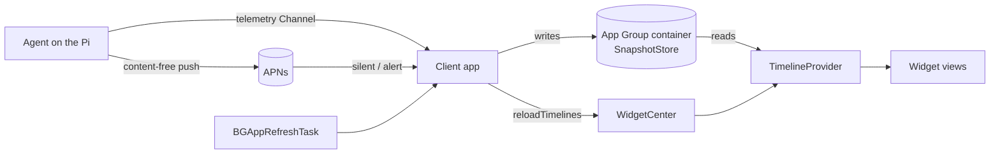

# 08 — Widgets & Live Activities

WidgetKit surfaces for the Client: Home Screen, Lock Screen, StandBy, Control Center-adjacent accessories, and Live Activities / Dynamic Island.

**Read first:** [00-GLOSSARY](00-GLOSSARY.md) — *Snapshot* and *Series* have precise meanings here and are used exactly. Then [13-DESIGN-SYSTEM](13-DESIGN-SYSTEM.md) for every token referenced below, and [07-UX-SPEC](07-UX-SPEC.md) for the in-app screens these widgets link into.

**Related:** [02-SRS](02-SRS.md) (`FR-` for widgets), [03-ARCHITECTURE](03-ARCHITECTURE.md) (App Group, extension topology), [04-SECURITY-E2EE](04-SECURITY-E2EE.md) (what may and may not live in a shared container), [05-PROTOCOL](05-PROTOCOL.md) (content-free push), [06-DATA-MODEL](06-DATA-MODEL.md) (Snapshot shape and cache), [09-TEST-PLAN](09-TEST-PLAN.md), [10-ROADMAP](10-ROADMAP.md), [12-RISK-REGISTER](12-RISK-REGISTER.md).

---

## 1. The governing idea

A widget is a **glanceable claim about a machine the user cannot see**. That makes it the single most dangerous surface in this product: it is read in half a second, it is trusted implicitly, and it is *always* showing data that is at least a little bit old.

Everything in this document follows from one rule:

> **A widget must never present a stale number as if it were live.**
> Freshness is not metadata here. It is part of the value.

The second rule follows from the first: **widgets observe, they do not command** — with a single, carefully bounded exception (§8).

---

## 2. Supported families

| Family | Supported | What it shows | Where it lives |
|---|---|---|---|
| `systemSmall` | ✅ | One Agent: status, one hero metric, a sparkline, an age stamp | Home Screen, Today View |
| `systemMedium` | ✅ | One Agent: status, four metrics, one sparkline, age stamp, alert count | Home Screen |
| `systemLarge` | ✅ | One Agent in depth, **or** up to five Agents in a fleet list | Home Screen |
| `systemExtraLarge` | ❌ | — | iPad only; out of scope for an iPhone-first v1. Revisit in [10-ROADMAP](10-ROADMAP.md). |
| `accessoryCircular` | ✅ | One metric as a GaugeRing with a status-shaped centre | Lock Screen, Apple Watch complication surface (future) |
| `accessoryRectangular` | ✅ | Status line + two metrics + a 16pt sparkline + age | Lock Screen |
| `accessoryInline` | ✅ | One line: glyph + the single most important fact | Lock Screen, above the clock |
| **StandBy** | ✅ | `systemMedium` re-laid-out for a charging, sideways, dim, distant phone | StandBy |
| **Live Activity** | ✅ | Long-running Actions only (reboot, update, restore) | Lock Screen + Dynamic Island |
| Control Center controls (`ControlWidget`) | ⚠️ Deferred | Would be a natural home for "open shell", but every such entry needs biometric gating anyway, which a control cannot provide. Deferred to [10-ROADMAP](10-ROADMAP.md). | |

---

## 3. Per-family layout

All widgets use the tokens in [13-DESIGN-SYSTEM](13-DESIGN-SYSTEM.md) §12. **Every token used here must exist as a Color Set in a target shared with the widget extension** — widgets cannot fall back to UIKit semantic colours. The shared subset is listed in §11.

### 3.1 `systemSmall`

```
┌───────────────────────────┐
│ ● pi5-livingroom          │  StatusPill dot 6pt + name,
│                           │  type.micro, text.secondary, 1 line
│                           │
│  54.2                     │  type.metric.l 24pt SF Mono,
│  °C  SOC TEMP             │  text.primary; unit + eyebrow
│                           │  type.micro, text.tertiary
│  ▁▂▃▃▄▄▅▄▄▃▃▂             │  Sparkline, 24pt band, 32 points
│                           │
│  2 min ago                │  age stamp, type.micro,
└───────────────────────────┘  text.tertiary — ALWAYS present
   158×158pt · radius 22 (system) · surface.raised
```

| Element | Token / size | Rule |
|---|---|---|
| Agent name row | `type.micro` 11pt, `text.secondary`, + 6pt status dot | Truncates tail; the **dot never truncates** |
| Hero value | `type.metric.l` 24pt SF Mono Medium, tabular, `text.primary` | Never truncates; auto-compacts (`1.2K`) before it would |
| Unit + eyebrow | `type.micro` 11pt uppercase, `text.tertiary` | |
| Sparkline | 24pt band, 32 points, 10% area fill, 6pt endpoint dot, hatched gaps (mandatory) | [13-DESIGN-SYSTEM](13-DESIGN-SYSTEM.md) §8.9 |
| Threshold | 1pt `status.warning`/`status.critical` @ 50% if inside the sparkline's y-domain | |
| **Age stamp** | `type.micro` 11pt, `text.tertiary` | **Never omitted, never truncated, never below 11pt.** See §6. |
| Padding | 12pt all round | |
| Background | `surface.raised`; **no border** (the widget's own shape is the boundary) | |

**Information hierarchy at a glance:** *which Pi → is it ok → the number → the shape → how old*. A user who reads only the first two elements has still got a true answer.

**Tap target:** the whole widget → `pimon://agent/<id>/metric/<seriesKey>`.

### 3.2 `systemMedium`

```
┌───────────────────────────────────────────────────┐
│ ● pi5-livingroom              ⚡ DIRECT   2 min ago│  header row, 16pt tall
│ ───────────────────────────────────────────────── │  border.hairline
│                                                   │
│  CPU        SOC TEMP     MEMORY      DISK /       │  type.micro eyebrows
│  12.4 %     54.2 °C      38 %        67 %         │  type.metric.m 17pt
│                                                   │
│  ▁▂▃▂▁▂▄▃▂▁▂▃▄▃▂▁▂▃▁▂▃▄▂▁▂▃▄▃▂▁▂▃▄▃▂▁▂▃▁▂        │  one sparkline,
│                                                   │  28pt, 48 points,
│  ▲ 1 alert firing · SoC temp above 80 °C          │  the hero Series
└───────────────────────────────────────────────────┘
   338×158pt · surface.raised · padding 14pt
```

| Element | Rule |
|---|---|
| Header | Agent name (`type.micro`, `text.secondary`) · path chip (`type.micro`, `accent.base` direct / `status.info` relayed) · age stamp, trailing |
| Metric row | Four columns, evenly divided, each `type.micro` eyebrow over a `type.metric.m` 17pt tabular value. The four metrics are **user-configurable** (§9), defaulting to CPU / SoC temp / Memory / Disk on `/`. |
| Sparkline | The **hero** Series only (the first configured metric), 28pt, 48 points |
| Footer | Alert summary. `status.*` glyph + count + the most severe rule's name. When nothing is firing it reads `No alerts` in `text.tertiary` — the row is never empty, because an absent row is ambiguous with a truncated one. |
| Tap targets | Header → `pimon://agent/<id>`; each metric column → that metric's detail; footer → `pimon://alerts` |

### 3.3 `systemLarge`

Two configurable modes.

**Mode A — one Agent, in depth** (default when exactly one Agent is paired):

```
┌───────────────────────────────────────────────────┐
│ ● pi5-livingroom                          2 min ago│
│ ⚡ DIRECT · 34 ms · 🔒 verified                    │  ConnectionBanner-style
│ ───────────────────────────────────────────────── │
│  CPU              SOC TEMP                        │
│  12.4 %           54.2 °C                         │  type.metric.l 24pt
│  ▁▂▃▂▁▂▄▃▂▁▂▃     ▂▂▃▃▄▄▅▄▄▃▃▂                    │  2 sparklines, 24pt
│                                                   │
│  MEMORY           DISK /                          │
│  38 %             67 %                            │
│  3.0 / 8.0 GB     42.9 / 64 GB                    │  type.micro sub-value
│  ▃▃▃▄▃▃▃▃▄▄▃▃     ▁▁▁▁▂▂▂▂▂▂▃▃                    │
│ ───────────────────────────────────────────────── │
│  UPTIME 14 d 06 h        LOAD 0.42 0.51 0.48      │
│ ───────────────────────────────────────────────── │
│  ▲ CRITICAL  SoC temp above 80 °C          2 min  │  up to 2 AlertRows,
│  ▲ WARNING   Disk / above 85 %            14 min  │  compact
└───────────────────────────────────────────────────┘
   338×354pt · padding 16pt
```

**Mode B — fleet** (default when ≥ 2 Agents are paired):

```
┌───────────────────────────────────────────────────┐
│ Your Pis                                  2 min ago│
│ ───────────────────────────────────────────────── │
│ ● pi5-livingroom   12%  54°C  38%   ▁▂▃▂▁▂▄▃      │  56pt rows,
│ ───────────────────────────────────────────────── │  sorted by severity
│ ● pi4-garage        3%  41°C  22%   ▁▁▂▁▁▁▂▁      │  then name
│ ───────────────────────────────────────────────── │
│ ● pi4-shed        —    —     —      ▨▨▨▨▨▨▨▨      │  offline: dashes +
│   offline · last seen 09:12                       │  hatch, age stamp
│ ───────────────────────────────────────────────── │
│ ▲ 2 alerts firing across 1 Pi                     │
└───────────────────────────────────────────────────┘
```

In fleet mode the sort is by **severity bucket then name**, and it is stable — a Pi does not change position because its RTT moved. Up to five Agents; a sixth and beyond collapse into a final row `+3 more Pis` in `text.tertiary`.

### 3.4 `accessoryCircular`

```
      ╭─────────╮
    ╱   ▓▓▓▓▓▓▓   ╲       GaugeRing, 300° sweep,
   │   ╱  54   ╲   │      gap at the bottom
   │  │   °C    │  │      centre: type.metric.m 17pt +
   │   ╲       ╱   │              type.micro unit
    ╲   ▁▁▁▁▁▁▁   ╱       bottom arc segment = status
      ╰─────────╯
```

| Element | Rule |
|---|---|
| Ring | 300° sweep from 210°, stroke 5pt. Fill = `viz.sequential.500` under threshold, `status.warning` / `status.critical` above. Track = `AccessoryWidgetBackground` (system) so it composes with any wallpaper. |
| Centre | Value `type.metric.m` 17pt tabular + unit `type.micro`. Two lines maximum, never truncated. |
| **The bottom gap does the freshness work.** | The 60° gap at the bottom of the ring carries a **status arc**: `accent.base` when the Snapshot is fresh, `status.warning` when it is stale, `status.offline` when the Agent is unreachable, and **absent** when the state is unknown. This is the only place in the system where a shape this small carries state — and it is legal because the arc's *presence, colour and position* are three channels, and the widget's accessibility value states the age in words. |
| Fallback | If the metric has no value, the centre reads `—` and the ring shows track only. Never a zero. |

Lock Screen accessory widgets render in a **single tint** decided by the system. Everything above therefore also has to work in monochrome: the ring's fill fraction, the numeral, and the *length* of the status arc (full = fresh, half = stale, none = offline) all survive tinting. Colour is a bonus channel here, never the only one.

### 3.5 `accessoryRectangular`

```
┌────────────────────────────────────┐
│ ● pi5-livingroom          2 min ago│  type.micro
│ 54.2 °C   CPU 12 %                 │  type.metric.m tabular
│ ▂▂▃▃▄▄▅▄▄▃▃▂                       │  16pt sparkline
└────────────────────────────────────┘
```

Three lines, exactly. Line 1: status dot + name + age (age is right-aligned and **never** truncated; the name truncates first). Line 2: the hero metric and one secondary. Line 3: a 16pt sparkline with **no area fill** (an area fill is invisible under Lock Screen tinting) and a 5pt endpoint dot, with hatched gaps.

### 3.6 `accessoryInline`

One line, system font, system tint, above the clock. Content is a strict priority ladder — the widget shows the **highest-priority true statement** that fits:

| Priority | Condition | String |
|---|---|---|
| 1 | Key mismatch | `⚠︎ pi5: identity changed` |
| 2 | Critical alert firing | `⚠︎ pi5: SoC 83 °C` |
| 3 | Agent unreachable | `pi5 offline · 14 min` |
| 4 | Warning alert firing | `pi5: disk 86 %` |
| 5 | Snapshot very stale | `pi5 · 42 min ago` |
| 6 | Nominal | `pi5 · 54 °C · 12 %` |

The nominal string carries no age because at priority 6 the data is by definition fresh (§6). Every other string carries either an age or an explicit state word. `accessoryInline` supports one SF Symbol; it is the state glyph, never a decorative one.

### 3.7 StandBy

StandBy shows `systemMedium` widgets on a charging phone, sideways, from across a room, often in Night Mode (red-shifted and heavily dimmed). It gets its own layout, not a scaled one.

```
┌───────────────────────────────────────────────────┐
│  pi5-livingroom                                   │  type.micro → scaled up
│                                                   │
│    54.2 °C          12.4 %                        │  type.hero-ish:
│    SOC TEMP         CPU                           │  32pt SF Mono Medium
│                                                   │
│    ●  online · 2 min ago                          │  one state line
└───────────────────────────────────────────────────┘
```

| StandBy rule | Spec |
|---|---|
| Metric count | **Two**, not four. At 1–3 m the four-column medium layout is unreadable. |
| Type size | The two values step up to **32pt** SF Mono Medium; everything else to `type.caption` minimum |
| Contrast | Night Mode renders a red-tinted, low-luminance composite. Every element must clear **4.5:1 against `#000000`** in its *own* colour before tinting. Measured on black: `text.primary` 18.77:1 · `text.secondary` 9.90:1 · `text.tertiary` 6.58:1 · `accent.base` 9.22:1 · `status.ok` 7.83 · `status.info` 7.22 · `status.warning` 9.64 · `status.critical` 6.22 · `status.offline` 5.89 · `status.unknown` 6.91. `text.tertiary` is the floor; `text.disabled` is **forbidden in StandBy**. |
| Status | Never colour-only: the state line always spells the word (`online`, `offline`, `stale`) |
| Sparkline | **Omitted.** A 24pt sparkline is noise at 2 m. |
| Refresh | Same timeline as `systemMedium`; StandBy does not get a privileged budget |
| Motion | None. StandBy widgets never animate. |

---

## 4. The data path



### 4.1 Rules of the path

1. **The widget extension never opens a Tunnel.** It has no keys, no Noise state, and no network code. A widget extension is short-lived, memory-capped, and can be launched at any time; putting cryptographic session state there would violate [04-SECURITY-E2EE](04-SECURITY-E2EE.md) and would routinely fail anyway.
2. **The app is the only writer; the extension is the only reader.** The App Group container holds a `SnapshotStore`: for each Agent, the most recent **Snapshot** ([00-GLOSSARY](00-GLOSSARY.md)), a short tail of each configured **Series** (enough for the largest sparkline: 48 points), the active Alert summary, the connection state, and — critically — **the wall-clock time each of those was produced by the Agent** and **the wall-clock time the Client received it**. Both timestamps, always.
3. **No key material, no fingerprints, no scrollback, no frames** ever enter the shared container. The container is file-protected `.completeUntilFirstUserAuthentication` so widgets work after a reboot-before-unlock without exposing data on a locked, never-unlocked device.
4. **The store is bounded**: ≤ 8 Agents × (1 Snapshot + 6 Series × 48 samples + 1 alert summary) ≈ well under 256 KB. A widget that has to parse megabytes will be killed.
5. **Writes are atomic** (write-temp-then-rename) because a widget may read at any instant.
6. Every write is followed by a **coalesced** `WidgetCenter.shared.reloadAllTimelines()` — at most one per 15 s, because reload requests beyond the system's budget are discarded and burn goodwill with the scheduler.

### 4.2 The Snapshot record the widget reads

| Field | Purpose |
|---|---|
| `agentID`, `displayName` | Identity |
| `producedAt` | When the **Agent** produced this Snapshot. **This is what the age stamp is computed from.** |
| `receivedAt` | When the **Client** received it. Used only in Diagnostics and to detect clock skew. |
| `connectionState` | `direct` / `relayed` / `connecting` / `offline` / `unknown` / `keyMismatch` |
| `connectionObservedAt` | When that state was last confirmed — an offline state also ages |
| `metrics[key] → value, unit, precision` | The configured metrics |
| `series[key] → [48 × (t, v?)]` | Sparkline tails. **`v` is optional** — a `nil` is a gap and is rendered as a gap, never dropped and never zero. |
| `coverage[key] → [intervals]` | Which spans the Agent actually recorded, so the widget can tell a transport gap from an Agent gap |
| `alertSummary` | Count by severity + the most severe rule's name |
| `thresholds[key]` | So the sparkline can draw its threshold rule |
| `staleAfter`, `veryStaleAfter` | The Agent's own telemetry interval × 3 and × 12, so the staleness contract adapts to the configured interval rather than hard-coding minutes |

### 4.3 TimelineProvider

- **`placeholder`** — the layout with plausible but obviously-synthetic values and **no age stamp**, redacted per `.privacySensitive()`. It is never mistaken for data because it is only shown during widget-gallery rendering.
- **`snapshot(in:)`** — the real current store contents when the widget is being previewed in the gallery; falls back to `placeholder` if the store is empty.
- **`timeline(in:)`** — builds entries as follows:
  1. Entry 0: **now**, from the store, with the true age.
  2. Entries 1..n: the **same data**, at increasing future dates, with the age recomputed and the staleness tier advanced. This is the key trick: the widget's own timeline carries its decay, so even if the app never runs again, the widget *ages itself correctly on screen* instead of freezing on "2 min ago" forever.
  3. Entry dates: `+2m, +5m, +10m, +15m, +30m, +45m, +60m, +90m, +2h, +3h, +6h` — dense while the number is still plausibly useful, sparse afterwards.
  4. `.after(now + 15m)` reload policy, so the system refreshes sooner when it has budget, and the decay entries carry the widget when it does not.

---

## 5. Refresh strategy and realistic freshness

### 5.1 Mechanisms, in order of value

| Mechanism | Trigger | Realistic yield |
|---|---|---|
| **App in foreground** | Live `telemetry` subscription writes the store continuously | Fresh to the second |
| **Push-triggered refresh** | Rendezvous sends a **content-free** push when the Agent reports an Alert or a significant change ([05-PROTOCOL](05-PROTOCOL.md)); the app wakes, opens a Tunnel, writes the store, reloads timelines | Seconds to a minute, **event-driven only** |
| **`BGAppRefreshTask`** | Scheduled with a 15-minute earliest-begin-date, budgeted by iOS on the user's actual usage pattern | 1–8 times a day for most users; more for heavy users |
| **WidgetKit timeline reload** | Widget's own `.after(15m)` policy | Several times an hour when the widget is on the active Home Screen page, far less otherwise |
| **User opens the app** | Immediate full refresh | Whenever it happens |
| **User taps the widget** | Opens the app, which refreshes | |

### 5.2 What *not* to do

- **No background polling loop.** iOS does not provide one, and pretending otherwise produces a widget that is confidently wrong.
- **No silent push on a timer.** High-frequency silent pushes get throttled by APNs and by iOS, degrade the app's background budget, and cost the user battery for a number they may never look at. Pushes are **event-driven**: an Alert fired, an Alert resolved, the Agent came back after an outage, a key changed.
- **No `reloadAllTimelines()` per Snapshot** while foregrounded — coalesced to ≤ 1 per 15 s.
- **No promise of a refresh interval in the UI.** Settings → Widgets explains the budget honestly rather than offering a frequency picker that iOS will ignore.

### 5.3 Realistic freshness expectation table

This table is normative for both the product and the copy in Settings → Widgets. It is the honest answer to "how old is this number?".

| Situation | Typical age of the displayed value | Worst realistic case |
|---|---|---|
| App is in the foreground | < 5 s | 1 telemetry interval |
| App was foregrounded in the last 5 min | 1–5 min | 5 min |
| Alert fired recently (push woke the app) | < 1 min | 3 min |
| Widget on the active Home Screen page, phone in regular use | 15–45 min | 2 h |
| Widget on a secondary Home Screen page | 1–3 h | 6 h |
| Lock Screen accessory, phone in regular use | 30 min – 2 h | 4 h |
| StandBy, phone charging overnight | 30 min – 2 h | overnight |
| Low Power Mode | 2–6 h | until the app is opened |
| Background App Refresh disabled by the user | **only** on push and on app launch | until the app is opened |
| Agent unreachable | n/a — the widget shows the **offline** state, aged | |

**Settings → Widgets copy, verbatim:**

> **How often widgets update**
>
> iOS decides. It gives each app a budget based on how you actually use it, and it can shrink that budget to save battery.
>
> In practice a widget on your main Home Screen page refreshes every 15–45 minutes. On a page you rarely visit, it can be hours. When an alert fires, your Pi pokes this phone and the widget updates within about a minute.
>
> That's why every widget shows how old its numbers are. If the age looks wrong, open the app — it refreshes immediately.

---

## 6. The staleness contract

**Normative. This is the most important section in this document.**

Every widget classifies its Snapshot into exactly one of five tiers, and each tier has a *mandatory* visual treatment. The tier is computed from `now − producedAt` against the Agent's own `staleAfter` / `veryStaleAfter` values (§4.2), so a Pi sampling every second and a Pi sampling every minute both behave sensibly.

| Tier | Condition | Age stamp | Value ink | Sparkline | Additional |
|---|---|---|---|---|---|
| **T0 — Live** | age ≤ 2 × telemetry interval | `just now` | `text.primary` | Full colour, endpoint dot | Status dot `accent.base` |
| **T1 — Recent** | age ≤ `staleAfter` (3 × interval), and ≤ 10 min | `2 min ago` | `text.primary` | Full colour, endpoint dot | — |
| **T2 — Stale** | age ≤ `veryStaleAfter` (12 × interval), and ≤ 2 h | `18 min ago` | **`text.secondary`** | **`viz.deemphasis` grey**, endpoint dot **removed** | A 1pt `status.warning` rule under the age stamp |
| **T3 — Very stale** | age > `veryStaleAfter`, or > 2 h | `1 h 40 m ago` in **`status.warning`** | **`text.secondary`**, and the value is prefixed with a **`clock.badge.exclamationmark` glyph** | Grey, endpoint removed, **the trailing 25% of the band is hatched** | — |
| **T4 — Unusable** | age > 12 h, **or** `connectionState == offline` with `connectionObservedAt` older than 30 min, **or** the store has no entry for this Agent | **The number is removed entirely** and replaced by `—` | `text.tertiary` | **Replaced by a full-width hatch band** | The widget's primary line becomes the state, not the metric: `Offline · last seen 09:12` or `No recent data` |

### 6.1 The rules behind the table

1. **The age stamp is never omitted, at any size, in any family.** In `accessoryInline`, where there is one line, the age *is* the content at T2 and above (§3.6 priority ladder). If a layout cannot fit an age stamp, the layout is wrong, not the contract.
2. **The age stamp is never truncated.** It has the highest layout priority after the value; the Agent name truncates before it.
3. **Dimming alone is never sufficient.** Dimmed text is ambiguous with disabled. Every tier at T2 and above pairs the dimming with a *second* channel — the removed endpoint dot, the greyed sparkline, the glyph, the hatch — so the treatment survives Lock Screen tinting, StandBy Night Mode, and colour-vision differences.
4. **At T4 the number goes away.** This is the contract's teeth. A twelve-hour-old CPU reading is not a weak signal, it is a false one, and no amount of dimming makes `12.4 %` mean "probably nothing like 12.4 % any more". The widget stops making the claim.
5. **Offline is a *positive* state, not an absence.** `Offline · last seen 09:12` is a true, useful statement. `—` with no explanation is not. The two are never conflated (this mirrors [13-DESIGN-SYSTEM](13-DESIGN-SYSTEM.md) §2.6's `offline` vs `unknown`).
6. **A gap in the sparkline is drawn as a gap** — hatched, never interpolated, never zero-filled, never dropped so the line shrinks. The `coverage` array distinguishes a transport gap (45° hatch) from an Agent gap (135°).
7. **The timeline ages the widget by itself.** Because the provider emits decay entries (§4.3), a widget whose app has not run for six hours correctly displays `6 h ago` and the T3/T4 treatment — it does not sit at `2 min ago` forever. This is the mechanism that makes the contract enforceable rather than aspirational.
8. **Clock skew is handled.** If `producedAt` is in the future by more than 60 s relative to the device clock, the widget renders T4 with the state line `Clock mismatch` rather than a nonsensical negative age.
9. **Placeholder and redacted renderings show no age and no plausible value** — they are visibly synthetic.

### 6.2 Age-stamp formatting

| Age | Format | Example |
|---|---|---|
| < 30 s | `just now` | |
| < 60 min | `%d min ago` | `18 min ago` |
| < 24 h | `%dh %02dm ago` | `1 h 40 m ago` |
| ≥ 24 h | `%d d ago` | `2 d ago` |
| Unknown / never | `no data yet` | |

Always `type.micro` 11pt or larger, always tabular, always `text.tertiary` (T0–T2) or `status.warning` (T3+).

---

## 7. Interactive widgets (App Intents)

iOS 17 allows a widget to run an `AppIntent` in-place. This is a genuinely useful capability and also a genuinely dangerous one for a product that can power off a computer.

### 7.1 What is exposed

| Intent | Family | Behaviour | Why it is safe |
|---|---|---|---|
| `RefreshNowIntent` | all `system*` | Requests a foreground-quality refresh: schedules an immediate `BGAppRefreshTask`-equivalent, and if the app can be woken, opens a Tunnel, writes the store, reloads. Shows a `motion.fast` state change on the refresh glyph and nothing else. | Idempotent, read-only, no Agent-side effect |
| `AcknowledgeAlertIntent` | `systemMedium`, `systemLarge` | Acknowledges the single most severe firing Alert. | Reversible, no Agent-side state change beyond an acknowledgement flag, and it is the action a user genuinely wants at 2 a.m. from the Lock Screen |
| `SnoozeAlertIntent` (1 h) | `systemLarge` | Snoozes the most severe firing Alert for one hour. | Reversible; expires by itself |
| `SwitchWidgetAgentIntent` | `systemLarge` fleet mode | Changes which Agent this widget instance shows. | Purely local display state |

That is the complete list. Each intent is confirmed in place with a 900 ms state change on the control and a `.selection` haptic; none of them opens the app.

### 7.2 What is deliberately not exposed, and why

**No Action from the Agent's allow-list is available in a widget. Not one — not even a service restart.** The reasoning, recorded here so it is not relitigated:

1. **The confirmation pattern cannot be reproduced.** [07-UX-SPEC](07-UX-SPEC.md) §17.1 requires four gates: a destructive-styled trigger, a consequence sheet naming the target and outcome, a deliberate gesture (slide or typed name), and biometric authentication. A widget can offer a single tap. Three of the four gates are structurally impossible.
2. **Biometric authentication is unavailable to a widget intent.** An intent that needs `LAContext` must open the app — at which point the widget saved nothing and taught the user that a tap on a widget can start a reboot.
3. **Widgets are tapped by accident.** They sit on a Home Screen and a Lock Screen, under a thumb, in a pocket-adjacent context, next to other widgets. The base rate of accidental activation is not zero, and the cost of an accidental `shutdown` on a Pi in a shed is a trip to the shed.
4. **The target is invisible.** A widget shows one Agent, but a user with several Pis reads widgets fast and interchangeably. "Which Pi did I just reboot?" is a question the design must never permit.
5. **There is no undo.** A reboot cannot be recalled between the tap and the Agent receiving it.
6. **The convenience is small.** Tapping a widget to open the Actions screen is one extra tap over tapping a widget to reboot. That single tap buys the entire confirmation flow.

**Therefore:** a widget's *Restart* affordance, where one is shown at all, is a **deep link** (`pimon://agent/<id>/actions`) that opens the Actions screen with the destructive group visible. It never performs anything. This is a hard product rule and belongs in [02-SRS](02-SRS.md) as a numbered requirement.

The same reasoning applies to notification actions: an Alert notification carries `Acknowledge` and `Snooze 1 h` (both reversible) and `Open`, and never a remediation action.

---

## 8. Multi-Agent configuration

Widgets are configured with `AppIntentConfiguration` (iOS 17+), not the legacy Intents framework.

### 8.1 The configuration intent

| Parameter | Type | Applies to | Default |
|---|---|---|---|
| `agent` | `AgentEntity` (dynamic query) | all | The current Agent in the app; if none, the only paired Agent; if several, the first by name |
| `mode` | enum `single` / `fleet` | `systemLarge` | `fleet` when ≥ 2 Agents are paired, `single` otherwise |
| `heroMetric` | `MetricEntity` (dynamic query, per-Agent) | `systemSmall`, `accessoryCircular`, `accessoryRectangular`, StandBy | `cpu.temp_c` |
| `secondaryMetric` | `MetricEntity` | `accessoryRectangular`, StandBy | `cpu.util_pct` |
| `metrics` | up to 4 `MetricEntity` | `systemMedium`, `systemLarge` single mode | CPU util, SoC temp, memory used %, disk used % on `/` |
| `showSparkline` | Bool | `systemSmall`, `systemMedium` | true |
| `showAlerts` | Bool | `systemMedium`, `systemLarge` | true |

### 8.2 Rules

- **`AgentEntity` is resolved from the App Group store**, never from the network. Widget configuration must work with the phone in aeroplane mode, and it must work while the extension has no keys.
- **`MetricEntity`'s query is scoped by the selected Agent** and lists only Series that Agent actually reports ([06-DATA-MODEL](06-DATA-MODEL.md)). A user with a Pi 4 and a Pi 5 does not get offered a metric that only one of them has.
- **A "follow the app" option is deliberately not offered.** A widget that silently changes which machine it describes when the user switches Agents in the app is a correctness hazard of exactly the kind §7.2 rule 4 is about. **Every widget instance names one Agent, permanently, until reconfigured**, and every family shows that name.
- If the configured Agent is **unpaired**, the widget renders a T4-style state: `pi4-shed is no longer paired` with a tap target into Settings → Devices & keys. It does not silently fall back to another Agent.
- Recommended configurations (`IntentRecommendation`) are emitted for each paired Agent so the widget gallery offers "pi5-livingroom" and "pi4-garage" as ready-made choices rather than an unconfigured widget.

---

## 9. Live Activities and the Dynamic Island

### 9.1 When a Live Activity is started

**Only for a long-running Action with a knowable end,** started from [07-UX-SPEC](07-UX-SPEC.md) §12.2's watch state:

| Action | Started | Ends |
|---|---|---|
| Reboot | On the Agent's acknowledgement | When the Tunnel is re-established, or after 3× expected boot time |
| Shutdown | On acknowledgement | When the Tunnel drops (that *is* success), held 30 s to say so |
| Package update | On acknowledgement | On the Agent's completion report |
| Any Agent-declared `longRunning` Action | On acknowledgement | On completion or timeout |

**Never** for: an open Remote Shell session, an open Remote Desktop session, a firing Alert, or ambient telemetry. A Live Activity is for a *bounded operation the user is waiting on*, not for a persistent state — using one for a live session would put a permanently-lit strip on the Lock Screen and would burn the mechanism's credibility.

Only one Live Activity per Agent; at most three concurrently.

### 9.2 Lock Screen presentation

```
┌───────────────────────────────────────────────────┐
│  ⟳  Rebooting pi5-livingroom                      │  type.bodyEmph
│                                                   │
│  ●──────●──────○──────○                           │  4-stage rail
│  sent  ack'd  offline  back                       │  type.micro
│                                                   │
│  0:34                          usually ~50 s      │  type.metric.l tabular
└───────────────────────────────────────────────────┘
```

The rail advances on **observed events only** — the same four milestones as the in-app watch state and the ConnectionBanner. The elapsed counter uses `Text(timerInterval:)` so it ticks without a push. The "usually ~50 s" figure comes from this Agent's own measured history, and is omitted when there is no history rather than guessed.

### 9.3 Dynamic Island

**Compact leading / trailing**

```
 ⟳                          0:34
```
Leading: the Action's glyph, tinted `accent.base` while in progress, `status.ok` on success, `status.critical` on failure. Trailing: the elapsed timer, `type.metric.s` tabular. Nothing else fits and nothing else is attempted.

**Minimal**

```
 ⟳
```
The glyph alone. On failure it becomes `exclamationmark.triangle.fill` in `status.critical` — the one case where the minimal presentation must still carry meaning.

**Expanded**

```
┌─────────────────────────────────────────────┐
│ ⟳                                      0:34 │  leading glyph / trailing timer
│                                             │
│ Rebooting pi5-livingroom                    │  center: type.bodyEmph
│ ●──────●──────○──────○                      │
│ sent  ack'd  offline  back                  │
│                                             │  bottom:
│ Went offline at 14:32:08 · usually ~50 s    │  type.caption, text.secondary
└─────────────────────────────────────────────┘
```

**Terminal states** (held 8 s, then dismissed):

| Outcome | Compact | Expanded |
|---|---|---|
| Success | `✓` `0:47` in `status.ok` | `pi5-livingroom is back · 47 s` |
| Timed out | `⚠︎` `3:02` in `status.warning` | `pi5-livingroom hasn't come back · usually ~50 s` + a `Diagnostics` deep link |
| Failed | `⚠︎` in `status.critical` | `Reboot failed · exit 1` + `See details` |

**Rules:** the Live Activity is **never interactive** beyond a tap that opens the app at the relevant screen — the same reasoning as §7.2. Push updates to a Live Activity use `ActivityKit`'s push token and carry only **an opaque state index and a timestamp**, never metric values or Agent names, preserving README P1: the strings are composed on the device from data it already holds.

---

## 10. Widget accessibility

| Concern | Spec |
|---|---|
| **VoiceOver, `systemSmall`** | One element. Label: `"pi5-livingroom"`. Value: `"SoC temperature 54.2 degrees Celsius, 2 minutes ago, online"`. At T3+: `"…, 1 hour 40 minutes ago, data may be out of date"`. At T4: `"pi5-livingroom, offline since 09:12, no current data"`. **The age is always spoken**, in every tier. |
| **VoiceOver, `systemMedium` / `systemLarge`** | One element per logical group (header, each metric, alert footer / each fleet row), in reading order. Each metric's value includes its own unit and the shared age is spoken once in the header. |
| **VoiceOver, `accessoryCircular`** | Label: the metric name. Value: `"54.2 degrees Celsius, 38 percent of the way to the alert threshold, 2 minutes ago"`. The status arc is spoken as a word, never left to colour. |
| **VoiceOver, `accessoryInline`** | The line as written; the state glyph is spoken as its state word. |
| **Sparklines** | `.accessibilityHidden(true)`; the trend is folded into the parent's value as a word (`trending up`), and gaps are spoken (`with a 14 minute gap`). |
| **Dynamic Type** | Widgets honour the system size. Every layout is validated at `xSmall`, `Large`, `xxxLarge`, `AX1` and `AX3`. Above `xxxLarge`: `systemMedium` drops from four metrics to two; `systemLarge` fleet mode drops from five rows to three plus `+N more`; `accessoryRectangular` drops the sparkline before it drops the age. **The age stamp is never what gets dropped.** |
| **Never below 11pt** | No element in any widget, at any Dynamic Type size, renders below 11pt. |
| **Reduce Motion** | Widgets do not animate at baseline; the only motion is the App Intent confirmation state change, which becomes an instant change. |
| **Reduce Transparency** | The `AccessoryWidgetBackground` is replaced by a solid `surface.raised2` behind accessory content where the system permits. |
| **Increase Contrast** | The High Contrast Color Set variants ([13-DESIGN-SYSTEM](13-DESIGN-SYSTEM.md) §2.10) apply automatically; the age stamp promotes from `text.tertiary` to `text.secondary`. |
| **Smart Invert** | Sparklines and the GaugeRing are marked `.accessibilityIgnoresInvertColors(false)` — they *should* invert with the rest, as they carry no photographic content. |

---

## 11. Contrast on arbitrary wallpapers, tinting, and Liquid Glass

### 11.1 Home Screen — the wallpaper problem

Home Screen widgets draw their own background, so contrast is controlled — **provided the widget actually fills its container**. Rules:

1. **Every `system*` widget fills its full container with `surface.raised`.** No transparent regions, no "floating" content over the wallpaper, no partial-height backgrounds. This is why the measured ratios in [13-DESIGN-SYSTEM](13-DESIGN-SYSTEM.md) §2.4 hold in a widget.
2. **`containerBackground(for: .widget)`** is used so the system can substitute its own treatment in contexts that require it (StandBy, tinted mode) without the widget losing legibility.
3. **No widget uses a translucent material as its background.** Materials over an arbitrary wallpaper are unmeasurable.

### 11.2 Tinted / monochrome Home Screen appearance

iOS renders Home Screen widgets in a **single user-chosen tint** (and in dark/light variants) when the user selects that appearance. In tinted mode, **all colour is discarded** and content is rendered as a luminance mask.

Consequences, all of which the layouts above already satisfy:

| Requirement | How it is met |
|---|---|
| Status must not be colour-only | Every status carries a glyph and, where space allows, a word. In tinted mode the glyph is what survives. |
| Staleness must not be colour-only | T2+ removes the endpoint dot and greys the sparkline; T3 adds a `clock.badge.exclamationmark` glyph; T4 removes the number. All four are luminance/shape changes. |
| The thermal ramp must not be colour-only | The thermal ramp is monotone in OKLCH lightness with ΔL ≥ 0.06 per step ([13-DESIGN-SYSTEM](13-DESIGN-SYSTEM.md) §2.7), so it survives as a legible grey ramp. The °C figure is always present regardless. |
| Sparkline vs threshold must remain distinguishable | The threshold rule is dashed; the data line is solid. Dash vs solid is a shape channel. |
| Gaps must remain visible | The hatch is a texture, not a colour. |
| Multi-series must not appear | Widget sparklines are **single-Series only** — categorical identity cannot survive tinting, so it is never relied on. |

`widgetRenderingMode` is read explicitly: in `.accented` and `.vibrant` modes the widget switches to a **luminance-first variant** in which the value, the glyph and the age stamp are rendered in the "accented" group and the chrome in the default group, so the hierarchy is preserved rather than flattened.

### 11.3 Lock Screen accessory tinting

Accessory widgets are always rendered in a system tint, over a wallpaper, often over a photograph subject. Therefore:

- Accessory layouts rely on `AccessoryWidgetBackground` for the ring track and for any filled region, which the system composites correctly over any wallpaper.
- The `accessoryCircular` design uses **fill fraction, arc length and numeral** — three luminance/geometry channels — and treats colour as a bonus.
- `accessoryRectangular` uses **no area fill** under the sparkline, because a 10%-opacity wash disappears entirely under tinting.
- Nothing in an accessory widget is smaller than 11pt or thinner than 2pt.

### 11.4 Liquid Glass / dynamic material appearances

Where the platform composites widgets behind a translucent, refractive material (the "Liquid Glass" family of appearances) the widget's own background is partially replaced by a system-managed material and its content is re-tinted:

1. **Do not fight it.** The widget declares `containerBackground` and lets the system own the plate; it does not draw its own rounded rect underneath.
2. **Assume the content layer may be re-tinted at any moment** — which is the same constraint as §11.2, already satisfied.
3. **Increase the minimum stroke weight to 2pt** for the sparkline and 2pt for the gauge ring in these appearances; 1pt hairlines disappear against a refractive plate.
4. **Drop the internal `border.hairline` dividers** (they read as artefacts against a glass plate) and separate groups with spacing instead. The layouts in §3 are already spacing-separated; the hairlines shown are optional and are the first thing removed.
5. **Never place `text.tertiary` over a glass plate.** In these appearances the age stamp promotes to `text.secondary` — the one element that is never allowed to become hard to read.
6. **Validate against both a light and a dark wallpaper** with a high-frequency image (foliage, text) behind the plate; that is the case that breaks thin type.

---

## 12. Testing requirements

For [09-TEST-PLAN](09-TEST-PLAN.md):

1. **Staleness ladder** — force each tier T0–T4 by manipulating `producedAt`, and assert the mandated treatment in every family, including that T4 removes the number.
2. **Self-ageing timeline** — install a widget, prevent the app from running for 6 h, assert the widget displays a correct age and the T3 treatment without any refresh.
3. **Clock skew** — set `producedAt` 5 min in the future; assert `Clock mismatch`, not a negative age.
4. **Gap rendering** — inject a `nil` run into a Series tail; assert a hatch, and assert the 45°/135° distinction against the `coverage` array.
5. **Tinted mode** — render every family in `.accented` and `.vibrant`; assert that status, staleness and threshold remain distinguishable without colour.
6. **Wallpaper contrast** — composite every accessory family over five wallpapers (white, black, high-frequency foliage, a portrait subject, a saturated gradient) and measure the age stamp and hero value at ≥ 4.5:1.
7. **Dynamic Type** — every family at `xSmall` → `AX3`; assert the age stamp is never dropped or truncated.
8. **Unpaired Agent** — unpair the configured Agent; assert the widget states it and does not fall back to another Agent.
9. **No destructive intent** — assert by inspection and by test that no `AppIntent` exposed to any widget or notification reaches an Agent Action.
10. **Container bounds** — assert the shared store stays under 256 KB with 8 Agents configured.
11. **Live Activity terminal states** — assert success, timeout and failure presentations in compact, minimal and expanded, and assert dismissal after 8 s.
12. **Push payload emptiness** — assert that no widget-triggering or Live Activity push payload contains a metric value, an Agent name, or any Series key.

---

## 13. Decisions the requirements author should mirror

1. **No Agent Action is ever invocable from a widget, a notification action, or a Live Activity.** Widgets deep-link into the confirmation flow instead. (§7.2)
2. **A widget instance names exactly one Agent** and never follows the app's current-Agent selection. (§8.2)
3. **The Snapshot record must carry `producedAt` (Agent clock) separately from `receivedAt` (Client clock)**, plus per-Series `coverage` intervals and the Agent's `staleAfter` / `veryStaleAfter` values. Without these the staleness contract cannot be implemented. (§4.2)
4. **Push notifications that trigger widget refresh remain content-free**, and Live Activity push updates carry only an opaque state index and a timestamp. (§5.2, §9.3)
5. **The Agent must report per-Action `longRunning` and `expectedDuration` metadata** so a Live Activity can be started and can state "usually ~50 s" from real history. (§9.1)
6. **Widget configuration must function offline**, from the App Group store alone. (§8.2)
