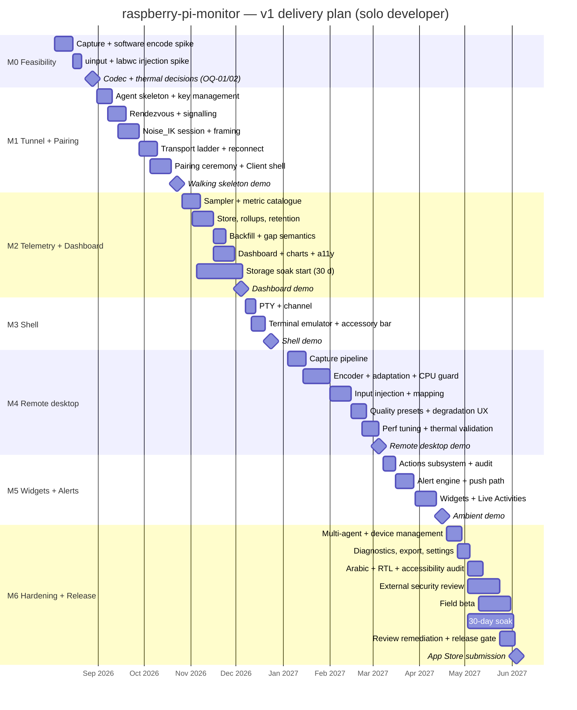

# 10 — Roadmap

> Terms per [00-GLOSSARY](00-GLOSSARY.md). Requirement IDs refer to [02-SRS](02-SRS.md); business requirements to [01-BRD](01-BRD.md); risks to [12-RISK-REGISTER](12-RISK-REGISTER.md).

| Field | Value |
|---|---|
| Document | 10 — Roadmap |
| Version | 1.0 |
| Date | 2026-07-24 |
| Author | Abo5 |
| Status | Draft |
| Team | One developer, three codebases (Rust Agent, Swift Client, Rendezvous) |
| Total build effort | 38 engineer-weeks + 8 weeks contingency = **46 engineer-weeks** |
| Planned calendar | M0 kickoff 2026-08-03 → App Store submission 2027-06 |

### Revision history

| Version | Date | Author | Change |
|---|---|---|---|
| 1.0 | 2026-07-24 | Abo5 | Initial issue: M0–M6 with exit criteria, demo scripts, estimates, dependencies, deferral list, Gantt. |

---

## 1. Walking skeleton first

**The first thing built is the thinnest possible end-to-end path, and it is built before any feature is built well.**

By the end of M1 there must exist a single vertical slice that touches every architectural layer at once: a real Agent on a real Pi, paired by a real QR ceremony with a real fingerprint comparison, reaching a real iPhone through a real Rendezvous over a real WebRTC DataChannel under a real Noise_IK handshake, carrying one number — the CPU temperature — onto one screen. Nothing about that slice is a mock, a stub, or a simulator.

Why this ordering is non-negotiable for a solo developer:

| Reason | Consequence of getting it wrong |
|---|---|
| The integration risk in this product is concentrated in pairing, NAT traversal, and the crypto session — not in features | Building the dashboard first would produce months of work resting on an unvalidated foundation |
| Every later milestone is a *widening* of the skeleton, not a new stack | Each subsequent feature costs its own complexity only, not integration complexity |
| A working skeleton makes every performance number measurable from M1 onward | Performance targets discovered at M4 are unfixable by M6 |
| The demo is real from month two | Motivation and feedback do not wait nine months |

Corollary: **M0 exists to kill the plan cheaply if it must be killed.** The single question M0 answers is whether a Raspberry Pi 5 can software-encode a usable desktop stream inside the CPU budget in [02-SRS §5.2–5.3](02-SRS.md#52-throughput-frame-rate-and-media-quality). If it cannot, the product's scope changes before a line of Client UI is written.

---

## 2. Milestone overview

| ID | Milestone | Effort (eng-wk) | Calendar | Primary risk retired |
|---|---|---|---|---|
| M0 | Spike / feasibility | 3 | 2026-08-03 → 2026-08-28 | Pi 5 software-encoding feasibility (RSK-01) |
| M1 | Tunnel + Pairing (walking skeleton) | 7 | 2026-08-31 → 2026-10-23 | NAT traversal and crypto session correctness (RSK-02, RSK-05) |
| M2 | Telemetry + Dashboard | 6 | 2026-10-26 → 2026-12-04 | Storage growth and SD endurance (RSK-09) |
| M3 | Remote shell | 3 | 2026-12-07 → 2026-12-24 | Interactive latency under real transports |
| M4 | Remote desktop | 8 | 2027-01-04 → 2027-03-05 | Capture/input compatibility and thermals (RSK-08, RSK-11) |
| M5 | Widgets + Alerts | 5 | 2027-03-08 → 2027-04-16 | iOS background limits (RSK-03) |
| M6 | Hardening + Multi-agent + Release | 6 | 2027-04-19 → 2027-06-04 | App Review and security review (RSK-04, RSK-05) |
| — | Contingency | 8 | Distributed | Everything else |

Calendar duration exceeds engineer-weeks deliberately: a solo developer loses time to context switching across three toolchains, hardware wrangling, and life.

> **Tension to resolve, not to hide.** [01-BRD](01-BRD.md) objective OBJ-7 sets a ≤ 9-month target from M0 kickoff to App Store availability. The calendar above lands at approximately **10 months** to submission. Either OBJ-7 is relaxed to 10 months, or the M4 scope cut named in §11 (single fixed quality preset, no clipboard sync, absolute pointer only) is taken at M4 entry. This decision belongs to the Owner at M3 exit and must not be left to drift.

---

## 3. M0 — Spike and feasibility

| Field | Value |
|---|---|
| **Goal** | Answer, on real hardware, whether the product's two riskiest physical assumptions hold: that a Pi 5 can software-encode a usable desktop stream inside the CPU budget, and that `uinput` injection works reliably under labwc. |
| **Effort** | 3 engineer-weeks |
| **Calendar** | 2026-08-03 → 2026-08-28 |
| **Dependencies** | HW-A (Pi 5 + display), HW-C (Pi 4), a macOS build machine |

### Scope

| In | Out |
|---|---|
| Capture via wlroots screencopy and via the PipeWire portal, measured on both | Any Client UI |
| Software H.264 encoding at 720p and 1080p, measured for fps, CPU, and encoder latency | Any networking beyond a LAN socket |
| Codec comparison for OQ-01 (H.264 vs VP8/VP9) including iOS decode power cost | Any cryptography |
| `uinput` virtual keyboard and pointer creation and injection under labwc | Any persistence |
| Thermal behaviour under 30 minutes of sustained encoding on passive and active cooling | Any packaging |
| A throwaway raw-socket viewer on macOS or iOS, purely to observe frames | Any code intended to survive M0 |

### Exit criteria

| # | Criterion | Threshold |
|---|---|---|
| M0-E1 | Sustained software encode on Pi 5 measured over 10 minutes | ≥ 25 fps at 1280×720 within ≤ 150% of a 400% CPU total |
| M0-E2 | Encoder latency measured | ≤ 35 ms p95 at 720p |
| M0-E3 | Thermal behaviour characterised on passive and active cooling | A documented degradation curve; a stated safe operating envelope |
| M0-E4 | `uinput` injection verified under labwc | Pointer and keyboard events land correctly, including modifiers, with a non-root permission model identified |
| M0-E5 | Capture path decision made | screencopy vs portal chosen, with the fallback condition documented |
| M0-E6 | OQ-01 resolved | Codec selected with measured evidence on both encode CPU and iOS decode power |
| M0-E7 | OQ-02 resolved | Pi 4 declared a supported remote-desktop target or restricted to telemetry + shell |

### Demo script

1. On the Pi, start the spike capture-and-encode process at 720p; show `htop` alongside.
2. Play FX-2 scrolling-text and moving-window content on the Pi's display.
3. On the laptop, show the decoded stream and the live fps and latency counters.
4. Raise the Pi's background load; show CPU and fps under pressure.
5. Run for 30 minutes on the passive-cooled unit; show the temperature and throttle-flag log.
6. Inject a keyboard sequence and a pointer drag from the laptop; show it land on the Pi's display.
7. Present the codec comparison table and state the M0-E6 and M0-E7 decisions.

### If M0 fails

| Failure | Response |
|---|---|
| Frame rate below M0-E1 at 720p | Lower the v1 remote-desktop target to 960×540, revise NFR-013, and revisit whether remote desktop leads or follows in the value proposition |
| Frame rate far below target even at 540p | Cut remote desktop from v1 entirely; the product becomes telemetry + shell + alerts + widgets, and [01-BRD](01-BRD.md) §10.3 must be rewritten before any further work |
| `uinput` unworkable without root | Redesign input privilege model, or ship view-only remote desktop in v1 |
| Thermals force throttling in normal use | Cap default quality, make active cooling a documented requirement for remote desktop |

---

## 4. M1 — Tunnel and Pairing (the walking skeleton)

| Field | Value |
|---|---|
| **Goal** | One number travels end to end, through a real ceremony, real signalling, real NAT traversal, and real encryption, on real hardware. |
| **Effort** | 7 engineer-weeks |
| **Calendar** | 2026-08-31 → 2026-10-23 |
| **Dependencies** | M0 complete; HW-G Rendezvous VPS; HW-H TURN; HW-I network rig; Apple Developer Program enrolment |

### Scope

| In | Out |
|---|---|
| Agent skeleton: systemd unit, config, logging, key generation (FR-001, FR-007) | Any telemetry beyond a single hard-coded metric |
| Pairing: QR invitation, single-use token, Noise_IK handshake, dual-form fingerprint, mutual confirmation (FR-002…FR-006, FR-012, FR-013) | Multi-agent, revocation UI, key rotation |
| Rendezvous: stateless signalling, Agent registration, opaque blob relay (FR-102…FR-104) | Push triggers |
| Transport ladder: WebRTC DataChannel → TURN → WebSocket-over-Rendezvous (FR-105…FR-108) | Media transports |
| Channel multiplexing framework with `control` and `telemetry` only (FR-112, FR-113) | `shell`, `screen`, `input`, `files` |
| Reconnect, backoff, transport-change survival (FR-110, FR-111) | Backfill |
| Client: biometric gate, single screen showing one live value, path-class indicator (FR-901, FR-109) | Dashboard, charts, settings |
| Protocol versioning from day one (NFR-049) | Version-skew tolerance |
| L1–L3 test harness, protocol fuzzing scaffold, CI on both toolchains | L4–L8 |

### Exit criteria

| # | Criterion |
|---|---|
| M1-E1 | A full Pairing ceremony completes on real hardware with a genuine fingerprint comparison, and a deliberate mismatch aborts with no record written (TC-005, TC-006) |
| M1-E2 | CPU temperature updates live on the phone from a Pi on a different network, with no port forwarding |
| M1-E3 | The transport ladder is verified on network profiles N-1, N-2, N-8, and N-10 (TC-1201, TC-1202, TC-1208, TC-1210) |
| M1-E4 | A mid-session Wi-Fi → cellular handover resumes within NFR-012 (TC-110) |
| M1-E5 | An instrumented Rendezvous capture shows only opaque blobs; nothing persisted at rest (TC-103) |
| M1-E6 | Replay, reorder, duplication, and truncation by a malicious Rendezvous are all rejected (TC-1109) |
| M1-E7 | A downgrade attempt is refused by both endpoints (TC-1107) |
| M1-E8 | The Agent opens no inbound listening socket (TC-101) |
| M1-E9 | CI runs L1–L3 green on both codebases at every commit |
| M1-E10 | OQ-03, OQ-04, OQ-05, and OQ-06 resolved and recorded |

### Demo script

1. Show the Pi on a home network behind CGNAT; show the phone on cellular.
2. Run the pairing command; show the QR and the fingerprint on the Pi's display.
3. Scan; compare the fingerprints aloud; confirm on both sides.
4. Show the live CPU temperature ticking on the phone; heat the Pi and show it rise.
5. Show the path-class indicator; block the direct path at the rig; show it flip to "relayed" without a dropped connection.
6. Walk out of Wi-Fi range mid-session; show the reconnect and the resumed value.
7. Point the Client at the malicious Rendezvous fixture; show replayed frames counted and discarded.
8. Attempt to pair with a MITM proxy; show the fingerprint mismatch and the abort.

---

## 5. M2 — Telemetry and Dashboard

| Field | Value |
|---|---|
| **Goal** | The Pi becomes the source of truth for its own history, and the phone renders it honestly. |
| **Effort** | 6 engineer-weeks |
| **Calendar** | 2026-10-26 → 2026-12-04 |
| **Dependencies** | M1 complete; HW-B for the SD-endurance measurement; FX-1 and FX-3 fixtures |

### Scope

| In | Out |
|---|---|
| Full metric catalogue: CPU, thermal/throttle, memory, disk, network, facts, units, top-N (FR-201…FR-208) | Alerting |
| Sampling configuration and rate control (FR-209, FR-213) | Widgets |
| Local persistence, Rollups, retention, eviction (FR-210…FR-212) | Export |
| Backfill on reconnect with resolution labelling (FR-214) | Multi-agent |
| Dashboard with tiles, sparklines, and state colours (FR-215) | Actions |
| Series detail: ranges, pan, zoom, statistics, scrubbing (FR-216, FR-218) | Shell, screen |
| Honest gap rendering (FR-217) | |
| Localization scaffolding and accessibility from the first screen (NFR-040…NFR-045) | Full Arabic catalogue |

### Exit criteria

| # | Criterion |
|---|---|
| M2-E1 | Every metric in FR-201…FR-208 verified against a kernel-level reference (TC-201…TC-208) |
| M2-E2 | A 30-day storage soak on an A2 SD card lands within NFR-026 and NFR-027 (TC-1019, TC-1022) |
| M2-E3 | A 30-minute disconnection produces a complete backfill with no fabricated values (TC-116, TC-117) |
| M2-E4 | A genuine Agent outage renders as a labelled gap, distinguished from a network gap (TC-118) |
| M2-E5 | Dashboard cold and warm open meet NFR-001 and NFR-002 (TC-1001) |
| M2-E6 | Agent idle CPU and memory meet NFR-021 and NFR-024 (TC-1013, TC-1016) |
| M2-E7 | Unclean power-off loses at most one flush interval and never corrupts the store (TC-1022) |
| M2-E8 | Accessibility checklist A-1…A-14 passes on every screen shipped in M2 |
| M2-E9 | OQ-07, OQ-08, and OQ-15 resolved; retention defaults frozen against measured data |

### Demo script

1. Open the app cold; time the first live Snapshot on a stopwatch.
2. Walk the dashboard tiles; run `stress-ng` on the Pi and show CPU, temperature, and memory respond.
3. Fill a filesystem to 95%; show the disk tile change state, with the state icon as well as the colour.
4. Stop a watched systemd unit; show it turn to failed within one interval.
5. Drill into temperature; switch 1 h → 24 h → 7 d → 30 d; show the resolution label change.
6. Pull the Pi's network cable for 20 minutes; show the frozen dashboard with its age counter.
7. Restore the network; show the chart fill in the missing window.
8. Power-cycle the Pi hard; show the boot-identifier gap rendered as an Agent outage, not a network gap.
9. Turn on VoiceOver and navigate the dashboard and a chart.

---

## 6. M3 — Remote shell

| Field | Value |
|---|---|
| **Goal** | The Owner can fix the machine, not merely watch it. |
| **Effort** | 3 engineer-weeks |
| **Calendar** | 2026-12-07 → 2026-12-24 |
| **Dependencies** | M1 Channel framework; M2 for context, not technically |

### Scope

| In | Out |
|---|---|
| PTY allocation as the configured non-root user (FR-401) | Actions |
| Terminal emulation: xterm-256color, UTF-8, full-screen apps (FR-402) | File transfer |
| Resize with SIGWINCH (FR-403) | Session persistence across app termination |
| Scrollback with search (FR-404) | Multiple simultaneous Agents |
| Accessory key bar with sticky Ctrl (FR-405) | |
| Copy and bracketed paste (FR-406) | |
| Survival across a transport interruption (FR-407) | |
| Concurrent PTY limit (FR-408), idle timeout (FR-410) | |
| Agent-side capability enforcement for `shell` (FR-409, SEC-021) | Full capability UI |
| No SSH dependency verified (FR-411) | |

### Exit criteria

| # | Criterion |
|---|---|
| M3-E1 | Keystroke echo meets NFR-003 on LAN, direct WAN, and relayed paths (TC-1002) |
| M3-E2 | `top`, an editor, and a pager render identically to a reference terminal, including Arabic text (TC-402) |
| M3-E3 | 1 GiB of shell output streams at ≥ 2 MiB/s without dropping bytes or blocking `input` (TC-1024) |
| M3-E4 | A 20-second network interruption leaves the PTY and its running process alive (TC-407) |
| M3-E5 | Shell capability revoked at the Agent is refused even when the protocol harness bypasses the UI (TC-409) |
| M3-E6 | Closing a shell leaves no orphaned PTY, process group, or file descriptor (TC-412) |
| M3-E7 | The shell works with `sshd` stopped and uninstalled (TC-411) |

### Demo script

1. Open a shell from the phone on cellular to a Pi behind CGNAT.
2. Run `htop`; rotate the phone; show the layout reflow correctly.
3. Edit a file in a terminal editor; save; show the change reflected in the dashboard's watched-unit state after a service restart.
4. `cat` a large log; show it stream without stalling the telemetry tiles.
5. Toggle airplane mode for 20 seconds; show the same session and the same running process resume.
6. Revoke `shell` for this device from the Pi console; show the request refused immediately, then show the harness also refused.
7. Stop `sshd` on the Pi; show the shell still working.

---

## 7. M4 — Remote desktop

| Field | Value |
|---|---|
| **Goal** | The category-defining capability, delivered at honest quality under a hard CPU ceiling. |
| **Effort** | 8 engineer-weeks — the largest single item |
| **Calendar** | 2027-01-04 → 2027-03-05 |
| **Dependencies** | M0 findings; M1 Channel framework and priority scheduling; HW-A, HW-B, HW-C, HW-D |

### Scope

| In | Out |
|---|---|
| Output enumeration and hot-plug handling (FR-301) | Audio |
| Capture via the M0-selected mechanism with runtime fallback (FR-302) | Multi-monitor simultaneous view |
| Software encoding with the M0-selected codec (FR-303) | Recording |
| Adaptive bitrate, frame rate, and resolution (FR-304) | Remote resolution changes on the Pi |
| Quality presets and explicit resolution selection (FR-305) | |
| CPU guard with fps-then-resolution degradation and reason reporting (FR-306) | |
| Single-viewer policy and takeover (FR-307) | |
| Resource release on close (FR-308) | |
| Pointer and keyboard injection, absolute and trackpad modes (FR-309…FR-312) | |
| Local zoom, pan, rotation with correct coordinate mapping (FR-313) | |
| Clipboard sync, default off, per direction (FR-314) — **first cut candidate** | |
| Headless handling (FR-315); on-Pi capture indicator and audit (FR-316) | |

### Exit criteria

| # | Criterion |
|---|---|
| M4-E1 | Sustained frame rate meets NFR-013 on Pi 5 and NFR-014 on Pi 4, or Pi 4 is formally excluded per OQ-02 (TC-1005, TC-1006) |
| M4-E2 | Input-to-photon meets NFR-004 on LAN, LTE-direct, and relayed paths (TC-1003) |
| M4-E3 | The CPU ceiling is never breached in steady state; degradation is fps-first and its reason is reported (TC-1015, TC-306) |
| M4-E4 | Zero Agent-induced throttle events in a 30-minute passive-cooling stress run (TC-1017) |
| M4-E5 | Capture and encode consume no measurable CPU with no viewer attached (TC-308) |
| M4-E6 | Coordinate mapping is correct under every combination of zoom, pan, rotation, and letterboxing (TC-312) |
| M4-E7 | No stuck modifier survives an abrupt Channel close (TC-310) |
| M4-E8 | `screen` saturation never starves `input` or `shell` (TC-113) |
| M4-E9 | Headless and permission-denied cases produce specific, actionable states (TC-314, TC-316) |
| M4-E10 | OQ-09 and OQ-10 resolved |

### Demo script

1. From cellular, open the remote desktop of a Pi behind CGNAT; show the latency and quality indicator.
2. Drag a window, type into an editor on the Pi; show input landing with the on-screen latency figure visible.
3. Cycle Sharp / Balanced / Smooth; show resolution and fps change.
4. Start a heavy build on the Pi; show the encoder degrade fps first, then resolution, with the reason displayed.
5. Show the Pi's own display carrying the capture-active indicator throughout.
6. Force the relayed path; show the bitrate ceiling and the "limited by relay" notice.
7. Zoom in on a small UI element; tap it precisely; show the correct target hit.
8. Open the remote desktop on the headless Pi; show the explanation and the shell offer.
9. Kill the Channel mid-chord; show every key released on the Pi.

---

## 8. M5 — Widgets and Alerts

| Field | Value |
|---|---|
| **Goal** | The product becomes ambient: it tells the Owner things without being opened. |
| **Effort** | 5 engineer-weeks |
| **Calendar** | 2027-03-08 → 2027-04-16 |
| **Dependencies** | M2 telemetry; APNs configured; Rendezvous push-trigger path |

### Scope

| In | Out |
|---|---|
| Alert Rule CRUD, Agent-side evaluation, dwell, hysteresis (FR-601…FR-604) | Automated remediation |
| Content-free push trigger and client-side notification composition (FR-605, FR-606, SEC-017) | Alert routing to third parties |
| Alert list, history, acknowledge, snooze, mute (FR-607, FR-608) | Escalation policies |
| Severity to interruption level (FR-609); flap suppression (FR-610) | |
| Composite AND rules (FR-611) — Could-have, first cut candidate | |
| Client-side reachability Alert (FR-612); default templates (FR-613) | |
| Home Screen, Lock Screen, StandBy widgets (FR-701…FR-703) | Watch complications |
| Staleness display, configuration, refresh strategy, deep links, states (FR-704…FR-709, FR-711) | |
| Live Activity for long-running Actions (FR-710) | |
| Actions subsystem in full (FR-501…FR-510) — grouped here because Live Activities depend on it | |

### Exit criteria

| # | Criterion |
|---|---|
| M5-E1 | Alert end-to-end latency meets NFR-008 over 50 firings (TC-1011) |
| M5-E2 | Every push payload is content-free and indistinguishable across Alert types (TC-605, TC-1113) |
| M5-E3 | Widget freshness meets NFR-011 over a 7-day real-use observation (TC-1012, TC-706) |
| M5-E4 | Every widget state — placeholder, unconfigured, stale, no-data — renders explicitly; no zeros presented as current (TC-709) |
| M5-E5 | The widget extension holds no Tunnel-capable key material (TC-707) |
| M5-E6 | Action parameter injection attempts all fail and are audited (TC-503, TC-1116) |
| M5-E7 | Destructive Actions require a second confirmation and a fresh biometric (TC-505, TC-1117) |
| M5-E8 | Ten flap cycles coalesce into one Alert with an occurrence count (TC-610) |
| M5-E9 | OQ-11 and OQ-12 resolved |

### Demo script

1. Create a temperature rule with a 60-second dwell.
2. Heat the Pi; show nothing fires at 30 seconds and the Alert fires at the dwell boundary.
3. Show the raw APNs payload alongside the notification — nothing in the payload, everything in the notification.
4. Open the Alert; show the chart around the firing moment; snooze it; show the state reflected on the second phone.
5. Add small, medium, large, and Lock Screen widgets; show the data age on each.
6. Leave the phone alone for an hour; show the widget's age and de-emphasis behaviour.
7. Invoke a destructive Action; show the second confirmation and the biometric prompt; cancel; show nothing happened.
8. Invoke a long-running Action; background the app; show the Live Activity tracking it.
9. Attempt a parameter injection through the harness; show the rejection and the audit record.

---

## 9. M6 — Hardening, multi-agent, and release

| Field | Value |
|---|---|
| **Goal** | Turn a working system into a shippable, reviewable, supportable product. |
| **Effort** | 6 engineer-weeks |
| **Calendar** | 2027-04-19 → 2027-06-04, with beta and review overlapping |
| **Dependencies** | M1–M5 complete; external security reviewer engaged; beta cohort recruited during M5 |

### Scope

| In | Out |
|---|---|
| Multi-agent: list, switching, per-Agent isolation (FR-801…FR-804) | Fleet management |
| Device management: list, revoke, bulk revoke, rename, capability grants (FR-805…FR-809) | Roles |
| Key rotation and recovery flows (FR-810, FR-811) | Vendor-mediated recovery |
| Diagnostics, self-test, audit view (FR-902…FR-904) | Log search |
| Export of Series, config, and diagnostics bundle (FR-905…FR-907) | Cloud backup |
| Agent config from the Client; version display (FR-909, FR-910) | Auto-update |
| Opt-in analytics, erase local data (FR-911, FR-912) | |
| Full Arabic catalogue and RTL audit (FR-908, NFR-045) | Further languages |
| Full accessibility audit (NFR-040…NFR-046) | |
| Security review remediation; full L5 suite | |
| 30-day soak; field beta; App Review submission | |
| [11-AGENT-DEPLOYMENT](11-AGENT-DEPLOYMENT.md) verified by a first-time installer | |

### Exit criteria

| # | Criterion |
|---|---|
| M6-E1 | Every gate row G-1…G-18 in [09-TEST-PLAN §9](09-TEST-PLAN.md#9-release-acceptance-gate) is satisfied |
| M6-E2 | Revocation terminates a live Session within 5 seconds and cannot be evaded by an uncooperative device (TC-807, TC-1114, TC-1115) |
| M6-E3 | Key rotation forces explicit re-verification on every paired device (TC-017, TC-1118) |
| M6-E4 | External security review completed with zero open High or Critical findings |
| M6-E5 | 30-day soak on HW-A with no Critical and at most two Major defects open (TC-1021) |
| M6-E6 | Field beta: at least 8 Owners, at least 14 days, crash-free session rate ≥ 99.5% |
| M6-E7 | Arabic RTL audit passes with zero Major defects (TC-1309…TC-1312) |
| M6-E8 | A first-time installer completes setup from the written guide within 10 minutes (TC-013, TC-1301) |
| M6-E9 | App Store submission accepted |
| M6-E10 | OQ-13, OQ-14, and OQ-16 resolved; the open-questions register is empty or explicitly deferred with owners |

### Demo script

1. Show three Agents in the list — one live on LAN, one relayed, one offline — each with the correct state and last-contact time.
2. Switch between them; show independent history, rules, and grants.
3. From phone A, revoke phone B while phone B has an open shell; show phone B's session die within five seconds and show its "access revoked" state.
4. Drive the protocol harness with phone B's revoked key; show every capability refused at the Agent.
5. Rotate the Agent key on the console; show every remaining device demand re-verification rather than connect.
6. Remove `screen` from a device mid-session; show the stream stop without a reconnection.
7. Export 30 days of temperature as CSV; open it; compare against the chart.
8. Generate the diagnostics bundle; open it live and show it contains no screen or shell content.
9. Switch the phone to Arabic; walk the whole app mirrored; open the terminal and show its content is *not* mirrored.
10. Turn on VoiceOver and complete a full pair-connect-alert-triage flow.

---

## 10. Gantt

---

## 11. Deliberately deferred

Recorded so that "not yet" never quietly becomes "forgotten" or, worse, "let's just add it".

### 11.1 Deferred out of v1 entirely

| Item | Why deferred | Earliest |
|---|---|---|
| File browsing, transfer, and sync (the reserved `files` Channel) | Large surface: conflicts, resumption, large transfers, permissions. BR-27 makes it a scope gate | v1.1 |
| Android client | Doubles the platform and security-review surface | v2 |
| iPad-optimised or macOS layout | iPhone-first; compatibility mode is acceptable for v1 | v1.2 |
| Apple Watch complications | Widget surface must prove itself first | v1.2 |
| Audio streaming | Codec, sync, and CPU the Pi 5 does not have alongside software video encoding | v2 |
| Multi-tenant, roles, delegated access | Changes the whole identity and policy model. BR-28 | v2 or never |
| Automated remediation, scheduled Actions, runbooks | Actions are manual and allow-listed in v1 by design | v1.2 |
| Full journald search UI | A log-search product is its own scope | v1.1 |
| Container/Docker management UI | Reachable via shell and Actions in v1 | v1.1 |
| Third-party integrations (Home Assistant, MQTT, Prometheus exporters) | Export exists; integrations are a separate commitment | v1.1 |
| Documented, supported self-hosted Rendezvous | The design permits it; supporting it is a product commitment (OQ-14) | v1.1 |
| Cloud backup or cross-device settings sync | Contradicts principle P4 | Never |
| Wake-on-LAN or out-of-band power control | The Agent cannot run when the Pi is off | Never |

### 11.2 Deferred within v1 — the cut list, in cut order

If a milestone overruns, these are cut in this order. The list exists so that the decision is made once, calmly, now — not under pressure later.

| Order | Item | Requirement | Impact of cutting |
|---|---|---|---|
| 1 | Composite AND Alert Rules | FR-611 (Could) | Single-condition rules cover the default templates |
| 2 | Clipboard synchronisation | FR-314 (Should) | Removes an App Review sensitivity and a security surface; costs convenience |
| 3 | Configuration export and re-apply | FR-906 (Could) | Series export remains; only config portability is lost |
| 4 | StandBy widget presentation | FR-703 (Should) | Home and Lock Screen widgets still deliver the ambient value |
| 5 | Live Activity for remote-desktop sessions | FR-710 partial (Should) | Keep it for long-running Actions only |
| 6 | Trackpad pointer mode | FR-312 partial | Absolute mapping alone is usable, less precise |
| 7 | Third and subsequent concurrent PTYs | FR-408 (Should) | One shell covers the primary flow |
| 8 | Top-N process reporting | FR-208 (Should) | Shell covers it; costs a dashboard nicety |
| 9 | Quality presets reduced to a single adaptive mode | FR-305 (Must → reduced) | **Requires an Owner decision**, since it weakens BR-09's controllability |
| 10 | Pi 4 as a remote-desktop target | NFR-014 / OQ-02 | Pi 4 becomes telemetry + shell only; must be announced, not discovered by users |

**Never on the cut list, at any pressure:** verified-fingerprint pairing (FR-005, SEC-005), end-to-end encryption of every Channel (SEC-008), content-free push payloads (SEC-017), Agent-side capability enforcement (SEC-021), revocation propagation (SEC-022), honest gap rendering (FR-217), and widget staleness display (FR-704). Cutting any of these does not produce a smaller version of this product; it produces a different and worse one.

---

## 12. Cross-milestone workstreams

Run continuously rather than as milestone scope, and are budgeted inside the per-milestone estimates.

| Workstream | Cadence | Note |
|---|---|---|
| CI on both toolchains | Every commit from M1 | macOS runner is a hard dependency (CON-10) |
| Protocol fuzzing | Nightly from M1 | Framing and handshake state machine |
| Performance regression tracking | Weekly from M1 | Benchmarks B-1…B-20 tracked over time so regressions surface at the milestone that caused them |
| Accessibility | Per screen, from M2 | Retrofitting accessibility at M6 is the single most common way this slips |
| Localization | Strings externalised from M1; Arabic catalogue landed in M6 | RTL layout decisions are made per screen as it is built, not at the end |
| Documentation | Per milestone | [11-AGENT-DEPLOYMENT](11-AGENT-DEPLOYMENT.md) grows with the Agent |
| Risk review | At every milestone exit | [12-RISK-REGISTER](12-RISK-REGISTER.md) re-scored; trigger signals re-checked |

---

## 13. Definition of done (per milestone)

A milestone is done only when all of the following hold. "It works on my desk" is not one of them.

| # | Condition |
|---|---|
| DoD-1 | Every exit criterion for the milestone is met and evidenced |
| DoD-2 | Every requirement claimed by the milestone has a passing mapped test case in [09-TEST-PLAN](09-TEST-PLAN.md) |
| DoD-3 | L1–L3 are green in CI; new code meets the NFR-052 coverage bar in the named modules |
| DoD-4 | The demo script runs end to end on real hardware, unrehearsed, in one sitting |
| DoD-5 | Performance benchmarks relevant to the milestone are recorded, and no earlier benchmark has regressed |
| DoD-6 | Accessibility checklist items are passed for every screen shipped in the milestone |
| DoD-7 | User-visible strings are externalised and pseudo-locale tested |
| DoD-8 | The risk register is re-scored and any newly discovered risk is added |
| DoD-9 | Open questions assigned to this milestone are resolved and recorded in [02-SRS §9](02-SRS.md#9-open-questions--tbd-register) |
| DoD-10 | No Critical or Major defect is left open into the next milestone |
