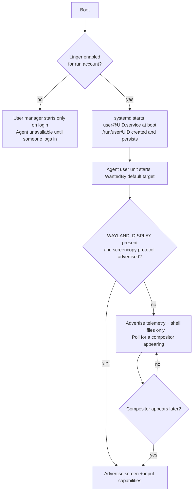
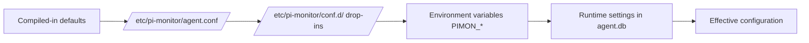
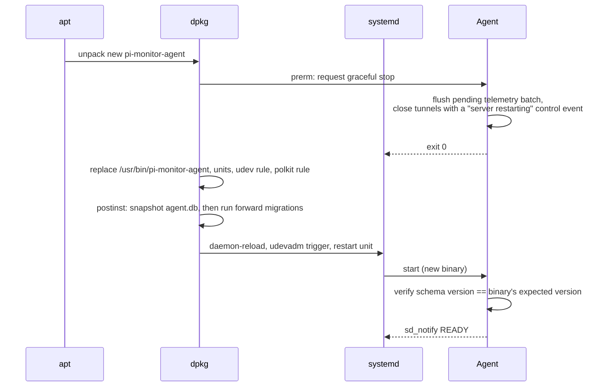
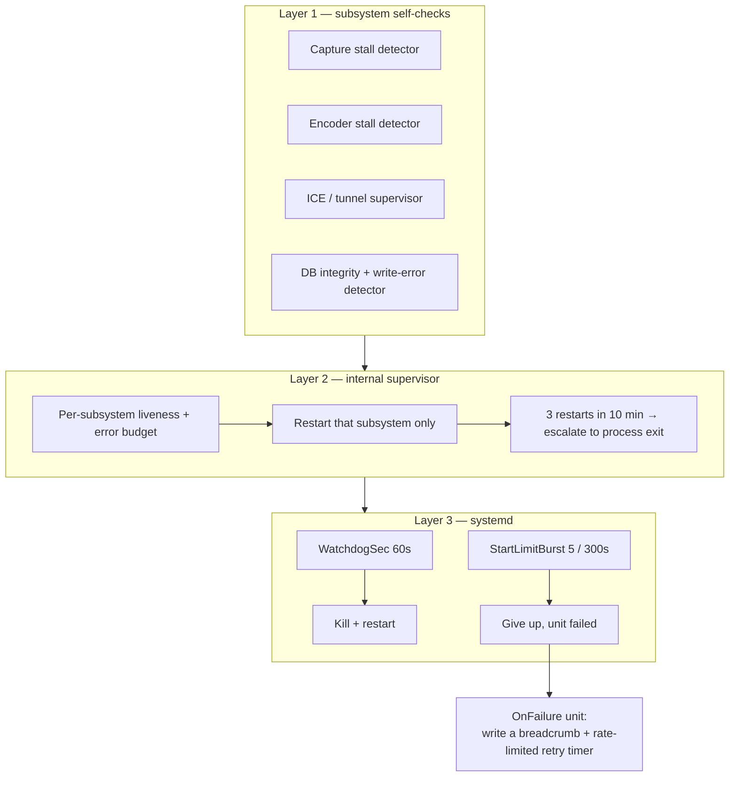

# 11 — Agent Deployment

How the **Agent** is packaged, installed, provisioned, permitted, hardened, upgraded, operated and destroyed on a Raspberry Pi.

**Audience:** whoever builds the `.deb`, whoever writes the systemd units, and the Owner who runs the install. Everything here is a specification, not a runbook to copy — there is deliberately no code, no unit-file text, no configuration-file text, and no udev-rule text. Directives and fields are described in tables; the implementer writes the literals.

**Read first:** [00-GLOSSARY](00-GLOSSARY.md). **Related:** [03-ARCHITECTURE](03-ARCHITECTURE.md) (process model, capability advertisement), [04-SECURITY-E2EE](04-SECURITY-E2EE.md) (key hierarchy, pairing ceremony semantics, threat model), [05-PROTOCOL](05-PROTOCOL.md) (capability negotiation, error codes, version compatibility), [06-DATA-MODEL](06-DATA-MODEL.md) (SQLite schema, retention, metric sources).

Residual risks in this document are numbered `RR-Dnn` (D = deployment) so they do not collide with the numbering in [04-SECURITY-E2EE](04-SECURITY-E2EE.md).

---

## 1. Scope and supported platform matrix

### 1.1 What this document covers

| In scope | Out of scope |
|---|---|
| Packaging, repository, signing | Rendezvous service deployment (its own concern) |
| systemd unit design and sandboxing | iOS app distribution (App Store / TestFlight) |
| Linux user, group, device and socket permissions | Wire protocol — see [05-PROTOCOL](05-PROTOCOL.md) |
| First-run provisioning and QR display | Cryptographic design — see [04-SECURITY-E2EE](04-SECURITY-E2EE.md) |
| Upgrade, rollback, logging, health, limits | Database schema — see [06-DATA-MODEL](06-DATA-MODEL.md) |
| Uninstall, key destruction, host hardening | Multi-user / multi-owner operation (v1 is single-Owner) |

### 1.2 Hardware and OS support matrix

The Agent is a single static `aarch64` binary. **32-bit Raspberry Pi OS is not supported at all** — not as a degraded mode, not as best-effort. The build target is `aarch64-unknown-linux-gnu` (glibc, dynamically linked against glibc only) or `aarch64-unknown-linux-musl` for a fully static build; see [ADR-0005](adr/ADR-0005-agent-language.md).

| Model | SoC / CPU | RAM | HW H.264 encode | Telemetry + Shell | Remote Desktop | Verdict |
|---|---|---|---|---|---|---|
| Pi 5 (4/8/16 GB) | BCM2712, 4×A76 @ 2.4 GHz | 4–16 GB | **None** (HEVC *decode* only) | Full | Software x264 only, 720p30 default | **Supported — primary target** |
| Pi 4 B (2/4/8 GB) | BCM2711, 4×A72 @ 1.5–1.8 GHz | 2–8 GB | Yes — V4L2 M2M (`bcm2835-codec`) | Full | HW encode, up to 1080p30 | **Supported — primary target** |
| Pi 400 | BCM2711 (Pi 4 class) | 4 GB | Yes — same as Pi 4 | Full | HW encode, up to 1080p30 | **Supported** |
| Pi 5-based CM5 / Pi 500 | BCM2712 | 4–16 GB | None | Full | Same as Pi 5 | **Supported, untested** — treat as Pi 5 |
| CM4 | BCM2711 | 1–8 GB | Yes | Full | HW encode; 1 GB variant memory-tight | **Supported** (≥ 2 GB) |
| Pi 3 B/B+ | BCM2837, 4×A53 @ 1.2–1.4 GHz | 1 GB | Yes (VideoCore IV) | Degraded | Not supported by default — see below | **Community best-effort** |
| Pi Zero 2 W | BCM2710A1, 4×A53 @ 1 GHz | **512 MB** | Yes (VideoCore IV) | Degraded (reduced sample rate, shorter retention) | **Not supported** | **Telemetry-only, best-effort** |
| Pi Zero / Zero W / Pi 1 / Pi 2 | ARMv6 / ARMv7 | 256–1024 MB | — | — | — | **Unsupported** (no 64-bit userspace on ARMv6; ARMv7 out of build scope) |

Honest notes on the marginal models:

- **Pi Zero 2 W.** It *does* have the legacy VideoCore IV H.264 encoder, so hardware encoding is theoretically available. It is nevertheless listed as no-remote-desktop for two independent reasons: (a) 512 MB total RAM, shared with the GPU, leaves no room for a compositor plus a capture pipeline plus SQLite; (b) Raspberry Pi OS does **not** run a Wayland session on this model by default — it runs X11 — and `zwlr_screencopy_v1` does not exist on X11. Software encoding on 4×A53 @ 1 GHz is not remotely viable: a 720p30 x264 ultrafast encode needs roughly 4–6× the available integer throughput (estimate — validate with benchmark BM-ENC-04).
- **Pi 3.** Same X11-session problem. Telemetry and shell work; sampling interval should be raised to 30 s and retention shortened.
- **Pi 5's missing encoder is the single most consequential hardware fact in this project.** The Pi 5 removed the H.264 hardware encoder that every earlier model had. There is no firmware flag, no overlay, and no `vcgencmd` incantation that brings it back. Everything about the screen pipeline on the flagship model is therefore CPU-bound. See [ADR-0004](adr/ADR-0004-screen-streaming.md) and §11 below.

### 1.3 OS, session and compositor matrix

| OS | Debian base | Default session on Pi 4/5 | `zwlr_screencopy_v1` | Status |
|---|---|---|---|---|
| Raspberry Pi OS **Trixie**, 64-bit, Desktop | Debian 13 | labwc (wlroots) | Yes | **Supported — preferred** |
| Raspberry Pi OS **Bookworm**, 64-bit, Desktop, 2024-10-22 or later | Debian 12 | labwc (wlroots) | Yes | **Supported** |
| Raspberry Pi OS **Bookworm**, 64-bit, Desktop, pre-2024-10 | Debian 12 | wayfire (wlroots) | Yes | **Supported** — both compositors are wlroots-based |
| Raspberry Pi OS **Lite**, 64-bit (Bookworm or Trixie) | 12 / 13 | none | n/a | **Supported, telemetry + shell only** unless a compositor is installed |
| Any Raspberry Pi OS **X11 session** | — | Xorg / mutter / openbox | **No** | **Screen channel unsupported.** Input via `uinput` still works, but with nothing to capture it is useless. |
| Ubuntu Server / Ubuntu Desktop for Pi, 64-bit | — | GNOME (Mutter, not wlroots) | No — needs PipeWire portal path | **Best-effort.** Capture must go through xdg-desktop-portal + PipeWire, which on GNOME requires an interactive consent dialog per session — hostile to an unattended daemon. See RR-D01. |
| 32-bit anything | — | — | — | **Unsupported** |

> **Residual risk RR-D01:** the PipeWire + `xdg-desktop-portal` capture path requires a user consent dialog that, on portal backends without a persistence mode, must be re-approved after every compositor restart. On labwc/wayfire we avoid it entirely by using `zwlr_screencopy_v1`, which has *no* consent gate — a deliberate trade of user-consent UX for unattended reliability. On any non-wlroots compositor the Agent will intermittently lose screen capability without user action. This is why non-wlroots compositors are best-effort only.

### 1.4 Deployment modes

Two supported run modes. The choice is made at install time and is recorded in the configuration; switching modes later is a supported but non-trivial operation (§8.5).

| Mode | Runs as | Managed by | Capabilities | When to use |
|---|---|---|---|---|
| **Session mode** (default, full-featured) | The desktop user (the account created by Raspberry Pi Imager) | `systemctl --user` + `loginctl enable-linger` | telemetry, shell, screen, input, files, actions | Any Pi with a Wayland desktop session — i.e. the Remote Desktop feature is wanted |
| **System mode** (headless) | Dedicated system user `pimon` | `systemctl` (system manager) | telemetry, shell, files, actions. **No screen, no input.** | Raspberry Pi OS Lite, or servers where no graphical session exists or is wanted |

Section 4 explains, at length, why session mode is the default and why the obvious alternative — a system service that reaches into the desktop user's Wayland socket — does not work.

---

## 2. Installation approaches

### 2.1 Comparison

Scores: ● good, ◐ acceptable, ○ poor.

| Criterion | **apt repository + signed `.deb`** | `curl \| sh` install script | OCI container (Docker/Podman) | Manual binary + hand-written unit |
|---|---|---|---|---|
| Integrity / provenance | ● Repo `InRelease` signature verified by `apt` on every fetch; per-package hashes | ○ TLS only; one compromised host or DNS answer = arbitrary root code | ◐ Image digest pinning possible, rarely done; registry trust | ○ Manual hash checking, never done in practice |
| Unattended security updates | ● Works with `unattended-upgrades` out of the box | ○ None | ◐ Needs Watchtower or similar, which is itself a risk | ○ None |
| Upgrade path | ● Standard, atomic, `dpkg` maintainer scripts sequence migrations | ◐ Re-run the script and hope | ● Pull new tag | ○ Manual |
| Rollback | ● Install a pinned older version from the pool | ○ None | ● Re-pin the old digest | ○ Manual |
| Uninstall cleanliness | ● `remove` vs `purge` distinction; `dpkg` tracks every file | ○ Leaves debris; needs a bespoke uninstall script that may not exist | ● Delete container + volume | ○ Debris guaranteed |
| Access to `/dev/uinput` | ● udev rule shipped and triggered by the package | ◐ Script can write one | ○ Requires `--device` plus matching group inside the container | ◐ Manual |
| Access to the Wayland socket | ● Runs as a user unit inside the session — the socket is simply there | ◐ Same, if the script gets it right | ○ Requires bind-mounting `/run/user/<uid>` and matching UID/GID across the namespace boundary | ◐ Manual |
| Access to `/proc`, `/sys`, firmware mailbox | ● Native | ● Native | ○ Needs `--pid=host`, host `/sys` and `/proc` mounts, `/dev/vcio` | ● Native |
| systemd integration (`Type=notify`, watchdog, journald) | ● Native | ◐ Script writes a unit | ○ Container has no host systemd; watchdog and `sd_notify` are lost or must be proxied | ◐ Manual |
| Offline / air-gapped install | ● Copy the `.deb`, `dpkg -i` | ○ Needs network | ◐ `docker save`/`load`, large | ● Copy the binary |
| Multi-suite support (Bookworm + Trixie) | ● Two suites in one repo | ◐ Script branches | ● One image | ◐ Manual |
| Packaging effort for us | ○ Highest — repo hosting, signing infrastructure, maintainer scripts | ● Lowest | ◐ Medium | ● Lowest |
| **Verdict** | **RECOMMENDED** | Rejected | Rejected as primary; see §2.3 | Supported as an escape hatch only |

### 2.2 Decision

The Agent **MUST** be distributed as a signed `.deb` from a project-operated apt repository. A standalone `.deb` download (same artefact, same signature, verifiable with `dpkg-sig`/`debsig` or by checking the published hash) **MUST** also be offered for offline installs. A `curl | sh` bootstrap **MAY** exist, but its only permitted action is to install the keyring package and the sources entry — it **MUST NOT** install the Agent itself, and it **MUST** print the keyring fingerprint before doing anything.

Rationale in one sentence: this is a daemon that will hold long-lived cryptographic identity, inject synthetic keyboard events into the Owner's desktop, and hand out an interactive root-capable shell — the delivery channel for its updates is a security control of exactly the same weight as the Noise handshake, and `apt` is the only option on this platform with a real signature chain, a real rollback story, and a real uninstall story.

### 2.3 Why not a container

A container is the reflexive modern answer and it is the wrong one here. The Agent is, by design, a device-and-session integration daemon. To make it work in a container you must undo the container:

| What the Agent needs | What the container must be given | Isolation remaining |
|---|---|---|
| Inject keyboard/pointer events | `--device=/dev/uinput` plus a matching `input` GID inside the image | Container can now type into the host desktop as the Owner — total host compromise from inside |
| Capture the screen | Bind-mount `/run/user/<uid>` (host UID must equal container UID), `$WAYLAND_DISPLAY`, and `/dev/dri/*` | Container can screenshot and drive the host GUI |
| Host telemetry (CPU, memory, network, processes) | `--pid=host`, host `/proc`, host `/sys` read-only, `--network=host` for correct interface stats | Namespace isolation for PID and network gone |
| `vcgencmd get_throttled` | `/dev/vcio` (and `/dev/vchiq` on pre-Pi-5 models), `video` group | Firmware mailbox access |
| Service management Actions (restart a unit, reboot) | Host D-Bus socket, or host systemd socket | Container can command the host init system |
| PTY shell that is actually useful | Either `--pid=host --privileged` or an out-of-container spawn helper | Nothing |
| Watchdog + `Type=notify` + journald structured logs | `NOTIFY_SOCKET` proxying, or give up on all three | Degraded supervision |

After all of that the container provides one genuine benefit — filesystem packaging — and zero security benefit, while adding a second update mechanism, a second logging path, a second resource-limit mechanism, and a storage layer that is actively bad for SD-card write amplification (overlayfs copy-up on SQLite files). A container image **MAY** be published for the telemetry-only System mode, where the compromise list above shrinks to host `/proc`, host `/sys` and `/dev/vcio`, but it is not the recommended path and the screen and input channels **MUST** report themselves unavailable in it.

### 2.4 Repository and signing model

| Element | Specification |
|---|---|
| Repository layout | Standard Debian pool. Suites: `bookworm`, `trixie`. Components: `main`. Architectures: `arm64` **only** — publishing no other architecture is itself a guard against a mis-targeted install. |
| Index signing | Inline-signed `InRelease` (detached `Release.gpg` also published for old clients). Every `Packages` index hashed in `Release`; every `.deb` hashed in `Packages`. |
| Signing key | A dedicated repository signing key, RSA-4096 or Ed25519, kept **offline** on a hardware token. It signs only indices. Never the same key as the developer commit-signing key. |
| Key distribution | A tiny `pi-monitor-archive-keyring` package installing a dearmoured keyring into `/usr/share/keyrings/`. The keyring package is *also* the bootstrap artefact, fetched over HTTPS with HSTS. |
| Sources entry | deb822-format `.sources` file under `/etc/apt/sources.list.d/`, with the `Signed-By` field pinning the keyring path. **`apt-key` MUST NOT be used** — it is deprecated in Debian 12 and gone in Debian 13, and its global keyring means any project key can sign any repository. |
| Metadata freshness | `Release` carries a `Valid-Until` of **7 days**. This bounds an index-replay/freeze attack, in which a network attacker serves an old but validly-signed index to withhold a security update, to one week. Publishing infrastructure must therefore re-sign indices at least weekly even with no package changes. |
| Package signing | Per-package `debsig` signatures are additionally published. `apt` does not check them by default; they exist so an offline `.deb` can be verified without the repository. |
| Reproducibility | Builds SHOULD be reproducible; the build attestation (source commit, toolchain hash, output SHA-256) is published alongside each release so a third party can rebuild and compare. |
| Channels | `stable` and `beta` are separate **suites**, not separate repositories, so a user switches channel by editing one field and `apt` handles the transition. |

> **Residual risk RR-D02:** trust in the repository bootstraps from a keyring fetched over TLS on first install — an unavoidable trust-on-first-use step at the *distribution* layer, even though the *pairing* layer explicitly rejects TOFU (see [04-SECURITY-E2EE](04-SECURITY-E2EE.md)). Mitigations: the key fingerprint is published in the source repository, in the release notes, and in this documentation set, and the installer prints it for comparison. A user who does not compare it is trusting their DNS and CA path exactly once. There is no way to eliminate this without an out-of-band key delivery the product cannot mandate.

> **Residual risk RR-D03:** a compromise of the build or signing pipeline pushes attacker-controlled root code to every installation. This is the single highest-impact risk in the whole system and it is *not* mitigated by the E2EE design — the Noise layer protects against everyone except the party that wrote the software. Mitigations: offline signing key on hardware, two-person release approval, reproducible builds so third parties can detect divergence, and published build attestations. Accepted, documented, not eliminated.

---

## 3. First-run provisioning

### 3.1 Sequence

```mermaid
sequenceDiagram
    autonumber
    actor Owner
    participant Pi as Agent (Pi)
    participant RDV as Rendezvous
    participant App as Client (iOS)

    Owner->>Pi: apt install pi-monitor-agent
    Note over Pi: postinst: create user/group,<br/>install udev rule + modules-load entry,<br/>create /var/lib/pi-monitor,<br/>enable but DO NOT start service
    Owner->>Pi: pi-monitor-agent setup (interactive, one time)
    Pi->>Pi: Generate K_AS (X25519) and K_ARI (Ed25519)<br/>write to keys dir, mode 0600
    Pi->>Pi: Derive and display fingerprint of K_AS<br/>(8×4 Base32 groups + 6 words/emoji)
    Pi->>RDV: Register presence: RID, K_ARI public,<br/>signed challenge response
    RDV-->>Pi: Accepted; RID confirmed
    Pi->>Pi: Mint K_PT (single-use, TTL 600 s)
    Pi->>RDV: Deposit pairing token digest for RID
    Pi->>Owner: Render pairing QR (desktop window or terminal)
    Owner->>App: Scan QR with Client
    App->>App: Generate K_CS (X25519) + K_CRI (Ed25519),<br/>wrap K_CS under Secure Enclave key K_SEW
    App->>RDV: Claim pairing token, signal to RID
    RDV->>Pi: Relay opaque signalling blob
    App->>Pi: Noise_IK handshake (msg1 carries K_PT proof)
    Pi->>Pi: Verify K_PT: unused, unexpired, correct digest
    Pi-->>App: Noise_IK msg2
    Pi->>Owner: Display Client fingerprint, request confirmation
    App->>Owner: Display Agent fingerprint, request confirmation
    Owner->>Pi: Confirm — fingerprints match
    Owner->>App: Confirm — fingerprints match
    Pi->>Pi: Persist paired client record; burn K_PT
    Note over Pi,App: Paired. Subsequent sessions need no token.
```

The ceremony's cryptographic content is specified in [04-SECURITY-E2EE](04-SECURITY-E2EE.md); this document owns only how it is *presented* on the Pi. Two properties are deployment-relevant and non-negotiable:

1. **The service is enabled but not started by `postinst`.** The Agent MUST NOT generate keys or contact the network as a side-effect of package installation. Provisioning is an explicit, interactive, Owner-initiated step. This keeps `apt install` free of surprising network activity and means an image containing the package can be flashed to many cards without every card sharing an identity.
2. **Fingerprint confirmation is two-sided and mandatory.** The Pi displays the Client's fingerprint and requires local confirmation. A stolen QR alone does not complete pairing.

### 3.2 QR payload fields

The payload is a compact CBOR map ([05-PROTOCOL](05-PROTOCOL.md) §serialization), Base32-or-Base64url encoded inside a custom URI scheme so that iOS can route a camera scan directly to the Client. Field *contents* are described here; no literal encoding appears in this document.

| Field | Type | Size | Required | Purpose |
|---|---|---|---|---|
| `v` — payload version | unsigned int | 1 B | Yes | Lets the Client reject a QR it cannot parse, and lets the format evolve |
| `pv` — protocol version range | two unsigned ints | 2–4 B | Yes | Min/max wire protocol the Agent speaks; Client fails fast on mismatch |
| `apk` — Agent static public key | byte string | 32 B | Yes | Public half of `K_AS`. This is what makes the handshake `Noise_IK` rather than `Noise_XX` |
| `rid` — Rendezvous id | byte string | 16 B | Yes | Opaque, rotatable routing identifier. Reveals nothing about the Pi |
| `rdv` — Rendezvous host | text string | ≤ 64 B | Yes | Origin of the Rendezvous deployment (supports self-hosting, see [ADR-0008](adr/ADR-0008-rendezvous-hosting.md)) |
| `pt` — pairing token | byte string | 32 B | Yes | `K_PT`. Single-use, 600 s TTL, high entropy |
| `exp` — expiry | unsigned int (epoch seconds) | 4–5 B | Yes | Client refuses an expired QR without a round trip |
| `name` — Agent display name | text string | ≤ 32 B | Yes | Human label, defaults to hostname; purely cosmetic |
| `mdl` — hardware model hint | text string | ≤ 16 B | No | Lets the Client pre-configure screen defaults (e.g. Pi 5 → software-encode profile) |
| `crc` — payload checksum | byte string | 4 B | Yes | Truncated BLAKE2s over the other fields; catches mis-scans before any network use |

Total payload ≈ 100–130 bytes → roughly 150–190 characters after text encoding → QR version 7–9 at error-correction level M (45×45 to 53×53 modules). This is comfortably scannable from a phone at 30 cm from a 5 cm printed or screen-rendered code.

**The QR is a secret.** It contains `pt`. Anyone who photographs it within 600 s and has network access may *attempt* pairing. What stops them is the mandatory Owner confirmation on the Pi, which shows the would-be client's fingerprint. Treat a leaked QR as a nuisance, not a breach — but regenerate it.

### 3.3 Rendering the QR

| Install type | Primary rendering | Fallbacks |
|---|---|---|
| **Desktop** (labwc/wayfire session present) | A borderless always-on-top window on the Pi's display showing the QR, the Agent fingerprint (Base32 groups **and** the 6-word/emoji sequence), and a live countdown to token expiry | Same PNG written to disk; terminal rendering if launched over SSH |
| **Lite / headless** (no compositor) | QR rendered in the terminal using Unicode upper-half-block characters (two QR rows per text line), plus the fingerprint in both encodings, plus the countdown | (a) PNG written to a path the Owner can copy off with `scp`; (b) manual Base32 bundle entry in the Client |

Terminal rendering detail worth stating because it bites implementers: a 45×45-module QR plus the mandatory 4-module quiet zone is 53×53 modules, which at two rows per text line is **27 lines by 53 columns**. That does not fit an 80×24 terminal. The Agent MUST therefore (a) query the terminal size, (b) if the height is insufficient, re-encode at error-correction level L to reduce the version, and (c) if it still does not fit, print a clear instruction to enlarge the window or use the PNG/manual path rather than emitting a truncated, unscannable code. Rendering MUST honour the terminal's background colour — an inverted QR does not scan on some readers, so the quiet zone must be explicitly painted, never assumed.

**Manual entry fallback.** The full bundle as Base32 is roughly 26 groups of 5 characters. It is tedious and is offered only as a last resort. A *shorter* code that makes the Client fetch the bundle from Rendezvous was considered and **rejected**: it would hand `pt` and `apk` to the Rendezvous operator. Although the two-sided fingerprint check would still hold, it needlessly erodes the zero-knowledge property that [04-SECURITY-E2EE](04-SECURITY-E2EE.md) is built on, and "the other control saves us" is not a good reason to weaken a control.

### 3.4 Re-pairing, additional devices, and rate limits

| Operation | How | Constraints |
|---|---|---|
| Pair the first device | `setup` subcommand as in §3.1 | Requires local access (console, SSH, or desktop) |
| Add a second device (e.g. iPad, family member's phone) | `pair` subcommand on the Pi mints a fresh `K_PT` and shows a new QR; **or** an already-paired Client requests a QR over the `control` channel, which the Agent renders on its display and *also* streams to the requesting Client for on-screen scanning by the new device | Remote-initiated pairing requires an existing authenticated session and still requires confirmation on the Pi |
| Replace a lost phone | Revoke the old client record, then pair as new. Revocation semantics and propagation live in [04-SECURITY-E2EE](04-SECURITY-E2EE.md) | Requires local access if no other paired device remains |
| Rotate the Agent identity | `rekey-identity` subcommand generates a new `K_AS`; **all existing pairings are invalidated** and every client must re-pair | Deliberately disruptive; this is the "the Pi may have been compromised" button |
| Rotate `RID` only | `rotate-rendezvous-id` subcommand; existing pairings survive because they are bound to `K_AS`, not `RID` | Paired clients learn the new `RID` over an existing session; a client that is offline during rotation must be re-paired |

Rate limiting, enforced Agent-side (Rendezvous enforces its own, independently — see [05-PROTOCOL](05-PROTOCOL.md)):

| Limit | Value | On breach |
|---|---|---|
| Concurrent valid pairing tokens | 1 | Minting a new token invalidates the previous one |
| Token lifetime | 600 s | Expired token → handshake rejected, error in the 1100–1199 range |
| Token uses | 1 | Burned on successful pairing, and on the first *failed* fingerprint confirmation |
| Failed pairing attempts against a live token | 5 | Token burned, 15-minute cooldown before a new one can be minted, event written to the audit log |
| Pairing attempts per hour (all tokens) | 20 | Pairing subsystem disabled for 1 hour; requires local access to re-enable |
| Unpaired-agent presence registration | Allowed | An Agent with zero paired clients still registers presence, otherwise it could never be paired remotely |

---

## 4. Users, groups, devices and the Wayland socket problem

This section exists because this is the part of the design most often got wrong, and getting it wrong produces a daemon that works when the developer runs it by hand and silently fails to capture the screen when systemd starts it.

### 4.1 The problem, stated precisely

The Agent needs three things that live in three different security domains:

| Need | Lives in | Reachable by |
|---|---|---|
| `zwlr_screencopy_v1` capture | The Wayland socket at `/run/user/<uid>/wayland-0` | Only processes running as that UID |
| Synthetic input injection | `/dev/uinput`, a character device | Any process whose GID matches the device's group |
| Privileged Actions (reboot, restart a unit, apply updates) | systemd / logind over D-Bus, gated by polkit | Root, or a user with a polkit rule, or an active local session |

The trap is `/run/user/<uid>`. It is created by `pam_systemd` and its permissions are **0700, owned by that user**. Group membership does not help: even if a `pimon` system user were added to the desktop user's primary group, it could not `chdir` into `/run/user/1000` to reach the socket, because the *directory* denies group and other entirely. Setting `XDG_RUNTIME_DIR` in the unit does not change any permission; it only changes where the process looks. This is a real, hard failure, not a configuration subtlety.

### 4.2 The three options

| Option | Description | Screen capture | uinput | Privileged Actions | Verdict |
|---|---|---|---|---|---|
| **(a) User service as the desktop user** | `systemctl --user` unit owned by the desktop user, kept alive across logouts with `loginctl enable-linger` | ● Native — the socket belongs to us | ● Works if the desktop user is in the device's group (it usually already is in `input`) | ◐ Needs polkit rules or a small system helper | **RECOMMENDED** |
| **(b) System service as `pimon`, reaching into the session** | System unit, `pimon` added to the desktop user's group, `XDG_RUNTIME_DIR` pointed at `/run/user/1000` | ○ **Does not work.** `/run/user/1000` is 0700. It can only be made to work by weakening that directory to 0750 — which exposes every session secret (keyring sockets, PipeWire, D-Bus, gcr, portal sockets) of the desktop user to another account, permanently, for every application. Unacceptable | ● Trivial | ● Trivial | **REJECTED** |
| **(c) Split: privileged system service + session-scoped capture helper** | System service holds keys, tunnel, telemetry, storage; a small helper autostarted in the graphical session owns capture and input and talks to the daemon over a Unix socket | ● Works | ● Works | ● Works | Correct but heavier: two binaries, an internal IPC surface, two lifecycles, and the IPC socket becomes a new local attack surface. **Deferred** |

### 4.3 Decision

**Session mode uses option (a).** The Agent runs as a `systemctl --user` unit under the desktop user, with `loginctl enable-linger` so it survives logout and starts at boot without a login. **System mode** (headless Lite installs) runs a system unit as `pimon` with the screen and input channels advertised as unavailable.

Consequences, stated honestly:

| Consequence | Detail | Mitigation |
|---|---|---|
| The Agent runs with the full ambient authority of the desktop user | It can read the Owner's home directory, their SSH keys, their browser profile | This is *exactly* the authority the Remote Shell grants anyway. The Agent is not a privilege boundary against its own Owner; it is a remote-access product. Stated plainly in [04-SECURITY-E2EE](04-SECURITY-E2EE.md) |
| Privileged Actions are not directly available | A user process cannot restart a system unit or reboot without authorisation | Two paths, both specified in §4.6 — polkit rules scoped to an allow-list, or a minimal system helper |
| The `pimon` system user still exists | It owns the optional helper and the System-mode deployment | The `pimon` **group** is the shared-access group for `/var/lib/pi-monitor`; the `pimon` **user** never holds `K_AS` in Session mode |
| Two possible owners of the state directory | Session mode: desktop user. System mode: `pimon` | Mode is recorded at install; a mode switch requires an explicit `chown` step run by the maintainer script (§8.5) |
| `systemd-journal` access | A plain user can read only their own journal | Add the run account to the `systemd-journal` group if journald-derived telemetry is enabled |
| Docker telemetry | Needs the `docker` group, which is **root-equivalent** | Off by default. Enabling Docker telemetry is a documented privilege escalation and the installer must say so |

> **Residual risk RR-D04:** in Session mode the Agent inherits the desktop user's full authority, including any group memberships that account already has (commonly `sudo`). Compromise of the Agent process is therefore equivalent to compromise of the Owner's account, and — via `sudo` — plausibly of the whole machine. No sandbox on the Agent's own unit can change this, because the Remote Shell feature deliberately hands that same authority to the Client by design. The honest framing is: *the Agent is not a containment boundary; the Noise handshake is.* Anyone who completes the handshake owns the Pi.

### 4.4 Filesystem objects

Ownership of the state tree follows the run mode. `RUNAS` below means the desktop user in Session mode, `pimon` in System mode.

| Object | Path | Owner | Group | Mode | Why |
|---|---|---|---|---|---|
| Binary | `/usr/bin/pi-monitor-agent` | root | root | 0755 | Not writable by the account that runs it — a compromised Agent cannot rewrite itself |
| Privileged helper (optional) | `/usr/libexec/pi-monitor/helper` | root | root | 0755 | Same |
| Config | `/etc/pi-monitor/agent.conf` | root | `pimon` | 0640 | Readable by the run account, writable only by root. Not world-readable — it may contain a self-hosted Rendezvous URL and TURN credentials |
| Config drop-ins | `/etc/pi-monitor/conf.d/` | root | `pimon` | 0750 | Package upgrades never clobber Owner overrides |
| State root | `/var/lib/pi-monitor/` | `RUNAS` | `pimon` | 0750 | No world access to telemetry history |
| Database | `/var/lib/pi-monitor/agent.db` (+ `-wal`, `-shm`) | `RUNAS` | `pimon` | 0640 | WAL and SHM files must share the directory and ownership or SQLite fails obscurely |
| Key directory | `/var/lib/pi-monitor/keys/` | `RUNAS` | `RUNAS` | **0700** | Group is deliberately *not* `pimon` here — nothing but the run account ever reads keys |
| `K_AS`, `K_ARI` key files | `/var/lib/pi-monitor/keys/*` | `RUNAS` | `RUNAS` | **0600** | See §12 for why file permissions are not the real protection |
| Paired-client records | in `agent.db` | — | — | — | Public keys only; no secrets |
| Runtime dir | `/run/pi-monitor/` | `RUNAS` | `pimon` | 0750 | Sockets, PID/state files. Tmpfs — nothing survives reboot |
| Helper socket | `/run/pi-monitor/helper.sock` | root | `pimon` | 0660 | Only the run account may ask for privileged Actions |
| Log file (optional sink) | `/var/log/pi-monitor/agent.log` | `RUNAS` | `adm` | 0640 | Matches Debian convention for `adm`-readable logs |
| Diagnostic bundles | `/var/lib/pi-monitor/diag/` | `RUNAS` | `RUNAS` | 0700 | Bundles may contain host detail; never group-readable |

### 4.5 Devices

| Device | Present on | Needed for | Access mechanism | Notes |
|---|---|---|---|---|
| `/dev/uinput` | All (module `uinput`) | Virtual keyboard + pointer | Package ships a udev rule whose **effect** is: set group ownership to `input` and mode 0660 on the `uinput` kernel device | Raspberry Pi OS does not reliably grant any non-root account access by default, and the default varies by systemd version — the package MUST ship its own rule rather than depend on the distribution's |
| — module autoload | — | — | Package ships a `modules-load.d` entry naming `uinput` | **`/dev/uinput` does not exist until the module is loaded.** A first-boot install with no reboot will find no device node. The maintainer script MUST load the module immediately as well as arranging boot-time load |
| `/dev/dri/card*`, `/dev/dri/renderD*` | All with KMS | DMA-BUF import of captured frames, optional GPU-assisted colour conversion | Group `video` / `render` | The desktop user is normally already a member |
| `/dev/vcio` | All | `vcgencmd get_throttled`, core temperature, voltage | Group `video` | The firmware mailbox |
| `/dev/vchiq` | Pi 0–4 (absent/changed on Pi 5) | Legacy firmware interface used by some `vcgencmd` builds | Group `video` | Presence differs by model; the rule must tolerate absence |
| `/dev/video*` (V4L2 M2M encoder) | Pi 0–4 only | Hardware H.264 encode | Group `video` | **Absent as an encoder on Pi 5** — the Agent must detect this at startup rather than assume, and fall back to x264 |

Group memberships required by the run account: `input` (uinput), `video` and `render` (DRI, firmware mailbox, V4L2), optionally `systemd-journal` (journal telemetry), optionally `docker` (container telemetry — root-equivalent, off by default). The maintainer script adds these; a change to group membership does **not** take effect for an already-running session, so the installer must state that a reboot or full re-login is required after first install.

### 4.6 Privileged Actions

Actions are the allow-listed operations from [00-GLOSSARY](00-GLOSSARY.md) — never arbitrary commands, which are the `shell` channel's job.

| Action class | Example | Mechanism | Authorisation |
|---|---|---|---|
| Power | `reboot`, `poweroff` | `org.freedesktop.login1` over D-Bus | Granted to an *active local session* by default. **With linger and no autologin there may be no active session**, in which case polkit denies it and a rule is required |
| Unit management | `service.restart`, `service.stop` | `org.freedesktop.systemd1` over D-Bus | Requires an admin polkit authorisation by default even for an active session. A shipped polkit rule MUST grant it **only** for unit names on the configured allow-list, and **only** to the run account |
| Package updates | `system.update` | The privileged helper, invoking the package manager | Helper enforces its own allow-list; never accepts an argument vector from the Client |
| Agent self-management | `agent.restart`, `agent.rotate-keys` | Internal | No external authorisation needed |

The polkit rule shipped by the package **MUST** be scoped by (subject = run account) × (action id) × (unit name pattern from the allow-list). A blanket "let this user manage all units" rule is a root-equivalence grant and MUST NOT be shipped.

---

## 5. Headless and lingering sessions

### 5.1 Making a user service survive without a login



Two independent facts, frequently conflated:

- **`loginctl enable-linger <user>` makes the *user manager* run without a login.** It creates and preserves `/run/user/<uid>` and starts the user's `default.target` at boot. It does **not** start a graphical session, and it does **not** create a Wayland socket.
- **A Wayland compositor requires a session.** For unattended Remote Desktop you additionally need desktop autologin (the "Desktop Autologin" boot option in `raspi-config`), so that the display manager brings up labwc as the desktop user at boot.

The Agent unit binds to `default.target`, not `graphical-session.target`, so that telemetry and shell keep working on a Lite install or when the compositor has crashed. It detects the compositor dynamically and adjusts its advertised capabilities. This dynamic advertisement is part of the control-channel handshake described in [05-PROTOCOL](05-PROTOCOL.md); the Client's UI greys out Remote Desktop rather than offering a button that fails.

### 5.2 The no-monitor problem

With no HDMI cable attached, a KMS-driven compositor may find no connected output and either refuse to start or come up at a useless fallback geometry. There are three remedies, and one popular non-remedy:

| Remedy | Mechanism | Trade-off |
|---|---|---|
| **Kernel cmdline forced mode** (recommended) | The `video=` kernel parameter naming the connector, geometry, refresh rate and the "force digital/enabled" suffix — e.g. forcing `HDMI-A-1` to a 1080p60 digital mode | Correct under full KMS, survives upgrades, no extra hardware. Requires editing the boot cmdline |
| **HDMI dummy plug** | A passive EDID emulator in the HDMI port | Zero software configuration, always works, costs a few pounds and a physical port |
| **Headless wlroots backend** | Start the compositor against the wlroots headless backend with an explicit virtual output size (environment-selected backend, plus disabling libinput device probing) | Fully virtual, arbitrary resolution, no HDMI at all. But the physical HDMI port then shows nothing, which confuses on-site debugging |
| **`hdmi_force_hotplug` / `hdmi_group` / `hdmi_mode`** — the popular non-remedy | Legacy firmware display settings in the boot config | **These are ignored under the full KMS driver (`vc4-kms-v3d`), which is the default on Bookworm and Trixie.** They only apply to the legacy or fake-KMS display stacks. Advising them is the most common piece of stale Raspberry Pi advice on the internet and it will silently do nothing |

Settings are named here, not written out; the installer's documentation shows the exact syntax for the OS version detected.

### 5.3 Capability advertisement

| Capability | Advertised when | Client behaviour when absent |
|---|---|---|
| `screen.capture` | A wlroots compositor exposing `zwlr_screencopy_v1` is reachable, **or** a portal+PipeWire path is available and consented | Remote Desktop entry point hidden with an explanatory state |
| `screen.encode.hw` | A V4L2 M2M H.264 encoder device is present and opens successfully | Client offers only software-encode profiles and warns about CPU cost |
| `input.inject` | `/dev/uinput` opened successfully **and** `screen.capture` present | Pointer/keyboard controls disabled |
| `shell.pty` | Shell channel enabled in config and a usable login shell exists | Terminal tab hidden |
| `actions.privileged` | Helper socket reachable or polkit rule verified at startup | Action buttons that need privilege shown disabled with a reason |
| `telemetry.*` | Per-series; a series whose source is unreadable is simply not advertised | Chart omitted, no error spam |

Capabilities are re-evaluated on compositor appearance/disappearance and pushed to connected Clients as a control-channel event, not only at session start.

---

## 6. systemd unit design

Two units are specified: `pi-monitor-agent.service` (user unit, Session mode) and the same-named system unit for System mode, plus an optional `pi-monitor-helper.service` (system, socket-activated).

### 6.1 Lifecycle and supervision

| Directive | Value | Effect | Rationale |
|---|---|---|---|
| `Type` | `notify` | systemd waits for readiness before considering the unit started | Ordering correctness; readiness means "keys loaded, DB open, presence registered" |
| `NotifyAccess` | `main` | Only the main process may send readiness/watchdog | Prevents a child (e.g. a PTY) from spoofing liveness |
| `WatchdogSec` | `60s` | systemd kills and restarts the unit if no heartbeat arrives | Catches deadlocks that `Restart=` alone cannot see. The Agent pings at ~20 s, i.e. 3× margin |
| `Restart` | `on-failure` | Restart on non-zero exit, signal, watchdog timeout | Clean shutdown (e.g. `agent.stop` Action) must not loop |
| `RestartSec` | `5s` | Delay before restart | Avoids hot-looping on a persistent fault |
| `StartLimitIntervalSec` / `StartLimitBurst` | `300s` / `5` | Give up after 5 failures in 5 minutes | Prevents infinite crash loops writing to the SD card. See §10 for what happens next |
| `TimeoutStopSec` | `20s` | Grace period for clean teardown | Allows flushing the pending telemetry batch and closing tunnels politely |
| `WantedBy` | `default.target` (user) / `multi-user.target` (system) | Starts without a graphical session | Telemetry must survive a dead compositor — principle P5 |
| `After` | `network-online.target`, `time-sync.target` | Ordering | **`time-sync.target` is not cosmetic** — see §13.9 |
| `OOMScoreAdjust` | `-200` | Less likely to be OOM-killed than ordinary processes | The monitoring daemon should outlive the thing it is monitoring |
| `Nice` | `5` (Agent) | Slightly deprioritised against interactive desktop work | The encoder is CPU-hungry; the Owner's own desktop must stay usable |
| `IOWeight` | `50` | Below default | SQLite batching should not stall interactive I/O on a slow card |

### 6.2 Sandboxing — applied

| Directive | Value | Effect | Rationale |
|---|---|---|---|
| `NoNewPrivileges` | `yes` **on the system unit only** | Blocks setuid/setgid escalation for the process and all children | See §6.4 — this is *inherited by the PTY* and therefore cannot be set unconditionally in Session mode |
| `CapabilityBoundingSet` | *(empty)* | The process can hold no capabilities at all | We genuinely need none: no port binding (principle P2 — no inbound ports), no raw sockets, no module loading. Device access is granted by *group*, not by capability. If a reviewer finds a capability is needed, that is a design bug, not a configuration gap |
| `AmbientCapabilities` | *(empty)* | Nothing granted | Same |
| `RestrictSUIDSGID` | `yes` | Cannot create setuid files | No legitimate need |
| `LockPersonality` | `yes` | Blocks `personality()` ABI switching | Cheap, blocks an exploit-chain primitive |
| `MemoryDenyWriteExecute` | `yes` | No page may be both writable and executable | Blocks classic shellcode injection. **Safe here:** x264 does not JIT — its SIMD paths are hand-written assembly compiled at build time — and Rust emits no runtime code. Must be revisited if a future codec, scripting engine or PipeWire/GStreamer plugin with a JIT is linked in |
| `SystemCallArchitectures` | `native` | Blocks the compat ABI | Removes a well-worn class of syscall-filter bypasses |
| `SystemCallFilter` | `@system-service` minus `@module`, `@mount`, `@reboot`, `@swap`, `@obsolete`, `@cpu-emulation`, `@debug`, `@raw-io` | Kills whole syscall families | **`@reboot` is deliberately excluded even though the product offers a `reboot` Action** — that Action is delegated to logind over D-Bus, so the Agent itself never needs the syscall |
| `RestrictAddressFamilies` | `AF_INET`, `AF_INET6`, `AF_UNIX`, `AF_NETLINK` | Everything else denied | `AF_NETLINK` is genuinely required: `getifaddrs()` on glibc uses `NETLINK_ROUTE`, and ICE host-candidate gathering needs the local interface list. Without it, WebRTC connectivity fails in a way that looks like a network problem |
| `RestrictNamespaces` | `yes` | Cannot create new namespaces | The Agent has no reason to; container *telemetry* reads the Docker API, it does not create namespaces |
| `RestrictRealtime` | `yes` | No SCHED_FIFO/RR | An encoder that could take a realtime priority could wedge the box |
| `ProtectKernelTunables` | `yes` | `/proc/sys`, `/sys` read-only | We only read them |
| `ProtectKernelModules` | `yes` | Cannot load/unload modules | The `uinput` module is loaded by `systemd-modules-load` at boot, not by us |
| `ProtectKernelLogs` | `yes` | No `/dev/kmsg`, no `syslog()` | Kernel messages are obtained from journald instead, which is both safer and better structured |
| `ProtectClock` | `yes` | Cannot set the system clock | We read time; we never set it. Notably relevant given §13.9 |
| `ProtectHostname` | `yes` | Cannot change the hostname | Read-only use |
| `ProtectControlGroups` | `yes` | `/sys/fs/cgroup` read-only | cgroup stats for container telemetry are read-only anyway |
| `ProtectSystem` | `strict` **on the system unit only** | Whole filesystem read-only except `ReadWritePaths` | See §6.4 |
| `ReadWritePaths` | `/var/lib/pi-monitor`, `/run/pi-monitor`, `/var/log/pi-monitor` | The only writable locations | Compromise cannot tamper with `/usr` or `/etc` |
| `PrivateTmp` | `yes` | Private `/tmp` and `/var/tmp` | Blocks `/tmp` symlink races against other local users |
| `UMask` | `0077` | New files are owner-only by default | Defence in depth for key material and diagnostic bundles |
| `MemoryMax`, `CPUQuota`, `TasksMax` | Per §11 | Resource ceilings | Prevents the encoder or a runaway PTY from taking the machine down |
| `ProtectProc` | `default`, `ProcSubset=all` | Other users' `/proc` entries remain visible | **Deliberately relaxed.** `ProtectProc=invisible` would break the top-processes telemetry entirely. What this reopens: the Agent can enumerate all processes and their command lines — which is precisely the feature, and strictly less than the shell channel already grants |
| `ProtectHome` | `no` | Home directories visible and writable | **Deliberately relaxed.** The Remote Shell is by definition a shell in the Owner's home. `read-only` would break the most basic use (editing a file). Reopens: nothing the shell channel does not already grant |
| `PrivateDevices` | **`no`** | Real `/dev` | **Must be relaxed.** `PrivateDevices=yes` mounts a minimal private `/dev` containing only `null`, `zero`, `full`, `random`, `urandom`, `tty` — which hides `/dev/uinput`, `/dev/dri/*`, `/dev/vcio` and `/dev/video*`. With it enabled, input injection, screen capture and throttle telemetry all fail. Reopens: full `/dev` visibility, partially clawed back by `DeviceAllow` on the system unit |
| `DeviceAllow` | `/dev/uinput` rw, `/dev/dri/*` rw, `/dev/vcio` rw, `/dev/video*` rw, plus the standard pseudo-devices | Whitelist of device nodes | Narrows the `PrivateDevices=no` blast radius. **Only reliable on the system unit** — see §6.3 |

### 6.3 User-unit caveats

Systemd sandboxing in a *user* unit is not identical to a system unit, and pretending otherwise produces a false sense of security:

| Directive | Behaviour in a user unit | Consequence |
|---|---|---|
| `DeviceAllow` / `DevicePolicy` | Depends on cgroup delegation of the device controller to the user manager; under cgroup v2 it is implemented with BPF and is **not dependably available** to unprivileged user managers | **MUST NOT be relied upon as a security control in Session mode.** Specify it, but treat the udev group ownership as the real control |
| Namespace-based options (`ProtectSystem`, `PrivateTmp`, `ProtectHome`, `PrivateDevices`) | Require unprivileged user namespaces, which Debian permits but which AppArmor policy on Trixie can restrict | May silently fail to apply, or cause the unit to fail to start. The unit MUST be tested on both Bookworm and Trixie, and the Agent MUST log which sandbox features are actually in effect at startup |
| `User=` / `Group=` | Not applicable | Identity is the session's |
| `CapabilityBoundingSet` | Applies | Already empty in practice for a non-root user |

The Agent therefore **MUST** emit, at INFO level on every start, a line stating which sandbox directives it observes to be active (by probing, e.g. attempting a write to `/usr`), so that a silently-degraded sandbox is visible in the journal rather than assumed.

### 6.4 The sandbox-versus-shell conflict

This is the most important finding in this document and it directly affects the baseline design.

**systemd sandboxing is inherited by children.** A PTY spawned by the Agent process inherits the Agent's mount namespace, its `NoNewPrivileges` bit, and its cgroup. The consequences for a naively-sandboxed Agent:

| Directive on the Agent | Effect on the Remote Shell |
|---|---|
| `ProtectSystem=strict` | `/usr`, `/etc`, `/boot` are read-only *inside the shell*. `apt install` fails. Editing a config file fails. The shell looks broken |
| `ProtectHome=yes` | `cd ~` shows an empty directory |
| `NoNewPrivileges=yes` | **`sudo` and `su` fail outright**, with a confusing error. No privileged operation is possible from the shell, ever |
| `PrivateTmp=yes` | The shell's `/tmp` is not the system `/tmp`; files written there are invisible to everything else |
| `MemoryMax` / `CPUQuota` | A long build started from the shell is throttled by the Agent's budget and may be OOM-killed |
| `SystemCallFilter` | Arbitrary user programs run under the daemon's syscall filter and fail unpredictably |

The fix is architectural, not configurational: **the PTY MUST be spawned outside the Agent's sandbox**, as a transient unit registered with the service manager (the same mechanism `systemd-run` uses), rather than by a plain fork/exec from the Agent. The Agent still owns the PTY master, still frames the bytes onto the `shell` channel, and still enforces authorisation — the baseline in [ADR-0006](adr/ADR-0006-shell-transport.md) is unaffected. Only the *spawn mechanism* changes.

| Shell target | Spawn mechanism | Notes |
|---|---|---|
| Unprivileged shell as the run account | Transient **user** scope via the user service manager | No privilege needed; escapes the Agent's namespace and cgroup |
| Shell as another user, or root | Transient **system** unit requested through `pi-monitor-helper` | Helper enforces the configured `shell.allowed_users` list |
| Fallback if transient-unit spawn is unavailable | Direct fork/exec, with the Agent's unit sandbox correspondingly relaxed | Documented, degraded, logged at WARN |

The same reasoning applies to Actions that shell out (package updates); they too go through the helper.

> **Residual risk RR-D05:** the Remote Shell is deliberately spawned *outside* the Agent's sandbox and therefore has full, unsandboxed authority of the account it runs as. This is intentional and unavoidable for a remote-shell product, but it means every hardening directive on the Agent unit protects only against a *bug in the Agent*, never against a *misuse of the shell by an authenticated peer*. The authentication boundary is the only boundary that matters for the latter.

### 6.5 Hardening we deliberately do not apply

| Directive | Why not |
|---|---|
| `DynamicUser=yes` | Requires ephemeral UIDs; incompatible with stable ownership of `/var/lib/pi-monitor`, with stable group membership for device access, and with a Wayland session |
| `PrivateNetwork=yes` | Absurd for a networking daemon |
| `IPAddressDeny` / `IPAddressAllow` | The Agent must reach arbitrary STUN/TURN/peer addresses discovered at runtime. A meaningful allow-list cannot be written in advance. `AF_*` restriction is the useful control instead |
| `ProtectProc=invisible` | Breaks process telemetry (§6.2) |
| `ProtectHome=yes` | Breaks the shell (§6.2) |
| `RootDirectory=` / chroot | Marginal benefit over `ProtectSystem=strict`; large operational cost (every needed library and device must be replicated) |
| `PrivateUsers=yes` | Breaks device access via group membership, which is the entire uinput strategy |
| `PrivateIPC=yes` | Harmless but pointless; we use no SysV IPC |
| `SELinux`/`AppArmor` profile | Raspberry Pi OS ships no enforcing MAC policy by default; shipping a profile that is never enforced is security theatre. Revisit if Raspberry Pi OS enables AppArmor enforcement by default |

---

## 7. Configuration reference

**Format.** A single INI/TOML-style file at `/etc/pi-monitor/agent.conf`, with section headers and `key = value` lines, plus optional drop-in fragments in `/etc/pi-monitor/conf.d/` merged in lexical order. No file contents appear in this document — only the field definitions below. The package installs a fully-commented reference file whose every value is the documented default, so that the effective configuration is inspectable without running anything.

**Precedence**, lowest to highest:



With one deliberate exception: **security-relevant keys are file-only.** `shell.enabled`, `shell.allowed_users`, `input.enabled`, `actions.allowlist` and `screen.enabled` MAY be *narrowed* from the runtime settings table but never *widened*. The Owner turning the shell off in the config file cannot be overridden by anything a connected Client says. Everything else — sample intervals, bitrates, alert rules — is Client-settable and stored in the database, which is what makes the Pi the source of truth (principle P4).

| Key | Type | Default | Range / values | Reload | Description |
|---|---|---|---|---|---|
| `identity.name` | string | hostname | ≤ 32 chars | hot | Display name shown in the Client and in the pairing QR |
| `identity.key_dir` | path | `/var/lib/pi-monitor/keys` | absolute path | restart | Where `K_AS` and `K_ARI` live |
| `identity.mode` | enum | `session` | `session`, `system` | restart | Run mode (§1.4). Set by the installer; changing by hand requires the state-dir `chown` of §8.5 |
| `rendezvous.url` | string | project default | https origin | restart | Rendezvous deployment; set to a self-hosted origin per [ADR-0008](adr/ADR-0008-rendezvous-hosting.md) |
| `rendezvous.id` | string | generated | 128-bit opaque | restart | `RID`. Rotatable; rotation does not break pairings |
| `rendezvous.presence_interval_s` | int | `30` | 10–120 | hot | Heartbeat cadence. Must be below the 90 s presence TTL |
| `rendezvous.push_enabled` | bool | `true` | — | hot | Whether the Agent asks Rendezvous to trigger content-free APNs pushes for alerts |
| `transport.ice_servers` | list | project STUN | URIs | restart | STUN/TURN servers offered during ICE |
| `transport.turn_enabled` | bool | `true` | — | restart | Allow relayed paths. Disabling guarantees direct-only, at the cost of connectivity |
| `transport.allow_ws_fallback` | bool | `true` | — | hot | Permit the WebSocket-over-Rendezvous last-resort transport. Still Noise-encrypted |
| `transport.max_sessions` | int | `4` | 1–16 | hot | Concurrent Client sessions |
| `transport.idle_timeout_s` | int | `300` | 60–3600 | hot | Tear down an idle Tunnel; see keepalive in [05-PROTOCOL](05-PROTOCOL.md) |
| `screen.enabled` | bool | `true` | — | restart | Master switch. File-only narrowing |
| `screen.encoder` | enum | `auto` | `auto`, `hw_v4l2`, `x264`, `damage_only` | restart | `auto` probes for a V4L2 M2M encoder and falls back to x264 (always, on Pi 5) |
| `screen.max_width` / `max_height` | int | `1280` / `720` | 640×360 – 1920×1080 | hot | Capture is downscaled to this ceiling before encode |
| `screen.max_fps` | int | `30` | 1–60 | hot | Upper bound; the adaptive loop in [05-PROTOCOL](05-PROTOCOL.md) chooses the actual rate |
| `screen.target_bitrate_kbps` | int | `1500` | 100–8000 | hot | Starting point for the rate controller |
| `screen.keyframe_interval_s` | int | `4` | 1–30 | hot | Also forced on request and on damage-heavy scenes |
| `screen.damage_mode` | enum | `auto` | `auto`, `always`, `never` | hot | `auto` switches to damage-rect image encoding on a static desktop (20–150 kbps) and back to video on motion |
| `screen.cursor_overlay` | bool | `true` | — | hot | Composite the cursor into the stream (`zwlr_screencopy_v1` can omit it) |
| `screen.output` | string | first | connector name | hot | Which output to capture on multi-monitor setups |
| `input.enabled` | bool | `true` | — | restart | Master switch for `uinput`. File-only narrowing |
| `input.allow_keyboard` | bool | `true` | — | hot | — |
| `input.allow_pointer` | bool | `true` | — | hot | — |
| `input.grab_blocklist` | list | empty | key names | hot | Key combinations the Agent refuses to inject (e.g. a local kill switch) |
| `shell.enabled` | bool | `true` | — | restart | Master switch. File-only narrowing |
| `shell.program` | path | the run account's login shell | absolute path | hot | — |
| `shell.allowed_users` | list | the run account | usernames | restart | Who a PTY may be spawned as. Including `root` is an explicit, logged decision |
| `shell.max_sessions` | int | `4` | 1–16 | hot | — |
| `shell.scrollback_bytes` | int | `65536` | 0–1 MiB | hot | Replayed to a reconnecting Client |
| `telemetry.interval_s` | int | `10` | 1–300 | hot | Base sampling interval; see [06-DATA-MODEL](06-DATA-MODEL.md) |
| `telemetry.series_enabled` | list | all default series | series names | hot | Disabling a series stops sampling it, not just reporting it |
| `telemetry.process_top_n` | int | `10` | 0–50 | hot | Top-N process rows per sample. `0` disables process telemetry |
| `telemetry.docker_enabled` | bool | `false` | — | restart | Requires `docker` group membership, which is root-equivalent — off by default on purpose |
| `telemetry.journal_enabled` | bool | `false` | — | restart | Requires `systemd-journal` group |
| `storage.path` | path | `/var/lib/pi-monitor/agent.db` | absolute | restart | — |
| `storage.retention_raw_h` | int | `48` | 1–168 | hot | Overrides the canonical ladder in [06-DATA-MODEL](06-DATA-MODEL.md) |
| `storage.retention_1m_d` / `_5m_d` / `_1h_d` | int | `30` / `180` / `730` | — | hot | — |
| `storage.max_bytes` | int | `2147483648` | ≥ 256 MiB | hot | Hard ceiling; oldest rollups are pruned first when approached |
| `storage.batch_interval_s` | int | `30` | 5–300 | hot | Write batching — the primary SD-wear control |
| `alerts.enabled` | bool | `true` | — | hot | — |
| `alerts.max_rules` | int | `64` | 1–256 | hot | — |
| `alerts.min_dwell_s` | int | `60` | 0–3600 | hot | Floor on rule dwell time; prevents notification storms |
| `actions.allowlist` | list | `reboot`, `poweroff`, `service.restart`, `agent.restart` | action names | restart | File-only narrowing. Arbitrary commands are never an Action |
| `actions.unit_allowlist` | list | empty | unit names/globs | restart | Which units `service.*` may touch. Must match the shipped polkit rule |
| `log.level` | enum | `info` | `error`…`trace` | hot | `debug`/`trace` change redaction behaviour — see §9 |
| `log.destination` | enum | `journal` | `journal`, `file`, `both` | restart | — |
| `log.file_max_mb` / `log.file_keep` | int | `16` / `4` | — | restart | Rotation for the optional file sink |
| `limits.memory_max_mb` | int | per model (§11) | — | restart | Mirrors the unit's `MemoryMax`; the Agent self-limits caches to match |
| `limits.cpu_quota_pct` | int | per model (§11) | — | restart | Advisory; informs the encoder's own rate/complexity choices |

Invalid values are a **startup failure, not a silent fallback** — an Agent that quietly ignores `shell.enabled = false` because it could not parse it is a security defect. Hot-reloadable keys are applied on `SIGHUP` and on the `agent.reload` Action, with the applied diff written to the audit log.

---

## 8. Upgrade and rollback

### 8.1 Normal upgrade



Ordering rules that MUST hold:

1. The old binary stops **before** the new binary's migrations run. A running old binary against a migrated schema is undefined behaviour.
2. Migrations run in `postinst`, **before** the service is restarted, and are wrapped in a transaction per migration step.
3. A DB snapshot is taken **before** the first migration of every upgrade (§8.3).
4. `daemon-reload` and a udev trigger happen before restart, so a changed unit or device rule takes effect on the same restart rather than the next reboot.
5. Clients are told the Agent is restarting via a control-channel event, so the Client shows "reconnecting" rather than "connection lost".

### 8.2 Protocol compatibility window

An upgrade must not strand a Client that has not updated (App Store review latency alone guarantees skew). Rules are owned by [05-PROTOCOL](05-PROTOCOL.md); the deployment-relevant summary:

| Skew | Behaviour |
|---|---|
| Client newer than Agent by ≤ 2 minor versions | Full function; Client disables features the Agent does not advertise |
| Agent newer than Client by ≤ 2 minor versions | Full function; Agent speaks the older negotiated version |
| Beyond 2 minor versions | Connection refused with a specific, actionable error in the 1000–1099 range, and the Client shows "update required" naming which side must update |
| Major version change | No compatibility. Announced at least one release in advance; the Agent warns for a full release cycle before dropping support |

### 8.3 Rollback

**Schema migrations are forward-only.** Downgrading the binary while leaving a migrated database in place is therefore **not generally safe** — an older binary may not understand a new column, a renamed table, or a changed index, and in the worst case will write data the newer schema's constraints forbid. Say this out loud in the release notes; do not rely on users inferring it.

The mitigation is a mandatory pre-upgrade snapshot:

| Step | Detail |
|---|---|
| Snapshot | Before the first migration, `postinst` writes a consistent copy of the database (an online backup, not a file copy — WAL makes a naive `cp` unsafe) to `/var/lib/pi-monitor/backups/pre-<version>.db` |
| Retention | The last 3 pre-upgrade snapshots are kept, then pruned oldest-first, subject to `storage.max_bytes` |
| Rollback procedure | (1) stop the service; (2) install the pinned older `.deb`; (3) restore the matching snapshot over the live database; (4) start. **Telemetry recorded between the upgrade and the rollback is lost** — this is stated, accepted, and preferable to a corrupted schema |
| Pinning | `apt-mark hold` on the package, or an apt preferences pin on a specific version, to stop the next `unattended-upgrades` run from re-applying the bad version. **Users who roll back without holding will be silently re-upgraded** |
| Keys | Never touched by upgrade or rollback. `K_AS` and pairings survive both |

### 8.4 Upgrade failure modes

| Failure | Symptom | Automatic handling | Recovery |
|---|---|---|---|
| Migration fails mid-way | `postinst` non-zero, package left half-configured | Migration transaction rolls back; service not started | `dpkg --configure` after fixing, or restore the snapshot |
| New binary crashes at start | Unit hits its start limit | systemd stops trying after 5 attempts in 5 min | Journal has the reason; roll back per §8.3 |
| Disk full during snapshot | `postinst` aborts before migrating | Upgrade refused, old version stays running | Free space; retry |
| Unit file changed but not reloaded | New directives not in effect, no error anywhere | Prevented by mandatory `daemon-reload` in `postinst` | — |
| udev rule changed but not triggered | `/dev/uinput` permissions stale until reboot; input silently fails | Prevented by mandatory `udevadm` trigger | Reboot |
| Group membership added by upgrade | Not effective for the running session | Cannot be fixed automatically | Installer prints a reboot/re-login notice |
| Rendezvous protocol version bumped server-side | Presence registration rejected | Agent backs off and retries, keeps recording locally (principle P5) | Upgrade the Agent |
| Signing key rotation | `apt` refuses the repository | None | Keyring package must be upgraded *before* the key rotates — hence a 90-day overlap where indices are signed by both keys |

### 8.5 Switching run mode

Changing `identity.mode` between `session` and `system` moves which account owns `/var/lib/pi-monitor` and, critically, the keys. The procedure is: stop both units → recursively `chown` the state tree to the new run account (keys directory must end up 0700, key files 0600) → update the config → enable the new unit, disable the old → start. A mode switch **MUST NOT** be attempted by an automatic upgrade; it is an explicit administrator action with an explicit subcommand, because a botched `chown` on the key directory is the difference between a working Agent and an Agent whose identity is readable by the wrong account.

---

## 9. Logging

### 9.1 Destinations and levels

| Aspect | Specification |
|---|---|
| Primary sink | journald, via structured fields (message id, subsystem, session id, peer fingerprint prefix). Structured fields make `journalctl` filtering useful instead of grep-and-pray |
| Optional sink | A rotating file at `/var/log/pi-monitor/agent.log`, off by default. On by exception, because writing logs to the SD card is a wear cost with no benefit when journald is already doing it |
| Levels | `error`, `warn`, `info` (default), `debug`, `trace` |
| Rate limiting | Per-message-id token bucket: 10 messages then 1 per 10 s per id, with a suppression count emitted when the burst ends. Prevents a flapping subsystem from filling the journal — a real SD-card-killing failure mode |
| Journal retention | Configured through journald's own `SystemMaxUse`, `SystemMaxFileSize`, `MaxRetentionSec` and `Storage` settings. The installer **recommends** capping journald and, on SD-card installs, considering volatile storage. It does not change these settings itself — they are system-wide and not ours to own |
| File rotation | Size-based, `log.file_max_mb` per file, `log.file_keep` files, rotated internally so no `logrotate` dependency and no SIGHUP dance |

### 9.2 Redaction

Non-negotiable rules. Violating any of these is a release blocker (see the security review checklist in [04-SECURITY-E2EE](04-SECURITY-E2EE.md)).

| Data | At `info` and below | At `debug`/`trace` |
|---|---|---|
| Private key material (`K_AS`, `K_ARI`, transport keys, ephemerals) | **Never logged** | **Never logged** — no exceptions, no debug flag |
| Pairing token `K_PT` | Never | Never |
| Noise plaintext (any channel payload) | Never | Never |
| PTY bytes | Never | Never — the shell may contain typed passwords |
| Screen frame contents | Never | Never |
| Telemetry values | Aggregates only | Full values permitted |
| Peer fingerprints | First 8 Base32 chars only | Full fingerprint |
| Client IP addresses / ICE candidates | Network-prefix only (/24, /48) | Full addresses |
| File paths from the `files` channel | Basename only | Full path |
| Rendezvous URLs and TURN credentials | Host only, credentials elided | Credentials still elided |

Enabling `trace` **MUST** emit a prominent warning and **MUST** be recorded in the audit log, because it widens what a later diagnostic bundle will contain.

### 9.3 Diagnostic bundle

Produced by an explicit subcommand or a `control`-channel request, for support.

| Included | Scrubbing |
|---|---|
| Agent version, build hash, uptime, run mode | none |
| Effective configuration | secrets and self-hosted URLs elided |
| Detected capabilities and the sandbox self-probe result (§6.3) | none |
| Last 2000 journal lines from the unit | redaction rules of §9.2 re-applied on extraction |
| Database schema version, table row counts, integrity check result | no row contents |
| Recent tunnel state transitions and ICE candidate *types* (host/srflx/relay) | no addresses |
| Encoder statistics: fps, bitrate, drop counts, keyframe counts | none |
| `vcgencmd get_throttled` history, thermal history | none |
| Kernel version, model string, memory split | none |
| **Never included** | key files, database contents, screen frames, PTY history, full IPs, pairing tokens |

The bundle is written to a 0700 directory and is **not** uploaded anywhere by the Agent. The Owner chooses whether to send it. An automatic crash-report upload would be a plaintext exfiltration path out of an end-to-end encrypted product and is therefore not offered.

---

## 10. Health checks and self-recovery

### 10.1 Layers



The escalation ladder is deliberate: a stalled encoder must not cost the Owner their telemetry history, so the smallest thing that can be restarted is restarted first. Only repeated failure escalates to a process restart, and only repeated process failure escalates to `failed`, at which point an `OnFailure=` timer retries at a long interval (15 min) so a Pi that lost its network at 3 a.m. is running again by morning rather than sitting dead until someone notices.

### 10.2 Symptom table

| Symptom | Detection | Automatic action | Escalation | Client-visible signal |
|---|---|---|---|---|
| No captured frame for 3× the frame interval while a Client is watching | Capture-thread timestamp | Re-bind `zwlr_screencopy_v1`, request a fresh output | 3 failures → restart the screen subsystem; still failing → drop `screen.capture` capability | "Screen unavailable — reconnecting" |
| Compositor exited | Wayland socket EOF | Drop screen + input capabilities, keep everything else running | Poll for a new compositor every 5 s | Remote Desktop greyed out with reason |
| Encoder produces no output for 2 s with input queued | Encoder-thread timestamp | Flush and re-init the encoder; on a HW encoder, fall back to x264 | Persistent failure → screen capability withdrawn | Quality/mode change notice |
| Encoder cannot keep up | Queue depth > 3 frames | Drop frames to the next keyframe, lower fps, then lower resolution (the adaptive loop in [05-PROTOCOL](05-PROTOCOL.md)) | — | Reduced-quality indicator |
| `/dev/uinput` open fails | `errno` at startup or on first injection | Retry once after re-reading group membership | Withdraw `input.inject`, log the exact remedy (group + reboot) | Pointer/keyboard disabled with reason |
| ICE fails to connect | ICE state machine timeout (20 s) | Restart ICE with a fresh candidate gather; then try TURN; then the WebSocket fallback | Tunnel enters `Reconnecting` with the canonical backoff | "Connecting…" then "Relayed connection" |
| Rendezvous unreachable | Presence heartbeat failures | Exponential backoff, keep sampling locally, keep serving any already-connected Client | After 1 h, log at WARN once per hour, not per attempt | Offline badge; backfill on reconnect |
| Clock not synchronised | `time-sync` status query at startup and hourly | **Refuse new handshakes**; keep sampling with monotonic timestamps to be reconciled later | Log at WARN; expose as a health item | "Pi clock not synchronised — cannot connect securely" |
| SQLite write error (`SQLITE_FULL`, `SQLITE_IOERR`) | Return code on batch commit | Retry once; then prune the oldest rollup tier; then enter read-only telemetry mode with an in-memory ring buffer | Disk-full alert raised locally and pushed | "Storage full on Pi" alert |
| SQLite corruption | `PRAGMA quick_check` at every startup; `PRAGMA integrity_check` weekly during an idle window | Attempt recovery; if it fails, **quarantine** the file to `agent.db.corrupt.<timestamp>`, create a fresh database, replay any WAL-recoverable rows | Alert the Owner; history is lost, identity is not (keys are separate files, not DB rows — a deliberate design choice) | "Telemetry database was reset" with a link to the quarantined file |
| Memory ceiling approached | cgroup memory pressure notification | Shrink SQLite page cache, shrink the frame ring, drop scrollback buffers | Restart the heaviest subsystem | Possible brief quality drop |
| Thermal throttling | `vcgencmd get_throttled` bits, thermal zone | Reduce encode resolution/fps by one step while throttled | Raise a throttling alert | Thermal warning badge |
| Watchdog missed | systemd | SIGABRT + restart (core pattern permitting, a backtrace lands in the journal) | Start limit | Reconnect |

### 10.3 Startup self-test

Every start, before signalling readiness. Any **fatal** failure means exit with a distinct code and a journal line naming the fix.

| Check | Fatal? | On failure |
|---|---|---|
| Key files present, correct mode (0600), parse as valid keys | Yes | Refuse to start. **Never regenerate keys automatically** — that would silently destroy every pairing |
| Key directory mode is 0700 and owned by the run account | Yes | Refuse to start; a group-readable key directory is a security failure, not a warning |
| State directory writable | Yes | Refuse to start |
| Database opens, `quick_check` passes, schema version matches the binary | Yes | Quarantine-and-recreate path (§10.2) |
| Clock synchronised | No (degraded) | Start, but refuse handshakes until synchronised |
| Sandbox self-probe (which directives are actually in effect) | No | Log the result at INFO — see §6.3 |
| `/dev/uinput` openable | No | Withdraw `input.inject` capability |
| Wayland socket + `zwlr_screencopy_v1` present | No | Withdraw screen capabilities |
| Encoder probe (V4L2 M2M device opens, or x264 available) | No | Withdraw `screen.encode.hw`, or all screen capability |
| Telemetry sources readable (`/proc`, `/sys`, firmware mailbox) | No | Withdraw the affected series individually |
| Rendezvous reachable | No | Start offline; retry with backoff (principle P5) |
| Helper socket reachable (if privileged Actions configured) | No | Withdraw `actions.privileged` |

---

## 11. Resource limits

### 11.1 Recommended ceilings

| Model | Mode | `MemoryMax` | `MemoryHigh` | `CPUQuota` | `TasksMax` | Notes |
|---|---|---|---|---|---|---|
| Pi 5, 8/16 GB | Session, screen on | 768 M | 512 M | **250%** | 512 | Software encode needs 150–200% alone |
| Pi 5, 4 GB | Session, screen on | 512 M | 384 M | 250% | 512 | — |
| Pi 4, 4/8 GB | Session, screen on (HW encode) | 512 M | 384 M | 120% | 512 | HW encoder costs ~5–12% of one core |
| Pi 4, 2 GB | Session, screen on (HW encode) | 384 M | 288 M | 120% | 256 | — |
| Pi 4/5 | System, telemetry + shell | 256 M | 192 M | 50% | 256 | No encoder, no capture buffers |
| Pi Zero 2 W | System, telemetry only | **128 M** | 96 M | 40% | 128 | 512 MB total RAM; sample interval raised to 30 s, retention shortened |

Where the memory goes (Session mode with screen on, estimate — validate with benchmark BM-MEM-01):

| Consumer | Typical | Peak |
|---|---|---|
| x264 encoder state, ultrafast + zerolatency, 720p, 1 reference frame | 30–60 MB | 90 MB |
| Capture frame ring (4 × 720p NV12 at 1.38 MB) | 6 MB | 12 MB at 1080p |
| Scaler / colour-conversion intermediates | 8 MB | 16 MB |
| SQLite page cache | 16 MB | 32 MB |
| WebRTC stack, ICE candidates, DTLS, SCTP buffers | 20 MB | 40 MB per session |
| Per-session channel buffers (flow-control windows sum to ~2.6 MB per [05-PROTOCOL](05-PROTOCOL.md)) | 3 MB | 3 MB × `max_sessions` |
| Rust runtime, tokio, allocator slack | 20 MB | 40 MB |
| **Total, one active screen session** | **~105–135 MB** | **~250 MB** |

The ceilings above are set well above the peak deliberately: `MemoryHigh` throttles first and gives the internal supervisor a chance to shed caches, and `MemoryMax` is a last resort that kills.

### 11.2 The CPUQuota honesty note

`CPUQuota` **does not make encoding cheaper; it makes it slower.** A 720p30 software encode on a Pi 5 needs roughly 150–200% of a core (estimate — validate with benchmark BM-ENC-01). Setting `CPUQuota=100%` does not produce a well-behaved lower-quality stream; it produces an encoder that misses its frame deadlines, a growing queue, and — via the adaptive loop — a stream that collapses to a few frames per second. If the Owner wants lower CPU use, the correct lever is `screen.max_fps` or `screen.max_width`/`max_height`, or `screen.damage_mode = always` for a mostly-static desktop. `CPUQuota` is a safety ceiling to protect the rest of the machine, not a quality dial. The installer's documentation must say this, because the intuition runs the other way.

### 11.3 Thermal interaction

| Concern | Detail |
|---|---|
| Pi 5 sustained load | A sustained 150–200% load will reach the 80 °C soft limit on a passively-cooled Pi 5 in a warm room. **The active cooler or a heatsink is effectively a requirement for Remote Desktop on a Pi 5**, and the installer should say so when it detects a Pi 5 with no cooling fan reported |
| Throttle detection | The firmware throttle bitmask distinguishes under-voltage, currently-throttled, arm-frequency-capped and soft-temperature-limited, plus sticky "has occurred since boot" bits. The Agent samples it and both alerts on it and feeds it into the encoder's step-down decision |
| Under-voltage | A common cause of "the Pi is slow" that is really a bad power supply. Because the throttle bits distinguish it from thermal throttling, the Client can say "your power supply is inadequate" rather than "your Pi is hot" — a genuinely useful diagnosis |
| Step-down policy | While any throttle bit is live, the encoder drops one quality step (fps first, then resolution) and does not step back up for 60 s after the bit clears, to avoid oscillation |

---

## 12. Uninstall and wipe

| Step | `remove` | `purge` | Detail |
|---|---|---|---|
| 1. Notify paired Clients | ✓ | ✓ | A control-channel event so the Client shows "this Pi was decommissioned" rather than a silent permanent failure |
| 2. Deregister at Rendezvous | ✓ | ✓ | Delete the presence row for `RID`, authenticated with `K_ARI`. Best-effort — the row expires in 90 s regardless |
| 3. Stop and disable the unit(s) | ✓ | ✓ | Both user and system units; disable linger if the package enabled it |
| 4. Remove binaries, units, udev rule, polkit rule, modules-load entry | ✓ | ✓ | `dpkg` tracks every one |
| 5. Reload systemd, re-trigger udev | ✓ | ✓ | So `/dev/uinput` reverts to its distribution default |
| 6. Keep configuration and state | ✓ | ✗ | `remove` is reversible: reinstalling restores a working, still-paired Agent |
| 7. Destroy key material | ✗ | ✓ | Overwrite then unlink `K_AS` and `K_ARI`, then remove the key directory |
| 8. Delete database, backups, diagnostic bundles, logs | ✗ | ✓ | Including `-wal` and `-shm` files, which can contain recent telemetry |
| 9. Remove the `pimon` user and group | ✗ | ✓ | Only if no files outside the removed tree are owned by it |
| 10. Leave group memberships added to the desktop user | ✓ | ✓ | Removing a user from `input`/`video` could break other software. Documented, not automated |

> **Residual risk RR-D06:** **overwriting a key file on flash storage does not reliably erase it.** SD cards, eMMC and USB SSDs all present a logical block address space over a flash translation layer with wear levelling; an overwrite is typically written to a *different* physical page, leaving the original contents readable by anyone who can address the raw NAND. The `purge` procedure's overwrite step raises the cost of recovery but does not guarantee erasure. The only reliable answers are (a) full-disk encryption from first install, so the residue is ciphertext, or (b) physically destroying the card. This must be stated in the uninstall documentation, not buried. Note also that the Owner's *pairing* remains safe regardless: recovering `K_AS` lets an attacker impersonate the Pi to a Client, but forward secrecy means past recorded sessions stay unreadable — see [04-SECURITY-E2EE](04-SECURITY-E2EE.md).

> **Residual risk RR-D07:** database `purge` deletes the file, but SQLite may have left telemetry fragments in the WAL, in previously-freed pages, and in filesystem journal blocks. Same flash-remapping caveat applies. Telemetry is lower-sensitivity than keys, but "lower" is not "none" — process names and command lines are in there.

---

## 13. Raspberry Pi hardening checklist

Run before the Pi is exposed to a hostile network — which, given this product's purpose, is every Pi running this Agent.

| # | Item | Rationale | How verified |
|---|---|---|---|
| 1 | ☐ No default credentials — the `pi`/`raspberry` pair does not exist | The single most-scanned credential pair on the internet | No account named `pi` with a password; `passwd -S` shows locked or key-only accounts |
| 2 | ☐ SSH is key-only; password authentication disabled | Removes the entire online-guessing class | `sshd -T` reports password auth off, challenge-response off |
| 3 | ☐ SSH root login disabled | Forces an audit trail through a named account | `sshd -T` reports root login prohibited |
| 4 | ☐ SSH exposed to the internet only if genuinely needed | **The Agent needs no SSH.** If SSH exists only to reach the Pi remotely, this product replaces it | Port scan from outside shows no open port |
| 5 | ☐ `fail2ban` (or equivalent) if SSH is internet-exposed | Bounds brute-force noise | Jail active, ban events visible in the journal |
| 6 | ☐ Host firewall default-deny inbound | Standard hygiene | `nft list ruleset` shows a default-drop input chain |
| 7 | ☐ **No inbound rule exists for the Agent** | Direct validation of principle P2: the Agent is 100% outbound-initiated, including in TURN and WebSocket-fallback modes. If someone tells you to port-forward for this product, they have misunderstood it | Agent works with every inbound port closed and no NAT port-forward configured |
| 8 | ☐ `unattended-upgrades` enabled for security updates | Unpatched Debian is the likeliest compromise route | Configuration active; upgrade log shows recent runs |
| 9 | ☐ Unused services disabled (Bluetooth, Avahi, CUPS, VNC, Samba if unused) | Each is local-network attack surface | `systemctl list-units --state=running` reviewed |
| 10 | ☐ Boot partition integrity understood | The FAT boot partition is unauthenticated and unencrypted. Anyone with physical access can add a kernel cmdline that drops to a root shell | Accepted as a documented limit — see RR-D08 |
| 11 | ☐ Full-disk encryption decision made explicitly | LUKS on a Pi has **no TPM and no Secure Boot**, so unlocking needs either a typed passphrase at every boot (which defeats unattended headless operation, the entire point of this product) or a key stored on the same unencrypted boot partition (which defeats the encryption). Choose knowingly | Decision recorded; if unencrypted, RR-D08 is accepted |
| 12 | ☐ **NTP time synchronisation confirmed working** | See §13.9 — this is a functional dependency, not hygiene | `timedatectl` reports synchronised; the Agent's clock health check passes |
| 13 | ☐ `systemd-time-wait-sync` enabled so `time-sync.target` means what it says | Without it the target is reached before the clock is actually correct | Unit enabled; Agent start ordering verified |
| 14 | ☐ Physical security considered | Anyone holding the Pi holds `K_AS` | Documented; see RR-D08 |
| 15 | ☐ Backups of `/var/lib/pi-monitor` (or an accepted decision not to) | Losing the DB loses history; losing keys loses every pairing | Backup exists and has been restored once as a test |
| 16 | ☐ `noatime` on the data filesystem | Removes one write per read — meaningful SD-card wear reduction | Mount options inspected |
| 17 | ☐ Adequate power supply | Under-voltage throttling is a top cause of "unreliable Pi" and is visible in the throttle bits | Throttle history shows no under-voltage bits |
| 18 | ☐ Cooling adequate for the workload | Especially a Pi 5 doing software encode (§11.3) | Thermal history stays below the soft limit under a sustained screen session |
| 19 | ☐ Repository signing key fingerprint verified at install | RR-D02 | Fingerprint compared against the published value |
| 20 | ☐ `shell.allowed_users` and `actions.allowlist` reviewed | Defaults are conservative; a permissive change is a real privilege grant | Effective config reviewed post-install |

### 13.9 The clock problem — stated in full, because it will bite

**Neither the Pi 4 nor the Pi 5 keeps time across a power cycle by default.** The Pi 4 has no real-time clock at all. The Pi 5 has one, but it is useless without the optional battery on its dedicated connector, which almost nobody fits. On boot, `systemd-timesyncd` restores a saved timestamp from disk, so the clock is monotonically sensible but can be *hours or days behind* actual time until NTP completes.

Why this matters here: the Noise `IK` message-1 replay defence in [04-SECURITY-E2EE](04-SECURITY-E2EE.md) validates a timestamp within a **±120 s** skew window, and the pairing token has a **600 s** TTL. A Pi whose clock is a day behind will reject every legitimate handshake as replayed, and every pairing QR as expired — presenting as "my Pi is online but the app can't connect", with no obvious cause.

| Requirement | Specification |
|---|---|
| Unit ordering | The Agent unit orders `After=time-sync.target`, and the installer enables `systemd-time-wait-sync` so that target genuinely implies a synchronised clock rather than merely that the sync service was started |
| Startup behaviour | If the clock is unsynchronised, the Agent starts, samples telemetry, and serves already-established sessions, but **refuses new handshakes** with a specific error rather than failing them ambiguously |
| Telemetry during unsync | Samples are timestamped with a monotonic clock plus a boot id, and reconciled to wall-clock when synchronisation completes. Retention and rollups run only against reconciled data. Detail in [06-DATA-MODEL](06-DATA-MODEL.md) |
| User-visible signal | An explicit health item, "Pi clock not synchronised", rather than a generic connection failure |
| Long-outage case | A Pi with no internet cannot sync, and therefore cannot accept new handshakes even over a working LAN path. This is a real, accepted limitation of using wall-clock time for replay defence. The alternative — a persisted monotonic counter as the replay ordering — is specified as a fallback in [04-SECURITY-E2EE](04-SECURITY-E2EE.md) and SHOULD be implemented |
| Hardware fix | Fitting the Pi 5's RTC battery eliminates the problem on that model and costs a few pounds. Recommended for any deployment expected to lose power |

> **Residual risk RR-D08:** anyone with **physical access to the Pi** can read `K_AS` off the SD card in under a minute. There is no TPM, no Secure Boot, and no measured boot on a Raspberry Pi; the boot partition is unauthenticated FAT, so even with full-disk encryption an attacker can modify the kernel command line or `initramfs` to capture the passphrase on the next boot (an evil-maid attack). File permissions of 0600 protect only against *other local accounts*, not against removing the card. Consequences: an attacker with `K_AS` can impersonate the Pi to the Owner's Client until the Owner notices the fingerprint has not changed — note it will *not* change, which is precisely the problem. Forward secrecy still protects previously recorded sessions. Mitigations available: physical security, and prompt `rekey-identity` if a Pi is ever out of the Owner's control. This risk is inherent to the platform and cannot be engineered away in software.

> **Residual risk RR-D09:** in Session mode the Agent runs with the desktop user's authority, and on Raspberry Pi OS that account is typically in `sudo` with passwordless sudo configured by some setup paths. Combined with RR-D05 (the shell is deliberately unsandboxed), an authenticated Client is effectively root. This is the intended product behaviour, but it means the *only* thing between an attacker and root on the Pi is the Noise handshake and the pairing ceremony. Every control in [04-SECURITY-E2EE](04-SECURITY-E2EE.md) should be read in that light.

---

## 14. Open questions

| # | Question | Owner | Blocking? | Notes |
|---|---|---|---|---|
| Q-D01 | Do we ship the privileged helper in v1, or rely purely on polkit rules? | Architecture | No | Polkit alone covers reboot and unit restart; the helper is needed for package updates and root PTYs. Could ship helper in v1.1 |
| Q-D02 | Should the Agent refuse to run when it detects passwordless `sudo` for the run account, or merely warn? | Security | No | Refusing is defensible given RR-D09, but will be experienced as the product breaking a stock Raspberry Pi OS install |
| Q-D03 | Is the transient-unit PTY spawn (§6.4) reliably available under a *user* service manager on both Bookworm and Trixie? | Implementation | **Yes** | If not, the Agent's own sandbox must be relaxed, materially weakening §6.2 |
| Q-D04 | Do we ship a headless wlroots compositor as a package dependency for Lite installs that want Remote Desktop? | Product | No | Would make "Lite + Remote Desktop" a supported combination rather than a manual one |
| Q-D05 | Do we mandate `systemd-time-wait-sync`, or accept the degraded-clock path as the normal case? | Security | No | Mandating adds boot latency on a Pi with no network |
| Q-D06 | Which benchmarks (BM-ENC-01, BM-ENC-04, BM-MEM-01) run in CI, and on what hardware? | QA | No | Every CPU and memory number in this document is an estimate until these exist. Coordinate with [09-TEST-PLAN](09-TEST-PLAN.md) |
| Q-D07 | Repository hosting: own VPS, object storage + CDN, or a package-hosting service? | Ops | No | Affects RR-D02/RR-D03 blast radius and the weekly re-signing obligation |
| Q-D08 | Do we support Ubuntu on Pi as a tier-2 platform, accepting the portal-consent problem of RR-D01? | Product | No | Non-trivial support cost for a small audience |
