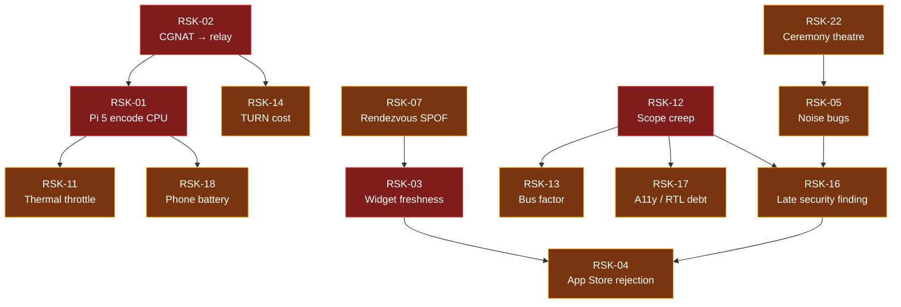

# 12 — Risk Register

> Terms per [00-GLOSSARY](00-GLOSSARY.md). Requirements referenced are in [02-SRS](02-SRS.md); milestones in [10-ROADMAP](10-ROADMAP.md); verification in [09-TEST-PLAN](09-TEST-PLAN.md).

| Field | Value |
|---|---|
| Document | 12 — Risk Register |
| Version | 1.0 |
| Date | 2026-07-24 |
| Author | Abo5 |
| Status | Draft |
| Entries | RSK-01 … RSK-22 |
| Review cadence | At every milestone exit, and immediately on any trigger signal firing |

### Revision history

| Version | Date | Author | Change |
|---|---|---|---|
| 1.0 | 2026-07-24 | Abo5 | Initial issue: 22 risks scored, mitigated, and assigned trigger signals; mitigation-priority summary. |

---

## 1. Scoring method

**Exposure = Likelihood × Impact**, each on a 1–5 scale. Exposure ranges 1–25.

| Likelihood | Meaning |
|---|---|
| 1 Rare | Would surprise us; no precedent in comparable projects |
| 2 Unlikely | Possible but not expected |
| 3 Possible | Even odds over the life of v1 |
| 4 Likely | Expected unless actively prevented |
| 5 Near-certain | Will happen; the only question is when and how badly |

| Impact | Meaning |
|---|---|
| 1 Negligible | Cosmetic or absorbed within normal work |
| 2 Minor | Days lost, or a Should-have requirement degraded |
| 3 Moderate | Weeks lost, or a Must-have requirement degraded |
| 4 Major | A milestone slips materially, or a core value proposition weakens |
| 5 Severe | The product cannot ship as specified, or the trust claim fails |

| Exposure band | Response |
|---|---|
| **16–25 Critical** | Active mitigation now; owner reports at every milestone exit; a contingency must be pre-decided |
| **9–15 High** | Mitigation planned and scheduled into a named milestone |
| **4–8 Medium** | Monitored; mitigation ready but not yet executed |
| **1–3 Low** | Accepted; reviewed only if the trigger fires |

Owner column names the hat (per [09-TEST-PLAN §4](09-TEST-PLAN.md#4-roles-and-responsibilities)), not a separate person — this is a solo project, and the naming exists to keep the accountability explicit.

---

## 2. Risk register

### RSK-01 — Pi 5 software-encoding CPU exhaustion

| Field | Value |
|---|---|
| **Description** | Raspberry Pi 5 has no hardware H.264 encoder. All remote-desktop encoding is software, competing with the Owner's actual workload on four Cortex-A76 cores. The frame-rate and latency targets in NFR-013 and NFR-004 may be unreachable inside the NFR-023 CPU ceiling, especially with high-motion content or at 1080p. |
| **Category** | Technical |
| **Likelihood** | 4 |
| **Impact** | 5 |
| **Exposure** | **20 — Critical** |
| **Owner** | Architecture |
| **Mitigation** | M0 exists solely to measure this before any dependent work starts. Encoder configured for low latency over compression efficiency. Adaptive pipeline degrades frame rate first, then resolution (FR-304, FR-306), with a hard CPU ceiling that the Agent enforces on itself. Codec choice (OQ-01) decided on measured evidence, not preference. Benchmarks B-4, B-6, B-9 tracked weekly from M1 so regressions surface immediately. Damage-limitation targets published honestly rather than aspirationally ([01-BRD §10.3](01-BRD.md#103-why-build-this-anyway) already concedes the frame-rate axis). |
| **Contingency** | Step the v1 default target down to 960×540; if still unreachable, drop remote desktop from v1 and reposition the product as telemetry + shell + alerts + widgets, rewriting the BRD competitive section before further work. Both branches are pre-written in [10-ROADMAP §3](10-ROADMAP.md#3-m0--spike-and-feasibility). |
| **Trigger signal** | M0 measurement below 25 fps at 720p inside 150% CPU; or any weekly B-4 result regressing by more than 15%; or Agent CPU exceeding the ceiling in any TC-1015 run. |

### RSK-02 — CGNAT on both ends forces relayed paths and relay cost

| Field | Value |
|---|---|
| **Description** | If a large share of Owners sit behind CGNAT on both the Pi's uplink and the phone's carrier, direct paths fail and Sessions relay through TURN. This raises latency past the NFR-004 direct-path budgets, caps quality, and converts a near-zero variable cost into a real one ([01-BRD §12.3](01-BRD.md#123-relay-cost-sensitivity--the-number-that-matters)). OBJ-3's 80% direct-path target is then unmet. |
| **Category** | Technical / operational |
| **Likelihood** | 4 |
| **Impact** | 4 |
| **Exposure** | **16 — Critical** |
| **Owner** | Architecture |
| **Mitigation** | Full ICE with STUN and both address families; IPv6 preferred where available, which frequently defeats CGNAT outright. Aggressive LAN-path detection (FR-115) removes home use from the relay entirely. Relayed-path bitrate ceiling (FR-114) bounds cost per Session. Relay share is measured, not assumed: TC-1211 records bytes per standard workload. Network matrix profiles N-7, N-8, N-9, N-10 are mandatory pass criteria. Path class is always visible to the Owner (FR-109) so degraded quality is explained, not mysterious. |
| **Contingency** | Introduce a per-Owner monthly relay budget with graceful degradation past it; document self-hosted TURN as a supported option; if the economics invert, make relay a paid tier or require Owner-supplied TURN, both of which the architecture already permits. |
| **Trigger signal** | Direct-path share of Session-minutes below 65% in beta telemetry; or measured relay egress exceeding the "pessimistic" row of the BRD cost model for two consecutive months. |

### RSK-03 — Apple background-execution limits break widget freshness

| Field | Value |
|---|---|
| **Description** | iOS grants no arbitrary background execution. WidgetKit timelines are budgeted and throttled by the system, background refresh is opportunistic, and push wakes are rate-limited. The NFR-011 freshness target (≤ 15 min p50) and the BR-15 promise of a glanceable current picture may not be deliverable, leaving widgets displaying stale data most of the time. |
| **Category** | Technical / compliance |
| **Likelihood** | 4 |
| **Impact** | 4 |
| **Exposure** | **16 — Critical** |
| **Owner** | Client |
| **Mitigation** | Freshness is never claimed — every widget renders its own data age and de-emphasises stale values (FR-704, FR-709), so the product is honest even when the platform is uncooperative. Refresh is push-triggered rather than poll-driven (FR-706). Every foreground use opportunistically refreshes and reloads timelines. TC-1012 measures real freshness over seven days of natural use rather than in a lab. OQ-11 forces an explicit decision on whether the reachability Alert is reliable or best-effort. |
| **Contingency** | Reframe widgets as "last known state with age" in all copy and App Store material; move the freshness promise to notifications, which are push-driven and reliable; relax NFR-011 to a measured achievable figure rather than shipping against a target that the platform forbids. |
| **Trigger signal** | TC-1012 p50 age exceeding 30 minutes; or observed widget reload budget exhaustion in normal daily use; or an iOS release tightening background budgets further. |

### RSK-04 — App Store rejection for remote-desktop / VNC-like functionality

| Field | Value |
|---|---|
| **Description** | App Review has historically been inconsistent about remote-desktop, terminal, and remote-execution apps. Rejection grounds could include: enabling execution of code not reviewed by Apple (the shell), remote control of devices, encryption declarations, or a judgment that the app duplicates system functionality. A rejection late in M6 stalls release indefinitely. |
| **Category** | Compliance |
| **Likelihood** | 3 |
| **Impact** | 5 |
| **Exposure** | **15 — High** |
| **Owner** | Owner / release manager |
| **Mitigation** | The product is framed and built as control of hardware the Owner personally owns and paired to out-of-band — a category with clear precedent. Actions are a closed allow-list defined on the Pi and never provisioned from a server (FR-503, SEC-025), so the app's behaviour is fixed at review time (NFR-055). The shell is presented as access to the user's own machine, exactly like established terminal clients. Encryption export declaration filed at first submission, not at release. Review guidance is consulted at M1, not M6, and the submission metadata is drafted at M5. A TestFlight build is submitted early in M5 to surface review objections while there is still time. |
| **Contingency** | Respond to the specific rejection reason with targeted changes; if remote desktop is the blocker, ship v1 without it and appeal separately; if the shell is the blocker, gate it behind an explicit first-run acknowledgement. Escalate through App Review's appeal process with the pairing-ceremony evidence that the Owner controls the target hardware. |
| **Trigger signal** | Any App Review communication questioning remote control, code execution, or encryption; a TestFlight review rejection during M5. |

### RSK-05 — Noise / cryptographic implementation bugs

| Field | Value |
|---|---|
| **Description** | The entire trust claim rests on a correct Noise_IK implementation: handshake state machine, transcript binding, nonce management, rekeying, and framing. A subtle bug — nonce reuse, a missing transcript element, an accepted downgrade, a mishandled error path — silently voids end-to-end encryption while everything appears to work. |
| **Category** | Security |
| **Likelihood** | 3 |
| **Impact** | 5 |
| **Exposure** | **15 — High** |
| **Owner** | Security reviewer |
| **Mitigation** | Use a mature, audited Noise implementation on both sides rather than writing one; the project's code is limited to binding and state management. Test vectors from the Noise specification run in CI. Nightly protocol fuzzing of the handshake state machine and framing from M1. Adversarial suite TC-1101…TC-1112 covers MITM, replay, downgrade, tag failure, and rekey under load. No error path may fall back to unauthenticated or unencrypted operation (SEC-009) — tested explicitly. External security review scheduled in M6 with remediation time budgeted before the gate, not after. |
| **Contingency** | Halt release until findings are remediated and re-reviewed; a High or Critical cryptographic finding is a non-waivable gate (G-4). If the chosen library proves unsound, fall back to the reference implementation and accept the schedule cost. |
| **Trigger signal** | Any fuzzing crash in the handshake or framing code; any TC-11xx failure; any CVE in the selected Noise or cipher library. |

### RSK-06 — Key loss or device loss leaves the Owner locked out

| Field | Value |
|---|---|
| **Description** | There is no vendor escrow by design (BR-26, SEC-001). An Owner who loses every paired device *and* loses console access to the Pi cannot recover. Less catastrophically, an Owner whose phone is stolen has a fully-capable device in an attacker's hands until revocation. A restored device backup that drops the key store produces confusing failures. |
| **Category** | Operational / security |
| **Likelihood** | 3 |
| **Impact** | 4 |
| **Exposure** | **12 — High** |
| **Owner** | Security reviewer |
| **Mitigation** | Client key material is unlock-protected and non-migratory (SEC-004); a stolen locked phone is not a usable device. Biometric gate on every capability (FR-901, SEC-029). Revocation is immediate, works from any surviving device or the console, and cannot be evaded (FR-807, SEC-022). The Owner is warned explicitly before revoking their last device (UC-12 E-1). Key rotation and every recovery path are specified as first-class flows (UC-13, FR-810, FR-811) rather than left as an afterthought. A Client restored without its key detects the condition and requires re-pairing rather than failing obscurely (UC-13 A-3). Onboarding states plainly that console access is the recovery path of last resort. |
| **Contingency** | Console recovery is always available while the Owner has physical access; documentation makes the "all devices plus no console" case explicitly unrecoverable so that expectations are set before, not after. Consider an Owner-held, Owner-encrypted export of the pairing state in v1.1 — deliberately not in v1, because escrow is the thing the primary persona is buying protection from. |
| **Trigger signal** | Any beta Owner reporting a lockout; usability sessions where participants cannot articulate the recovery path after reading onboarding. |

### RSK-07 — Rendezvous is an availability single point of failure

| Field | Value |
|---|---|
| **Description** | Rendezvous is stateless and zero-knowledge, which protects confidentiality but not availability. If it is down, unreachable, blocked, or DDoSed, no new Session can be established from outside the LAN, and no Alert push trigger can be sent — precisely when an Owner most needs remote access. |
| **Category** | Operational |
| **Likelihood** | 3 |
| **Impact** | 4 |
| **Exposure** | **12 — High** |
| **Owner** | Architecture |
| **Mitigation** | Statelessness makes horizontal scaling and instant replacement trivial — the mitigation is a property of the design, not an add-on. LAN operation is fully functional with Rendezvous down (FR-115, NFR-038), which covers the most common usage location. Agent re-registers automatically with backoff (FR-102). Alert triggers are queued and retried, and Alerts are delivered in-band on next connection with their true fire times (UC-09 E-2). The Client distinguishes "signalling unavailable" from "Pi offline" so the Owner is not misled about their machine (FR-109). Outage injection is a mandatory test (TC-120, TC-1216). |
| **Contingency** | Multi-region deployment behind anycast or DNS failover; publish a self-hosted Rendezvous option (OQ-14) so no Owner is dependent on the developer's infrastructure; document a manual LAN-only fallback mode. |
| **Trigger signal** | Rendezvous availability below 99.5% in any month; any outage exceeding 15 minutes; abuse or DDoS traffic observed. |

### RSK-08 — uinput permissions and Wayland compositor compatibility drift

| Field | Value |
|---|---|
| **Description** | Screen capture depends on wlroots screencopy or the XDG portal, and input depends on `/dev/uinput` permissions. Raspberry Pi OS has already migrated compositors once (wayfire → labwc). A future OS release, compositor change, portal policy change, or udev default change can break capture or injection on machines that were working yesterday. |
| **Category** | Technical |
| **Likelihood** | 4 |
| **Impact** | 3 |
| **Exposure** | **12 — High** |
| **Owner** | Agent |
| **Mitigation** | Both capture paths implemented with runtime detection and fallback, not a build-time choice (FR-302, SW-4, SW-5). Failures produce specific, actionable errors linked to remediation in [11-AGENT-DEPLOYMENT](11-AGENT-DEPLOYMENT.md) rather than a blank screen (TC-316). `uinput` access granted by a targeted udev rule rather than by running as root or joining a broad group (SEC-028), which is both safer and more stable across releases. Compatibility matrix tested on Bookworm and Trixie, on Pi 4 and Pi 5 (HW-A, HW-B, HW-C), every milestone. Headless operation is a first-class supported state (FR-315, HW-D), so a broken graphical path never takes telemetry and shell down with it. |
| **Contingency** | Ship a compositor-compatibility note and a supported-configuration list; if a capture mechanism disappears, fall back to the other and accept the performance difference; degrade to view-only or telemetry-only rather than failing the whole Agent. |
| **Trigger signal** | Any Raspberry Pi OS release notes touching the compositor, portal, PipeWire, or udev defaults; any TC-302 or TC-316 failure on a new OS image. |

### RSK-09 — Storage growth and SD-card wear or corruption

| Field | Value |
|---|---|
| **Description** | A time-series store on an SD card is a known field-failure mode. Unbounded growth fills the card; high write amplification wears it out; an unclean power-off corrupts it. Any of these turns the monitoring tool into the cause of the outage — the worst possible failure for this product's credibility. |
| **Category** | Technical |
| **Likelihood** | 3 |
| **Impact** | 4 |
| **Exposure** | **12 — High** |
| **Owner** | Agent |
| **Mitigation** | Retention and Rollups are hard requirements with enforced eviction (FR-211, FR-212), not tuning. Write budget is an NFR with a measured threshold (NFR-026, NFR-027) and a 30-day soak on a real A2 card (TC-1019, TC-1022). Writes batched and aligned to reduce amplification. Unclean power-off tested 20 times with a bounded loss window (NFR-035). Retention defaults are frozen only against measured data (OQ-15), not guessed. The Agent monitors and reports the very disk it is writing to, so growth is visible to the Owner. |
| **Contingency** | Reduce default retention; move the raw window to a memory-backed buffer with less frequent flushes; document NVMe or USB SSD as recommended for long-retention use; add a store-size cap that evicts before the filesystem fills, in preference to ever filling it. |
| **Trigger signal** | Storage soak exceeding 30 MiB/day written or 500 MiB steady state; any store corruption in the power-cut suite; any beta report of a full or failing card. |

### RSK-10 — Dependency abandonment, especially WebRTC bindings

| Field | Value |
|---|---|
| **Description** | The project depends on WebRTC bindings usable from Swift 6 and from Rust, a Noise implementation, a software encoder, and a terminal emulator. WebRTC bindings in particular have a history of unmaintained forks and painful upgrades. Abandonment mid-project, or an incompatibility with a new iOS or Swift release, could cost weeks. |
| **Category** | Technical / delivery |
| **Likelihood** | 3 |
| **Impact** | 4 |
| **Exposure** | **12 — High** |
| **Owner** | Architecture |
| **Mitigation** | Transport is abstracted behind an internal interface from M1 so that the DataChannel implementation is replaceable without touching the Channel or crypto layers — the WebSocket-over-Rendezvous fallback (FR-108) already proves that seam works. Dependencies pinned with lockfiles and a reproducible build (NFR-053); every dependency enumerated with its licence and maintenance status (NFR-054). Prefer widely-used, actively-maintained libraries over the most featureful. Vendor-in and self-maintain any dependency small enough to own. |
| **Contingency** | Fall back to the WebSocket-over-Rendezvous transport as the primary while a replacement DataChannel binding is integrated — degraded performance, but the product still works. Fork and maintain a pinned version if abandonment is confirmed. |
| **Trigger signal** | No upstream commits or releases for six months on a critical dependency; a broken build against a new Swift or iOS release; an unpatched CVE in a pinned dependency. |

### RSK-11 — Thermal throttling on the Pi

| Field | Value |
|---|---|
| **Description** | Sustained software encoding heats the SoC. On a passively cooled Pi 5 in a case, this can trigger throttling — which degrades the encode, degrades the Owner's actual workload, and is simultaneously a condition the product is supposed to detect and report. The tool would then be causing the alert it raises. |
| **Category** | Technical |
| **Likelihood** | 4 |
| **Impact** | 3 |
| **Exposure** | **12 — High** |
| **Owner** | Agent |
| **Mitigation** | The Agent must degrade before the Pi throttles: the encode pipeline reduces load at the throttle threshold minus 3 °C (NFR-025), verified by a 30-minute passive-cooling stress run (TC-1017). Degradation reasons are reported to the Client so the Owner sees "reduced due to temperature" rather than unexplained stutter (FR-306). Thermal characterisation is an M0 exit criterion, so the safe envelope is known before the feature is built. Throttle and undervoltage flags are surfaced honestly on the dashboard, distinguishing current from since-boot (FR-202). |
| **Contingency** | Lower default quality presets on passively-cooled hardware; detect the cooling situation from the thermal curve and cap accordingly; document active cooling as a requirement for sustained remote desktop rather than pretending it is optional. |
| **Trigger signal** | Any Agent-induced throttle event in TC-1017; beta reports of temperature Alerts correlating with remote-desktop sessions. |

### RSK-12 — Scope creep

| Field | Value |
|---|---|
| **Description** | The adjacent features are all individually reasonable: file transfer, Docker management, log search, a second platform, automation. Each costs a milestone. For a solo developer, uncontrolled scope is the single most likely cause of never shipping. |
| **Category** | Delivery |
| **Likelihood** | 4 |
| **Impact** | 4 |
| **Exposure** | **16 — Critical** |
| **Owner** | Owner / release manager |
| **Mitigation** | Out-of-scope items are decided and written down as business requirements with **Won't** priority (BR-27…BR-30), not left as unspoken assumptions. The `files` Channel is reserved in the protocol but unopenable in v1, and that is a tested requirement (FR-112, TC-112). The deferral list in [10-ROADMAP §11.1](10-ROADMAP.md#111-deferred-out-of-v1-entirely) names every tempting adjacent feature and its earliest version. The in-milestone cut list in §11.2 is pre-ordered so overruns are handled by a decision already made rather than an argument in the moment. Definition of done (DoD-1…DoD-10) prevents a milestone being declared complete with unfinished obligations trailing behind it. |
| **Contingency** | Exercise the cut list in order; if two consecutive milestones overrun, cut down to the pre-agreed minimum viable set and ship telemetry + shell + alerts + widgets, adding remote desktop in v1.1. |
| **Trigger signal** | Any milestone exceeding its calendar allocation by more than 25%; any requirement added after this SRS baseline without a corresponding removal. |

### RSK-13 — Solo-developer bus factor

| Field | Value |
|---|---|
| **Description** | One person holds three codebases, all operational knowledge, all keys to the Rendezvous and TURN infrastructure, and the App Store account. Illness, burnout, or a change in circumstances stops the project outright — and, worse, could strand Owners whose Rendezvous stops being operated. |
| **Category** | Delivery / operational |
| **Likelihood** | 3 |
| **Impact** | 5 |
| **Exposure** | **15 — High** |
| **Owner** | Owner |
| **Mitigation** | This specification repository *is* the primary mitigation: the product is defined well enough that another engineer could take it over. Architecture decisions recorded as ADRs with their reasoning. Reproducible builds (NFR-053) so artefacts can be rebuilt by anyone. Infrastructure defined as code and documented in [11-AGENT-DEPLOYMENT](11-AGENT-DEPLOYMENT.md). Sustainable pace baked into the calendar, which deliberately exceeds the engineer-week estimate. MIT licence keeps the option of opening the source. Critically, the design already ensures that **a dead vendor does not kill the Owner's data**: history lives on the Pi (principle P4), pairing is not vendor-mediated, and LAN operation needs no infrastructure at all. |
| **Contingency** | Publish the Agent and Rendezvous sources so Owners can self-host; publish the Rendezvous deployment manifest; commit publicly to a wind-down notice period; enable Owner-supplied Rendezvous and TURN endpoints (OQ-14) so the product survives the operator. |
| **Trigger signal** | Sustained overrun across two milestones; developer unavailability exceeding two weeks; loss of interest signalled by declining commit cadence. |

### RSK-14 — TURN egress cost exceeds the model

| Field | Value |
|---|---|
| **Description** | Relay cost is driven almost entirely by remote-desktop bitrate ([01-BRD §12.3](01-BRD.md#123-relay-cost-sensitivity--the-number-that-matters)). A heavier-than-modelled usage profile combined with a higher-than-modelled relayed share turns a hobby-scale cost into a real bill on a one-time-purchase revenue model, with no recurring revenue to offset it. |
| **Category** | Operational / financial |
| **Likelihood** | 3 |
| **Impact** | 3 |
| **Exposure** | **9 — High** |
| **Owner** | Owner |
| **Mitigation** | Relayed-path bitrate ceiling (FR-114) caps the worst case per Session. Relay bytes measured per standard workload in TC-1211 so the model is validated with data rather than assumption. Aggressive direct-path and LAN preference reduces relayed share (OBJ-3). Cost sensitivity modelled across four scenarios before launch, not after the first invoice. |
| **Contingency** | Lower the relayed bitrate ceiling; introduce a fair-use relay budget per Owner with graceful degradation; support Owner-supplied TURN credentials; if necessary make heavy relay use a paid tier — a decision framed by BQ-1 in the BRD. |
| **Trigger signal** | Monthly TURN egress exceeding the pessimistic model row twice consecutively; any single Owner exceeding ten times the median relay usage. |

### RSK-15 — iOS, Swift, and Xcode version drift

| Field | Value |
|---|---|
| **Description** | The Client targets iOS 17+, Swift 6, and Xcode 16. Over a 10-month build, at least one major iOS release will land. WidgetKit behaviour, background budgets, privacy manifests, and required-reason APIs all change between releases and can invalidate shipped behaviour or block submission. |
| **Category** | Technical / compliance |
| **Likelihood** | 4 |
| **Impact** | 2 |
| **Exposure** | **8 — Medium** |
| **Owner** | Client |
| **Mitigation** | Test on the current iOS release and the beta of the next, from M2 onward. Avoid private and marginal APIs entirely. Keep privacy manifests and required-reason API declarations current as they are introduced, not at submission. Baseline is held at iOS 17 so that adopting newer APIs is always optional. The hardware matrix includes an older supported iPhone (HW-F) so that the floor is tested, not assumed. |
| **Contingency** | Absorb the change in the contingency budget; if a platform change breaks a Should-have feature, cut it per the [10-ROADMAP §11.2](10-ROADMAP.md#112-deferred-within-v1--the-cut-list-in-cut-order) list rather than delaying release. |
| **Trigger signal** | An iOS beta breaking any L4 test; a new Apple requirement announced at WWDC affecting widgets, background execution, or privacy declarations. |

### RSK-16 — External security review finds a structural flaw late

| Field | Value |
|---|---|
| **Description** | The security review is scheduled in M6 (OBJ-6, G-4). A finding at that point that is structural rather than incidental — in the pairing ceremony, the capability model, the push trigger design, or Rendezvous metadata exposure — cannot be patched quickly and would delay release by a milestone or more. |
| **Category** | Security / delivery |
| **Likelihood** | 3 |
| **Impact** | 4 |
| **Exposure** | **12 — High** |
| **Owner** | Security reviewer |
| **Mitigation** | The design is documented and reviewable *now*, before implementation: [04-SECURITY-E2EE](04-SECURITY-E2EE.md) and [05-PROTOCOL](05-PROTOCOL.md) exist as specifications, so an early design-only review is possible and cheap. OQ-13 forces an explicit decision on review scope at M6 *entry*, and the recommendation is to buy a design review at M1 exit and an implementation audit at M6. Adversarial testing runs from M1 in CI rather than waiting for the reviewer. Remediation time is budgeted inside M6 rather than assumed to be zero. |
| **Contingency** | Delay release rather than ship with an open High or Critical finding — G-4 is explicitly non-waivable, so this contingency is a decision already made. Publish the finding and the fix if it affects any beta Owner. |
| **Trigger signal** | Any High or Critical finding; any reviewer question that cannot be answered from the existing design documents, which indicates a specification gap rather than a review gap. |

### RSK-17 — Accessibility and RTL debt discovered at the end

| Field | Value |
|---|---|
| **Description** | VoiceOver support, Dynamic Type resilience, and full Arabic RTL mirroring are cheap when built in and expensive when retrofitted. Deferring them to M6 typically produces a large, unglamorous, schedule-consuming rework across every screen — exactly when release pressure is highest. |
| **Category** | Delivery / compliance |
| **Likelihood** | 3 |
| **Impact** | 3 |
| **Exposure** | **9 — High** |
| **Owner** | Client |
| **Mitigation** | Accessibility and localization are cross-milestone workstreams, not M6 scope ([10-ROADMAP §12](10-ROADMAP.md#12-cross-milestone-workstreams)). Strings externalised from M1; pseudo-locale testing from M2. RTL layout decisions made per screen as it is built. The accessibility checklist A-1…A-14 is a definition-of-done condition for every milestone (DoD-6), so debt cannot accumulate silently. Charts and the terminal — the two hardest surfaces — have explicit requirements (NFR-040, NFR-045) rather than being handled by whatever the framework does by default. |
| **Contingency** | If the audit still finds significant debt, cut lower-priority screens from Arabic in v1 rather than shipping a half-mirrored app; never cut VoiceOver support, which is both an accessibility and an App Review consideration. |
| **Trigger signal** | Any milestone closing with unaddressed checklist items; any screen built without externalised strings. |

### RSK-18 — Client battery drain and thermals produce poor reviews

| Field | Value |
|---|---|
| **Description** | Sustained video decode plus network activity is expensive on an iPhone. If remote desktop drains the battery visibly or heats the device, Owners will blame the app in public reviews regardless of the physics, and the ambient widget promise will be undermined by a reputation for battery cost. |
| **Category** | Technical / product |
| **Likelihood** | 3 |
| **Impact** | 3 |
| **Exposure** | **9 — High** |
| **Owner** | Client |
| **Mitigation** | Explicit battery NFRs measured on instrumented hardware (NFR-029, NFR-030, TC-1018) rather than assumed. Codec choice weighs iOS *decode* power alongside Pi *encode* cost (OQ-01). Capture stops immediately when no viewer is attached (FR-308) and idle sessions time out (FR-410). Telemetry rate is reduced on relayed paths (UC-03 A-2). Background operation is push-driven, not polling (FR-706). |
| **Contingency** | Add a low-power remote-desktop mode with a reduced frame-rate ceiling; warn the Owner when a remote-desktop session has run for an extended period; document expected battery cost honestly in the App Store description so expectations are set before the first session. |
| **Trigger signal** | TC-1018 exceeding 6% per hour; beta reports of device heating; any review mentioning battery. |

### RSK-19 — Privacy and regulatory posture challenged

| Field | Value |
|---|---|
| **Description** | The product's claim is that the vendor holds no user data. Any drift — an analytics SDK added for convenience, a crash reporter that captures a screenshot, a support flow that asks for a log containing shell output — falsifies the central claim and creates a regulatory exposure that the design otherwise avoids entirely. |
| **Category** | Compliance |
| **Likelihood** | 2 |
| **Impact** | 4 |
| **Exposure** | **8 — Medium** |
| **Owner** | Owner |
| **Mitigation** | Analytics opt-in and off by default, with content exclusions specified as a requirement (FR-911). The diagnostics bundle is specified to exclude screen, shell, and clipboard content, and shows the Owner its contents before sharing (FR-907, SEC-031). Rendezvous statelessness is a tested property (TC-103, TC-1119), not a policy statement. A 24-hour outbound-traffic capture is a test case (TC-911). Push payloads are verified content-free and mutually indistinguishable (TC-605, TC-1113). |
| **Contingency** | Remove any offending component immediately and disclose; the design has no data to breach, which is the strongest possible position to be in when challenged. |
| **Trigger signal** | Any proposal to add a third-party SDK; any support request that would require Owner data the vendor should not possess. |

### RSK-20 — Field beta fails to materialise

| Field | Value |
|---|---|
| **Description** | Gate G-11 requires at least eight beta Owners over at least fourteen days. Recruiting technically strong, security-minded Owners with Raspberry Pis and iPhones is not trivial for an unknown product, and without them the network matrix, the freshness measurements, and the usability figures rest entirely on lab data. |
| **Category** | Delivery |
| **Likelihood** | 3 |
| **Impact** | 3 |
| **Exposure** | **9 — High** |
| **Owner** | Owner |
| **Mitigation** | Recruitment starts during M5, not at M6 (BQ-4 forces the channel decision by M3). The specification repository itself is a recruiting asset for exactly the persona being targeted. TestFlight enables distribution without App Review approval. The lab network matrix (sixteen profiles) is designed to substitute for breadth of field conditions as far as is possible, so beta adds realism rather than being the only evidence. |
| **Contingency** | Extend the beta window rather than shrink the cohort; run a longer personal soak across the full hardware matrix; ship to a smaller cohort with a documented reduction in confidence and a faster patch cadence in the first month. |
| **Trigger signal** | Fewer than five committed participants by M5 exit. |

### RSK-21 — Protocol version lock-in after release

| Field | Value |
|---|---|
| **Description** | Once Agents are deployed in the field, the wire protocol is hard to change: Owners upgrade Agents on their own schedule, and a breaking change strands them. A v1 protocol decision that proves wrong — in framing, Channel semantics, or the Snapshot encoding — becomes expensive permanently. |
| **Category** | Technical |
| **Likelihood** | 3 |
| **Impact** | 3 |
| **Exposure** | **9 — High** |
| **Owner** | Architecture |
| **Mitigation** | Explicit protocol versioning from M1, not retrofitted (NFR-049); version mismatch produces an actionable error rather than a silent failure or a downgrade (TC-910). One minor version of skew tolerated in each direction with graceful feature degradation (NFR-050, TC-909). The `files` Channel identifier is reserved now so that adding it later is not a breaking change (FR-112). Extension points designed into the message schemas in [05-PROTOCOL](05-PROTOCOL.md). The Client surfaces Agent version and update availability so Owners know when to upgrade (FR-910). |
| **Contingency** | Support two protocol versions in the Client simultaneously during a transition window; if a breaking change is unavoidable, gate it behind a version negotiation and give a long deprecation period with in-app notice. |
| **Trigger signal** | Any post-M2 change requiring a protocol-breaking modification; any field Agent unable to connect after a Client update. |

### RSK-22 — Fingerprint verification becomes ceremony theatre

| Field | Value |
|---|---|
| **Description** | The entire trust model rests on the Owner *actually comparing* two fingerprints (SEC-005). If the UX makes confirming easier than comparing, Owners will tap through, and verified pairing degrades to trust-on-first-use with extra steps — the exact thing the design explicitly rejects. |
| **Category** | Security / usability |
| **Likelihood** | 4 |
| **Impact** | 3 |
| **Exposure** | **12 — High** |
| **Owner** | Usability facilitator |
| **Mitigation** | Two independent encodings — hex and a word or emoji sequence — because word sequences are compared correctly far more often than hex strings (FR-005). Confirmation required on *both* the Client and the Agent, so a single thoughtless tap is insufficient. TC-1302 explicitly tests whether participants can articulate *why* they are comparing, treating comprehension as a pass criterion rather than completion. Copy explains the consequence of confirming without comparing (UC-13 E-2). No "skip", "trust anyway", or "remind me later" affordance exists anywhere (FR-006, TC-008). |
| **Contingency** | Redesign the ceremony if usability testing shows comprehension below the bar: force a comparison interaction (select the matching word sequence from several) rather than a simple confirm. This is a known-good pattern and is the pre-decided fallback. |
| **Trigger signal** | Any usability participant confirming without comparing; any participant unable to explain the purpose of the step when asked. |

---

## 3. Risk summary matrix

| ID | Risk | Category | L | I | Exposure | Band |
|---|---|---|---|---|---|---|
| RSK-01 | Pi 5 software-encoding CPU exhaustion | Technical | 4 | 5 | **20** | Critical |
| RSK-02 | CGNAT both ends forces relay | Technical/Operational | 4 | 4 | **16** | Critical |
| RSK-03 | Apple background limits break widget freshness | Technical/Compliance | 4 | 4 | **16** | Critical |
| RSK-12 | Scope creep | Delivery | 4 | 4 | **16** | Critical |
| RSK-04 | App Store rejection | Compliance | 3 | 5 | **15** | High |
| RSK-05 | Noise implementation bugs | Security | 3 | 5 | **15** | High |
| RSK-13 | Solo-developer bus factor | Delivery/Operational | 3 | 5 | **15** | High |
| RSK-06 | Key loss / device loss | Operational/Security | 3 | 4 | **12** | High |
| RSK-07 | Rendezvous availability SPOF | Operational | 3 | 4 | **12** | High |
| RSK-08 | uinput / Wayland compatibility drift | Technical | 4 | 3 | **12** | High |
| RSK-09 | Storage growth and SD wear | Technical | 3 | 4 | **12** | High |
| RSK-10 | Dependency abandonment (WebRTC bindings) | Technical/Delivery | 3 | 4 | **12** | High |
| RSK-11 | Thermal throttling on the Pi | Technical | 4 | 3 | **12** | High |
| RSK-16 | Late structural security finding | Security/Delivery | 3 | 4 | **12** | High |
| RSK-22 | Fingerprint verification theatre | Security/Usability | 4 | 3 | **12** | High |
| RSK-14 | TURN egress cost overrun | Operational/Financial | 3 | 3 | **9** | High |
| RSK-17 | Accessibility and RTL debt | Delivery/Compliance | 3 | 3 | **9** | High |
| RSK-18 | Client battery drain and thermals | Technical/Product | 3 | 3 | **9** | High |
| RSK-20 | Field beta fails to materialise | Delivery | 3 | 3 | **9** | High |
| RSK-21 | Protocol version lock-in | Technical | 3 | 3 | **9** | High |
| RSK-15 | iOS / Swift / Xcode drift | Technical/Compliance | 4 | 2 | **8** | Medium |
| RSK-19 | Privacy posture challenged | Compliance | 2 | 4 | **8** | Medium |

### Distribution

| Band | Count | IDs |
|---|---|---|
| Critical (16–25) | 4 | RSK-01, RSK-02, RSK-03, RSK-12 |
| High (9–15) | 16 | RSK-04…RSK-11, RSK-13, RSK-14, RSK-16…RSK-18, RSK-20…RSK-22 |
| Medium (4–8) | 2 | RSK-15, RSK-19 |
| Low (1–3) | 0 | — |

### How the top risks interlock

Reading the graph: **RSK-01 and RSK-02 are the physical constraints that everything else in the remote-desktop story inherits**, which is why M0 exists and why the network matrix is a gate rather than a report. **RSK-12 is the delivery constraint that amplifies every other delivery risk**, which is why the cut list is pre-ordered. **RSK-05 and RSK-22 are the two ways the trust claim can fail** — one by implementation, one by human factors — and both feed the same consequence: a product whose central promise is not actually true.

---

## 4. Mitigation priority summary

Ordered by what to do first, not by exposure score alone — because some high-exposure risks are cheapest to retire early and others cannot be touched until later work exists.

### Priority 1 — Retire before any dependent work starts (M0–M1)

| # | Action | Retires | Cost | Why first |
|---|---|---|---|---|
| P1-1 | Measure software encoding, thermals, and `uinput` on real Pi 4 and Pi 5 hardware; decide OQ-01 and OQ-02 | RSK-01, RSK-08, RSK-11 | 3 eng-wk (M0) | This is the only risk that can invalidate the product concept. Measuring it costs three weeks; discovering it at M4 costs eight. |
| P1-2 | Build the walking skeleton: real pairing, real NAT traversal, real crypto, real hardware | RSK-02, RSK-05, RSK-10 | Inside M1 | Integration risk is concentrated here. Every later milestone is a widening of a proven path. |
| P1-3 | Abstract the transport behind an internal seam from the first commit | RSK-10 | Marginal | Costs almost nothing now, saves weeks if a binding is abandoned. |
| P1-4 | Buy a design-only security review of [04-SECURITY-E2EE](04-SECURITY-E2EE.md) and [05-PROTOCOL](05-PROTOCOL.md) at M1 exit | RSK-05, RSK-16 | Low four figures | A structural flaw found on paper costs a rewrite of a document; found at M6 it costs a milestone. |
| P1-5 | Freeze the scope fence and pre-order the cut list; treat BR-27…BR-30 as binding | RSK-12 | Zero | The decision is free now and expensive under pressure later. |

### Priority 2 — Retire during the milestone that creates the exposure (M2–M5)

| # | Action | Retires | When |
|---|---|---|---|
| P2-1 | 30-day storage soak on a real A2 SD card; freeze retention defaults against measured data (OQ-15) | RSK-09 | M2 |
| P2-2 | Run the full 16-profile network matrix at every milestone exit, not only at the release gate | RSK-02, RSK-07 | M1 onward |
| P2-3 | Enforce the accessibility checklist and string externalisation as a definition-of-done condition per milestone | RSK-17 | M2 onward |
| P2-4 | Measure real widget freshness over seven days of natural use as soon as widgets exist; resolve OQ-11 | RSK-03 | M5 |
| P2-5 | Submit a TestFlight build early in M5 to surface App Review objections while there is still schedule to respond | RSK-04 | M5 |
| P2-6 | Instrument battery cost on real hardware and weigh iOS decode power in the codec decision | RSK-18 | M0 decision, M4 measurement |
| P2-7 | Usability-test the fingerprint ceremony for *comprehension*, not completion; hold the redesign fallback ready | RSK-22 | M1, re-tested M6 |
| P2-8 | Start beta recruitment during M5; decide the channel by M3 (BQ-4) | RSK-20 | M3–M5 |

### Priority 3 — Standing controls, continuous

| # | Control | Retires |
|---|---|---|
| P3-1 | Nightly protocol fuzzing and the full adversarial suite in CI from M1 | RSK-05 |
| P3-2 | Weekly performance benchmark tracking so regressions surface at the milestone that caused them | RSK-01, RSK-11, RSK-18 |
| P3-3 | Dependency freshness and CVE watch with pinned lockfiles and reproducible builds | RSK-10, RSK-15 |
| P3-4 | Test against the current iOS release and the next beta from M2 | RSK-15 |
| P3-5 | Keep specifications and ADRs current so the project is transferable | RSK-13 |
| P3-6 | Refuse every third-party SDK by default; verify with a 24-hour outbound-traffic capture | RSK-19 |
| P3-7 | Re-score this register at every milestone exit and re-check every trigger signal | All |

### Accepted without further mitigation

| Risk | Rationale for acceptance |
|---|---|
| RSK-06 residual | Unrecoverable loss of all devices *and* console access is a deliberate consequence of having no vendor escrow. Adding escrow would remove the primary reason the target persona buys the product. The mitigation is honesty in documentation, not a technical control. |
| RSK-13 residual | A solo project cannot eliminate its bus factor. What it *can* do — and has done — is ensure that the Owner's data lives on the Owner's Pi, so that the developer disappearing does not take the Owner's history, access, or LAN functionality with it. |
| RSK-07 residual | Rendezvous statelessness trades availability for confidentiality. That trade is deliberate and is restated as principle P1 in the [README](../README.md); adding server-side state to improve availability would break the product's central claim. |

---

## 5. Review log

| Date | Reviewer | Milestone | Changes |
|---|---|---|---|
| 2026-07-24 | Abo5 | Pre-M0 | Initial register established. Next review at M0 exit, where RSK-01, RSK-08, and RSK-11 must all be re-scored against measured data. |
