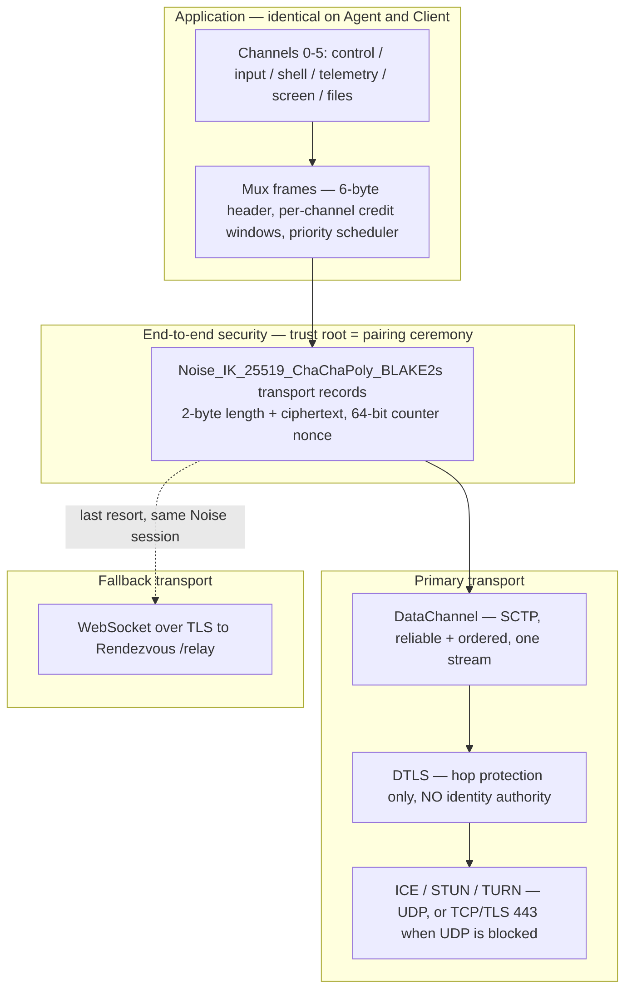

# ADR-0001 — Transport: WebRTC DataChannel, with Noise inside it

## Status

Accepted — 2026-07-24. Supersedes nothing. Constrains [ADR-0002](ADR-0002-crypto-handshake.md), [ADR-0004](ADR-0004-screen-streaming.md), [ADR-0008](ADR-0008-rendezvous-hosting.md).

## Context

The Client is an iPhone that roams between Wi-Fi, cellular, tethering, hotel captive-portal networks and CGNAT. The Agent is a Raspberry Pi behind a residential NAT that the Owner may not control. Principle **P2** forbids any inbound listening port on the Pi, so both endpoints must be outbound-initiators. Principle **P1** forbids server-side plaintext anywhere, including at a relay.

The transport must carry, simultaneously, over one logical Tunnel:

| Traffic | Sustained rate | Latency sensitivity | Loss tolerance |
|---|---|---|---|
| `screen` H.264 | 0.3–6 Mbps (default target 1.5 Mbps) | high (glass-to-glass budget ~150 ms) | tolerant — drop to next keyframe |
| `input` | 1–4 kbps, 20–120 events/s | **highest** — user perceives >80 ms | intolerant (dropped keystroke is a bug) |
| `shell` | 2–20 kbps typical, 1 Mbps burst | high | intolerant |
| `telemetry` | ~0.6 kB/s streaming, MB-scale backfill | low | intolerant |
| `control` | negligible | high | intolerant |
| `files` | opportunistic | none | intolerant |

Four candidate transports were evaluated: WebRTC DataChannel, raw WireGuard, bare QUIC, and a plain WebSocket relay.

## Decision

**D1.** The primary Transport is a **WebRTC DataChannel** established by ICE with STUN for server-reflexive candidates and TURN as relay of last resort. Signalling blobs are exchanged through Rendezvous and are opaque to it (see [05-PROTOCOL](../05-PROTOCOL.md) §Rendezvous API).

**D2.** Exactly **one** DataChannel is used, **reliable and ordered**, pre-negotiated (no in-band `DATA_CHANNEL_OPEN` round trip). All six logical Channels are multiplexed *inside* it by our own mux layer. The DataChannel is a byte pipe; it has no knowledge of Channels.

**D3.** The **Noise session runs inside the DataChannel**, not alongside it. DTLS is treated as hop protection with no authority over identity.

**D4.** A **WebSocket-over-Rendezvous relay** (`/relay`) is the last-resort Transport. It carries the identical Noise record stream. A Tunnel may migrate between D1 and D4 without re-running the Noise handshake if the session is still within its rekey window.

**D5.** Head-of-line blocking is managed at the mux layer, not by SCTP: outbound Noise records are capped at **4 KiB of payload while the `input` or `shell` channel has been active in the last 2 s**, and 16 KiB otherwise. `screen` frames are dropped *before* enqueue, never queued.

**D6.** A second, unordered partially-reliable DataChannel for `screen` is **explicitly deferred** — see the honesty note below.

### Why the Noise layer sits inside DTLS

This is the load-bearing decision of the whole product, and the usual justification ("so TURN can't read it") is *not* the real one — TURN already sees only DTLS ciphertext.

| # | Reason | Weight |
|---|---|---|
| R1 | **WebRTC's DTLS is authenticated by certificate fingerprints carried in the signalling channel.** Our signalling channel is Rendezvous, which is untrusted by design. A malicious Rendezvous can substitute both fingerprints and mount a textbook MITM on DTLS. Noise's authentication root is the pairing ceremony, which Rendezvous never touches. | **decisive** |
| R2 | Identity must survive Transport changes. A DTLS association dies on ICE restart, on Wi-Fi→cellular handoff, and does not exist at all on the WebSocket fallback. The Noise Session spans all of them. | high |
| R3 | One audited cryptographic implementation covers both Transports. Without it, the fallback path would need its own security design and its own review. | high |
| R4 | Defence in depth against the WebRTC stack itself — ICE/DTLS/SCTP is a large, historically vulnerable attack surface parsing attacker-influenced bytes. A DTLS break becomes a nuisance, not a compromise. | medium |
| R5 | Structural future-proofing: if a relay or SFU is ever introduced that terminates DTLS, plaintext exposure is impossible by construction rather than by policy. | medium |

## Consequences

### Positive

- Direct peer-to-peer on the majority of network pairs: no per-byte relay cost, and RTT is the physical path RTT rather than a triangle through a datacentre.
- The Rendezvous operator, the TURN operator, and every network operator in between are cryptographically irrelevant. This is what makes the zero-knowledge claim in [04-SECURITY-E2EE](../04-SECURITY-E2EE.md) defensible rather than aspirational.
- ICE gives NAT traversal, candidate re-gathering on network change, and a TCP/TLS-443 fallback path essentially for free.
- No inbound port on the Pi (**P2** satisfied) — ICE connectivity checks open the NAT pinhole outbound-first from both sides.

### Negative

- **Double encryption.** Every payload byte is authenticated-encrypted twice. Accounting, per record:

| Layer | Bytes added per record/packet |
|---|---|
| Noise (2-byte length + Poly1305 tag) | 18 |
| SCTP DATA chunk + common header | ~28 |
| DTLS record header + AEAD expansion | ~29–37 |
| UDP + IPv4 | 28 |
| TURN ChannelData (relayed path only) | 4 |
| **Total** | **~107–115 B** |

  On a 4 KiB record that is ~2.8% expansion; on MTU-sized 1200-byte packets it is **~9–10%** wire overhead, which is the number that matters on a metered cellular link. *Estimate — validate with benchmark.*

  The CPU cost of the second AEAD pass, by contrast, is near-noise: ChaCha20-Poly1305 runs at roughly 1.2–2.0 GB/s per Cortex-A76 core, so 3 Mbps (375 kB/s) costs on the order of **0.02–0.03% of one core**. The transport stack as a whole (SCTP reassembly, DTLS, ICE keepalives, syscalls, copies) is the real cost at an estimated **2–5% of one core at 3 Mbps**. We record this because the intuitive "double encryption is expensive" claim is simply false at our bitrates. *Estimate — validate with benchmark.*
- We must build our own congestion response. SCTP gives us reliability and a send-buffer signal but not the video-grade bandwidth estimation that a WebRTC *media* track would have given us — see [ADR-0004](ADR-0004-screen-streaming.md), which owns this cost.
- The Client links Google's `WebRTC.framework`, which adds an estimated **25–60 MB** to the app bundle before App Thinning and is a large third-party dependency we do not control.
- Two Transport code paths (DataChannel and WebSocket) must both be tested, including migration between them mid-Session.

### Neutral

- **Agent WebRTC stack:** `str0m` (sans-IO) is preferred over `webrtc-rs`. Sans-IO means the library owns no threads, no sockets and no timers; the Agent drives it from its own event loop, which makes the connectivity logic deterministically testable and replayable — a large win for a component whose failures are otherwise only reproducible on somebody else's NAT. The cost is a smaller community and a less battle-tested SCTP implementation than `webrtc-rs` (a port of Pion, itself widely deployed). This choice is reversible; the mux and Noise layers do not care.
- **Client WebRTC stack:** Google `libwebrtc` via `WebRTC.framework`. Writing a minimal ICE/DTLS/SCTP stack in Swift was considered and rejected as a multi-month project with a poor security payoff.
- Expected connectivity distribution, to be validated by the field measurements described in [03-ARCHITECTURE](../03-ARCHITECTURE.md):

| Path | Share of Tunnels (estimate) | Added RTT |
|---|---|---|
| Host candidate (same LAN) | 15–25% | ~0 |
| Server-reflexive (STUN, direct P2P) | 60–75% | 0 |
| TURN-relayed (UDP) | 8–15% | +20–80 ms |
| TURN over TCP/TLS 443 | 2–5% | +40–120 ms |
| WebSocket-over-Rendezvous fallback | <2% | +40–150 ms |

> **Residual risk RR-0101:** ICE candidate exchange reveals both endpoints' IP addresses to each other and to Rendezvous. This is unavoidable for direct connectivity. Mitigation is policy, not cryptography: an Owner-selectable "always relay" mode that offers only TURN candidates, at the cost of latency and relay bandwidth.

> **Residual risk RR-0102:** The Client's ICE gathering can enumerate local network interface addresses. The app requests no local-network permission it does not need, but host candidates still leak the LAN subnet to Rendezvous during signalling. Mitigated by mDNS-obfuscated host candidates where the platform supports them.

### Honesty note on partial reliability (D6)

The obvious optimisation — an unordered, partially-reliable DataChannel for `screen` so that a lost video packet cannot stall `input` — **is incompatible with the Noise transport layer as specified**. Noise transport records use a strictly incrementing 64-bit counter nonce and assume in-order, gap-free delivery; a reordered or dropped record desynchronises the cipherstate and the Tunnel dies.

Making it work requires a genuine protocol addition: an explicit per-record sequence number carried in the clear, plus a sliding anti-replay window (1024 entries, ESP/DTLS style) at the receiver, plus a *separate* cipherstate pair for that channel so its nonce space is independent. That is a real design with real precedent, but it doubles the transport-security state machine and its test matrix. For v1 we take the head-of-line blocking and bound it with D5 to **≤22 ms at 1.5 Mbps** (4 KiB record) instead. Deferred, not rejected.

## Alternatives considered

| Option | Why rejected |
|---|---|
| **Raw WireGuard** | Its cryptography is excellent — it is literally `Noise_IKpsk2`, so we are adopting its handshake pattern anyway (see [ADR-0002](ADR-0002-crypto-handshake.md)). The rejection is entirely about reachability and platform fit: WireGuard has **no NAT traversal of its own**, so at least one peer needs a stable reachable UDP endpoint — which either violates **P2** or forces a permanent relay, reintroducing the WebSocket-relay cost model with none of its simplicity. On iOS it requires a Network Extension entitlement and a system VPN profile: a heavyweight, user-visible, mutually-exclusive-with-other-VPNs UX for what should be one app's private tunnel, plus a packet-tunnel process with its own tight memory limit. On the Pi it wants the kernel module (root, and unavailable in some container deployments) or `wireguard-go` (higher CPU, tens of MB RSS). No TURN fallback, no TCP/443 fallback, dies on UDP-blocking networks. |
| **Bare QUIC** | Technically the most attractive protocol on paper: connection migration handles Wi-Fi→cellular natively, streams give real per-channel head-of-line isolation, and congestion control is first-class. It fails on the same reachability problem — QUIC has no ICE, so someone must be reachable. Building ICE-over-QUIC is building WebRTC. UDP-blocked networks (an estimated 5–8% of client networks) have no fallback. MASQUE/CONNECT-UDP would solve reachability but requires a proxy we would have to operate and that becomes a per-byte relay — again the WebSocket cost model. iOS `Network.framework` QUIC is production-grade for client-server HTTP/3 but is not a peer-to-peer stack. **This is the strongest alternative and the most likely future migration.** |
| **Plain WebSocket relay as primary** | Simple, works everywhere, one code path — genuinely tempting. Rejected on cost and chokepoint risk. Every byte transits the relay twice (ingress + egress): a single 1.5 Mbps screen session is ~1.35 GB/hour of relay traffic. At a representative $0.01–0.09/GB egress that is $0.01–0.12 per session-hour of pure marginal cost for a product with no subscription — and 100 concurrent viewers would need ~150 Mbps of relay capacity. It also makes Rendezvous a single point of failure and a single point of censorship for the core product function, which contradicts **P4** ("the Pi is the source of truth"). Retained as the ≤2% fallback, where its cost is negligible. |
| **Plain TCP hole punching / uPnP-NAT-PMP port forward** | Router-dependent, silently fails behind CGNAT, and opening an inbound port violates **P2** outright. |
| **Two DataChannels (reliable + partially-reliable)** | Deferred, not rejected. See the honesty note above — it requires explicit sequence numbers and an anti-replay window in the Noise transport layer. |

## Revisit if

- A production-quality ICE-integrated QUIC stack exists on both aarch64 Rust and iOS. QUIC's native stream multiplexing would let us delete our entire mux layer and its flow control, which is a large simplification of [05-PROTOCOL](../05-PROTOCOL.md).
- Measured TURN-relayed share exceeds 25% of Tunnels, which would invert the cost argument against a relay-primary design and justify investing in relay efficiency instead of NAT traversal.
- `WebRTC.framework` bundle size becomes a blocker for App Store cellular-download limits, or Apple ships a first-party peer-to-peer DataChannel API.
- Measured head-of-line blocking under D5 exceeds 30 ms at p95 during interactive use, which would promote D6 from deferred to required.
- `str0m` proves unable to sustain 6 Mbps of SCTP throughput on a Pi 4 without excessive CPU, in which case `webrtc-rs` is the drop-in fallback.
