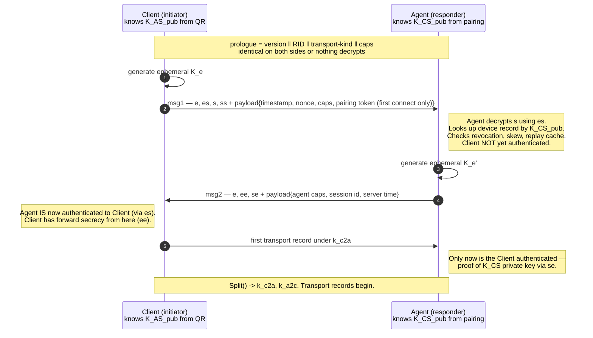

# ADR-0002 — Cryptographic construction: Noise_IK over TLS 1.3 or a double ratchet

## Status

Accepted — 2026-07-24. Depends on [ADR-0001](ADR-0001-transport.md) (the Noise session runs inside the DataChannel). Constrains [ADR-0003](ADR-0003-ios-key-storage.md) and the whole of [04-SECURITY-E2EE](../04-SECURITY-E2EE.md).

## Context

We need mutual authentication and an encrypted record stream between exactly two long-lived endpoints that have already met out of band. Specific properties required:

| # | Requirement | Source |
|---|---|---|
| C1 | Mutual authentication rooted in the pairing ceremony, **not** in any server, certificate authority, or signalling channel | **P1**, **P3** |
| C2 | Forward secrecy — yesterday's recorded traffic stays secret if a static key leaks today | Glossary |
| C3 | Post-compromise security — the Session becomes secure again after an attacker loses access | Glossary |
| C4 | 1-RTT establishment; the Client already knows the Agent's static key from the QR code | latency budget |
| C5 | Minimal parsing attack surface — the handshake parser is reachable by anyone who learns a Rendezvous id | threat model |
| C6 | Implementable identically in Rust (`snow`) and Swift (CryptoKit primitives) with no shared C dependency | [ADR-0005](ADR-0005-agent-language.md) |
| C7 | Runs over an ordered byte stream, not over datagrams | [ADR-0001](ADR-0001-transport.md) D2 |

C5 deserves emphasis. Any party that learns a Rendezvous id can send bytes at the Agent's handshake parser from anywhere on the internet. The number of lines of code between "attacker-controlled bytes" and "authenticated state" is the single most important number in the design.

## Decision

**D1.** The Session uses **`Noise_IK_25519_ChaChaPoly_BLAKE2s`**. The Client is the initiator, the Agent the responder.

**D2.** The Noise **prologue** binds the protocol version, the Rendezvous id, the Transport kind, and both declared capability sets. A mismatch fails the handshake at the first decryption — this is the entire downgrade defence, and it is free.

**D3.** Message 1 payload carries a wall-clock timestamp and a 32-byte client nonce. The Agent rejects skew >±120 s and keeps a **5-minute bounded replay cache** keyed on the client ephemeral public key.

**D4.** Rekeying has **two distinct mechanisms with different security meanings**, and the documentation MUST NOT conflate them:

| Mechanism | Trigger | What it actually provides |
|---|---|---|
| Noise `Rekey()` on a cipherstate | first of: 2²⁰ records, 1 GiB, or 15 min, per direction | **Forward secrecy only.** It is a one-way hash ratchet. An attacker holding the current chaining key derives every future key. It does *not* recover from compromise. |
| **Full re-handshake with fresh ephemerals** | every **60 minutes**, on Transport migration outside the window, on any authentication failure | **Post-compromise security.** New `ee` DH means an attacker who lost access cannot follow. |

**D5.** Nonce exhaustion (2⁶⁴−1) is a fatal, non-recoverable error: the Tunnel is torn down. Reaching it is unreachable in practice given D4, and treating it as fatal removes a whole class of catastrophic-reuse bugs.

### The handshake, message by message

| Step | Tokens | What it gives | What it does *not* give |
|---|---|---|---|
| msg1 | `e, es, s, ss` | Client's static public key is encrypted, not sent in the clear. Payload is confidential against a **passive** attacker. Agent learns which paired device is calling. | **No forward secrecy** — anyone who later obtains `K_AS` can decrypt every recorded msg1 payload. **Replayable** — nothing in the pattern prevents it. Client authentication rests on `ss`, a static-static DH, so it is **vulnerable to key-compromise impersonation**: an attacker holding `K_AS` can forge a msg1 from any paired device. |
| msg2 | `e, ee, se` | Agent authenticated to the Client via `es`, resistant to KCI. Payload forward-secret via `ee`. | Client still not authenticated at this point. |
| transport | — | Mutual authentication complete; Client proved possession of `K_CS` private key by deriving `se`. Full forward secrecy. | — |

These correspond to the payload security properties tabulated for `IK` in the Noise Protocol Framework specification §7.7 — msg1 `(1,2)`, msg2 `(2,4)`, transport `(2,5)`. We restate them in prose above because the numeric codes are routinely misread as "it's all fine after message 1".

The consequences we accept and mitigate:

| Property | Mitigation |
|---|---|
| msg1 replayable | D3: timestamp window + nonce + bounded replay cache. The cache is bounded and keyed on the ephemeral public key, so it cannot be grown without bound by an attacker. |
| msg1 not forward-secret w.r.t. `K_AS` | msg1 payload carries **no secrets**. The pairing token it may carry is single-use and expires in 600 s, so a decryption years later is worthless. |
| msg1 KCI-vulnerable | Only exploitable by an attacker who already holds `K_AS`, i.e. who already *is* the Agent. Materially this adds nothing to their power. |
| Client static is learnable by a future `K_AS` holder | `K_CS` is a random per-device value with no linkage to any human identity. The Rendezvous id already reveals equivalent metadata. Noted as a residual risk. |

> **Residual risk RR-0201:** The Agent's replay defence depends on wall-clock time, and a Raspberry Pi has **no battery-backed RTC by default**. Between boot and first NTP sync the clock may be wildly wrong (often the last-known-time or the epoch), making the ±120 s skew check meaningless or making every legitimate handshake fail. The Agent MUST therefore persist a monotonic "highest timestamp seen" watermark in its state database and refuse handshakes whose timestamp is not strictly greater than the watermark until the clock is confirmed synchronised. This is specified in [04-SECURITY-E2EE](../04-SECURITY-E2EE.md) and is a genuine implementation trap, not a theoretical one.

> **Residual risk RR-0202:** The prologue cannot include a channel binding to the underlying DTLS session, because neither `str0m` nor `WebRTC.framework` reliably exposes an RFC 5705 keying-material exporter for the DataChannel's DTLS association. The Noise layer is therefore *not* cryptographically bound to the specific DTLS connection carrying it. The practical impact is small — an attacker who can splice Noise records between two DTLS sessions still cannot decrypt or forge any of them — but it means we cannot detect a relay that transparently re-frames the record stream. Revisit if an exporter becomes available.

## Consequences

### Positive

- The handshake parser is trivial: two messages of **fixed length** (32-byte ephemeral, 48-byte encrypted static, tag, CBOR payload). There is no ASN.1, no certificate chain, no extension list, no algorithm negotiation, no variable-length structure before authentication. Compared to a TLS `ClientHello`, the pre-authentication attack surface is roughly two orders of magnitude smaller in reachable code.
- 1-RTT. The Client can send its first Channel frame immediately after msg2.
- No PKI: no certificate issuance, no expiry, no clock-dependent validity, no OCSP, no CRL, no CA to compromise. Revocation is a row in the Agent's device table — see [06-DATA-MODEL](../06-DATA-MODEL.md).
- Identical construction on both Transports and across Transport migration.
- `snow` on the Agent and CryptoKit primitives (`Curve25519.KeyAgreement`, `ChaChaPoly`, plus a BLAKE2s implementation) on the Client. No shared C library, no FFI in the security core.

### Negative

- Noise offers no negotiation whatsoever. Every algorithm change is a new protocol name and a new version number, coordinated through the version handshake in [05-PROTOCOL](../05-PROTOCOL.md). This is a deliberate trade: we accept upgrade friction to eliminate downgrade attacks.
- BLAKE2s is not in CryptoKit and must be supplied by a vetted Swift dependency or a small in-house implementation. This is the one piece of primitive-level code we own, and it MUST be tested against the RFC 7693 vectors. (Choosing `..._BLAKE2s` over `..._SHA256` costs us here; SHA-256 would have been free on both platforms and hardware-accelerated on both CPUs. BLAKE2s is retained because it is the Noise-idiomatic choice for the 25519 suite and matches the `snow` default path — but this is a weak preference, and switching to `Noise_IK_25519_ChaChaPoly_SHA256` is the cheapest possible protocol change if the Swift BLAKE2s dependency becomes a burden.)
- Nothing about the construction is quantum-resistant. Recorded traffic today is decryptable by a future CRQC holding a recorded handshake. See *Revisit if*.
- Post-compromise security has a **60-minute granularity**. An attacker who steals live session state retains it until the next full re-handshake. A double ratchet would reduce that to one message. We judge 60 minutes acceptable because the realistic compromise scenario here is device theft or Agent host compromise, both of which persist past any ratchet.

### Neutral

- Both endpoints must implement re-handshake *during* an active Session without dropping Channel state — the mux, flow-control windows and open PTYs survive; only the cipherstates are replaced. This is specified as the `Rekeying` state in the Tunnel state machine.
- The Agent, as responder, does a fixed 2 DH operations before it can decide whether a msg1 is genuine. At roughly 50–80 µs per X25519 operation on a Cortex-A76, that is an unauthenticated-work-per-packet figure of ~150 µs — enough to matter for a CPU-exhaustion flood, and the reason the Agent rate-limits handshake attempts per Rendezvous id. *Estimate — validate with benchmark.*

## Alternatives considered

| Option | Why rejected |
|---|---|
| **Noise_XX** | The honest case for XX: it transmits the initiator's static key in message 3, under a forward-secret key, so a future `K_AS` compromise does not reveal which devices connected — strictly better metadata hygiene than IK. It is rejected because it costs an extra round trip (1.5 RTT vs 1 RTT) for a property we partly lose anyway (the Rendezvous id already identifies the Agent to the network), and because XX's natural deployment mode is trust-on-first-use, which the Glossary and **P3** explicitly reject. We know the Agent's static key from the QR code; a pattern that pretends otherwise buys nothing. |
| **Noise_KK** | The closest competitor, and better than IK on metadata: the initiator's static is never transmitted at all. Rejected because the responder must know *which* initiator static to use before processing msg1, which forces either (a) a cleartext key hint — reintroducing exactly the metadata leak KK was chosen to fix, or (b) trial evaluation against every paired device, which is affordable at n≤16 devices (~1 ms) but converts every unauthenticated packet into n DH operations, an attractive CPU-exhaustion amplifier. IK also composes more cleanly with device enrolment and revocation, since the Agent identifies the device before doing any work on its behalf. |
| **Noise_NK** | No client authentication at all. Any holder of the Agent's public key could open a Session. Fails **P3** outright. |
| **Noise_IKpsk2** (the WireGuard pattern) | Genuinely appealing: the PSK contributes to the chaining key and would give a measure of post-quantum resistance today, for free. Deferred rather than rejected — it requires a shared secret established at pairing and carried in the Agent's device record and the iOS Keychain, which is one more key in the hierarchy and one more thing to lose. Listed as a *Revisit if* trigger, since it is the cheapest available PQ mitigation. |
| **TLS 1.3 with mutual certificate authentication** | Excellent, ubiquitous, well-audited — and wrong here. It brings X.509: ASN.1 parsing before authentication, certificate lifetimes and rotation, a revocation story (CRL/OCSP/short-lived certs) that we would have to build and operate, and clock-dependent validity on a device with no RTC (see RR-0201). RFC 7250 raw public keys remove most of that, but raw-public-key mode is awkwardly supported across the Rust and Swift stacks we would have to use, and it is a less-travelled path in both. TLS would also be running *inside* DTLS — a second TLS-family stack, with a second set of CVEs, doing a job Noise does in 200 lines. |
| **libsignal-style double ratchet (X3DH/PQXDH + Double Ratchet)** | Designed for a different problem: asynchronous, store-and-forward, out-of-order message delivery over months, where PCS granularity of one message is the headline feature. Our Sessions are synchronous and connected, so ephemeral-ephemeral DH plus hourly re-handshake already delivers FS and PCS at a granularity that matches our actual threat (device theft). The costs are real: ~32 B of ratchet header on every message; a skipped-message-key store that an attacker can inflate by sending large message numbers (a well-known DoS surface); and a substantially larger state machine to persist correctly on an embedded daemon that can lose power at any instant. The double ratchet also does not authenticate anything on its own — we would still need X3DH, i.e. more machinery, not less. |
| **Raw NaCl box / libsodium secretbox with a hand-rolled handshake** | Rolling our own handshake is the failure mode Noise exists to prevent. Rejected without reservation. |

## Revisit if

- A post-quantum hybrid becomes practical for both platforms — specifically a Noise hybrid-forward-secrecy pattern or an ML-KEM-768 + X25519 hybrid. Harvest-now-decrypt-later is a real threat model for a product whose traffic includes a live view of the Owner's desktop. The cheap interim step is adopting `IKpsk2` with a pairing-established PSK.
- The Swift BLAKE2s dependency becomes unmaintained or fails review → switch the suite to `Noise_IK_25519_ChaChaPoly_SHA256`, a one-line protocol-name change plus a version bump.
- An RFC 5705 exporter becomes available on both WebRTC stacks → add DTLS channel binding to the prologue and close RR-0202.
- Multi-user support enters scope (currently excluded by the Glossary's single-Owner assumption). Multiple concurrent Clients with independent trust levels would change the authentication requirements enough to re-open the pattern choice, and would make KK's per-device pre-knowledge more attractive.
- Measured handshake flood on the Agent proves the 2-DH unauthenticated work is exploitable despite rate limiting → add a stateless cookie/retry round trip in front of msg1, at the cost of the 1-RTT property.
