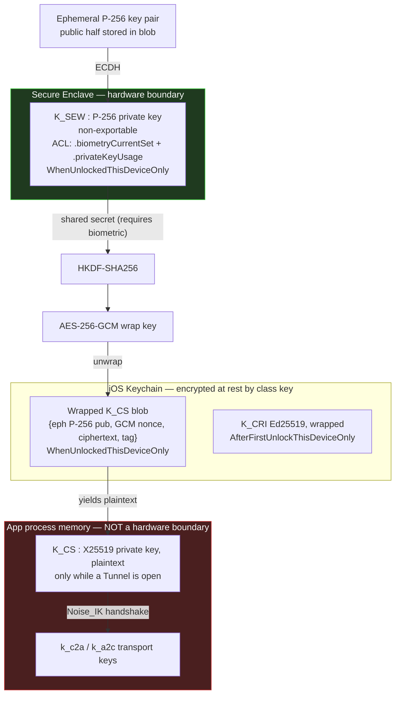

# ADR-0003 — Client key storage: the Secure Enclave P-256 / Curve25519 mismatch

## Status

Accepted — 2026-07-24. Depends on [ADR-0002](ADR-0002-crypto-handshake.md) (which fixes the static key type as X25519). This ADR exists because that choice has an unavoidable consequence on iOS that must be stated plainly rather than glossed over in marketing language.

## Context

The Client holds a per-device Noise static key `K_CS` (X25519). Possession of `K_CS` **is** the device's identity: whoever holds it can open a Tunnel to the paired Agent and thereby read the Owner's screen, run shell commands, and inject input. There is no second factor at the protocol layer. Protecting `K_CS` at rest on an iPhone is therefore the single highest-value control on the Client side.

The obvious answer on iOS is the Secure Enclave: a separate coprocessor that generates a private key which never leaves it, gated by an access-control policy the application cannot bypass. The problem:

| Fact | Consequence |
|---|---|
| The Secure Enclave supports exactly one asymmetric algorithm family: **NIST P-256** (`kSecAttrKeyTypeECSECPrimeRandom`, 256 bits), for ECDH key agreement and ECDSA signing. | Nothing else can be Enclave-resident. |
| The Secure Enclave does **not** support Curve25519, X25519, or Ed25519. | `K_CS` **cannot** be Enclave-resident. |
| CryptoKit's `Curve25519` types are **software implementations** running in the app process. | `K_CS` private bytes exist in application memory whenever they are used. |

This is not a limitation we can engineer around while keeping X25519. Any claim that "the Client's identity key is protected by the Secure Enclave" would be false. What we can do is make the Enclave *gate* the key rather than *hold* it, and be exact about the difference.

## Decision

**D1.** `K_CS` is generated in software on-device using CryptoKit's Curve25519 key agreement type, from the system CSPRNG. It is **never** exported, never synced, never backed up in usable form, and never transmitted.

**D2.** An Enclave-resident P-256 private key `K_SEW` is generated at first launch with:

| Attribute | Value | Why |
|---|---|---|
| token id | `kSecAttrTokenIDSecureEnclave` | key material never leaves the Enclave |
| key type | `kSecAttrKeyTypeECSECPrimeRandom`, 256 bits | the only option |
| access control flags | `.privateKeyUsage` + `.biometryCurrentSet` | use requires Face ID/Touch ID; **re-enrolling a biometric or adding a finger/face invalidates the key** |
| accessibility | `kSecAttrAccessibleWhenUnlockedThisDeviceOnly` | unusable while locked; never leaves this device |

**D3.** `K_CS` is wrapped at rest: a fresh ephemeral P-256 key pair is generated, ECDH is performed against `K_SEW`'s public key, the shared secret is passed through HKDF-SHA256 with a fixed application-specific info string, and the resulting 256-bit key encrypts `K_CS` under AES-256-GCM. The stored blob is `{ephemeral P-256 public key, GCM nonce, ciphertext, tag}`. Unwrapping requires the Enclave to perform ECDH with `K_SEW`, which requires a successful biometric or device-passcode presentation.

**D4.** The wrapped blob is stored as a Keychain generic-password item with accessibility `kSecAttrAccessibleWhenUnlockedThisDeviceOnly`. `ThisDeviceOnly` is load-bearing: it excludes the item from iCloud Keychain sync and from encrypted iTunes/Finder backups' restorable-to-another-device set. **Each paired device therefore has its own `K_CS`**, which is exactly what we want — per-device identity, per-device revocation ([04-SECURITY-E2EE](../04-SECURITY-E2EE.md) §Revocation).

**D5.** `K_CRI` (the Ed25519 Rendezvous identity key, also not Enclave-capable) is stored the same way but **without** the biometric requirement, at `kSecAttrAccessibleAfterFirstUnlockThisDeviceOnly`. It must be usable from a background push handler when the user is not present. It authenticates only to Rendezvous and cannot decrypt or forge anything in a Session — that separation of key roles is why relaxing its ACL is acceptable.

**D6.** `K_CS` is zeroised from process memory when the last Tunnel closes, on app backgrounding beyond a 30-second grace period, and on memory-warning. It is *not* held for the lifetime of the process.

The red box is the honest part of this diagram. Everything inside it is protected by iOS process isolation and nothing stronger.

## Consequences

### Positive

- A **stolen, locked, powered-off** iPhone is strongly protected. The Keychain class key for `WhenUnlockedThisDeviceOnly` is not available, and `K_SEW` cannot perform ECDH. Recovering `K_CS` requires defeating the Enclave or the device passcode with the Enclave's rate limiting and, on modern hardware with a strong passcode, this is not a practical attack.
- Biometric gating with `.biometryCurrentSet` means an attacker who coerces the phone into enrolling their own face/finger **destroys** `K_SEW`, and with it the ability to unwrap `K_CS`. The device fails closed and must be re-paired. This is a meaningful anti-coercion property and it is why we chose `.biometryCurrentSet` over `.biometryAny` or `.userPresence`.
- No iCloud Keychain exposure, no backup extraction path, no key material in an iCloud backup or an unencrypted local backup.
- Per-device keys make revocation surgical: losing one phone revokes one `K_CS` and leaves other devices and the Agent untouched.

### Negative

> **Residual risk RR-0301 — the headline one.** `K_CS` exists **in plaintext, in application process memory** for the entire duration of every Tunnel. Any adversary who achieves code execution in the app's address space — a kernel or WebKit-class exploit chain, a malicious dylib on a jailbroken device, a debugger attached on a development-provisioned device — can read it and impersonate the Client indefinitely. The Secure Enclave provides **no** protection against this. We say this plainly and we do not claim otherwise anywhere in the documentation.

> **Residual risk RR-0302 — stolen unlocked phone.** If the phone is unlocked and the attacker's face or finger satisfies the biometric prompt (a compelled unlock, a shoulder-surfed passcode followed by biometric re-enrolment before we notice, or simply the device handed over unlocked), the design offers no defence. The in-app biometric re-prompt on sensitive Actions is a speed bump, not a control. Mitigation is operational: fast revocation from any other paired device, and Agent-side audit logging of every Session and Action ([04-SECURITY-E2EE](../04-SECURITY-E2EE.md) §Audit).

> **Residual risk RR-0303 — no attestation.** The Agent cannot verify that the Client's `K_CS` is hardware-protected, because it isn't. There is no key attestation to check. An Agent cannot distinguish a genuine iPhone from an extracted `K_CS` replayed by a laptop. Adding App Attest / DeviceCheck would attest the *app*, not the key, and would introduce a dependency on Apple's servers into the authentication path — which we reject on **P1** grounds.

- Biometric friction: unwrapping `K_CS` requires a Face ID presentation. The 30-second background grace period in D6 is a deliberate usability concession and a deliberate small weakening.
- `.biometryCurrentSet` means a legitimate biometric re-enrolment (a new Face ID scan after a phone repair, adding a finger) invalidates `K_SEW` and forces re-pairing. This will generate support requests. It is the correct trade and the UX must explain it before it happens, not after.

### Neutral

- Widgets and background push handlers cannot open a Tunnel, because they cannot unwrap `K_CS` without user presence. This is not a limitation to work around — it is the reason the widget data path is designed the way it is in [ADR-0009](ADR-0009-widget-data-path.md), reading a cached Snapshot from the App Group container rather than connecting.
- Two keys with two different accessibility classes means two different failure modes to test. The test plan must cover: locked device, first-boot-before-unlock, biometry-invalidated, and passcode-removed states.

### What each option actually protects against

| Threat | (a) Protocol on P-256, key truly Enclave-resident | **(chosen) X25519 key, Enclave-wrapped** | (b) Software key, biometric ACL only | (c) Passcode-derived KDF wrap | (d) External hardware token |
|---|---|---|---|---|---|
| Stolen **locked** phone | ✅ key cannot leave Enclave | ✅ blob undecryptable | ✅ Keychain class key unavailable | ⚠️ offline passcode grind if blob is extracted | ✅ token absent |
| Stolen **unlocked** phone | ⚠️ attacker can *use* the key but never extract it | ❌ key extractable from memory | ❌ extractable | ❌ extractable | ✅ token still required per use |
| Malware / exploit in the app sandbox | ✅ **key never extractable**, only usable while running | ❌ **key extractable** | ❌ extractable | ❌ extractable | ⚠️ usable while connected, not extractable |
| iCloud Keychain sync exposure | ✅ n/a, never syncs | ✅ excluded by `ThisDeviceOnly` | ✅ excluded | ✅ excluded | ✅ n/a |
| Encrypted backup extraction | ✅ n/a | ✅ excluded | ✅ excluded | ⚠️ blob may be included | ✅ n/a |
| Coerced biometric re-enrolment | ✅ invalidated | ✅ invalidated | ✅ invalidated | ❌ passcode unchanged | ✅ n/a |

The column that matters is row 3. **Option (a) is strictly stronger than what we chose**, and we should say so rather than pretend the difference is cosmetic.

## Alternatives considered

| Option | Why rejected |
|---|---|
| **(a) Move the whole protocol to P-256: `Noise_IK_P256_ChaChaPoly_SHA256`** | This is the strongest alternative and rejecting it is a genuine trade, not a formality. Noise supports NIST P-256 as a DH function, and the Enclave's `SecKeyCopyKeyExchangeResult` yields a raw ECDH shared secret suitable for feeding a Noise state machine — so the Client's static key could be **genuinely non-extractable**, closing RR-0301 entirely. It was rejected on four grounds, in decreasing weight: (1) P-256 implementations are far more prone to catastrophic implementation error than X25519 — invalid-curve attacks, point validation, scalar-blinding and non-constant-time field arithmetic are all live concerns, and the Agent side would be running a P-256 implementation of our choosing on an ARM SBC, not Apple's; (2) the Noise/`snow` X25519 path is the well-trodden, widely-reviewed one, and every deployed Noise protocol we would benchmark against (WireGuard, Lightning, WhatsApp) uses 25519; (3) the Enclave's ECDH API forces the *entire* handshake to be driven through Enclave round trips, each requiring the key's ACL to be satisfied, which complicates re-handshake every 60 minutes into a biometric prompt every 60 minutes unless we cache — and caching the derived material reintroduces the same memory exposure we were trying to remove, for the `es`/`se` results at least; (4) the Glossary and [ADR-0002](ADR-0002-crypto-handshake.md) fix the suite as 25519 and it is a breaking protocol change. **Explicitly recorded as the leading candidate for v2** — see *Revisit if*. |
| **(b) Software `K_CS` with a biometric-gated Keychain ACL, no Enclave wrap** | Simpler, and against most of the threat table it performs identically. Rejected because the Enclave wrap adds a real property for free: it binds the key to *this specific silicon*, so a Keychain blob lifted by an exploit that reads the Keychain database but does not achieve Enclave access is useless. Cheap, so we take it. |
| **(c) Passcode-derived KDF wrapping (PBKDF2/Argon2 over a user passphrase)** | Worse on every axis. Entropy is whatever the user types, the derivation is attackable offline at attacker-chosen speed once the blob leaks, and it adds a passphrase prompt to a product whose whole UX premise is Face ID. The Enclave's hardware-rate-limited passcode path is strictly better than anything we can derive in userspace. |
| **(d) External hardware token (YubiKey over NFC/Lightning, or a second paired device as a signer)** | Genuinely the strongest option — the key is never on the phone at all and survives full phone compromise. Rejected for v1 on product grounds: it requires the Owner to buy and carry hardware, breaks the "phone in pocket, glance at widget" premise, has no story for background operation, and its NFC session UX on iOS is hostile for a per-Session unlock. Reasonable as an opt-in "paranoid mode" later. |
| **Store `K_CS` in the App Group container instead of the Keychain** | Would let widgets and extensions use it. Absolutely not — the App Group container is a file protected only by data-protection class, readable by any of our extensions and by anything that compromises one of them. The widget path deliberately has no access to key material ([ADR-0009](ADR-0009-widget-data-path.md)). |
| **iCloud Keychain sync of `K_CS` for "seamless multi-device"** | Would make one compromise of the Apple account compromise every device, and would put the identity key into a system whose recovery path is a phone-number-and-passcode flow outside our threat model. Per-device keys with explicit per-device pairing is the correct model and costs the user one QR scan per device. |

## Revisit if

- **The Secure Enclave gains Curve25519 support.** Then `K_CS` becomes Enclave-resident with no protocol change and RR-0301 closes. This is the single highest-value external change to watch.
- Migrating the suite to P-256 becomes acceptable — e.g. at a major protocol version, or if a Noise-over-Enclave reference implementation with credible review appears. Option (a) should be re-costed at every major version, not silently forgotten.
- iOS exposes a general-purpose in-memory secret-protection facility (a sealed-memory or key-usage-token API) that would reduce the window in RR-0301.
- A jailbreak-detection or integrity-attestation approach with an acceptable false-positive rate and no server dependency becomes available. Current posture (documented in [04-SECURITY-E2EE](../04-SECURITY-E2EE.md)) is that we perform best-effort detection, surface it to the Owner, and **do not** treat it as a security control.
- The product adds a second Owner or a shared-access model, at which point per-device key custody and revocation latency need re-analysis.
