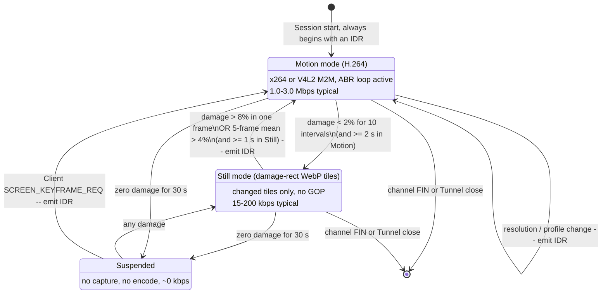

# ADR-0004 — Screen streaming: hybrid H.264 elementary stream + damage-rect still mode

## Status

Accepted — 2026-07-24. Depends on [ADR-0001](ADR-0001-transport.md) (single reliable-ordered DataChannel) and [ADR-0005](ADR-0005-agent-language.md). Owns the ABR cost created by ADR-0001. Detailed wire format lives in [05-PROTOCOL](../05-PROTOCOL.md) §screen channel.

## Context

Remote Desktop must render the Pi's Wayland session on an iPhone, from anywhere, at an interactive latency, over links ranging from a gigabit LAN to a congested cellular uplink. The constraints are unusually asymmetric:

| Constraint | Detail |
|---|---|
| **Pi 5 has no hardware H.264 encoder.** | The VideoCore VII in the Pi 5 dropped the H.264 encoder entirely; it retains an HEVC *decoder*. Any H.264 on a Pi 5 is software. This is the dominant constraint and it is frequently gotten wrong. |
| Pi 4 does have one | V4L2 M2M via `bcm2835-codec`, practical ceiling 1080p30, mediocre rate-distortion efficiency compared to modern x264, but ~5–12% of one core. |
| Capture is damage-driven | `zwlr_screencopy_v1` on labwc/wayfire, or PipeWire + `xdg-desktop-portal` where a portal is mandated. Both surface dirty rectangles; ignoring them wastes the majority of the CPU budget. |
| Content is a desktop, not a movie | Long stretches of zero change, punctuated by scroll and window-drag bursts. The bitrate distribution is extremely bimodal. |
| The screen must never starve control | [05-PROTOCOL](../05-PROTOCOL.md) mux scheduler; `screen` is the lowest-priority interactive channel and is drop-eligible. |

## Decision

**D1.** The Agent encodes an **H.264 Annex-B elementary stream** (constrained baseline for compatibility, main where the decoder allows) and sends NAL units as **opaque payloads on the `screen` Channel** inside the Noise session. It is *not* a WebRTC media track.

**D2.** **Hybrid mode.** When the per-frame damage ratio is low, the Agent switches to **damage-rect still mode**: only changed tiles are sent, encoded as WebP (lossy for photographic tiles, lossless for text/UI tiles). Switch policy:

| Transition | Condition | Cooldown |
|---|---|---|
| H.264 → still mode | damage ratio < 2% of pixels for 10 consecutive capture intervals | must have been in H.264 ≥ 2 s |
| still mode → H.264 | any single frame with damage ratio > 8%, **or** 5-frame moving average > 4% | must have been in still mode ≥ 1 s |

  The asymmetric thresholds and the cooldowns exist to prevent oscillation on a blinking cursor next to a video thumbnail. The first frame after any switch to H.264 is an IDR.

**D3.** **Codec/profile negotiation** happens on the `control` Channel at Session start: the Client advertises decoder capabilities (max level, max resolution, whether HEVC is acceptable), the Agent replies with the profile it will actually use given its hardware. The Agent is authoritative — the Client cannot request a profile the Pi cannot sustain.

**D4.** Default profile: **1280×720 at 20 fps**, target 1.5 Mbps, adaptive upward to 30 fps and 3 Mbps when both CPU headroom and measured bandwidth allow. 1080p is offered on Pi 4 (hardware) and is *available but not recommended* on Pi 5.

**D5.** The Agent runs its own **adaptive bitrate loop** (D3 of [05-PROTOCOL](../05-PROTOCOL.md) §ABR). Frames are dropped **at the encoder input**, never after encoding and never in the network. On a sustained stall the Agent discards to the next IDR rather than queueing.

**D6.** IDR cadence: on Session start, on Client request (`SCREEN_KEYFRAME_REQ`), on resolution change, on mode switch, and otherwise at most every 10 s. No fixed short GOP — periodic IDRs are pure bitrate waste on a mostly-static desktop.

### Why not a WebRTC media track

A media track is the obvious choice and we are rejecting it, so the reasoning must be precise. The common argument — "SRTP would let TURN see the video" — is **false**: SRTP keys are derived from the DTLS handshake, and TURN sees only ciphertext. The real reasons are these:

| # | Reason |
|---|---|
| R1 | A media track's SRTP is keyed by DTLS, whose authentication root is the certificate fingerprint exchanged through **Rendezvous** — untrusted by design. The same argument that puts Noise inside the DataChannel in [ADR-0001](ADR-0001-transport.md) applies verbatim to video. Frame-level encryption (SFrame / insertable streams) would fix this, but is not exposed in a supported form in the iOS `WebRTC.framework` Objective-C API. |
| R2 | Structural: if any relay or SFU ever terminates DTLS, media plaintext is exposed. With the video inside the Noise session, that is impossible by construction. |
| R3 | Unified backpressure. The screen stream must yield to `control` and `input` under congestion. A separate media track has its own pacer and its own congestion controller competing with SCTP over the same path, and no mechanism to express "starve me before you starve the keyboard". |
| R4 | The Client can feed an Annex-B elementary stream straight into VideoToolbox with no RTP depacketiser, no jitter buffer we do not control, and no libwebrtc video pipeline in the path. |

**The honest cost of R1–R4:** we give up WebRTC's most valuable non-obvious feature — **its bandwidth estimation**. Google Congestion Control with `transport-cc` feedback is a mature, well-tuned delay-based estimator that took years to get right, and we are choosing to reimplement its job. Worse, because [ADR-0001](ADR-0001-transport.md) D2 uses a *reliable, ordered* DataChannel, congestion never appears to us as packet loss — SCTP hides it as retransmission. Congestion manifests only as **growing send-buffer depth and rising one-way delay**. Our ABR loop must therefore key on:

| Signal | Source | Role |
|---|---|---|
| send-buffer depth | SCTP `bufferedAmount` / `str0m` send queue | primary — the fastest congestion indicator we have |
| one-way delay gradient | Client `SCREEN_FEEDBACK` every 200 ms, timestamps from the `control` Channel | secondary — distinguishes queueing from application slowness |
| decode queue depth & dropped frames | Client-reported | detects a Client that cannot keep up (thermal throttling, background) |
| Agent CPU load & thermal throttle state | Pi telemetry, `vcgencmd get_throttled` | encoder-side ceiling, distinct from network ceiling |

This is a real engineering cost — budget it as multi-week work with a dedicated network-emulation test matrix, not as a detail. It is the single largest negative consequence of this ADR.

## Consequences

### Positive

- Bitrate on motion content is 4–15× better than any image-tile approach. The comparison, on a 1280×720 desktop *(all figures estimates — validate with benchmark)*:

| Scenario | H.264 720p20 | Damage-rect WebP tiles | VNC/RFB Tight |
|---|---|---|---|
| Idle desktop, clock ticking | 30–80 kbps | **15–40 kbps** | 20–60 kbps |
| Typing in a terminal | 150–400 kbps | **60–200 kbps** | 100–300 kbps |
| Scrolling a web page | **1.2–2.5 Mbps** | 6–15 Mbps | 8–20 Mbps |
| Dragging a window | **1.0–2.0 Mbps** | 5–12 Mbps | 6–15 Mbps |
| Full-screen video playback | **1.5–3 Mbps** | 20–40 Mbps | 25–50 Mbps |

  The bimodality in this table *is* the argument for the hybrid: still mode wins by 2–3× on the two most common states, H.264 wins by an order of magnitude on the other three.
- Hardware decode on iPhone via VideoToolbox: negligible battery and CPU cost on the Client, which matters for a session the Owner may leave open.
- The screen stream inherits the Noise session's E2EE, revocation, and Transport migration for free.

### Negative

- **Pi 5 CPU cost is the binding constraint.** *(estimates — validate with benchmark)*

| Platform | Profile | Encoder | CPU | Notes |
|---|---|---|---|---|
| Pi 5 (4×A76 @2.4 GHz) | 1280×720 @30 | x264 ultrafast + zerolatency | **1.2–1.8 cores** | 1.5–3 Mbps; acceptable |
| Pi 5 | 1280×720 @20 | x264 ultrafast + zerolatency | **0.8–1.2 cores** | **default** |
| Pi 5 | 1920×1080 @30 | x264 ultrafast + zerolatency | **2.5–3.5 cores** | **not viable with headroom** — leaves nothing for the desktop being streamed, and will thermally throttle a passively-cooled Pi 5 |
| Pi 4 (4×A72 @1.8 GHz) | 1280×720 @30 | x264 ultrafast | 2.5–3.5 cores | avoid |
| Pi 4 | 1920×1080 @30 | V4L2 M2M hardware | **0.05–0.12 cores** | preferred on Pi 4; worse quality per bit than x264 |
| Both | still mode, typical desktop | WebP tiles | 0.05–0.3 cores | scales with damage area, not resolution |

  The perverse result — that the *newer, faster* Pi is the one that cannot do 1080p — is a direct consequence of the removed encoder block and must be surfaced in the product UI, not buried. The Agent MUST refuse to offer 1080p30 by default on a Pi 5 and MUST show why.
- We own the ABR loop, the mode-switch hysteresis, and the keyframe policy. Three control loops that can each oscillate.
- Two encoder paths (x264 and V4L2 M2M) plus a still-mode path, all needing the same damage-tracking front end and the same output framing.
- x264 is GPL/commercial-licensed. A single static binary linking x264 makes the Agent GPL-encumbered, which conflicts with the MIT licence in the README. **This must be resolved before implementation** — options are dynamic linking against the distribution's `libx264` package (weakens but does not eliminate the argument), shipping OpenH264 (BSD, Cisco-provided binaries, notably worse quality at low bitrate and awkward to bundle), or relicensing. Flagged here because it is a licensing landmine, not a technical one.

> **Residual risk RR-0401:** Screen content is the most sensitive data the product carries — it includes anything the Owner has on screen, including other applications' credentials. Confidentiality rests entirely on the Noise layer. Any Client compromise (see [ADR-0003](ADR-0003-ios-key-storage.md) RR-0301) yields a live view of the Pi's desktop.

> **Residual risk RR-0402:** Encoder timing is content-dependent. An on-path observer sees packet sizes and timing even through Noise, and can infer coarse activity — idle vs typing vs video playback — from the bitrate envelope. Padding to a constant rate would cost 3–10× bandwidth and is not implemented. Documented, not mitigated.

### Neutral

- Latency budget, direct path, 1280×720 @20 fps *(estimate — validate with benchmark)*:

| Stage | Budget |
|---|---|
| Capture interval quantisation (20 fps) | 0–50 ms (mean 25) |
| `zwlr_screencopy` buffer copy + format convert | 4–12 ms |
| Encode (x264 ultrafast zerolatency, no B-frames, no lookahead) | 8–20 ms |
| Mux + Noise + SCTP/DTLS | 1–3 ms |
| Network one-way, direct path | 10–40 ms |
| Client receive buffer (deliberately shallow) | 10–25 ms |
| VideoToolbox decode | 4–10 ms |
| Display compositing (one 60 Hz frame) | 8–17 ms |
| **Glass-to-glass total** | **~90–160 ms** |

  On a TURN-relayed path add 20–80 ms; on the WebSocket fallback add 40–150 ms. Below ~100 ms the experience is "direct"; above ~250 ms pointer work becomes unpleasant and the UI should say so.
- Zero-copy from the capture buffer to the encoder is possible in principle (DMA-BUF from `zwlr_screencopy` into V4L2 on Pi 4) and is a worthwhile optimisation, but x264 needs a CPU-accessible planar buffer anyway, so on Pi 5 a colour-convert pass (typically BGRA→I420) is unavoidable and should be NEON-accelerated.

## Alternatives considered

| Option | Why rejected |
|---|---|
| **WebRTC media track (H.264 over SRTP)** | Would have given us GCC bandwidth estimation, NACK/FEC/PLI and a tuned jitter buffer for free — a substantial amount of hard engineering. Rejected because SRTP's trust root is the DTLS fingerprint exchanged via untrusted Rendezvous (R1), because it cannot be scheduled against our other Channels (R3), and because frame-level encryption to fix R1 is not available on the iOS API surface. |
| **VNC / RFB (e.g. wayvnc)** | The mature, obvious, already-implemented option — `wayvnc` exists and speaks `zwlr_screencopy` today. Rejected on two grounds. Bandwidth: RFB's per-tile image encodings (Tight, ZRLE) have no temporal prediction, so scrolling — the single most common desktop motion — retransmits nearly the whole screen every frame, 8–20 Mbps where H.264 uses 1.5. Latency: RFB's `FramebufferUpdateRequest` model is a client-pull round trip per frame, which adds a full RTT to every update and degrades badly above 100 ms RTT — precisely our cellular case. Its encryption story would also have to be replaced wholesale. |
| **Pure damage-rect image codec (WebP/JPEG tiles only)** | Excellent on the two states we spend the most *time* in, and dramatically simpler — no encoder licensing, no GOP, no ABR feedback loop worth the name, trivially resumable. Rejected as the sole mechanism because scrolling and video playback are the states users *notice*, and 6–40 Mbps is unusable on cellular. Kept as half of the hybrid, which captures most of its benefit. |
| **HEVC / H.265** | Better compression, and the Pi 5 has an HEVC decoder. But it has no HEVC *encoder* either, software HEVC encoding is 3–8× more expensive than H.264 on the same CPU, and it is flatly out of reach on an A76 at 720p. |
| **AV1** | Better still per bit; software encoding on a Pi is not remotely real-time at any useful resolution. Revisit only if hardware appears. |
| **Raw framebuffer with a general-purpose compressor (zstd over dirty rects)** | Simple and licence-clean; roughly 1.5–3× worse than WebP tiles on UI content and hopeless on photographic content. Considered as a licence-safe fallback tier if the x264 licensing question forces it. |
| **Remote *rendering* (X11/Wayland protocol forwarding, RDP-style)** | Would give perfect text and low bandwidth for native apps, but requires a compositor-integrated implementation, breaks on GPU-composited and video-playing clients, and is a far larger project than encoding pixels. Out of scope. |

## Revisit if

- Raspberry Pi ships an SBC with a hardware H.264 or HEVC encoder again — the entire Pi 5 CPU-budget section collapses and 1080p30 becomes the default.
- The x264 licensing question forces a change: OpenH264 or a pure damage-rect tier becomes the shipped default.
- SFrame / insertable streams become available in the iOS `WebRTC.framework` public API, which would let us reconsider a media track with true end-to-end frame encryption and reclaim GCC.
- Measured p95 glass-to-glass exceeds 250 ms on direct paths, indicating the hand-rolled ABR loop is underperforming and a media track's mature congestion control is worth the architectural cost.
- Field data shows the hybrid mode switch oscillating in real usage, in which case collapse to H.264-only with a very low idle bitrate and accept the ~2× loss on idle desktops for the simplicity.
- Client-side battery measurements show the shallow receive buffer causes excessive wakeups; a deeper buffer trades latency for battery and should be an explicit user setting.
