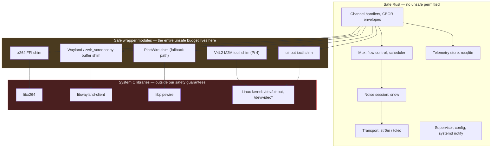

# ADR-0005 — Agent implementation language: Rust

## Status

Accepted — 2026-07-24. Constrains [ADR-0001](ADR-0001-transport.md) (`str0m` vs `webrtc-rs`), [ADR-0010](ADR-0010-agent-storage-engine.md), and the packaging design in [11-AGENT-DEPLOYMENT](../11-AGENT-DEPLOYMENT.md).

## Context

The Agent is a long-lived daemon on a Raspberry Pi with the following unusual combination of demands:

| # | Demand | Implication |
|---|---|---|
| A1 | It parses attacker-reachable bytes (ICE, DTLS, SCTP, Noise handshake) from anywhere on the internet | memory safety is not a preference |
| A2 | It holds `K_AS`, the key that *is* the Pi's identity | a heap-overflow read is a total compromise |
| A3 | It runs a soft-real-time video pipeline at 20–30 fps | allocator and GC behaviour show up as visible jitter |
| A4 | It must not meaningfully compete with the desktop it is streaming | RSS and CPU headroom are product features |
| A5 | It must run unattended for months, surviving power loss | no leaks, no unbounded queues, durable state |
| A6 | It needs deep FFI: Wayland, V4L2, uinput ioctls, x264, optionally PipeWire | the language's C interop story matters a lot |
| A7 | It ships as one artefact installable on Bookworm and Trixie, aarch64 | packaging and linkage matter |

Four candidates were considered seriously: Rust, Go, Python, and C/C++.

## Decision

**D1.** The Agent is written in **Rust** (2021 edition or later, stable toolchain, MSRV pinned and tested in CI).

**D2.** Core crate selection:

| Need | Crate | Maturity assessment |
|---|---|---|
| Async runtime | `tokio` | Excellent. Multi-threaded scheduler, mature, ubiquitous. |
| Noise handshake + transport | `snow` | Good. The de facto Rust Noise implementation, used in production by several networking projects. Small enough to read end to end — which we should. |
| WebRTC (ICE/DTLS/SCTP/DataChannel) | `str0m`, fallback `webrtc-rs` | **Adequate, and the weakest link.** See Negative below. |
| SQLite | `rusqlite` (bundled SQLite) | Excellent. Bundling removes a distro-version variable. |
| Syscalls, fds, ioctls | `rustix` | Good. Avoids `libc` unsafety for most of what we need. |
| Wayland client | `wayland-client` / `smithay-client-toolkit` | Good. `zwlr_screencopy_v1` bindings are generated from the protocol XML. |
| V4L2 M2M encoder (Pi 4) | thin ioctl wrapper over `rustix` | Thin — we will write and own this. |
| uinput | `evdev` / direct ioctl | Thin — we will write and own this. |
| x264 | FFI bindings | Thin C FFI wrapper. Unsafe boundary, small and auditable. |
| PipeWire (portal capture path) | `pipewire-rs` | **Immature.** The riskiest dependency; mitigated by making `zwlr_screencopy_v1` the primary path and PipeWire the fallback. |

**D3.** Build target `aarch64-unknown-linux-gnu` against the **oldest supported glibc** (Bookworm's), cross-compiled from x86-64 CI. Not musl — see below.

**D4.** The `unsafe` budget is explicit: `unsafe` is permitted only in the FFI shims for x264, V4L2, uinput and Wayland buffer handling, each behind a safe wrapper module with its own tests, and the whole set MUST be reviewable in under an hour. `unsafe` outside those modules requires a written justification in review.

## Consequences

### Positive

- A1/A2 answered structurally. The classes of bug that turn a network daemon into a remote-code-execution primitive — use-after-free, buffer overflow, double free, data race — are eliminated for all code outside the D4 `unsafe` budget. For a product whose entire value proposition is "the keys never leave the endpoints", this is not a nice-to-have.
- No GC. A3 and A4 benefit directly: encoder buffer lifetimes are deterministic, latency has no allocator-pause tail, and steady-state RSS is predictable. Estimates *(validate with benchmark)*: **15–40 MB RSS idle, 80–150 MB while streaming 720p** (dominated by capture buffers and encoder state, not by the runtime).
- Sum types and exhaustive matching map unusually well onto the protocol work: the Tunnel state machine, the mux frame types, and the 9-block error space in [05-PROTOCOL](../05-PROTOCOL.md) all become compiler-checked rather than convention-checked.
- `rusqlite` with a bundled SQLite removes an entire class of "works on Bookworm, breaks on Trixie" packaging failure.
- Sans-IO libraries (`str0m`, and `snow` in the same spirit) let the connectivity and crypto state machines be tested deterministically with simulated time and simulated packet loss — the only practical way to test NAT traversal without owning a lab of routers.

### Negative

- **The WebRTC ecosystem is the honest weak point, and Go is better here.** `pion/webrtc` is arguably the most mature non-C WebRTC stack in existence: years of production deployment, a large user base, and by far the best documentation. `str0m` and `webrtc-rs` are both credible but neither has pion's mileage, and `webrtc-rs` is itself a port *of* pion. If the transport layer turns out to be the thing that eats the schedule, this decision is the reason. Mitigation: `str0m` and `webrtc-rs` are interchangeable behind our own Transport trait boundary, and the WebSocket fallback path ([ADR-0001](ADR-0001-transport.md) D4) means a WebRTC stack failure degrades rather than breaks the product.
- Compile times. A cold release build of the full dependency tree is an estimated **3–8 minutes** on modern x86-64 CI, and **20–45 minutes** natively on a Pi — which is why D3 mandates cross-compilation. Incremental debug builds are fine; the pain is CI and release.
- `unsafe` does not disappear. x264, V4L2, uinput and Wayland shared-memory buffers all require it. Rust narrows the unsafe surface to a few hundred auditable lines rather than eliminating it, and the memory-safety claim must be stated with that qualification.
- Hiring and onboarding. The Rust pool is smaller than the Go pool and the ramp is steeper — realistically weeks, not days, for a developer new to the borrow checker and to async Rust specifically (which is the harder half).
- Async Rust ergonomics remain rough: `Pin`, cancellation-safety in `select!`, and lifetime interactions with trait objects are recurring sources of subtle bugs. Cancellation safety in particular is a live correctness hazard for a daemon that must not lose a half-written SQLite transaction or a half-sent Noise record.

> **Residual risk RR-0501:** The "single static binary" goal in the project baseline is **not fully achievable** as stated. The portal capture path requires `libpipewire`, whose plugin architecture depends on runtime dynamic loading; Wayland requires `libwayland-client`; and linking `libx264` statically has licensing consequences (see [ADR-0004](ADR-0004-screen-streaming.md)). The realistic and honest target is: **one self-contained executable with all Rust dependencies and SQLite statically linked, dynamically linked against glibc, `libwayland-client`, and optionally `libx264`/`libpipewire`, shipped as a `.deb` with declared dependencies.** [11-AGENT-DEPLOYMENT](../11-AGENT-DEPLOYMENT.md) should describe it that way rather than promising a fully static binary.

> **Residual risk RR-0502:** musl was rejected for D3 despite being the natural choice for static linking, because musl's default allocator performs poorly under multi-threaded allocation pressure — exactly the video pipeline's profile — with reported slowdowns of several times against glibc on allocation-heavy multi-threaded workloads. If static linking later becomes necessary, musl plus an explicit `mimalloc`/`jemalloc` global allocator is the path, and the encoder throughput must be re-benchmarked.

### Neutral

- Cross-compilation from x86-64 CI is straightforward for pure Rust but needs a sysroot for the C dependencies; a container-based cross toolchain is the standard answer and is a one-time setup cost.
- Rust's release cadence is fast; pinning an MSRV and testing it in CI is required to avoid Bookworm/Trixie toolchain drift. We do not use the distro's `rustc`.
- The Rendezvous service is a separate decision. The README permits Rust or Go there, and Go is a defensible choice for it — Rendezvous holds no long-term secrets and does no real-time work, so none of A1–A6 apply with the same force. See [ADR-0008](ADR-0008-rendezvous-hosting.md).

## Alternatives considered

| Option | Score /50 | Why rejected |
|---|---|---|
| **Rust** | **43** | Chosen. |
| **Go** | 36 | The strongest alternative and a defensible choice. Real advantages: `pion/webrtc` maturity (above), goroutines make the concurrent Channel/PTY/sampler design straightforward without async-Rust's sharp edges, onboarding is days rather than weeks, and cross-compilation to `linux/arm64` is a single environment variable. Rejected on: (1) the GC — modern Go pauses are sub-millisecond, but allocation pressure in a 30 fps video pipeline still shows up as p99 latency jitter and as 2–3× the steady-state RSS (estimated 30–60 MB idle, 120–250 MB streaming), against A3/A4; (2) **cgo**, which is where the argument really turns — the Agent needs FFI to x264, V4L2 ioctls, uinput, Wayland and possibly PipeWire, and cgo imposes per-call overhead, breaks goroutine preemption and stack growth assumptions, complicates static linking, and largely surrenders the "one binary, easy build" advantage that motivated Go in the first place; (3) memory safety is good but not equivalent — data races are still possible and are exactly the bug class A1 cares about. |
| **Python** | 14 | Rejected without difficulty for this component. The GIL forbids a real multi-threaded encode/capture/network pipeline; per-frame processing in interpreted code is not viable at 20 fps; RSS is high; a long-lived daemon accumulates the kind of resource leaks that only manifest at week three; and packaging a Python application with C extensions across Bookworm and Trixie is materially harder than shipping one binary. Python remains appropriate for build tooling, test harnesses and the network-emulation rig. |
| **C / C++** | 27 | Matches Rust on performance and beats it on library availability (libwebrtc, x264, Wayland, PipeWire are all native C/C++ citizens, no FFI shim needed). Rejected on A1/A2 alone: this is a network-facing daemon holding the key to a remote desktop, and the historical base rate of memory-safety CVEs in exactly this class of software is the reason Rust exists. Modern C++ with smart pointers and sanitisers narrows but does not close the gap, and the review burden per line is far higher. |

Scoring, 0–5 per criterion, weighted equally *(judgement, not measurement)*:

| Criterion | Rust | Go | Python | C++ |
|---|---|---|---|---|
| Memory safety in a network-facing daemon (A1, A2) | 5 | 4 | 4 | 1 |
| Real-time video pipeline behaviour (A3) | 5 | 3 | 0 | 5 |
| Memory footprint on a 1–8 GB Pi (A4) | 5 | 3 | 2 | 5 |
| Long-run stability, no leaks (A5) | 5 | 4 | 2 | 3 |
| WebRTC library maturity | 3 | **5** | 3 | 5 |
| Noise / crypto library quality | 5 | 4 | 3 | 4 |
| SQLite integration | 5 | 4 | 5 | 5 |
| FFI to x264 / V4L2 / Wayland / PipeWire (A6) | 4 | 2 | 3 | 5 |
| Single-artefact packaging & cross-compile (A7) | 4 | 5 | 1 | 3 |
| Developer availability & onboarding | 2 | 5 | 5 | 3 |
| **Total** | **43** | **36** | **14** | **27** |

The table is deliberately unflattering in two places — WebRTC maturity and developer availability — because those are the two rows most likely to cause regret, and they should be visible when this decision is revisited.

## Revisit if

- The `str0m`/`webrtc-rs` transport work consumes more than an estimated 30% of Agent implementation effort, or fails to sustain 6 Mbps on a Pi 4. A Go transport sidecar process speaking a local IPC to a Rust core is an ugly but viable escape hatch that preserves the memory-safety properties where they matter most.
- `pipewire-rs` proves unusable and the portal capture path becomes mandatory on some target compositor — that would force either C FFI directly against `libpipewire` or a reassessment.
- The x264 licensing question (see [ADR-0004](ADR-0004-screen-streaming.md)) forces a change of encoder that has better bindings in another ecosystem.
- Team composition changes such that Rust expertise is unavailable. This is a legitimate reason to revisit and should not be treated as a technical defeat; Go would produce a working product.
- Raspberry Pi OS ships a Rust toolchain new enough to build the Agent natively at acceptable speed, which would simplify contributor onboarding and remove the cross-compilation sysroot from CI.
