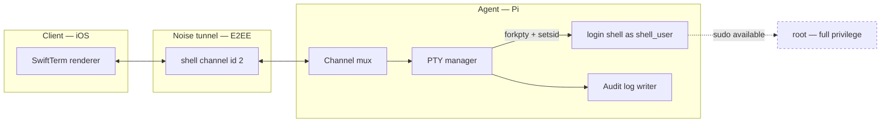

# ADR-0006 — Shell transport: embedded PTY channel vs proxying real OpenSSH

## Status

Accepted, 2026-07-24. Supersedes nothing. Constrains [../05-PROTOCOL.md](../05-PROTOCOL.md) (`shell` channel, id 2) and [../11-AGENT-DEPLOYMENT.md](../11-AGENT-DEPLOYMENT.md) (privilege model).

## Context

The Remote Shell feature requires an interactive terminal on the Pi, rendered by SwiftTerm in the Client. Two structurally different ways to deliver it:

1. **Embedded PTY.** The Agent itself allocates a pseudoterminal, forks a login shell into it, and streams the raw byte stream over the `shell` channel (id 2) of the existing Noise tunnel. The tunnel is the only transport; SSH does not exist anywhere in the path.
2. **SSH proxy.** The Agent forwards the tunnel's `shell` channel to a local TCP connection to `127.0.0.1:22`, and the Client speaks the SSH protocol end-to-end over the (already encrypted) tunnel.

The choice is not primarily about the terminal. It is about **how many authentication systems the product has**, and about principle P2 (no inbound ports) and P3 (explicit trust) from the [README](../../README.md).

Relevant constraints already fixed elsewhere:

| Constraint | Source | Consequence for this ADR |
|---|---|---|
| No inbound listening port on the Pi | P2, [ADR-0001](ADR-0001-transport.md) | Even the SSH-proxy option would tunnel to a *loopback* sshd, not an exposed one — so P2 survives either way |
| Trust established once, out-of-band, by fingerprint | P3, [../04-SECURITY-E2EE.md](../04-SECURITY-E2EE.md) | A second trust root (SSH host keys) would be a second thing to verify |
| Single static binary, no runtime deps | [ADR-0005](ADR-0005-agent-language.md) | An SSH *client* in Swift is a large new dependency on the Client side |
| Channel mux with credit-based flow control | [../05-PROTOCOL.md](../05-PROTOCOL.md) §framing | Byte-stream semantics are already available for free |

## Decision

**The Agent spawns a PTY directly and streams bytes over the `shell` channel (id 2) inside the existing Noise tunnel. We do not run, require, or proxy SSH.**

Concretely:

| Aspect | Decision |
|---|---|
| Transport | `shell` channel, id 2, priority class P2, initial credit window 256 KiB |
| Framing | Opaque byte payloads with a fixed binary header — **not** CBOR-wrapped (see [ADR-0007](ADR-0007-serialization.md)) |
| Session model | One PTY per open `shell` channel; multiple concurrent shells are multiple channel instances |
| Shell process | The user's login shell from the passwd database, started as a login shell |
| Running user | The configured `shell_user`, defaulting to the Pi's desktop/owner user. **Not root.** |
| Control ops | Resize, signal delivery, environment seeding, and exit status are explicit message types on the same channel, defined in [../05-PROTOCOL.md](../05-PROTOCOL.md) |
| Error space | 5000–5099, per CANON §9 |

The Agent daemon itself runs as the unprivileged system user `pimon`; spawning a PTY as `shell_user` therefore requires either a privileged helper or capability retention. This interacts directly with the systemd hardening in [../11-AGENT-DEPLOYMENT.md](../11-AGENT-DEPLOYMENT.md) and is called out as a negative consequence below.

### The privilege question, stated plainly

The shell runs as an ordinary desktop user, not root. This is a real reduction in blast radius for *accidental* damage and for a bug in our own PTY code. It is **not** a security boundary against the Client, because that user is in `sudo` on essentially every Raspberry Pi OS install.

> **Residual risk RR-06a:** The `shell` channel is, in practice, a full-privilege remote-code-execution path into the Pi. Anyone who can open a Tunnel can become root via `sudo`. The only controls are (a) the pairing ceremony that gates who can open a Tunnel at all, (b) the biometric gate on `K_CS` unwrapping, and (c) the audit log. The allow-listed Action mechanism exists precisely so that routine operations do *not* require opening this path — see the `Action` definition in [../00-GLOSSARY.md](../00-GLOSSARY.md). Users who want a genuinely lower-privilege remote shell MUST configure `shell_user` as a non-sudo account; the product SHOULD surface this as a setting, and SHOULD warn when `shell_user` has sudo rights.

Every `shell` channel open, the resolved user, the client device fingerprint, the peer address class, and the exit status MUST be written to the audit log per the audit-logging requirements in [../04-SECURITY-E2EE.md](../04-SECURITY-E2EE.md). The audit log is the compensating control for RR-06a; without it this decision is not defensible.

## Side-by-side comparison

| Dimension | **Embedded PTY (chosen)** | SSH proxy to loopback `sshd` |
|---|---|---|
| Trust roots to verify | 1 — the pairing fingerprint | 2 — pairing fingerprint **and** SSH host key |
| Credentials the user manages | none beyond pairing | SSH key or password, plus `authorized_keys` |
| Inbound port on the Pi | none | none (loopback only) — **P2 holds either way** |
| Requires `sshd` installed and running | no | yes; disabled by default on Raspberry Pi OS |
| New Client-side dependency | none (SwiftTerm consumes a byte stream) | a full SSH client in Swift — large, security-critical, no first-party API |
| Encryption layers | 1 (Noise) | 2 (Noise + SSH) — the second adds no security |
| Flow-control loops | 1 (our credit windows) | 2, interacting — a known source of stalls |
| PAM account policy | **absent**, partially reimplemented | full |
| `utmp`/`wtmp`, `who`/`w`/`last` | **absent** unless `libutempter` adopted | full |
| `motd` / `pam_motd` | absent | full |
| scp / sftp | via `files` channel (id 5) | free |
| Port / agent / X11 forwarding | not offered | free |
| Resize, signals, exit status | ours, defined cleanly in [../05-PROTOCOL.md](../05-PROTOCOL.md) | via SSH channel requests, must be translated |
| Implementation scrutiny | ours, new | 25 years of adversarial review |
| Failure blast radius of a bug | local privilege / session hijack on the Pi | same class, but in far better-tested code |
| Bytes on the wire, idle session | keepalive only | keepalive + SSH keepalive + packet padding |

The table is close to even on capability. It is decisively one-sided on **surface area**: the embedded PTY removes an entire authentication system, an entire daemon, and an entire Client-side protocol implementation. What it costs is PAM and login accounting — two specific, enumerable gaps rather than a diffuse risk. That asymmetry is why the decision goes the way it does.

### The `utmp`/PAM gap in concrete terms

| What a sysadmin expects | What they get with the embedded PTY |
|---|---|
| `who` shows the remote session | nothing |
| `w` shows idle time and current command | nothing |
| `last` shows a login record | nothing |
| `/var/log/auth.log` records the login | nothing (we write our own audit record elsewhere) |
| `pam_limits` applies `ulimit` policy | not applied — the Agent MUST set resource limits itself |
| Locked/expired account is refused | only if the Agent checks explicitly (it MUST) |
| `pam_env` / `/etc/environment` applied | only what the login shell sources itself |

This is the single most defensible criticism of this ADR. The mitigation — our own audit log plus optional `libutempter` — closes the *accountability* gap but not the *conventional tooling* gap. It MUST be stated in the user-facing documentation rather than left for a surprised administrator to discover.

## Consequences

### Positive

| Consequence | Detail |
|---|---|
| One trust root, not two | The terminal inherits the pairing ceremony's authentication. No host keys, no `known_hosts`, no `authorized_keys`, no key-distribution UX on a phone. |
| No sshd requirement | The product works on a Pi with SSH disabled entirely, which is the safer default and is what Raspberry Pi OS ships. Nothing we do encourages the user to enable a network-reachable sshd. |
| No SSH client on iOS | We avoid pulling an SSH implementation into Swift 6. SwiftTerm renders a byte stream; that is all it needs. The alternative would mean vendoring or writing SSH transport, kex, and auth in Swift — a large, security-critical, poorly-covered dependency. |
| Clean control semantics | Resize, signals, exit status, and environment are first-class typed messages we define, rather than SSH channel requests we must translate. Window resize in particular is trivially correct. |
| Flow control already solved | The mux's 256 KiB credit window handles a runaway `cat` of a large file without head-of-line-blocking `control` or `input`. With an SSH proxy we would be stacking SSH's own window management on top of ours — two independent flow-control loops interacting, which is a known source of stalls. |
| Cheaper on the wire | No second handshake, no second encryption layer, no SSH packet padding. An SSH proxy would encrypt everything twice for zero added security, since the tunnel is already E2EE. |

### Negative

| Consequence | Detail | Mitigation |
|---|---|---|
| We reimplement part of OpenSSH | Session setup, PTY allocation, signal forwarding, environment construction, exit propagation, `TERM` handling. | Keep the surface deliberately small; these are the well-understood parts. Explicitly do **not** implement agent forwarding, port forwarding, X11 forwarding, or subsystems. |
| No decades of scrutiny | OpenSSH's PTY and privilege-separation code has been attacked for 25 years. Ours will not have been. A bug in our PTY handling — fd leakage into the child, failure to `setsid`, failure to detach the controlling terminal, TIOCSTI-style injection, or an unsanitised environment — is a local privilege or session-hijack issue. | Treat PTY spawn as security-critical code in review; specific items appear in the release security checklist in [../04-SECURITY-E2EE.md](../04-SECURITY-E2EE.md). Use `rustix` for the raw syscalls rather than hand-rolled `unsafe`. |
| **No PAM** | We are not a PAM consumer, so `pam_limits`, `pam_env`, `pam_systemd`, account expiry, and site login policy do not apply to our sessions. A locked or expired account could still get a shell unless we check explicitly. | The Agent MUST consult the shadow/account status (expiry, locked flag, valid shell) before spawning, and MUST refuse otherwise. This replicates a small part of `pam_unix`/`pam_account`, imperfectly. |
| **No `utmp`/`wtmp` accounting** | `who`, `w`, and `last` will not show the remote session. To a sysadmin inspecting the Pi, our shell is invisible in the standard places. This is a genuine, user-visible transparency gap and arguably an anti-feature for a security product. | Two-part: (1) the Agent writes its own audit record for every session, exposed in-app and on disk; (2) the Agent SHOULD write `utmp`/`wtmp` entries via `libutempter` so the session appears in `who`. `libutempter` is a small C dependency and conflicts with the "single static binary" goal — if it is not adopted, the gap MUST be documented in the user-facing docs rather than hidden. |
| No `motd`/`/etc/profile.d` guarantees | A login shell will source the usual profile scripts, but `motd` and `pam_motd` output will be absent. | Cosmetic; the Client MAY render the audit banner itself. |
| No scp/sftp/port forwarding | Users who expect SSH ergonomics lose file transfer and tunnelling. | File transfer is served by the `files` channel (id 5), specified in [../05-PROTOCOL.md](../05-PROTOCOL.md). Port forwarding is out of scope for v1. |
| `systemd` hardening must be relaxed | Spawning a process as another user needs `CAP_SETUID`/`CAP_SETGID` retained, which weakens the unit's `CapabilityBoundingSet` and makes `NoNewPrivileges` impossible for the spawning path. | See [../11-AGENT-DEPLOYMENT.md](../11-AGENT-DEPLOYMENT.md). The cleanest structure is a tiny privileged spawn helper with the Agent proper staying unprivileged; this is the recommended shape. |

### Neutral

- The Client's terminal is a pure byte-stream consumer, so switching to an SSH proxy later is a Client-side change plus a new channel type — it does not invalidate the mux, the crypto, or the pairing model.
- We control the `TERM` value we advertise, so we can guarantee SwiftTerm's capabilities match rather than negotiating against an arbitrary terminfo.
- Concurrent shells cost one PTY pair and one child process each; the practical ceiling is the Agent's configured session limit, not a protocol limit.

## Alternatives considered

| Option | Why rejected |
|---|---|
| **Proxy the tunnel to a loopback `sshd`** | Genuinely the strongest alternative. It reuses OpenSSH's hardened, audited implementation; it gives PAM, `utmp`, `motd`, account policy, scp/sftp, and port forwarding for free; and tunnelling to `127.0.0.1:22` does not violate P2 because nothing listens on a public interface. Rejected because: (a) it requires sshd to be installed, running, and correctly configured — an install-time dependency and a support burden on a distro that ships it disabled; (b) it doubles the authentication surface, and the second one (SSH keys or passwords) is not covered by the pairing ceremony, so a Client that passed fingerprint verification would still face a second credential prompt; (c) host-key verification UX on a phone is genuinely bad, and doing it badly means TOFU, which [../00-GLOSSARY.md](../00-GLOSSARY.md) explicitly rejects; (d) it forces a full SSH client implementation in Swift, since no first-party Apple API exists and the mature options are C libraries with awkward iOS packaging. The cost is concentrated on the platform where we can least afford security-critical new code. |
| **Proxy to loopback sshd, with the Agent auto-provisioning an SSH key** | Removes the double-credential problem by having the Agent write its own key into the shell user's `authorized_keys` and hand the private key to the Client. Rejected: the Agent minting SSH credentials and shipping a private key to the phone creates a *third* long-lived secret with its own storage, rotation, and revocation story, and an `authorized_keys` entry that outlives our uninstall is a persistence footgun. Strictly worse than either clean option. |
| **`systemd-run --machine`/`machinectl shell`** | Would give PAM, `utmp`, and proper session registration via `logind`, which fixes our two biggest gaps. Rejected for v1: it adds a hard dependency on `systemd-run` semantics and D-Bus policy, requires privileged D-Bus access from the Agent (a different but not smaller privilege surface), and its behaviour on a headless lingering session is fiddly. Worth revisiting — see below. |
| **Non-interactive command execution only (no PTY)** | Send a command, get stdout/stderr/exit code. Much smaller attack surface and no terminal emulation. Rejected as insufficient: the product promises an *interactive* terminal, and TUI programs (`htop`, `nano`, `raspi-config`) are exactly what a Pi admin needs. The allow-listed Action mechanism already covers the non-interactive case for the safe subset. |
| **Web terminal (ttyd/gotty) proxied over the tunnel** | Rejected: adds an HTTP server and a browser-grade rendering stack for no benefit, and puts a local listening socket on the Pi that is reachable by any local user — a worse local-attacker posture than a Unix-domain-socketed PTY manager. |

## Revisit if

- **`libutempter` or `logind` integration becomes cheap.** If we can register sessions with `logind` without taking on broad D-Bus privilege, the PAM/`utmp` gap closes and the main honest weakness of this decision goes away.
- **Users demand scp/sftp or port forwarding at volume.** The `files` channel covers transfer; if forwarding demand appears, the right answer is probably an opt-in "SSH-over-tunnel" mode that reuses the mux as a raw TCP forwarder, offered *in addition* to the embedded PTY, not instead of it.
- **A serious vulnerability is found in our PTY handling.** Two incidents would be sufficient evidence that we are on the wrong side of the build-vs-reuse line, and the loopback-sshd proxy should be reconsidered with the host-key problem solved by binding the SSH host key fingerprint into the pairing record (which is actually tractable — the Agent knows its own host key and can attest it inside the already-authenticated tunnel).
- **Multi-user support enters scope.** v1 assumes a single Owner. Real multi-user shells would need per-user authorisation, per-user audit, and probably PAM — at which point reusing OpenSSH becomes much more attractive.
- **A non-`systemd` or immutable-OS target appears.** The privileged-spawn-helper shape assumes a conventional distro layout.
