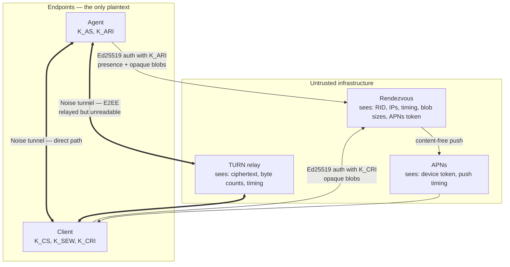

# ADR-0008 — Self-hosted vs managed Rendezvous, and how to keep it zero-knowledge

## Status

Accepted, 2026-07-24. Binding on [../05-PROTOCOL.md](../05-PROTOCOL.md) (Rendezvous API surface) and [../04-SECURITY-E2EE.md](../04-SECURITY-E2EE.md) (malicious-Rendezvous adversary). Depends on [ADR-0001](ADR-0001-transport.md).

## Context

The Agent never listens on an inbound port (principle P2). Both endpoints therefore dial *out*, and something must introduce them. That something is the Rendezvous: it exchanges opaque connection-setup blobs, tracks presence, hands out short-lived TURN credentials, and triggers content-free APNs pushes so a sleeping Client can be woken.

This is the only always-on internet-facing component in the system, and it is the component the user is least able to inspect. The [glossary](../00-GLOSSARY.md) declares it **untrusted by design**. That declaration is only meaningful if the *protocol* makes the operator's honesty irrelevant — otherwise it is marketing.

Two questions, entangled:

1. **Who runs it?** A project-operated instance is the only thing most users will tolerate; a self-hosted instance is the only thing a paranoid user will accept.
2. **What can whoever runs it do?** This must be bounded by cryptography and by design, not by policy or a privacy statement.

The second question dominates. If the answer to (2) is tight enough, (1) becomes a deployment convenience rather than a trust decision.

## Decision

**Rendezvous is self-hostable by design, and the project operates a default instance. The protocol is constructed so that operating the Rendezvous confers no ability to read, forge, replay, or impersonate.**

### Design rules that make this true

| # | Rule | What it buys |
|---|---|---|
| R1 | **Blob-opaque signaling.** Rendezvous relays setup blobs it cannot parse. SDP and ICE candidates are carried inside the encrypted envelope, not as fields the server reads. | The operator cannot rewrite candidates to force a relay path it controls, nor learn the peers' local topology beyond blob size. |
| R2 | **Separate Ed25519 rendezvous identity keys** (`K_ARI`, `K_CRI`), distinct from the Noise statics (`K_AS`, `K_CS`). Rendezvous authenticates a challenge signature against these and nothing else. | Full compromise of Rendezvous and of every credential it holds yields **zero** ability to impersonate a Noise endpoint. This is the single most important structural decision in this ADR. |
| R3 | **Rendezvous never holds `K_AS`.** The Client learns the Agent static key from the QR code at pairing time (see [../04-SECURITY-E2EE.md](../04-SECURITY-E2EE.md)). Rendezvous has no reason to know it and is never told. | A Noise_IK initiator must already know the responder's static key; a Rendezvous that does not have it cannot mount the responder side of a handshake, even against a Client it can reach. |
| R4 | **Stateless, with hard TTLs.** Presence 90 s, signaling blob 60 s, pairing token 600 s (CANON §7). Nothing durable except the APNs device token binding. | A subpoena, a disk seizure, or a database dump yields a near-empty set. There is no history to take. |
| R5 | **No accounts.** No email, no password, no username, no billing identity tied to a rendezvous id. | Nothing links a rendezvous id to a human at the service layer. |
| R6 | **Rotatable rendezvous ids.** `RID` is a 128-bit opaque value, rotatable by the Owner without re-pairing. | Limits long-term linkability of one Pi across time. |
| R7 | **No plaintext logging of blob bytes.** Request logs record method, status, timing, and a hashed IP with ≤ 24 h retention, for abuse control only. | Bounds the incident blast radius of the operator being compromised. |
| R8 | **TURN credentials are short-lived HMAC tokens** (coturn REST-style), minted per session with a lifetime measured in minutes. | A leaked credential is not a standing relay account. |

### What the operator can and cannot see

Stating this precisely is the point of the ADR. Vagueness here is how E2EE products mislead their users.

| Visible to the operator | Not visible to the operator |
|---|---|
| Rendezvous ids (`RID`) and which ones talk to which | Any plaintext: telemetry values, screen content, keystrokes, shell bytes, filenames, alert text |
| Public IP addresses of both Agent and Client, and their ASNs | Any long-term secret capable of impersonating an endpoint |
| Connection timing: when the Pi is online, when the phone connects, session start/stop | The Noise static public keys (`K_AS`, `K_CS`) — never transmitted to it |
| Blob sizes and message counts | The contents of ICE candidates and SDP (R1) |
| The APNs device token for each paired Client | The alert body, metric name, or threshold that triggered a push |
| Relayed byte volume and packet timing, when TURN is used | Which channel (`screen`, `shell`, `telemetry`) the relayed bytes belong to |
| Rough usage pattern: session frequency, session duration, relay-vs-direct | Anything about the Pi itself: model, hostname, OS, installed software, load |

> **Residual risk RR-08a:** Metadata leakage is **real and not mitigated**. A malicious or compelled Rendezvous operator learns when the Owner is at home (IP geolocation of the Client), when the Pi is powered on, how often and how long the Owner uses remote desktop, and — from relayed byte-rate patterns — whether a session was an idle telemetry poll or an active video session. Traffic-analysis defences (cover traffic, padding, timing jitter) are **not** implemented, because the bandwidth and battery cost is disproportionate for the threat model of a single-Owner home device. Users for whom this metadata is sensitive MUST self-host, and should understand that self-hosting moves the metadata to their VPS provider rather than eliminating it.

> **Residual risk RR-08b:** The Rendezvous can **deny service** — refuse to relay, drop presence, withhold TURN credentials, or selectively block one Client. Availability is not protected by any of the above. A malicious operator cannot read, but can silence. Detection: the Client SHOULD surface "cannot reach Rendezvous" distinctly from "Pi offline", so that a censoring operator is at least visible as a fault.

> **Residual risk RR-08c:** The Rendezvous can attempt to **force the relayed path** by withholding or delaying signaling so that direct candidates time out, thereby routing all traffic through a TURN server it controls. This costs it nothing and gains it byte-level timing analysis (but not plaintext). Mitigation: the Client MUST display the current path (direct / STUN-reflexive / TURN-relayed / WebSocket-fallback) in the session UI, and MUST record path selection in the audit log, so that a persistent unexplained relay is user-visible.

### The APNs constraint — stated honestly

Push notifications require a connection to Apple's APNs gateway authenticated with an **Apple Developer team key or certificate tied to the app's bundle identifier**. That key belongs to whoever ships the app on the App Store. A self-hosted Rendezvous therefore **cannot send pushes to the App Store build of the Client**.

This is a hard architectural constraint imposed by Apple, not a design choice, and it partially undermines the "fully self-hostable" claim. The options are:

| Self-hosting posture | Push works? | Consequence |
|---|---|---|
| Project instance for everything | Yes | Default. Operator sees the metadata in the table above. |
| Self-hosted signaling + project instance for `/notify` only | Yes | The project instance learns the APNs token and *that* an alert fired for some Client, plus push timing. It does not learn the rendezvous id used for signaling, the alert content, or the peers' addresses. This is the recommended middle path and MUST be supported as a distinct configuration. |
| Fully self-hosted, App Store build | **No** | Alerts do not wake the phone. Degrades to: alerts appear when the app is next opened, plus a `BGAppRefreshTask` best-effort catch (see [ADR-0009](ADR-0009-widget-data-path.md)). Widgets become stale between foreground sessions. Honest summary: **you lose timely alerting**, which is a headline feature. |
| Fully self-hosted, self-built app with own developer account | Yes | Requires a paid Apple Developer account, a macOS build, and sideloading or a private distribution. Realistic for perhaps 1% of users. |

> **Residual risk RR-08d:** "Self-hostable" is true for signaling, presence, relay, and TURN, and **false for push**. Any user-facing claim MUST be worded accordingly. Claiming a fully self-hostable stack without the developer-account caveat would be misleading.

### Cost model

Signaling is effectively free; TURN is not. Estimates below are **engineering estimates — validate with a benchmark** once real session-mix data exists.

| Component | Per-unit traffic | Monthly per active pair | Cost at €0.01/GB (budget VPS) | Cost at $0.09/GB (hyperscaler) |
|---|---|---|---|---|
| Presence heartbeat, 30 s interval | ~200 B/beat | ~17 MB | €0.0002 | $0.0015 |
| Signaling blobs, ~30 sessions/month | ~4 KB/session | ~120 KB | negligible | negligible |
| Push triggers | ~1 KB each | negligible | negligible | negligible |
| **TURN relay, screen session at 2 Mbps** | **~0.9 GB/hour** | **10 h/month × 20% relayed = ~1.8 GB** | **€0.018** | **$0.16** |
| TURN relay, heavy user, 40 h/month, 35% relayed | ~12.6 GB | €0.13 | $1.13 | |

The ratio is the point: **TURN traffic is roughly 100–1000× everything else combined.** Signaling for ten thousand users fits on one small VPS. TURN for the same population does not — at 20% relay incidence and 10 h/month each, that is ~18 TB/month, i.e. €180 on budget egress and ~$1,600 on hyperscaler egress. Note also that a TURN relay pays egress *twice* (once toward each peer) for bytes it received once, so naive per-GB estimates understate cost by up to 2×.

Consequences for hosting policy:

- The project instance MUST rate-limit and quota TURN per rendezvous id, and MUST make relay quota exhaustion a visible, non-silent failure.
- Bring-your-own-TURN MUST be a supported configuration — it is the pressure valve for both cost and RR-08c.
- Any free tier must budget for relay, not for signaling. A free tier that ignores TURN will fail the moment remote desktop gets used.

### Abuse control without identity

There are no accounts (R5), so abuse control must work on cryptographic and network signals only:

| Vector | Control |
|---|---|
| Rendezvous-id enumeration | 128-bit ids; constant-time lookup; no distinction in response or timing between "unknown id" and "id offline" |
| Pairing-token brute force | 256-bit token, single-use, 600 s TTL, hard attempt cap per `RID`, then the token is burned |
| Presence spam / registration flood | Ed25519 signature required before any state is written; per-IP and per-key token buckets; proof-of-work challenge available under load |
| TURN credential farming | Credentials minted only for a `RID` with an active paired peer, short lifetime, per-`RID` bandwidth quota |
| Relay-fallback abuse (using `/relay` as a free VPN) | Byte quota and rate cap on the WebSocket fallback, deliberately set low enough to carry telemetry and shell but to make screen streaming unpleasant — the fallback is a last resort, not a supported streaming path |
| Signaling-blob storage abuse | Max blob size, TTL 60 s, per-`RID` blob count cap |
| DoS on the signature check | Cheap rate-limit checks (IP bucket, size cap) MUST run before the Ed25519 verification, which is the expensive step |

## Consequences

### Positive

- Trust in the operator is not required for confidentiality or integrity. The strong claim — "the Rendezvous cannot read or forge a byte" — is backed by R2/R3, not by policy.
- A compromise of the Rendezvous is an availability and metadata incident, not a confidentiality incident. That is a categorically different severity class.
- Self-hosting is a genuine option for signaling, presence, and relay, which satisfies the audience that would otherwise reject the product outright.
- Statelessness makes horizontal scaling and multi-region deployment trivial, and makes the compliance surface small — there is almost nothing to disclose, retain, or export.

### Negative

- **Two identity key pairs per endpoint** instead of one. `K_ARI`/`K_CRI` must be generated, stored, backed up, and revoked alongside the Noise statics. This is real added complexity in [../04-SECURITY-E2EE.md](../04-SECURITY-E2EE.md) and in the backup/restore flow in [../06-DATA-MODEL.md](../06-DATA-MODEL.md), and it is the price of R2.
- Metadata leakage is unmitigated (RR-08a).
- The push path is not self-hostable (RR-08d), so "self-hosted" ships with an asterisk.
- Operating a default instance means the project carries availability responsibility, TURN egress cost, and abuse-handling burden for users who never chose to trust it explicitly.
- Blob opacity (R1) means the server cannot do useful things it otherwise could — e.g. it cannot filter obviously malformed ICE candidates, cannot pre-select a nearby TURN region from candidate contents, and cannot give good diagnostics for a failed connection. Debugging connectivity issues is meaningfully harder as a direct consequence, and this is a cost we accept.

### Neutral

- Bring-your-own-Rendezvous and bring-your-own-TURN are the same mechanism (a URL plus a trust-on-configure decision), so supporting one costs little more than supporting the other.
- The `/relay` WebSocket fallback makes Rendezvous a byte relay in the worst case, which is architecturally identical to TURN from a trust standpoint — still ciphertext, still unreadable — but it changes the cost profile, hence the deliberate quota.

## Alternatives considered

| Option | Why rejected |
|---|---|
| **Project-managed only, no self-hosting** | Simplest to operate and support, and the honest reality for ~99% of users. Rejected as the *only* option: it makes "untrusted by design" unfalsifiable for anyone who cares, and it creates a single point of coercion. Supporting self-hosting costs mainly documentation once the protocol is already operator-agnostic. |
| **Self-hosting only, no default instance** | Maximally honest, and eliminates project operating cost and liability. Rejected: it makes the product unusable for the target user (a person with a Raspberry Pi and an iPhone, not a person with a VPS), and — because of the APNs constraint — it would ship with alerting broken by default, which is a headline feature. |
| **Serverless / edge (Cloudflare Workers + Durable Objects, Fly.io)** | Genuinely attractive: global anycast reduces signaling latency, Durable Objects map cleanly onto per-`RID` presence and blob state, and cost at low volume is near zero. Not rejected outright — it is a viable implementation of the project instance and SHOULD be evaluated. Not mandated because (a) it makes self-hosting harder, since the same code must also run as a plain binary on a VPS, (b) TURN cannot run on that substrate at all and needs separate infrastructure regardless, and (c) egress pricing at relay volumes is the dominant cost and is not improved. |
| **No Rendezvous at all: DDNS + port forwarding** | Zero infrastructure, zero operator, zero metadata leak to a third party. Rejected: it **violates principle P2** by requiring an inbound listening port on the Pi, which is the single largest attack-surface increase available to this design. It also fails behind CGNAT (a large and growing fraction of home connections), requires router configuration most users cannot do, and provides no push-wake path. Non-starter. |
| **Rendezvous as a trusted broker that validates SDP/ICE** | Would enable better diagnostics, smarter TURN region selection, and candidate sanity checks. Rejected: it requires the server to parse signaling content, which breaks R1 and hands the operator the ability to rewrite candidates and force paths of its choosing. The diagnostic benefit is not worth converting an untrusted component into a trusted one. |
| **Federated Rendezvous (multiple interoperating instances)** | Rejected as premature. Adds inter-instance trust, discovery, and routing problems for a single-Owner product where both endpoints are configured by the same person and can simply be pointed at the same URL. |
| **DHT / fully decentralised discovery** | No operator at all, and the strongest possible answer to RR-08a/RR-08b. Rejected for v1: DHT membership is itself a metadata leak (and a much more public one), NAT traversal still needs STUN/TURN, battery cost on iOS is prohibitive, and there is no push-wake path. Revisit only if the threat model changes fundamentally. |

## Revisit if

- **Relay egress cost becomes the dominant operating expense.** The lever is bring-your-own-TURN by default plus aggressive direct-path optimisation, not a bigger relay bill.
- **Apple relaxes the APNs constraint**, or a viable non-APNs wake mechanism appears for iOS. RR-08d is the largest honesty caveat in this ADR and it is entirely Apple's to remove.
- **Metadata resistance becomes a stated product goal.** That would require padding, timing defences, and possibly onion routing for signaling — a different product with a materially worse battery and bandwidth profile. Do not bolt it on; redesign.
- **A second client platform appears.** Android's push story (FCM) has the same operator-key constraint but different self-hosting options (UnifiedPush is a real alternative), which would change the RR-08d calculus.
- **Legal compulsion is attempted against the project instance.** The correct response is to verify that R4 and R7 actually leave nothing to hand over, and to publish what was requested and produced. If the answer turns out to be "more than we claimed", this ADR is wrong and must be corrected immediately.
- **Presence timing turns out to leak more than expected**, e.g. if heartbeat intervals let an observer fingerprint Pi models or user routines with high confidence. Randomised heartbeat jitter is a cheap partial mitigation available at that point.
