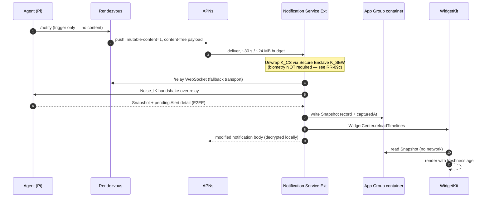

# ADR-0009 — Widget data path under iOS background-execution limits

## Status

Accepted, 2026-07-24. Binding on `docs/08-WIDGETS.md` (owned separately) and on the push-privacy section of [../04-SECURITY-E2EE.md](../04-SECURITY-E2EE.md). Depends on [ADR-0001](ADR-0001-transport.md) (WebSocket fallback) and [ADR-0008](ADR-0008-rendezvous-hosting.md) (push trigger).

## Context

The product promises Home Screen and Lock Screen widgets showing live Pi telemetry: temperature, CPU, memory, disk, uptime, alert state. Widgets are the feature most likely to be judged on *freshness*, and iOS is structurally hostile to freshness.

The hard constraints:

| Constraint | Reality on iOS 17+ |
|---|---|
| Widget extensions cannot hold long-lived connections | A `TimelineProvider` runs for a few seconds, in a memory-constrained extension process, and is killed. There is no background socket. |
| Timeline reload budget | The system decides. For a frequently-viewed widget the practical ceiling is roughly **40–70 reloads per day** — an observed norm, **not a documented guarantee**, and it shrinks with Low Power Mode, low battery, and infrequent viewing. `WidgetCenter.reloadTimelines` is a *request*, not a command. |
| `BGAppRefreshTask` | Opportunistic. Scheduling a 15-minute interval does not produce 15-minute execution. In practice it can be hours late, and on a low-battery or rarely-used device it may not fire for a day. Unusable as a primary freshness mechanism. |
| Notification Service Extension (NSE) | Runs on receipt of a `mutable-content` push. Wall-clock budget ~**30 s**; memory limit around **24 MB** (documented figures vary by iOS version — treat as ~24 MB and validate with a benchmark). Exceeding either kills the extension and the original push is delivered unmodified. |
| Silent pushes (`content-available`) | Throttled aggressively and coalesced by the system; delivery is explicitly best-effort and stops entirely for apps the user rarely opens. |
| Live Activities | Better push latency and a dedicated push token, but limited lifetime: ~**8 h** active, ~**12 h** total including the dismissed state, plus `.frequent` push budgeting. Suitable for a bounded event, not for permanent monitoring. |

Two further constraints come from our own design:

- **Push payloads are content-free** (principle P1, [../04-SECURITY-E2EE.md](../04-SECURITY-E2EE.md)). The push carries no metric value, no alert text, no threshold. Whatever the user sees must be **fetched** from the Pi, not read from the push.
- **The only plaintext lives at the endpoints.** A widget therefore cannot read data from a server; it must read data that the *phone itself* has already decrypted.

## Decision

**Widgets read a locally cached Snapshot record from the App Group shared container. Widgets never open a Tunnel, never perform network I/O, and never touch key material.**

Freshness is supplied by three writers, in priority order:

| # | Writer | Trigger | Typical latency to widget | Reliability | Battery cost | Work it can do |
|---|---|---|---|---|---|---|
| 1 | **Notification Service Extension** | Content-free APNs push from Rendezvous, sent when the Agent raises an Alert or on a scheduled nudge | **2–8 s** (estimate — validate with benchmark) | High when a push is sent; entirely dependent on APNs delivery | Low per event; bounded by push frequency | Open a short-lived Tunnel over the **WebSocket fallback**, fetch one Snapshot, write App Group, request reload, and rewrite the notification body |
| 2 | **Main app** | Foreground entry, backgrounding, any open Tunnel receiving a Snapshot | Immediate while running | Certain, but only while the user is in the app | Already paid | Anything — full WebRTC, screen, shell |
| 3 | **`BGAppRefreshTask`** | Opportunistic system scheduling | **15 min – many hours; may never fire** | Low | Low | Same as the NSE path, with a slightly larger budget |
| — | Widget timeline provider itself | System reload | n/a | — | — | **Read the cache only.** No network, no crypto. |

### Why the NSE is the primary path

`BGAppRefreshTask` is too unreliable to promise anything, and the main app only runs when the user is looking. The NSE is the **only** mechanism on iOS that reliably runs our code, on our schedule, with network access, in response to a remote event. It is therefore load-bearing for both alerting and widget freshness, and its constraints propagate backwards into transport design.

Specifically: **a full WebRTC stack will not fit in an NSE.** ICE gathering, DTLS, and the media machinery blow both the ~24 MB memory ceiling and a meaningful chunk of the 30 s wall clock before a single byte of application data moves. A minimal WebSocket + Noise + CBOR snapshot fetch plausibly does fit — one TLS connection to Rendezvous, one Noise_IK handshake (two messages), one Snapshot request, one ~420 B CBOR response ([ADR-0007](ADR-0007-serialization.md)).

> This is a concrete, non-hypothetical reason the WebSocket-over-Rendezvous fallback in [ADR-0001](ADR-0001-transport.md) earns its place. It is not only a last-resort transport for hostile NATs; it is the **only** transport usable from a Notification Service Extension. If the fallback were dropped, background alert enrichment and widget freshness would both be lost.

### Push privacy consequence

Because the payload is content-free, the NSE **must** fetch to say anything useful. The push arrives as a generic placeholder; the NSE replaces the body with the real alert text after fetching it E2EE from the Pi. If the NSE fails (no network, timeout, memory kill, Pi offline), the placeholder is what the user sees — a deliberate, specified degradation, not a bug. See [../04-SECURITY-E2EE.md](../04-SECURITY-E2EE.md) for why the alternative — putting the alert text in the push — is rejected: it would hand Rendezvous and APNs the plaintext of every alert, breaking P1.

### The freshness contract

The App Group Snapshot record MUST carry a `capturedAt` timestamp taken **on the Pi**, plus the `writtenAt` time on the phone. The widget MUST render an explicit age and MUST degrade visibly rather than present stale numbers as current.

| Age of `capturedAt` | Widget presentation |
|---|---|
| < 5 min | Values shown normally; age rendered subtly |
| 5–30 min | Values shown; age rendered prominently ("12 min ago") |
| 30 min – 6 h | Values de-emphasised (reduced contrast); age prominent |
| > 6 h, or Agent last seen offline | Values replaced by a stale/unknown state. **MUST NOT** render a numeric temperature or CPU figure as if current. |
| No record ever written | Placeholder / "open the app to connect" |

This contract exists because the honest failure mode of every mechanism above is *silence*, and a widget that silently shows yesterday's 45 °C while the Pi is thermally throttling today is worse than a widget that admits it does not know.

### App Group contract

| Item | Rule |
|---|---|
| Location | App Group shared container, shared by main app, NSE, and widget extension |
| Contents | Latest Snapshot, a small ring of recent points for sparklines, Agent display name, alert summary state, `capturedAt`, `writtenAt`, Agent-online flag |
| Format | Deterministic CBOR ([ADR-0007](ADR-0007-serialization.md)) — same decoder as the wire, no second format |
| Size ceiling | Small and bounded (single-digit KB); the sparkline ring is capped by point count, not by time |
| Writes | Atomic replace, never in-place mutation, so a widget read never observes a torn record |
| File protection | `NSFileProtectionCompleteUntilFirstUserAuthentication` — the NSE and widget must read after a reboot before the user unlocks; `Complete` would make widgets blank after every reboot |
| **Key material** | **Never.** No `K_CS`, no wrapped blob, no Keychain items in the container. Keys stay in the Keychain with their own access class. |
| Sensitive content | Telemetry only. No shell output, no screen frames, no file contents. |

> **Residual risk RR-09a:** The App Group container holds decrypted telemetry at `…UntilFirstUserAuthentication`, so it is readable on a booted-and-once-unlocked device by anything that can reach the app's container — notably a forensic extraction of an unlocked or previously-unlocked phone. Telemetry is the lowest-sensitivity data class in [../06-DATA-MODEL.md](../06-DATA-MODEL.md), and this is an accepted trade for widgets that work after reboot. It is also why screen and shell data are excluded from the container by rule, not by convention.

> **Residual risk RR-09b:** Widget content is rendered on the **Lock Screen**, visible without authentication to anyone holding the phone. Pi hostname, temperature, and alert state are therefore shoulder-surfable by design. The Client MUST offer a per-widget "hide values when locked" option and MUST NOT place anything more sensitive than telemetry in a widget.

> **Residual risk RR-09c:** The NSE opens a Tunnel while the user is absent, so unwrapping `K_CS` in that context **cannot** require biometric presence. This means the key's access control in the background path is device-unlock state, not user presence — strictly weaker than the foreground path. The mitigation is to provision a **separate, restricted `K_CS` variant for background use** whose Agent-side authorisation permits only Snapshot reads on the `telemetry` channel and alert-detail fetch on `control`, and which is refused for `shell`, `screen`, `input`, and `files`. Full-capability sessions still require the biometry-gated key. See [ADR-0003](ADR-0003-ios-key-storage.md) and [../04-SECURITY-E2EE.md](../04-SECURITY-E2EE.md); this is the most important security consequence of the widget feature and it MUST NOT be quietly dropped for implementation convenience.

## Consequences

### Positive

- Widgets are fast and never fail: reading a small local file cannot time out, so the timeline provider always returns something within its budget.
- No crypto and no network in the widget extension — the tightest-budget, least-debuggable process in the app does the least dangerous work.
- One decoder, one format, one cache shape shared by app, NSE, and widget.
- The freshness contract turns iOS's unreliability into visible, honest UI rather than silent staleness.
- Alert delivery and widget freshness share a single mechanism, so effort spent hardening the NSE path pays twice.

### Negative

- **Freshness is fundamentally not guaranteed.** With no pushes and no app usage, a widget can legitimately show hours-old data. No amount of engineering fixes this; only the presentation contract makes it acceptable. Any product claim of "live" widgets would be false — the accurate word is "recent".
- **A restricted background key variant is required** (RR-09c), adding a second Client identity, a capability model on the Agent side, and revocation semantics for both. This is real complexity created entirely by the widget feature.
- **The NSE budget is a hard ceiling on transport design.** Any future change that makes the fallback transport heavier — a larger handshake, a mandatory ICE step, a bigger dependency — risks breaking background alerting in a way that will be discovered late and intermittently. This constraint MUST be checked whenever the transport changes.
- Push frequency is bounded by the alert rules the user configures. A user with no alerts gets no pushes and therefore no NSE-driven freshness — the very users least likely to open the app get the stalest widgets. Mitigation: a low-rate scheduled nudge push (a few per day) purely for widget freshness, budgeted against the same limits and disabled if the user turns off notifications.
- If the user denies notification permission, path 1 disappears entirely and widgets fall back to paths 2 and 3, i.e. to "whenever you happen to open the app". This MUST be surfaced during onboarding rather than discovered later.

### Neutral

- Live Activities remain available for **bounded** events — an in-progress reboot, a long file transfer, an actively-firing critical alert — where their 8 h/12 h lifetime is a fit rather than a limitation. They are an addition to this design, not an alternative to it.
- Sparkline history in the container is capped by point count, so widget rendering cost is constant regardless of how long the app has been installed.
- The same App Group record can back a Shortcuts/App Intents surface at no extra cost.

## Alternatives considered

| Option | Why rejected |
|---|---|
| **Widget extension opens its own Tunnel** | Would give genuinely on-demand freshness. Rejected: the timeline provider's budget cannot absorb ICE + DTLS + Noise, memory limits are tighter than the NSE's, and key unwrapping in a widget process is an unacceptable expansion of where `K_CS` lives. Also, the network would be hit on every system-initiated reload, which the reload budget then punishes. |
| **Silent `content-available` pushes instead of the NSE** | Simpler — no extension, the main app is woken in the background. Rejected: silent pushes are throttled and coalesced far more aggressively than user-visible ones, are deprioritised for apps the user rarely opens, and give no path to enrich a visible notification body. They deliver exactly when we least need them. |
| **Put the alert text in the push payload** | Would make widgets and notifications instantly correct with zero background work, and eliminate RR-09c entirely. **Rejected as a direct violation of P1** — it would hand Rendezvous and APNs the plaintext of every alert (metric name, value, threshold, Pi identity). Non-negotiable. |
| **Encrypted payload in the push, decrypted by the NSE without a fetch** | Genuinely clever: preserves E2EE (Rendezvous relays an opaque blob it cannot read), needs no network in the NSE, and is fast and reliable. Rejected for v1 on three grounds: (a) it requires a separate long-lived key shared with the NSE for asynchronous decryption, since there is no live Noise session at push time — reintroducing a non-forward-secret key, which is exactly what the session design avoids; (b) the ~4 KB APNs payload limit bounds what can be sent; (c) it only carries the alert, not a fresh Snapshot, so a fetch is still needed for widgets. **Worth revisiting** as an optimisation for alert *text* specifically, since it would make notifications robust when the Pi is unreachable at push time. |
| **Server-side cached snapshot on Rendezvous** | Trivial and reliable. Rejected outright: it requires Rendezvous to hold plaintext telemetry, destroying the zero-knowledge property in [ADR-0008](ADR-0008-rendezvous-hosting.md). |
| **Rely on `BGAppRefreshTask` as the primary path** | Rejected on reliability grounds alone: opportunistic scheduling means a widget could go a full day without an update on a device that is charging but unused. Retained strictly as an opportunistic third writer. |
| **Live Activity as the always-on monitoring surface** | Rejected: the ~8 h active / ~12 h total lifetime makes a permanent monitor impossible, and `.frequent` push budgeting caps update rate. It is the wrong primitive for continuous state; it is the right primitive for bounded events. |
| **iOS 17 interactive widget triggering a refresh via App Intent** | Interactive widgets can run an App Intent on tap, which could kick off a refresh. Rejected as a *primary* path — it requires the user to tap, which defeats the point of a glanceable widget — but it SHOULD be offered as an explicit manual refresh affordance, especially for users with notifications disabled. |

## Revisit if

- **Apple changes the widget reload budget or introduces a push-driven widget-update mechanism** that does not route through an NSE. This would simplify the whole design and possibly remove RR-09c.
- **The NSE memory ceiling proves too tight in practice** for Noise + WebSocket + TLS + CBOR. If measurements show the fetch path failing under memory pressure, the encrypted-payload-in-push alternative becomes the leading option and should be designed properly rather than bolted on.
- **Users report widgets are routinely stale.** The lever is the scheduled nudge push rate, not more background execution — the latter does not exist to be had.
- **The restricted background key variant proves unworkable** on the Agent side. If capability-scoped client identities are dropped, the widget background path must be re-evaluated from scratch, because RR-09c without its mitigation means a device-unlock-only key can open a full-capability session.
- **A watchOS or macOS client appears.** Both have materially different background-execution rules and would justify revisiting the writer priority order.
